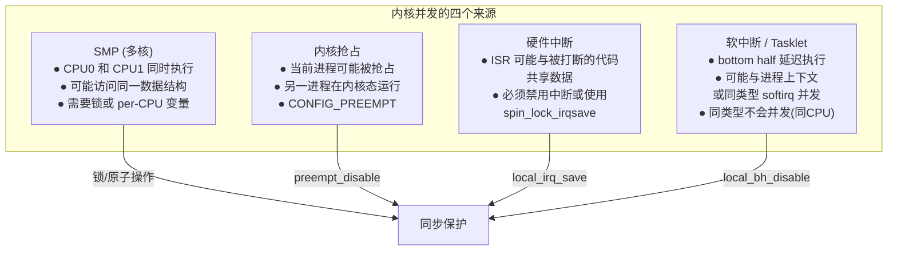
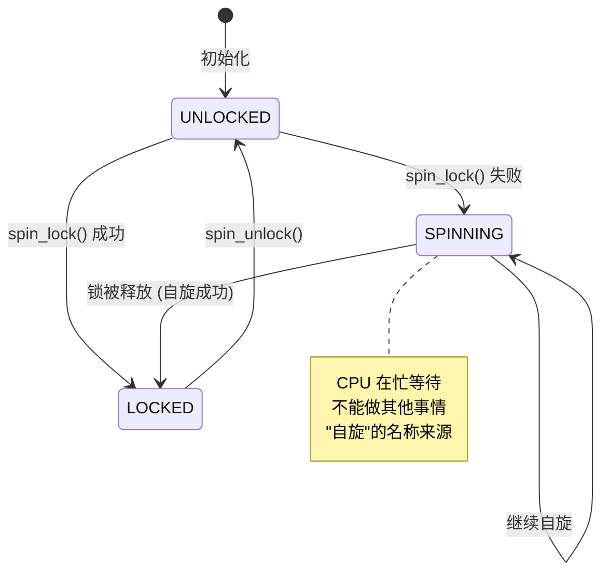

# 并发与同步  (Concurrency and Synchronization)
---

##  章节概述

>  **本章是内核编程中最容易出错的领域**。Linux 内核运行在高度并发的环境中：多个 CPU 核心同时执行内核代码、中断随时可能发生、内核线程在后台运行。没有正确的同步机制，内核数据会在一瞬间被破坏——而且这些 bug 极难复现和调试。

并发编程是 C 语言最棘手的挑战之一。C 语言本身不提供任何并发安全机制——编译器不知道哪些变量被多线程访问，不会警告数据竞争。内核开发者必须依赖一套精心设计的同步原语来保证正确性。

本章内容：
- **内核中的并发源**：SMP、抢占、中断、软中断
- **原子操作**：atomic_t、bit 原子操作、内存屏障
- **自旋锁（Spinlock）**：实现原理、使用场景、局限性
- **互斥锁（Mutex）与信号量**：可睡眠的锁
- **RCU（Read-Copy-Update）**：Linux 同步的皇冠明珠
- **内存屏障与顺序**：CPU 乱序执行和编译优化
- **死锁**：原因、检测、避免
- **Rust 的并发安全**：所有权系统如何解决这些挑战

**前置要求**：
- 已学完 [[../../c语言教程/2深化/05_位运算与硬件操作|位运算与硬件操作]]（理解原子位操作）
- 已学完 [[../../c语言教程/2深化/04_函数指针与回调|函数指针与回调]]（理解 RCU 回调）
- 已学完 [[05_中断与系统调用|中断与系统调用]]（理解中断上下文）
- 建议参考 Linux 内核 Rust 支持文档（对比 Rust 的并发安全模型）

---
###  第一节：内核中的并发源
---

### 1.1 四种并发源



### 1.2 并发问题示例

```c
// ============================================
// 经典竞争条件: 两个 CPU 同时执行此代码
// ============================================

// 共享数据结构
struct shared_data {
    unsigned long counter;
    struct list_head pending_list;
    void *buffer;
};
static struct shared_data global_data;

// BUG! 两个 CPU 同时调用此函数
static void dangerous_increment(void)
{
    // CPU0: 读取 counter = 5
    // CPU1: 读取 counter = 5
    // CPU0: 计算 5 + 1 = 6, 写入 counter = 6
    // CPU1: 计算 5 + 1 = 6, 写入 counter = 6
    // 结果: counter = 6 (应该是 7!)
    global_data.counter++;
}

// BUG! 并发链表操作
static void dangerous_list_add(int data)
{
    struct node *n = kmalloc(sizeof(*n), GFP_ATOMIC);
    n->data = data;
    
    // 如果两个 CPU 同时执行 list_add,
    // 链表的 prev/next 指针可能被破坏!
    list_add(&n->list, &global_data.pending_list);
}

// BUG! 被中断打断
static void dangerous_isr_data(void)
{
    // 假设 ISR 会修改 buffer 内容
    // 如果此函数在访问 buffer 时被中断打断,
    // 且 ISR 释放了 buffer → UAF!
    if (global_data.buffer) {
        memcpy(local_buf, global_data.buffer, size);
        // ← 这里发生中断, ISR 中 kfree(global_data.buffer)!
    }
}
```

### 1.3 并发类型总结

| 并发场景 | 何时发生 | 保护手段 |
|---------|---------|---------|
| 进程 vs 进程 | 多核同时调用同一系统调用 | spin_lock / mutex |
| 进程 vs 中断 | ISR 与被打断的进程代码 | spin_lock_irqsave |
| 中断 vs 中断 | 同 IRQ 在多核同时触发 | spin_lock |
| 中断 vs softirq | ISR 修改了 softirq 读的数据 | local_bh_disable |
| 进程 vs softirq | 进程上下文与软中断处理函数 | spin_lock_bh |

```c
// 练习 1: 识别并发问题
// 阅读以下代码，找出并发问题:
//
// static int device_count = 0;
//
// void register_device(struct device *dev) {
//     dev->id = device_count++;
//     list_add(&dev->list, &device_list);
//     device_count++;
// }
//
// void unregister_device(struct device *dev) {
//     if (device_count > 0) {
//         list_del(&dev->list);
//         device_count--;
//         kfree(dev);
//     }
// }
//
// irqreturn_t data_ready_isr(int irq, void *dev_id) {
//     struct device *dev = dev_id;
//     dev->data_available = 1;
//     if (dev->reader_pid != 0)
//         kill_pid(find_vpid(dev->reader_pid), SIGIO, 1);
//     return IRQ_HANDLED;
// }
//
// 问题:
// 1. device_count++ 在 SMP 上安全吗?
// 2. list_add/list_del 有保护吗?
// 3. 如果 ISR 发生在 register_device 的 list_add 之前, 会怎样?
// 4. 如果 unregister_device 在中断上下文中被调用，kfree 安全吗?
```

---
###  第二节：原子操作
---

### 2.1 atomic_t —— 原子整数

```c
// ============================================
// atomic_t: 内核原子变量
// 定义在 include/linux/atomic.h (或 include/asm-generic/atomic.h)
// ============================================

#include <linux/atomic.h>

// 声明和初始化
atomic_t my_counter = ATOMIC_INIT(0);  // 初始化为 0

// 基本操作 (所有这些操作都是原子的!)
atomic_set(&my_counter, 42);           // 设置值
int val = atomic_read(&my_counter);    // 读取值

// 原子加法
atomic_inc(&my_counter);               // my_counter += 1
atomic_dec(&my_counter);               // my_counter -= 1
atomic_add(5, &my_counter);            // my_counter += 5
atomic_sub(3, &my_counter);            // my_counter -= 3

// 返回旧值/新值的版本
int old = atomic_inc_return(&my_counter);  // 返回递增后的值
int old = atomic_fetch_inc(&my_counter);   // 返回递增前的值
int old = atomic_dec_return(&my_counter);  // 返回递减后的值
int new = atomic_add_return(10, &my_counter); // 返回加后的值

// compare-and-swap (CAS) —— 原子比较并交换
// 如果 *v == oldval, 则设置 *v = newval, 返回 true
// 否则不修改, 返回 false
if (atomic_cmpxchg(&my_counter, 42, 100) == 42) {
    // my_counter 原来是 42, 现在改为 100
} else {
    // my_counter 不是 42, 没有修改
    // atomic_cmpxchg 返回修改前的实际值
}

// 实现原理 (x86-64 使用 LOCK 前缀):
// atomic_inc 编译为:
//   lock incl (%rdi)   ← LOCK 前缀确保原子性
//
// atomic_add_return 编译为:
//   lock xadd %eax, (%rdi)  ← LOCK + XADD 指令

// 对比普通变量的非原子性:
// int counter = 0;
// counter++;  // 编译为: mov (%rdi),%eax; inc %eax; mov %eax,(%rdi)
//             // 三条指令 → CPU 可能在中间被打断!
```

### 2.2 原子位操作

```c
// ============================================
// 原子位操作 —— 直接操作 unsigned long 的位
// 用于标志位、状态位等场景
// ============================================

#include <linux/bitops.h>

unsigned long flags = 0;

// 设置/清除/测试位
set_bit(3, &flags);        // flags |= (1 << 3) → 原子地
clear_bit(3, &flags);      // flags &= ~(1 << 3)
change_bit(5, &flags);     // flags ^= (1 << 5) → 翻转位

// 测试位
if (test_bit(3, &flags))
    printk("bit 3 is set\n");

// 原子地测试并设置 (test-and-set)
// 返回旧的位值, 并设置该位
if (!test_and_set_bit(LOCK_BIT, &flags)) {
    // 位之前是 0, 现在设为 1 —— 我们获得了"锁"
} else {
    // 位已经是 1 —— 别人持有"锁"
}

// 原子地测试并清除
if (test_and_clear_bit(DATA_READY_BIT, &flags)) {
    // 位之前是 1, 现在清除 —— 处理数据
    process_data();
}

// 查找第一个被设置/清除的位
int first_set = find_first_bit(&flags, BITS_PER_LONG);
// 这在 BITS_PER_LONG 位内查找
// 单寄存器的版本: ffs — 编译为 bsf 指令 (一条指令!)
int first_one = ffs(flags);  // 返回第一个 1 的索引 (1-based)

// 使用场景: 标志位数组
#define FLAG_DATA_READY    0
#define FLAG_IRQ_ENABLED   1
#define FLAG_DEVICE_BUSY   2
#define FLAG_BUFFER_FULL   3

set_bit(FLAG_IRQ_ENABLED, &flags);
if (test_bit(FLAG_DATA_READY, &flags)) { ... }
clear_bit(FLAG_DEVICE_BUSY, &flags);
```

### 2.3 原子操作 vs 锁

```c
// ============================================
// 何时使用原子操作, 何时使用锁
// ============================================

// 使用原子操作:
//  单一变量的简单加减
//  设置/清除标志位
//  引用计数 (atomic_inc / atomic_dec_and_test)
//  性能最关键路径

// 使用锁 (spinlock / mutex):
//  保护多个相关变量 (临界区)
//  保护复杂数据操作 (如链表操作)
//  需要长时间持有的保护
//  需要与数据结构紧耦合的保护

// 示例: 使用原子操作的引用计数
struct my_object {
    atomic_t refcount;
    // ... 数据 ...
};

struct my_object *obj_get(struct my_object *obj)
{
    if (obj)
        atomic_inc(&obj->refcount);  // 原子地增加引用
    return obj;
}

void obj_put(struct my_object *obj)
{
    if (obj && atomic_dec_and_test(&obj->refcount)) {
        // refcount 降到 0 → 我们是最后一个使用者 → 安全释放
        kfree(obj);
    }
}
// atomic_dec_and_test: 原子地递减, 如果新值为 0 返回 true
// 这是 RCU 和 lock-free 编程的基石
```

---
###  第三节：自旋锁 (Spinlock)
---

### 3.1 自旋锁的本质

自旋锁是最基本的互斥机制。当锁不可用时，CPU 在一个紧密循环中反复检查（"自旋"），直到锁可用。



### 3.2 自旋锁的使用

```c
// ============================================
// 自旋锁完整使用指南
// ============================================

#include <linux/spinlock.h>

// 定义和初始化
DEFINE_SPINLOCK(my_lock);        // 静态定义 + 初始化
// 或动态初始化:
// spinlock_t my_lock;
// spin_lock_init(&my_lock);

struct my_device {
    spinlock_t lock;             // 保护此设备数据结构的锁
    int counter;
    struct list_head queue;
    // ... 由此锁保护的所有字段
};

// =============================================
// 基础使用: spin_lock / spin_unlock
// =============================================
void process_request(struct my_device *dev, int data)
{
    unsigned long flags;
    
    // spin_lock: 获取自旋锁
    // 如果锁已经被持有, 忙等待直到获得
    spin_lock(&dev->lock);
    
    // === 临界区开始 ===
    // 此时保证独占访问 dev 的所有锁保护字段
    dev->counter++;
    list_add_tail(&dev->queue, ...);
    // === 临界区结束 ===
    
    spin_unlock(&dev->lock);
}

// =============================================
// 中断安全版本: spin_lock_irqsave
// =============================================
// 问题: 如果进程上下文持有自旋锁时发生中断?
// → ISR 也在同一 CPU 上执行, 也请求同一把锁 → 死锁!
// 因为 ISR 不会让出 CPU, 锁永远不会被释放
//
// 解决: 获取锁的同时禁用本地中断

void process_request_irq_safe(struct my_device *dev, int data)
{
    unsigned long flags;
    
    // spin_lock_irqsave: 获取锁 + 保存并禁用本地中断
    spin_lock_irqsave(&dev->lock, flags);
    
    // 临界区操作...
    dev->counter++;
    
    // spin_unlock_irqrestore: 释放锁 + 恢复之前的本地中断状态
    spin_unlock_irqrestore(&dev->lock, flags);
}

// =============================================
// Bottom half 安全版本: spin_lock_bh
// =============================================
// 禁止本地软中断 (softirq 和 tasklet), 但允许硬件中断

void process_bottom_half_safe(struct my_device *dev)
{
    spin_lock_bh(&dev->lock);
    // 软中断不会在这期间执行 (在当前 CPU 上)
    dev->counter++;
    spin_unlock_bh(&dev->lock);
}

// ============================================
// 选择指南:
//
// spin_lock()              进程 vs 进程 (SMP)
// spin_lock_irq()          进程 vs 中断
// spin_lock_irqsave()      进程 vs 中断 (推荐, 可嵌套)
// spin_lock_bh()           进程 vs bottom half
//
// 规则: 始终使用能保护你免受当前环境中最强并发源影响的变体
//       如需在中断处理中使用锁: 使用 _irqsave
```

### 3.3 自旋锁的实现原理

```c
// ============================================
// 自旋锁的实现 (简化, x86-64)
// 实际代码在 include/asm-generic/qspinlock.h 和 kernel/locking/qspinlock.c
// ============================================

// 经典自旋锁实现 (ticket spinlock):
typedef struct {
    union {
        u32 val;
        struct {
            u16 owner;   // 当前持有者编号
            u16 next;    // 下一个可用的编号
        };
    };
} arch_spinlock_t;

static inline void arch_spin_lock(arch_spinlock_t *lock)
{
    u32 val;
    
    // 1. 原子地获取 ticket (next) 并递增
    //    使用 fetch-and-add (xadd)
    asm volatile("lock xaddl %0, %1"
                 : "+r"(val), "+m"(lock->val)
                 :: "memory");
    // val 包含旧的 next 值 (我们的 ticket 号)
    
    // 2. 自旋等待 owner 变成我们的 ticket 号
    while (lock->owner != (u16)val) {
        // cpu_relax: PAUSE 指令 → 降低功耗 + 避免内存序冲突
        // 还提示 CPU 我们在自旋中, 让它可以用 MWAIT 等省电状态
        cpu_relax();
    }
    
    // 获得锁! 我们是这个 ticket 号的 owner
}

static inline void arch_spin_unlock(arch_spinlock_t *lock)
{
    // 释放锁: 增加 owner (允许下一个 ticket 持有锁)
    asm volatile("incw %0" : "+m"(lock->owner) :: "memory");
}

// 现代内核使用 MCS lock / qspinlock (队列自旋锁)
// - ticket lock 在超过 8 核时性能下降 (缓存一致性协议开销)
// - qspinlock 使用 MCS 队列减少缓存乒乓效应
// 实现: kernel/locking/qspinlock.c
```

### 3.4 自旋锁的规则

```c
// 自旋锁的关键规则:
//
// 1. 持有自旋锁时不能睡眠!
//    原因: 如果睡眠, 等待此锁的其他 CPU 也会自旋等待
//    直到调度器重新调度当前 CPU → 浪费 CPU 时间
//    可能死锁如果调度器也需要此锁
//
// 2. 持有自旋锁的时间应该尽可能短!
//    原因: CPU在自旋等待锁时不能做其他有用工作
//    长时间持有自旋锁会严重影响系统吞吐量
//
// 3. 持有自旋锁时调用可能睡眠的函数 → 内核会警告
//    (如果配置了 CONFIG_DEBUG_ATOMIC_SLEEP)
//    sleep while atomic bug!
//
// 4. 不要递归获取同一个自旋锁 (spinlock 不是递归锁)
//    会立即死锁!
//
// 5. 获取多个锁时, 始终以相同顺序获取
//    防止 AB-BA 死锁 (见第五节)

// 错误示例:
spin_lock(&lock_a);
// ... lots of work ...  ← 错误! 临界区太长
// kmalloc(..., GFP_KERNEL);  ← 错误! 可能睡眠
// msleep(100);               ← 错误! 睡眠
// schedule();                ← 错误! 让出 CPU
kfree(ptr);
spin_unlock(&lock_b);  // ← 错误! 锁不匹配!
```

---
###  第四节：互斥锁与信号量 —— 可睡眠的锁
---

### 4.1 mutex —— 内核互斥锁

```c
// ============================================
// 互斥锁 (mutex): 允许持有者睡眠
// ============================================

#include <linux/mutex.h>

// 定义
DEFINE_MUTEX(my_mutex);
// 或动态初始化:
// struct mutex my_mutex;
// mutex_init(&my_mutex);

// 获取和释放 (进程上下文, 可以睡眠)
mutex_lock(&my_mutex);                        // 阻塞获取
int ret = mutex_lock_interruptible(&my_mutex); // 可被信号中断
int ret = mutex_trylock(&my_mutex);            // 非阻塞尝试

mutex_unlock(&my_mutex);

// 使用示例: 保护的临界区可以执行耗时操作
static ssize_t device_read(struct file *filp, char __user *buf,
                            size_t count, loff_t *ppos)
{
    struct my_device *dev = filp->private_data;
    
    // 使用 mutex (可以睡眠)
    if (mutex_lock_interruptible(&dev->mutex))
        return -ERESTARTSYS;  // 被信号中断
    
    // 临界区: 可以调用可能睡眠的函数
    while (buffer_empty(dev)) {
        mutex_unlock(&dev->mutex);
        // 等待数据到来... 睡眠在此
        if (wait_event_interruptible(dev->waitq, !buffer_empty(dev)))
            return -ERESTARTSYS;
        if (mutex_lock_interruptible(&dev->mutex))
            return -ERESTARTSYS;
    }
    
    // 可以调用 kmalloc(..., GFP_KERNEL) — 可能睡眠
    void *tmp = kmalloc(count, GFP_KERNEL);
    
    // 耗时操作...
    
    mutex_unlock(&dev->mutex);
    return ret;
}

// ============================================
// mutex vs spinlock 选择指南
// ============================================
// 
// 使用 spinlock 当:
//   - 临界区很短 (几微秒以内)
//   - 持有者在中断上下文 (不能睡眠!)
//   - 不能容忍上下文切换开销
//
// 使用 mutex 当:
//   - 临界区可能很长
//   - 可能需要在临界区内睡眠
//   - 只在进程上下文中使用
//   - 需要可中断的等待
```

### 4.2 信号量 (Semaphore)

```c
// ============================================
// 信号量: 允许多个并发持有者
// ============================================

#include <linux/semaphore.h>

// 定义 (初始计数 = 同时允许的持有者)
DEFINE_SEMAPHORE(my_sem);  // 初始计数 = 1 (二元信号量 = 类似互斥锁)

// 动态定义
struct semaphore sem;
sema_init(&sem, 5);  // 初始计数 = 5, 最多 5 个线程同时进入

// 获取信号量 (P 操作, "尝试")
// down: 减少计数, 如果计数 <= 0 则睡眠
void down(struct semaphore *sem);
int down_interruptible(struct semaphore *sem);
int down_killable(struct semaphore *sem);
int down_trylock(struct semaphore *sem);
int down_timeout(struct semaphore *sem, long jiffies);

// 释放信号量 (V 操作, "通知")
// up: 增加计数, 如果计数 <= 0 则唤醒等待者
void up(struct semaphore *sem);

// 使用场景:
// 1. 生产者-消费者: sem = 缓冲区空闲槽数
// 2. 限流: sem = 最大并发用户数
// 3. 资源池: sem = 可用资源数

// 信号量 vs 互斥锁:
//   - 信号量的计数可以 > 1, 允许多个持有者
//   - mutex 严格要求同一时间只有一个持有者
//   - mutex 有 owner 概念 (只有锁的持有者才能释放)
//     信号量的 up/down 可以不在同一线程
```

### 4.3 完成变量 (Completion)

```c
// ============================================
// Completion: 轻量级的"事件通知"机制
// 用于等待某个事件完成
// ============================================

#include <linux/completion.h>

// 定义
DECLARE_COMPLETION(done);
// 或动态:
// struct completion done;
// init_completion(&done);

// 等待方: 睡眠直到事件完成
void wait_for_completion(struct completion *c);
unsigned long wait_for_completion_timeout(struct completion *c,
                                           unsigned long timeout);
int wait_for_completion_interruptible(struct completion *c);

// 通知方: 唤醒等待者
void complete(struct completion *c);              // 唤醒一个等待者
void complete_all(struct completion *c);          // 唤醒所有等待者

// 典型使用: 设备初始化/清理等待
static struct completion probe_done;

static int device_thread_fn(void *data)
{
    // 执行初始化...
    // ...
    // 初始化完成, 通知主线程
    complete(&probe_done);
    return 0;
}

static int device_probe(struct platform_device *pdev)
{
    init_completion(&probe_done);
    
    // 创建线程执行初始化
    kthread_run(device_thread_fn, NULL, "device_init");
    
    // 等待初始化完成 (可选超时)
    if (!wait_for_completion_timeout(&probe_done, 5 * HZ)) {
        dev_err(&pdev->dev, "Device init timeout\n");
        return -ETIMEDOUT;
    }
    
    return 0;
}
```

---
###  第五节：RCU —— Read-Copy-Update
---

### 5.1 RCU 的核心思想


RCU 是 Linux 内核中最精妙的同步机制——它允许读者（readers）无需任何锁开销就能安全地访问共享数据。writer 创建新数据副本，修改后原子地切换指针，然后等待所有现存的读者完成后再释放旧数据。

### 5.2 RCU API 与使用

```c
// ============================================
// RCU 完整使用示例
// ============================================

#include <linux/rcupdate.h>
#include <linux/slab.h>

// 假设我们有一个配置数据结构
struct config_data {
    int timeout;
    int max_retries;
    char name[64];
    // ...
};

// 全局指针 —— 读者通过 RCU 访问
static struct config_data __rcu *global_config;

// ============================================
// Reader 端: 读取配置 (无锁!)
// ============================================

int get_timeout(void)
{
    struct config_data *cfg;
    int timeout;
    
    // 1. 进入 RCU 读临界区
    rcu_read_lock();
    
    // 2. 安全地读取 RCU 保护的指针
    //    rcu_dereference: 确保编译器不优化掉此读取
    //    产生必要的内存屏障
    cfg = rcu_dereference(global_config);
    
    // 3. 安全地访问数据
    //    在这一刻, 即使 writer 正在修改 global_config,
    //    cfg 仍然指向有效的旧数据
    if (cfg)
        timeout = cfg->timeout;
    else
        timeout = 30;  // default
    
    // 4. 离开 RCU 读临界区
    rcu_read_unlock();
    
    // 注意: 离开读临界区后, 不能再使用 cfg!
    // writer 可能已经释放了旧数据
    return timeout;
}

// 读者规则:
// 1. rcu_read_lock / rcu_read_unlock 之间
// 2. 不能睡眠
// 3. 不能阻塞
// 4. 读取操作极快 (无锁开销)

// ============================================
// Writer 端: 更新配置
// ============================================

int update_config(int new_timeout)
{
    struct config_data *old_cfg, *new_cfg;
    
    // 1. 分配新配置
    new_cfg = kmalloc(sizeof(*new_cfg), GFP_KERNEL);
    if (!new_cfg)
        return -ENOMEM;
    
    // 2. 复制旧配置到新配置
    rcu_read_lock();
    old_cfg = rcu_dereference(global_config);
    if (old_cfg)
        *new_cfg = *old_cfg;  // 复制所有字段
    else
        memset(new_cfg, 0, sizeof(*new_cfg));
    rcu_read_unlock();
    
    // 3. 修改新配置
    new_cfg->timeout = new_timeout;
    
    // 4. 原子地切换指针
    //    rcu_assign_pointer: 包含必要的内存屏障
    //    确保新数据对所有 CPU 可见
    rcu_assign_pointer(global_config, new_cfg);
    
    // 5. 等待宽限期 (所有旧读者完成)
    //    在此期间, old_cfg 仍然有效
    //    synchronize_rcu 会睡眠等待
    synchronize_rcu();
    
    // 6. 安全释放旧配置
    //    现在可以确定没有读者在访问 old_cfg
    kfree(old_cfg);
    
    return 0;
}

// Writer 也可以在回调中释放旧数据 (避免阻塞在 synchronize_rcu)
static void free_old_config(struct rcu_head *rcu)
{
    struct config_data *cfg = container_of(rcu, struct config_data, rcu);
    kfree(cfg);
}

int update_config_async(int new_timeout)
{
    struct config_data *old_cfg, *new_cfg;
    
    new_cfg = kmalloc(sizeof(*new_cfg), GFP_KERNEL);
    if (!new_cfg)
        return -ENOMEM;
    
    rcu_read_lock();
    old_cfg = rcu_dereference(global_config);
    if (old_cfg)
        *new_cfg = *old_cfg;
    rcu_read_unlock();
    
    new_cfg->timeout = new_timeout;
    rcu_assign_pointer(global_config, new_cfg);
    
    //  异步回调: 不等 synchronize_rcu
    // 当宽限期结束后, 自动调用 free_old_config
    if (old_cfg)
        call_rcu(&old_cfg->rcu, free_old_config);
    
    return 0;
}
```

### 5.3 RCU 链表操作

```c
// ============================================
// RCU 结合链表 —— 最常用的模式
// ============================================

#include <linux/rculist.h>

struct my_entry {
    int key;
    int value;
    struct list_head list;
    struct rcu_head rcu;  // RCU 回调所需的字段
};

static LIST_HEAD(my_list);  // 链表头
static DEFINE_SPINLOCK(my_list_lock);  // writer 锁

// Reader: 遍历链表 (无锁!)
struct my_entry *lookup_entry(int key)
{
    struct my_entry *entry;
    
    rcu_read_lock();
    
    // list_for_each_entry_rcu: RCU 安全的链表遍历
    list_for_each_entry_rcu(entry, &my_list, list) {
        if (entry->key == key) {
            rcu_read_unlock();
            return entry;  // 调用者必须在使用期间持有 rcu_read_lock
        }
    }
    
    rcu_read_unlock();
    return NULL;  // 未找到
}

// Writer: 添加条目
int add_entry(int key, int value)
{
    struct my_entry *entry = kmalloc(sizeof(*entry), GFP_KERNEL);
    if (!entry) return -ENOMEM;
    
    entry->key = key;
    entry->value = value;
    
    spin_lock(&my_list_lock);
    list_add_tail_rcu(&entry->list, &my_list);
    spin_unlock(&my_list_lock);
    
    return 0;
}

// Writer: 删除条目 (需要 RCU 宽限期)
void del_entry(struct my_entry *entry)
{
    spin_lock(&my_list_lock);
    list_del_rcu(&entry->list);  // RCU 安全的链表删除
    spin_unlock(&my_list_lock);
    
    // 等待所有可能引用了 entry 的读者完成
    synchronize_rcu();
    
    // 安全释放
    kfree(entry);
}

// 异步删除版本:
static void free_entry_rcu(struct rcu_head *rcu)
{
    struct my_entry *entry = container_of(rcu, struct my_entry, rcu);
    kfree(entry);
}

void del_entry_async(struct my_entry *entry)
{
    spin_lock(&my_list_lock);
    list_del_rcu(&entry->list);
    spin_unlock(&my_list_lock);
    
    // 宽限期结束后自动回调 free_entry_rcu
    call_rcu(&entry->rcu, free_entry_rcu);
}
```

### 5.4 宽限期 (Grace Period) 详解

```c
// ============================================
// RCU 宽限期是什么?
// ============================================
//
// 宽限期开始于 writer 执行 rcu_assign_pointer
// 结束于所有在宽限期开始前已进入 rcu_read_lock 的
// CPU 都离开了 rcu_read_unlock
//
// 换句话说:
//   宽限期 = 确保所有现有的读临界区都已结束
//
// 如何检测宽限期结束?
//   - rcu_read_lock / unlock 不做任何内存操作
//   - 但它们在禁止抢占 (禁用调度器)
//   - 所以不能进行上下文切换
//   - RCU 在每个 CPU 上跟踪 quiescent state
//     (quiescent state = 经历了上下文切换 or 进入 idle)
//   - 所有 CPU 都经历了一次 quiescent state → 宽限期结束

// synchronize_rcu() 内部做的事:
//   1. 注册一个等待宽限期结束的回调
//   2. 睡眠等待
//   3. 被 RCU 子系统在宽限期结束时唤醒
//
// 开销: synchronize_rcu() 可能花费数毫秒到数百毫秒

// RCU 的威力:
// - 读者开销: 几乎为零 (只在某些架构上有小内存屏障)
// - 读者不需要原子操作
// - 读者不需要锁
// - 读者可以非常高频地执行
// - 适用于读多写少的场景
//   (如路由表、系统调用表、VFS 缓存等)

// 练习 2: RCU 实验
// 1. 编写内核模块, 创建一个 RCU 保护的计数器
//    - 100 个 reader 线程, 每个读取 1000000 次
//    - 1 个 writer 线程, 每 100ms 更新一次指针
//    - 使用 ktime 测量 reader 读操作的平均开销
//
// 2. 对比: 用读-写自旋锁 (rwlock) 重复同样实验
//    计算两种方案的 reader throughput 差异
//
// 3. 使用 perf 测量:
//    sudo perf stat -e L1-dcache-loads,L1-dcache-misses
//    观察 RCU 方案是否产生更少的缓存缺失
```

---
###  第六节：内存屏障与顺序
---

### 6.1 重排序问题

```c
// ============================================
// CPU 和编译器都可能重排序你的代码!
// ============================================

// 假设处理器 0 执行这个:
// x = 1;
// y = 1;

// 处理器 1 执行这个:
// while (y != 1) ;  // 自旋等待
// assert(x == 1);

// 问题: assert 可能失败吗?
// 答: 可能!
//
// 原因:
//   1. CPU 可能交换 x=1 和 y=1 的写入顺序
//      (因为它们是独立的内存地址, CPU 的存储缓冲区可以
//       先提交 y 再提交 x)
//   2. 编译器也可能在优化中交换它们的顺序
//
// 这就是为什么需要内存屏障 (Memory Barrier) 和
// 正确的锁使用来保证内存顺序
```

### 6.2 内存屏障类型

```c
// ============================================
// Linux 内存屏障
// ============================================

// 编译器屏障: 只阻止编译器重排序, 不阻止 CPU
barrier();

// 全屏障: 阻止所有重排序 (编译器和 CPU)
mb();   // 全内存屏障 (mfence on x86, dmb sy on ARM)
rmb();  // 读屏障 (lfence on x86, dmb ld on ARM)
wmb();  // 写屏障 (sfence on x86, dmb st on ARM)

// 更轻量级的屏障:
smp_mb();   // 只在 SMP 系统上有效
smp_rmb();
smp_wmb();

// ============================================
// x86 的内存模型 (相对强的模型)
// ============================================
//
// x86 是 Total Store Order (TSO) 模型:
//   - 读-读 不重排序
//   - 读-写 不重排序
//   - 写-写 不重排序 (存储按 FIFO 顺序提交)
//   - 写-读 可能重排序! (存储缓冲区)
//     (后面的读可能提前到前面的写之前完成)
//
// 因此 x86 上:
//   smp_rmb() → 空操作 (不需要)
//   smp_wmb() → 空操作 (不需要)
//   smp_mb()  → mfence 或 lock addl $0, (%rsp)

// ============================================
// ARM64 的内存模型 (弱内存模型)
// ============================================
//
// ARM 是 Relaxed Memory Order:
//   几乎所有的重排序都可能发生
//   必须有显式的内存屏障指令
//   dmb ish (Inner SHareable domain barrier)
//   dmb ishld (读屏障)
//   dmb ishst (写屏障)
//
// 这就是为什么"可移植的锁实现"必须包含内存屏障
// — 因为不同架构的内存排序模型差异巨大!
```

### 6.3 内存屏障的实际使用

```c
// ============================================
// 锁的实现中隐含内存屏障
// ============================================

// spin_lock() 隐含 acquire 语义:
//   获取锁后的所有内存操作不会被重排序到获取锁之前
//   相当于: 获取锁 + smp_mb() (获得所有之前的内存更新)
//
// spin_unlock() 隐含 release 语义:
//   释放锁前的所有内存操作不会被重排序到释放锁之后
//   相当于: smp_mb() (提交所有待处理的内存更新) + 释放锁

// 示例: 生产者-消费者 (不依赖锁时需要显式屏障)
volatile int data_ready = 0;
int shared_data;

// 生产者 (CPU0):
shared_data = 42;
smp_wmb();  //  确保 shared_data 的写入在 data_ready 之前
data_ready = 1;

// 消费者 (CPU1):
while (data_ready != 1)
    cpu_relax();  // 等待...
smp_rmb();  //  确保读取 data_ready 后能看到 shared_data 的写入
assert(shared_data == 42);  // 现在保证成功

// 注意: 使用自旋锁后不需要手动屏障!
// spin_lock 和 rcu_assign_pointer 内部自动包含必要的屏障
// 通常只在 lock-free 编程时需要手动内存屏障
```

---
###  第七节：死锁
---

```c
// ============================================
// 死锁的经典场景
// ============================================

// 1. AB-BA 死锁 (最常见的多锁死锁)
//
// 线程A:                  线程B:
//   spin_lock(&lock_a);     spin_lock(&lock_b);
//   spin_lock(&lock_b);     spin_lock(&lock_a);  // 死锁!
//   ...
//   spin_unlock(&lock_b);   spin_unlock(&lock_a);
//   spin_unlock(&lock_a);   spin_unlock(&lock_b);
//
// 解决: 始终以相同顺序获取锁

// 2. 自死锁 (递归获取不可重入锁)
//
//   spin_lock(&lock);
//   // ...
//   spin_lock(&lock);  // 死锁! spinlock 不可重入
//
// 如果需要递归, 使用:
//   rwlock (read/write lock, 同一线程可多次获取读锁)

// 3. 中断上下文死锁
//
// 进程上下文:              中断上下文:
//   spin_lock(&lock);
//   ...          ← 1. 发生中断!
//                     spin_lock(&lock);  // 永远等待! (同 CPU)
//
// 解决: spin_lock_irqsave 在获取锁时禁用中断

// 4. 资源分配死锁
//
// 分配两个对象 A 和 B, 都需要从同一内存池分配
// 如果池只剩下一个对象 → 可能死锁
//
// 解决: 使用 GFP_ATOMIC 或在分配关键资源前预留

// ============================================
// 内核死锁检测工具: lockdep
// ============================================
//
// lockdep (Lock Dependency Validator):
//   跟踪所有锁的 获取顺序 和 中断状态
//   构建锁的依赖关系图
//   在运行时检测潜在的循环依赖 (死锁可能性)
//
// 启用: CONFIG_PROVE_LOCKING=y
// 查看报告: dmesg | grep "possible circular locking dependency"

// lockdep 检测的 AB-BA 死锁模板:
// 
// ======================================================
// WARNING: possible circular locking dependency detected
// ======================================================
// CPU0                    CPU1
// ----                    ----
// lock(A);                lock(B);
// lock(B);                lock(A);
//
// *** DEADLOCK ***
```

```c
// 练习 3: 死锁实验
// 1. 编写内核模块, 故意制造 AB-BA 死锁:
//    - 创建 2 个 spinlock
//    - 创建 2 个内核线程: 线程A 先获取 lock1 再 lock2
//                         线程B 先获取 lock2 再 lock1
//    - 观察系统是否死锁
//
// 2. 启用 lockdep (CONFIG_PROVE_LOCKING), 
//    观察 lockdep 是否能在死锁发生前检测到潜在的循环依赖
//
// 3. 使用 lockdep 检查现有内核模块的锁使用:
//    - 加载你的设备驱动模块
//    - dmesg | grep lockdep
//    - 检查是否有锁顺序违规警告
```

---
###  第八节：Rust 并发安全对比
---

```c
// ============================================
// C 语言的并发陷阱 (编译器不帮你检查)
// ============================================

// 陷阱 1: 忘记获取锁
// struct my_dev *dev = ...;
// dev->counter++;  // BUG! 没有获取 dev->lock
// C 编译器: 完全没问题, 顺利编译
// 运行时: 数据竞争 (可能但不必定崩溃)

// 陷阱 2: 数据在锁外被访问
struct my_dev *dev;
// (某处获取了锁, 修改了 dev->ptr)
// ...
spin_unlock(&dev->lock);
void *tmp = dev->ptr;  // BUG! 没在锁保护下读取
// C 编译器: 没问题
// 运行时: 可能读一半被修改 (torn read) 或读到已释放的内存

// 陷阱 3: 使用已释放的内存 (UAF)
spin_lock(&dev->lock);
void *buf = dev->buf;
spin_unlock(&dev->lock);
// 此时另一个线程可能已经 kfree(dev->buf)!
memcpy(dest, buf, len);  // BUG! 使用已释放内存
// C 编译器: 没问题
// 运行时: 可能正常, 可能崩溃, 可能被利用

// ============================================
// Rust 的解决方案 (编译时检查)
// ============================================
//
//
// Rust 的所有权系统保证:
// 1. 要访问 Mutex 保护的数据, 必须先获取锁
//    let data = dev.lock.lock().unwrap();
//    data.counter += 1;  // 安全: 编译器保证锁已获取
//    // data 在作用域结束时自动释放锁 (MutexGuard Drop)
//
// 2. 防止数据在锁外被访问
//    // 以下在 Rust 中是编译错误!
//    // let tmp = dev.lock.lock().unwrap().ptr;
//    // drop(dev.lock);  // 锁释放
//    // use(tmp);        // 编译错误: tmp 引用了被释放的锁保护数据
//
// 3. 所有权 + 生命周期防止 UAF
//    let buf = dev.lock.lock().unwrap().buf;
//    // 另一个线程不能释放 buf, 因为 buf 仍在借用
//
// 4. Send / Sync trait 保证线程安全
//    编译器自动检查类型是否可以在线程间传递
//
// 当然, unsafe Rust 中所有这些保证都可以被绕过
// 这就是为什么内核中 Rust 代码中的 unsafe 块需要格外审查
```

---
##  章节测试
---

> [!question] 判断题 1
> RCU 允许读者在无锁开销的情况下读取共享数据，并且不需要任何 rcu_read_lock/rcu_read_unlock 调用。 （ ）
> - [ ]  正确
> - [ ]  错误
>
> > [!success]- 点击查看答案
> > 答案: 错误
> >
> > **解析**: 虽然 RCU 读者的锁开销几乎为零，但读者仍需调用 `rcu_read_lock()` 和 `rcu_read_unlock()` 来标记读临界区。这些调用在大多数架构上几乎不产生实际指令（只是禁止抢占），但它们告诉 RCU 系统"有读者在访问数据"。

> [!question] 判断题 2
> 持有 spinlock 时调用 kmalloc(..., GFP_KERNEL) 可能导致内核 sleep-while-atomic 警告。 （ ）
> - [ ]  正确
> - [ ]  错误
>
> > [!success]- 点击查看答案
> > 答案: 正确
> >
> > **解析**: GFP_KERNEL 可能会触发页回收（导致睡眠）。持有自旋锁时睡眠是不允许的——会触发 `CONFIG_DEBUG_ATOMIC_SLEEP` 检测（如果启用）。持有自旋锁时应使用 GFP_ATOMIC 或将内存分配移到锁外部。

> [!question] 判断题 3
> x86 架构的内存模型是弱一致的，需要频繁使用内存屏障来保证顺序。 （ ）
> - [ ]  正确
> - [ ]  错误
>
> > [!success]- 点击查看答案
> > 答案: 错误
> >
> > **解析**: x86 使用 TSO（Total Store Order）——它算是相对强的内存模型。写-写和读-读不重排序，只有写-读可能重排序（出于存储缓冲区优化的目的）。ARM 和 RISC-V 才是真正弱一致的内存模型。

> [!question] 判断题 4
> `spin_lock_irqsave` 在获取锁的同时禁用本地中断，并保存之前的中断状态。 （ ）
> - [ ]  正确
> - [ ]  错误
>
> > [!success]- 点击查看答案
> > 答案: 正确
> >
> > **解析**: `spin_lock_irqsave(&lock, flags)` 保存当前 CPU 的中断启用/禁用状态到 `flags` 中，然后禁用本地中断，再获取锁。`spin_unlock_irqrestore(&lock, flags)` 释放锁后恢复之前的中断状态。使用 `_irqsave` 变体是嵌套调用安全的（它不会无条件启用中断）。

> [!question] 判断题 5
> atomic_t 中 `atomic_read` 和 `atomic_set` 操作也是原子的（在 SMP 系统上）。 （ ）
> - [ ]  正确
> - [ ]  错误
>
> > [!success]- 点击查看答案
> > 答案: 正确
> >
> > **解析**: `atomic_read` 读取值时保证不会读到部分更新的值（在正确对齐的变量上），`atomic_set` 保证写入是原子完成的。但 `atomic_read` + `atomic_set` 的组合不是原子的——如果需要原子地"测试并修改"，应使用 `atomic_cmpxchg`。

> [!question] 判断题 6
> mutex_lock 可以在中断上下文中安全使用。 （ ）
> - [ ]  正确
> - [ ]  错误
>
> > [!success]- 点击查看答案
> > 答案: 错误
> >
> > **解析**: mutex_lock 会使调用者睡眠（如果锁不可用）。中断上下文中没有进程概念，睡眠会导致不可预期的行为（内核崩溃）。中断上下文只能使用 spinlock 或 `mutex_trylock`（不会睡眠）。

> [!question] 判断题 7
> 读-写自旋锁 (rwlock) 允许多个读者同时持有锁，但写者是互斥的。 （ ）
> - [ ]  正确
> - [ ]  错误
>
> > [!success]- 点击查看答案
> > 答案: 正确
> >
> > **解析**: rwlock 允许多个读者同时进入临界区（`read_lock`），但写者（`write_lock`）必须等待所有读者和写者离开。当写者等待时，新的读者是否允许进入取决于实现策略（可能偏爱写者以防止写饥饿）。

> [!question] 判断题 8
> AB-BA 死锁发生在两个锁以相同顺序被获取时。 （ ）
> - [ ]  正确
> - [ ]  错误
>
> > [!success]- 点击查看答案
> > 答案: 错误
> >
> > **解析**: AB-BA 死锁恰恰相反——它发生在两个锁以**不同顺序**被获取时。线程A先获取锁A再获取锁B，线程B先获取锁B再获取锁A。相同顺序是避免 AB-BA 死锁的方法。lockdep 专门检测这种不匹配的锁顺序。

> [!question] 判断题 9
> rcu_dereference 只会做一个简单的指针读取，没有额外行为。 （ ）
> - [ ]  正确
> - [ ]  错误
>
> > [!success]- 点击查看答案
> > 答案: 错误
> >
> > **解析**: `rcu_dereference` 不仅仅是读取指针。它在某些架构上插入内存屏障（如 Alpha），确保编译器不会优化掉读操作，并保证 CPU 在读取指针后能看到由 `rcu_assign_pointer` 确保可见的数据。它也做 sparse 注解检查（`__rcu` 类型检查）。

> [!question] 判断题 10
> C 语言的 `volatile` 关键字可以替代内核的锁来保证多线程数据安全。 （ ）
> - [ ]  正确
> - [ ]  错误
>
> > [!success]- 点击查看答案
> > 答案: 错误
> >
> > **解析**: volatile 只告诉编译器不要优化对此变量的读写（每次都访问内存），但它不提供原子性，不阻止 CPU 重排序，不解决并发访问的多步复合操作（read-modify-write）。`volatile` 用于硬件寄存器访问，不适用于多线程同步。详见 [[../../c语言教程/2深化/05_位运算与硬件操作|位运算与硬件操作]]。

---

> [!question] 选择题 1
> 以下哪个不是内核并发源？
> - [ ] A. SMP（多核同时执行）
> - [ ] B. 内核抢占（preemption）
> - [ ] C. 函数回调（callback functions）
> - [ ] D. 硬件中断
>
> > [!success]- 点击查看答案
> > 正确答案: C
> >
> > **解析**: 函数回调本身不是并发源——函数的调用者决定了执行上下文。内核的主要并发源是 SMP（多 CPU 同时运行）、内核抢占（被调度器切换）和中断（异步硬件事件）。softirq/tasklet 也是并发源的一种。

> [!question] 选择题 2
> 持有 spinlock 时可以使用哪个 flags 安全地分配内存？
> - [ ] A. GFP_KERNEL
> - [ ] B. GFP_ATOMIC
> - [ ] C. GFP_USER
> - [ ] D. GFP_FS
>
> > [!success]- 点击查看答案
> > 正确答案: B
> >
> > **解析**: 持有 spinlock 的上下文不能睡眠，必须使用 `GFP_ATOMIC`。GFP_KERNEL 和 GFP_USER 可能触发页回收（睡眠），GFP_FS 可能触发文件系统操作。GFP_ATOMIC 不睡眠，但可能更快返回失败。

> [!question] 选择题 3
> RCU 最适合哪种场景？
> - [ ] A. 写多读少
> - [ ] B. 读多写少
> - [ ] C. 读写频率相同
> - [ ] D. 只写不读
>
> > [!success]- 点击查看答案
> > 正确答案: B
> >
> > **解析**: RCU 的设计哲学是让读者几乎零开销（无锁、无原子操作），代价是写者的开销较大（复制数据、等待宽限期）。因此最适合读操作远多于写操作的场景（如路由表、系统调用表、文件系统元数据缓存）。

> [!question] 选择题 4
> 以下哪个 API 用于在进程上下文中等待一个条件（可中断睡眠）？
> - [ ] A. `spin_lock_irqsave`
> - [ ] B. `wait_event_interruptible`
> - [ ] C. `atomic_dec_and_test`
> - [ ] D. `rcu_read_lock`
>
> > [!success]- 点击查看答案
> > 正确答案: B
> >
> > **解析**: `wait_event_interruptible(wq, condition)` 使当前进程睡眠在等待队列 `wq` 上，直到 `condition` 为真或被信号唤醒。它返回 0 表示 condition 满足，返回 -ERESTARTSYS 表示被信号中断。`spin_lock_irqsave` 是锁操作，`atomic_dec_and_test` 是原子操作，`rcu_read_lock` 是 RCU 操作。

> [!question] 选择题 5
> atomic_cmpxchg(ptr, old, new) 的语义是？
> - [ ] A. 总是将 *ptr 设置为 new
> - [ ] B. 如果 *ptr == old，则设置 *ptr = new，并返回 old；否则不修改
> - [ ] C. 如果 *ptr == old，则比较 *ptr 与 old 然后什么都不做
> - [ ] D. 将 *ptr 设置为 old，然后检查是否等于 new
>
> > [!success]- 点击查看答案
> > 正确答案: B
> >
> > **解析**: CAS（Compare-And-Swap）是 lock-free 编程的基石。`atomic_cmpxchg` 原子地比较 *ptr 与 old，如果相等则设置为 new 并返回 old（表示成功）；如果不相等则不修改并返回 *ptr 的当前值（表示失败）。这是实现无锁栈、无锁队列、引用计数优化的基础。

> [!question] 选择题 6
> `synchronize_rcu()` 会做什么？
> - [ ] A. 释放所有 RCU 保护的指针
> - [ ] B. 等待所有已进入 RCU 读临界区的读者退出，然后返回
> - [ ] C. 强制所有 CPU 进入睡眠状态
> - [ ] D. 同步所有磁盘写入
>
> > [!success]- 点击查看答案
> > 正确答案: B
> >
> > **解析**: `synchronize_rcu()` 等待"宽限期"——确保所有在调用前已存在的 RCU 读临界区都已完成。在此期间调用者睡眠。返回后，调用者可以安全地释放被替换的旧数据，因为保证没有读者还在访问它。

> [!question] 选择题 7
> 内核中检测死锁的主要工具是什么？
> - [ ] A. valgrind
> - [ ] B. lockdep
> - [ ] C. gdb
> - [ ] D. perf
>
> > [!success]- 点击查看答案
> > 正确答案: B
> >
> > **解析**: lockdep（Lock Dependency Validator）是内核内建的锁依赖检测工具。它跟踪每个锁的获取顺序和中断状态，构建依赖图。如果检测到潜在的循环依赖（AB-BA 死锁可能性），会在 dmesg 中打印详细的死锁场景分析。配置选项为 `CONFIG_PROVE_LOCKING=y`。

> [!question] 选择题 8
> 以下关于 spinlock 和 mutex 的区别，哪个是正确的？
> - [ ] A. spinlock 可以在持有期间睡眠，mutex 不能
> - [ ] B. mutex 持有者可以睡眠，spinlock 持有者不能睡眠
> - [ ] C. mutex 可以在中断上下文中使用，spinlock 不能
> - [ ] D. 没有任何区别，可以互换使用
>
> > [!success]- 点击查看答案
> > 正确答案: B
> >
> > **解析**: mutex 允许持有者睡眠——当 mutex_lock 不能立即获取锁时，调用者睡眠等待。spinlock 持有者绝对不能睡眠——等待者会忙于自旋，睡眠会导致死锁。mutex 不能在中断上下文中使用（没有进程可睡眠）。

> [!question] 选择题 9
> 在 x86-64 架构上，哪个操作隐含了完整的内存屏障（full memory barrier）？
> - [ ] A. `atomic_read`
> - [ ] B. `spin_lock` (获取)
> - [ ] C. `atomic_set`
> - [ ] D. `ACCESS_ONCE`
>
> > [!success]- 点击查看答案
> > 正确答案: B
> >
> > **解析**: `spin_lock` 获取操作隐含了 acquire 语义——即在此操作之前的所有内存读取不会被重排序到之后。`spin_unlock` 释放操作隐含了 release 语义——在此操作之后的所有内存写入不会被重排序到之前。而 `atomic_read` 和 `atomic_set` 不包含隐式屏障（除非使用了特殊的 `_acquire` / `_release` 变体）。

> [!question] 选择题 10
> Rust 如何防止数据竞争？（多选最佳选项）
> - [ ] A. 通过垃圾回收（GC）自动管理内存
> - [ ] B. 通过所有权系统和借用检查器在编译时验证
> - [ ] C. 通过运行时引用计数检查
> - [ ] D. 通过使用 volatile 关键字
>
> > [!success]- 点击查看答案
> > 正确答案: B
> >
> > **解析**: Rust 通过所有权（ownership）系统和借用检查器（borrow checker）在编译时保证：要么有多个不可变引用（只读），要么有一个可变引用（可写），不能同时有读和写。这消除了数据竞争的根本可能性。Send/Sync trait 确保类型可以安全地在线程间传递。详见 Rust 内核抽象层相关文档。

---

### ️ 编程练习题

> [!example] 练习题 1：锁性能对比（）
> **难度**: 
>
> 编写内核模块，测量 spinlock vs mutex vs RCU 在不同场景下的性能：
> 1. 创建 N 个 reader 线程（N=1, 2, 4, 8, 16）
> 2. 每个 reader 循环 100万次读操作
> 3. 一个 writer 线程每 100ms 更新数据一次
> 4. 分别使用 spinlock, mutex, RCU 实现
> 5. 用 ktime 测量总耗时和平均操作时间
> 6. 解释为什么 RCU 在读多写少场景下碾压其他方案

> [!example] 练习题 2：实现 lock-free 栈（）
> **难度**: 
>
> 使用 atomic_t 和 atomic_cmpxchg 实现无锁栈：
> 1. push: 使用 CAS 实现无锁头插入
> 2. pop: 使用 CAS 实现无锁头删除
> 3. 处理 ABA 问题（使用 tag 或 double-word CAS）
> 4. 用多个线程测试正确性和性能
>
> **提示**: 研究 Linux 内核中 `include/linux/llist.h`（lock-less linked list）。

> [!example] 练习题 3：编写死锁检测脚本（）
> **难度**: 
>
> 1. 编写一个 Python/bash 脚本，解析 lockdep 输出
> 2. 自动提取循环依赖信息并以 Graphviz DOT 格式可视化
> 3. 在 QEMU 中运行多个内核模块测试，收集 lockdep 报告
> 4. 分析 Linux 内核中的已知死锁案例
>    （git log --grep="lockdep" --oneline kernel/locking/）

***
##  知识网络
***

- **下一章**: [[07_Linux内核源码导读|Linux内核源码导读]]
- **上一章**: [[05_中断与系统调用|中断与系统调用]]
- **返回**: [[../内核索引|返回总目录]]
- **相关**: [[../../c语言教程/2深化/05_位运算与硬件操作|位运算与硬件操作]] | [[../../c语言教程/2深化/04_函数指针与回调|函数指针与回调]] | [[../../c语言教程/2深化/02_内存模型与布局|内存模型与布局]]
- **内核源码**: `include/linux/spinlock.h` | `include/linux/mutex.h` | `include/linux/rcupdate.h` | `kernel/locking/` | `include/linux/atomic.h` | `Documentation/memory-barriers.txt`
