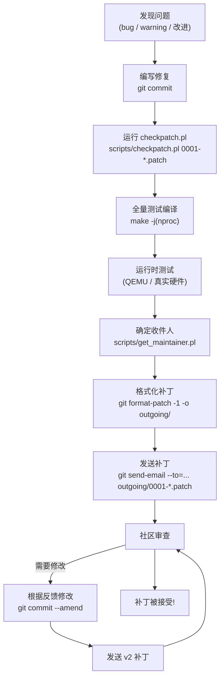
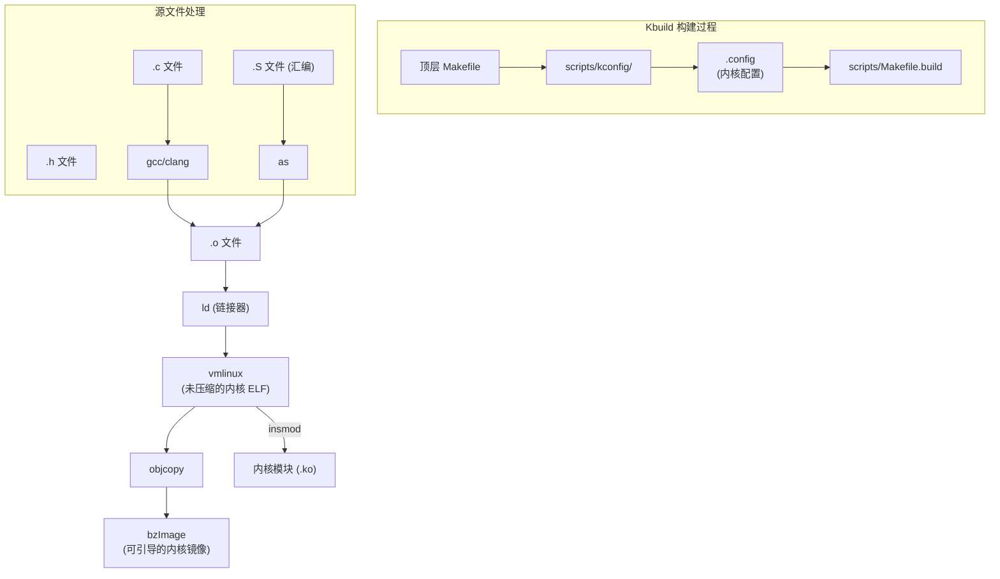

# Linux 内核源码导读 (Linux Kernel Source Code Guide)
---

## 章节概述

> **本章是 C 语言教程的终章。** 在前六章中，你已经学习了内核的系统架构、进程管理、文件系统、设备驱动、中断处理和并发同步。现在，是时候学会自己阅读和理解 Linux 内核源码了。授人以鱼不如授人以渔——本章将教会你如何高效地浏览、查找和理解内核代码，并掌握那些跨越所有子系统的通用模式。

Linux 内核源码超过 3000 万行，但不用担心——你不需要全部读完。关键是掌握正确的工具、方法和导航技巧。本章将带你：
- 掌握内核源码树结构
- 理解内核编码风格
- 精通内核最优雅的几个基础设施：链表 (list.h)、container_of、红黑树
- 使用 elixir.bootlin.com 和 cscope/ctags 高效导航
- 了解如何提交内核补丁
- 一窥 Rust 在内核中的现状和未来

**前置要求**：
- 已完成前六章的学习（01-06）
- 已学完 [[../../c语言教程/2深化/07_面向对象C编程|面向对象C编程]]（理解 C 实现抽象/多态的模式）
- 已学完 [[../../c语言教程/3数据结构/02_链表|链表]]（理解内核链表的外链式设计）
- 已学完 [[../../c语言教程/2深化/06_编译链接与ELF|编译链接与ELF]]（理解符号和编译过程）

---
### 第一节：内核源码树导航
---

### 1.1 完整源码树结构

```mermaid
graph TD
 ROOT["linux/ (根目录)"] --> ARCH["arch/ (架构代码)"]
 ROOT --> KERNEL["kernel/ (核心调度/信号)"]
 ROOT --> MM["mm/ (内存管理)"]
 ROOT --> FS["fs/ (文件系统)"]
 ROOT --> DRIVERS["drivers/ (设备驱动, 最大)"]
 ROOT --> NET["net/ (网络栈)"]
 ROOT --> INCLUDE["include/ (头文件)"]
 ROOT --> INIT["init/ (启动代码)"]
 ROOT --> BLOCK["block/ (块设备层)"]
 ROOT --> IPC["ipc/ (进程间通信)"]
 ROOT --> SECURITY["security/ (LSM)"]
 ROOT --> SOUND["sound/ (音频子系统)"]
 ROOT --> TOOLS["tools/ (用户态工具)"]
 ROOT --> SCRIPTS["scripts/ (构建脚本)"]
 ROOT --> DOC["Documentation/"]
 ROOT --> LIB["lib/ (内核库函数)"]
 
 ARCH --> X86["arch/x86/"]
 ARCH --> ARM["arch/arm/"]
 ARCH --> ARM64["arch/arm64/"]
 ARCH --> RISCV["arch/riscv/"]
 
 DRIVERS --> CHAR["drivers/char/"]
 DRIVERS --> BLOCK_D["drivers/block/"]
 DRIVERS --> NET_D["drivers/net/"]
 DRIVERS --> TTY["drivers/tty/"]
 DRIVERS --> USB["drivers/usb/"]
 DRIVERS --> PCI["drivers/pci/"]
 DRIVERS --> GPU["drivers/gpu/ (drm)"]
 DRIVERS --> ANDROID["drivers/android/ (含 Rust Binder!)"]
 
 NET --> IPV4["net/ipv4/ (TCP/IP)"]
 NET --> IPV6["net/ipv6/"]
 
 FS --> EXT4["fs/ext4/"]
 FS --> BTRFS["fs/btrfs/"]
 FS --> XFS["fs/xfs/"]
 FS --> PROC["fs/proc/"]
 FS --> SYSFS["fs/sysfs/"]
 
 INCLUDE --> LINUX["include/linux/ (通用头文件)"]
 INCLUDE --> UAPI["include/uapi/ (用户空间可见头文件)"]
 INCLUDE --> ASM["include/asm-generic/"]
```



### 1.2 关键目录详解

```bash
# ============================================
# 按目录浏览内核源码
# ============================================

# arch/ — 架构相关代码 (约 10% 的总代码量)
# arch/x86/boot/ — 引导代码 (与具体引导加载器打交道的部分)
# arch/x86/kernel/ — x86 特定内核代码 (IDT, APIC, syscall, 定时器)
# arch/x86/mm/ — x86 页表, TLB, 内存映射
# arch/x86/entry/ — 系统调用/中断入口汇编代码
# arch/x86/kvm/ — KVM 虚拟化 (很大!)
# arch/arm64/kernel/ — ARM64 对应
# arch/riscv/ — RISC-V 对应

# kernel/ — 内核核心 (约 3% 总代码量)
# kernel/sched/ — 调度器 (CFS, RT)
# kernel/locking/ — 锁实现 (spinlock, mutex, rcu, rwsem)
# kernel/irq/ — 中断框架
# kernel/printk/ — printk 实现
# kernel/rcu/ — RCU 核心实现
# kernel/fork.c — fork/clone 实现
# kernel/exit.c — do_exit 实现
# kernel/signal.c — 信号系统

# mm/ — 内存管理 (约 2% 总代码量)
# mm/page_alloc.c — 伙伴系统 (buddy allocator)
# mm/slub.c — SLUB 分配器
# mm/vmalloc.c — vmalloc 实现
# mm/vmscan.c — 内存回收 (kswapd)
# mm/filemap.c — 页面缓存核心
# mm/mmap.c — mmap 实现

# fs/ — 文件系统 (约 15% 总代码量)
# fs/open.c — open/close 系统调用
# fs/read_write.c — read/write 系统调用
# fs/namei.c — 路径解析 (path walk)
# fs/dcache.c — dentry 缓存
# fs/inode.c — inode 管理
# fs/buffer.c — buffer head 管理
# fs/ext4/ — ext4 驱动 (约 70000 行!)
# fs/proc/ — proc 文件系统
# fs/sysfs/ — sysfs 文件系统

# drivers/ — 设备驱动 (约 60% 总代码量 — 内核中最大的部分!)
# drivers/base/ — 设备模型
# drivers/tty/ — 终端/TTY
# drivers/net/ — 网卡驱动
# drivers/gpu/drm/ — GPU 驱动 (AMDGPU 就有 200万+ 行!)
# drivers/android/ — Android 相关 (含 Rust Binder!)
# drivers/usb/
# drivers/pci/
# drivers/staging/ — 新/不稳定驱动 (好的起点!)
# drivers/platform/ — SoC 平台设备
```

### 1.3 递归代码规模统计

```bash
# 使用 cloc 统计各子系统代码量
# sudo apt install cloc
cloc --exclude-dir=.git,Documentation --quiet linux/

# 典型输出:
# C 28200000 lines
# C/C++ Header 7200000 lines
# Assembly 340000 lines
# Rust 52000 lines (Linux 6.8+, 快速增长中)
# Makefile 120000 lines
# ...
#
# 按目录的 C 代码行数:
# drivers/ ~17,000,000 行 (占 60%)
# arch/ ~3,500,000 行 (占 12%)
# fs/ ~2,000,000 行 (占 7%)
# net/ ~1,500,000 行 (占 5%)
# sound/ ~1,000,000 行 (占 3.5%)
```

---
### 第二节：Linux 内核编码风格
---

### 2.1 编码风格的核心规则

```c
// ============================================
// Linux 内核编码风格 (Documentation/process/coding-style.rst)
// 在线: https://www.kernel.org/doc/html/latest/process/coding-style.html
// ============================================

// 1. 缩进: 使用 8 字符硬 Tab (不是空格!)
// 这是 Linus 的强烈偏好
// 原因: 让深层嵌套变得痛苦 → 促使你重构

// 2. 行长度: 推荐 80 列以内
// 硬限制 100 列 (checkpatch.pl 会警告)

// 3. 大括号:
// - 函数: 左花括号单独一行 (K&R 风格例外)
// - if/while/for: 左花括号在同一行末尾
// - 单条语句可选花括号

// 4. 空格: 关键字后面留空格
// if (condition) 
// if(condition) (看起来像函数调用)
// sizeof(struct foo) 
// sizeof(struct foo) (但不是 sizeof func())

// 5. 命名:
// - 变量/函数: snake_case (小写+下划线)
// get_user_pages, page_fault, kmem_cache_alloc
// - 宏: UPPER_CASE
// S_IFREG, GFP_KERNEL, THIS_MODULE
// - 类型: 小写 + _t 后缀
// pte_t, spinlock_t, atomic_t
// - 结构体: 小写蛇形
// struct task_struct, struct file_operations

// 6. typedef: 请勿滥用!
// - 如果类型是透明的: 不要 typedef
// - 如果类型是抽象/隐藏的: 可以 typedef
// - 如 pte_t, atomic_t 是 typedef (隐藏内部实现)
// - 但 'struct my_data' 就不要 typedef 成 MyData_t

// 7. 函数: 保持短小, 单一职责
// 如果一个函数超过 2 屏 (约 40 行), 考虑拆分为子函数

// 8. 集中化 goto 错误处理:
// 这是内核中最认可的 goto 用法
int init_foo(void)
{
 void *a = kmalloc(..., GFP_KERNEL);
 if (!a)
 return -ENOMEM;
 
 void *b = kmalloc(..., GFP_KERNEL);
 if (!b) {
 // 错误: 需要释放 a
 goto out_free_a;
 }
 
 // ... 正常操作 ...
 return 0;
 
out_free_a:
 kfree(b);
 kfree(a);
 return -ENOMEM;
}

// 9. 注释: C89 风格 /* ... */ 优先
// 避免 C99 // 风格 (内核源码中仍然通用)
// 仅在文件顶部和函数前使用大段注释描述意图
// 行内注释应简短, 解释 WHY 而不是 WHAT

// 10. checkpatch.pl: 代码审查助手
// scripts/checkpatch.pl --file your_code.c
// scripts/checkpatch.pl --strict --file your_code.c
// 在提交补丁前必须运行此检查!
```

### 2.2 checkpatch.pl 使用

```bash
# checkpatch.pl 是内核维护者用来检查补丁质量的脚本
# 它检查编码风格、常见错误和可维护性问题

# 基本使用:
scripts/checkpatch.pl --file drivers/char/my_driver.c

# 检查补丁:
git diff > changes.patch
scripts/checkpatch.pl changes.patch

# 严格模式 (更多检查):
scripts/checkpatch.pl --strict --file my_code.c

# 常见 checkpatch 输出:
# WARNING: line over 80 characters
# WARNING: Use of volatile is usually wrong
# ERROR: trailing whitespace
# ERROR: spaces required around that '=' (ctx:VxV)
# WARNING: DT compatible string vendor 'mycompany' appears un-documented
#
# 警告和错误必须修复才能被接受

# 修复 checkpatch 问题的 auto-fixer:
scripts/checkpatch.pl --fix-inplace --file my_code.c
# 不推荐盲目使用; 手工审查修改
```

---
### 第三节：内核链表 (list.h) —— C 语言的杰作
---

### 3.1 为什么内核链表是杰作

```c
// ============================================
// 内核链表是包含式 (intrusive) 的 —— 链表节点嵌套在数据结构中
// 这与 C++ 的 std::list 形成对比:
//
// C++: std::list<int> lst; // 外部式 (non-intrusive)
// 数据存储在 list 分配的节点中
//
// 内核: struct my_data { int val; struct list_head node; };
// 数据本身包含链表节点, list_add 只操作这个节点
//
// 包含式的优势:
// 1. 零额外内存分配 (链表操作不分配节点内存)
// 2. 节点就是数据的一部分 (不需要 extra indirection)
// 3. 类型安全 (通过 container_of 宏获得)
// 4. 一个对象可以同时在多个链表中
// (只需多个 struct list_head 字段)
// ============================================

#include <linux/list.h>

// 链表头的定义:
// struct list_head { struct list_head *next, *prev; };

// ============================================
// 使用示例: 学生管理系统
// ============================================

struct student {
 int id;
 char name[32];
 int score;
 
 struct list_head list; // 内嵌的链表节点 — 使 student 可被链接
 // 注意: 如果我们有多个学生列表 (如按照不同标准排序),
 // 可以添加多个 list_head 字段:
 // struct list_head score_list; // 按成绩排序
};

// 1. 定义链表头
static LIST_HEAD(student_list); // 等效: struct list_head student_list;
 // INIT_LIST_HEAD(&student_list);

// 2. 添加学生
void add_student(int id, const char *name, int score)
{
 struct student *s = kmalloc(sizeof(*s), GFP_KERNEL);
 if (!s) return;
 
 s->id = id;
 strscpy(s->name, name, sizeof(s->name));
 s->score = score;
 
 // 添加到链表尾部
 list_add_tail(&s->list, &student_list);
}

// 3. 遍历所有学生 (经典方式)
void print_all_students(void)
{
 struct student *entry;
 
 // list_for_each_entry: 类型安全的遍历
 // 参数: (游标, 链表头, 成员名)
 // 内部使用 container_of 从 list_head 反推 student
 list_for_each_entry(entry, &student_list, list) {
 printk("ID=%d, Name=%s, Score=%d\n",
 entry->id, entry->name, entry->score);
 }
}

// 4. 查找学生 (按 ID)
struct student *find_student(int id)
{
 struct student *entry;
 
 list_for_each_entry(entry, &student_list, list) {
 if (entry->id == id)
 return entry;
 }
 return NULL; // 未找到
}

// 5. 删除学生
void del_student(int id)
{
 struct student *entry, *tmp;
 
 // list_for_each_entry_safe: 安全遍历 (删除时可用)
 // 使用临时指针 tmp 保存下一个
 list_for_each_entry_safe(entry, tmp, &student_list, list) {
 if (entry->id == id) {
 list_del(&entry->list); // 从链表断开
 kfree(entry); // 释放内存
 return;
 }
 }
}

// 6. 按成绩排序插入
void add_student_sorted(struct student *new_s)
{
 struct student *entry;
 
 // 找到第一个成绩更高的学生, 插在其前面
 list_for_each_entry(entry, &student_list, list) {
 if (entry->score > new_s->score) {
 list_add_tail(&new_s->list, &entry->list); // 插入其前面
 return;
 }
 }
 
 // 如果链表中没有更高成绩的, 插入尾部
 list_add_tail(&new_s->list, &student_list);
}
```

### 3.2 container_of 宏 —— 包含式链表的钥匙

```c
// ============================================
// container_of: 内核中最著名的宏
// 定义在 include/linux/container_of.h
// ============================================

// 直观理解:
// struct student s; // 假设在内存地址 0x1000
// struct list_head *ptr = &s.list; // 0x1000 + 40 = 0x1028
//
// container_of(ptr, struct student, list):
// → (0x1028) - offsetof(struct student, list)
// → 0x1028 - 40
// → 0x1000
// → 返回指向 student 的指针!

#define container_of(ptr, type, member) ({ \
 // 1. 类型安全检查: 确保 ptr 确实是 type->member 的指针
 // void *__mptr = (void *)(ptr); // 简化版
 // 如果 ptr 的类型与 member 类型不一致, 编译器警告
 const typeof(((type *)0)->member) *__mptr = (ptr); \
 // 2. 从成员地址减去成员偏移, 得到结构体起始地址
 (type *)((char *)__mptr - offsetof(type, member)); })

// offsetof: 计算成员在结构体中的偏移量
// #define offsetof(TYPE, MEMBER) __builtin_offsetof(TYPE, MEMBER)
//
// 例如 offsetof(struct student, list) = 64 (假设)
//
// 工作原理伪码:
// &(((student*)0)->list) → 如果 student 起始地址为 0,
// list 成员的地址就是它的偏移量!

// ============================================
// container_of 在 list_for_each_entry 中的应用
// ============================================

// list_for_each_entry 展开后的本质:
// for (entry = container_of(head->next, typeof(*entry), list);
// &entry->list != head;
// entry = container_of(entry->list.next, typeof(*entry), list))
//
// 每一步都是: 从 list_head 指针反推包含它的结构体指针
// 这就是类型安全的、编译时检查的"外部链表"——但使用包含式存储!

// ============================================
// container_of 的变体
// ============================================

// container_of_const: 如果 ptr 是 const, 返回 const 类型
// container_of_safe: 如果 ptr 是 NULL, 返回 NULL
```

### 3.3 内核链表的完整API

```c
// ============================================
// list.h 核心操作 API
// ============================================

// === 初始化 ===
LIST_HEAD(name); // 静态定义 + 初始化链表头
INIT_LIST_HEAD(ptr); // 动态初始化链表头
LIST_HEAD_INIT(name); // 用于结构体初始化中

// === 添加 ===
list_add(new, head); // 在 head 之后插入
list_add_tail(new, head); // 在 head 之前插入 (链表尾部)

// === 删除 ===
list_del(entry); // 从链表中删除 (不释放内存)
list_del_init(entry); // 删除并重新初始化 entry
list_del_rcu(entry); // 删除 (RCU 版本)

// === 移动 ===
list_move(list, head); // 从一个链表移动到另一个 (头部)
list_move_tail(list, head); // 移动到尾部

// === 替换 ===
list_replace(old, new); // 用 new 替换 old 的位置

// === 判断 ===
list_empty(head); // 链表为空?
list_is_first(entry, head); // entry 是否是第一个元素?
list_is_last(entry, head); // entry 是否是最后一个元素?
list_is_singular(head); // 链表只有一个元素?

// === 遍历 ===
list_for_each(pos, head); // 遍历节点 (list_head)
list_for_each_entry(pos, head, member); // 遍历元素 (类型安全!)
list_for_each_entry_reverse(...); // 反向遍历
list_for_each_entry_safe(pos, n, head, member); // 安全遍历 (可删除)
list_for_each_entry_from(pos, head, member); // 从当前位置继续

// === 高级 ===
list_splice(list, head); // 合并链表 (list 接在 head 后)
list_splice_tail(list, head); // 合并链表 (list 接在 head 前)
list_rotate_left(head); // 循环左移
list_rotate_to_front(list, head); // 将 list 移到 head 的第一个位置
```

```c
// 练习 1: list.h 深入理解
// 1. 宏展开: 手动将 list_for_each_entry 宏展开为 C 代码
// 追踪每一步的类型转换和 container_of 调用
//
// 2. 阅读 list.h 源码: include/linux/list.h
// 理解 offsetof 和 container_of 如何配合工作
//
// 3. 实现双向循环链表 (不用 list.h):
// 从头实现一个简化版的 list_head
// 实现 list_add, list_del, list_for_each
// 验证与内核实现的等价性
//
// 4. 测试: 创建一个对象同时在两个独立的链表中
// 验证两个链表操作互不影响 (不同的 list_head 字段)
```

---
### 第四节：内核中的其他优雅数据结构
---

### 4.1 红黑树 (rbtree.h)

```c
// ============================================
// 内核红黑树 (include/linux/rbtree.h)
// 用于需要有序遍历的索引 (如 VMA, CFQ)
// ============================================

#include <linux/rbtree.h>

// 用法类似于 list.h 的"包含式"模式
struct my_node {
 int key;
 char data[64];
 struct rb_node node; // 内嵌的红黑树节点
};

// 根节点
static struct rb_root my_tree = RB_ROOT;

// 搜索节点 (标准 BST 搜索)
static struct my_node *search(struct rb_root *root, int key)
{
 struct rb_node *n = root->rb_node;
 
 while (n) {
 struct my_node *entry = rb_entry(n, struct my_node, node);
 // rb_entry = container_of (对 rb_node 的版本)
 
 if (key < entry->key)
 n = n->rb_left;
 else if (key > entry->key)
 n = n->rb_right;
 else
 return entry; // found
 }
 return NULL;
}

// 插入节点
static int insert(struct rb_root *root, struct my_node *data)
{
 struct rb_node **new = &root->rb_node, *parent = NULL;
 
 while (*new) {
 struct my_node *cur = rb_entry(*new, struct my_node, node);
 parent = *new;
 
 if (data->key < cur->key)
 new = &((*new)->rb_left);
 else if (data->key > cur->key)
 new = &((*new)->rb_right);
 else
 return -EEXIST; // 键已存在
 }
 
 // 插入节点并做红黑树平衡
 rb_link_node(&data->node, parent, new);
 rb_insert_color(&data->node, root); // 重新平衡
 return 0;
}

// 遍历 (中序遍历 = 有序输出)
void print_all_ordered(struct rb_root *root)
{
 struct rb_node *node;
 for (node = rb_first(root); node; node = rb_next(node)) {
 struct my_node *data = rb_entry(node, struct my_node, node);
 printk("key=%d\n", data->key);
 }
}
```

### 4.2 内核哈希表 (hashtable.h)

```c
// ============================================
// include/linux/hashtable.h
// 基于链表 (hlist) 实现的开链哈希表
// ============================================

#include <linux/hashtable.h>

// 定义有 256 个桶的哈希表
#define MY_HASH_BITS 8 // 2^8 = 256 桶
struct my_entry {
 int key;
 char data[128];
 struct hlist_node node;
};

// 初始化哈希表
static DECLARE_HASHTABLE(my_hash, MY_HASH_BITS);

// 插入
void hash_add_entry(struct my_entry *entry)
{
 hash_add(my_hash, &entry->node, entry->key);
}

// 查找
struct my_entry *hash_lookup_entry(int key)
{
 struct my_entry *entry;
 
 hash_for_each_possible(my_hash, entry, node, key) {
 if (entry->key == key)
 return entry;
 }
 return NULL;
}

// 删除
void hash_del_entry(struct my_entry *entry)
{
 hash_del(&entry->node);
 kfree(entry);
}
```

---
### 第五节：使用 elixir.bootlin.com 高效浏览源码
---

### 5.1 elixir.bootlin.com 入门

```bash
# elixir.bootlin.com 是浏览 Linux 内核源码的最佳在线工具
# 它提供:
# - 全文搜索 (代码、注释、文档)
# - 符号定义跳转 (类似 IDE 的 "Go to Definition")
# - 符号引用列表 (类似 "Find All References")
# - 跨版本对比
# - 文件下载

# 示例 URL:
# 浏览当前最新版本:
# https://elixir.bootlin.com/linux/latest/source
#
# 搜索 task_struct 的定义:
# https://elixir.bootlin.com/linux/latest/A/ident/task_struct
#
# 搜索 do_syscall_64:
# https://elixir.bootlin.com/linux/latest/A/ident/do_syscall_64
#
# 浏览 system call 表:
# https://elixir.bootlin.com/linux/latest/source/arch/x86/entry/syscalls/syscall_64.tbl
#
# 搜索 container_of 的所有引用:
# https://elixir.bootlin.com/linux/latest/A/ident/container_of
#
# 跨版本对比 task_struct v5.15 vs v6.0:
# https://elixir.bootlin.com/linux/v5.15/source/include/linux/sched.h#L728
# https://elixir.bootlin.com/linux/v6.0/source/include/linux/sched.h#L728
```

### 5.2 搜索技巧

```bash
# 1. 查找 .c 中只包含 .h 中声明的函数定义
# 在 elixir 中使用 "identifier search" 找到函数声明位置
# 然后在同一页面点 "referenced" 找到所有调用者

# 2. 理解系统调用的完整路径
# 例: 追踪 write() 调用链
# - 用户态: 知道调用 write(fd, buf, n)
# - entry: 搜索 entry_SYSCALL_64
# - 查找 sys_call_table[1] → sys_write → ksys_write → vfs_write
# - 在 vfs_write 中点 "referenced" 看谁调用它

# 3. 查找特定宏的使用
# - 搜索 "likely" 看哪些代码有分支预测提示
# - 搜索 "rcu_read_lock" 看哪些模块使用 RCU
# - 搜索 "container_of" 欣赏其广泛使用

# 4. 浏览内核子系统的入口点
# - init/main.c: start_kernel() — 内核总入口
# - kernel/sched/core.c: schedule() — 调度器
# - mm/page_alloc.c: __alloc_pages_nodemask() — 内存分配入口
# - fs/read_write.c: vfs_write() / vfs_read() — IO 入口
```

### 5.3 本地浏览工具 (cscope/ctags)

```bash
# 生成 cscope 索引 (在内核源码根目录)
make cscope # 生成 cscope.files + 索引

# 或手动:
find . -name "*.c" -o -name "*.h" -o -name "*.S" > cscope.files
cscope -b -q -k # 生成索引

# cscope 常用查找:
# Ctrl-d + Enter — 查找此函数的调用者
# Ctrl-d + g — 查找此符号的全局定义
# Ctrl-d + s — 查找此 C 符号
# Ctrl-d + t — 查找此文本字符串
# Ctrl-d + f — 查找此文件

# ctags 生成 (用于 vim/emacs 跳转)
make tags # 或 ctags -R .

# 在 vim 中使用 ctags:
# Ctrl-] — 跳转到定义
# Ctrl-t — 跳回
# :ts name — 列出所有匹配的标签

# 在 vscode 中:
# - 安装 C/C++ 插件
# - 打开包含 .c / .h 的文件夹
# - 使用 "Go to Definition" 和 "Find All References"
# - 可能需要 compile_commands.json:
# scripts/clang-tools/gen_compile_commands.py
```

```c
// 练习 2: 源码导航练习
// 1. 在 elixir.bootlin.com 找到以下符号的定义:
// - task_struct (include/linux/sched.h)
// - vfs_write (fs/read_write.c)
// - __alloc_pages_nodemask (mm/page_alloc.c)
// - do_fork (kernel/fork.c)
// - spin_lock (自旋锁的实现)
// - container_of (include/linux/container_of.h)
//
// 2. 追踪 do_fork 的完整调用链:
// - 从用户态 fork() 开始 → glibc → syscall → 内核
// - 找出 clone() 的 flags 如何影响子进程行为
// - 找出 copy_process() 如何复制 task_struct
//
// 3. 找出 printk 的实现路径:
// printk → vprintk → vprintk_emit → console_unlock → ...
// 看最终如何走到 tty 驱动
```

---
### 第六节：阅读一个真实驱动 —— 以 misc 驱动为例
---

### 6.1 选择简单的驱动作为阅读起点

```c
// ============================================
// 选择一个简单的内核驱动来阅读: misc 驱动框架
//
// 推荐顺序 (从简单到复杂):
// 1. drivers/misc/ — 简单杂项设备
// 2. drivers/char/mem.c — /dev/null, /dev/zero 实现
// 3. drivers/char/random.c — /dev/random 实现
// 4. drivers/tty/tty_io.c — TTY 核心
// ============================================

// ============================================
// 案例: 理解 /dev/null 的实现 (drivers/char/mem.c)
// ============================================

// 核心代码 (简化):
// /dev/null 的写操作 —— 接受一切数据并丢弃
static ssize_t null_write(struct file *file, const char __user *buf,
 size_t count, loff_t *ppos)
{
 return count; // 声称全写入了, 实际上丢弃了数据!
}

// /dev/null 的读操作 —— 永远返回 EOF
static ssize_t null_read(struct file *file, char __user *buf,
 size_t count, loff_t *ppos)
{
 return 0; // EOF: 无数据可读
}

// /dev/zero 的读操作 —— 填充零
static ssize_t read_zero(struct file *file, char __user *buf,
 size_t count, loff_t *ppos)
{
 // clear_user: 高效地将用户空间缓冲区清零
 size_t cleared = clear_user(buf, count);
 if (cleared > 0)
 return -EFAULT;
 return count;
}

// file_operations 注册
static const struct file_operations null_fops = {
 .read = null_read,
 .write = null_write,
 .llseek = noop_llseek, // seek 无作用
};

static const struct file_operations zero_fops = {
 .read = read_zero,
 .write = null_write,
 .read_iter = read_iter_zero, // 现代迭代器版本
 .llseek = noop_llseek,
 .mmap = mmap_zero, // mmap /dev/zero
};

// ============================================
// 关键学习点:
// 1. file_operations 如何实现抽象 — 看似普通的设备
// 2. 驱动如何通过 f_ops 注册到设备模型
// 3. 错误处理和返回值约定
// 4. 简单的驱动是最佳的学习材料
// ============================================
```

### 6.2 阅读驱动的步骤清单

```bash
# 驱动阅读七步法:
#
# 1. 找入口: 搜索 module_init 或 platform_driver_register
# → 理解驱动的初始化和清理流程
#
# 2. 看设备模型: 搜索 bus_type, platform_device, of_device_id
# → 理解驱动如何匹配设备
#
# 3. 找 file_operations 或等效操作表
# → 理解用户空间如何与驱动交互
#
# 4. 追踪关键系统调用: open, read, write, ioctl
# → 从用户态 API 走到最底层
#
# 5. 找中断处理: 搜索 request_irq, tasklet, work_struct
# → 理解异步事件处理
#
# 6. 找锁: 搜索 spin_lock, mutex_lock, rcu_read_lock
# → 理解并发保护策略
#
# 7. 找内存操作: 搜索 kmalloc, kfree, devm_kzalloc, copy_to_user
# → 检查内存管理的正确性
```

---
### 第七节：提交内核补丁工作流
---

### 7.1 补丁提交流程



### 7.2 补丁提交实战

```bash
# 1. 克隆内核源码
git clone https://git.kernel.org/pub/scm/linux/kernel/git/torvalds/linux.git
cd linux

# 2. 创建一个驱动作修改
git checkout -b fix_null_ptr_check

# 编写修复后:
git add drivers/staging/my_driver.c
git commit -s # -s = Sign-off (Developer's Certificate of Origin)

# 提交信息格式:
# subsystem: Brief summary (under 75 chars)
#
# Detailed explanation of what the patch does and why.
# Explain the problem being fixed.
# Mention any side effects.
#
# Signed-off-by: Your Name <your.email@example.com>
# ---
# drivers/staging/my_driver.c | 2 +-
# 1 file changed, 1 insertion(+), 1 deletion(-)

# 3. 生成补丁
git format-patch -1 -o outgoing/

# 4. 运行检查
scripts/checkpatch.pl outgoing/0001-staging-fix-null-pointer-check-in-my-driver.patch

# 5. 获取维护者
scripts/get_maintainer.pl drivers/staging/my_driver.c
# 输出:
# Greg Kroah-Hartman <gregkh@linuxfoundation.org> (maintainer:STAGING)
# linux-staging@lists.linux.dev (open list:STAGING)
# linux-kernel@vger.kernel.org (open list)

# 6. 发送补丁 (先发送给自己测试!)
git send-email \
 --to="gregkh@linuxfoundation.org" \
 --cc="linux-staging@lists.linux.dev" \
 outgoing/0001-*.patch

# 7. 等待回复, 根据反馈修改
# 如果需修改: 修改代码 → git commit --amend → git format-patch -1 v2/
# 主题行添加 [PATCH v2]

# 重要: 提交规范
# 1. 必须是独立的、自包含的修改
# 2. 不能引入编译警告
# 3. 必须通过 checkpatch.pl (最好 --strict)
# 4. 信息必须解释 WHY, 而不仅是 WHAT
```

---
### 第八节：Rust 在内核中的角色
---

### 8.1 Rust 入核的里程碑

```c
// ============================================
// Rust 进入 Linux 内核的时间线
// ============================================
//
// 2021年4月: Miguel Ojeda 发布 RFC — 在 Linux 内核中使用 Rust
// 2022年12月: Linux 6.1 正式合入 Rust 基础设施
// (Makefile 支持, alloc crate, 基本绑定)
// 2023年10月: Linux 6.6 — Rust 工具链要求 (Rust 1.68+)
// 2024年3月: Linux 6.8 — Binder Rust 驱动 (drivers/android/)
// [Alice Ryhl 等人提交, 约 12000 行 Rust 代码]
// 2024年5月: Linux 6.9 — 更多 Rust 驱动 (网络 PHY 抽象)
//
// 当前状态:
// - Rust 基础设施已稳定
// - 多个驱动在开发中 (GPU, NVMe, 网络)
// - 项目讨论用 Rust 重写关键安全代码
// - 详见 
```

### 8.2 Rust 的定位与 C 的关系

```c
// ============================================
// C 和 Rust 不是对手, 是搭档
// ============================================

// C 的不可替代优势:
// 1. 3000 万行现有代码 — 不可能重写
// (重写 Linux 内核估计需要 100 亿美元+)
// 2. 所有架构的完整支持 (50+ CPU 架构)
// GCC 支持所有架构, Rust 编译器只支持主流架构
// 3. 开发者生态 — 几万名内核 C 开发者
// Rust 系统程序员相对少
// 4. 编译模型简单
// C 的编译非常快 (相对), Rust 的编译较慢 (类型检查)
// 5. FFI 简单 — 汇编可以无缝调用 C
// Rust 的 extern "C" 有一层包装成本

// Rust 的战略性优势:
// 1. 内存安全 — 约 70% 的安全漏洞不再可能
// 2. 并发安全 — Send/Sync 保证线程安全
// 3. 更好的抽象 — trait, generics, pattern matching
// 4. 新代码更安全 — 新驱动可以用 Rust 编写
// (Linux 6.8 的 Binder Rust 驱动 = 零内存安全 CVE)
// 5. 年轻开发者吸引力 — Rust 是新一代系统编程语言

// 共存策略:
// ┌─────────────────────────────────────────────┐
// │ Linux 内核代码组成 │
// ├─────────────────────────────────────────────┤
// │ 核心内核 (sched, mm, fs...) → C 语言 │
// │ 现有驱动 (网卡, 磁盘, GPU...) → C 语言 │
// │ 新设备驱动 (Binder, NVMe...) → Rust (新) │
// │ 架构启动代码 → 汇编 │
// │ 头文件/API bindings → C (由 Rust FFI 使用) │
// └─────────────────────────────────────────────┘
//
// 接口: Rust 通过 extern "C" 调用 C 函数
// C 通过导出符号让 Rust 调用
// 两者共享内核的设备模型、调度器等基础设施
//
// 详见 Linux 内核 Rust 基础设施相关文档:
// - 内核 Rust 支持概述
// - 内核 Rust 抽象层
// - 内核驱动 Rust vs C 对比
// - 参与内核 Rust 开发
// - 内核 Rust 未来展望
```

### 8.3 内核源码中的 Rust 代码

```bash
# 浏览内核中的 Rust 代码 (Linux 6.8+)
# Rust 源码目录: rust/

# Rust 项目的结构:
rust/
├── kernel/ # Rust 内核抽象
│ ├── lib.rs # crate 入口
│ ├── prelude.rs # 预导入模块
│ ├── str.rs # 字符串抽象
│ ├── sync/ # 锁和同步原语 (Mutex, SpinLock)
│ ├── print.rs # 内核打印
│ ├── error.rs # 错误处理 (对应 C 的 errno)
│ └── ...
├── macros/ # Rust 过程宏
│ ├── module.rs # module!() 宏
│ └── ...
├── bindings/ # 自动生成的 C 绑定
│ └── bindings_generated.rs
├── alloc/ # 内核分配器
└── Makefile

# 一个 Rust 内核模块示例 (module.rs):
//! # Simple Rust kernel module
//! 
//! ```rust
//! use kernel::prelude::*;
//! 
//! module! {
//! type: RustHello,
//! name: "rust_hello",
//! author: "Rust for Linux Contributors",
//! description: "Rust hello world kernel module",
//! license: "GPL",
//! }
//! 
//! struct RustHello;
//! impl kernel::Module for RustHello {
//! fn init(_module: &'static ThisModule) -> Result<Self> {
//! pr_info!("Rust module loaded!\n");
//! Ok(RustHello)
//! }
//! }
//! 
//! impl Drop for RustHello {
//! fn drop(&mut self) {
//! pr_info!("Rust module unloaded!\n");
//! }
//! }
//! ```

# 对比 C 版本:
# C 版本需要: module_init, module_exit 宏 + 独立函数
# Rust 版本: Module trait init + Drop trait (自动在卸载时调用)
# Rust 的优势: RAII — 资源在离开作用域时自动释放
```

### 8.4 C 与 Rust 的互操作

```c
// ============================================
// C 和 Rust 如何在内核中互操作?
// ============================================

// 方向1: Rust 调用 C 函数
// Rust 侧 (rust/kernel/sync/arc.rs):
// extern "C" {
// fn kfree(objp: *const core::ffi::c_void);
// }
//
// // Rust 代码可以调用 kfree:
// unsafe { kfree(ptr as *const c_void); }

// 方向2: C 调用 Rust 函数
// Rust 侧:
// #[no_mangle] // 防止 name mangling
// pub extern "C" fn rust_function(x: i32) -> i32 {
// x + 1
// }
//
// C 侧:
// extern int rust_function(int x); // 声明
// int result = rust_function(42); // 调用

// 内存管理互操作:
// - C 分配的内存 (kmalloc) → Rust 通过 unsafe 引用访问
// - Rust 分配的内存 (KBox) → 可以使用标准 API 传递
// - 关键规则: 谁分配, 谁释放 (或用引用计数共享 Arc)
//
// 设备模型互操作:
// - C 侧的 platform_driver → Rust 通过注册回调使用
// - Rust 实现的 file_operations → 通过 bindgen 自动生成 C→Rust 映射
//
// 关键约束:
// - Rust 代码可以用 unsafe 访问任何 C 结构
// - C 代码不能访问 Rust 特有的类型 (如 trait objects)
// - 共享数据结构 (如 task_struct) 有 C 和 Rust 两面
// - Bindgen 自动从 C 头文件生成 Rust 绑定
```

```c
// 练习 3: 源码贡献实践
// 1. 修复 Documentation/ 中的拼写错误
// 这是最简单的贡献方式 — 在 Documentation/ 中找一个 typo
// git log 查看修复格式
// 提交你的第一个内核补丁!
//
// 2. 将 drivers/staging/ 下的某个简单驱动作为练习
// 运行 checkpatch.pl 发现 style 问题
// 修复 1-2 个 clean-up 问题, 发送补丁
//
// 3. 写一个简单的 cleanup 补丁 (coding style + minor fix)
// - 统一变量命名风格
// - 移除未使用的变量
// - 修复错误路径的内存泄漏
// - 用 readelf + objdump 验证
//
// 4. 尝试运行 kernel test robot (KTR) 测试:
// make -j$(nproc) W=1 → 启用所有警告
// make coccicheck → 用 Coccinelle 脚本检查
// make namespacecheck → 检查符号导出
```

---
### 第九节：Kbuild —— 内核构建系统
---



```bash
# Kbuild 关键 Makefile 阅读顺序:
# 1. 顶层 Makefile — 定义架构, 编译器, 构建目标
# 2. scripts/Kbuild.include — 核心 Kbuild 宏和函数
# 3. scripts/Makefile.build — 单个目录的构建逻辑
# 4. scripts/Makefile.modpost — 模块后处理

# 关键宏和变量:
# obj-y → 编译进内核
# obj-m → 编译为模块
# obj-n → 不编译
# ccflags-y → 传递给编译器的标志
# ldflags-y → 传递给链接器的标志

# 示例: drivers/char/Makefile
# obj-y += mem.o random.o misc.o
# obj-$(CONFIG_TTY_PRINTK) += ttyprintk.o
# → 如果 CONFIG_TTY_PRINTK=y, 展开为 obj-y += ttyprintk.o
# → 如果 CONFIG_TTY_PRINTK=m, 展开为 obj-m += ttyprintk.o
# → 如果未设置, 展开为 obj-n += ... (不编译)

# 查看编译命令行:
make V=1 # 显示完整的编译命令 (verbose)

# 查看预处理后的文件:
make drivers/char/mem.i # 仅预处理 (查看宏展开)

# 查看生成的汇编:
make drivers/char/mem.s # 编译到汇编 (查看优化结果)

# 查看模块分析:
make scripts/mod/modpost # 重新生成 modpost (模块依赖分析)
```

---
## 章节测试
---

> [!question] 判断题 1
> 内核编码风格要求使用 4 个空格作为缩进。 （ ）
> - [ ] 正确
> - [ ] 错误
>
> > [!success]- 点击查看答案
> > 答案: 错误
> >
> > **解析**: Linux 内核使用 8 字符硬 Tab 的缩进风格。这是 Linus Torvalds 的强烈偏好——让深层嵌套"很痛苦"，从而促使开发者重构代码。这是 kernel coding style 最著名的规则之一。

> [!question] 判断题 2
> container_of 宏通过从成员指针地址减去该成员在结构体中的偏移量来获得结构体起始地址。 （ ）
> - [ ] 正确
> - [ ] 错误
>
> > [!success]- 点击查看答案
> > 答案: 正确
> >
> > **解析**: `container_of(ptr, type, member)` 的核心操作是 `(type*)((char*)ptr - offsetof(type, member))`。它利用 offsetof 计算成员偏移量，然后从成员地址中减去这个偏移量得到包含该成员的结构体的地址。

> [!question] 判断题 3
> 补丁提交前必须通过 `scripts/checkpatch.pl` 检查。 （ ）
> - [ ] 正确
> - [ ] 错误
>
> > [!success]- 点击查看答案
> > 答案: 正确
> >
> > **解析**: checkpatch.pl 是补丁质量检查的核心工具。维护者会拒绝未通过 checkpatch 的补丁。它检查编码风格、空格、行长度、常见错误等。建议使用 `--strict` 模式获得更全面的检查。

> [!question] 判断题 4
> 内核中的红黑树 `rb_node` 和链表 `list_head` 都采用外部式存储（non-intrusive）设计。 （ ）
> - [ ] 正确
> - [ ] 错误
>
> > [!success]- 点击查看答案
> > 答案: 错误
> >
> > **解析**: 内核的 list_head 和 rb_node 都采用包含式（intrusive）设计——节点嵌套在数据结构内部，不进行独立的节点内存分配。链表操作只操作这些内嵌的节点，额外的内存分配为零。

> [!question] 判断题 5
> Rust 在 Linux 6.1 正式合入后，计划在 10 年内完全替代 C 语言成为内核的主要语言。 （ ）
> - [ ] 正确
> - [ ] 错误
>
> > [!success]- 点击查看答案
> > 答案: 错误
> >
> > **解析**: 没有任何计划用 Rust 替代 C。C 将始终是内核的主要语言（3000 万行代码不可重写）。Rust 的角色是补充——为新的安全关键组件提供更安全的开发选项。两者通过 C FFI 共存。

> [!question] 判断题 6
> `drivers/staging/` 目录包含质量最高、最稳定的内核代码。 （ ）
> - [ ] 正确
> - [ ] 错误
>
> > [!success]- 点击查看答案
> > 答案: 错误
> >
> > **解析**: staging 目录恰恰相反——它包含质量最低、最不稳定、仍在开发中的代码。新的或质量不达标的驱动首先放入 staging，经过清理和审查后才能移入正式的 drivers/ 子目录。它是新贡献者的理想起点。

> [!question] 判断题 7
> 内核的 `list_for_each_entry` 宏只在头文件中声明，由内核函数实现。 （ ）
> - [ ] 正确
> - [ ] 错误
>
> > [!success]- 点击查看答案
> > 答案: 错误
> >
> > **解析**: `list_for_each_entry` 不是函数，而是**宏**。它在头文件中完全展开，每次使用都在调用处展开为完整的 for 循环。这也是为什么它的"参数"可以接受成员名——宏在编译时进行类型检查。

> [!question] 判断题 8
> 同一个对象可以通过包含多个 `struct list_head` 字段同时属于多个链表。 （ ）
> - [ ] 正确
> - [ ] 错误
>
> > [!success]- 点击查看答案
> > 答案: 正确
> >
> > **解析**: 这是包含式链表设计的核心优势之一。一个结构体可以包含多个 list_head 字段，每个字段对应一个不同的链表。例如 `struct task_struct` 同时在进程链表中（sibling, children）、运行队列中（se->run_node）和等待队列中。

> [!question] 判断题 9
> 阅读内核源码时，建议从 `drivers/gpu/drm/` 目录开始。 （ ）
> - [ ] 正确
> - [ ] 错误
>
> > [!success]- 点击查看答案
> > 答案: 错误
> >
> > **解析**: GPU 驱动（DRM）是内核中最复杂的驱动之一（AMDGPU 超过 200 万行）。新手应该从 `drivers/char/mem.c`（/dev/null, /dev/zero）、`drivers/misc/` 或 `drivers/staging/` 中的简单驱动开始学习。

> [!question] 判断题 10
> 内核构建系统 Kbuild 使用 obj-y 表示编译为内核模块。 （ ）
> - [ ] 正确
> - [ ] 错误
>
> > [!success]- 点击查看答案
> > 答案: 错误
> >
> > **解析**: `obj-y` 表示编译进内核镜像（vmlinux），`obj-m` 表示编译为独立的内核模块（.ko），`obj-n` 表示不编译。两者的后缀分别对应 yes（静态编译）和 module（模块）。

---

> [!question] 选择题 1
> Linux 内核源码中占比最大的目录是？
> - [ ] A. `arch/`
> - [ ] B. `drivers/`
> - [ ] C. `fs/`
> - [ ] D. `net/`
>
> > [!success]- 点击查看答案
> > 正确答案: B
> >
> > **解析**: `drivers/` 占内核总代码量的约 60%（约 1700 万行 C 代码）。这是因为 Linux 支持的大量硬件设备都需要各自的驱动代码。GPU 驱动（DRM）是其中最大的部分之一。

> [!question] 选择题 2
> 提交内核补丁时应使用哪个格式的提交信息？
> - [ ] A. `feat: add new device support`
> - [ ] B. `subsystem: Brief summary in under 75 chars`
> - [ ] C. `WIP: fix for issue`
> - [ ] D. `#42 Fixing the null pointer bug`
>
> > [!success]- 点击查看答案
> > 正确答案: B
> >
> > **解析**: 内核补丁的主题行格式为 `subsystem: Brief summary`。前缀标识修改的子系统（如 `mm:`, `drivers:`, `USB:` 等）。摘要必须短于 75 个字符，使用祈使句（"Fix null pointer" 而非 "Fixed" 或 "Fixes"）。

> [!question] 选择题 3
> 以下哪个是 `container_of` 宏使用的关键子宏？
> - [ ] A. `sizeof`
> - [ ] B. `offsetof`
> - [ ] C. `typeof`
> - [ ] D. B 和 C
>
> > [!success]- 点击查看答案
> > 正确答案: D
> >
> > **解析**: container_of 的核心公式是 `(type*)((char*)ptr - offsetof(type, member))`。它使用 `typeof` 进行类型安全检查，使用 `offsetof` 计算成员偏移量。sizeof 不直接参与 container_of 的计算。

> [!question] 选择题 4
> 以下关于 `elixir.bootlin.com` 的功能，哪个不正确？
> - [ ] A. 全文搜索内核源码
> - [ ] B. 跳转到符号的定义和所有引用
> - [ ] C. 在线编辑和提交内核补丁
> - [ ] D. 跨版本对比代码
>
> > [!success]- 点击查看答案
> > 正确答案: C
> >
> > **解析**: Bootlin Elixir 是一个只读的内核源码浏览工具。它提供搜索、定义跳转、引用列表、跨版本对比等功能，但不能在线编辑或提交补丁。补丁需要通过 git format-patch + git send-email 提交。

> [!question] 选择题 5
> 内核链表 `list_head` 的内部结构是什么？
> - [ ] A. `struct list_head { int data; struct list_head *next; };`
> - [ ] B. `struct list_head { struct list_head *next; struct list_head *prev; };`
> - [ ] C. `struct list_head { void *data; struct list_head *next; struct list_head *prev; };`
> - [ ] D. `struct list_head { struct list_head *head; int size; };`
>
> > [!success]- 点击查看答案
> > 正确答案: B
> >
> > **解析**: list_head 只包含 next 和 prev 两个指针，不包含数据指针。这是包含式设计的核心——数据存储在包含 list_head 的结构体中，通过 container_of 获取。这种设计避免了额外的内存分配和间接引用。

> [!question] 选择题 6
> 在 `list_for_each_entry(pos, head, member)` 宏中，`member` 参数指的是？
> - [ ] A. 链表头的名称
> - [ ] B. 遍历游标的名称
> - [ ] C. 结构体中 `struct list_head` 成员的名称
> - [ ] D. 链表头的类型名
>
> > [!success]- 点击查看答案
> > 正确答案: C
> >
> > **解析**: member 是结构体中内嵌的 `struct list_head` 字段的成员名。例如对于 `struct student { ...; struct list_head list; }`，遍历时 member 就是 `list`。宏内部使用 `container_of(ptr, typeof(*pos), member)` 来推断结构体类型。

> [!question] 选择题 7
> `scripts/get_maintainer.pl` 的作用是什么？
> - [ ] A. 自动生成 Makefile
> - [ ] B. 列出指定文件/驱动对应的内核维护者和邮件列表
> - [ ] C. 检查驱动作代码的质量
> - [ ] D. 运行驱动的单元测试
>
> > [!success]- 点击查看答案
> > 正确答案: B
> >
> > **解析**: `get_maintainer.pl` 读取 MAINTAINERS 文件，解析出负责特定文件或驱动的维护者和邮件列表。这是提交补丁前必不可少的步骤——确保你的补丁发送给正确的维护者。

> [!question] 选择题 8
> 内核编码风格中，函数的大括号应该放在哪里？
> - [ ] A. 与函数名同行
> - [ ] B. 单独一行 (K&R 风格例外：函数的花括号单独成行)
> - [ ] C. 函数体内缩进后
> - [ ] D. 没有统一规定
>
> > [!success]- 点击查看答案
> > 正确答案: B
> >
> > **解析**: 内核编码风格中，函数的大括号单独占一行（这是 K&R 风格中对函数规则的例外）。而 if/while/for/switch 的大括号放在同一行末尾。这是 Linux 内核特有的风格变体。

> [!question] 选择题 9
> 什么使得 Rust 在内核上下文中有独特的安全价值？
> - [ ] A. Rust 比 C 执行速度更快
> - [ ] B. Rust 的所有权系统和借用检查器在编译时防止 UAF、double-free 等内存错误
> - [ ] C. Rust 内存占用比 C 更小
> - [ ] D. Rust 不需要链接器
>
> > [!success]- 点击查看答案
> > 正确答案: B
> >
> > **解析**: Rust 通过所有权系统、借用检查器和生命周期分析在编译时消除 UAF、缓冲区溢出和 double-free——这些都是 C 驱动中最常见的高危漏洞（约占 70%）。而 Rust 不是更快或更小（性能与 C 相似），它提供的是防止错误而非运行时优化。

> [!question] 选择题 10
> 关于 Kbuild 的 obj-y 和 obj-m，以下哪个正确？
> - [ ] A. obj-y 生成的代码可以被 rmmod 卸载
> - [ ] B. obj-m 表示模块依赖管理
> - [ ] C. obj-y 编译进 vmlinux（内核镜像），obj-m 编译为独立的 .ko 文件
> - [ ] D. obj-y 表示目标文件（object file），obj-m 表示混合代码
>
> > [!success]- 点击查看答案
> > 正确答案: C
> >
> > **解析**: obj-y 将目标编译并链接进 vmlinux（内核镜像），是静态的、不可卸载的。obj-m 编译为独立的 .ko 内核模块，可以在运行时通过 insmod/rmmod 加载和卸载。

---

### 编程练习题

> [!example] 练习题 1：实现 container_of 并写测试（）
> **难度**: 简单
>
> 1. 在用户态 C 程序中实现自己的 `container_of` 宏（提示：需要 offsetof）
> 2. 测试从一个内嵌字段的指针反推包含它的结构体指针
> 3. 验证你的实现与内核的等价性
> 4. 研究 offsetof 的实现：在标准 C 和 GNU C 中的区别
> 5. 思考为什么 `((type*)0)->member` 不会导致段错误（出现在 sizeof 和 offsetof 中）

> [!example] 练习题 2：用 list.h 重构程序（）
> **难度**: 简单
>
> 将 [[../../c语言教程/3数据结构/02_链表|链表章节]] 中手动实现的链表改为使用内核的 list.h：
> 1. 使用 `struct list_head` 替代手写的 next/prev 指针
> 2. 使用 `list_for_each_entry` 替代手写的遍历循环
> 3. 利用 list.h 的所有功能：sort, splice, rotate
> 4. 比较两种实现的代码量和可读性
> 5. 分析 list.h 如何通过宏实现"类型安全"——为什么 C++ 的模板在这里不是必需的

> [!example] 练习题 3：贡献第一个内核补丁（）
> **难度**: 简单
>
> 1. 克隆 Linux 内核主线或 linux-next 树
> 2. 在 drivers/staging/ 下找一个简单的清理任务：
> - 修复 checkpatch.pl 报告的 coding style 问题
> - 修复简单的内存泄漏（错误路径的 goto 标签）
> - 移除未使用的变量或函数
> - 将 deprecated API 替换为新 API
> 3. 创建补丁，运行 checkpatch.pl，编译测试，加载测试
> 4. 使用 get_maintainer.pl 找到正确的维护者
> 5. 通过 git send-email 发送补丁（可以先发送到自己的邮箱测试）
> 6. 记录完整的补丁提交流程文档
> 
> **提示**: 参考内核邮件列表（LKML）和 Greg KH 的 tutorial

***
## 知识网络
***

- **上一章**: [[06_并发与同步|并发与同步]]
- **返回**: [[../内核索引|返回总目录]]
- **相关**: [[../../c语言教程/2深化/07_面向对象C编程|面向对象C编程]] | [[../../c语言教程/2深化/06_编译链接与ELF|编译链接与ELF]] | [[../../c语言教程/3数据结构/02_链表|链表]]
- **汇编参考**: [[../../汇编基础/1基础/03_C++在汇编层的体现|ASM: 编译原理]]
- **内核源码**: `include/linux/list.h` (链表) | `include/linux/container_of.h` | `include/linux/rbtree.h` | `include/linux/hashtable.h` | `Documentation/process/coding-style.rst`
- **在线工具**: [elixir.bootlin.com](https://elixir.bootlin.com/linux/latest/source) | [kernel.org](https://www.kernel.org/) | [LWN.net](https://lwn.net/)
