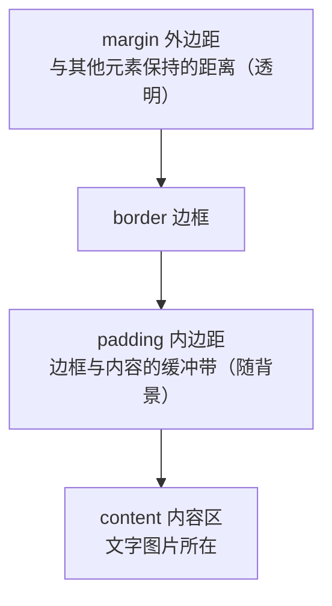
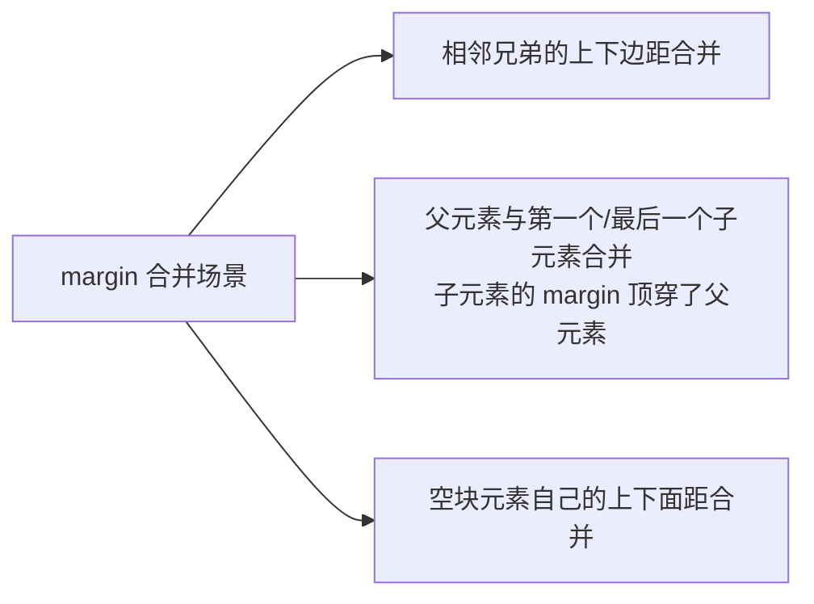

# 选择器与盒模型

上一章建立了 CSS 的最小认知，本章补齐两块最硬的骨头：**选择器大全与优先级记分法**（决定样式写在哪）、**盒模型**（决定每个元素占多大地方）。前端面试的常客、日常调试的高频案发现场，都在这一章。

---

## 选择器大全

### 属性选择器

按属性的存在与否或取值匹配：

```css
/* 存在即命中 */
[disabled] { opacity: 0.5; }

/* 完全等于 */
[type="text"] { border: 1px solid #ccc; }

/* 开头匹配：外链图标惯例 */
a[href^="https://"] { padding-right: 14px; }

/* 结尾匹配：下载链接加图标 */
a[href$=".pdf"]::after { content: " (PDF)"; }

/* 包含匹配 */
[class~="btn"] { cursor: pointer; }   /* ~ 是按词匹配，等价 .btn 但更慢 */
```

实用场景：给表单控件统一风格（`input[type="text"]`）、标记外部链接、文件类型图标。

### 伪类：状态选择器

伪类以单个冒号开头，匹配元素的**状态或位置**：

```css
/* 交互状态四件套：注意 LVHA 书写顺序 */
a:link    { color: blue; }   /* 未访问 */
a:visited { color: purple; } /* 已访问 */
a:hover   { color: red; }    /* 悬停 */
a:active  { color: orange; } /* 按下瞬间 */

/* 表单状态 */
input:focus        { border-color: #2563eb; outline: none; }
input:checked      { accent-color: #2563eb; }
input:disabled     { background: #f3f4f6; }
input:placeholder-shown { border-style: dashed; }

/* 结构位置类 */
li:first-child  { font-weight: bold; }  /* 第一个孩子 */
li:last-child   { border-bottom: none; }
tr:nth-child(odd)   { background: #fafafa; } /* 奇数行斑马纹 */
tr:nth-child(3n)    { background: #eef; }    /* 每 3 个一次 */
li:nth-last-child(2) { color: gray; }        /* 倒数第二个 */

/* 否定伪类：排除 */
li:not(:last-child)::after {
  content: ",";   /* 列表项之间加逗号，最后一项不加 */
}
```

nth-child 的公式语法 `an+b` 很灵活：`2n` 偶数、`2n+1` 奇数、`n+3` 从第 3 个开始全中。注意它数的是**所有兄弟元素**不看标签类型，混排容器里容易翻车——更精确的是 nth-of-type 系列。

### 伪元素：虚拟子元素

双冒号开头（老单冒号写法兼容），创造**不存在的元素**用于装饰：

```css
/* ::before/::after：在内容前后插入生成内容，必须有 content */
.quote::before { content: "\201C"; font-size: 3em; color: #ddd; }

/* 清除浮动的祖传写法（读懂老项目用） */
.clearfix::after {
  content: "";
  display: block;
  clear: both;
}

/* ::selection：用户选中文字时的颜色 */
p::selection { background: #2563eb; color: white; }

/* ::placeholder：占位符文字样式 */
input::placeholder { color: #9ca3af; }
```

before/after 是 CSS 装饰艺术的核心武器：引号、分隔点、三角箭头、遮罩层都靠它们凭空造出来，HTML 保持干净。

### 组合器：关系选择器

```css
/* 后代选择器（空格）：所有深度的子孙 */
article p { line-height: 1.8; }

/* 直接子代 >：只有儿子辈 */
nav > ul > li { display: inline-block; }

/* 相邻兄弟 +：紧跟着的下一个弟弟 */
h2 + p { margin-top: 0; }          /* 标题后紧跟的第一段不留上边距 */

/* 通用兄弟 ~：后面的所有弟弟（同一父元素内） */
h2 ~ p { color: #374151; }
```

组合器让"上下文样式"变得精准：比如"表格里 hover 到某行时高亮它的第一列"：

```css
tr:hover td:first-child { background: #eff6ff; }
```

---

## 优先级计算规则详解

上一章给了直觉版，现在是精确算法。浏览器把每条选择器折算成一个三元组分数 **(A, B, C)**：

| 位 | 统计对象 | 记分 |
|----|---------|------|
| A | id 选择器 | 每个 +1 |
| B | 类 / 伪类 / 属性选择器 | 各 +1 |
| C | 元素 / 伪元素选择器 | 各 +1 |

通配符 `*`、组合器（`>` `+` `~` 空格）**不计分**。比较规则：从 A 位开始逐位比，高位大者胜；全平则源码顺序后者胜。

```css
*               {}  /* (0,0,0) */
p               {}  /* (0,0,1) */
p::before       {}  /* (0,0,2) 伪元素算 C 位 */
.warning        {}  /* (0,1,0) */
p.warning       {}  /* (0,1,1) */
#header p       {}  /* (1,0,1) */
.nav li.active  {}  /* (0,2,1) 两个类一个元素 */
```

实战推演——谁赢？

```html
<nav id="main">
  <ul><li class="active">首页</li></ul>
</nav>
```

```css
li                {}  /* (0,0,1) */
.active           {}  /* (0,1,0) */
nav li            {}  /* (0,0,2) */
nav .active       {}  /* (0,1,1) */
#main .active     {}  /* (1,1,0) <- 冠军 */
```

三个铁律：

1. **A 位碾压一切 B/C 位**：(1,0,0) 大于无数个类的 (0,99,99)。这就是"id 少用于样式"的根本原因——一个 id 上场，后面所有想覆盖它的规则都得拉出更大的 id，优先级通胀从此开始
2. **行内 style 相当于 (1,0,0,0) 更高一位**，只能靠 !important 对抗
3. **!important 超脱整个体系**，多条 important 之间再按正常记分法比

类比后端：优先级像权限系统的角色继承——具体角色的授权覆盖通用角色的默认值，而 !important 是 root 权限，滥用等于全员 sudo。

---

## 盒模型完整讲解

页面上**每个元素都是一个盒子**，由四层同心结构组成：



```css
.box {
  width: 200px;
  padding: 20px;
  border: 5px solid #333;
  margin: 30px;
}
```

关键问题：这个盒子实际多宽？答案取决于 box-sizing。

### box-sizing: border-box 为什么必设

两种计算模式：

| 模式 | width 指的是 | 实际占用宽度 |
|------|-------------|-------------|
| content-box（默认） | 仅内容区 | width + padding×2 + border×2 = 200+40+10 = **250px** |
| border-box | 内容+内边距+边框整体 | **width 就是 200px**，改 padding 会压缩内容区 |

content-box 的问题：你声明 `width: 25%` 再随手加个 `padding: 10px`，实际宽度就超过 25% 了——布局像纸牌屋一样塌掉。border-box 让"你看到的 width 就是最终宽度"，心智负担骤降。

所以业界共识是全局设置：

```css
*, *::before, *::after {
  box-sizing: border-box;
}
```

几乎所有现代 CSS 框架（Tailwind、Bootstrap）的第一行都是它。上一章实战代码里你已经见过这针疫苗。

### margin 合并问题

垂直方向相邻的两个块级元素，它们的 margin 会**合并取较大者**而非相加：

```css
.p1 { margin-bottom: 30px; }
.p2 { margin-top: 20px; }
/* 两段之间的实际间距是 30px，不是 50px */
```

三种触发场景：



"父元素与子元素合并"是最坑的场景：给父元素里第一个子元素设 margin-top，结果父元素整体被顶下去了，父元素自己没获得任何间隔。阻断手段任选其一：父元素设 padding 或 border 隔开、设 overflow: hidden、改用 Flex/Grid 容器（弹性/网格容器内部不发生 margin 合并）。

注意：**水平方向永不合并**，左右 margin 是老实相加的。

### display 常用值

display 决定元素的排布身份：

| 取值 | 行为 | 典型代表 |
|------|------|---------|
| block | 独占一行，可设宽高 | div/p/h1/section |
| inline | 行内流动，**宽高无效**，上下 margin 无效 | span/a/strong |
| inline-block | 不换行 + 可设宽高，两者兼得 | 自定义按钮、导航项 |
| none | 直接从渲染树消失，不占位 | 配合 JS 显示隐藏 |
| flex / grid | 变身弹性/网格容器 | 见后续三章 |

inline 元素的经典困惑：给 span 设 width 没反应——因为它根本不是盒子模型意义上的"块"，宽高被无视。要能设尺寸又不换行，用 inline-block。

三者对比速记：

```html
<div>block：我独占一行，能设宽高</div>
<span>inline：我跟着文字流，设了宽高也没人理</span>
<button>inline-block：我不换行但可以调大小</button>
```

---

## 实战：卡片组件样式

做一个通用卡片组件，综合运用本章全部知识：属性选择器、伪类、伪元素、优先级控制、盒模型、margin 处理。保存为 `card.html` 打开。

```html
<!DOCTYPE html>
<html lang="zh-CN">
<head>
  <meta charset="UTF-8">
  <meta name="viewport" content="width=device-width, initial-scale=1.0">
  <title>卡片组件 · 选择器与盒模型实战</title>
  <style>
    /* ===== 全局重置 ===== */
    *, *::before, *::after { box-sizing: border-box; }
    body {
      font-family: "PingFang SC", "Microsoft YaHei", sans-serif;
      background: #f3f4f6;
      padding: 40px 16px;
    }

    /* ===== 卡片主体 ===== */
    .card {
      background: #fff;
      border-radius: 12px;
      padding: 24px;              /* 内边距撑起呼吸感 */
      max-width: 360px;
      margin-bottom: 24px;        /* 卡片间距交给下边距统一管理 */
      box-shadow: 0 1px 3px rgba(0,0,0,.1);
      transition: box-shadow .2s, transform .2s;
    }
    /* 悬停抬升反馈：transform 与阴影过渡，动画细节见 CSS 动画章 */
    .card:hover {
      transform: translateY(-4px);
      box-shadow: 0 8px 24px rgba(0,0,0,.15);
    }

    /* ===== 卡片头 ===== */
    .card__title {
      font-size: 18px;
      margin-bottom: 8px;
    }
    /* 用伪元素造标题下的装饰短线：不污染 HTML */
    .card__title::after {
      content: "";
      display: block;
      width: 40px;
      height: 3px;
      background: #2563eb;
      margin-top: 8px;
      border-radius: 2px;
    }

    /* ===== 徽标：属性选择器按变体着色 ===== */
    .badge {
      display: inline-block;      /* 行内但要能设 padding 和圆角 */
      font-size: 12px;
      padding: 2px 10px;
      border-radius: 999px;
      background: #e5e7eb;
      color: #374151;
    }
    .badge[data-level="hot"]  { background: #fee2e2; color: #b91c1c; }
    .badge[data-level="new"]  { background: #dbeafe; color: #1d4ed8; }

    /* ===== 底部操作区 ===== */
    .card__footer {
      display: flex;              /* 先借用 flex 排两端，详见下一章 */
      justify-content: space-between;
      align-items: center;
      margin-top: 16px;
      padding-top: 16px;
      border-top: 1px solid #f3f4f6;  /* 分隔线用 border 不用 hr */
    }
    .card__price {
      font-weight: bold;
      color: #dc2626;
    }
    .card__btn {
      border: none;
      background: #2563eb;
      color: #fff;
      padding: 8px 20px;
      border-radius: 8px;
      cursor: pointer;
    }
    .card__btn:focus-visible {    /* 键盘聚焦时才显示轮廓，鼠标点击不显示 */
      outline: 2px solid #2563eb;
      outline-offset: 2px;
    }
    .card__btn:disabled {
      background: #d1d5db;
      cursor: not-allowed;
    }

    /* ===== 斑马纹列表：结构伪类实战 ===== */
    .card ul { list-style: none; }
    .card li {
      padding: 6px 0;
    }
    .card li:nth-child(odd) {
      background: #f9fafb;
    }
    /* 最后一项去掉多余间距：not 否定伪类 */
    .card li:not(:last-child) {
      border-bottom: 1px dashed #e5e7eb;
    }
  </style>
</head>
<body>

  <!-- 卡片一：热销 -->
  <div class="card">
    <span class="badge" data-level="hot">热销</span>
    <h3 class="card__title">CSS 布局实战营</h3>
    <ul>
      <li>Flexbox 六大容器属性精讲</li>
      <li>Grid 十二列栅格演练</li>
      <li>响应式断点设计方法</li>
    </ul>
    <div class="card__footer">
      <span class="card__price">¥199</span>
      <button type="button" class="card__btn">立即报名</button>
    </div>
  </div>

  <!-- 卡片二：新课 + 禁用按钮演示 -->
  <div class="card">
    <span class="badge" data-level="new">新课上架</span>
    <h3 class="card__title">TypeScript 入门到工程化</h3>
    <ul>
      <li>类型系统核心概念</li>
      <li>泛型与类型体操入门</li>
    </ul>
    <div class="card__footer">
      <span class="card__price">¥149</span>
      <!-- disabled 态：观察 :disabled 与 :focus-visible 的效果差异 -->
      <button type="button" class="card__btn" disabled>已满员</button>
    </div>
  </div>

</body>
</html>
```

知识点对照表：

| 代码位置 | 用到的本章知识 |
|---------|---------------|
| `box-sizing: border-box` 全局重置 | 盒模型统一度量 |
| `.badge[data-level="hot"]` | 属性选择器做组件变体 |
| `.card__title::after` 画短线 | 伪元素免 HTML 装饰 |
| `li:nth-child(odd)` / `li:not(:last-child)` | 结构伪类与否定伪类 |
| `.card__btn:disabled` / `:focus-visible` | 状态伪类 |
| badge 的 `display: inline-block` | 行内但需要尺寸的场景 |
| footer 的 border 分隔线替代 hr | 盒模型边框的活用 |

命名里的 `card__title` 双下划线是 BEM 命名法（块__元素）的痕迹——它通过命名纪律规避优先级战争，大型项目值得了解。

下一步解决真正的布局问题：[[前端开发/01-基础/CSS/03-Flexbox布局|Flexbox 布局]]。
