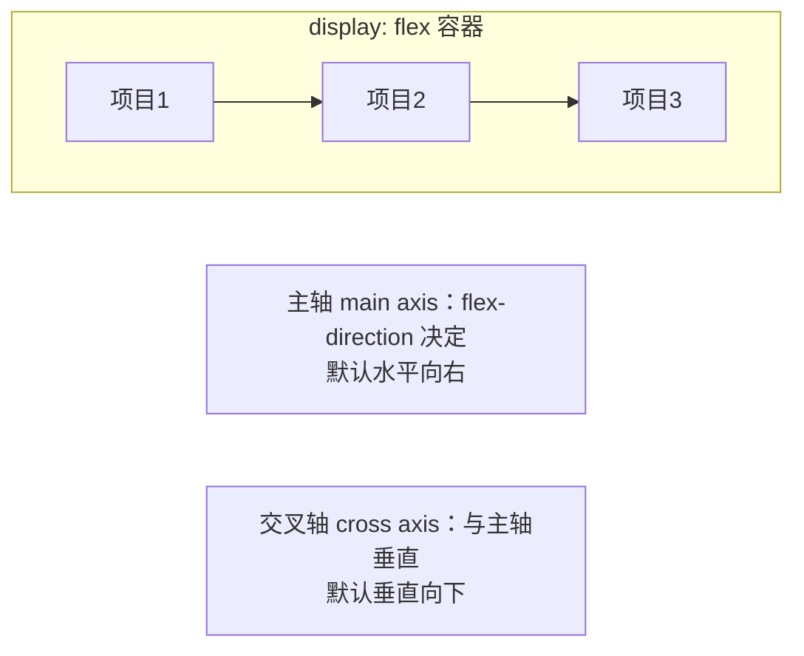
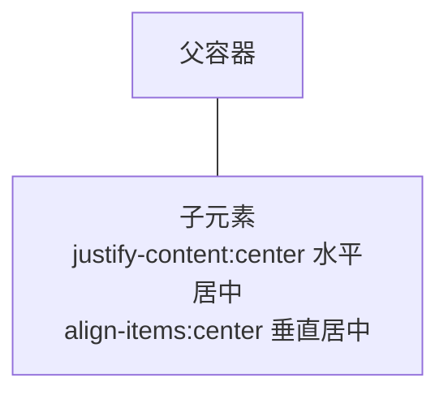
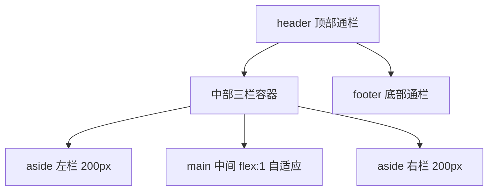

# Flexbox 布局

盒模型解决了"一个盒子多大"，布局解决"一堆盒子怎么摆"。Flexbox（弹性盒）是一维布局方案——把一行或一列的元素排整齐，是现代 CSS 布局的绝对主力。

---

## 为什么需要 Flexbox：对比 float 时代的痛苦

在 Flexbox 普及前（约 2015 年前），水平排列靠 float 浮动。它原本的设计目的是**文字环绕图片**（报纸排版效果），被硬拗来做整体布局，于是产生一堆历史名场面：

1. **父元素高度塌陷**：子元素全部浮动后脱离文档流，父元素高度变成 0
2. **需要清除浮动**：`clearfix` 黑科技、额外空标签 `<div style="clear:both">`
3. **垂直居中是玄学**：一行代码做不到，要么表格布局要么绝对定位加负边距魔法数字
4. **等高卡片要造假**：float 元素天然高度独立，想等高得靠背景图障眼法

```css
/* float 时代的水平居中 + 等高排列，感受一下 */
.clearfix::after { content: ""; display: block; clear: both; }  /* 先修塌陷 */
.col { float: left; width: 33.33%; }
```

Flexbox 把这一切变成两行代码：

```css
.row {
  display: flex;      /* 子元素横向排开，不塌陷不逃逸 */
  gap: 16px;
}
```

一句话理解 Flexbox 的本质：**给容器声明 flex 后，容器获得一套分配子元素空间与位置的规则**——类比后端资源调度：容器是调度器，子元素是被调度的任务，grow/shrink 是扩缩容权重。

## 两个轴：一切的前提

学 Flex 属性前必须先建立坐标系：



- **主轴**：项目排列的方向，由 `flex-direction` 决定
- **交叉轴**：永远垂直于主轴

所有容器属性都围绕这两个轴展开：justify-content 管**主轴**对齐，align-items 管**交叉轴**对齐。改了 flex-direction，两个轴跟着换，属性含义不变——这是很多人用 Flex 时犯迷糊的根源：记属性不如记轴。

---

## 容器六属性

设了 `display: flex` 的元素是容器，以下六个属性写在容器上：

### flex-direction：主轴方向

```css
.container {
  flex-direction: row;            /* 默认：水平，从左到右 */
  /* row-reverse                  水平反向 */
  /* column                       垂直，从上到下 */
  /* column-reverse               垂直反向 */
}
```

移动端导航折叠成纵向列表，往往就是 media query 里把 row 改成 column 一行事。

### justify-content：主轴对齐

```css
.container {
  justify-content: flex-start; /* 默认：挤向主轴起点 */
  /* center                    主轴居中 */
  /* flex-end                  挤向终点 */
  /* space-between             两端贴边，中间等分间隙 */
  /* space-around              每项两侧留隙，中间是边缘的两倍 */
  /* space-evenly              所有间隙完全相等 */
}
```

space-between 与 space-evenly 的区别最容易考：前者首尾贴边，后者首尾也留同样的空隙。

### align-items：交叉轴对齐

```css
.container {
  align-items: stretch;   /* 默认：拉伸填满交叉轴（等高的来源！） */
  /* flex-start / center / flex-end */
  /* baseline                按文字基线对齐 */
}
```

Flexbox 时代卡片自动等高不是魔法，就是 stretch 默认值在工作。

### flex-wrap：换行

```css
.container {
  flex-wrap: nowrap;   /* 默认：不换行，宁可压缩也不换 */
  /* wrap              放不下就换行 */
}
```

默认 nowrap 是新手坑：五个卡片被压成一条细缝还以为 CSS 失灵了。

### align-content：多行的对齐

只在**换行后出现多行**时生效，管的是"行与行之间怎么分配交叉轴空间"。单行时设了也没反应——又一个常见困惑点。

### gap：间距

```css
.container { gap: 16px; }        /* 行列同距 */
.container { gap: 8px 24px; }    /* 行距 列距 */
```

gap 出现前的年代，卡片间距全靠 margin 加 `nth-child` 清边距，代码又臭又长。现在一律 gap，它是 Flex 和 Grid 通用的。

## 项目六属性

写在**子元素**上的属性：

### flex-grow / shrink / basis 三兄弟

```css
.item {
  flex-grow: 0;    /* 有剩余空间时分不分羹：默认 0 不分 */
  flex-shrink: 1;  /* 空间不够时缩不缩：默认 1 缩 */
  flex-basis: auto;/* 分配前的基准尺寸：默认看 width/height */
}
```

三者合成的简写就是著名的 `flex`：

| 写法 | 展开 | 含义 |
|------|------|------|
| `flex: 1` | `1 1 0%` | 平分剩余空间（grow=1），可缩，基准归零 |
| `flex: auto` | `1 1 auto` | 分空间但按内容大小为基准 |
| `flex: none` | `0 0 auto` | 完全固定，不伸不缩 |
| `flex: 0 0 200px` | 同左 | 死板地占 200px |

所以 **`flex: 1` = "大家平分蛋糕，且不以内容多少偏心"**。经典三段式侧栏布局：

```css
.layout aside  { flex: 0 0 240px; }  /* 侧栏定死 240px */
.layout main   { flex: 1; }          /* 内容区吃掉全部剩余宽度 */
```

### order：改变视觉顺序

```css
.item.urgent { order: -1; }  /* 默认都是 0，越小越靠前 */
```

DOM 顺序不动、显示顺序重排。注意读屏器仍按 DOM 顺序朗读，别用它打乱内容逻辑顺序。

### align-self：单个项目的越权

```css
.item.special { align-self: flex-end; }  /* 只这一个沉底 */
```

覆盖容器的 align-items 对该项目的设置，用于个别例外。

---

## 经典布局套路

### 套路一：水平垂直居中

曾经的前端面试第一题，现在是送分题：

```css
.parent {
  display: flex;
  justify-content: center;  /* 主轴居中 */
  align-items: center;      /* 交叉轴居中 */
}
```



对比 float 时代需要"绝对定位 + top 50% left 50% + translate(-50%,-50%)"的三段魔法，这就是工具进步的意义。

### 套路二：等分布局

```css
.row { display: flex; gap: 16px; }
.col { flex: 1; }   /* 每列 grow=1 basis=0 => 绝对均分 */
```

想要 2:1 分配？`flex: 2` 与 `flex: 1` 而已。

### 套路三：圣杯布局

上中下结构 + 中间三栏（两侧定宽、中间自适应），CSS 布局的"Hello World Plus"：



完整实现只需十几行：

```css
.holy-grail {
  display: flex;
  flex-direction: column;
  min-height: 100vh;         /* 整体至少撑满视口高 */
}
.holy-grail header,
.holy-grail footer {
  padding: 16px;
  background: #1f2937;
  color: #fff;
}
.holy-grail .middle {
  display: flex;
  flex: 1;                   /* 吃掉 header/footer 之外的垂直剩余 */
}
.holy-grail aside {
  flex: 0 0 200px;           /* 左右定宽 */
  background: #e5e7eb;
}
.holy-grail main {
  flex: 1;                   /* 中间自适应 */
  background: #fff;
}
```

对比 float 时代圣杯布局需要的负 margin 大法，你会庆幸自己生在了 Flex 之后。

---

## 实战：导航栏 + 三栏内容区

综合运用本章知识写一个完整页面。保存为 `flex-layout.html` 打开。

```html
<!DOCTYPE html>
<html lang="zh-CN">
<head>
  <meta charset="UTF-8">
  <meta name="viewport" content="width=device-width, initial-scale=1.0">
  <title>Flexbox 实战 · 导航栏与三栏内容区</title>
  <style>
    * { box-sizing: border-box; margin: 0; padding: 0; }

    body {
      font-family: "PingFang SC", "Microsoft YaHei", sans-serif;
      min-height: 100vh;
      display: flex;              /* 页面骨架本身就是一个大 flex 容器 */
      flex-direction: column;
    }

    /* ===== 导航栏 ===== */
    .navbar {
      display: flex;
      align-items: center;        /* logo 与链接垂直居中对齐 */
      gap: 32px;                  /* 区块间距统一交给 gap */
      padding: 12px 24px;
      background: #1f2937;
      color: #fff;
    }
    .logo { font-weight: bold; font-size: 18px; }
    .nav-links {
      display: flex;
      gap: 4px;
      list-style: none;
      margin-left: auto;          /* 关键技巧：auto 外边距吃掉左侧剩余空间，
                                     从而把自己推到最右 —— 推挤式右对齐 */
    }
    .nav-links a {
      color: #d1d5db;
      text-decoration: none;
      padding: 8px 14px;          /* 扩大点击热区 */
      border-radius: 6px;
    }
    .nav-links a:hover { background: #374151; color: #fff; }
    .nav-links a.active { background: #2563eb; color: #fff; }

    /* ===== 三栏内容区 ===== */
    .content {
      flex: 1;                    /* 占据 navbar 与 footer 之间的全部剩余高度 */
      display: flex;
      gap: 16px;
      padding: 16px;
      max-width: 1200px;
      margin: 0 auto;             /* 大屏下整块居中 */
      width: 100%;
    }
    .sidebar {
      flex: 0 0 220px;            /* 定宽不伸缩 */
      background: #fff;
      border-radius: 10px;
      padding: 16px;
    }
    .main-area {
      flex: 1;                    /* 吃掉全部剩余宽度 */
      background: #fff;
      border-radius: 10px;
      padding: 24px;
      display: flex;
      flex-direction: column;     /* 内部再开一个纵向 flex */
      gap: 16px;
    }
    .right-panel {
      flex: 0 0 260px;
      background: #fff;
      border-radius: 10px;
      padding: 16px;
    }

    /* 卡片流：换行 + 自动伸缩 */
    .card-row { display: flex; flex-wrap: wrap; gap: 12px; }
    .mini-card {
      flex: 1 1 180px;            /* 基准 180px，可伸可缩，放不下自动换行 */
      background: #eff6ff;
      border-radius: 8px;
      padding: 16px;
    }

    /* 底部操作条：两端对齐 */
    .action-bar {
      margin-top: auto;           /* 纵向 flex 里推到最底 */
      display: flex;
      justify-content: space-between;
      align-items: center;
      border-top: 1px solid #e5e7eb;
      padding-top: 16px;
    }

    footer {
      text-align: center;
      padding: 16px;
      color: #9ca3af;
      background: #f3f4f6;
    }

    /* 窄屏适配预告：隐藏右栏、收窄左栏 */
    @media (max-width: 900px) {
      .right-panel { display: none; }
    }
    @media (max-width: 600px) {
      .content { flex-direction: column; }  /* 三栏变单列堆叠 */
      .sidebar { flex: none; }
    }
  </style>
</head>
<body>

  <nav class="navbar">
    <span class="logo">RootStack</span>
    <ul class="nav-links">
      <li><a href="#" class="active">首页</a></li>
      <li><a href="#">文档</a></li>
      <li><a href="#">社区</a></li>
    </ul>
  </nav>

  <div class="content">
    <!-- 左栏 -->
    <aside class="sidebar">
      <h3>分类</h3>
      <p>前端 / 后端 / 数据库</p>
    </aside>

    <!-- 中间主区 -->
    <main class="main-area">
      <h1>本周精选课程</h1>
      <div class="card-row">
        <div class="mini-card"><strong>Flexbox</strong><p>一维布局完全掌握</p></div>
        <div class="mini-card"><strong>Grid</strong><p>二维布局自由排版</p></div>
        <div class="mini-card"><strong>响应式</strong><p>从手机到桌面全覆盖</p></div>
      </div>

      <div class="action-bar">
        <span>共 3 门课程</span>
        <button type="button">查看全部</button>
      </div>
    </main>

    <!-- 右栏 -->
    <aside class="right-panel">
      <h3>公告</h3>
      <p>新课程持续更新中。</p>
    </aside>
  </div>

  <footer>© 2026 RootStack</footer>
</body>
</html>
```

技术点回顾：

1. **页面级 flex 纵向骨架**：body 本身做容器，footer 永远沉底（哪怕内容不足一屏）
2. **margin-left: auto 右推导航**：比 justify-content 更灵活的"局部右对齐"手法
3. **flex: 0 0 Npx 定宽栏 + flex: 1 自适应栏**：三栏布局的标准姿势
4. **flex: 1 1 180px 卡片流**：basis 给最小期望值，配合 wrap 实现放不下就换行
5. **嵌套 flex 各司其职**：外层横排、内层纵排，每个容器只管自己的一维

一维的 Flex 讲完了，二维网格见 [[前端开发/01-基础/CSS/04-Grid布局|Grid 布局]]。
