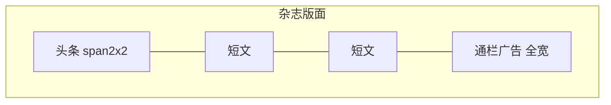
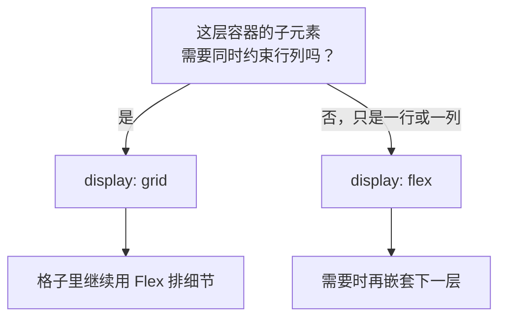

# Grid 布局

Flexbox 解决一维（一行或一列），Grid 解决二维（行列同时规划）。如果说 Flex 是"把货摆成一排"，Grid 就是"先画好货架格子再上货"。两者不是竞争关系，而是分工协作。

---

## Grid vs Flexbox 选型

核心判断：**布局需求是一维的还是二维的？**

| 场景 | 选谁 | 理由 |
|------|------|------|
| 导航条、按钮组、标签列表 | Flex | 单行排列 |
| 内容区 + 侧栏 | 都行 | 本质是一行，Flex 更轻 |
| 页面整体框架（头/侧栏/内容/脚） | **Grid** | 行列交织的骨架 |
| 卡片流自适应列数 | **Grid** | 行列同时约束 |
| 表单控件排布 | Flex | 一维流式 |
| 仪表盘多区块拼图 | **Grid** | 典型二维 |
| 元素内局部微调对齐 | Flex | 灵活精细 |

决策一句话：**从外到内 Grid，从内到外 Flex**——页面大骨架用 Grid 划格子，每个格子里面的细节排列用 Flex。实际项目里两者嵌套共存才是常态。

类比后端：Grid 像数据库表结构（先定行列 schema 再填数据），Flex 像队列先进先出（只管顺序流）。

---

## 容器属性

### grid-template-columns / rows：定义轨道

```css
.grid {
  display: grid;
  grid-template-columns: 200px 1fr 2fr;   /* 三列：定宽 + 1 份 + 2 份 */
  grid-template-rows: auto 1fr auto;      /* 三行：自适应/撑满/自适应 */
}
```

**fr 单位**（fraction）是 Grid 的灵魂：表示剩余空间的份数。`1fr 2fr` = 剩余空间按 1:2 分配——比百分比好在它基于"分完剩余之后"计算，不会溢出。

三个必会函数：

```css
/* repeat()：重复模式 */
grid-template-columns: repeat(3, 1fr);          /* 等价 1fr 1fr 1fr */
grid-template-columns: repeat(12, 1fr);         /* 十二列栅格 */

/* minmax()：给轨道设弹性区间 */
grid-template-columns: minmax(200px, 1fr) 300px;

/* auto-fill + minmax：自动填充，响应式神器 */
grid-template-columns: repeat(auto-fill, minmax(240px, 1fr));
```

`repeat(auto-fill, minmax(240px, 1fr))` 这一行值得背下来：容器能塞几个至少 240px 的列就自动生成几列，每列均分剩余空间；屏幕变窄列数自动减少，**零媒体查询实现响应式相册**。auto-fit 与 auto-fill 的细微差别：空间富余时 auto-fit 会把空轨道折叠掉让已有列拉伸占满，卡片场景通常 auto-fit 观感更好。

### gap：间距

```css
.grid { gap: 16px; }        /* 或 row-gap / column-gap 分开设 */
```

与 Flex 的 gap 同源，格子之间的沟壑，替代 margin 排版的利器。

### grid-area 与模板

命名区域让布局代码变成"画图纸"：

```css
.layout {
  display: grid;
  grid-template-areas:
    "header header header"
    "side   main   ads"
    "footer footer footer";
  grid-template-rows: auto 1fr auto;
  grid-template-columns: 220px 1fr 260px;
}

.layout > header { grid-area: header; }
.layout > aside.side { grid-area: side; }
.layout > main { grid-area: main; }
```

字符串里每一行引号就是一行格子，相同名字连成的矩形就是一个区域。布局结构一眼可读，这是 Grid 最优雅的表达方式。

## 项目属性

写在子元素上的定位手段：

```css
.item {
  /* 指定占据哪些网格线（线从 1 开始数，不是从 0！） */
  grid-column: 1 / 3;      /* 从第 1 条竖线到第 3 条 => 占两列 */
  grid-row: 2 / 4;         /* 占两行 */

  /* span 关键字：跨几格更直观 */
  grid-column: span 2;     /* 横跨两格 */
  grid-row: span 3;

  /* 不指定任何定位 => 按源码顺序自动填格子 */
}
```

注意网格线编号从 **1** 开始（0 号不存在），`1 / 3` 表示"从 1 号线画到 3 号线"，占的是第 1、2 两格。负数表示倒数（`-1` 是最后一条线），`grid-column: 2 / -1` 即"从第二列占到最右"。

---

## 经典布局

### 十二列栅格

设计界的通用度量衡（Bootstrap 底层同款思想）：

```css
.page {
  display: grid;
  grid-template-columns: repeat(12, 1fr);
  gap: 16px;
}
.col-8  { grid-column: span 8; }
.col-4  { grid-column: span 4; }
.col-12 { grid-column: span 12; }
```

任何"8+4""6+6""4+4+4"的组合随手拼装，这就是后台系统表单区的标准打法。

### 杂志排版

图文混排、大小错落的编辑风格：



```css
.magazine {
  display: grid;
  grid-template-columns: repeat(4, 1fr);
  gap: 24px;
}
.headline { grid-column: span 2; grid-row: span 2; }
.ad-wide  { grid-column: 1 / -1; }    /* 通栏 */
```

### 响应式相册（无媒体查询）

前面背过的那一行，完整效果：

```css
.gallery {
  display: grid;
  grid-template-columns: repeat(auto-fill, minmax(180px, 1fr));
  gap: 12px;
}
```

窗口拉宽列数变多、拉窄自动减列且不出现横向滚动条——过去需要写四五档 media query 的活，现在一行声明交给浏览器自己算。

---

## 常见陷阱清单

1. **网格线从 1 开始数**：`grid-column: 0` 是无效值；三条线的两列布局，线号是 1、2、3、4
2. **fr 不是尺寸是份数**：`200px 1fr` 里 1fr 拿的是"扣掉 200px 之后"的剩余空间，别拿它跟 px 直接心算加法
3. **隐式网格**：子元素数量超过模板定义的格子时，浏览器会自动生成隐式行列（比如模板只定了一行却放了六个子元素），它们默认 auto 高——用 `grid-auto-rows: minmax(100px, auto)` 控制隐式行高
4. **grid-template-areas 的字符串必须每行列数一致**：少写一个名字整张图纸作废，布局直接散架且报错不直观
5. **命名区域必须是矩形**："L 形"同名区域非法，需要 L 形效果就拆成两个区域

### 与 Flex 的混用心法

最后给一条工程化经验：不要追求"全站 Grid"或"全站 Flex"的纯洁性。判断标准永远是当前这一层容器在排什么——



上一章的圣杯布局用 Flex 实现、本章仪表盘用 Grid 实现，两者最终效果可以完全一致——区别在于哪种心智模型写起来更自然。布局能力成熟的标志不是背熟所有属性，而是看到设计稿三秒内说出每一层该用什么。

---

## 实战：后台管理仪表盘布局

Grid 骨架 + Flex 细节的标准组合。保存为 `dashboard.html` 打开，缩放窗口观察各区块行为。

```html
<!DOCTYPE html>
<html lang="zh-CN">
<head>
  <meta charset="UTF-8">
  <meta name="viewport" content="width=device-width, initial-scale=1.0">
  <title>Grid 实战 · 后台管理仪表盘</title>
  <style>
    * { box-sizing: border-box; margin: 0; padding: 0; }
    body {
      font-family: "PingFang SC", "Microsoft YaHei", sans-serif;
      background: #f3f4f6;
    }

    /* ===== 页面级 Grid 骨架：命名区域画图纸 ===== */
    .app {
      display: grid;
      grid-template-areas:
        "sidebar topbar"
        "sidebar main";
      grid-template-columns: 220px 1fr;   /* 左侧栏定宽，右侧自适应 */
      grid-template-rows: 56px 1fr;       /* 顶栏固定高，下面全归主区 */
      height: 100vh;                      /* 整屏应用不出滚动条的框架感 */
    }

    .sidebar {
      grid-area: sidebar;
      background: #111827;
      color: #9ca3af;
      padding: 16px 8px;
    }
    .topbar {
      grid-area: topbar;
      display: flex;              /* 二维骨架内部的一维细节交给 Flex */
      align-items: center;
      gap: 16px;
      background: #fff;
      padding: 0 24px;
      box-shadow: 0 1px 2px rgba(0,0,0,.06);
    }
    .main {
      grid-area: main;
      padding: 24px;
      overflow-y: auto;           /* 只有主区滚动，典型后台体验 */
    }

    /* ===== 主区内统计卡行：自适应列数 ===== */
    .stat-row {
      display: grid;
      grid-template-columns: repeat(auto-fit, minmax(200px, 1fr));
      gap: 16px;
      margin-bottom: 24px;
    }
    .stat-card {
      background: #fff;
      border-radius: 10px;
      padding: 20px;
    }
    .stat-card .num {
      font-size: 28px;
      font-weight: bold;
      margin-top: 8px;
    }

    /* ===== 图表区：8+4 栅格 ===== */
    .chart-row {
      display: grid;
      grid-template-columns: repeat(12, 1fr);
      gap: 16px;
    }
    .chart-main { grid-column: span 8; }
    .chart-side { grid-column: span 4; }

    .panel {
      background: #fff;
      border-radius: 10px;
      padding: 20px;
      min-height: 280px;
    }
    .panel h2 { font-size: 16px; margin-bottom: 16px; }

    /* ===== 侧栏菜单：纵向 Flex ===== */
    .menu {
      list-style: none;
      display: flex;
      flex-direction: column;
      gap: 4px;
    }
    .menu a {
      display: block;
      color: inherit;
      text-decoration: none;
      padding: 10px 14px;
      border-radius: 6px;
    }
    .menu a:hover { background: #1f2937; color: #fff; }
    .menu a.active { background: #2563eb; color: #fff; }

    /* 窄屏：隐藏侧栏改为单列（正式项目可做成抽屉） */
    @media (max-width: 768px) {
      .app {
        grid-template-areas: "topbar" "main";
        grid-template-columns: 1fr;
        grid-template-rows: 56px 1fr;
      }
      .sidebar { display: none; }
      .chart-main, .chart-side { grid-column: span 12; }
    }
  </style>
</head>
<body>
  <div class="app">

    <aside class="sidebar">
      <ul class="menu">
        <li><a href="#" class="active">仪表盘</a></li>
        <li><a href="#">订单管理</a></li>
        <li><a href="#">用户管理</a></li>
        <li><a href="#">系统设置</a></li>
      </ul>
    </aside>

    <header class="topbar">
      <strong>运营仪表盘</strong>
      <span style="margin-left:auto">管理员：张三</span>
    </header>

    <main class="main">
      <!-- 统计卡 -->
      <div class="stat-row">
        <div class="stat-card">今日访问<strong class="num">12,480</strong></div>
        <div class="stat-card">新增用户<strong class="num">326</strong></div>
        <div class="stat-card">订单量<strong class="num">892</strong></div>
        <div class="stat-card">转化率<strong class="num">4.7%</strong></div>
      </div>

      <!-- 图表区 -->
      <div class="chart-row">
        <section class="panel chart-main">
          <h2>近 30 天访问趋势</h2>
          <p>此处接入 ECharts 折线图，见数据可视化篇。</p>
        </section>
        <section class="panel chart-side">
          <h2>流量来源占比</h2>
          <p>此处接入 ECharts 饼图。</p>
        </section>
      </div>
    </main>

  </div>
</body>
</html>
```

代码要点：

1. **命名区域两级骨架**："sidebar topbar / sidebar main" 一张图纸说清整页结构，改布局只动模板字符串
2. **Grid 与 Flex 各就各位**：页面框架与图表拼盘用 Grid，顶栏内部横排与侧栏菜单纵排用 Flex
3. **auto-fit 统计卡**：四张卡在宽屏一排、中屏两排、窄屏竖排，全程零干预
4. **span 栅格响应**：窄屏下 `span 8/4` 改 `span 12`，图表上下堆叠
5. **overflow-y 只给主区**：侧栏顶栏恒定可见，这是"应用型页面"与"文档型页面"的本质区别

布局双雄到齐。接下来让页面动起来：[[前端开发/01-基础/CSS/05-CSS3动画与过渡|CSS3 动画与过渡]]。
