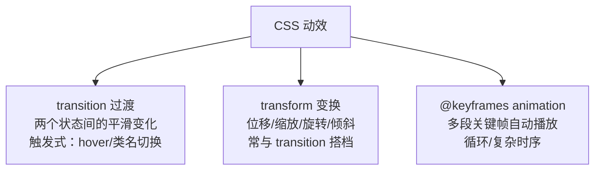
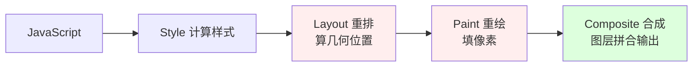

# CSS3 动画与过渡

页面会动才有"活"的感觉。CSS 负责动效的三套机制：**transition 过渡**（状态 A 到 B 的补间）、**transform 变换**（位移缩放旋转）、**animation 关键帧动画**（多段复杂动画）。本章讲清三者分工，以及最重要的性能原理——为什么动画永远用 transform 而不是 top/left。

---

## 三种动效手段的分工



一句话选型：

- 用户触发一个简单变化（悬停变色放大）→ `transition`
- 元素位置形态变化（位移旋转）→ `transform`（通常和 transition 配对）
- 不需要交互触发、有多段情节、要循环 → `@keyframes + animation`

---

## transition 四属性

transition 让属性变化不再"瞬移"，而是平滑插值：

```css
.button {
  background: #2563eb;
  /* 完整写法：参与过渡的属性 时长 缓动函数 延迟 */
  transition: background-color 0.3s ease 0s,
              transform 0.2s ease-out;
}
.button:hover {
  background: #1d4ed8;
  transform: scale(1.05);
}
```

四个子属性拆解：

| 子属性 | 说明 | 默认 |
|--------|------|------|
| transition-property | 参与过渡的属性名，all 表示全部 | all |
| transition-duration | 时长，**必填**，没它等于没过渡 | 0s |
| transition-timing-function | 缓动曲线 | ease |
| transition-delay | 延迟后才开始 | 0s |

缓动函数常用值：

```css
ease          /* 默认：快进慢出，通用 */
linear        /* 匀速：适合循环动画如 spinner */
ease-in       /* 慢启动：离场 */
ease-out      /* 慢刹车：入场，UI 交互首选 */
ease-in-out   /* 两头慢 */
cubic-bezier(0.34, 1.56, 0.64, 1)  /* 自定义贝塞尔，可做出回弹感 */
steps(8)      /* 阶梯式跳变：帧动画、打字机效果 */
```

三个易错点：

1. **transition 写在起始状态上而不是 :hover 里**——写在 hover 里会导致移开鼠标时瞬间还原（没有过渡）
2. **display: none 无法过渡**——元素从渲染树消失再出现，中间没有任何"过程"可言；需要淡入淡出隐藏请用 opacity + visibility 组合
3. **auto 值无法过渡**——height 从 0 到 auto 浏览器不会插值；折叠菜单要么用 max-height 近似，要么用 Grid 的 `grid-template-rows: 0fr -> 1fr` 技巧

---

## transform 二维三维变换

transform 对元素施加几何变换：

```css
.box {
  /* 二维 */
  transform: translateX(20px) translateY(-10px);  /* 位移 */
  transform: translate(20px, -10px);              /* 同上简写 */
  transform: scale(1.2) scale(0.8, 0.5);          /* 缩放：均匀 / 分轴 */
  transform: rotate(45deg);                       /* 旋转 */

  /* 三维 */
  transform: perspective(800px) rotateX(30deg);   /* 透视 + 绕 X 轴翻 */
  transform: translateZ(50px);

  /* 组合：从左到右依次应用，顺序影响结果！ */
  transform: translate(100px, 0) rotate(90deg);
}
```

要点：

- **变换不脱离文档流**：元素移走后原位置仍占坑（对比 position 定位会腾地方），所以 translate 不会引起周围元素重排
- **默认变换中心是元素几何中心**，可用 `transform-origin: left top` 改
- **组合顺序有讲究**：先 rotate 再 translate 与先 translate 再 rotate 结果不同（坐标系被旋转了）

### 为什么动画用 transform 不用 top/left：合成层性能原理

这是本章最重要的一节。浏览器渲染一帧的流水线：



改不同属性，触发的流水线阶段完全不同：

| 改动的属性 | 触发阶段 | 成本 |
|-----------|---------|------|
| width / height / top / left / margin | Layout → Paint → Composite | 最高：自己和周围全得重新排版 |
| color / background | Paint → Composite | 中等：不用重排但要重绘 |
| **transform / opacity** | **仅 Composite** | **最低：GPU 直接搬图层** |

原理：浏览器会把设置了 transform/opacity 的元素提升为**合成层**（可以理解为贴到 GPU 里的一张独立贴图）。之后做位移动画只是让 GPU 挪贴图，Layout 和 Paint 全程不参与——这就是为什么滚动页面时 transform 动画依然丝滑。

结论记死：**位移动画用 translate，不用 top/left；透明度动画用 opacity，不用 visibility 硬切**。

---

## @keyframes 与 animation

transition 只能处理两态切换，复杂剧情交给关键帧：

```css
/* 定义关键帧：描述动画剧本 */
@keyframes pulse {
  0%   { transform: scale(1);   opacity: 1; }
  50%  { transform: scale(1.15); opacity: .8; }
  100% { transform: scale(1);   opacity: 1; }
}

/* 应用到元素 */
.badge {
  animation: pulse 1.5s ease-in-out infinite;  /* 名字 时长 缓动 循环次数 */
}
```

animation 八个子属性：

| 属性 | 说明 |
|------|------|
| animation-name | 关键帧名 |
| animation-duration | 时长 |
| animation-timing-function | 缓动 |
| animation-delay | 延迟 |
| animation-iteration-count | 次数，infinite 无限 |
| animation-direction | alternate 可实现往返（去程+回程） |
| animation-fill-mode | forwards 保持结束帧（最常用） |
| animation-play-state | paused/running 控制播放暂停 |

fill-mode 是新手必踩的坑：动画结束后元素会跳回原始样式——想让结束状态保留就写 `animation-fill-mode: forwards`。

transition vs animation 的选择再强调一次：hover 反馈用 transition（跟随用户手势，快进快出）；加载指示、轮播、进场序列用 keyframes（自主运行）。

---

## 常用动效实例

以下三个例子将在实战部分组装成完整页面：

### 按钮悬停

```css
.btn {
  padding: 10px 24px;
  border: none;
  background: #2563eb;
  color: #fff;
  border-radius: 8px;
  cursor: pointer;
  transition: transform .15s ease-out, box-shadow .15s ease-out;
}
.btn:hover {
  transform: translateY(-2px);              /* 上浮 */
  box-shadow: 0 6px 16px rgba(37,99,235,.4);
}
.btn:active {
  transform: translateY(0) scale(.97);      /* 按下回落微缩：按压手感 */
}
```

细节：hover 与 active 各有反馈，且只动 transform 和阴影——性能安全区。

### 加载 spinner

```css
.spinner {
  width: 36px;
  height: 36px;
  border: 4px solid #dbeafe;
  border-top-color: #2563eb;      /* 一段异色：转起来像圆环缺口 */
  border-radius: 50%;
  animation: spin .8s linear infinite;  /* 匀速循环 */
}
@keyframes spin {
  to { transform: rotate(360deg); }     /* 只有终态，起点即当前样式 */
}
```

匀速 linear 很关键——spinner 用 ease 会一顿一顿像卡了。

### 模态框淡入

```css
.modal-mask {
  position: fixed; inset: 0;
  background: rgba(0,0,0,.45);
  opacity: 0;
  visibility: hidden;
  transition: opacity .25s, visibility .25s;
}
.modal-mask.show {
  opacity: 1;
  visibility: visible;
}
.modal-card {
  transform: translateY(24px) scale(.96);
  transition: transform .25s ease-out;
}
.modal-mask.show .modal-card {
  transform: translateY(0) scale(1);    /* 弹窗上滑归位 */
}
```

注意隐藏方案用的是 `opacity + visibility` 而非 display:none——visibility 是可过渡属性（离散插值），配合延迟能实现"先淡出再消失"，而 display 做不到。

---

## 性能注意点

1. **只动画 transform 与 opacity**：前文流水线原理的直接推论。width/top/margin 动画每帧都触发重排，列表一大直接掉帧
2. **需要"改变布局尺寸"的效果换个思路**：抽屉展开用 translateX 移入而不是 width 从 0 到 300px；下拉菜单用 scaleY 或 clip-path 而不是 height
3. **transition 别滥用 all**：`transition: all` 会让任何属性变化都走过渡（包括你不想动的），还可能意外触发昂贵属性的过渡；点名声明需要的属性
4. **无限循环动画注意耗电**：移动端大量 infinite 动画明显耗电，离开视口的动画考虑暂停
5. **尊重系统减弱动态偏好**（无障碍加分项）：

```css
@media (prefers-reduced-motion: reduce) {
  *, *::before, *::after {
    animation-duration: 0.01ms !important;
    transition-duration: 0.01ms !important;
  }
}
```

---

## 实战：动效演示页

把三组实例组装成完整可运行页面，附一个"反例开关"直观感受性能差异。保存为 `animation-demo.html` 打开。

```html
<!DOCTYPE html>
<html lang="zh-CN">
<head>
  <meta charset="UTF-8">
  <meta name="viewport" content="width=device-width, initial-scale=1.0">
  <title>CSS3 动效实战 · 过渡/变换/关键帧</title>
  <style>
    * { box-sizing: border-box; margin: 0; padding: 0; }
    body {
      font-family: "PingFang SC", "Microsoft YaHei", sans-serif;
      max-width: 760px;
      margin: 0 auto;
      padding: 40px 16px;
      line-height: 1.8;
    }
    section { margin-bottom: 48px; }
    h2 { font-size: 20px; margin-bottom: 16px; }

    /* ===== 实例一：按钮悬停 ===== */
    .btn {
      padding: 10px 28px;
      border: none;
      background: #2563eb;
      color: #fff;
      font-size: 15px;
      border-radius: 8px;
      cursor: pointer;
      /* 点名声明要过渡的属性，不用 all */
      transition: transform .15s ease-out, box-shadow .15s ease-out;
    }
    .btn:hover  { transform: translateY(-2px);
                  box-shadow: 0 6px 16px rgba(37,99,235,.35); }
    .btn:active { transform: translateY(0) scale(.97); box-shadow: none; }

    /* ===== 实例二：加载 spinner ===== */
    .loading-row { display: flex; align-items: center; gap: 12px; }
    .spinner {
      width: 32px; height: 32px;
      border: 4px solid #dbeafe;
      border-top-color: #2563eb;
      border-radius: 50%;
      animation: spin .8s linear infinite;
    }
    @keyframes spin { to { transform: rotate(360deg); } }

    /* ===== 实例三：模态框 ===== */
    .modal-mask {
      position: fixed; inset: 0;
      background: rgba(0,0,0,.45);
      display: flex;
      align-items: center;
      justify-content: center;
      opacity: 0;
      visibility: hidden;
      transition: opacity .25s ease, visibility .25s;
      z-index: 10;
    }
    .modal-card {
      background: #fff;
      border-radius: 12px;
      padding: 32px;
      max-width: 400px;
      transform: translateY(24px) scale(.96);
      transition: transform .25s ease-out;
    }
    .modal-mask.show { opacity: 1; visibility: visible; }
    .modal-mask.show .modal-card { transform: translateY(0) scale(1); }

    /* ===== 性能反例开关 ===== */
    .demo-box {
      width: 80px; height: 80px;
      background: #2563eb;
      border-radius: 8px;
      color: #fff;
      display: flex;
      align-items: center;
      justify-content: center;
    }
    .good-run { animation: slide-transform 2s ease-in-out infinite alternate; }
    .bad-run  { animation: slide-leftprop 2s ease-in-out infinite alternate; }

    /* 正确示范：只动 transform，GPU 合成层完成 */
    @keyframes slide-transform { from { transform: translateX(0); }
                                 to   { transform: translateX(500px); } }
    /* 反面教材：动 left 属性，每帧触发重排 */
    .demo-box { position: relative; }
    @keyframes slide-leftprop { from { left: 0; }
                                to   { left: 500px; } }
  </style>
</head>
<body>

  <section>
    <h2>按钮悬停反馈</h2>
    <button type="button" class="btn">悬停我试试</button>
  </section>

  <section>
    <h2>加载指示器</h2>
    <div class="loading-row">
      <div class="spinner"></div>
      <span>数据加载中……</span>
    </div>
  </section>

  <section>
    <h2>性能对照实验</h2>
    <p>打开 DevTools Performance 面板录制两种动画，观察 Rendering 的重排次数差异。</p>
    <button type="button" class="btn" id="goodBtn">transform 版</button>
    <button type="button" class="btn" id="badBtn">left 版（反例）</button>
    <p style="margin-top:16px"><span class="demo-box" id="demoBox">盒子</span></p>
  </section>

  <!-- 模态框：初始隐藏 -->
  <div class="modal-mask" id="mask">
    <div class="modal-card">
      <h2 style="margin-bottom:8px">模态框标题</h2>
      <p style="margin-bottom:20px">淡入 + 上滑归位，全部由 CSS 完成。</p>
      <button type="button" class="btn" id="closeBtn">关闭</button>
    </div>
  </div>

  <section>
    <h2>模态框</h2>
    <button type="button" class="btn" id="openBtn">打开模态框</button>
  </section>

  <script>
    // 模态框开关：JS 只负责切换类名，动画全权交给 CSS 过渡
    var mask = document.getElementById('mask');
    document.getElementById('openBtn').addEventListener('click', function () {
      mask.classList.add('show');
    });
    document.getElementById('closeBtn').addEventListener('click', function () {
      mask.classList.remove('show');
    });

    // 性能实验：切换两种动画类名
    var box = document.getElementById('demoBox');
    document.getElementById('goodBtn').addEventListener('click', function () {
      box.className = 'demo-box good-run';
    });
    document.getElementById('badBtn').addEventListener('click', function () {
      box.className = 'demo-box bad-run';
    });
  </script>
</body>
</html>
```

要点回顾：

1. **JS 与 CSS 的职责边界**：脚本只增删类名（`classList.add/remove`），所有视觉变化由 CSS transition 驱动——现代前端的标准协作模式
2. **visibility 替代 display**：模态框淡入淡出的正确姿势，display 会杀死过渡
3. **对照实验**：分别点两个按钮并开启 DevTools 的 Performance 录制，left 版能看到密集的紫色 Layout 条，transform 版几乎干净——亲眼见过一次，胜过背十遍理论

静态页面至此完整。下一步是把前面所有页面改造成手机到桌面全覆盖：[[前端开发/01-基础/CSS/06-CSS实战：响应式设计|CSS 实战：响应式设计]]。
