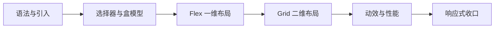

# CSS 实战：响应式设计

同一份 HTML，手机上单列、平板上两列、桌面上三栏——这就是响应式设计（Responsive Web Design）。本章是 CSS 基础篇的收官战：把前几章的页面改造成从 320px 手机到 2560px 显示器全覆盖的成品。

---

## 前置回顾：viewport meta

响应式的第一块基石其实在 HTML 里，[[前端开发/01-基础/HTML/02-HTML表单与语义化|表单与语义化]] 章讲过：

```html
<meta name="viewport" content="width=device-width, initial-scale=1.0">
```

没有它，手机浏览器按约 980px 的虚拟宽度渲染页面再整体缩小——你写的一切媒体查询都不会按预期触发。检查任何老项目"媒体查询不生效"的问题，先看这行在不在。

---

## 媒体查询语法

```css
/* 基本结构：@media 媒体类型 and (条件) */
@media screen and (max-width: 768px) {
  .sidebar { display: none; }
}

/* 多条件组合：宽在 768 到 1024 之间 */
@media screen and (min-width: 768px) and (max-width: 1024px) {
  .content { padding: 16px; }
}

/* 逗号 = 或：横屏或宽屏 */
@media (orientation: landscape), (min-width: 1200px) { }

/* 打印样式：浏览器打印/PDF 导出时生效 */
@media print {
  nav, aside { display: none; }
}
```

常用媒体特性：

| 特性 | 含义 |
|------|------|
| max-width / min-width | 视口宽度上限/下限，响应式的绝对主力 |
| orientation | landscape 横屏 / portrait 竖屏 |
| prefers-color-scheme | 用户系统深色模式偏好 |
| prefers-reduced-motion | 用户要求减弱动态（动画章出现过） |

也可以在 link 上按条件加载整个样式文件：

```html
<link rel="stylesheet" href="mobile.css" media="(max-width: 768px)">
```

但实践中更推荐把所有断点写在同一个 CSS 文件里——便于对照维护，也减少请求。

---

## 移动优先 vs 桌面优先

同样的三个断点，两种书写策略：

```css
/* ===== 策略 A：移动优先（min-width 递增）===== */
.container { padding: 12px; }                    /* 基础：手机样式 */
@media (min-width: 768px)  { .container { padding: 24px; } }   /* 平板增强 */
@media (min-width: 1200px) { .container { padding: 40px; } }   /* 桌面增强 */

/* ===== 策略 B：桌面优先（max-width 递减）===== */
.container { padding: 40px; }                    /* 基础：桌面样式 */
@media (max-width: 1199px) { .container { padding: 24px; } }
@media (max-width: 767px)  { .container { padding: 12px; } }
```

对比：

| 维度 | 移动优先 | 桌面优先 |
|------|---------|---------|
| 基础样式属于谁 | 手机 | 桌面 |
| 覆盖方向 | 向上叠加增强 | 向下做减法 |
| 性能 | 手机端不必加载桌面专属规则 | 手机也要先解析桌面规则再覆盖 |
| 行业现状 | **主流**，Bootstrap/Tailwind 均如此 | 存量老项目常见 |

推荐移动优先。深层理由：从小屏往上加东西，思路是"内容优先、逐级增强"；从大屏往下砍，容易陷入"桌面思维定势"，把移动端当二等公民。

---

## 断点设计惯例

断点是触发样式变化的宽度阈值。业界惯例参考主流框架：

| 框架 | 断点 |
|------|------|
| Bootstrap 5 | 576 / 768 / 992 / 1200 / 1400 |
| Tailwind 默认 | sm 640 / md 768 / lg 1024 / xl 1280 / 2xl 1536 |

经验法则：

- 不必照抄五档，多数项目三档够用：**768（平板）与 1024（桌面）**
- 别为每个型号手机设断点——设备太多追不完；让布局自然流动，只在"确实放不下"的位置设断
- 断点值取整百好记好沟通，不必对齐某台具体设备的像素

---

## 相对单位：rem / em / vw / vh

为什么不用 px？因为 px 是绝对单位，用户调大系统字号、你换主题基准字号时它纹丝不动。

| 单位 | 相对于谁 | 典型用途 |
|------|---------|---------|
| rem | 根元素 font-size（默认 16px） | 字号、间距、整体缩放 |
| em | 当前元素的 font-size | 组件内部相对尺寸 |
| vw / vh | 视口宽/高的 1% | 全屏区块、流式排版 |
| % | 父元素对应属性 | 宽度流式 |

rem 的杀手锏——**一处改全局缩放**：

```css
html { font-size: 16px; }
h1 { font-size: 2rem; }      /* 32px */

/* 大屏整体放大一档：只改根字号，全部 rem 尺寸跟着变 */
@media (min-width: 1200px) {
  html { font-size: 18px; }
}
```

em 与 rem 的区别一句话：em 看**自己**的字号（会层层复合），rem 只看**根**字号（稳定可控）。组件内部微调用 em，全局尺度用 rem。

### clamp() 流体字号

clamp(最小值, 首选值, 最大值) 让字号随视口平滑流动而非阶梯跳变：

```css
h1 {
  /* 小于 320px 时锁 24px，大于 960px 时锁 48px，中间线性流动 */
  font-size: clamp(24px, 5vw, 48px);
}
```

一行代码替代"每档断点设一次字号"，标题流式排版的现代标配。

---

## 两种响应哲学：隐藏式 vs 重排式

| 思路 | 做法 | 适用 |
|------|------|------|
| 重排式（reflow） | 同样内容换一种排列：三栏变单列 | 主流，内容全保留 |
| 隐藏式（hide） | 小屏直接 display:none 掉次要区块 | 辅助手段，慎用 |

原则：**能用重排就别隐藏**——手机用户不想看的内容，很可能只是你没想清楚怎么在小屏呈现它。真正适合小屏隐藏的只有纯装饰元素和重复性导航捷径。Flex/Grid 章实战里右栏窄屏 `display:none` 就是典型的隐藏式辅助，配合主内容的重排一起工作。

---

## 综合实战：博客页的手机到桌面全覆盖

把 [[前端开发/01-基础/HTML/04-HTML实战：语义化页面|HTML 实战]] 的博客页 + [[前端开发/01-基础/CSS/01-CSS基础语法|CSS 基础语法]] 章的美化样式升级成完整响应式版。保存为 `responsive.css` 替换原样式表引用即可生效（HTML 无需改动——语义化标签的红利时刻）。

```css
/* =====================================================
   响应式样式表 · 移动优先
   结构：<base> 手机 -> >=768 平板 -> >=1080 桌面
   ===================================================== */

* { box-sizing: border-box; margin: 0; padding: 0; }

html { font-size: 16px; }          /* rem 基准，断点内可整体调节 */

body {
  font-family: "PingFang SC", "Microsoft YaHei", sans-serif;
  line-height: 1.8;
  color: #1f2937;
  background: #f5f5f4;
  /* clamp 流体内边距：窄屏 12px 宽屏 40px 平滑过渡 */
  padding: clamp(12px, 3vw, 40px);
}

/* ===== 布局骨架：手机单列起步 ===== */
.page-wrap {
  max-width: 800px;                /* 正文阅读限宽不变 */
  margin: 0 auto;
}

/* 头部导航：手机纵向堆叠 */
header nav ul {
  list-style: none;
  display: flex;
  flex-direction: column;          /* 关键差异点：竖排 */
  gap: 4px;
}

/* 文章卡片 */
article {
  background: #fff;
  border-radius: 8px;
  padding: 20px 16px;              /* 手机上收紧留白 */
  margin-bottom: 20px;
}

/* 图片自适应：宽度不超容器且保持比例 */
img {
  max-width: 100%;
  height: auto;                    /* 配合 HTML 显式宽高防抖动 */
}

/* 表格手机端横向滚动兜底，而不是挤压变形 */
.table-scroll { overflow-x: auto; }

/* 相关文章侧栏：手机上就是普通列表 */
aside ul { list-style: none; }

/* 评论输入控件撑满 */
input[type="text"], textarea {
  width: 100%;
  padding: 8px;
  border: 1px solid #d1d5db;
  border-radius: 6px;
  font: inherit;
}

button {
  background: #2563eb; color: #fff;
  border: none; border-radius: 6px;
  padding: 10px 24px; cursor: pointer;
  transition: transform .15s ease-out;   /* 动画章的习惯延续 */
}
button:hover { transform: translateY(-1px); }

/* ==================== 平板 >=768 ==================== */
@media (min-width: 768px) {

  html { font-size: 17px; }        /* 整体字号上调半档 */

  header nav ul {
    flex-direction: row;           /* 导航转横排 */
    gap: 8px;
  }

  article { padding: 32px; }       /* 恢复宽松留白 */
}

/* ==================== 桌面 >=1080 ==================== */
@media (min-width: 1080px) {

  html { font-size: 18px; }        /* 大屏阅读字号再上一档 */

  /* 页面骨架升级为 Grid 双栏：正文 + 侧栏 */
  .page-wrap {
    max-width: 1160px;
    display: grid;
    grid-template-columns: minmax(0, 720px) 300px;  /* minmax(0,*) 防 Grid 内容撑爆 */
    gap: 32px;
    align-items: start;            /* 两栏顶对齐，不等高拉伸 */
  }

  /* 侧栏吸附：滚动长文时目录常驻视野 */
  aside {
    position: sticky;
    top: 24px;
  }
}

/* ==================== 打印样式（附赠）==================== */
@media print {
  body { background: #fff; color: #000; }
  header nav, aside, button, form { display: none; }
  article { box-shadow: none; border: none; }
  a { color: #000; text-decoration: underline; }
}

/* ==================== 无障碍：尊重减弱动态 ==================== */
@media (prefers-reduced-motion: reduce) {
  *, *::before, *::after {
    animation-duration: 0.01ms !important;
    transition-duration: 0.01ms !important;
  }
}
```

改造决策讲解：

1. **HTML 一行未改**：当初语义化标签的选择器直接命中，这就是结构与样式分离的投资回报
2. **移动优先三级递进**：基础单列 → 768 导航横排加留白 → 1080 升级 Grid 双栏 + sticky 侧栏
3. **rem 基准逐级放大**：三档 `html font-size` 让全站文字随设备平滑缩放，比逐个覆盖几十条 font-size 优雅得多
4. **clamp 处理连续变量**：内边距这类"希望连续流动"的量交给 clamp，"希望结构性变化"的交给断点——两者分工明确
5. **表格 overflow-x 兜底**：宽表格在小屏宁可横滚也不要压碎变形
6. **打印样式**：成本极低的加分项，用户打印你的博文时不带导航和按钮

### 测试方法：DevTools 设备模拟

写完必须验证，流程如下：

1. Chrome 打开页面按 F12，点击工具栏手机图标（或 Ctrl+Shift+M）进入**设备模拟**
2. 顶部下拉选择 iPhone SE / iPad / 常见机型预设，逐档拖拽宽度扫过 320-2560px 全区间
3. 重点观察三类问题：横向滚动条是否出现（出现即有溢出 bug）、断点切换瞬间是否有跳变错位、触控目标是否够大（按钮建议不小于 44x44）
4. 勾选 "Show media queries" 可在标尺上直接看到所有断点位置并快速跳转
5. 最终真机验证：局域网起服务（VS Code Live Server 即可），手机连同一 Wi-Fi 访问电脑 IP——模拟器不能完全替代真机的触摸与字体渲染差异

---

## 响应式图片补充

布局响应式之外，图片本身也要响应式——给手机推 4K 大图是流量与速度的双重浪费：

```html
<!-- 方案一：srcset + sizes 让浏览器自己挑最合适的源 -->


<!-- 方案二：picture 按条件切换完全不同的裁剪构图 -->
<picture>
  <source media="(min-width: 768px)" srcset="banner-wide.jpg">
  
</picture>
```

srcset 是"同一张图的多档分辨率"；picture 是"不同屏幕给不同构图"（手机竖图、桌面横图的经典场景）。

## 常见问题排查清单

媒体查询不生效时按序排查：

1. viewport meta 是否存在且正确
2. 条件方向是否写反——移动优先用 min-width，桌面优先用 max-width，混着写必乱
3. 断点样式是否被更高优先级规则压住（F12 Styles 面板看划线）
4. 样式表 link 是否写了 media 属性导致只在特定条件下加载
5. 出现横向滚动条：逐层检查哪个元素超宽，常见元凶是没设 `max-width: 100%` 的图片和过长的不可断行英文单词（`overflow-wrap: break-word` 兜底）

养成习惯：每次改完布局，把窗口宽度从 320 拖到 2560 全程扫一遍，横向滚动条一出现立刻定位——这个习惯能拦下九成响应式事故。

---

CSS 基础篇六章到此收官。你已经具备的能力链：



自检清单：拿到任何设计稿，你应该能做到——判断哪些区域该 Grid 哪些该 Flex、写出移动优先的三档断点、动画只用 transform/opacity、交付前跑一遍设备模拟测试。

下一步进入 JavaScript 的世界，让页面真正"活"起来：[[前端开发/01-基础/JavaScript/01-JS基础语法|JavaScript 入门]]。
