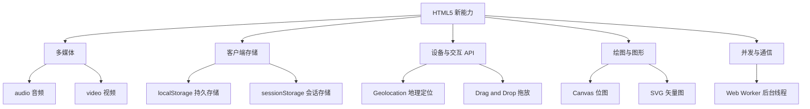
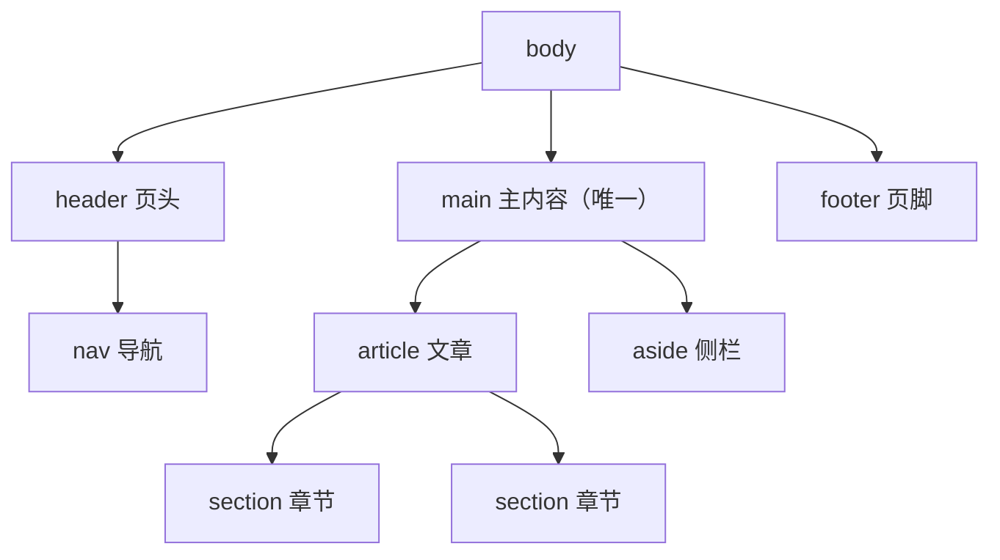

# HTML5 新特性

HTML5 不只是"HTML 的第 5 版"，它是 2014 年定稿的一整套 Web 平台升级：新标签、新 API、原生多媒体。它终结了那个靠 Flash 播视频、靠插件拖文件的时代。本章过一遍最值得掌握的几块，图形类（canvas/svg）点到为止，另有专章展开。

---

## 本章特性全景



---

## 绘图：canvas 与 svg（一句带过）

HTML5 提供两条绘图路线：

- **canvas**：位图画布，用 JS 逐像素绘制，适合游戏、粒子效果、大量数据点
- **svg**：矢量图形，XML 标签描述形状，无限缩放不失真，适合图标、图表、插画

一句话选型：要"画完就不管、可缩放、可交互到元素级"用 SVG；要"高频重绘、海量对象"用 Canvas。展开学习见 [[前端开发/06-数据可视化/SVG/01-SVG基础|SVG 基础]] 与 [[前端开发/06-数据可视化/SVG/01-SVG基础|Canvas 基础]]，本章不再深入。

---

## 原生多媒体：audio 与 video

HTML5 之前播视频要靠 Flash 插件（已死），之后浏览器原生支持：

```html
<!-- 视频：controls 显示自带控制条 -->
<video src="demo.mp4" controls width="640"
       poster="cover.jpg"          <!-- 封面占位图，加载前显示 -->
       preload="metadata">         <!-- 预加载策略：none/metadata/auto -->
  您的浏览器不支持 video 标签。     <!-- 兜底文字 -->
</video>

<!-- 属性开关形式（布尔属性，写了就是 true） -->
<video src="a.mp4" autoplay muted loop playsinline></video>

<!-- 多源兼容：source 从上到下尝试 -->
<video controls>
  <source src="demo.webm" type="video/webm">
  <source src="demo.mp4" type="video/mp4">
  您的浏览器不支持 video 标签。
</video>

<!-- 音频：用法与 video 一致，无画面区域 -->
<audio src="podcast.mp3" controls></audio>
```

关键属性速查：

| 属性 | 说明 |
|------|------|
| controls | 显示播放/进度条等控制 UI |
| autoplay | 自动播放。**现代浏览器强制要求配合 muted**，否则静默失败 |
| muted / loop / preload | 静音 / 循环 / 预加载策略 |
| poster | 视频封面图 |
| playsinline | iOS 上禁止全屏接管 |

实战要点：

- **自动播放必须静音**是浏览器的反骚扰策略，`autoplay muted` 是短视频信息流的标准做法，用户点击后再 `video.muted = false`
- 视频体积大，生产环境不会直接放 mp4 文件链接，而是 HLS/DASH 流媒体协议 + CDN，但标签用法不变
- audio/video 都有完整的 JS API（play/pause/currentTime/volume），做自定义播放器全靠它们

类比后端：`<video>` 标签相当于一个内置的"流媒体客户端"，你给它 URL 它负责拉流解码渲染——就像给了一个现成的 ffplay 嵌进页面。

---

## 本地存储：localStorage 与 sessionStorage

这是 HTML5 对前端影响最大的特性之一：让网页在用户浏览器里存数据成为标准能力。

### 基本用法

两个存储的 API 完全一样，只有生命周期不同：

```javascript
// 存：只能存字符串，对象需 JSON 序列化
localStorage.setItem('theme', 'dark');
localStorage.setItem('userInfo', JSON.stringify({ name: '张三', vip: true }));

// 取：取不到返回 null
const theme = localStorage.getItem('theme');
const user = JSON.parse(localStorage.getItem('userInfo') || '{}');

// 删
localStorage.removeItem('theme');
localStorage.clear(); // 清空本站全部

// sessionStorage 用法一模一样
sessionStorage.setItem('draft', '未提交的表单内容');
```

### 两者与 cookie 的对比

| 维度 | cookie | localStorage | sessionStorage |
|------|--------|--------------|----------------|
| 容量 | 约 4KB | 约 5MB | 约 5MB |
| 生命周期 | 可设过期时间 | **永久**，手动删才没 | 当前**标签页会话**，关了就没 |
| 随请求发送 | **每次 HTTP 请求自动带上** | 不发送 | 不发送 |
| 作用域 | 可设 domain/path | 同源共享 | 单个标签页独立 |
| API 易用性 | 原生 API 反人类（字符串拼装） | 简洁的键值对 | 同左 |

三条决策规则：

1. **需要随每次请求发给服务器的**（登录态凭证）：cookie 的领地，别的替代不了
2. **纯前端用的持久偏好**（主题色、侧栏折叠状态）：localStorage
3. **只在本次会话有效的临时数据**（未提交草稿）：sessionStorage

安全提醒：localStorage 对 XSS 完全不设防——页面里任何注入脚本都能读走全部数据。所以**身份令牌存 localStorage 还是 cookie（HttpOnly）是前端安全的经典争论题**，展开见 [[前端开发/09-融会贯通/02-Java全栈前后端联调|前后端联调]]。

### 存储事件：跨标签页通信

同源的其他标签页修改 localStorage 时，当前页能收到 storage 事件：

```javascript
// 标签页 A 登出时清了 localStorage
// 标签页 B 监听并同步登出界面
window.addEventListener('storage', (event) => {
  if (event.key === 'token' && event.newValue === null) {
    location.href = '/login'; // 被踢回登录页
  }
});
```

这是无需后端的多标签页同步手段，简单场景非常好用。

---

## 地理定位 API

获取用户经纬度，典型场景：外卖地址、附近的人、天气 App：

```javascript
if (!navigator.geolocation) {
  console.log('浏览器不支持定位');
} else {
  navigator.geolocation.getCurrentPosition(
    (pos) => {
      console.log('纬度:', pos.coords.latitude);
      console.log('经度:', pos.coords.longitude);
      console.log('精度(米):', pos.coords.accuracy);
    },
    (err) => {
      // 用户拒绝授权 / 定位失败都会走这里
      console.error('定位失败:', err.message);
    },
    { timeout: 5000, maximumAge: 60000 }
  );
}
```

要点：

- **必须 HTTPS**（localhost 除外），HTTP 页面直接拒绝
- 浏览器会弹授权框，用户拒绝则走错误回调——代码永远要处理拒绝分支
- 定位本身来自 GPS/Wi-Fi/IP 推断的混合策略，accuracy 字段告诉你可信度
- 高精度需求可传 `{ enableHighAccuracy: true }`，但更耗电更慢

---

## 拖放 API

HTML5 让"拖拽"成为浏览器原生事件体系的一部分：

```html
<div id="box" draggable="true">拖我</div>
<div id="trash">垃圾桶</div>
```

```javascript
const box = document.getElementById('box');
const trash = document.getElementById('trash');

// 拖动开始：把数据塞进拖拽载荷
box.addEventListener('dragstart', (e) => {
  e.dataTransfer.setData('text/plain', e.target.id);
});

// 目标区必须阻止默认行为，否则 drop 不触发（经典坑）
trash.addEventListener('dragover', (e) => e.preventDefault());

trash.addEventListener('drop', (e) => {
  e.preventDefault();
  const id = e.dataTransfer.getData('text/plain');
  console.log('把 ' + id + ' 扔进了垃圾桶');
});
```

完整事件序列：`dragstart → drag → dragenter → dragover → dragleave/drop → dragend`。两个必记的坑：

1. **drop 要生效，必须在 dragover 里 preventDefault()**
2. dataTransfer 只能在 drop 里取数据，dragstart 存进去的中间过程读不到（浏览器出于安全考虑）

评价：原生拖放 API 设计陈旧、跨浏览器细节多，复杂场景（排序列表、跨窗口拖拽）实践中多用第三方库实现，但理解事件模型仍是基础——比如"从桌面拖文件进网页上传"就依赖 drop 事件的 `dataTransfer.files`。

---

## 语义化标签回顾

语义化标签严格说是 HTML5 引入的重头戏，上一章已详述，这里只放一张速查图帮助记忆页面骨架：



详细选用规则见 [[前端开发/01-基础/HTML/02-HTML表单与语义化|HTML 表单与语义化]]，综合运用见 [[前端开发/01-基础/HTML/04-HTML实战：语义化页面|HTML 实战：语义化页面]]。

---

## Web Worker 概念

JS 是单线程的——所有计算和渲染抢同一个线程，一段死循环就能冻住整个页面。Web Worker 提供了真正的后台线程：

```javascript
// main.js 主线程
const worker = new Worker('calc-worker.js');

// 发消息给 worker（结构化克隆，不是共享内存）
worker.postMessage({ numbers: [ /* 一大堆数据 */ ] });

// 收结果
worker.onmessage = (e) => console.log('计算完成:', e.data);

// calc-worker.js —— worker 线程内
self.onmessage = (e) => {
  const result = heavyCompute(e.data.numbers); // 重计算不卡主线程
  self.postMessage(result);
};
```

约束清单：

| 约束 | 说明 |
|------|------|
| 不能操作 DOM | DOM 只属于主线程，worker 连 window 都没有 |
| 只能通过 postMessage 通信 | 数据按拷贝传递（类似进程间通信而非线程共享内存） |
| 必须是独立 js 文件 | 不能内联在 HTML 里（Blob URL 变通除外） |
| 同源限制 | 脚本须同源 |

类比后端：Worker 之于主线程，约等于消息队列消费者之于 Web 服务——主线程把重活"发消息"出去，干完了再"回消息"，两边不共享内存，天然没有锁问题。适用场景：大 JSON 解析、图片处理、加密解密、复杂数据排序。日常 CRUD 业务很少用到，知道概念即可，遇到"输入框被大计算卡死"时记得有这把锤子。

---

## 实战：localStorage 记住用户偏好

综合运用本地存储，做一个"记住主题与字号偏好"的完整页面。保存为 `preferences.html` 打开，切换设置后刷新页面，偏好依然生效；再开第二个标签页也能看到 storage 事件的同步效果。

```html
<!DOCTYPE html>
<html lang="zh-CN">
<head>
  <meta charset="UTF-8">
  <meta name="viewport" content="width=device-width, initial-scale=1.0">
  <title>用户偏好演示 · localStorage</title>
  <style>
    /* 内联样式仅为本示例自包含，正式项目请外部样式表 */
    body { font-family: sans-serif; padding: 24px; transition: background .3s, color .3s; }
    body.dark-theme { background: #1e1e2e; color: #e0e0e0; }
    body.large-font { font-size: 20px; }
    select, button { font-size: inherit; margin-right: 8px; }
    .tip { color: gray; font-size: 14px; }
  </style>
</head>
<body>
  <h1>偏好设置面板</h1>

  <p>
    <label for="theme">主题：</label>
    <select id="theme">
      <option value="light">浅色</option>
      <option value="dark">深色</option>
    </select>

    <label for="fontsize">字号：</label>
    <select id="fontsize">
      <option value="normal">标准</option>
      <option value="large">大字</option>
    </select>

    <!-- 清空所有偏好，恢复默认 -->
    <button type="button" id="resetBtn">恢复默认</button>
  </p>

  <article>
    <h2>示例文章</h2>
    <p>调整上方选项后刷新页面或另开标签页，观察偏好是否保留。</p>
  </article>

  <p class="tip" id="syncTip"></p>

  <script>
    var STORAGE_KEY = 'user-preferences';

    // 默认配置：读取失败时兜底
    function defaultPrefs() {
      return { theme: 'light', fontsize: 'normal' };
    }

    // 读：解析失败也要兜底，防止脏数据毁掉整页
    function loadPrefs() {
      try {
        return Object.assign(defaultPrefs(),
          JSON.parse(localStorage.getItem(STORAGE_KEY) || '{}'));
      } catch (e) {
        return defaultPrefs();
      }
    }

    // 写：只存必要字段，控制在 KB 级
    function savePrefs(prefs) {
      localStorage.setItem(STORAGE_KEY, JSON.stringify(prefs));
    }

    // 应用偏好到界面
    function applyPrefs(prefs) {
      document.body.classList.toggle('dark-theme', prefs.theme === 'dark');
      document.body.classList.toggle('large-font', prefs.fontsize === 'large');
      document.getElementById('theme').value = prefs.theme;
      document.getElementById('fontsize').value = prefs.fontsize;
    }

    // 初始化：先读再应用
    applyPrefs(loadPrefs());

    // 任一下拉框变化 => 更新存储并应用
    ['theme', 'fontsize'].forEach(function (id) {
      document.getElementById(id).addEventListener('change', function () {
        var prefs = loadPrefs();
        prefs[id] = this.value;
        savePrefs(prefs);
        applyPrefs(prefs);
      });
    });

    // 恢复默认：清掉对应键而不是 clear()，避免误伤其他功能的数据
    document.getElementById('resetBtn').addEventListener('click', function () {
      localStorage.removeItem(STORAGE_KEY);
      applyPrefs(defaultPrefs());
    });

    // 跨标签页同步：另一标签页改了偏好，本页实时跟随并提示
    window.addEventListener('storage', function (e) {
      if (e.key === STORAGE_KEY) {
        applyPrefs(loadPrefs());
        document.getElementById('syncTip').textContent =
          '检测到其他标签页修改了偏好，已同步。';
      }
    });
  </script>
</body>
</html>
```

设计决策讲解：

1. **JSON 序列化存对象**：localStorage 只认字符串，`JSON.parse` 外包 try/catch 防御脏数据——存储里的东西永远当不可信输入对待
2. **removeItem 而非 clear**：clear 是核弹，会把同站点其他功能的存储一并炸掉
3. **storage 事件做双标签页同步**：零后端成本的体验加分项
4. **读写集中成函数**：将来从 localStorage 迁移到服务端账户体系时，只改这三个函数

到这里 HTML 主线完成。下一章把所有知识拧成一个完整页面：[[前端开发/01-基础/HTML/04-HTML实战：语义化页面|HTML 实战：语义化页面]]。
