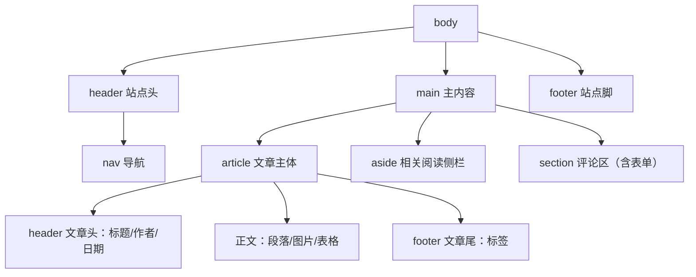

# HTML 实战：语义化页面

前三章分别讲了语法、表单语义化、H5 新特性，本章把它们拧成**一个完整的、生产水准的博客文章页**。目标不是"能显示"，而是：结构对爬虫友好、对读屏器友好、加载体验好、代码半年后还能看懂。

---

## 成品预览与页面结构设计

先想清楚再动手。一篇博客文章页的信息架构：



对应的设计决策：

| 区域 | 标签选择 | 理由 |
|------|---------|------|
| 整页骨架 | header / main / footer | 三大地标，读屏器可跳转 |
| 导航 | nav > ul > a | 导航集合的标准写法 |
| 文章本体 | article | 拿去 RSS 单独发布依然成立，独立性满分 |
| 侧栏 | aside | 拿掉不影响理解正文 |
| 评论列表 | 每条评论一个 article | 评论也是独立内容，这是 article 嵌套的合法场景 |
| 评论输入 | form + label 全家 | 上一章的规范全数复用 |

---

## 完整源码

保存为 `blog-post.html` 直接打开。图片使用占位服务，无需本地素材。

```html
<!DOCTYPE html>
<html lang="zh-CN">
<head>
  <!-- charset 必须是 head 第一个元素 -->
  <meta charset="UTF-8">

  <!-- 移动适配第一行：没有它手机端响应式全部失效 -->
  <meta name="viewport" content="width=device-width, initial-scale=1.0">

  <!-- SEO 三件套 -->
  <title>Flexbox 布局完全指南 · 张三的技术博客</title>
  <meta name="description"
        content="用后端工程师熟悉的方式理解 Flexbox：容器属性、项目属性、经典布局套路与常见坑，配完整示例。">
  <meta property="og:title" content="Flexbox 布局完全指南">
  <meta property="og:type" content="article">
  <meta property="og:image" content="https://placehold.co/1200x630/png">

  <!-- RSS 发现：阅读器可自动订阅 -->
  <link rel="alternate" type="application/rss+xml" title="RSS"
        href="/feed.xml">
</head>
<body>

  <!-- ======== 站点页头 ======== -->
  <header>
    <p class="site-title">张三的技术博客</p>
    <nav aria-label="主导航">
      <ul>
        <li><a href="/" aria-current="page">首页</a></li>
        <li><a href="/archives.html">归档</a></li>
        <li><a href="/about.html">关于</a></li>
      </ul>
    </nav>
  </header>

  <!-- ======== 主内容：全页唯一 main ======== -->
  <main>
    <!-- 文章本体：独立性最强的内容用 article -->
    <article>
      <!-- 文章自己的头部（header 可嵌套，作用域限于最近的 article） -->
      <header>
        <h1>Flexbox 布局完全指南</h1>
        <p>
          发布于 <time datetime="2026-08-20">2026 年 8 月 20 日</time>
          · 作者 <a href="/about.html" rel="author">张三</a>
          · 预计阅读 12 分钟
        </p>
      </header>

      <!-- 正文 -->
      <h2>为什么需要 Flexbox</h2>
      <p>
        在 Flexbox 出现之前，让三个盒子水平居中排列
        需要浮动加清除加负边距三件套，
        代码能看懂的人不多——这不是你的问题，是时代的眼泪。
      </p>

      <h2>容器六属性</h2>
      <p>设了 <code>display: flex</code> 的元素就是弹性容器……</p>

      <!-- 配图：懒加载 + 显式宽高 + 完整 alt，三项都是最佳实践 -->
      <figure>
        
        <figcaption>图 1：主轴由 flex-direction 决定</figcaption>
      </figure>

      <h3>flex:1 到底是什么</h3>
      <p>
        它是三个属性的缩写：
        <code>flex-grow:1; flex-shrink:1; flex-basis:0%</code>。
        类比后端的资源分配：grow 是扩容权重，
        shrink 是缩容权重，basis 是初始申请量。
      </p>

      <!-- 数据表格：thead/tbody/th scope 一个不少 -->
      <table>
        <caption>常见布局需求与推荐方案</caption>
        <thead>
          <tr>
            <th scope="col">需求</th>
            <th scope="col">推荐方案</th>
          </tr>
        </thead>
        <tbody>
          <tr>
            <td>导航条横向排列</td>
            <td>Flexbox</td>
          </tr>
          <tr>
            <td>后台仪表盘整体框架</td>
            <td>Grid</td>
          </tr>
          <tr>
            <td>卡片流自适应列数</td>
            <td>Grid auto-fill + minmax</td>
          </tr>
        </tbody>
      </table>

      <blockquote cite="https://developer.mozilla.org">
        <p>CSS Flexible Box Layout 是一维布局模型。</p>
      </blockquote>

      <!-- 文章尾：标签列表 -->
      <footer>
        <p>标签：
          <a href="/tag/css/">CSS</a> ·
          <a href="/tag/layout/">布局</a>
        </p>
      </footer>
    </article>

    <!-- 侧栏：弱相关内容 -->
    <aside aria-label="相关阅读">
      <h2>相关文章</h2>
      <ul>
        <li><a href="/posts/grid-guide">Grid 布局入门</a></li>
        <li><a href="/posts/responsive-101">响应式设计十日谈</a></li>
        <li><a href="/posts/css-specificity">选择器优先级详解</a></li>
      </ul>
    </aside>

    <!-- 评论区：独立区块 + 完整表单 -->
    <section id="comments" aria-label="评论区">
      <h2>评论（2）</h2>

      <!-- 每条评论是一个 article：嵌套 article 合法且语义正确 -->
      <article class="comment">
        <header>
          <strong>李四</strong>
          <time datetime="2026-08-21T09:30">2026-08-21 09:30</time>
        </header>
        <p>flex-basis 和 width 的关系讲得清楚，收藏了。</p>
      </article>

      <article class="comment">
        <header>
          <strong>王五</strong>
          <time datetime="2026-08-22T22:05">2026-08-22 22:05</time>
        </header>
        <p>求出一篇 Grid 的，正好接上这篇。</p>
      </article>

      <!-- 发表评论表单：上一章的验证规范全套复用 -->
      <form action="/api/comments" method="post">
        <fieldset>
          <legend>发表评论</legend>

          <p>
            <label for="c-name">昵称（必填）</label><br>
            <input type="text" id="c-name" name="nickname"
                   required maxlength="20" autocomplete="nickname">
          </p>

          <p>
            <label for="c-body">评论内容（10-500 字）</label><br>
            <textarea id="c-body" name="content" rows="4"
                      required minlength="10" maxlength="500"></textarea>
          </p>

          <p>
            <button type="submit">发表</button>
          </p>
        </fieldset>
      </form>
    </section>
  </main>

  <!-- ======== 站点页脚 ======== -->
  <footer>
    <p>
      <small>&copy; 2026 张三 ·
        <a href="#top">回到顶部</a>
      </small>
    </p>
  </footer>
</body>
</html>
```

---

## 设计决策逐段讲解

### head 部分

1. **charset 放最前**：浏览器边下载边解析，编码声明晚到就可能先按错误编码渲染一段
2. **viewport 一行不省**：本章页面将来要接入响应式 CSS（见 [[前端开发/01-基础/CSS/06-CSS实战：响应式设计|CSS 实战：响应式设计]]），现在就打好地基
3. **description 写人话**：它是搜索结果摘要，写给用户看的文案而非关键词堆砌
4. **og: 系列**：决定链接分享到社交软件时卡片长什么样，博客传播的隐形功臣

### 结构部分

5. **main 全页唯一**：多个 main 是无效 HTML；读屏器的"跳到主内容"快捷键依赖它
6. **article 内嵌套 header/footer**：它们的作用域自动限定在最近的文章块内——文章头和站点头互不干扰，这就是语义标签比 div+class 高明的地方
7. **time 元素带 datetime 属性**：给人看的格式随意（"2026 年 8 月 20 日"），给机器的是标准 ISO 格式，搜索引擎据此可展示日期富摘要
8. **评论每条一个 article**：判断标准回顾——"单独拿出去还成立吗？"一条评论独立发布当然成立
9. **figure/figcaption 绑定图文**：图和图注在语义上成为一体，而不是两张随便摆的标签

### 加载体验部分

10. **首屏外图片 loading="lazy"**：浏览器滚动到附近才请求图片，首屏速度显著提升。注意**首屏大图反而不要 lazy**（会推迟 LCP），本文首屏只有标题和文字所以全篇 lazy 无碍
11. **decoding="async"**：解码不阻塞渲染主线程
12. **width/height 显式声明**：占位防抖动，图片加载完页面不跳

### 无障碍部分

13. **aria-label 给区域命名**："主导航""相关阅读""评论区"，读屏器跳转时有名字可报
14. **aria-current="page"**：告诉辅助技术当前所在页，比视觉高亮多一层机器可读
15. **rel="author" 与 cite 属性**：小细节，但都是免费的语义加分项

---

## 常见错误清单

以下是真实项目里出现频率最高的 HTML 错误，逐条自检：

### 1. div 滥用

```html
<!-- 反面：整页全是无语义 div -->
<div class="header"><div class="menu"></div></div>
<div class="post"></div>
<div class="sidebar"></div>
<div class="footer"></div>
```

症状：class 名越起越长（`.header-left-inner-wrap`），CSS 选择器越来越暴力。改造方向：header/nav/main/article/aside/footer 各归各位，div 只留作纯排版容器。

### 2. 图片忘记 alt 或 alt 写成废话

```html
                    <!-- 缺失：读屏器只能念文件名 -->
          <!-- 废话：等于没说 -->
  <!-- 正确 -->
```

装饰性图片用 `alt=""` 显式声明"我无信息"，读屏器会跳过。

### 3. 表单控件没有 label

```html
<input type="text" name="phone" placeholder="手机号">   <!-- 反面 -->
<label for="phone">手机号</label>
<input type="text" id="phone" name="phone">            <!-- 正面 -->
```

placeholder 不是 label——输入开始它就消失，读屏器对它的支持也不完整。

### 4. 忘记写 button 的 type

```html
<form>
  <input type="text" name="q">
  <button onclick="doSearch()">搜索</button>  <!-- 默认 submit，表单被意外提交 -->
</form>
```

非提交按钮一律 `type="button"`。

### 5. 标题层级跳跃或 h1 复用

```html
<h1>页面标题</h1>
<h4>突然四级</h4>       <!-- 层级断裂，大纲解析器困惑 -->
```

规则：h1 每页一个、层级连续递进、字号调整交给 CSS。

### 6. 用表格做布局 / 用 br 排版

table 只用于二维数据；`<br>` 只用于地址诗句等确需强制换行处，段落间距靠 margin 不靠连打两个 br。

### 7. 外链裸奔 target="_blank"

不带 `rel="noopener"` 存在标签页劫持风险（新页面可通过 window.opener 操作原页面），上一章已述，此处作为清单提醒。

---

## 自检清单

交付任何 HTML 页面前过一遍：

- [ ] 第一行 DOCTYPE，head 首位 charset
- [ ] viewport meta 存在
- [ ] h1 唯一，标题层级连续
- [ ] 所有 img 有有意义的 alt 且声明宽高；首屏外图片加了 loading="lazy"
- [ ] 所有 input 有关联 label
- [ ] 表单按钮 type 明确，验证属性齐全（且知道服务端仍需重验）
- [ ] 页面骨架 header/main/footer 就位，main 唯一
- [ ] 找不到语义标签的地方才用了 div
- [ ] 外链带 rel="noopener"

---

## 扩展练习

在成品源码基础上动手改造，巩固本章知识点：

1. **加面包屑导航**：在 article 的 header 上方加一个 `nav aria-label="面包屑"`，用有序列表表达"首页 / CSS / 本文"的层级——想想为什么这里该用 ol 而不是 ul
2. **给评论区加分页**：用 nav + ul 模拟"上一页 1 2 3 下一页"结构，思考分页链接集合算不算 nav（答案：算，它是站内重要的导航链接集）
3. **补一个目录区块**：在正文开头插入"本文章节"跳转列表，锚点指向各 h2/h3（需要先给它们补 id）
4. **自检演练**：对照上面的自检清单逐项检查你改造后的页面，重点确认新增部分没有引入 div 滥用和 label 缺失

完成后再看一个反向练习：随便打开一个老网站，F12 审查它的 DOM 结构，数一数有多少个 div、能不能一眼认出哪里是导航哪里是正文——你会立刻理解语义化的价值。

页面有了骨架，接下来让它好看起来：[[前端开发/01-基础/CSS/01-CSS基础语法|CSS 基础语法]]。
