# 01 - JS 基础语法

> 前置要求：已学习 [[前端开发/01-基础/HTML/01-HTML基础语法|HTML 入门]] 与基本 CSS。有 Java/C 背景的读者请特别关注"动态弱类型 vs 静态强类型"的对照，这是两种语言世界观的分水岭。

---

## 1. JavaScript 是什么

JavaScript（简称 JS）是**浏览器中唯一原生支持的脚本语言**。无论你用 Chrome、Firefox 还是 Safari，网页里所有交互逻辑——点击按钮、表单校验、异步加载数据——最终都由 JS 驱动。

三个关键定位：

1. **浏览器的唯一原生语言**：WebAssembly 可以跑其他语言的编译产物，但操作 DOM、调用浏览器 API 的第一公民始终是 JS。
2. **借 Java 之名，无 Java 之实**：1995 年 Netscape 为蹭热度把 LiveScript 改名 JavaScript。两者关系类似"雷锋和雷峰塔"——JS 语法表层像 C/Java（大括号、分号、`if/for`），类型系统与内存模型完全不同。
3. **早已出圈**：Node.js 写后端，Electron 写桌面应用，React Native 写移动端。但本教程以浏览器环境为主线。

### 1.1 动态弱类型 vs 静态强类型

如果你来自 Java/C 世界，最大的认知冲击在类型系统。对照表：

| 维度 | Java | JavaScript |
|------|------|------------|
| 类型检查时机 | 编译期（静态） | 运行期（动态） |
| 类型强度 | 强类型，不自动转换 | 弱类型，隐式转换无处不在 |
| 变量声明 | `int x = 10;` 类型绑定变量 | `let x = 10;` 值携带类型，变量不绑定类型 |
| 编译产物 | 字节码 .class | 无传统编译，源码直接被引擎解释/JIT |
| 内存管理 | JVM GC | 引擎 GC（V8、SpiderMonkey） |
| 一个变量存不同类型 | 不可能 | 完全合法 |

```java
// Java：变量 x 从此永远是 int
int x = 10;
x = "hello"; // 编译错误
```

```javascript
// JS：变量只是个"名字标签"，随时可以指向任何东西
let x = 10;
console.log(typeof x); // "number"
x = "hello";
console.log(typeof x); // "string"
```

用 C 的视角理解更直观：Java 的变量像**带类型的槽位**（声明时焊死），JS 的变量像 `void*` 指针——槽位本身无类型，指向的对象才有类型。区别在于 JS 引擎包办了全部的类型判断和内存管理，不需要手动 `malloc/free`。

> 动态类型的代价是很多错误推迟到运行期才暴露。这正是后续 TypeScript 章（[[前端开发/01-基础/TypeScript/01-TS基础与类型系统|TS 基础]]）要解决的问题——给 JS 补回静态类型。

---

## 2. 在 HTML 中引入 JS

### 2.1 三种引入方式

```html
<!DOCTYPE html>
<html lang="zh-CN">
<head>
  <meta charset="UTF-8">
  <!-- 方式一：内联脚本（写在 head 中，会阻塞解析） -->
  <script>
    console.log("head 内联脚本执行了");
  </script>
  <!-- 方式二：外部文件，放在 head 但加 defer -->
  <script src="app.js" defer></script>
</head>
<body>
  <h1 id="title">Hello JS</h1>
  <!-- 方式三：外部文件放在 body 末尾 -->
  <script src="main.js"></script>
</body>
</html>
```

实际项目一律使用外部文件：结构与行为分离、浏览器可缓存、便于工程化处理。

### 2.2 defer 与 async 的区别

当 `<script src>` 出现在 `<head>` 里，默认行为是：**暂停 HTML 解析，下载并执行完脚本再继续解析**。如果脚本体量大，用户会看到长时间白屏。

`defer` 和 `async` 都是让下载不阻塞解析，区别在**执行时机**：

| 属性 | 下载 | 执行时机 | 执行顺序 |
|------|------|----------|----------|
| 无属性 | 阻塞解析（边下边停） | 立即执行 | 按文档顺序 |
| `defer` | 并行下载，不阻塞 | HTML 解析完成后、`DOMContentLoaded` 事件前 | 按文档顺序 |
| `async` | 并行下载，不阻塞 | 下载完立即执行（打断解析） | 不保证顺序 |

用 mermaid 直观展示三种模式的时序：

```mermaid
gantt
    title script 加载执行时序对比
    dateFormat X
    axisFormat %s

    section 默认模式
    HTML解析暂停等待     :0, 4
    下载 a.js            :2, 3
    执行 a.js            :3, 4
    HTML继续解析         :4, 8

    section defer
    HTML持续解析         :0, 6
    并行下载a.js         :0, 2
    并行下载b.js         :0, 3
    解析完后按序执行      :crit, 6, 8

    section async
    HTML持续解析         :0, 5
    并行下载a.js         :0, 2
    a.js下载完立刻执行    :crit, 2, 3
    b.js下载完立刻执行    :crit, 4, 5
```



实践建议：**普通业务脚本用 `defer`**（不阻塞渲染且多个脚本按序执行）；**独立无依赖的统计/埋点脚本用 `async`**。本教程后续章节为演示方便常写在 body 末尾，工程项目统一用 `defer` + `type="module"`（详见 [[前端开发/01-基础/JavaScript/06-ES6+特性|ES6+ 特性]] 第 9 节）。

---

## 3. 变量：let / const / var

### 3.1 三者速览

```javascript
var name = "var 风格";   // 1995 年以来的老方式，函数作用域，存在历史包袱
let age = 25;           // ES6(2015) 引入，块级作用域，可重新赋值
const PI = 3.14159;     // ES6 引入，块级作用域，声明后不可重新赋值
```

现代 JS 的规范只有一条：**默认用 `const`，需要重新赋值才用 `let`，永远不用 `var`**。

| 特性 | var | let | const |
|------|-----|-----|-------|
| 作用域 | 函数作用域 | 块级作用域 `{}` | 块级作用域 `{}` |
| 重复声明 | 允许（静默覆盖） | 报错 | 报错 |
| 重新赋值 | 允许 | 允许 | 不允许 |
| 声明提升 | 提升且初始化为 undefined | 提升但不初始化（暂时性死区） | 同 let |
| 全局声明挂到 window | 是 | 否 | 否 |

注意 `const` 的语义是"**绑定不可变**"，不是"值不可变"——这一点对 Java 程序员很亲切，它更像 Java 的 `final` 引用而非 C 的 `const` 对象：

```javascript
const user = { name: "张三" };
user.name = "李四";        // 合法！对象内容可以改
user = {};                // TypeError: Assignment to constant variable

const nums = [1, 2, 3];
nums.push(4);             // 合法！数组内容可以改
```

### 3.2 var 的坑：为什么要彻底抛弃它

坑一：**函数作用域导致循环闭包问题**（闭包详解见下一章）。

```javascript
// 经典面试题：输出什么？
for (var i = 0; i < 3; i++) {
  setTimeout(function () {
    console.log(i); // 3 3 3 —— 三次都打印 3！
  }, 100);
}

// 用 let 一行不改，结果正确：
for (let i = 0; i < 3; i++) {
  setTimeout(function () {
    console.log(i); // 0 1 2
  }, 100);
}
```

原因：`var i` 只有一个共享变量，循环结束后它是 3；`let i` 每轮循环创建一个新绑定（闭包机制见下一章）。

坑三：**变量提升造成"用了但没声明"的诡异代码**。

```javascript
console.log(a); // undefined（不报错！）
var a = 10;

console.log(b); // ReferenceError（暂时性死区，好歹报错了）
let b = 20;
```

从 Java 视角看：Java 要求"先声明后使用"，编译器直接拦截；`var` 的提升让 JS 允许"先用后声明"，运行期才可能炸。`let/const` 把行为拉回了 Java 程序员的直觉范围。

---

## 4. 数据类型

JS 有 **7 种原始类型（primitive types）+ 1 种对象类型**。原始类型的值本身不可变，赋值/传参时拷贝值；对象类型赋值/传参时拷贝引用——这与 Java 的"基本类型 vs 引用类型"几乎一一对应。

| JS 类型 | 对应 Java 类比 | 示例 |
|---------|----------------|------|
| number | double / long（统一为 64 位浮点） | `42`, `3.14`, `NaN`, `Infinity` |
| string | String（但 JS 字符串是不可变原始值） | `"hello"`, `'hi'`, `` `hey` `` |
| boolean | boolean | `true`, `false` |
| null | null | `null`（表示"有意为空"） |
| undefined | 无直接对应（近似"未初始化"） | 变量未赋值时的默认值 |
| symbol | 无对应 | 唯一标识符，ES6 引入 |
| bigint | BigInteger | `9007199254740993n` |
| object | Object / 各种容器 | `{}`, `[]`, `function`, `new Date()` |

### 4.1 number：没有整数类型

JS 只有一种数字类型，IEEE 754 双精度浮点，相当于 Java 里只有 `double`：

```javascript
console.log(10 / 3);        // 3.3333333333333335，整数除法也得到小数
console.log(Number.isInteger(10)); // true
console.log(0.1 + 0.2);     // 0.30000000000000004 —— 浮点误差，和 Java double 一样
console.log(0.1 + 0.2 === 0.3); // false

// 整数安全上限 2^53 - 1，超过后精度丢失
console.log(Number.MAX_SAFE_INTEGER);       // 9007199254740991
console.log(9007199254740991 + 2 === 9007199254740993); // true，荒谬但真实

// NaN："不是数字"的数字类型值，任何比较都是 false
console.log(NaN === NaN);   // false！判断 NaN 要用专门方法
console.log(Number.isNaN(NaN)); // true
```

金额计算不要用 number（同 Java 不用 double 存钱），前端通常以"分"为单位取整或用 bigint/字符串传输。

### 4.2 string：单引号双引号反引号

```javascript
const a = "double";
const b = 'single';
const c = `template`; // 模板字符串，见第 6 节

// 字符串不可变（immutable），与 Java String 相同
let s = "abc";
s[0] = "X";
console.log(s);          // "abc"，修改无效
s = s.toUpperCase();     // 只能产生新串替换旧引用
```

常用方法与 Java 高度相似：`slice/substring`、`indexOf/includes`、`split/join`、`trim`、`replace/replaceAll`。

### 4.3 null 与 undefined：两个"空"

这是 JS 独有的设计（Java 只有一个 null），初学者最容易混淆：

- **undefined**：系统级的"没值"。变量声明了没赋值、函数没写 return、访问对象不存在的属性。
- **null**：程序员主动设置的"空值"，语义上表示"这里应该有对象但现在故意为空"。

```javascript
let x;
console.log(x);              // undefined

function f() {}
console.log(f());            // undefined

const obj = { name: "A" };
console.log(obj.age);        // undefined

let y = null;                // 明确告诉读代码的人：我故意的
```

经验法则：**自己编码时只用 null 表示空，不要手动赋 undefined**；判断空值时两者都要考虑（`x == null` 是唯一可接受的 `==` 用法，或用第 6 章的 `??`）。

### 4.4 symbol 与 bigint：了解即可

```javascript
// symbol：创建全局唯一的值，主要用作对象的特殊键，避免命名冲突
Symbol("id") === Symbol("id"); // false，即使描述相同也不相等

// bigint：任意精度整数，字面量加 n 后缀，解决 number 的 2^53 精度问题
const big = 123456789012345678901234567890n;
console.log(big + 1n); // 123456789012345678901234567891n
console.log(1n === 1); // false，bigint 不与 number 混算
```

symbol 多出现在库的底层设计，bigint 用于超大整数（雪花 ID 等），日常业务代码很少手写。

### 4.5 typeof 的陷阱

`typeof` 返回类型的字符串形式，但有著名的历史 bug 和边界情况：

```javascript
typeof 42;            // "number"
typeof "hi";          // "string"
typeof true;          // "boolean"
typeof undefined;     // "undefined"
typeof Symbol();      // "symbol"
typeof 10n;           // "bigint"

// 陷阱一：null 判定为 object —— 1995 年的实现 bug，为兼容性永远无法修复
typeof null;          // "object" (!!)
// 正确判断 null 的方式：
console.log(v === null);

// 陷阱二：函数有专属返回值，但数组等对象没有细分
typeof function(){};  // "function"（唯一有特权的对象子类型）
typeof [1, 2];        // "object"（不是 "array"！）
typeof {};            // "object"

// 正确判断数组：
Array.isArray([1, 2]); // true
```

记忆口诀：**typeof 判不了 null 和数组，判 null 用全等，判数组用 Array.isArray**。

---

## 5. 运算符

### 5.1 == 与 ===：本教程最重要的一节

`==`（宽松相等）比较前会做**隐式类型转换**；`===`（严格相等）类型不同直接返回 false。

```javascript
console.log(1 == "1");     // true ！字符串被转成了数字
console.log(1 === "1");    // false

console.log(null == undefined);  // true （规范规定的特例）
console.log(null === undefined); // false

console.log(0 == "");      // true
console.log(0 == false);   // true
console.log("" == false);  // true
console.log(NaN == NaN);   // false

// [] 会先转成 "" 再转成 0
console.log([] == false);  // true
console.log([1] == 1);     // true
```

`==` 的转换规则复杂到需要一张专门的真值表，没有人能可靠地在脑内完成推导。**强制作业规范：一律使用 `===` 和 `!==`，禁用 `==`**（ESLint 的 `eqeqeq` 规则会强制这一点）。唯一可接受的例外写法是 `x == null` 同时判 null 和 undefined。

### 5.2 其他常用运算符

```javascript
// 算术运算符与 Java 基本一致，除法例外（无整数除法）
7 / 2;    // 3.5
7 % 2;    // 1
2 ** 10;  // 1024，幂运算符（Java 是 Math.pow）

// 逻辑运算符：短路求值与 Java 相同，但返回的是"操作数的值"而非布尔值
"a" && "b";   // "b"：左边真则返回右边
0 || "默认";   // "默认"：左边假则返回右边
// 注意：0、""、null、undefined、NaN、false 都是假值（falsy），其余皆真
// 所以 0 || 10 得到 10 —— 数字 0 被"误伤"了，这正是后来引入 ?? 的原因

// 三元运算符与 Java 写法相同；递增递减与 Java 一致
const status = age >= 18 ? "成年" : "未成年";

// typeof / instanceof / in
typeof 42;                 // "number"
[] instanceof Array;       // true
"name" in { name: "张三" }; // true，检查键是否存在
```

---

## 6. 模板字符串

模板字符串用反引号包裹，支持插值与多行，相当于 Java 15+ 的文本块与 `String.format` 的合体，但更轻量：

```javascript
const name = "张三";
const score = 92.5;

// 插值：${表达式}，花括号里可以放任意 JS 表达式
console.log(`学生 ${name} 的成绩是 ${score} 分`);
console.log(`及格了吗？${score >= 60 ? "是" : "否"}`);
console.log(`明年 ${new Date().getFullYear() + 1} 年`);

// 多行字符串：换行直接写，不需要 \n
const html = `
  <div class="card">
    <h2>${name}</h2>
    <p>成绩：${score}</p>
  </div>
`;
console.log(html);
// 这个特性在 DOM 操作章节拼接页面片段时会大量使用
```

对比 Java 的痛点：`"学生 " + name + " ..."` 的加号地狱在 JS 旧代码里同样存在，模板字符串是唯一推荐的现代写法。C 程序员可类比 `printf`，但没有格式化占位符——要格式化数字需手动调 `.toFixed(2)` 等方法。

---

## 7. 控制语句

语法层面与 Java/C 几乎一致，只讲差异点。

```javascript
// if / else if / else：完全一致
if (score >= 90) {
  console.log("优秀");
} else if (score >= 60) {
  console.log("及格");
} else {
  console.log("不及格");
}

// while / do-while / for：完全一致
let n = 10;
while (n > 0) n -= 3;

for (let i = 0; i < 5; i++) {
  if (i === 3) continue;
  if (i === 4) break;
}
```

差异一：**switch 使用严格相等**，fall-through 行为与 Java 相同，记得 `break`。

差异二：JS 没有 Java 的增强 for（`for (T x : list)`），替代品是 `for...of`（遍历值）与 `for...in`（遍历键）：

```javascript
const arr = ["a", "b", "c"];

for (const item of arr) {
  console.log(item);        // "a" "b" "c"，遍历元素值，最接近 Java 增强 for
}

for (const key in arr) {
  console.log(key);         // "0" "1" "2"，遍历的是索引（且是字符串）
}
// 结论：数组用 for...of；for...in 主要用于遍历对象的可枚举键（下一章详述）
```

差异三：JS 允许 `if (x)` 对任意类型做真假判断（truthy/falsy 体系），Java 的 if 条件必须是 boolean。这既是便利也是隐患——`if (count)` 在 count 为 0 时会被当作 false，处理计数器时要写 `if (count !== undefined)` 这类明确条件。

---

## 8. 浏览器 Console 实操

打开 Chrome，按 `F12`（或右键"检查"切到 Console 面板）。Console 不只是打日志的地方，它是一个完整的 REPL 环境，本教程所有示例都可以在这里逐条验证。

### 8.1 必会的验证实验

逐行输入以下代码，观察输出，亲手确认本章每个知识点：

```javascript
// 实验 1：弱类型的变量
let x = 42;
typeof x;        // "number"
x = "现在我是字符串";
typeof x;        // "string"

// 实验 2：== 的魔法与 typeof null 的历史 bug
1 == "1";        // true
1 === "1";       // false
typeof null;     // "object"

// 实验 3：浮点误差
0.1 + 0.2;       // 0.30000000000000004
```

### 8.2 常用调试 API

```javascript
// 分级日志
console.log("普通信息", { a: 1 }, [1, 2]);
console.warn("警告信息");   // 黄色
console.error("错误信息");   // 红色

// 表格化输出数组/对象（调试数据非常好用）
console.table([
  { name: "张三", score: 92 },
  { name: "李四", score: 85 },
]);

// 计时代码段
console.time("loop");
for (let i = 0; i < 1000000; i++) {}
console.timeEnd("loop");   // loop: 约 1ms
```

### 8.3 与页面交互的快捷函数

```javascript
// alert / confirm / prompt：同步阻塞式对话框，原型阶段可用，正式产品禁用
alert("你好");
const ok = confirm("确定删除吗？");     // true / false
const input = prompt("你的名字？", "默认值"); // 字符串或 null

// document.querySelector：直接在 Console 里选中页面元素试玩
document.querySelector("h1").style.color = "red";
```

最后一句执行后页面 h1 立刻变红——这是 DOM 操作的预告。实用技巧：Sources 面板可对任意 JS 文件打断点、单步执行、查看调用栈与作用域变量，遇到难缠 bug 时比反复改代码刷新高效得多。

---

## 9. 本章小结

- JS 是浏览器唯一原生脚本语言；动态弱类型，变量是"无类型的标签"，值才携带类型。
- 引入脚本用外部文件 + `defer`（保顺序、不阻塞）；`async` 只用于无依赖的独立脚本。
- 变量声明：默认 `const`，需重赋值用 `let`，禁用 `var`（函数作用域、重复声明、提升三大坑）。
- 8 种数据类型；`typeof null === "object"` 是历史 bug；判数组用 `Array.isArray`；number 无整数类型且有 2^53 精度上限。
- 恒等号铁律：只用 `===`/`!==`，禁用 `==`。
- 模板字符串 `` ` `` 处理一切拼接需求；控制语句与 Java/C 同构，新增 `for...of` 遍历值。
- Console 是你的第一个 IDE：REPL 实验、分级日志、断点调试都在这里。

下一章进入 JS 最核心的心智模型：[[前端开发/01-基础/JavaScript/02-函数与作用域|函数与作用域]]——包括让无数人栽跟头的 `this` 绑定与闭包。
