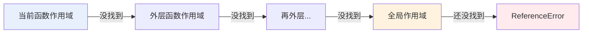

# 02 - 函数与作用域

> 前置：[[前端开发/01-基础/JavaScript/01-JS基础语法|JS 基础语法]]。本章是 JS 的核心心智模型：函数是"一等公民"，作用域靠词法决定，`this` 靠调用方式决定。有 Java 背景的读者请把 Java 的 `方法` 概念暂时放一放——JS 的函数更像 C 的函数指针 + 可以随处定义的匿名类。

---

## 1. 函数的四种定义方式

### 1.1 函数声明（Function Declaration）

```javascript
function add(a, b) {
  return a + b;
}
console.log(add(1, 2)); // 3
```

最传统的写法，与 Java 方法声明形似，但有两个本质区别：

- JS 函数**没有返回类型、没有参数类型、没有访问修饰符**
- JS 函数是**值**，可以赋给变量、当参数传递、当返回值返回

### 1.2 函数表达式（Function Expression）

```javascript
// 把一个匿名函数赋值给变量 —— 这体现了"函数是一等公民"
const subtract = function (a, b) {
  return a - b;
};
console.log(subtract(5, 2)); // 3

// 命名的函数表达式：内部可以通过名字递归调用自己
const factorial = function fact(n) {
  return n <= 1 ? 1 : n * fact(n - 1);
};
```

类比：Java 里想传递一段逻辑必须包一层接口（`Comparator`、`Runnable`），C 里要传函数指针；JS 直接把函数当普通值传。

### 1.3 箭头函数（Arrow Function）—— 现代首选

```javascript
// 完整形式
const multiply = (a, b) => {
  return a * b;
};

// 只有一句 return 时可省略大括号和 return（隐式返回）
const multiply2 = (a, b) => a * b;

// 单参数可省略括号
const square = x => x * x;

// 无参数必须保留空括号
const hello = () => console.log("hello");

// 返回对象字面量时要加括号，否则大括号被解析为函数体
const makePoint = (x, y) => ({ x, y });
console.log(makePoint(1, 2)); // { x: 1, y: 2 }
```

箭头函数不只是语法糖，它与普通函数有一个根本差异（`this` 绑定），见第 4 节。

### 1.4 Function 构造器 —— 不推荐

```javascript
// 参数是字符串形式的代码体，运行时动态解析
const div = new Function("a", "b", "return a / b");
console.log(div(6, 3)); // 2
```

等价于 `eval`，丧失语法检查与优化机会，存在注入风险，**任何场景都不推荐使用**。列在这里只是为了让你在读到老代码时不至于陌生。

### 1.5 四种方式对比

| 方式 | 提升行为 | this 绑定 | 使用建议 |
|------|----------|-----------|----------|
| 函数声明 | 整体提升，可先调用后定义 | 动态 | 文件级顶层工具函数可用 |
| 函数表达式 | 变量按 let/const 规则处理 | 动态 | 需要命名递归时用 |
| 箭头函数 | 同函数表达式 | 词法（继承外层） | 回调、现代代码默认选择 |
| Function 构造器 | 运行时解析 | 全局 | 禁止使用 |

---

## 2. 参数系统

### 2.1 JS 参数与 Java 的三大差异

```javascript
// 差异一：没有重载。同名函数后者覆盖前者
function greet(name) {
  return "你好 " + name;
}
function greet() {          // 直接覆盖了上面的版本！
  return "你好";
}

// 差异二：实参个数不校验。少传的是 undefined，多传的被忽略
greet();                    // 不报错，name 是 undefined
greet("张三", "多余参数");   // 多余参数被静默忽略

// 差异三：所有参数本质上都是"引用或值的拷贝"，无 out/ref/inout
```

Java 用重载解决"同名不同参"；JS 的惯用法是**默认参数 + 对象参数**。

### 2.2 默认参数

```javascript
function power(base, exponent = 2) {
  return base ** exponent;
}
power(3);      // 9
power(3, 3);   // 27

// 默认值可以是任意表达式，甚至引用前面的参数
function createUser(name, role = "member", id = Date.now()) {
  return { name, role, id };
}

// 只有传入 undefined 才触发默认值，传 null 不触发！
power(3, undefined); // 9，触发默认值
power(3, null);      // NaN，null 被当作真实值参与运算
```

最后一点是高频面试题：**`undefined` 表示"没传"，会启用默认值；`null` 表示"传了个空"，不启用**。

### 2.3 剩余参数 rest

```javascript
// ...args 把所有多余的实参收集成一个真数组
function sum(...nums) {
  return nums.reduce((acc, n) => acc + n, 0);
}
sum(1, 2);        // 3
sum(1, 2, 3, 4);  // 10

// 必须是最后一个参数
function log(level, ...messages) {
  console.log(`[${level}]`, ...messages);
}
log("INFO", "服务启动", "端口 8080");

// 与 arguments 的关系：老代码里的 arguments 是伪数组，已被 rest 取代
function legacy() {
  console.log(arguments.length); // 能用但是伪数组（没有 map/filter 等方法）
}
```

rest 参数相当于 Java 的可变参数 `void sum(int... nums)`，但 JS 版本拿到的是真正的数组，可以直接调高阶方法。

---

## 3. 作用域与作用域链

### 3.1 三层作用域

| 作用域 | 创建时机 | 说明 |
|--------|----------|------|
| 全局作用域 | 页面加载 | `<script>` 顶层，浏览器中挂到 window |
| 函数作用域 | 函数被调用 | 函数体内声明的变量外部不可见 |
| 块级作用域 | 进入 `{}` | 仅 `let/const` 有效，ES6 引入 |

```javascript
const global = "全局";            // 全局作用域

function outer() {
  const outerVar = "外层函数";     // 函数作用域

  if (true) {
    let blockVar = "块内";        // 块级作用域
    var funcVar = "var 变量";     // 注意：var 无视块级作用域，归属函数！
  }

  // console.log(blockVar);      // ReferenceError
  console.log(funcVar);           // "var 变量" —— var 的又一坑
}

outer();
// console.log(global 在任何地方都可见)
```

### 3.2 作用域链：变量的查找路径

函数在**定义时**就确定了它能访问哪些外层变量，这条嵌套链条叫作用域链。查找规则：从当前作用域逐层向外找，找到即停，直到全局还没找到则抛 ReferenceError。



这个模型对 Java/C 程序员并不陌生——和"内层代码可见外层局部变量"直觉一致。关键区别在于：**JS 的作用域是词法的（写代码时的嵌套结构决定），而不是调用栈的（谁调用我决定）**。也就是说，即使函数被传来传去在别处执行，它记住的还是自己出生地的作用域链——这正是闭包的基础。

### 3.3 变量提升 hoisting

JS 引擎执行前有个"编译"阶段，把**声明**收集起来提前登记，但赋值留在原地：

```javascript
// 函数声明整体提升 —— 可以先调用后定义
sayHi();               // "hi"，正常执行
function sayHi() { console.log("hi"); }

// 函数表达式只提升变量名，不提升函数体
try {
  sayHello();          // TypeError: sayHello is not a function
} catch (e) { console.log(e.message); }
var sayHello = function () {};

// let/const 也提升，但进入"暂时性死区"（TDZ），访问即报错
try {
  console.log(x);      // ReferenceError: Cannot access 'x' before initialization
} catch (e) { console.log(e.message); }
let x = 1;
```

理解要点：提升不是"代码被搬到顶部"，而是"引擎先登记声明"。`let/const` 的 TDZ 设计就是为了消灭 `var` 那种静默 undefined 的隐患。工程上只要遵守"先声明后使用"，可以完全忽略这个特性。

---

## 4. this 绑定：JS 最著名的坑

### 4.1 为什么说它是坑

Java 的 `this` 永远指向当前实例，由类结构静态确定。JS 的 `this` **不取决于函数定义在哪，而取决于函数如何被调用**——同一函数五种调用方式五种 this：

```javascript
function show() {
  console.log(this);
}

// 规则 1：直接调用 -> 非严格模式指向全局对象(window)，严格模式是 undefined
show();

// 规则 2：作为对象方法调用 -> 指向点号前面的对象
const obj = { name: "obj", show };
obj.show();                    // obj

// 规则 3：new 调用 -> 指向新创建的实例（见第三章 class）

// 规则 4：call / apply 显式指定
show.call({ name: "手动指定" }); // { name: "手动指定" }
show.apply({ name: "手动指定" });

// 规则 5：箭头函数 -> 没有 this，沿用外层作用域的 this（词法 this）
```

经典翻车现场——方法内的普通回调丢失 this：

```javascript
const timer = {
  seconds: 0,
  start() {
    setInterval(function () {
      // 这里的 this 是谁？setInterval 只是"直接调用"了这个回调
      // 所以 this 指向 window，this.seconds 是 undefined
      this.seconds++;
      console.log(this.seconds); // NaN NaN NaN ...
    }, 1000);
  },
};
timer.start();
```

### 4.2 箭头函数的词法 this

箭头函数定义时**不创建自己的 this**，它使用的 this 来自外层词法作用域——就像普通变量沿作用域链查找一样：

```javascript
const timer = {
  seconds: 0,
  start() {
    // start 被 timer.start() 调用，start 的 this 是 timer
    // 箭头函数捕获的正是这个 this
    setInterval(() => {
      this.seconds++;         // this 就是 timer
      console.log(timer.seconds); // 1 2 3 ...
    }, 1000);
  },
};
timer.start();
```

用 mermaid 决策图总结"该用哪种函数"：

```mermaid
flowchart TD
    A[需要定义函数] --> B{需要自己的 this 吗<br>如对象方法/构造器?}
    B -->|是| C{作为对象方法定义?}
    C -->|是| D[用普通函数语法<br>method&#40;&#41; {...}]
    C -->|需要独立回调但借用外部 this| E[用箭头函数]
    B -->|否，纯逻辑回调| E
    D --> F{方法内部还要嵌套回调?}
    F -->|是且要用外层 this| G[内层用箭头函数]
    F -->|否| H[内层也用普通函数]
    E --> I[箭头函数: 词法 this<br>map/filter/setInterval 回调首选]
```

一句话记忆：**对象方法用普通函数（要动态 this），一切回调用箭头函数（要词法 this）；永远不要给对象方法用箭头函数，也不要给需要动态 this 的场合用箭头函数**。

另外两个显式绑定 API 补充：`bind` 返回绑定了 this 的新函数（常用于把回调提前固定 this），`call/apply` 立即调用（区别仅是参数展开方式不同）。现代代码中有了箭头函数后它们出场率大幅下降。

---

## 5. 闭包

### 5.1 定义

闭包（closure）= **函数 + 它定义时所处词法环境的引用**。当一个函数在其定义作用域之外仍能访问该作用域的变量时，就产生了闭包。

```javascript
function makeCounter() {
  let count = 0;              // 这个变量被内部函数"捕获"了
  return function () {
    count += 1;
    return count;
  };
}

const counterA = makeCounter();
const counterB = makeCounter();
counterA(); // 1
counterA(); // 2
counterB(); // 1 —— 与 A 互不影响，各自持有独立的 count
```

Java 类比：闭包约等于"一个只有单个方法的匿名内部类实例 + 自动捕获的外部变量"。区别在于 Java 要求捕获的局部变量必须是 effectively final，而 JS 允许闭包**修改**捕获的变量——因为 JS 捕获的是整个变量环境（可以理解为堆上的存储格子），不是值的快照。C 类比：像返回了一个指向栈帧局部变量的指针还能安全使用——因为 JS 引擎把这些变量放到了堆上。

### 5.2 内存泄漏风险

被闭包捕获的变量无法被 GC 回收，只要闭包活着，那些变量就一直占着内存：

```javascript
function leaky() {
  const huge = new Array(1000000).fill("*"); // 大数组
  return function () {
    console.log(huge.length); // 只要这个函数存活，huge 就无法回收
  };
}

const keep = leaky(); // keep 存活期间，100 万元素一直占着堆内存
```

规避原则：

- 闭包里只捕获真正需要的变量，不要顺手引用大对象
- 不再需要的监听器/定时器要及时清理（`removeEventListener` / `clearInterval`）
- 现代 V8 引擎会对未捕获变量做剪枝优化，但不能依赖它兜底

### 5.3 实际用途：模块私有变量

在 class 出现之前，闭包是实现"私有成员"的标准手段，今天仍是模块模式的基础：

```javascript
function createWallet(initialBalance) {
  let balance = initialBalance;   // 外部无法直接读写

  return {
    deposit(amount) {
      if (amount <= 0) throw new Error("金额必须为正");
      balance += amount;
    },
    getBalance() {
      return balance;             // 只暴露受控的读取入口
    },
  };
}

const wallet = createWallet(100);
wallet.deposit(50);
console.log(wallet.getBalance()); // 150
console.log(wallet.balance);      // undefined —— 私有性达成
```

这个模式配合立即执行函数（IIFE）曾是整个 jQuery 时代的组织范式；ES Module 普及后，模块文件本身天然就是一层闭包（详见 [[前端开发/01-基础/JavaScript/06-ES6+特性|ES6+ 特性]] 第 9 节）。

---

## 6. 与 Java 方法对比

| 维度 | Java 方法 | JS 函数 |
|------|-----------|---------|
| 归属 | 必须定义在类中 | 独立存在，是一等公民 |
| 重载 | 支持，签名不同即可 | 不支持，同名覆盖 |
| 参数校验 | 编译期强制 | 无，缺省为 undefined |
| 默认参数 | 无（用重载模拟） | 原生支持 |
| 可变参数 | `T... args` | `...args`（真数组） |
| this | 静态绑定当前实例 | 动态绑定调用者/词法继承 |
| 匿名能力 | Lambda 表达式（受限） | 任意位置定义任意形式 |
| 闭包 | Lambda 可捕获 effectively final 变量 | 可捕获并修改任意外层变量 |
| 私有性 | 访问修饰符 | 闭包/模块/#字段 |

---

## 7. 本章小结

- 四种定义方式：声明（有提升）、表达式、箭头（词法 this）、Function 构造器（禁用）。
- 参数无类型无重载；默认参数只在传 `undefined` 时生效；rest 收集剩余实参为真数组。
- 作用域三层：全局/函数/块级（仅 let/const）；作用域链由**定义位置**决定。
- 提升：函数声明整体提升；let/const 有暂时性死区；工程上遵守"先声明后使用"即可。
- this 五规则：直接调用、方法调用、new、call/apply/bind、箭头函数。**对象方法用普通函数，回调一律箭头函数**。
- 闭包 = 函数 + 定义时的词法环境，可实现私有变量与计数器，注意大对象泄漏。

下一步把数据和函数组织起来：[[前端开发/01-基础/JavaScript/03-对象与数组|对象与数组]]。
