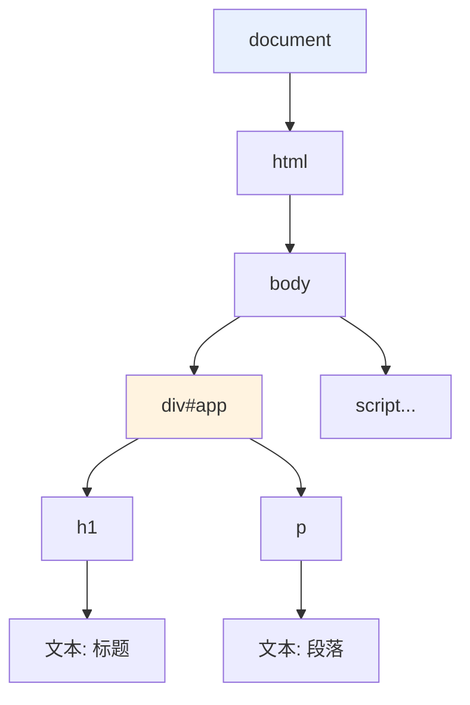
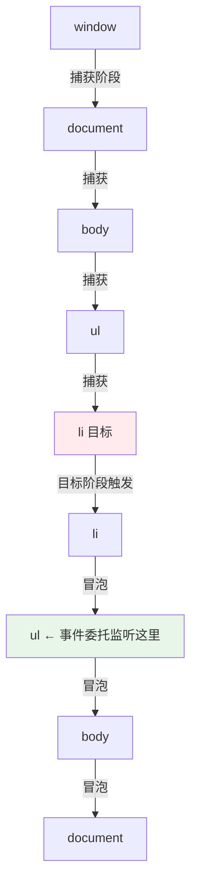

# 04 - DOM 操作

> 前置：[[前端开发/01-基础/JavaScript/03-对象与数组|对象与数组]]。DOM（Document Object Model）是浏览器把 HTML 解析成的对象树，JS 通过操作这棵树来改变页面。本章侧重语法实操，浏览器 API 全貌见 [[前端开发/04-DOM与交互/HTML-DOM/01-DOM基础与选择器|DOM 基础与选择器]]。

---

## 1. DOM 树概念

浏览器加载 HTML 后，会把标签解析成一棵以 `document` 为根的**对象树**——每个标签、属性、文本都成为树上的节点对象，JS 拿到的是这些对象的引用：

```html
<html>
  <body>
    <div id="app">
      <h1>标题</h1>
      <p>段落</p>
    </div>
  </body>
</html>
```



对 Java 程序员的类比：`document` 相当于工厂创建出的对象图入口；HTML 是序列化格式，DOM 是内存中的活对象——改 HTML 文件要刷新页面才生效，改 DOM 对象**立刻**反映到屏幕上。

常用节点关系：`parentElement`、`children`、`firstElementChild`、`nextElementSibling` 等，配合下面获取元素的方法可以自由导航。

---

## 2. 获取元素的五种方法

```javascript
// 方法一：getElementById —— 最快，返回单个元素或 null
const app = document.getElementById("app");

// 方法二：querySelector —— CSS 选择器语法，返回第一个匹配
const firstItem = document.querySelector(".list-item");
const nav = document.querySelector("#app > nav");

// 方法三：querySelectorAll —— 返回所有匹配的静态 NodeList
const allItems = document.querySelectorAll(".list-item");
allItems.forEach(el => console.log(el.textContent)); // 可直接 forEach

// 方法四：getElementsByClassName —— 返回动态 HTMLCollection
const byCls = document.getElementsByClassName("list-item");

// 方法五：getElementsByTagName —— 返回动态 HTMLCollection
const divs = document.getElementsByTagName("div");
```

| 方法 | 参数 | 返回 | 静态/动态 | 推荐 |
|------|------|------|-----------|------|
| getElementById | id | Element 或 null | - | 已知唯一 id |
| querySelector | CSS 选择器 | 首个匹配 | - | 取单个元素首选 |
| querySelectorAll | CSS 选择器 | NodeList | 静态快照 | 批量操作首选 |
| getElementsByClassName | class 名 | HTMLCollection | 动态 | 老代码维护 |
| getElementsByTagName | 标签名 | HTMLCollection | 动态 | 老代码维护 |

推荐原则：**统一用 querySelector / querySelectorAll**。一套 CSS 选择器语法通吃所有场景，心智负担最小。"动态"意味着集合会随 DOM 变化自动更新，遍历时增删元素容易踩坑，静态快照更可预测。

一个必须养成的习惯：脚本若在 `<head>` 中不带 defer 执行，此时 body 还没解析，`querySelector` 会拿到 null。要么用 defer，要么把脚本放 body 底部。

---

## 3. 修改内容：innerHTML vs textContent

```javascript
const box = document.querySelector("#box");

// textContent：纯文本写入，标签会被转义显示
box.textContent = "<b>加粗</b>";   // 页面显示字面的 <b>加粗</b>

// innerHTML：按 HTML 解析写入，标签生效
box.innerHTML = "<b>加粗</b>";     // 页面显示真正的粗体
```

### XSS 安全警告

innerHTML 会执行其中的内容，如果字符串来源包含用户输入，就打开了 **XSS（跨站脚本攻击）** 的大门：

```javascript
const comment = '';

// 危险！用户提交的内容被当 HTML 执行
el.innerHTML = comment;

// 安全做法一：纯文本一律用 textContent
el.textContent = comment; // 原样展示，不执行

// 安全做法二：确实需要富文本时，先转义或用专门的净化库（如 DOMPurify）
function escapeHtml(str) {
  return str
    .replaceAll("&", "&amp;")
    .replaceAll("<", "&lt;")
    .replaceAll(">", "&gt;")
    .replaceAll('"', "&quot;");
}
el.innerHTML = `<p>${escapeHtml(userInput)}</p>`;
```

规范：**用户可控数据永远不进 innerHTML**。这与 Java 后端防 SQL 注入用 PreparedStatement 是同一种思维——数据与代码严格分离。

---

## 4. 创建、插入与删除

```javascript
// 创建新元素（此时还在内存中，页面上不可见）
const li = document.createElement("li");
li.textContent = "新任务";
li.classList.add("item");

// 插入方式一：append / prepend（ES6 后的现代 API，可同时插多个节点和文本）
document.querySelector("ul").append(li);      // 加到末尾
document.querySelector("ul").prepend(li.cloneNode(true)); // 加到开头

// 插入方式二：insertAdjacentHTML —— 在指定相对位置插入 HTML 片段
ul.insertAdjacentHTML("beforeend", `<li class="item">模板生成的任务</li>`);
// beforebegin / afterbegin / beforeend / afterend 四个方位

// 删除：直接调用元素自己的 remove（现代）或父节点 removeChild（老式）
li.remove();
// ul.removeChild(li); // 老写法

// 替换
ul.replaceChild(newLi, oldLi);
```

性能提示：循环里频繁 append 到已渲染的 DOM 会导致多次重排，应先在 `DocumentFragment` 或字符串中拼好再一次性插入：

```javascript
const frag = document.createDocumentFragment();
for (let i = 0; i < 100; i++) {
  const item = document.createElement("li");
  item.textContent = `条目 ${i}`;
  frag.append(item);
}
ul.append(frag); // 只触发一次重排
```

---

## 5. 样式操作

### 5.1 style 直接改 vs classList（推荐）

```javascript
const card = document.querySelector(".card");

// 方式一：style 属性逐项设置（内联样式，优先级高，难维护）
card.style.color = "red";
card.style.backgroundColor = "#eee"; // CSS 的 background-color 变驼峰

// 方式二（推荐）：预先在 CSS 里定义类，JS 只负责切换
card.classList.add("highlight");       // 添加类
card.classList.remove("highlight");    // 移除类
card.classList.toggle("dark-mode");    // 有则删无则加，开关场景神器
card.classList.contains("dark-mode");  // 查询
card.classList.replace("old", "new");  // 替换
```

推荐理由是职责分离：CSS 管"长什么样"，JS 只管"什么状态"。样式细节全部沉淀在 CSS 文件里可复用、可主题化，JS 侧只剩语义化的类名切换。`style.xxx` 直接改适合极少数一次性动态计算的场景（比如拖拽时实时更新坐标）。

---

## 6. 属性操作

元素身上的三类"数据位"要分清：HTML 属性（attribute）、DOM 对象属性（property）、自定义 data-* 属性。

```javascript
const input = document.querySelector("input");
const img = document.querySelector("img");

// HTML attribute：读写标签上的原始字符串
input.getAttribute("type");        // "text"
img.setAttribute("src", "/a.png");
img.removeAttribute("alt");

// DOM property：对象上的 JS 属性，多数与同名 attribute 自动同步
input.value = "新值";              // 用户输入框的实时值只能从 property 读
console.log(input.value);

// data-* 自定义属性：规范的自定义数据通道
// <li data-id="42" data-priority="high">
const li = document.querySelector("li");
li.dataset.id;        // "42"，注意全部是字符串！
li.dataset.priority;  // "high"
li.dataset.done = "true";
```

注意两点：

- `dataset` 的值永远是**字符串**，做数值比较前要 `Number()` 转换——第 7 章实战里就有这个坑
- `class` 属性在 property 侧叫 `className`，且操作 class 一律走上一节的 `classList`

---

## 7. 事件绑定

### 7.1 addEventListener 三要素

```javascript
const btn = document.querySelector("#save-btn");

btn.addEventListener("click", function (event) {
  console.log("按钮被点击了", event);
});

// 可以给同一元素绑多个同类监听器（onXXX 属性赋值做不到）
btn.addEventListener("click", function () {
  console.log("第二个监听器也会执行");
});
```

事件对象 `event` 常用字段：

```javascript
document.addEventListener("keydown", (e) => {
  e.key;         // "Enter"、"Escape"、普通字符等
  e.target;      // 实际触发事件的元素
  e.preventDefault();  // 阻止默认行为，如表单提交刷新页面
  e.stopPropagation(); // 阻止事件继续冒泡（慎用）
});

form.addEventListener("submit", (e) => {
  e.preventDefault();  // 表单校验不通过时不让页面跳转
});
```

### 7.2 冒泡与捕获

事件传播分三个阶段：从 window 向下找到目标（捕获）→ 在目标上触发 → 从目标向上层层回传直到 window（冒泡）。`addEventListener` 默认监听冒泡阶段：



验证实验：给三层嵌套元素各绑定监听器并点击最内层，观察输出顺序即可理解三阶段流程。

### 7.3 事件委托：性能关键技巧

利用冒泡特性，把子元素的事件统一交给父元素处理。100 个列表项只需 1 个监听器而不是 100 个，且**动态新增的子元素无需重新绑定**：

```html
<ul id="todo-list">
  <li data-id="1">任务一 <button class="del">删除</button></li>
  <li data-id="2">任务二 <button class="del">删除</button></li>
  <!-- JS 动态插入的新 li 也自动被覆盖 -->
</ul>

<script>
  const list = document.querySelector("#todo-list");

  list.addEventListener("click", (e) => {
    // e.target 是真正被点击的最内层元素
    const delBtn = e.target.closest(".del"); // 从点击处向上找最近的 .del
    if (!delBtn) return;                     // 点的不是删除按钮，忽略

    const id = delBtn.parentElement.dataset.id;
    console.log(`删除任务 ${id}`);
    delBtn.parentElement.remove();
  });

  // 之后动态添加任意多个 li，都不需要再绑任何监听器
  list.insertAdjacentHTML(
    "beforeend",
    '<li data-id="3">动态新增 <button class="del">删除</button></li>'
  );
</script>
```

要点拆解：

- `data-*` 自定义属性携带业务数据，通过 `dataset` 读取（`data-id` 对应 `dataset.id`）
- `closest(selector)` 沿祖先链向上查找，是委托模式的标准搭配
- 判断"点的到底是谁"后分发逻辑，一个父级监听器服务整棵子树

这个模式在第 7 章的 TodoList 实战里会大规模使用，也是 Vue/React 合成事件机制的原理基础。

---

## 8. 综合小例：计数器

把本章知识串起来——一个完整可运行的计数器页面：

```html
<!DOCTYPE html>
<html lang="zh-CN">
<head>
  <meta charset="UTF-8">
  <style>
    #counter { font-size: 48px; margin: 16px 0; }
    button { padding: 8px 20px; cursor: pointer; }
  </style>
  <script src="counter.js" defer></script>
</head>
<body>
  <div id="counter">0</div>
  <button id="inc">+1</button>
  <button id="reset">归零</button>
</body>
</html>
```

```javascript
// counter.js
let count = 0;
const display = document.querySelector("#counter");

function render() {
  display.textContent = count;          // 状态 -> 视图的单向同步
}

document.querySelector("#inc").addEventListener("click", () => {
  count++;
  render();
});

document.querySelector("#reset").addEventListener("click", () => {
  count = 0;
  render();
});

render();
```

注意这里的雏形：`count` 是状态，`render` 负责把状态画到 DOM，事件只改状态然后调 render——这就是第 7 章 TodoList 中"状态与渲染分离"架构的种子。

---

## 9. 本章小结

- DOM 是浏览器内存中的 HTML 对象树，改对象即时生效。
- 选元素统一用 querySelector / querySelectorAll；注意脚本执行时机避免拿到 null。
- 用户可控内容禁入 innerHTML（XSS），纯文本用 textContent。
- 批量插入用 DocumentFragment 一次成型；classList.toggle 管理样式状态。
- 事件三阶段：捕获-目标-冒泡；默认在冒泡阶段监听。
- 事件委托 = 父级监听 + closest 定位 + dataset 传参，省监听器且天然支持动态子元素。

下一章解决"异步"这一 JS 的第二座大山：[[前端开发/01-基础/JavaScript/05-异步编程|异步编程]]。
