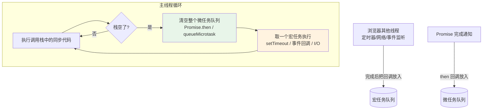

# 05 - 异步编程

> 前置：[[前端开发/01-基础/JavaScript/02-函数与作用域|函数与作用域]]（函数是一等公民）、[[前端开发/01-基础/JavaScript/04-DOM操作|DOM 操作]]。异步是 JS 与 Java/C 心智差异最大的领域之一——Java 有多线程，JS 的主线程只有一条，"并发"靠事件循环排队实现。

---

## 1. 为什么需要异步：单线程模型

### 1.1 单线程的由来与约束

JS 生为浏览器脚本，设计目标是操作 DOM。如果两个线程同时改同一个节点，就需要锁机制，网页语言背不动这个复杂度——所以 **JS 从出生起就是单线程**：同一时刻只执行一段代码。

但页面又充满耗时操作：网络请求动辄几百毫秒、定时器要等秒级、文件读取更久。如果同步等待，页面会整段卡死（点击无响应、动画冻结）。解法是：**耗时的活交给浏览器其他组件去干，干完后再回来通知 JS 主线程**。

类比 Java：Java 用 `Thread` / `CompletableFuture` 开新执行流；JS 只有一条执行流 + 一个任务队列，异步任务的"回调"被排进队列等待主线程空闲时执行。C 类比：像 `epoll` 事件循环——注册感兴趣的事件，回调在事件到达后被调度。

### 1.2 事件循环 Event Loop

主线程反复执行一个循环：跑完调用栈里的所有同步代码 → 清空全部微任务 → 取一个宏任务执行 → 再清微任务……如此往复。



关键规则用代码验证：

```javascript
console.log("1 同步");

setTimeout(() => console.log("4 宏任务"), 0);

Promise.resolve().then(() => console.log("3 微任务"));

console.log("2 同步");

// 输出顺序：1 同步 -> 2 同步 -> 3 微任务 -> 4 宏任务
// 即使 setTimeout 延迟 0ms，也要等所有微任务之后才轮到它
```

记忆口诀：**同步先行，微任务插队，宏任务排队；每取一个宏任务前先把微任务清干净**。

---

## 2. 回调函数与回调地狱

### 2.1 异步的最初形态：回调

```javascript
// setTimeout：最简单的异步 API
console.log("开始");
setTimeout(() => {
  console.log("2 秒后执行");
}, 2000);
console.log("结束"); // 先于上面那句打印 —— 定时器不阻塞主线程

// 模拟一次网络请求：传一个"完成后再调用"的函数
function fetchUser(callback) {
  setTimeout(() => {
    callback({ id: 1, name: "张三" });
  }, 1000);
}

fetchUser((user) => {
  console.log("拿到用户", user.name);
});
```

回调本身没问题（数组高阶方法的参数也是回调），问题出在**多个异步步骤有依赖关系**时。

### 2.2 回调地狱

需求：先拿用户 → 再拿该用户的订单列表 → 再拿第一笔订单详情。回调风格只能嵌套：

```javascript
fetchUser((user) => {
  fetchOrders(user.id, (orders) => {
    fetchOrderDetail(orders[0].id, (detail) => {
      renderPage(user, detail);          // 三层已经难以卒读
      fetchOrderDetail(orders[0].id, (another) => {  // 继续嵌套则彻底失控
        // ...
      });
    });
  });
});
```

三大病症：

1. **横向膨胀**：缩进不断加深，代码呈金字塔形
2. **错误处理缺失**：每一层都要手动 try/catch 或传 error 参数，没人真的这么做
3. **无法组合**：想"三个请求并行，都完成再渲染"几乎写不出来

Promise 就是为终结这个时代而生的。

---

## 3. Promise 三态详解

### 3.1 什么是 Promise

Promise 是一个**代表未来值的容器**：现在还没结果，但承诺将来会有（成功值或失败原因）。三种状态：

| 状态 | 含义 | 是否可变 |
|------|------|----------|
| pending | 等待中 | 可转为另外两种 |
| fulfilled | 已成功，携带 value | **终态，不可再变** |
| rejected | 已失败，携带 reason | 终态 |

状态机一旦离开 pending 就永久定格——这与 Java `Future` 只能阻塞 get() 不同，Promise 靠注册回调响应结果。

```javascript
const p = new Promise((resolve, reject) => {
  // 执行器立刻同步运行，做异步工作
  setTimeout(() => {
    const ok = Math.random() > 0.5;
    if (ok) resolve("任务数据");   // 转 fulfilled
    else reject(new Error("任务失败")); // 转 rejected
  }, 500);
});

p.then(value => console.log("成功:", value))   // 注册成功回调
 .catch(err => console.log("失败:", err.message)) // 注册失败回调
 .finally(() => console.log("无论成败都执行"));   // 清理逻辑
```

要点：

- `then` 返回**新 Promise**，因此可以链式调用——这是消灭回调地狱的核心机制
- 链中任何一环抛错都会被后续最近的 `catch` 捕获，类似 Java try-catch 但作用于时间轴上
- 回调里 return 的普通值会自动包装成 resolved Promise 传给下一环

### 3.2 链式调用重构回调地狱

```javascript
fetchUser()
  .then(user => fetchOrders(user.id))     // return 新 Promise，下一环拿到其结果
  .then(orders => fetchOrderDetail(orders[0].id))
  .then(detail => renderPage(detail))
  .catch(err => showToast(err.message));  // 一处 catch 兜住全链路错误
```

金字塔变成了直线，错误处理收敛到一处。

### 3.3 静态方法使用场景表

```javascript
// Promise.all：全部成功才算成功；任一失败立即整体失败（快速失败）
const [user, orders] = await Promise.all([fetchUser(), fetchOrders()]);
// 场景：并行请求互不依赖的数据，缺一不可（页面首屏多模块）

// Promise.race：谁先落定（无论成败）就用谁的
const result = await Promise.race([fetchData(), timeout(3000)]);
// 场景：请求超时控制

// Promise.allSettled：等全部落定，永不 reject，逐个给出成败
const results = await Promise.allSettled([
  fetchA(), fetchB(), fetchC(),
]);
results.forEach(r => {
  if (r.status === "fulfilled") console.log(r.value);
  else console.log(r.reason);
});
// 场景：批量加载独立小部件，个别失败不拖垮整页

// Promise.any：第一个成功的就算成功，全败才失败（聚合 AggregateError）
const fastest = await Promise.any([mirrorA(), mirrorB()]);
```

| 方法 | 成功条件 | 失败条件 | 典型场景 |
|------|----------|----------|----------|
| all | 全部 fulfilled | 任一 rejected | 并行必需资源 |
| race | 第一个落定者 | 第一个落定者若失败 | 超时兜底 |
| allSettled | 全部落定 | 几乎不失败 | 批量容错加载 |
| any | 第一个 fulfilled | 全部 rejected | 多镜像竞速 |

---

## 4. async/await：同步风格的异步

### 4.1 语法糖本质

`async` 函数自动把返回值包装成 Promise；`await` 暂停当前 async 函数（**不阻塞主线程**），直到右侧 Promise 落定。它是 Promise 链的语法糖，让异步代码长得像同步代码：

```javascript
async function loadPage() {
  const user = await fetchUser();            // "暂停"在这里等结果
  const orders = await fetchOrders(user.id);
  const detail = await fetchOrderDetail(orders[0].id);
  renderPage(detail);
  return "done";                             // 自动包装为 resolved Promise
}

loadPage().then(msg => console.log(msg));
```

对比第 3.2 节的 then 链：逻辑完全一致，可读性天壤之别。

### 4.2 错误处理：try-catch 回归

await 会把 rejected Promise 变成抛出的异常，于是熟悉的 try-catch 直接可用（对 Java 程序员零学习成本）：

```javascript
async function loadPageSafe() {
  try {
    const user = await fetchUser();
    const orders = await fetchOrders(user.id);
    renderPage(orders);
  } catch (err) {
    // fetchUser/fetchOrders 中任何一个失败都会落到这里
    showError(err.message);
  } finally {
    hideSpinner();
  }
}
```

### 4.3 串行陷阱与并行重构

await 连续出现时会**串行**等待——如果请求之间没有依赖，这就是白白浪费时间的串行陷阱：

```javascript
// 反例：串行，总耗时 = t1 + t2 + t3
const user = await fetchUser();       // 等 300ms
const posts = await fetchPosts();     // 再等 300ms
const tags = await fetchTags();       // 再等 300ms

// 正确：先发起全部请求，再统一 await —— 总耗时约等于最慢的那个
const [user2, posts2, tags2] = await Promise.all([
  fetchUser(),
  fetchPosts(),
  fetchTags(),
]);
```

判断标准一句话：**下一个请求需要上一个的结果吗？需要就串行，不需要就 Promise.all 并行**。

## 5. 定时器与清理

```javascript
// setTimeout：延迟执行一次，返回句柄 id
const timerId = setTimeout(() => console.log("boom"), 1000);

// setInterval：周期性重复执行
const intervalId = setInterval(() => console.log("tick"), 500);

// 清理：必须保存句柄并显式取消，否则闭包和回调一直存活（内存泄漏来源之一）
clearTimeout(timerId);
clearInterval(intervalId);

// 实战模式：React/Vue 组件卸载或页面切换时清理
let pollTimer = null;
function startPolling() {
  pollTimer = setInterval(refreshStatus, 3000);
}
function stopPolling() {
  if (pollTimer) clearInterval(pollTimer);
  pollTimer = null;
}
```

两个易错点：

- 定时器回调里的 `this` 是直接调用规则（window/undefined）——回调请用箭头函数（[[前端开发/01-基础/JavaScript/02-函数与作用域|函数与作用域]] 第 4 节）
- `setTimeout(fn, 0)` 不是"立即"，最快也要下一个宏任务轮次，且受前面任务排队影响；倒计时不要累加 delay 计算剩余时间，应基于时间戳差值

## 6. fetch 预告

浏览器原生的 HTTP 请求 API 就是基于 Promise 设计的，两行即可发请求：

```javascript
async function getUser(id) {
  const resp = await fetch(`/api/users/${id}`);
  if (!resp.ok) throw new Error(`HTTP ${resp.status}`);
  return await resp.json();   // 解析 body 也是异步的
}
```

注意 `fetch` 对 404/500 不抛异常，需手动检查 `resp.ok`。完整用法（请求头、POST、错误分类）见 AJAX 章节。

## 7. 实战：串行改并行重构示例

原始需求：加载一个商品页，需要商品信息、评论、推荐列表三类数据，评论依赖商品 id，其余独立。

**第一版：全串行 + 回调风格**

```javascript
function loadProductPageV1(productId) {
  fetchProduct(productId, (product) => {
    fetchComments(product.id, (comments) => {
      fetchRecommend(product.id, (recommends) => {
        render(product, comments, recommends);
      });
    });
  });
}
// 总耗时 = t商品 + t评论 + t推荐，且三层嵌套无错误处理
```

**第二版：Promise 链 + 识别依赖关系**

```javascript
function loadProductPageV2(productId) {
  fetchProduct(productId)
    .then(product =>
      // 评论和推荐都只依赖 product，可以并行
      Promise.all([
        fetchComments(product.id),
        fetchRecommend(product.id),
      ]).then(([comments, recommends]) =>
        render(product, comments, recommends)
      )
    )
    .catch(showError);
}
```

**第三版：async/await 最终形态**

```javascript
async function loadProductPageV3(productId) {
  try {
    const product = await fetchProduct(productId);      // 必须先拿商品
    const [comments, recommends] = await Promise.all([
      fetchComments(product.id),                        // 两者互相独立
      fetchRecommend(product.id),
    ]);
    render(product, comments, recommends);
  } catch (err) {
    showError(err.message);
  }
}
```

重构收益清单：

- 嵌套从三层归零，逻辑线性展开
- 评论与推荐由串行变并行，页面加载时间显著缩短
- 错误处理从一个 catch 全覆盖
- 若三类数据完全互不依赖，还可以把第一次 fetch 也并入 Promise.all 进一步提速

## 8. 本章小结

- JS 单线程 + 事件循环：同步代码先跑完，微任务清空，再取宏任务；`setTimeout(fn,0)` 也排在微任务后。
- 回调地狱三宗罪：深嵌套、难容错、不可组合。
- Promise 三态单向流转；then 链式传递；all/race/allSettled/any 各有场景。
- async/await 是 Promise 语法糖，try-catch 处理错误；连续 await 是串行，无依赖请求用 Promise.all 并行。
- 定时器要保存句柄并在适当时机清理。
- 重构心法：画出请求依赖图，能并行的绝不串行。

带着这套工具去实战：[[前端开发/01-基础/JavaScript/07-JS实战：交互式页面|JS 实战：交互式页面]]。
