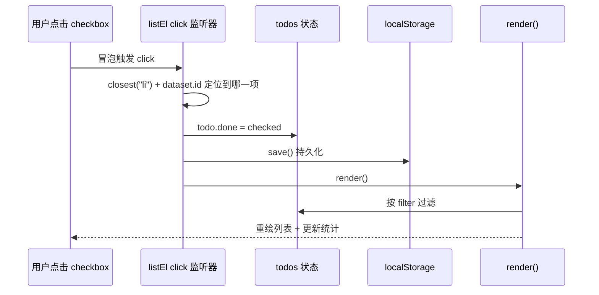

# 07 - JS 实战：交互式页面（TodoList）

> 前置：[[前端开发/01-基础/JavaScript/04-DOM操作|DOM 操作]]、[[前端开发/01-基础/JavaScript/05-异步编程|异步编程]]、[[前端开发/01-基础/JavaScript/06-ES6+特性|ES6+ 特性]]。本章把前六章语法融成一个完整的单文件应用：一个支持增删改查、本地持久化、筛选的待办事项清单。

---

## 1. 功能与架构设计

### 1.1 需求清单1. 添加待办：输入框 + Enter 键或点击按钮提交
2. 删除待办：每项带删除按钮
3. 编辑待办：双击文本进入编辑态，Enter 确认、Escape 取消
4. 勾选完成：checkbox 切换状态
5. 筛选：全部 / 未完成 / 已完成 三档
6. 持久化：localStorage，刷新页面数据不丢
7. 底部统计：剩余未完成数量

### 1.2 架构决策：朴素版 MVC

不引入任何框架，但要有框架的思维——**状态与渲染分离**。先看为什么不能"事件里直接改 DOM"：勾选一项时除了更新 checkbox，还要更新统计文字、可能还要按当前筛选把它从列表移除、还要写 localStorage——每处逻辑都散落在事件处理器里，改一处漏一处是必然结局。分离之后每个模块只剩一个职责：

```mermaid
flowchart LR
    U[用户操作<br>点击/输入] -->|事件处理| S[修改 state<br>纯数据对象]
    S --> R[render&#40;&#41;<br>根据 state 全量重绘列表]
    R --> DOM[(DOM 视图)]
    DOM -->|事件委托监听| U

    S <-->|读写同步| LS[(localStorage)]

    style S fill:#e8f5e9
```



三条铁律：

- **事件处理器只做一件事：改 state**，绝不直接操纵列表 DOM
- **render 函数只做一件事：把 state 画成 HTML**，它不知道事件的存在
- state 变化后必须调用 render，保证视图永远是状态的忠实投影
- localStorage 是 state 的持久化镜像，写操作后同步 save，启动时作为初始化来源

对比 Java Swing/JavaFX 的事件模型：监听器直接 setXxx 改控件；这里改为"改数据 + 重绘"，正是 React/Vue 单向数据流的思想雏形。小应用全量重绘毫无压力，代价是丢掉焦点等细节（编辑态需要特殊照顾，见代码）。

## 2. 运行方式

1. 新建目录，把下面代码保存为 `index.html`
2. 双击直接用 Chrome 打开即可（本应用无网络请求，file 协议也能完整运行）
3. 推荐改用 VS Code 的 Live Server 插件启动：保存自动刷新，调试体验好得多
4. 打开 DevTools：Console 看日志、Application 面板查看 localStorage、Elements 面板观察 render 生成的 DOM
5. 想验证持久化跨标签页生效，可再开一个同路径的窗口——storage 事件与 origin 共享机制在后续章节展开

功能验收清单（全部通过才算完成）：

- [ ] 输入空格串提交，不产生新条目
- [ ] Enter 与按钮两种方式都能添加
- [ ] 刷新页面后数据仍在（localStorage 生效）
- [ ] 双击编辑，Enter 保存、Escape 取消
- [ ] 筛选"未完成"时勾选一项，该项立即从列表消失（filter 是派生数据）
- [ ] 清除已完成只影响 done 为 true 的项
- [ ] 在输入框输入 `<b>x</b>`，列表原样显示文本而不是粗体

## 3. 完整源码

单文件 `index.html`，复制即可运行：

```html
<!DOCTYPE html>
<html lang="zh-CN">
<head>
  <meta charset="UTF-8">
  <title>TodoList</title>
  <style>
    * { box-sizing: border-box; margin: 0; }
    body { font-family: system-ui, sans-serif; background: #f5f5f5;
           display: flex; justify-content: center; padding: 40px 16px; }
    .app { width: 100%; max-width: 480px; background: #fff;
           border-radius: 12px; box-shadow: 0 2px 8px rgba(0,0,0,.08); }
    h1 { font-size: 20px; padding: 20px 20px 0; color: #333; }

    .new-todo { display: flex; gap: 8px; padding: 16px 20px; }
    .new-todo input { flex: 1; padding: 10px 12px; border: 1px solid #ddd;
                      border-radius: 8px; font-size: 14px; }
    .new-todo button { padding: 10px 18px; border: none; border-radius: 8px;
                       background: #2563eb; color: #fff; cursor: pointer; }

    .filters { display: flex; gap: 4px; padding: 0 20px; }
    .filters button { flex: 1; padding: 8px 0; border: none; cursor: pointer;
                      background: transparent; color: #666; border-radius: 6px; }
    .filters button.active { background: #eff6ff; color: #2563eb; font-weight: bold; }

    ul { list-style: none; padding: 8px 20px; }
    li { display: flex; align-items: center; gap: 10px;
         padding: 10px 0; border-bottom: 1px solid #eee; }
    li.done .label { text-decoration: line-through; color: #aaa; }
    li .label { flex: 1; font-size: 14px; }
    li .del { border: none; background: transparent; color: #ef4444;
              cursor: pointer; visibility: hidden; }
    li:hover .del { visibility: visible; }
    li input[type="text"] { flex: 1; padding: 6px 8px; border: 1px solid #93c5fd;
                            border-radius: 6px; font-size: 14px; }

    footer { display: flex; justify-content: space-between; align-items: center;
             padding: 14px 20px; font-size: 13px; color: #888; }
    footer button { border: none; background: none; color: #ef4444; cursor: pointer; }
  </style>
</head>
<body>
  <div class="app">
    <h1>待办事项</h1>

    <div class="new-todo">
      <input id="todo-input" type="text" placeholder="做什么？按 Enter 提交"
             autocomplete="off">
      <button id="add-btn">添加</button>
    </div>

    <div class="filters" id="filters">
      <button data-filter="all" class="active">全部</button>
      <button data-filter="active">未完成</button>
      <button data-filter="done">已完成</button>
    </div>

    <ul id="todo-list"></ul>

    <footer>
      <span id="count"></span>
      <button id="clear-done">清除已完成</button>
    </footer>
  </div>

  <script type="module">
    // ============ 1. 状态层 ============
    const STORAGE_KEY = "rootstack.todos";

    function loadTodos() {
      try {
        return JSON.parse(localStorage.getItem(STORAGE_KEY)) ?? [];
      } catch {
        return []; // 存储被污染时静默降级为空列表
      }
    }

    let todos = loadTodos();               // [{id, title, done}, ...]
    let filter = "all";                    // 'all' | 'active' | 'done'

    function save() {
      localStorage.setItem(STORAGE_KEY, JSON.stringify(todos));
    }

    // ============ 2. 渲染层 ============
    const listEl = document.querySelector("#todo-list");
    const countEl = document.querySelector("#count");

    const esc = (s) => s.replaceAll("&", "&amp;").replaceAll("<", "&lt;")
                        .replaceAll(">", "&gt;").replaceAll('"', "&quot;");

    function render() {
      const visible = todos.filter(t =>
        filter === "all" ? true : filter === "done" ? t.done : !t.done
      );

      listEl.innerHTML = visible.map(t => `
        <li class="${t.done ? "done" : ""}" data-id="${t.id}">
          <input type="checkbox" ${t.done ? "checked" : ""} class="toggle">
          <span class="label">${esc(t.title)}</span>
          <button class="del">删除</button>
        </li>
      `).join("");

      const remain = todos.filter(t => !t.done).length;
      countEl.textContent = `共 ${todos.length} 项，剩余 ${remain} 项未完成`;
    }

    // ============ 3. 事件层（全部走事件委托） ============
    function addTodo(title) {
      const trimmed = title.trim();
      if (!trimmed) return;
      todos.unshift({ id: Date.now(), title: trimmed, done: false });
      save();
      render();
    }

    document.querySelector("#add-btn").addEventListener("click", () => {
      addTodo(document.querySelector("#todo-input").value);
      document.querySelector("#todo-input").value = "";
    });

    document.querySelector("#todo-input").addEventListener("keydown", (e) => {
      if (e.key !== "Enter") return;
      addTodo(e.target.value);
      e.target.value = "";
    });

    listEl.addEventListener("click", (e) => {
      const li = e.target.closest("li");
      if (!li) return;
      const id = Number(li.dataset.id);

      if (e.target.classList.contains("toggle")) {
        const todo = todos.find(t => t.id === id);
        if (!todo) return;
        todo.done = e.target.checked;
        save(); render();
      } else if (e.target.classList.contains("del")) {
        todos = todos.filter(t => t.id !== id);
        save(); render();
      }
    });

    // 双击进入编辑态
    listEl.addEventListener("dblclick", (e) => {
      const label = e.target.closest(".label");
      if (!label) return;
      const li = label.closest("li");
      const id = Number(li.dataset.id);
      const todo = todos.find(t => t.id === id);
      if (!todo) return;

      const input = document.createElement("input");
      input.type = "text";
      input.value = todo.title;
      label.replaceWith(input);   // 文本替换为输入框
      input.focus();
      input.select();

      const commit = () => {
        const v = input.value.trim();
        if (v) { todo.title = v; save(); }
        render();
      };
      input.addEventListener("keydown", (ev) => {
        if (ev.key === "Enter") commit();
        if (ev.key === "Escape") render();   // 取消即重绘还原
      });
      input.addEventListener("blur", commit);
    });

    document.querySelector("#filters").addEventListener("click", (e) => {
      const btn = e.target.closest("button[data-filter]");
      if (!btn) return;
      filter = btn.dataset.filter;
      document.querySelectorAll("#filters button")
        .forEach(b => b.classList.toggle("active", b === btn));
      render();
    });

    document.querySelector("#clear-done").addEventListener("click", () => {
      todos = todos.filter(t => !t.done);
      save(); render();
    });

    render();
  </script>
</body>
</html>
```

## 4. 架构逐模块讲解

### 4.1 状态层为什么用模块顶层变量

`todos` 与 `filter` 是应用的唯一事实来源（single source of truth）。它们定义在 module script 的顶层作用域里——借助 ES Module 天然隔离，既不是全局变量也不会被外部篡改（[[前端开发/01-基础/JavaScript/06-ES6+特性|ES6+ 特性]] 第 4 节）。

状态形状刻意保持最小：

```javascript
{ id: 1700000000000, title: "买牛奶", done: false }
```

只存"业务必须的字段"，不冗余存筛选结果、统计数字——一切派生数据都在 render 时从 todos 现算。冗余状态是视图错乱 bug 的头号来源：存两份就迟早不一致。这个原则在 Vue 的 computed、React 的 useMemo 里被进一步制度化。

`loadTodos` 里 try-catch 包裹 JSON.parse 是防御式编程：用户手动改过 localStorage 或版本迁移导致脏数据时，应用降级为空列表而不是白屏崩溃。

### 4.2 渲染层的两个关键点

**转义是硬要求**。`esc()` 函数在插值前处理标题，否则输入 `` 就是存储型 XSS——攻击载荷会持久化在 localStorage，每个打开页面的用户都会中招（[[前端开发/01-基础/JavaScript/04-DOM操作|DOM 操作]] 第 3 节）。

**全量重绘的取舍**。每次改动都重新生成整个列表 HTML，代码量最小且永远不会出现"视图与状态不一致"。代价是：checkbox 的勾选动画丢失、编辑态输入框会被重建打断。所以编辑功能没有走 render 流程，而是局部替换节点——这是朴素 MVC 在细节处的必要妥协，框架（虚拟 DOM diff）解决的就是这类问题。

### 4.3 事件层的三处设计

**统一事件委托**。列表上只挂了 click 和 dblclick 两个监听器，通过 `closest` 定位目标、`dataset.id` 取回业务主键，动态增删的行无需任何额外绑定。注意 `Number(li.dataset.id)`：dataset 读出来的是字符串，`===` 比较数字 id 前必须转换——这是本章常见 bug 清单的第一条。

**id 用 Date.now() 而非数组下标**。下标会随排序、删除而漂移，作为业务标识必然出错；时间戳在本应用规模内足够唯一。正式系统应使用 UUID。

**筛选状态不入 localStorage**。filter 是纯会话内的视图偏好，刷新后回到"全部"符合直觉；todos 才是需要跨会话存活的业务数据。哪些状态要持久化是每个应用都要做的明确决策，而不是无脑全存。

**键盘提交**。输入框监听 keydown 且只响应 `e.key === "Enter"`；同时保留按钮点击路径，两条入口收敛到同一个 `addTodo`，逻辑不分叉。

### 4.4 数据流转示例

以"勾选一项任务"为例完整走一遍数据流：



每条路径都是同一个循环：事件 -> 改状态 -> 存盘 -> 重绘。理解了这个闭环，就理解了所有前端框架的核心叙事。

对照第 4 章"计数器"小例：那里的 count 是单个数字，这里升级为对象数组 + 派生筛选 + 持久化，但架构模式完全同构。学会把复杂需求拆回这个最小闭环，是从"会写 JS"到"会做前端"的分界线。

## 5. 常见 bug 清单

初学者复刻此应用时的四大高发问题：

1. **innerHTML 注入**：省略 esc() 直接 `${t.title}` 插值。平时看不出来，一旦输入含标签的内容就 XSS。测试方法：往输入框里敲 `<b>x</b>` 和引号，看是否原样显示。
2. **重复绑定监听器**：把 `addEventListener` 写进渲染循环或添加函数里，每 render 一次就多绑一层，点一次删除执行 N 次。铁律：监听器只在初始化时绑定一次，配合事件委托。
3. **日期/数字比较类型不符**：dataset.id 是字符串，`t.id === li.dataset.id` 永远 false；同理从 input 读到的数字要先 `Number()`。排查手段：console.log 打印两侧的 `typeof`。
4. **blur 与 Enter 双触发**：编辑框按 Enter 时先触发 keydown 再触发 blur，commit 执行两次。解法如本例——commit 幂等（重复设置同样的值无害），或在 keydown 中置标志位阻止后续 blur 处理。

调试技巧：Chrome DevTools 的 Application 面板可直接查看和编辑 localStorage；Elements 面板中 DOM 断点能在节点被删改时自动暂停脚本。

另外两个隐蔽但值得知道的坑：

- **Date.now() 撞 id**：快速连续添加时理论上可能重复，练习项目可接受；正式实现用 `crypto.randomUUID()`。
- **JSON.parse 返回 null**：localStorage 中 key 不存在时 getItem 返回 null，`JSON.parse(null)` 得到 null 而不是抛错——所以 loadTodos 里用 `?? []` 兜底而不是依赖 catch。

## 6. 下一步指引与扩展练习

你已经用原生 JS 手写了一个有完整状态管理的小型应用，也亲手触碰到了它的边界：手动转义、全量重绘、焦点维护都很繁琐。这些正是框架要解决的问题——不是"原生 JS 不行"，而是当应用规模增长时，手动同步状态的边际成本会失控。

下一阶段推荐路线：

- 用 Vue3 重写这个 Todo，体验声明式渲染与双向绑定如何消灭 render 函数：[[前端开发/03-JS框架/Vue3/01-Vue3基础|Vue3 基础]]
- 或选择 React 路线感受组件化与 JSX（见 React 分册）
- 补充网络能力后接入真实后端：AJAX 章节（fetch 完整用法）

建议现在就动手：先把本文代码跑起来，然后不看原文独立重写一遍，再对照检查差异。

### 扩展练习

按难度递增，每个练习都只依赖本章知识：

1. **编辑时间戳**：给 todo 增加 `createdAt` 字段，列表按创建时间倒序显示
2. **拖拽排序**（进阶）：用 HTML5 原生 `draggable` 属性实现列表项拖动排序，drop 后更新 todos 数组顺序并 save
3. **双击统计**：底部增加"已完成 X 项"的实时进度条，用 CSS width 百分比表达
4. **导出导入**：把 todos 序列化为 JSON 下载成文件，并支持从文件恢复——练手 Blob 与 FileReader
5. **重构挑战**：把 render 拆成 `renderList` 与 `renderCount` 两个函数，观察哪些交互需要同时调两个、哪些只需一个——这就是细粒度更新的起点
6. **迁移挑战**：把整个 script 改写为多个模块文件（state.js / render.js / events.js），用 import/export 组织——为工程化项目做预演
