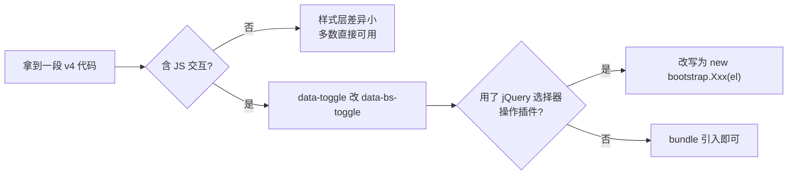

# Bootstrap4 快速参考

## 定位声明

Bootstrap 4 发布于 2018 年初，是 2018-2021 年间的主流版本，
大量企业后台、内部系统、老官网至今仍运行在它上面。v5 已全面取代它
成为新项目默认选择，但**存量项目的维护需求真实存在**——本章的
定位不是"教你从零用 v4"，而是：

1. 读懂并修改存量 v4 代码；
2. 快速对照 v4 与 v5 的差异，避免张冠李戴；
3. 给出维护与升级的决策清单。

前置阅读：[[前端开发/02-CSS框架/Bootstrap5/01-Bootstrap5基础|Bootstrap5 基础]]。

---

## 一、v4 与 v5 核心差异速查表

遇到旧代码时按这张表做"翻译"：

| 差异点 | v4 写法 | v5 写法 |
| --- | --- | --- |
| JS 依赖 | 必须先引 jQuery + popper.js | 无 jQuery, 仅 bundle(内含 Popper) |
| data 属性前缀 | data-toggle / data-dismiss | data-bs-toggle / data-bs-dismiss |
| .form-group 表单分组 | `<div class="form-group">` 包裹 label+input | 移除, 改用 mb-3 加 form-label |
| .custom-control 系列 | custom-checkbox / custom-switch | 改为 form-check / form-switch |
| .media 对象组件 | `<div class="media">` | 弃用, 用 flex 工具类替代 |
| 胶囊徽章 | .badge-pill | 改为 .rounded-pill |
| 徽章语义类 | .badge-primary | 改为 .bg-primary |
| 表单行 | .form-row(负间距更紧) | 并入 .row(gutter 统一) |
| 输入组附加件 | input-group-append/prepend 包裹 | 直接平铺在 input-group 内 |
| 浮动导航 | .badge / float-* 等不变 | 新增 .d-grid、gap-* 工具类 |
| 暗色导航 | navbar-dark bg-dark 相同 | 相同, 另有 bg-body-* 系列变量 |
| RTL 支持 | 无 | 官方 rtl 构建版 |
| 浏览器支持 | IE10/11 勉强可用 | 不再支持 IE |
| Jumbotron 大屏块 | .jumbotron 组件 | 移除, 用工具类组合替代 |

记忆优先级最高的三条：**jQuery 没了、data 属性加了 `bs-`、
`.form-group` 没了**。这三条覆盖日常维护中九成的坑。



---

## 二、v4 常用写法快照

### 2.1 引入方式（注意 jQuery）

```html
<!-- v4 标准三连: CSS -> jQuery -> Popper -> Bootstrap JS -->
<link rel="stylesheet"
      href="https://cdn.jsdelivr.net/npm/bootstrap@4.6.2/dist/css/bootstrap.min.css" />

<script src="https://code.jquery.com/jquery-3.7.1.min.js"></script>
<script src="https://cdn.jsdelivr.net/npm/bootstrap@4.6.2/dist/js/bootstrap.bundle.min.js"></script>
```

### 2.2 栅格系统（与 v5 几乎一致）

栅格是 v4 与 v5 差异最小的部分，container/row/col、断点前缀
col-md-6、offset、order、gutter 全部通用，可直接迁移理解：

```html
<div class="container">
  <div class="row">
    <div class="col-md-8">主内容</div>
    <div class="col-md-4">侧栏</div>
  </div>
  <!-- v4 特有的 form-row: 更紧凑的 gutter, 用于表单 -->
  <div class="form-row">
    <div class="col"><input class="form-control" placeholder="姓" /></div>
    <div class="col"><input class="form-control" placeholder="名" /></div>
  </div>
</div>
```

### 2.3 导航栏结构差异

v4 的 navbar 结构与 v5 思路相同但细节不同：
折叠目标靠 `.collapse.navbar-collapse`，data 属性无 bs 前缀，
对齐用 `mr-auto/ml-auto`（v5 改名为 me-auto/ms-auto）：

```html
<nav class="navbar navbar-expand-lg navbar-dark bg-dark">
  <a class="navbar-brand" href="#">RootStack</a>
  <button class="navbar-toggler" type="button"
          data-toggle="collapse" data-target="#mainNav">
    <span class="navbar-toggler-icon"></span>
  </button>
  <div class="collapse navbar-collapse" id="mainNav">
    <ul class="navbar-nav ml-auto">
      <li class="nav-item active"><a class="nav-link" href="#">首页</a></li>
      <li class="nav-item"><a class="nav-link" href="#">文档</a></li>
    </ul>
  </div>
</nav>
```

方向工具类的改名对照（升级时高频替换）：

| v4 | v5 |
| --- | --- |
| ml-* / mr-* | ms-* / me-* |
| pl-* / pr-* | ps-* / pe-* |
| text-left / text-right | text-start / text-end |

### 2.4 表单写法（差异最大区）

```html
<form>
  <!-- v4: form-group 分组 + label 直接写 -->
  <div class="form-group">
    <label for="email">邮箱</label>
    <input type="email" class="form-control" id="email" />
    <small class="form-text text-muted">我们不会公开你的邮箱。</small>
  </div>

  <!-- v4: 自定义开关走 custom-control 体系 -->
  <div class="custom-control custom-switch">
    <input type="checkbox" class="custom-control-input" id="sw" />
    <label class="custom-control-label" for="sw">接收通知</label>
  </div>

  <button type="submit" class="btn btn-primary">提交</button>
</form>

<!-- 校验态: was-validated 机制与 v5 相同 -->
<form class="needs-validation" novalidate> ... </form>
```

对应到 v5：`form-group` → `mb-3`，`custom-control custom-switch`
→ `form-check form-switch`。功能等价，纯命名迁移。

### 2.5 徽章与媒体对象

```html
<!-- v4 徽章: 语义类直接挂在 badge 上 -->
<span class="badge badge-primary">主要</span>
<span class="badge badge-pill badge-success">胶囊成功</span>
<!-- v5 等价: <span class="badge text-bg-primary"> / rounded-pill -->

<!-- v4 media 对象: 头像+内容的经典布局 -->
<div class="media">
  
  <div class="media-body">
    <h5 class="mt-0">用户昵称</h5>
    <p class="mb-0 small">评论内容……</p>
  </div>
</div>
<!-- v5 替代: d-flex + flex-shrink-0 + flex-grow-1 组合 -->
```

media 的 v5 替代写法值得记住，因为它是"弃用组件改用工具类"
的代表案例：

```html
<div class="d-flex">
  
  <div class="flex-grow-1">
    <h5 class="mt-0">用户昵称</h5>
  </div>
</div>
```

### 2.6 v4 独有组件

```html
<!-- Jumbotron: v5 已移除的大横幅组件 -->
<div class="jumbotron py-5">
  <h1 class="display-4">欢迎</h1>
  <p class="lead">大灰底横幅。</p>
</div>
<!-- v5 等价: <header class="py-5 bg-body-tertiary"> 包内容 -->

<!-- Toast 在 v4 属于实验性 API, v5 才转正 -->
```

### 2.7 断点与高频工具类速查

v4 的断点体系与 v5 相同（sm 576 / md 768 / lg 992 / xl 1200），
响应式前缀用法一致。维护旧站时最常查的是这些：

| 类别 | 常用类 |
| --- | --- |
| 显示 | d-none d-block d-flex d-inline-flex + d-{bp}-none |
| 对齐 | justify-content-{start/center/between} align-items-center |
| 文本 | text-left/right/center text-muted font-weight-bold |
| 边框 | border border-0 rounded rounded-circle shadow-sm |
| 尺寸 | w-25/50/75/100 h-100 mw-100 mh-100 |
| 定位 | position-relative/absolute fixed-top sticky-top |
| 间距 | m-/p- 0 到 5 档 + 方向前缀(注意是 ml/mr 不是 ms/me) |
| 弹性 | flex-column flex-wrap flex-grow-1 flex-shrink-0 |

注意 v4 没有 `gap-*` 工具类（那是 v4.5+ 才加入、v5 完善的），
旧代码里 flex 子项间距通常靠子元素的 `mr-3` 这类 margin 实现——
升级到 v5 时可以顺手改成 `gap-3`。

### 2.8 按钮、表格、卡片、提示条

这四类组件两代差异很小，基本可按同一心智使用：

```html
<!-- 按钮 -->
<button class="btn btn-primary btn-sm">小主按钮</button>
<button class="btn btn-outline-secondary">描边按钮</button>
<div class="btn-group" role="group">
  <button class="btn btn-outline-dark">左</button>
  <button class="btn btn-outline-dark">右</button>
</div>

<!-- 表格 -->
<table class="table table-striped table-hover table-bordered">
  <thead class="thead-light"><tr><th>列</th></tr></thead>
  <tbody><tr><td>数据</td></tr></tbody>
</table>
<!-- 差异点: v4 表头语义类叫 thead-light/thead-dark,
     v5 改成了 table-light/table-dark -->

<!-- 卡片 -->
<div class="card" style="width:18rem">
  
  <div class="card-body">
    <h5 class="card-title">标题</h5>
    <p class="card-text">内容。</p>
    <a href="#" class="btn btn-primary">操作</a>
  </div>
</div>

<!-- 提示条 -->
<div class="alert alert-success alert-dismissible fade show" role="alert">
  操作成功。
  <button type="button" class="close" data-dismiss="alert">&times;</button>
</div>
<!-- 差异点: v4 关闭按钮是 .close + &times; 字符,
     v5 改为 .btn-close 组件(CSS 画叉) -->
```

### 2.9 典型存量代码逐行解读

接手老项目时最常见的后台页面片段长这样，
下面逐块标注它的意图与升级时的对应关系：

```html
<div class="container-fluid px-4 py-3">
  <!-- fluid 全宽容器: 后台习惯铺满, px-4 是 v4 写法的内边距 -->

  <div class="d-flex justify-content-between align-items-center mb-3">
    <!-- 标题栏左右分布: v4 没有 gap-*, 用 mb-3 加手动间距 -->
    <h1 class="h3 mb-0">订单列表</h1>
    <button class="btn btn-primary"
            data-toggle="modal" data-target="#editModal">
      新建订单
    </button>
    <!-- 升级信号一: data-toggle/target 需要加 bs- 前缀 -->
  </div>

  <div class="form-row align-items-center mb-3">
    <!-- 升级信号二: form-row 在 v5 并入 row -->
    <div class="col-auto">
      <input class="form-control" placeholder="搜索订单号" />
    </div>
    <div class="col-auto">
      <select class="custom-select custom-select-sm">
        <option>全部状态</option><option>已支付</option>
      </select>
      <!-- 升级信号三: custom-select 在 v5 改名 form-select -->
    </div>
  </div>

  <div class="table-responsive">
    <!-- 小屏横向滚动: 两代写法相同 -->
    <table class="table table-hover bg-white">
      <thead class="thead-light">
        <tr><th>单号</th><th>金额</th><th>状态</th></tr>
      </thead>
      <tbody>
        <tr>
          <td>#20260823</td>
          <td>¥299.00</td>
          <td><span class="badge badge-pill badge-success">已支付</span></td>
          <!-- 升级信号四: badge-pill/badge-success 双双改名 -->
        </tr>
      </tbody>
    </table>
  </div>
</div>
```

读这段代码不需要任何 v4 文档——掌握本章速查表后，
所有"升级信号"都能一眼识别。这也是本章节的目标状态。

---

## 三、维护建议

### 3.1 能升则升的判断

满足以下条件时建议安排升级到 v5：

- 项目仍在活跃迭代，未来还要加页面；
- 团队对新代码风格有一致要求；
- 有回归测试或页面数量可控（几十页以内可人工过一遍）。

不满足时（冻结期项目、仅修 bug、页面上百且无测试），锁定
`bootstrap@4.6.2`（v4 最终版本），按 4.6 文档查阅即可。
v4 文档地址保留在 getbootstrap.com 的版本切换器里。

### 3.2 维护中的生存法则

1. **别混引两个版本**：v4/v5 类名大量同名不同效，混引会互相覆盖；
2. **新增页面沿用 v4 写法**：哪怕你会 v5，同项目保持一致比先进性重要；
3. **jQuery 只为 Bootstrap 服务**：不要在新代码里继续堆 `$()` 写法；
4. 升级评估时优先扫这三个信号：`jquery`、`data-toggle=`、`form-group`。

### 3.3 v4 到 v5 升级检查清单

```text
[ ] 移除 jQuery 依赖, 换 bootstrap@5 bundle
[ ] 全局替换: data-toggle -> data-bs-toggle
              data-dismiss -> data-bs-dismiss
              data-target -> data-bs-target
              data-ride   -> data-bs-ride
              data-spy    -> data-bs-spy
[ ] 全局替换: ml-*/mr-*/pl-*/pr-* -> ms-*/me-*/ps-*/pe-*
              text-left/text-right -> text-start/text-end
              float-left/right -> float-start/end
              rounded-left/right -> rounded-start/end
[ ] .badge-primary 等 -> text-bg-primary; .badge-pill -> rounded-pill
[ ] .form-group -> mb-3; .custom-control-* -> form-check/form-switch
[ ] .media -> d-flex 组合重写
[ ] .form-row -> .row; input-group-append/prepend 解开平铺
[ ] .jumbotron -> bg-body-tertiary + padding 工具类
[ ] IE 兼容 polyfill 移除; 确认目标浏览器列表
[ ] 逐页回归: modal/dropdown/collapse/tooltip 初始化是否正常
    (tooltip/popover 在两个版本都需要 JS 初始化)
```

机械替换可以用脚本完成大部分，但 `form-row`、`media` 这类结构级
改动仍需人工确认布局没有跑偏。

---

## 本章小结

- v4 是 2018-2021 的主流版本，学习目标是读懂与维护而非新建项目；
- 最高频三大差异：无 jQuery、data 属性带 `bs-` 前缀、移除 `.form-group`；
- 栅格两代几乎一致，方向工具类与徽章命名是机械替换的重点；
- 冻结项目锁 4.6.2 版本查旧文档；活跃项目按清单小步升 v5。

接下来看另一个需要读懂存量代码的老牌框架：
[[前端开发/02-CSS框架/Foundation/01-Foundation快速参考|Foundation 快速参考]]。
