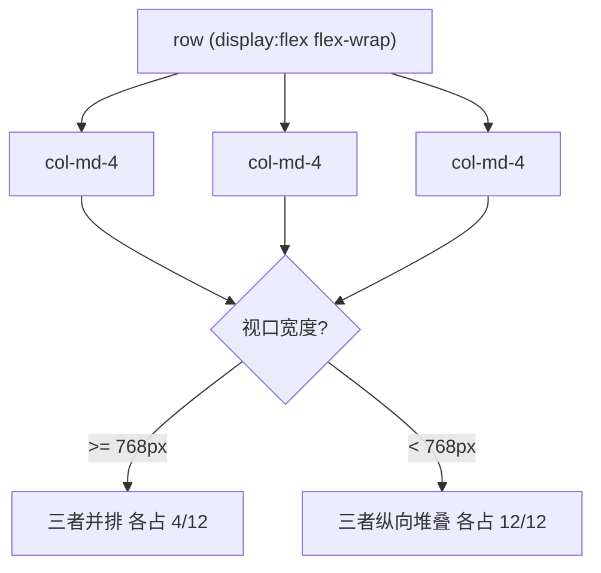

# Bootstrap5 基础

## 前言

如果说 Tailwind 是"给工具类让你自己搭"，Bootstrap 就是
"给你成品组件直接用"。它是史上最老牌、生态最庞大的 CSS 框架，
从 2011 年的 Twitter 内部项目一路走到今天。

本章讲清楚：

1. Bootstrap 的定位与 v5 的关键变化；
2. 三种安装方式（CDN / npm / Sass 源码定制）；
3. 容器与 12 列栅格系统，以及它与原生 Grid 布局的对应关系；
4. 排版类、间距工具类、语义色系统；
5. 实战：一个栅格居中的登录页。

前置知识：[[前端开发/01-基础/CSS/04-Grid布局|Grid 布局]]
（理解栅格底层）、[[前端开发/02-CSS框架/Tailwind-CSS/01-Tailwind基础|Tailwind 基础]]
（对照两种框架的哲学差异会更有体会）。

---

## 一、Bootstrap 的定位

### 1.1 它擅长什么

| 特点 | 说明 |
| --- | --- |
| 组件丰富开箱即用 | navbar/modal/table/form 全家桶，引一个 CSS 就能用 |
| 上手极快 | 不需要构建工具，复制粘贴文档示例就能跑 |
| 后台/原型首选 | 大量管理界面、内部工具、MVP 用它快速成型 |
| 生态成熟 | 主题市场、模板、问答积累都是最厚的 |

代价同样明显：默认样式辨识度极高（"一眼 Bootstrap"），
深度定制要动 Sass 变量或写覆盖 CSS；设计自由度低于 Tailwind。

### 1.2 v5 的关键变化（相对 v4）

- **移除 jQuery 依赖**：插件全部用原生 JS 重写，
  这是 v5 最大的架构变化；
- **RTL 支持**：官方支持从右到左语言（阿拉伯语等）；
- **CSS 变量化**：颜色等 token 同时暴露为 CSS 自定义属性,
  轻量定制不必重编译 Sass;
- **新增 Offcanvas** 侧滑抽屉、手风琴取代旧的 collapse 组合写法;
- 放弃 IE 支持，全面拥抱现代浏览器。

v4 与 v5 的详细差异与旧站维护策略见
[[前端开发/02-CSS框架/Bootstrap4/01-Bootstrap4快速参考|Bootstrap4 快速参考]]。

---

## 二、三种安装方式

### 2.1 CDN 引入（最快）

```html
<!DOCTYPE html>
<html lang="zh-CN">
<head>
  <meta charset="UTF-8" />
  <meta name="viewport" content="width=device-width, initial-scale=1.0" />
  <link href="https://cdn.jsdelivr.net/npm/bootstrap@5.3.3/dist/css/bootstrap.min.css"
        rel="stylesheet" />
</head>
<body>
  <div class="container">
    <h1 class="mt-4">Hello Bootstrap 5</h1>
    <button class="btn btn-primary">按钮</button>
  </div>
  <script src="https://cdn.jsdelivr.net/npm/bootstrap@5.3.3/dist/js/bootstrap.bundle.min.js">
  </script>
</body>
</html>
```

注意两点：

- CSS 与 JS 是两个文件；`bundle` 版已内置 Popper（下拉菜单定位依赖），
  一般无脑选 bundle；
- `viewport` meta 缺失会导致移动端媒体查询失效，务必保留。

### 2.2 npm 安装（工程化项目）

```bash
npm install bootstrap
```

```js
// 在入口文件引入(以 Vite/webpack 为例)
import 'bootstrap/dist/css/bootstrap.min.css';
import 'bootstrap/dist/js/bootstrap.bundle.min.js';
```

适合在 React/Vue 工程里使用 Bootstrap 样式层的场景。

### 2.3 Sass 源码定制（改主题的正路）

想改 `$primary` 这类设计变量时，必须从源码编译：

```bash
npm install -D sass bootstrap
```

```scss
// custom.scss —— 先覆盖变量, 再引入源码
$primary: #0969da;          // 覆盖品牌主色
$border-radius: .5rem;      // 全局圆角
$enable-negative-margins: true;

@import "bootstrap/scss/bootstrap";
```

```bash
sass custom.scss dist/custom.css
```

编译产物是"按你的变量重新生成的整套 Bootstrap"。
只想小改几个颜色的轻量方案见第四章的 CSS 变量覆盖法。

---

## 三、容器与栅格系统

### 3.1 容器三兄弟

```html
<div class="container">固定最大宽度, 随断点跳变居中</div>
<div class="container-fluid">始终 100% 宽</div>
<div class="container-md">md 及以上固定宽度, 以下全宽(断点容器)</div>
```

| 类 | 行为 |
| --- | --- |
| container | 各断点下取 `max-width: {540/720/960/1140/1320}px`, 居中 |
| container-fluid | 永远撑满父宽 |
| container-{sm/md/lg/xl/xxl} | 达到该断点前表现如 fluid, 之后如 container |

### 3.2 12 列栅格机制

栅格三层结构：`container > row > col-*`。一行切成 12 等份，
列通过占几份来定宽：

```html
<div class="container">
  <div class="row">
    <div class="col-md-8">主内容占 8/12</div>
    <div class="col-md-4">侧栏占 4/12</div>
  </div>
  <div class="row">
    <div class="col">均分, 三个 col 各占 1/3</div>
    <div class="col"></div>
    <div class="col"></div>
  </div>
</div>
```

规则要点：

- `row` 自带左右负 margin，抵消 `col` 的内边距（gutter 实现）;
- 不写数字的 `col` 表示自动均分剩余空间;
- 小于 md 断点时 `col-md-8` 回落为竖向堆叠（100% 宽），这就是响应式;



### 3.3 与原生 Grid 布局的对应

Bootstrap 栅格底层是 **flexbox**（不是 CSS Grid），但概念上与
[[前端开发/01-基础/CSS/04-Grid布局|Grid 布局]] 高度同构：

| 概念 | Bootstrap | 原生 CSS |
| --- | --- | --- |
| 网格容器 | .row | display: grid/flex |
| 列定义 | col-md-6 | grid-template-columns |
| 间距 | gx-/gy-/g-* | gap |
| 占位合并 | col-span 类似物: col-auto/偏移 | grid-column: span n |
| 对齐 | justify-content-*/align-items-* | 同名属性 |

理解了这层映射，Bootstrap 栅格就只是"预置好断点的模板"。

---

## 四、排版类速览

```html
<h1 class="display-1">超大展示标题(display-1 到 display-6)</h1>
<h2 class="display-4">营销页 hero 区常用</h2>

<p class="lead">lead 让段落字号增大行高变松, 用作导语。</p>
<p class="text-center text-muted">居中 + 弱化灰字。</p>
<p class="fw-bold fw-normal fw-light">字重系列(fw = font-weight)</p>
<p class="fs-3 fs-5">字号刻度(fs-1 最大 到 fs-6)</p>
<blockquote class="blockquote">引用块自带左边线与留白。</blockquote>
<p class="text-truncate" style="max-width:200px">超长文本省略号截断。</p>
```

排版类的设计思路与 Tailwind 一致——原子化工具类。
事实上 Bootstrap 从 v3 就开始铺这类工具类，Tailwind 把这条路走到了极致。

---

## 五、间距工具类

Bootstrap 与 Tailwind 采用**同一套尺度思想**：
基数乘以系数，全局统一。

| 类 | 值 | 说明 |
| --- | --- | --- |
| m-0 / p-0 | 0 | 清零 |
| m-1 / p-1 | 0.25rem | |
| m-2 / p-2 | 0.5rem | |
| m-3 / p-3 | 0.75rem | Bootstrap 默认最常用档 |
| m-4 / p-4 | 1.25rem | 注意与 Tailwind 不同 |
| m-5 / p-5 | 3rem | 最大常规档 |

方向语法完全同构：

```html
<div class="mt-3 mb-4 mx-auto px-3 py-5">方向前缀 + 数字档位</div>
<div class="m-n3">负 margin(n 前缀), 用于拉伸场景</div>
<div class="gap-3">grid/flex 子项间距(v5 新增)</div>
```

两框架差异只在具体数值表（Tailwind 每 0.25rem 一档无限延伸,
Bootstrap 只有 0-5 六档）。心智可以无缝迁移。

---

## 六、颜色系统：语义色

Bootstrap 定义了六个语义色 + 若干辅助灰：

| 类名后缀 | 语义 | 典型用途 |
| --- | --- | --- |
| primary | 品牌主色 | 主按钮、链接、选中态 |
| secondary | 次要灰 | 次级按钮 |
| success | 成功绿 | 成功提示、完成状态 |
| danger | 危险红 | 错误、删除操作 |
| warning | 警告黄 | 需要注意的状态 |
| info | 信息蓝青 | 中性提示 |
| light / dark | 浅/深 | 底色切换 |

语义色的价值在于**换肤友好**：页面里写的都是 `btn-primary`
而不是 `btn-blue`，将来把 primary 从蓝改成紫，全站一键生效。
这套语义命名被后来所有 UI 库继承（含 Element/Ant Design 的
type 属性设计）。

```html
<button class="btn btn-primary">主要</button>
<button class="btn btn-outline-danger">描边危险按钮(outline 系列)</button>
<span class="badge bg-success">状态徽章</span>
<div class="alert alert-warning">警告提示条</div>
<p class="text-primary">彩色文字(text-bg-border 三系前缀)</p>
```

---

## 七、实战：登录页

综合运用容器、栅格居中、表单组件与语义色。单文件可运行：

```html
<!DOCTYPE html>
<html lang="zh-CN">
<head>
<meta charset="UTF-8" />
<meta name="viewport" content="width=device-width, initial-scale=1.0" />
<title>登录 - RootStack</title>
<link href="https://cdn.jsdelivr.net/npm/bootstrap@5.3.3/dist/css/bootstrap.min.css"
      rel="stylesheet" />
<style>
  body { min-height: 100vh; background: #f5f7fb; }
</style>
</head>
<body class="d-flex align-items-center">

<!-- 栅格居中: 外层 row justify-content-center -->
<div class="container">
  <div class="row justify-content-center">
    <div class="col-12 col-sm-10 col-md-7 col-lg-5">

      <div class="card shadow-sm border-0 rounded-4 mt-5">
        <div class="card-body p-4 p-md-5">
          <h1 class="h4 fw-bold text-center mb-1">欢迎回来</h1>
          <p class="text-center text-muted small mb-4">
            登录 RootStack 继续你的学习
          </p>

          <form>
            <div class="mb-3">
              <label for="email" class="form-label small fw-medium">邮箱</label>
              <input type="email" class="form-control form-control-lg"
                     id="email" placeholder="you@example.com" required />
            </div>
            <div class="mb-3">
              <div class="d-flex justify-content-between align-items-center">
                <label for="password" class="form-label small fw-medium">密码</label>
                <a href="#" class="small text-decoration-none">忘记密码?</a>
              </div>
              <input type="password" class="form-control form-control-lg"
                     id="password" placeholder="至少 8 位字符" required />
            </div>
            <div class="form-check mb-4">
              <input class="form-check-input" type="checkbox" id="remember" />
              <label class="form-check-label small" for="remember">记住我</label>
            </div>
            <button type="submit" class="btn btn-primary w-100 btn-lg">
              登 录
            </button>
          </form>

          <hr class="my-4" />

          <p class="text-center text-muted small mb-0">
            还没有账号? <a href="#" class="text-decoration-none">立即注册</a>
          </p>
        </div>
      </div>

      <p class="text-center text-muted small mt-4">© 2026 RootStack</p>
    </div>
  </div>
</div>

<script src="https://cdn.jsdelivr.net/npm/bootstrap@5.3.3/dist/js/bootstrap.bundle.min.js">
</script>
</body>
</html>
```

设计决策逐条复盘：

- **垂直居中**：`body` 设 `min-height:100vh` 后加 `d-flex align-items-center`，
  比 margin 技巧更稳；
- **水平居中 + 宽度控制**：`row justify-content-center` 配合响应式列
  `col-12 col-sm-10 col-md-7 col-lg-5`——手机全宽、大屏收窄到 5/12，
  这是 Bootstrap 处理"限宽居中卡片"的标准姿势；
- 表单控件用 `form-control` 统一外观，`form-check` 处理复选框对齐；
- `w-100 btn-lg` 让按钮充满卡片宽度，提升主行动的视觉权重。

---

## 本章小结

- Bootstrap 定位是组件库而非工具集：开箱即用、后台与原型首选；
- v5 移除 jQuery、新增 RTL 与 Offcanvas、放弃 IE；
- 安装三选一：CDN 最快、npm 进工程、Sass 源码定制主题；
- 栅格 = container/row/col 三层，12 等份 + 断点前缀实现响应式堆叠；
- 间距类与 Tailwind 同构不同值；语义色系统让换肤只改变量。

下一章过一遍高频组件：
[[前端开发/02-CSS框架/Bootstrap5/02-组件与网格|Bootstrap5 组件与网格]]。
