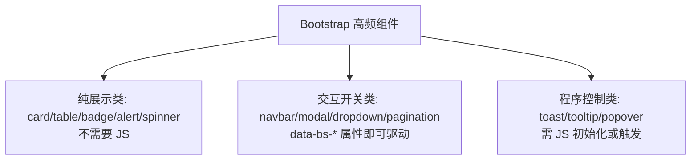

# Bootstrap5 组件与网格

## 前言

Bootstrap 的核心竞争力在组件库。本章把高频组件逐一给出**最小可运行示例**，
并讲清两种驱动方式（data 属性 vs JS 初始化）；随后深入栅格的进阶玩法
（gutter、嵌套、偏移、排序），最后速查工具类全家桶。
实战部分用这些积木拼一个商品列表页。

前置阅读：[[前端开发/02-CSS框架/Bootstrap5/01-Bootstrap5基础|Bootstrap5 基础]]。

---

## 一、高频组件最小示例

先看一张总览图，明确每个组件在本章的位置：



以下每个片段假设已引入 Bootstrap CSS；涉及交互的组件
还需引入 bundle JS。统一骨架：

```html
<!DOCTYPE html>
<html lang="zh-CN">
<head>
  <meta charset="UTF-8" />
  <meta name="viewport" content="width=device-width, initial-scale=1.0" />
  <link href="https://cdn.jsdelivr.net/npm/bootstrap@5.3.3/dist/css/bootstrap.min.css"
        rel="stylesheet" />
</head>
<body class="container py-4">
  <!-- 本章示例放这里 -->
  <script src="https://cdn.jsdelivr.net/npm/bootstrap@5.3.3/dist/js/bootstrap.bundle.min.js">
  </script>
</body>
</html>
```

### 1.1 navbar 导航栏

```html
<nav class="navbar navbar-expand-lg bg-body-tertiary">
  <div class="container-fluid">
    <a class="navbar-brand" href="#">RootStack</a>
    <!-- 折叠汉堡: 小屏显示, 点击展开 collapse 目标 -->
    <button class="navbar-toggler" type="button"
            data-bs-toggle="collapse" data-bs-target="#mainNav">
      <span class="navbar-toggler-icon"></span>
    </button>
    <div class="collapse navbar-collapse" id="mainNav">
      <ul class="navbar-nav me-auto">
        <li class="nav-item"><a class="nav-link active" href="#">首页</a></li>
        <li class="nav-item"><a class="nav-link" href="#">文档</a></li>
      </ul>
      <form class="d-flex">
        <input class="form-control me-2" type="search" placeholder="搜索" />
        <button class="btn btn-outline-primary" type="submit">搜</button>
      </form>
    </div>
  </div>
</nav>
```

`navbar-expand-lg`：lg 及以上横排，以下折叠成汉堡。
`data-bs-*` 属性声明式驱动，无需写一行 JS。

### 1.2 card 卡片组

```html
<div class="row row-cols-1 row-cols-md-3 g-4">
  <div class="col">
    <div class="card h-100">
      
      <div class="card-body">
        <h5 class="card-title">卡片标题</h5>
        <p class="card-text text-muted small">摘要文字。</p>
      </div>
      <div class="card-footer bg-transparent">
        <a href="#" class="btn btn-sm btn-primary">查看</a>
      </div>
    </div>
  </div>
  <!-- 其余 col 结构相同 -->
</div>
```

`h-100` 让不等高内容的三张卡等高对齐——与 Tailwind 章节的 flex-1 手法异曲同工。

### 1.3 badge 与 alert

```html
<h5>收件箱 <span class="badge text-bg-primary">9</span></h5>

<span class="badge text-bg-success">已完成</span>
<span class="badge rounded-pill text-bg-warning">进行中(胶囊形)</span>

<div class="alert alert-warning alert-dismissible fade show" role="alert">
  存储空间即将用尽，请及时清理。
  <button type="button" class="btn-close" data-bs-dismiss="alert"></button>
</div>
```

alert 自带关闭按钮支持：`btn-close` + `data-bs-dismiss` 即可，
`fade show` 提供淡出过渡。

### 1.4 button 按钮系

```html
<button class="btn btn-primary">主要</button>
<button class="btn btn-secondary">次要</button>
<button class="btn btn-success">成功</button>
<button class="btn btn-danger">危险</button>
<button class="btn btn-outline-primary">描边主色</button>
<button class="btn btn-link">链接样式</button>

<button class="btn btn-primary btn-lg">大按钮</button>
<button class="btn btn-primary btn-sm">小按钮</button>
<button class="btn btn-primary" disabled>禁用</button>

<!-- 按钮组 -->
<div class="btn-group" role="group">
  <button class="btn btn-outline-secondary">日</button>
  <button class="btn btn-outline-secondary active">周</button>
  <button class="btn btn-outline-secondary">月</button>
</div>
```

### 1.5 table 表格

```html
<table class="table table-hover table-striped align-middle">
  <thead class="table-dark">
    <tr><th>商品</th><th>价格</th><th>状态</th></tr>
  </thead>
  <tbody>
    <tr><td>键盘</td><td>¥299</td><td><span class="badge text-bg-success">有货</span></td></tr>
    <tr><td>鼠标</td><td>¥129</td><td><span class="badge text-bg-warning">补货中</span></td></tr>
  </tbody>
</table>

<table class="table table-dark table-bordered mt-4">
  <tr><td>深色表格(table-dark 直接挂 table 上)</td></tr>
</table>
```

修饰类可自由叠加：`table-striped`(斑马纹)、`table-hover`(悬停高亮)、
`table-bordered`(全边框)、`table-sm`(紧凑行高)。

### 1.6 pagination 分页

```html
<nav>
  <ul class="pagination justify-content-center">
    <li class="page-item disabled"><a class="page-link" href="#">上一页</a></li>
    <li class="page-item active"><a class="page-link" href="#">1</a></li>
    <li class="page-item"><a class="page-link" href="#">2</a></li>
    <li class="page-item"><a class="page-link" href="#">下一页</a></li>
  </ul>
</nav>
```

### 1.7 modal 模态框（属性驱动）

```html
<!-- 触发器: data-bs-toggle + data-bs-target 指向模态框 id -->
<button class="btn btn-danger" data-bs-toggle="modal" data-bs-target="#confirmModal">
  删除数据
</button>

<div class="modal fade" id="confirmModal" tabindex="-1">
  <div class="modal-dialog modal-dialog-centered">
    <div class="modal-content">
      <div class="modal-header">
        <h5 class="modal-title">确认删除</h5>
        <button type="button" class="btn-close" data-bs-dismiss="modal"></button>
      </div>
      <div class="modal-body">删除后不可恢复，确定继续吗？</div>
      <div class="modal-footer">
        <button class="btn btn-secondary" data-bs-dismiss="modal">取消</button>
        <button class="btn btn-danger" data-bs-dismiss="modal">确认删除</button>
      </div>
    </div>
  </div>
</div>
```

结构固定三层 `modal > modal-dialog > modal-content`；
`fade` 开启过渡，`modal-dialog-centered` 垂直居中。

### 1.8 dropdown 下拉菜单

```html
<div class="dropdown">
  <button class="btn btn-secondary dropdown-toggle"
          data-bs-toggle="dropdown">操作</button>
  <ul class="dropdown-menu">
    <li><a class="dropdown-item" href="#">编辑</a></li>
    <li><a class="dropdown-item" href="#">复制</a></li>
    <li><hr class="dropdown-divider" /></li>
    <li><a class="dropdown-item text-danger" href="#">删除</a></li>
  </ul>
</div>
```

### 1.9 toast 轻提示

```html
<div class="toast-container position-fixed bottom-0 end-0 p-3">
  <div class="toast" id="saveToast">
    <div class="toast-header">
      <strong class="me-auto">系统提示</strong>
      <button type="button" class="btn-close" data-bs-dismiss="toast"></button>
    </div>
    <div class="toast-body">保存成功！</div>
  </div>
</div>

<button class="btn btn-primary" onclick="new bootstrap.Toast('#saveToast').show()">
  触发 toast
</button>
```

toast 必须用 JS 触发（没有触发它的 data 属性），是理解
"组件属性驱动 vs JS 初始化"差异的好例子。

### 1.10 spinner 加载

```html
<div class="spinner-border text-primary" role="status">
  <span class="visually-hidden">加载中...</span>
</div>
<div class="spinner-grow text-success ms-3" role="status"></div>

<!-- 按钮 loading 态组合 -->
<button class="btn btn-primary" disabled>
  <span class="spinner-border spinner-border-sm me-2"></span>提交中...
</button>
```

### 1.11 两种驱动方式的判断法则

| 方式 | 适用 | 示例 |
| --- | --- | --- |
| data 属性声明式 | 简单开关型交互 | modal/dropdown/collapse/toast 关闭 |
| JS 初始化 / API 调用 | 需要程序控制时序 | 校验后再弹窗、延时消失的 toast |

```js
// JS 方式等价写法: 构造实例后调用方法
var modal = new bootstrap.Modal(document.getElementById('confirmModal'));
modal.show();
modal.hide();
```

---

## 二、栅格进阶

### 2.1 gutter 控制

```html
<div class="row g-0">完全无间距贴合</div>
<div class="row g-3">行列间距统一 1rem</div>
<div class="row gx-5 gy-2">横向大间距, 纵向小间距</div>
```

gutter 本质是给 col 加左右 padding、给 row 加左右负 margin 的成对实现,
所以 gutter 变化不会破坏外层容器对齐。

### 2.2 嵌套

```html
<div class="row">
  <div class="col-md-8">
    主区
    <div class="row">
      <div class="col-6">嵌套子列可以重新切分 12 份</div>
      <div class="col-6">与父列宽度无关</div>
    </div>
  </div>
  <div class="col-md-4">侧栏</div>
</div>
```

### 2.3 列偏移与排序

```html
<!-- offset: 左侧空出 3/12, 实现"居中偏右"布局 -->
<div class="row">
  <div class="col-md-6 offset-md-3">表单常用: 占一半宽且居中</div>
</div>

<!-- order: 控制视觉顺序, 移动端把侧栏排到正文之后 -->
<div class="row">
  <div class="col-md-3 order-md-2">侧栏(桌面在右)</div>
  <div class="col-md-9 order-md-1">正文(桌面在左)</div>
  <!-- 移动端 DOM 顺序不变, 桌面端靠 order 交换位置 -->
</div>
```

offset 与 order 是纯 CSS 时代难以优雅解决的问题，
Bootstrap 用工具类把它们变成了两个单词的事。

---

## 三、工具类全家桶速查

| 类别 | 常用类 | 说明 |
| --- | --- | --- |
| 边框 | border, border-0, border-top, rounded, rounded-circle, rounded-pill | 方向可细分 |
| 边框色 | border-primary, border-danger | 配合语义色 |
| 阴影 | shadow-none / shadow-sm / shadow / shadow-lg | 四档 |
| 尺寸 | w-25 w-50 w-75 w-100, h-100 | 百分比档位 |
| 显示 | d-none, d-block, d-flex, d-inline, d-{sm/md/lg}-none | 响应式显隐神器 |
| 定位 | position-relative / absolute / fixed-top / fixed-bottom / sticky-top | fixed-top 常配导航 |
| 可见性 | visible / invisible | 占位隐藏(d-none 是不占位) |
| 文本 | text-start / center / end, text-wrap, text-break | 对齐与换行 |
| 浮层 | top-50 start-50 translate-middle | 绝对居中组合 |

响应式显隐的组合拳值得单独记：

```html
<div class="d-none d-md-block">仅 md 以上显示(桌面广告位)</div>
<div class="d-md-none">仅 md 以下显示(移动端下载条)</div>
```

---

## 四、实战：商品列表页

组合卡片网格 + 筛选栏 + 模态详情。单文件可运行：

```html
<!DOCTYPE html>
<html lang="zh-CN">
<head>
<meta charset="UTF-8" />
<meta name="viewport" content="width=device-width, initial-scale=1.0" />
<title>商品列表 - RootStack 商城</title>
<link href="https://cdn.jsdelivr.net/npm/bootstrap@5.3.3/dist/css/bootstrap.min.css"
      rel="stylesheet" />
</head>
<body class="bg-light">

<nav class="navbar bg-white border-bottom sticky-top">
  <div class="container">
    <span class="navbar-brand fw-bold">RootStack 商城</span>
  </div>
</nav>

<div class="container py-4">

  <!-- 筛选栏: 按钮组 + 搜索框两端分布 -->
  <div class="d-flex flex-wrap gap-2 justify-content-between mb-4">
    <div class="btn-group" role="group">
      <button class="btn btn-outline-secondary active">全部</button>
      <button class="btn btn-outline-secondary">键盘</button>
      <button class="btn btn-outline-secondary">鼠标</button>
      <button class="btn btn-outline-secondary">显示器</button>
    </div>
    <input class="form-control w-auto" type="search" placeholder="搜索商品" />
  </div>

  <!-- 商品网格 -->
  <div class="row row-cols-1 row-cols-sm-2 row-cols-lg-4 g-4">

    <div class="col">
      <div class="card h-100 shadow-sm border-0">
        
        <div class="card-body">
          <h6 class="card-title mb-1">机械键盘 K87</h6>
          <p class="text-muted small mb-2">Gasket 结构 三模连接</p>
          <div class="d-flex justify-content-between align-items-center">
            <span class="fw-bold text-danger">¥299</span>
            <span class="badge text-bg-success">现货</span>
          </div>
        </div>
        <div class="card-footer bg-transparent border-0 pt-0">
          <button class="btn btn-primary btn-sm w-100"
                  data-bs-toggle="modal" data-bs-target="#goodsModal">
            查看详情
          </button>
        </div>
      </div>
    </div>

    <div class="col">
      <div class="card h-100 shadow-sm border-0">
        
        <div class="card-body">
          <h6 class="card-title mb-1">无线鼠标 M3</h6>
          <p class="text-muted small mb-2">轻量化设计 8000 DPI</p>
          <div class="d-flex justify-content-between align-items-center">
            <span class="fw-bold text-danger">¥129</span>
            <span class="badge text-bg-warning">补货中</span>
          </div>
        </div>
        <div class="card-footer bg-transparent border-0 pt-0">
          <button class="btn btn-primary btn-sm w-100" disabled>暂时缺货</button>
        </div>
      </div>
    </div>

    <div class="col">
      <!-- 结构同上: 4K 显示器 27 寸 / ¥1,899 -->
    </div>

    <div class="col">
      <!-- 结构同上: 人体工学椅 E1 / ¥999 -->
    </div>

  </div>

  <!-- 分页 -->
  <nav class="mt-4">
    <ul class="pagination justify-content-center mb-0">
      <li class="page-item disabled"><a class="page-link" href="#">上一页</a></li>
      <li class="page-item active"><a class="page-link" href="#">1</a></li>
      <li class="page-item"><a class="page-link" href="#">2</a></li>
      <li class="page-item"><a class="page-link" href="#">3</a></li>
      <li class="page-item"><a class="page-link" href="#">下一页</a></li>
    </ul>
  </nav>
</div>

<!-- 商品详情模态框 -->
<div class="modal fade" id="goodsModal" tabindex="-1">
  <div class="modal-dialog modal-dialog-centered">
    <div class="modal-content">
      <div class="modal-header">
        <h5 class="modal-title">商品详情</h5>
        <button type="button" class="btn-close" data-bs-dismiss="modal"></button>
      </div>
      <div class="modal-body">
        
        <p class="small text-muted">这里展示商品的长描述、规格参数与配送信息。
          实际项目中由接口按商品 id 动态填充。</p>
        <p class="h4 text-danger fw-bold">¥299 <small class="text-muted fs-6">起</small></p>
      </div>
      <div class="modal-footer">
        <button class="btn btn-secondary" data-bs-dismiss="modal">继续逛逛</button>
        <button class="btn btn-primary" data-bs-dismiss="modal">加入购物车</button>
      </div>
    </div>
  </div>
</div>

<script src="https://cdn.jsdelivr.net/npm/bootstrap@5.3.3/dist/js/bootstrap.bundle.min.js">
</script>
</body>
</html>
```

要点复盘：

- 网格断点 `row-cols-1 row-cols-sm-2 row-cols-lg-4` 一行搞定四档响应式，
  是 `row-cols-*` 相比逐 col 写 `col-12 col-sm-6 col-lg-3` 更简洁的场合；
- 卡片内部价格与徽章用 `d-flex justify-content-between` 两端对齐；
- 详情模态框被多个触发器共享：所有 `data-bs-target="#goodsModal"`
  都能打开同一个框，真实项目再监听事件把对应商品数据填进去。

---

## 本章小结

- 十个高频组件各有固定结构套路，多数可用 data-bs-* 属性零 JS 驱动；
- toast/spinner 类需要 JS 初始化，判断标准是"是否需要程序控制时序"；
- 栅格进阶四件套：gutter(g-/gx-/gy-)、嵌套、offset-*、order-*；
- 工具类速查重点：d-* 响应式显隐、shadow 四档、fixed-top/sticky-top。

下一章深入 v5 的原生 JS 插件体系：
[[前端开发/02-CSS框架/Bootstrap5/03-JS插件|Bootstrap5 JS 插件]]。
