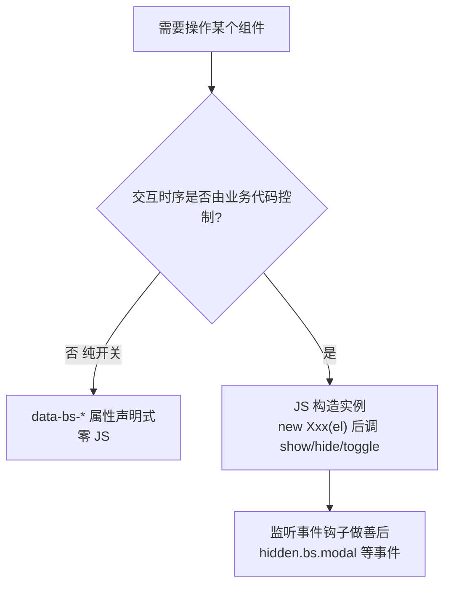

# Bootstrap5 JS 插件

## 前言

上一章的组件多数靠 `data-bs-*` 属性就能跑，但当交互需要**程序控制时序**
（校验通过再弹窗、关闭后清理表单、滚动到某区高亮导航）时，就必须掌握
JS 插件层。本章讲 v5 无 jQuery 的插件架构、核心插件（Modal / Offcanvas /
Collapse / Tooltip&Popover / Carousel / Scrollspy）与表单验证的原生集成，
实战部分组合五种插件做一个仪表盘页。

前置阅读：[[前端开发/02-CSS框架/Bootstrap5/02-组件与网格|组件与网格]]。

---

## 一、v5 插件架构总览

### 1.1 无 jQuery 之后怎么引

v4 时代写 `$('#modal').modal('show')`；v5 全部换成构造函数模式：

```js
// 按需引入单个插件(tree-shaking 友好)
import Modal from 'bootstrap/js/dist/modal';
import Dropdown from 'bootstrap/js/dist/dropdown';

const modal = new Modal(document.getElementById('myModal'));
modal.show();

// 或整包引入(自带所有插件 + 自动初始化 data-bs-* 组件)
import * as bootstrap from 'bootstrap';
```

非打包项目直接用 bundle 文件即可，效果等同整包引入：

```html
<script src="https://cdn.jsdelivr.net/npm/bootstrap@5.3.3/dist/js/bootstrap.bundle.min.js">
</script>
```

### 1.2 两种用法的分工



每个插件的通用 API 形状高度一致：`new Xxx(el)` 构造、
`show()/hide()/toggle()` 方法、`show.bs.xxx / shown.bs.xxx /
hide.bs.xxx / hidden.bs.xxx` 四个事件（`bs.` 前缀前是进行时态,
之后是完成时态）。

---

## 二、Modal 完整控制

模态框是插件模式的教科书案例，完整走一遍生命周期管理：

```html
<button class="btn btn-primary" id="openBtn">新建文章</button>

<div class="modal fade" id="editorModal" tabindex="-1">
  <div class="modal-dialog modal-dialog-centered">
    <div class="modal-content">
      <div class="modal-header">
        <h5 class="modal-title">新建文章</h5>
        <button type="button" class="btn-close" data-bs-dismiss="modal"></button>
      </div>
      <div class="modal-body">
        <form id="editorForm">
          <input class="form-control mb-3" name="title" placeholder="标题" required />
          <textarea class="form-control" name="body" rows="4"
                    placeholder="正文" required></textarea>
        </form>
        <div id="editorMsg" class="alert alert-danger d-none mt-3 small"></div>
      </div>
      <div class="modal-footer">
        <button class="btn btn-secondary" data-bs-dismiss="modal">取消</button>
        <button class="btn btn-primary" id="saveBtn">保存</button>
      </div>
    </div>
  </div>
</div>

<script src="https://cdn.jsdelivr.net/npm/bootstrap@5.3.3/dist/js/bootstrap.bundle.min.js"></script>
<script>
  var modalEl = document.getElementById('editorModal');
  var modal = new bootstrap.Modal(modalEl);
  var form = document.getElementById('editorForm');
  var msg = document.getElementById('editorMsg');

  // 打开: 业务代码决定何时弹
  document.getElementById('openBtn').addEventListener('click', function () {
    form.reset();
    msg.classList.add('d-none');
    modal.show();
  });

  // 保存: 先校验, 失败留在弹窗里提示, 成功才关闭
  document.getElementById('saveBtn').addEventListener('click', function () {
    if (!form.reportValidity()) { return; }
    if (form.title.value.trim().length < 2) {
      msg.textContent = '标题至少 2 个字符';
      msg.classList.remove('d-none');
      return;
    }
    modal.hide();
  });

  // 关闭后清理: hidden.bs.modal 在动画完全结束后触发
  modalEl.addEventListener('hidden.bs.modal', function () {
    form.reset();
    msg.classList.add('d-none');
  });
</script>
```

关键知识点：

- **事件名带 bs.**：`hidden.bs.modal` 是 Bootstrap 自定义事件，
  防止与原生事件冲突；
- 用 `hidden.*` 而不是 `hide.*` 做清理：前者等淡出动画播完,
  否则用户会看见表单内容在动画中突然消失；
- `data-bs-dismiss` 的取消按钮与 JS 的 `modal.hide()` 可以并存，
  两条路径都会触发同一组事件钩子——这是属性驱动与 JS 驱动混用的正确姿势。

---

## 三、Offcanvas 侧滑抽屉

v5 新增组件，移动端菜单的标准答案（以前要用 hack 手段实现）：

```html
<button class="btn btn-primary" data-bs-toggle="offcanvas"
        data-bs-target="#mobileNav">打开菜单</button>

<div class="offcanvas offcanvas-start" tabindex="-1" id="mobileNav">
  <!-- offcanvas-start 左滑出 / -end 右滑出 / -top / -bottom -->
  <div class="offcanvas-header">
    <h5 class="offcanvas-title">导航菜单</h5>
    <button type="button" class="btn-close" data-bs-dismiss="offcanvas"></button>
  </div>
  <div class="offcanvas-body">
    <ul class="nav flex-column">
      <li class="nav-item"><a class="nav-link" href="#">首页</a></li>
      <li class="nav-item"><a class="nav-link" href="#">订单</a></li>
    </ul>
  </div>
</div>
```

Offcanvas 打开时自动附带遮罩、锁定页面滚动、支持 Esc 关闭——
这些细节自己手写很容易漏，这正是组件库的价值。---

## 四、Collapse 手风琴

Collapse 是折叠显隐的底层引擎（navbar 折叠也基于它）；
配合 accordion 结构就是手风琴：

```html
<div class="accordion" id="faq">
  <div class="accordion-item">
    <h2 class="accordion-header">
      <button class="accordion-button" data-bs-toggle="collapse"
              data-bs-target="#q1">
        如何退款?
      </button>
    </h2>
    <div id="q1" class="accordion-collapse collapse show"
         data-bs-parent="#faq">
      <div class="accordion-body">在订单页点击申请退款即可。</div>
    </div>
  </div>

  <!-- 更多 accordion-item 结构相同, 省略 -->
</div>
```

要点：`data-bs-parent` 让同组条目互斥展开；默认展开项要同时加
`collapse show` 和按钮去掉 `collapsed` 类，两处必须同步否则样式错乱。

---

## 五、Tooltip 与 Popover

**这两个组件不会自动初始化，必须手动 JS 初始化——新手最常踩的坑！**

```html
<button class="btn btn-secondary" data-bs-toggle="tooltip"
        title="这是提示气泡">悬停看我</button>

<button class="btn btn-primary" data-bs-toggle="popover"
        data-bs-title="富提示"
        data-bs-content="Popover 比 Tooltip 多一个标题栏, 内容也更长。">
        点击看我</button>

<script>
  // 一行收集页面所有 tooltip/popover 并初始化
  document.querySelectorAll('[data-bs-toggle="tooltip"]').forEach(function (el) {
    new bootstrap.Tooltip(el);
  });
  document.querySelectorAll('[data-bs-toggle="popover"]').forEach(function (el) {
    new bootstrap.Popover(el);
  });
</script>
```

为什么这样设计？tooltip 数量可能极多，自动扫描全页会拖慢初始化，
官方把选择权交给开发者。记住口诀：**modal/dropdown 声明即用，
tooltip/popover 必须手动 new**。动态插入 DOM 的元素也要重新初始化。

---

## 六、Carousel 轮播

```html
<div id="heroCarousel" class="carousel slide" data-bs-ride="carousel">
  <div class="carousel-indicators">
    <button type="button" data-bs-target="#heroCarousel" data-bs-slide-to="0"
            class="active"></button>
    <button type="button" data-bs-target="#heroCarousel" data-bs-slide-to="1"></button>
  </div>

  <div class="carousel-inner">
    <div class="carousel-item active">
      
      <div class="carousel-caption d-none d-md-block"><h5>第一屏标语</h5></div>
    </div>
    <div class="carousel-item">
      
      <div class="carousel-caption d-none d-md-block"><h5>第二屏标语</h5></div>
    </div>
  </div>

  <button class="carousel-control-prev" type="button"
          data-bs-target="#heroCarousel" data-bs-slide="prev">
    <span class="carousel-control-prev-icon"></span>
  </button>
  <button class="carousel-control-next" type="button"
          data-bs-target="#heroCarousel" data-bs-slide="next">
    <span class="carousel-control-next-icon"></span>
  </button>
</div>
```

`data-bs-ride="carousel"` 开启自动播放；圆点与左右箭头全靠 data 属性驱动，
只有调参（如播放间隔）时才需要 JS 实例：
`new bootstrap.Carousel('#heroCarousel', { interval: 4000 })`。

---

## 七、Scrollspy 滚动高亮导航

长页面文档站的标配：滚动到哪一节，对应导航项自动点亮。

```html
<body data-bs-spy="scroll" data-bs-target="#docNav" data-bs-offset="100">

<div class="container">
  <div class="row">
    <nav class="col-md-3" id="docNav">
      <ul class="nav flex-column sticky-top pt-4">
        <li class="nav-item"><a class="nav-link" href="#intro">简介</a></li>
        <li class="nav-item"><a class="nav-link" href="#usage">用法</a></li>
      </ul>
    </nav>
    <main class="col-md-9">
      <section id="intro" style="min-height:600px"><h2>简介</h2></section>
      <section id="usage" style="min-height:600px"><h2>用法</h2></section>
    </main>
  </div>
</div>
```

三个条件缺一不可：监听容器（通常是 body）上的
`data-bs-spy="scroll"`、指向导航的 `data-bs-target`、
导航链接 href 与区块 id 一一对应。

---

## 八、表单验证：原生校验 API 集成

Bootstrap 不造轮子，直接包装浏览器原生 Constraint Validation：

```html
<form class="row g-3 needs-validation" novalidate>
  <div class="col-md-6">
    <label class="form-label">用户名</label>
    <input type="text" class="form-control" pattern="[a-zA-Z0-9_]{3,16}"
           required />
    <div class="invalid-feedback">3-16 位字母数字下划线</div>
  </div>
  <div class="col-md-6">
    <label class="form-label">邮箱</label>
    <input type="email" class="form-control" required />
    <div class="invalid-feedback">请输入合法邮箱</div>
  </div>
  <div class="col-12">
    <button class="btn btn-primary" type="submit">注册</button>
  </div>
</form>

<script>
  // Bootstrap 官方推荐脚本: 提交时整体切换 was-validated
  document.querySelectorAll('.needs-validation').forEach(function (form) {
    form.addEventListener('submit', function (event) {
      if (!form.checkValidity()) {
        event.preventDefault();
        event.stopPropagation();
      }
      form.classList.add('was-validated');
    });
  });
</script>
```

机制拆解：规则写在 HTML 上（`required`、`type=email`、`pattern` 等
原生校验属性）；平时浏览器不弹框（`novalidate` 关掉默认气泡）；提交时
给 form 加 `was-validated` 类，CSS 依据控件的 `:valid` / `:invalid`
伪类显示绿勾红字。服务端校验依然不可省略，前端验证只改善体验。

---

## 九、实战：仪表盘页组合五种插件

单文件演示：Offcanvas 移动菜单 + Modal 编辑 + Tooltip + Toast 反馈 +
Accordion 帮助面板。

```html
<!DOCTYPE html>
<html lang="zh-CN">
<head>
<meta charset="UTF-8" />
<meta name="viewport" content="width=device-width, initial-scale=1.0" />
<title>仪表盘 - 插件组合实战</title>
<link href="https://cdn.jsdelivr.net/npm/bootstrap@5.3.3/dist/css/bootstrap.min.css"
      rel="stylesheet" />
</head>
<body class="bg-light">

<nav class="navbar bg-white border-bottom">
  <div class="container-fluid">
    <div class="d-flex align-items-center gap-2">
      <!-- 插件一: Offcanvas 移动端菜单 -->
      <button class="btn btn-outline-secondary d-lg-none"
              data-bs-toggle="offcanvas" data-bs-target="#sideNav">菜单</button>
      <span class="navbar-brand mb-0 fw-bold">RootStack 仪表盘</span>
    </div>
    <button class="btn btn-primary" data-bs-toggle="modal"
            data-bs-target="#taskModal">新建任务</button>
  </div>
</nav>

<!-- Offcanvas 抽屉本体 -->
<div class="offcanvas offcanvas-start" tabindex="-1" id="sideNav">
  <div class="offcanvas-header border-bottom">
    <h5 class="offcanvas-title">导航</h5>
    <button type="button" class="btn-close" data-bs-dismiss="offcanvas"></button>
  </div>
  <div class="offcanvas-body">
    <ul class="nav flex-column">
      <li class="nav-item"><a class="nav-link active" href="#">概览</a></li>
      <li class="nav-item"><a class="nav-link" href="#">任务</a></li>
    </ul>
  </div>
</div>

<main class="container py-4">
  <div class="row g-4">

<main class="container py-4">
  <div class="row g-4">

    <div class="col-lg-8">
      <!-- 任务表格, 操作列挂 tooltip 与编辑弹窗 -->
      <div class="card shadow-sm border-0">
        <div class="table-responsive">
          <table class="table table-hover align-middle mb-0">
            <thead class="table-light">
              <tr><th>任务</th><th>状态</th><th>操作</th></tr>
            </thead>
            <tbody>
              <tr>
                <td>整理八月数据
                  <span class="badge text-bg-secondary" data-bs-toggle="tooltip"
                        title="已同步至报表系统">?</span>
                </td>
                <td><span class="badge text-bg-success">已完成</span></td>
                <td><button class="btn btn-sm btn-outline-primary"
                    data-bs-toggle="modal" data-bs-target="#taskModal">编辑</button></td>
              </tr>
              <tr>
                <td>发布新版本</td>
                <td><span class="badge text-bg-warning">进行中</span></td>
                <td><button class="btn btn-sm btn-outline-primary"
                    data-bs-toggle="modal" data-bs-target="#taskModal">编辑</button></td>
              </tr>
            </tbody>
          </table>
        </div>
      </div>

      <!-- 插件三: Accordion 帮助区 -->
      <div class="accordion mt-4" id="help">
        <div class="accordion-item">
          <h2 class="accordion-header">
            <button class="accordion-button collapsed" data-bs-toggle="collapse"
                    data-bs-target="#helpOne">如何导出报表?</button>
          </h2>
          <div id="helpOne" class="accordion-collapse collapse" data-bs-parent="#help">
            <div class="accordion-body small">在报表页右上角选择导出格式。</div>
          </div>
        </div>
        <!-- 更多条目结构相同, 省略 -->
      </div>
    </div>

  </div>
</main>

<!-- 插件四: Modal 编辑弹窗(JS 控制提交时序) -->
<div class="modal fade" id="taskModal" tabindex="-1">
  <div class="modal-dialog modal-dialog-centered">
    <div class="modal-content">
      <form id="taskForm" novalidate>
        <div class="modal-header">
          <h5 class="modal-title">任务信息</h5>
          <button type="button" class="btn-close" data-bs-dismiss="modal"></button>
        </div>
        <div class="modal-body">
          <input class="form-control mb-3" placeholder="任务名称" required />
          <select class="form-select">
            <option>未开始</option><option>进行中</option><option>已完成</option>
          </select>
        </div>
        <div class="modal-footer">
          <button type="button" class="btn btn-secondary"
                  data-bs-dismiss="modal">取消</button>
          <button type="submit" class="btn btn-primary">保存</button>
        </div>
      </form>
    </div>
  </div>
</div>

<!-- 插件五: Toast 保存成功反馈 -->
<div class="toast-container position-fixed bottom-0 end-0 p-3">
  <div class="toast align-items-center text-bg-success border-0" id="okToast">
    <div class="d-flex">
      <div class="toast-body">保存成功</div>
      <button type="button" class="btn-close btn-close-white me-2 m-auto"
              data-bs-dismiss="toast"></button>
    </div>
  </div>
</div>

<script src="https://cdn.jsdelivr.net/npm/bootstrap@5.3.3/dist/js/bootstrap.bundle.min.js"></script>
<script>
  // 手动初始化 tooltip(必须!)
  document.querySelectorAll('[data-bs-toggle="tooltip"]').forEach(function (el) {
    new bootstrap.Tooltip(el);
  });

  var taskModal = bootstrap.Modal.getOrCreateInstance(document.getElementById('taskModal'));
  var okToast = bootstrap.Toast.getOrCreateInstance(document.getElementById('okToast'));

  document.getElementById('taskForm').addEventListener('submit', function (e) {
    e.preventDefault();
    if (!this.checkValidity()) { this.classList.add('was-validated'); return; }
    taskModal.hide();   // 先关弹窗
    okToast.show();     // 再给反馈
    this.reset();
    this.classList.remove('was-validated');
  });
</script>
</body>
</html>
```

复盘两个值得学的细节：`bootstrap.Modal.getOrCreateInstance(el)` 是不确定
元素是否已初始化时的安全取实例方法；"关弹窗 → 弹 toast"的顺序编排只有
JS 层能做，这正是插件存在的意义。

---

## 本章小结

- v5 插件统一为 `new Xxx(el)` 构造函数模式，事件名带 `.bs.` 前缀分四个时态；
- 清理逻辑挂在 `hidden.*` 事件上，等动画结束再执行；
- Offcanvas 是 v5 新增的侧滑抽屉，移动端菜单首选；
- Tooltip/Popover 必须 JS 手动初始化，是最高频踩坑点；
- Scrollspy 三要素：spy 容器、target 导航、href-id 对应；
- 表单验证 = 原生约束属性 + `was-validated` 类切换。

下一章做企业官网综合实战并给出选型决策：
[[前端开发/02-CSS框架/Bootstrap5/04-Bootstrap5实战|Bootstrap5 实战]]。
