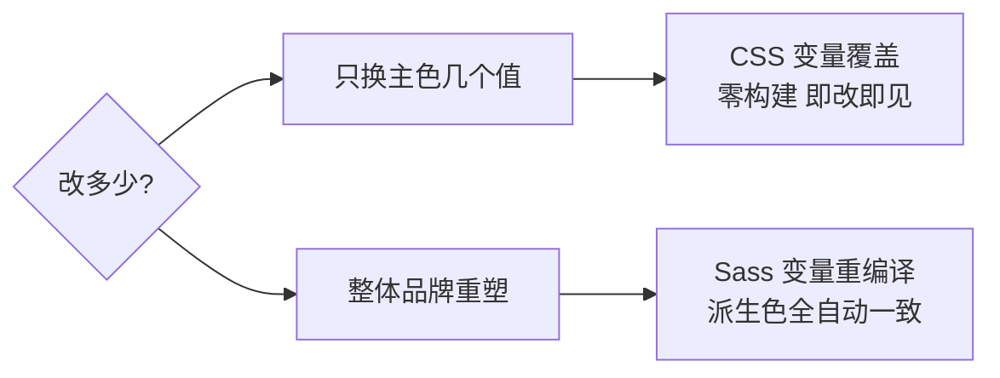

# Bootstrap5 实战

## 前言

前四章分别过了基础、组件、JS 插件，本章进行综合实战：
用 Bootstrap5 搭一个**企业官网落地页**，包含导航栏、Hero 区、
三列功能卡、价格表、客户评价轮播、FAQ 手风琴、CTA 与多栏 footer；
随后讲两种主题定制路线（Sass 重编译 vs CSS 变量轻量覆盖），
对比 Bootstrap 与 Tailwind 的体积与选型决策，最后给老项目
Bootstrap4 的差异提示。

---

## 一、完整落地页源码

单文件可运行（Sass 定制版会把 CDN 换成编译产物，结构不变）：

```html
<!DOCTYPE html>
<html lang="zh-CN">
<head>
<meta charset="UTF-8" />
<meta name="viewport" content="width=device-width, initial-scale=1.0" />
<title>RootStack - 让团队协作更简单</title>
<link href="https://cdn.jsdelivr.net/npm/bootstrap@5.3.3/dist/css/bootstrap.min.css"
      rel="stylesheet" />
</head>
<body>

<!-- 导航栏 -->
<nav class="navbar navbar-expand-lg bg-body-tertiary sticky-top">
  <div class="container">
    <a class="navbar-brand fw-bold" href="#">RootStack</a>
    <button class="navbar-toggler" data-bs-toggle="collapse"
            data-bs-target="#nav"><span class="navbar-toggler-icon"></span></button>
    <div class="collapse navbar-collapse" id="nav">
      <ul class="navbar-nav ms-auto align-items-lg-center gap-lg-2">
        <li class="nav-item"><a class="nav-link" href="#features">产品</a></li>
        <li class="nav-item"><a class="nav-link" href="#pricing">价格</a></li>
        <li class="nav-item"><a class="nav-link" href="#faq">常见问题</a></li>
        <li class="nav-item ms-lg-2">
          <a class="btn btn-primary btn-sm px-3" href="#">免费试用</a>
        </li>
      </ul>
    </div>
  </div>
</nav>

<!-- Hero 图文两栏 -->
<header class="py-5 bg-body-tertiary">
  <div class="container">
    <div class="row align-items-center g-5">
      <div class="col-lg-6">
        <h1 class="display-4 fw-bold lh-1 mb-3">让团队协作<br />更简单、更高效</h1>
        <p class="lead text-body-secondary mb-4">
          任务管理、文档协作、数据看板，一个工作台全部搞定。
        </p>
        <div class="d-grid gap-2 d-md-flex">
          <button class="btn btn-primary btn-lg px-4 me-md-2">开始免费试用</button>
          <button class="btn btn-outline-secondary btn-lg px-4">预约演示</button>
        </div>
      </div>
      <div class="col-lg-6">
        
      </div>
    </div>
  </div>
</header>

<!-- 功能三列卡片 -->
<section id="features" class="py-5">
  <div class="container">
    <h2 class="text-center fw-bold mb-5">为什么选择我们</h2>
    <div class="row g-4 row-cols-1 row-cols-md-3">
      <div class="col">
        <div class="card h-100 border-0 shadow-sm">
          <div class="card-body text-center p-4">
            <div class="display-6 text-primary">01</div>
            <h5 class="card-title mt-2">任务看板</h5>
            <p class="card-text text-body-secondary small">
              拖拽式管理，进度一目了然。
            </p>
          </div>
        </div>
      </div>
      <div class="col">
        <div class="card h-100 border-0 shadow-sm">
          <div class="card-body text-center p-4">
            <div class="display-6 text-primary">02</div>
            <h5 class="card-title mt-2">在线文档</h5>
            <p class="card-text text-body-secondary small">
              多人实时编辑，知识不再散落。
            </p>
          </div>
        </div>
      </div>
      <div class="col">
        <div class="card h-100 border-0 shadow-sm">
          <div class="card-body text-center p-4">
            <div class="display-6 text-primary">03</div>
            <h5 class="card-title mt-2">数据报表</h5>
            <p class="card-text text-body-secondary small">
              内置模板，一键生成经营视图。
            </p>
          </div>
        </div>
      </div>
    </div>
  </div>
</section>

<!-- 价格表 -->
<section id="pricing" class="py-5 bg-body-tertiary">
  <div class="container py-3">
    <h2 class="text-center fw-bold mb-5">透明定价</h2>
    <div class="row g-4 justify-content-center row-cols-1 row-cols-lg-3">
      <div class="col">
        <div class="card h-100 text-center">
          <div class="card-body p-4">
            <h6 class="text-uppercase text-body-secondary">基础版</h6>
            <p class="display-6 fw-bold my-3">0<span class="fs-6 fw-normal">元/月</span></p>
            <ul class="list-unstyled small text-body-secondary mb-4">
              <li class="mb-1">最多 5 人</li>
              <li class="mb-1">3 个项目</li>
              <li>社区支持</li>
            </ul>
            <button class="btn btn-outline-primary w-100">免费开始</button>
          </div>
        </div>
      </div>
      <div class="col">
        <div class="card h-100 text-center border-primary shadow">
          <div class="card-header bg-primary text-white fw-medium">最受欢迎</div>
          <div class="card-body p-4">
            <h6 class="text-uppercase text-body-secondary">专业版</h6>
            <p class="display-6 fw-bold my-3">99<span class="fs-6 fw-normal">元/月</span></p>
            <ul class="list-unstyled small text-body-secondary mb-4">
              <li class="mb-1">不限人数与项目</li>
              <li class="mb-1">高级报表</li>
              <li>优先客服</li>
            </ul>
            <button class="btn btn-primary w-100">立即订阅</button>
          </div>
        </div>
      </div>
      <div class="col">
        <div class="card h-100 text-center">
          <div class="card-body p-4">
            <h6 class="text-uppercase text-body-secondary">企业版</h6>
            <p class="display-6 fw-bold my-3">定制</p>
            <ul class="list-unstyled small text-body-secondary mb-4">
              <li class="mb-1">私有化部署</li>
              <li class="mb-1">SLA 保障</li>
              <li>专属经理</li>
            </ul>
            <button class="btn btn-outline-primary w-100">联系销售</button>
          </div>
        </div>
      </div>
    </div>
  </div>
</section>

<!-- 客户评价轮播 -->
<section class="py-5">
  <div class="container">
    <div id="quotes" class="carousel slide carousel-dark"
         data-bs-ride="carousel">
      <div class="carousel-inner">
        <div class="carousel-item active text-center px-md-5">
          <p class="lead fst-italic mx-auto" style="max-width:46rem">
            "上线三个月，跨部门协作效率明显提升。"
          </p>
          <p class="small text-body-secondary">— 某互联网公司 CTO</p>
        </div>
        <div class="carousel-item text-center px-md-5">
          <p class="lead fst-italic mx-auto" style="max-width:46rem">
            "报表功能省掉了每周手动汇总的两小时。"
          </p>
          <p class="small text-body-secondary">— 连锁零售运营总监</p>
        </div>
      </div>
      <button class="carousel-control-prev" data-bs-target="#quotes"
              data-bs-slide="prev"><span class="carousel-control-prev-icon"></span></button>
      <button class="carousel-control-next" data-bs-target="#quotes"
              data-bs-slide="next"><span class="carousel-control-next-icon"></span></button>
    </div>
  </div>
</section>

<!-- FAQ 手风琴 -->
<section id="faq" class="py-5 bg-body-tertiary">
  <div class="container" style="max-width:48rem">
    <h2 class="text-center fw-bold mb-4">常见问题</h2>
    <div class="accordion" id="faqAcc">
      <div class="accordion-item">
        <h2 class="accordion-header">
          <button class="accordion-button" data-bs-toggle="collapse"
                  data-bs-target="#q1">可以随时取消订阅吗?</button>
        </h2>
        <div id="q1" class="accordion-collapse collapse show"
             data-bs-parent="#faqAcc">
          <div class="accordion-body small">可以，取消后服务持续到当前计费周期结束。</div>
        </div>
      </div>
      <!-- 更多条目结构相同, 省略 -->
    </div>
  </div>
</section>

<!-- CTA -->
<section class="py-5 text-white bg-primary">
  <div class="container text-center py-3">
    <h2 class="fw-bold mb-3">准备好开始了吗?</h2>
    <p class="mb-4 opacity-75">无需信用卡，注册即用全部基础功能。</p>
    <button class="btn btn-light btn-lg px-5">立即注册</button>
  </div>
</section>

<!-- 多栏 Footer -->
<footer class="py-5 bg-dark text-white-50">
  <div class="container">
    <div class="row gy-4">
      <div class="col-lg-4">
        <h5 class="text-white fw-bold">RootStack</h5>
        <p class="small mb-0">让团队协作更简单的云端工作台。</p>
      </div>
      <div class="col-6 col-lg-2 offset-lg-2">
        <h6 class="text-white">产品</h6>
        <ul class="list-unstyled small">
          <li><a class="link-secondary" href="#">功能</a></li>
          <li><a class="link-secondary" href="#">价格</a></li>
        </ul>
      </div>
      <div class="col-6 col-lg-2">
        <h6 class="text-white">资源</h6>
        <ul class="list-unstyled small">
          <li><a class="link-secondary" href="#">文档</a></li>
          <li><a class="link-secondary" href="#">博客</a></li>
        </ul>
      </div>
      <div class="col-6 col-lg-2">
        <h6 class="text-white">公司</h6>
        <ul class="list-unstyled small">
          <li><a class="link-secondary" href="#">关于</a></li>
          <li><a class="link-secondary" href="#">招聘</a></li>
        </ul>
      </div>
    </div>
    <hr class="border-secondary" />
    <p class="small mb-0">© 2026 RootStack. 保留所有权利。</p>
  </div>
</footer>

<script src="https://cdn.jsdelivr.net/npm/bootstrap@5.3.3/dist/js/bootstrap.bundle.min.js"></script>
</body>
</html>
```

结构要点：整页零自定义 CSS，全靠工具类 + 组件类拼装；
每个 section 用 `py-5` 统一纵向节奏；交替使用 `bg-body-tertiary`
制造区块明暗分隔；推荐档价格卡用 `border-primary shadow` 加头部色条强调。

---

## 二、主题定制两条路线

### 2.1 路线一：Sass 变量重编译（深度定制）

```bash
npm install -D sass bootstrap
```

```scss
// custom.scss
$primary: #0969da;           // 覆盖品牌主色(必须写在引入之前)
$border-radius: .6rem;
$font-family-sans-serif: Inter, system-ui, sans-serif;
$link-color: $primary;

@import "bootstrap/scss/bootstrap";
```

```bash
sass custom.scss dist/custom.css   # 编译出整套定制版
```

原理：Bootstrap 的 Sass 源码中所有组件样式都引用 `$primary` 等变量，
先覆盖变量再引入源码，产物是按你的品牌重新计算的整套 CSS，
连 hover 态、按钮渐变等派生色都会自动算好。

### 2.2 路线二：CSS 变量轻量覆盖（不碰构建）

v5 同时把核心 token 暴露为 CSS 自定义属性，可以直接覆盖：

```css
:root {
  --bs-primary: #0969da;
  --bs-border-radius: .6rem;
}
/* 但注意: .btn-primary 的底色走的是 --bs-btn-bg 等按钮级变量 */
.btn-primary {
  --bs-btn-bg: #0969da;
  --bs-btn-hover-bg: #0857b0;
  --bs-btn-active-bg: #074b98;
}
```

适合在既有项目上小范围调色，缺点是部分派生状态要逐个覆盖，
覆盖面大了反而不如 Sass 路线干净。



---

## 三、性能与体积对比

| 方案 | CSS 体积(gzip 前) | 说明 |
| --- | --- | --- |
| Bootstrap 全量 CDN | 约 230KB | 所有组件样式全部下发 |
| Bootstrap 按需 Sass import | 可减 30%-60% | 只 @import 用到的模块 |
| Tailwind 构建版(purge 后) | 通常 10-30KB | 只含页面实际用到的类 |

按需引入示例：

```scss
// 只引入栅格/按钮/卡片/表单, 跳过 carousel/popover 等
@import "bootstrap/scss/functions";
@import "bootstrap/scss/variables";
@import "bootstrap/scss/maps";
@import "bootstrap/scss/reboot";
@import "bootstrap/scss/grid";
@import "bootstrap/scss/buttons";
@import "bootstrap/scss/card";
@import "bootstrap/scss/forms";
```

结论方向：内容型官网在意首屏体积时，Tailwind 的 purge 优势明显；
内部后台对体积不敏感时，Bootstrap 全量的开发效率优势更大。

---

## 四、Bootstrap vs Tailwind 选型决策

| 决策因素 | 倾向 Bootstrap | 倾向 Tailwind |
| --- | --- | --- |
| 团队熟悉度 | 有现成 Bootstrap 经验/后端兼写前端 | 团队愿意建立设计系统心智 |
| 设计自由度 | 接受默认风格或官方主题 | 需要高度定制的视觉 |
| 开发速度 | 标准后台/原型, 组件即拼即用 | 有设计稿且要求还原度 |
| 体积敏感 | 不敏感(内网/后台) | 敏感(C 端官网) |
| JS 组件依赖 | 需要 modal/dropdown 开箱可用 | 愿意配 headless 库自组装 |
| 长期维护 | 语义类稳定, 改皮肤靠变量 | 工具类随 HTML 迁移, 无死代码 |

一句话版本：**要快、要稳、像 Bootstrap 就选 Bootstrap；
要自由度、要小体积、有自己的设计就选 Tailwind**。
两者也常共存——官网用 Tailwind，内部系统用 Bootstrap。

---

## 五、老项目 Bootstrap4 一句话

如果接手的是存量 v4 项目，注意它与 v5 的破坏性差异：
插件仍依赖 jQuery、data 属性没有 `bs` 前缀（`data-toggle`）、
`.form-group` 已被移除等。能小步升级就升 v5；
不能动的旧站请锁定 4.6 文档查阅，详见
[[前端开发/02-CSS框架/Bootstrap4/01-Bootstrap4快速参考|Bootstrap4 快速参考]]。

---

## 本章小结

- 落地页八大区块全部零自定义 CSS 完成，验证了 Bootstrap 的开箱即用；
- 主题定制：整体重塑走 Sass 变量重编译，小改颜色用 CSS 变量覆盖；
- 体积排序：Tailwind purge 版远小于 Bootstrap 全量，后者可按需 Sass 引入；
- 选型看六个维度：熟悉度、设计自由度、速度、体积、JS 组件、长期维护。

接下来是面向存量项目的参考手册：
[[前端开发/02-CSS框架/Bootstrap4/01-Bootstrap4快速参考|Bootstrap4 快速参考]]。
