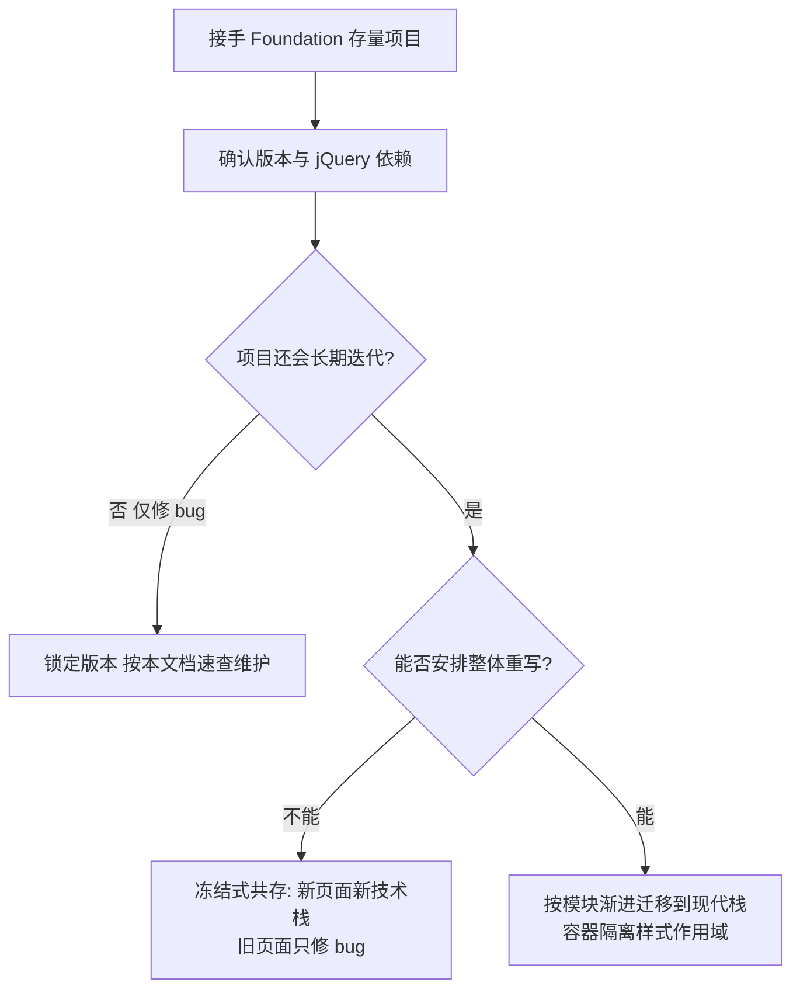

# Foundation 快速参考

## 定位声明

Foundation 是 ZURB 公司出品的另一老牌响应式框架，与 Bootstrap 同期
崛起（v1 于 2011 年发布），走**企业级语义化路线**：Sass 深度定制能力强、
默认风格克制专业、a11y 无障碍支持做得早。但它的社区活跃度如今已远低于
Bootstrap 和 Tailwind：官方在 2020 年后基本停止大版本演进，
新项目一般不选它。

本章的定位与 Bootstrap4 参考类似——**读懂存量代码**：
不少 2015-2020 年间的企业站、政企门户、SaaS 官网用 Foundation 搭建，
接手维护时需要你至少能看懂、能安全地改。

前置阅读：[[前端开发/02-CSS框架/Bootstrap5/01-Bootstrap5基础|Bootstrap5 基础]]
（栅格概念对照）。

---

## 一、快速上手

### 1.1 CDN 引入与初始化

```html
<!DOCTYPE html>
<html lang="zh-CN">
<head>
<meta charset="UTF-8" />
<meta name="viewport" content="width=device-width, initial-scale=1.0" />
<link rel="stylesheet"
      href="https://cdn.jsdelivr.net/npm/foundation-sites@6.8.1/dist/css/foundation.min.css" />
</head>
<body>

<div class="grid-container">
  <div class="grid-x grid-padding-x">
    <div class="cell small-12 medium-6">
      <h1>Hello Foundation</h1>
    </div>
    <div class="cell small-12 medium-6">
      <p>右半边内容。</p>
    </div>
  </div>
</div>

<!-- 注意: Foundation 至今依赖 jQuery -->
<script src="https://code.jquery.com/jquery-3.7.1.min.js"></script>
<script src="https://cdn.jsdelivr.net/npm/foundation-sites@6.8.1/dist/js/foundation.min.js"></script>
<script>
  $(document).foundation();   // 一行初始化页面上所有声明式组件
</script>
</body>
</html>
```

三个上手要点：

- `$(document).foundation()` 会扫描全页 DOM，按 `data-*` 属性装配组件；
- 它仍强依赖 jQuery，这是它与 v5 之后 Bootstrap 的本质区别；
- CSS 里自带一套样式重置（normalize + 自家 reset），引入后页面外观
  立即变化，与 Bootstrap 的 reboot 类似。

---

## 二、核心速查

### 2.1 XY Grid 栅格体系

Foundation 6.4+ 使用 XY Grid，概念上仍是 12 列，但类名自成一派：

| 角色 | Foundation | Bootstrap 对照 |
| --- | --- | --- |
| 页面容器 | .grid-container | .container |
| 全宽容器 | .grid-container.full | .container-fluid |
| 行 | .grid-x | .row |
| 列 | .cell | .col-* |
| 小屏列宽 | .small-6 | .col-6 |
| 中屏列宽 | .medium-4 | .col-md-4 |
| 大屏列宽 | .large-3 | .col-lg-3 |
| 自动均分 | .cell.auto | .col |
| 整行占满(100%) | .small-12 | .col-12 |
| 收缩到内容宽 | .cell.shrink | .col-auto |

```html
<div class="grid-x grid-margin-x">
  <!-- grid-margin-x 给列间加 margin; grid-padding-x 用 padding, 二选一 -->
  <div class="cell medium-8">主区</div>
  <div class="cell medium-4">侧栏</div>
</div>

<!-- 水平对齐与垂直对齐直接挂在行上 -->
<div class="grid-x grid-margin-x align-center align-middle">
  <div class="cell small-6 text-center">居中块</div>
</div>
```

断点命名对照：`small`(>=0 移动优先) / `medium`(>=640px) /
`large`(>=1024px) / `xlarge`(>=1200px) / `xxlarge`(>=1440px)。
注意它的 md 档是 640px 起，比 Bootstrap 的 768px 更早切换。

### 2.2 常用组件最小示例

```html
<!-- top-bar 导航栏 -->
<div class="top-bar">
  <div class="top-bar-left">
    <ul class="dropdown menu" data-dropdown-menu>
      <li class="menu-text">RootStack</li>
      <li><a href="#">首页</a></li>
      <li><a href="#">产品</a></li>
    </ul>
  </div>
</div>

<!-- buttons 按钮 -->
<a href="#" class="button primary">主按钮</a>
<a href="#" class="button secondary hollow">描边次按钮</a>
<button class="button alert expanded">红色通栏按钮</button>

<!-- callout 提示框(相当于 alert) -->
<div class="callout warning" data-closable>
  <p>这是一条警告提示。</p>
  <button class="close-button" data-close aria-label="关闭">
    <span aria-hidden="true">&times;</span>
  </button>
</div>

<!-- reveal 模态框 -->
<p><button class="button" data-open="myModal">打开弹窗</button></p>
<div class="reveal" id="myModal" data-reveal>
  <h2>标题</h2>
  <p>模态框内容。</p>
  <button class="close-button" data-close aria-label="关闭">
    <span aria-hidden="true">&times;</span>
  </button>
</div>

<!-- tabs 选项卡 -->
<ul class="tabs" data-tabs id="myTabs">
  <li class="tabs-title is-active"><a href="#panel1" aria-selected="true">Tab 1</a></li>
  <li class="tabs-title"><a href="#panel2">Tab 2</a></li>
</ul>
<div class="tabs-content" data-tabs-content="myTabs">
  <div class="tabs-panel is-active" id="panel1"><p>面板一</p></div>
  <div class="tabs-panel" id="panel2"><p>面板二</p></div>
</div>

<!-- orbit 轮播 -->
<div class="orbit" data-orbit role="region">
  <div class="orbit-wrapper">
    <div class="orbit-container">
      <div class="orbit-slide is-active">
        
      </div>
      <div class="orbit-slide">
        
      </div>
    </div>
  </div>
</div>

<!-- 表单 -->
<form>
  <label>邮箱
    <input type="email" placeholder="you@example.com" />
  </label>
  <!-- 注意: label 直接包裹 input, 不需要 for/id 关联 -->
  <label>留言
    <textarea rows="4"></textarea>
  </label>
  <button type="submit" class="button primary">提交</button>
</form>
```

组件命名与 Bootstrap 的映射记忆法：
callout≈alert、reveal≈modal、orbit≈carousel、top-bar≈navbar、
visibility 工具≈d-none 系列。

### 2.3 可见性工具类（utility classes）

Foundation 的可见性体系按"尺寸档 + 显示意图"组合：

```html
<p class="show-for-small-only">仅小屏可见</p>
<p class="hide-for-medium-only">中屏隐藏(其余可见)</p>
<p class="show-for-large">large 及以上才可见</p>
<p class="show-for-sr">仅屏幕阅读器可见(无障碍描述)</p>
<p class="hide" style="display:none">等价 display:none</p>
<p class="invisible">占位但不可见</p>
```

| 类名模式 | 含义 |
| --- | --- |
| show-for-{bp}-only | 只在该断点显示 |
| hide-for-{bp}-only | 只在该断点隐藏 |
| show-for-{bp} | 该断点及以上显示 |
| hide-for-{bp} | 该断点及以上隐藏 |
| show-for-sr / show-for-landscape 等 | 无障碍/方向场景 |

这套命名比 Bootstrap 的 `d-md-none` 啰嗦但语义更直白。

### 2.4 更多高频组件

```html
<!-- accordion 手风琴 -->
<ul class="accordion" data-accordion>
  <li class="accordion-item is-active" data-accordion-item>
    <a href="#" class="accordion-title">如何退款?</a>
    <div class="accordion-content" data-tab-content>
      <p>在订单页申请即可。</p>
    </div>
  </li>
  <li class="accordion-item" data-accordion-item>
    <a href="#" class="accordion-title">支持什么支付?</a>
    <div class="accordion-content" data-tab-content>
      <p>支付宝、微信、银行卡。</p>
    </div>
  </li>
</ul>

<!-- sticky 吸顶/吸附列 -->
<div class="columns medium-4" data-sticky-container>
  <div class="sticky" data-sticky data-margin-top="2">
    <p>侧栏会跟随滚动吸住。</p>
  </div>
</div>

<!-- badge 徽章 -->
<span class="badge primary">9</span>
<span class="badge alert">NEW</span>

<!-- progress 进度条 -->
<div class="progress" role="progressbar" aria-valuenow="60"
     aria-valuemin="0" aria-valuemax="100">
  <span class="progress-meter" style="width:60%"></span>
</div>
```

`data-sticky` 与 `equalizer`（等高插件，给一组元素统一高度）是
Foundation 的特色组件，Bootstrap 里分别要用 sticky-top 和 h-100 手工实现。
维护旧站时看到 `data-equalizer` 不要惊讶——它就是老派的等高卡片方案：

```html
<div class="grid-x grid-margin-x" data-equalizer data-equalize-on="medium">
  <div class="cell medium-4 callout" data-equalizer-watch>内容不等长</div>
  <div class="cell medium-4 callout" data-equalizer-watch>但三块会被拉成</div>
  <div class="cell medium-4 callout" data-equalizer-watch>同样的高度</div>
</div>
```

### 2.5 JS 插件用法速览

```js
// 声明式之外, 也可以程序化操作:
$('#myModal').foundation('open');     // 打开 reveal
$('#myModal').foundation('close');    // 关闭
// 事件监听: 事件名 = 组件名 + 动作
$('#myModal').on('closed.zf.reveal', function () {
  console.log('弹窗关了');
});
// 重初始化(动态插入内容后):
$(document).foundation();
// 或只重刷某个插件:
Foundation.reInit('equalizer');
```

事件命名空间是 `.zf.`，与 jQuery 插件时代惯例一致；
动态 DOM 后需要 reInit 也是老框架的共同特征。

---

## 三、典型存量代码解读

一段 2018 年前后的企业官网片段，逐块标注意图与风险点：

```html
<div class="title-bar" data-responsive-toggle="mainMenu" data-hide-for="medium">
  <!-- 移动端标题栏: medium 以上隐藏, 点击切换 mainMenu 显隐 -->
  <button class="menu-icon" type="button" data-toggle="mainMenu"></button>
  <div class="title-bar-title">RootStack</div>
</div>

<div class="top-bar" id="mainMenu">
  <!-- 桌面端导航: 与上面 title-bar 共享同一个 id 做响应式切换 -->
  <div class="top-bar-left">
    <ul class="menu">
      <li class="menu-text">RootStack</li>
      <li><a href="#">产品</a></li>
    </ul>
  </div>
</div>

<div class="grid-container">
  <div class="grid-x grid-padding-x align-middle hero">
    <div class="cell medium-6">
      <h1>企业级解决方案</h1>
      <a href="#contact" class="large button expanded">联系我们</a>
      <!-- large button = 大尺寸; expanded = 通栏 -->
    </div>
    <div class="cell medium-6 show-for-medium">
      <!-- 配图仅中屏以上显示, 手机省流量 -->
      
    </div>
  </div>
</div>
```

风险点提示：`data-responsive-toggle` 这类响应式切换依赖 JS 初始化成功，
如果页面报 jQuery 错误（常见于 jQuery 被重复引入或升级到不兼容版本），
汉堡菜单会直接失效。排查顺序：控制台报错 → jQuery 版本 →
`$(document).foundation()` 是否执行。

---

## 四、与 Bootstrap 差异对照表

| 维度 | Foundation | Bootstrap |
| --- | --- | --- |
| JS 依赖 | jQuery(至今) | v5 起原生 JS |
| 移动优先实现 | 断点从 small=0 起步, medium 640px | sm 576 / md 768 起 |
| 栅格类名 | grid-x / cell small-6 | row / col-6 |
| Sass 定制深度 | 极深, 几乎所有东西都是 mixin/变量 | 深, 但文档化程度更高 |
| 单位策略 | 大量使用 em(相对父字号缩放) | rem 为主(相对根字号) |
| 组件数量 | 较少但可组合性强(magellan/interchange 等独有) | 数量多, 文档示例丰富 |
| 无障碍 | WAI-ARIA 支持起步早且全面 | v5 追平大部分 |
| 社区生态 | 已萎缩, 第三方主题少 | 庞大且持续 |
| 新项目推荐度 | 一般不选 | 默认可选 |

em 与 rem 的差异值得单独说明：Foundation 用 em 让组件随所在上下文
字号缩放（嵌套卡片里的按钮自动更小），设计哲学更精细；
代价是排查尺寸问题时心智负担更高。

---

## 五、维护存量项目的生存清单

接到一个 Foundation 项目时，先按下面的流程图走一遍评估，
再执行清单：



按此清单行动：

```text
[ ] 确认版本: 查看 package.json 或 foundation.min.js 头部注释(常见 6.4-6.8)
[ ] 确认 jQuery 版本兼容(Foundation 6 配 jQuery 2.x-3.x)
[ ] 找出 $(document).foundation() 初始化位置(通常在各页尾或公共 js)
[ ] 盘点用到的组件: data-reveal/data-tabs/data-orbit/data-sticky 等 grep 一遍
[ ] 动态渲染内容(ajax 分页/前端框架挂载)后记得 Foundation.reInit
[ ] 不要混引 Bootstrap: 两家的 reset 与类名会互相覆盖
[ ] 改样式优先走 _settings.scss 重新编译, 别写大量 !important 覆盖
[ ] 若项目要长期活, 评估渐进迁移: 新页面用 Tailwind/Bootstrap,
    旧页面保持 Foundation, 靠容器隔离样式作用域
```

最后一条展开说：完全重写往往不可行，实践中更常见的路径是
"冻结式共存"——Foundation 页面只修 bug，新功能在新技术栈开发，
通过路由或子域隔离，最终自然完成换代。

---

## 本章小结

- Foundation 是企业级语义化路线的老牌框架，社区已萎缩，读存量代码为主；
- 上手三件事：CDN 引入、jQuery 依赖、`$(document).foundation()` 初始化；
- XY Grid 的 grid-x/cell 对应 Bootstrap 的 row/col，断点 medium 从 640px 起；
- 组件名映射：callout≈alert、reveal≈modal、orbit≈carousel、top-bar≈navbar；
- em 相对单位与深度 Sass 定制是它区别于 Bootstrap 的两大技术特征；
- 维护清单的核心动作：锁版本、grep data 属性盘点、动态内容后 reInit。

至此 CSS 框架板块全部完成。建议回到
[[前端开发/02-CSS框架/../前端开发目录|前端目录]] 选择下一步：
深入 Tailwind 的实战线（后台页面之后做
[[前端开发/08-项目实战/04-电商首页|电商首页实战]]），或进入 JS 框架章节。
