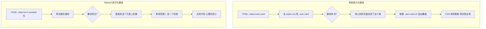
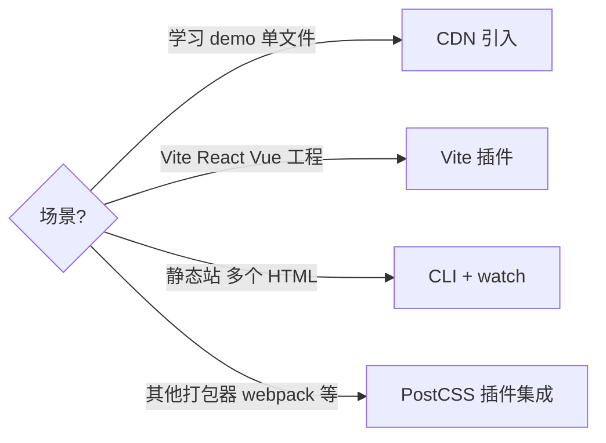
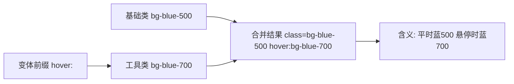

# Tailwind 基础

## 前言

传统 CSS 开发中，我们习惯为每个模块起一个语义化的类名，然后在样式表里写对应的规则。
写久了你会发现两件痛苦的事：一是"起名困难症"，一个按钮到底叫 `.btn-primary` 还是
`.btn-main` 还是 `.button-blue`；二是 CSS 文件越来越大，改一处样式怕影响别处，
最后只能不断追加新规则，项目变成一锅"CSS 意面"。

Tailwind CSS 给出的答案是**原子化 CSS**（Atomic / Utility-First CSS）：
不再起语义化名字，直接在 HTML 上堆叠一个个"只做一件事"的工具类。

本章目标：理解原子化理念与心智差异；掌握四种安装方式；速览工具类体系
（间距、颜色、布局，并与已学 Flexbox/Grid 知识对应）；掌握 `hover:` `md:`
`dark:` 变体前缀；学会任意值语法 `w-[137px]`；最后完成一次传统卡片重构实战。

前置知识：建议先读完 [[前端开发/01-基础/CSS/03-Flexbox布局|Flexbox 布局]] 与
[[前端开发/01-基础/CSS/04-Grid布局|Grid 布局]]——Tailwind 只是这些 CSS 属性的"缩写映射表"。

---

## 一、原子化 CSS 理念

### 1.1 什么是原子化

原子化的核心主张：**每个类只包含一条（或极少数几条）样式声明**，
类的名字就是它做的事本身。

```css
/* 传统 CSS：语义类名，一个类打包多条声明 */
.card {
  padding: 1rem;
  border-radius: 0.5rem;
  background-color: #ffffff;
  box-shadow: 0 1px 3px rgba(0, 0, 0, 0.1);
}
```

```html
<!-- 原子化：不写任何自定义 CSS，直接组合工具类 -->
<div class="p-4 rounded-lg bg-white shadow">
  <!-- 卡片内容 -->
</div>
```

`p-4` 就是 `padding: 1rem`，`rounded-lg` 就是圆角，`shadow` 就是阴影。
类名即声明，声明即类名，一一对应，没有中间层。

### 1.2 与传统语义化 class 的对比

| 维度 | 传统语义化 class | Tailwind 原子化 |
| --- | --- | --- |
| 类名含义 | "这是什么"（.user-card） | "长什么样"（.p-4 .rounded） |
| 样式定义位置 | 集中在 .css 文件 | 分散在每个 HTML 元素上 |
| 起名负担 | 每个组件都要想名字 | 几乎为零 |
| 删除组件后死代码 | 有，CSS 里残留没人用的规则 | 无，HTML 没了这个类就不再产出 |
| 改样式的心智 | 要全局搜索类名被谁复用了 | 只看当前元素这一行 |
| 复用方式 | 复用同一个类名 | 复制粘贴类串，或抽成组件 |

最后一行值得展开：原子化并不排斥复用，只是把复用从"CSS 层"上移到了
"组件层"。React/Vue 项目里，复用一个 `<Card>` 组件天然就复用了它的类串；
纯 HTML 场景则靠编辑器多光标复制，这也是官方文档反复演示的方式。

### 1.3 两种方式的心智差异



一句话总结心智差异：**传统写法是"间接寻址"——看到 HTML 还要跳到 CSS 文件；
Tailwind 是"就地取材"——样式与结构同处一行，所见即所得。**
代价是类串会很长，可读性依赖你对工具类的熟练度；熟练之后这不是问题，
生疏阶段会觉得像在读密码——所以本章后面会带你把最常用的那批"密码表"背下来。

---

## 二、安装的四种方式

### 2.1 CDN 引入（玩耍/原型）

适合学习、demo、单文件示例。注意：这是把 Tailwind 的"运行时编译器"
（约 300KB+ 的 JS）发到浏览器里现扫描现生成样式，性能差，**绝不能用于生产**。
保存刷新即可生效，无需任何构建步骤。

```html
<script src="https://cdn.tailwindcss.com"></script>
<body class="bg-gray-100">
  <h1 class="text-3xl font-bold text-center mt-10">Hello Tailwind</h1>
</body>
```

保存刷新即可生效，无需任何构建步骤。本书实战章节用它做单文件可跑的示例。

### 2.2 Vite 插件（正式项目推荐）

```bash
npm create vite@latest my-app -- --template react
cd my-app
npm install tailwindcss @tailwindcss/vite
```

```js
// vite.config.js
import { defineConfig } from 'vite'
import react from '@vitejs/plugin-react'
import tailwindcss from '@tailwindcss/vite'

export default defineConfig({
  plugins: [react(), tailwindcss()],
})
```

```css
/* 入口 CSS，例如 src/index.css */
@import "tailwindcss";
```

### 2.3 CLI 方式（无框架纯 HTML 项目）

不想上 Node 工程链、只有一堆静态 HTML 时，用官方 CLI 监听文件并输出 CSS：

```bash
npm install -D tailwindcss
npx tailwindcss init
```

```js
// tailwind.config.js —— 告诉 Tailwind 去哪些文件里扫描类名
/** @type {import('tailwindcss').Config} */
module.exports = {
  content: ['./**/*.html'],
  theme: { extend: {} },
  plugins: [],
}
```

```css
/* input.css */
@tailwind base;
@tailwind components;
@tailwind utilities;
```

### 2.4 watch 模式（边写边编译）

CLI 与各类构建集成都支持 watch：源文件一变立即重新扫描生成产物。

```bash
# 单次构建 / 监听模式 / 生产构建(压缩+purge)
npx tailwindcss -i ./input.css -o ./dist/style.css
npx tailwindcss -i ./input.css -o ./dist/style.css --watch
npx tailwindcss -i ./input.css -o ./dist/style.css --minify
```

### 2.5 四种方式怎么选



记住红线：**CDN 版只用于开发环境**，原理见第三章"生产构建"一节。

---

## 三、工具类体系速览

Tailwind 默认生成上万种工具类，但高频使用的核心不过百来个。
下面按体系过一遍最重要的部分。

### 3.1 spacing 尺度：p-4 到底是多少

Tailwind 定义了一个统一的间距尺度表，所有涉及尺寸的工具类共用它：
`padding`、`margin`、`gap`、`width`、`height`、`inset` 全部一致。

| 类 | 值 | 说明 |
| --- | --- | --- |
| p-0.5 | 0.125rem (2px) | 最小刻度 |
| p-1 | 0.25rem (4px) | |
| p-2 | 0.5rem (8px) | |
| **p-4** | **1rem (16px)** | 最常用默认内边距 |
| p-6 | 1.5rem (24px) | 卡片常用 |
| p-8 | 2rem (32px) | 大区块留白 |
| p-10 | 2.5rem (40px) | |

关键点：数字乘以 0.25rem。所以 `p-4` = 4 x 0.25rem = 1rem。
这套尺度的意义在于**约束设计**——全站间距只会出现这几个离散值，
不会出现 `13px`、`17px` 这种随手乱写的间距，视觉节奏自然统一。

方向前缀同样成体系：

- `pt-*` padding-top、`pb-*` bottom、`pl-*` left、`pr-*` right
- `px-*` 左右两个方向、`py-*` 上下两个方向
- margin 同构：`m-*` `mt-*` `mx-auto`（水平居中神器）

### 3.2 colors 色板

每套颜色 11 个档位：50（最浅）到 950（最深），外加 white/black。
命名语义化：`gray` 中性灰、`blue/red/green/amber` 彩色、`slate` 偏蓝灰等。

```html
<div class="text-gray-500">正文辅助文字</div>
<div class="bg-blue-500 text-white">品牌蓝按钮</div>
<div class="border-red-300">浅红描边的警告框</div>
<div class="bg-emerald-100">极浅绿背景提示区</div>
```

档位的直觉规律：500 是该色相的标准色（对比白色文字够用），
200 及以下做背景底色，700 及以上做深色文字或 hover 态。
第三章会讲如何把自己的品牌色做成同样的 50-950 阶。

### 3.3 flex/grid：与原生 CSS 一一对应

如果你学过 [[前端开发/01-基础/CSS/03-Flexbox布局|Flexbox 布局]]，
下面这张对照表几乎不需要记忆——Tailwind 类名就是属性名的缩写：

| CSS 声明 | Tailwind 类 |
| --- | --- |
| display: flex | flex |
| flex-direction: column | flex-col |
| flex-wrap: wrap | flex-wrap |
| justify-content: center | justify-center |
| justify-content: space-between | justify-between |
| align-items: center | items-center |
| flex: 1 | flex-1 |
| gap: 1rem | gap-4 |

Grid 同理，配合 [[前端开发/01-基础/CSS/04-Grid布局|Grid 布局]] 的知识：

| CSS 声明 | Tailwind 类 |
| --- | --- |
| display: grid | grid |
| grid-template-columns: repeat(3, minmax(0,1fr)) | grid-cols-3 |
| column-gap: 1rem; row-gap: 2rem | gap-x-4 gap-y-8 |
| grid-column: span 2 | col-span-2 |
| place-items: center | place-items-center |

### 3.4 字体与文本常用类

```html
<p class="text-sm leading-relaxed tracking-wide text-gray-600">
  text-sm 控字号(14px)，leading 控行高，tracking 控字距。
</p>
<h1 class="text-3xl md:text-5xl font-bold">标题常用 text-{size} 加 font-bold</h1>
<p class="truncate">超长文本单行截断显示省略号超长文本单行截断显示省略号</p>
```
字号档位：`text-xs`(12) `sm`(14) `base`(16) `lg`(18) `xl`(20)
`2xl`(24) `3xl`(30) `4xl`(36) `5xl`(48)，单位 px。

### 3.5 边框、圆角、阴影、溢出

```html
<div class="border border-gray-200 rounded-lg shadow-md overflow-hidden">
  border 默认 1px，border-2/border-4 加粗；rounded-sm 到 full 从小圆到胶囊；
  shadow-sm 到 shadow-2xl 五档投影；overflow-hidden 让图片遵守父容器圆角。
</div>
```

---

## 四、变体前缀：Tailwind 的核心机制

如果说工具类是"词"，变体前缀就是"语法"。任何一个工具类前面都能挂变体，
表示"在某某条件下才启用这个类"。



### 4.1 状态变体：hover / focus / active / disabled

```html
<button class="bg-blue-500 hover:bg-blue-600 active:bg-blue-700
               focus:outline-none focus:ring-2 focus:ring-blue-300
               disabled:opacity-50 disabled:cursor-not-allowed
               text-white px-4 py-2 rounded-lg transition-colors">
  提交
</button>
```

逐条解读设计决策：

- `hover:bg-blue-600`：悬停加深一档，是按钮交互的通用手法；
- `active:bg-blue-700`：按下时再深一档，形成按压反馈；
- `focus:ring-2 focus:ring-blue-300`：聚焦时显示一圈柔和外环，兼顾键盘用户可达性；
- `disabled:*`：禁用态降低透明度并换手势；
- `transition-colors`：颜色变化加过渡动画，避免生硬跳变。

### 4.2 响应式变体：md: lg:

Tailwind 内置六个断点，全部是 **min-width 移动优先**逻辑：

| 前缀 | 生效条件 | 对应宽度 |
| --- | --- | --- |
| （无前缀） | 所有宽度 | 基础样式 |
| sm: | >= 640px | 小屏手机横屏/大屏手机 |
| md: | >= 768px | 平板 |
| lg: | >= 1024px | 笔记本 |
| xl: | >= 1280px | 台式机 |
| 2xl: | >= 1536px | 大屏 |

写法规则：**不带前缀的是移动端样式，带前缀的是"达到该宽度及以上"的覆盖**。

```html
<!-- 移动端单列，平板双列，桌面三列 -->
<div class="grid grid-cols-1 md:grid-cols-2 lg:grid-cols-3 gap-4">
  <div class="bg-white rounded-lg p-6">卡片 A</div>
  <div class="bg-white rounded-lg p-6">卡片 B</div>
  <div class="bg-white rounded-lg p-6">卡片 C</div>
</div>

<!-- 移动端隐藏侧边栏，lg 显示 -->
<aside class="hidden lg:block w-64 bg-slate-900">侧边导航</aside>
```

这与手写媒体查询完全等价，区别只是 Tailwind 把它内联成了类名前缀：

```css
.grid-responsive { display: grid; grid-template-columns: 1fr; }
@media (min-width: 768px)  { .grid-responsive { grid-template-columns: repeat(2, 1fr); } }
@media (min-width: 1024px) { .grid-responsive { grid-template-columns: repeat(3, 1fr); } }
```

### 4.3 dark: 暗黑模式

```html
<body class="bg-white text-gray-900 dark:bg-gray-900 dark:text-gray-100">
  <p class="text-gray-600 dark:text-gray-400">两种主题下都舒适的正文色。</p>
</body>
```
`dark:` 变体默认跟随系统偏好（media 策略），也可以配置成手动切换的
class 策略——配置细节和暗黑切换按钮的完整实现放在第三章。

### 4.4 变体可以叠加以组合

```html
<!-- 仅在桌面端悬停时变色 -->
<button class="lg:hover:bg-blue-700 bg-blue-500">只在 lg 以上响应 hover</button>
<!-- 分组悬停: 父元素 group, 子元素 group-hover: -->
<a href="#" class="group block p-4 rounded-lg hover:bg-gray-50">
  <h3 class="group-hover:text-blue-600 font-semibold">标题随整卡悬停变色</h3>
  <p class="text-sm text-gray-500">摘要文字</p>
</a>
```

`group` + `group-hover:` 组合非常实用：整卡可点击时，让卡内多个元素
同时响应一次悬停，而不必给每个子元素单独写 hover。

---

## 五、任意值语法 w-[137px]

当预设尺度不够用时，方括号里直接写字面量：

```html
<div class="w-[137px] h-[42px]">精确像素尺寸(如按设计稿还原图标)</div>
<div class="top-[117px] left-[23%]">精确定位</div>
<div class="grid grid-cols-[200px_1fr_80px]">自定义列宽模板</div>
<div class="bg-[#1da1f2] text-[22px] leading-[1.4]">任意颜色字号行高</div>
```

使用边界要把握：**偶尔的像素级还原可以用，大面积使用等于放弃 Tailwind
的设计系统**。如果发现某个任意值反复出现（比如三处都写了 `w-[137px]`），
正确做法是在配置里把它定义为命名 token（见第三章 theme.extend），
而不是继续复制方括号。

---

## 六、实战：传统 CSS 卡片重构为 Tailwind

### 6.1 重构前的传统版本

```html
<!DOCTYPE html>
<html lang="zh-CN">
<head>
<meta charset="UTF-8" />
<title>传统 CSS 卡片</title>
<style>
  body { font-family: system-ui, sans-serif; background: #f3f4f6;
         display: flex; justify-content: center; padding: 3rem 1rem; }
  .article-card { width: 320px; background: #fff; border-radius: 12px;
                  box-shadow: 0 4px 6px -1px rgba(0,0,0,.1); overflow: hidden; }
  .article-card__cover { width: 100%; height: 180px; object-fit: cover; }
  .article-card__body { padding: 1.25rem; }
  .article-card__tag { display: inline-block; font-size: 12px;
                       background: #dbeafe; color: #1d4ed8;
                       padding: 2px 10px; border-radius: 9999px; }
  .article-card__title { font-size: 18px; font-weight: 700;
                         color: #111827; margin-top: .75rem; }
  .article-card__excerpt { font-size: 14px; color: #6b7280; line-height: 1.6;
                           margin-top: .5rem; display: -webkit-box;
                           -webkit-line-clamp: 2; -webkit-box-orient: vertical;
                           overflow: hidden; }
  .article-card__footer { display: flex; justify-content: space-between;
                          align-items: center; padding: 1rem 1.25rem;
                          border-top: 1px solid #f3f4f6; }
  .article-card__author { font-size: 13px; color: #374151; }
  .article-card__link { font-size: 13px; color: #2563eb; }
  .article-card__link:hover { text-decoration: underline; }
</style>
</head>
<body>
  <article class="article-card">
    
    <div class="article-card__body">
      <span class="article-card__tag">教程</span>
      <h2 class="article-card__title">Tailwind 入门第一课</h2>
      <p class="article-card__excerpt">
        从原子化理念到第一个页面，本文带你走完 Tailwind 的最小上手路径，
        理解为什么它能在前端社区迅速流行起来。
      </p>
    </div>
    <footer class="article-card__footer">
      <span class="article-card__author">作者: RootStack</span>
      <a class="article-card__link" href="#">阅读全文</a>
    </footer>
  </article>
</body>
</html>
```

### 6.2 重构后的 Tailwind 版本

```html
<!DOCTYPE html>
<html lang="zh-CN">
<head>
<meta charset="UTF-8" />
<script src="https://cdn.tailwindcss.com"></script>
</head>
<body class="bg-gray-100 flex justify-center py-12 px-4">
  <article class="w-80 max-w-full bg-white rounded-xl shadow-md overflow-hidden
                  transition-transform hover:-translate-y-1 hover:shadow-lg">
    
    <div class="p-5">
      <span class="inline-block text-xs bg-blue-100 text-blue-700
                   px-2.5 py-0.5 rounded-full">教程</span>
      <h2 class="mt-3 text-lg font-bold text-gray-900">Tailwind 入门第一课</h2>
      <p class="mt-2 text-sm text-gray-500 leading-relaxed line-clamp-2">
        从原子化理念到第一个页面，本文带你走完 Tailwind 的最小上手路径，
        理解为什么它能在前端社区迅速流行起来。
      </p>
    </div>
    <footer class="flex items-center justify-between px-5 py-4 border-t border-gray-100">
      <span class="text-[13px] text-gray-700">作者: RootStack</span>
      <a href="#" class="text-[13px] text-blue-600 hover:underline">阅读全文</a>
    </footer>
  </article>
</body>
</html>
```

### 6.3 对照要点

| 传统写法 | Tailwind 写法 | 备注 |
| --- | --- | --- |
| .article-card 整包样式 | 元素上逐条组合 | 结构与样式合体 |
| 手写 line-clamp 三行 hack | line-clamp-2 一个类 | 官方已内置 |
| :hover 在 CSS 里另起一段 | hover: 前缀就地声明 | 悬停上浮+阴影增强 |
| 9999px 胶囊圆角 | rounded-full | 语义清晰 |
| 320px 固定宽 | w-80 max-w-full | 顺手补了小屏保护 |

重构后还白赚了三个改进：悬停动效一行加上、line-clamp 不用写浏览器前缀
hack、小屏下卡片不会被定宽撑破。这就是"工具类 + 设计系统"的边际收益。

---

## 本章小结

- 原子化 CSS 用"每个类一条声明"换取免起名、无死代码、影响范围可控；
- 安装四选一：CDN 玩耍、Vite 插件正式开发、CLI 配静态页、watch 边写边编；
- spacing 尺度 1 单位 = 0.25rem，colors 按 50-950 十一档组织，flex/grid
  类名与原生属性一一对应；
- 变体前缀 `hover:` `focus:` `md:` `dark:` 可自由叠加，是 Tailwind 表达力的来源；
- 任意值 `w-[137px]` 用于偶发的像素级还原，频繁出现就该进配置文件。

下一章把这些积木拼成真实界面：[[前端开发/02-CSS框架/Tailwind-CSS/02-布局与组件|布局与组件]]。
