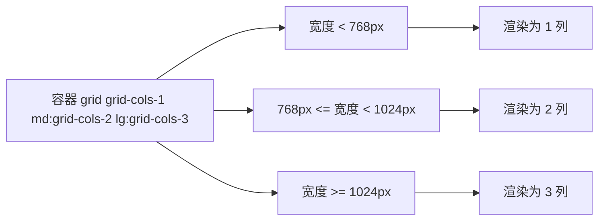

# 布局与组件

## 前言

上一章我们认识了工具类和变体前缀这些"积木"。本章解决两个实际问题：
一是**布局套路**——居中、栅格、响应式网格这几种高频版式如何用类组合出来；
二是**组件化组织**——当同一段类串反复出现时，代码该怎么管理：
直接复制、`@apply` 抽取，还是交给 React/Vue 组件层。

本章所有示例均为完整 HTML 片段，配合 CDN 引入即可运行。
前置阅读：[[前端开发/02-CSS框架/Tailwind-CSS/01-Tailwind基础|Tailwind 基础]]。

---

## 一、布局三套路

### 1.1 水平垂直居中：flex 一把梭

传统 CSS 居中要背好几套方案（margin auto、绝对定位 + translate、
line-height hack），Tailwind 时代基本统一为一行：

```html
<div class="flex items-center justify-center h-screen">
  <div class="bg-white p-8 rounded-xl shadow">我在正中间</div>
</div>
```

对应原生属性：`display:flex` + `align-items:center`（主轴为水平时管垂直对齐）
+ `justify-content:center`。若忘了为什么这两个属性能实现居中，
回到 [[前端开发/01-基础/CSS/03-Flexbox布局|Flexbox 布局]] 复习一遍主轴与交叉轴。

单行文本的简单场景也可以用 `leading` 技巧，但 flex 方案通用性最好，
推荐形成肌肉记忆。

### 1.2 等距栅格：grid + gap

```html
<div class="grid grid-cols-3 gap-4">
  <div class="bg-white rounded-lg p-6 shadow">第一列</div>
  <div class="bg-white rounded-lg p-6 shadow">第二列</div>
  <div class="bg-white rounded-lg p-6 shadow">第三列</div>
</div>
```

要点：

- `grid-cols-3` 生成 `grid-template-columns: repeat(3, minmax(0, 1fr))`，
  `minmax(0,1fr)` 保证子元素内容过宽时不会撑破列宽；
- `gap-4` 同时控制列间距与行间距；只需控制一个方向用 `gap-x-*` / `gap-y-*`；
- 不等宽混排用 `col-span-*`，例如侧边栏加主内容：

```html
<div class="grid grid-cols-4 gap-4">
  <aside class="col-span-1 bg-slate-100 p-4 rounded-lg">侧栏</aside>
  <main class="col-span-3 bg-white p-4 rounded-lg">主区</main>
</div>
```

### 1.3 响应式网格：断点前缀改列数

```html
<div class="grid grid-cols-1 sm:grid-cols-2 lg:grid-cols-3 xl:grid-cols-4 gap-6">
  <!-- 放任意多张卡片 -->
</div>
```

这是电商列表、博客列表、作品集最常用的骨架：手机一列、平板两列、
笔记本三列、大屏四列，全部写在容器一个 class 里，不需要写任何媒体查询。



记忆口诀：**默认给手机定样式，断点前缀只做"升级覆盖"**，
与手写 min-width 媒体查询的心智完全一致。

---

## 二、组件化组织：重复的类串放哪里

原子化的代价很快显现：十个卡片就有十份相同的 `rounded-lg bg-white p-6 shadow`
类串。三种应对策略，各有适用场景。

### 2.1 策略一：直接复制类串

纯静态页面、原型阶段，直接复制是最快的。缺点是改一处样式要全局替换。
只要项目还没定型，不必过早抽象。

### 2.2 策略二：@apply 抽取到 CSS

`@apply` 允许在自定义 CSS 里"调用"工具类，把重复类串收拢成一个语义类名：

```css
/* input.css 或组件内 <style> */
@tailwind base;
@tailwind components;
@tailwind utilities;

@layer components {
  .btn-primary {
    @apply px-4 py-2 rounded-lg bg-blue-500 text-white font-medium
           hover:bg-blue-600 focus:ring-2 focus:ring-blue-300 transition-colors;
  }
  .card {
    @apply bg-white rounded-xl shadow-md overflow-hidden;
  }
}
```

```html
<button class="btn-primary">保存</button>
<article class="card">...</article>
```

**何时该用 @apply vs 直接写类的争论**，社区的主流共识是：

| 场景 | 建议 |
| --- | --- |
| 全站复用超过三五处的基础元件（按钮/输入框） | 可以 @apply 收拢 |
| 只出现一两次的局部版式 | 直接写类，别抽 |
| 在 React/Vue 组件里 | 优先组件 props 复用，一般不需要 @apply |
| 大量使用 @apply 把 Tailwind 写回传统 CSS | 反模式，失去原子化收益 |

一句话：`@apply` 是逃生舱不是主干道。如果你发现每个组件都在 @apply，
说明你在用旧习惯写新框架，不如直接换 Bootstrap（见本库 Bootstrap5 章节）。

### 2.3 策略三：组件框架配合（推荐的正道）

React/Vue 项目里，类串写在组件内部一次，实例化多少次都不重复：

```jsx
// React: Card.jsx —— 类串只存在一份
function Card({ title, excerpt, tag }) {
  return (
    <article className="w-full bg-white rounded-xl shadow-md overflow-hidden
                        hover:-translate-y-1 hover:shadow-lg transition-all">
      <div className="p-5">
        {tag && (
          <span className="inline-block text-xs bg-blue-100 text-blue-700
                           px-2.5 py-0.5 rounded-full">{tag}</span>
        )}
        <h2 className="mt-3 text-lg font-bold text-gray-900">{title}</h2>
        <p className="mt-2 text-sm text-gray-500 leading-relaxed line-clamp-2">
          {excerpt}
        </p>
      </div>
    </article>
  );
}

// 用法: 变体通过 props 控制，而不是写新的 CSS 类
<Card tag="教程" title="标题" excerpt="摘要..." />
```

需要"同一组件多种外观"时，常见做法是把类串按变体映射成对象：

```jsx
const BTN = {
  primary: "bg-blue-500 hover:bg-blue-600 text-white",
  ghost:   "bg-transparent hover:bg-gray-100 text-gray-700",
  danger:  "bg-red-500 hover:bg-red-600 text-white",
};
const SIZE = {
  sm: "px-2.5 py-1 text-sm",
  md: "px-4 py-2",
};

function Button({ variant = "primary", size = "md", children, ...rest }) {
  return (
    <button
      {...rest}
      className={`rounded-lg font-medium transition-colors
                  ${BTN[variant]} ${SIZE[size]}`}
    >
      {children}
    </button>
  );
}
```

这就是 headless UI 库（如 class-variance-authority）解决同一问题的朴素雏形。

---

## 三、常用 UI 模式完整代码

以下五个模式是后台与官网页面的基本件，建议逐个敲一遍。
统一使用 CDN 引入，每个片段可直接粘进 body 运行。

### 3.1 导航栏

```html
<nav class="bg-white border-b border-gray-200 sticky top-0 z-50">
  <div class="max-w-6xl mx-auto px-4 h-14 flex items-center justify-between">
    <a href="#" class="text-lg font-bold text-gray-900">RootStack</a>
    <ul class="hidden md:flex items-center gap-6 text-sm text-gray-600">
      <li><a href="#" class="hover:text-blue-600">文档</a></li>
      <li><a href="#" class="hover:text-blue-600">教程</a></li>
      <li><a href="#" class="text-blue-600 font-medium">CSS 框架</a></li>
    </ul>
    <button class="hidden md:block px-3 py-1.5 text-sm rounded-lg
                   bg-blue-500 text-white hover:bg-blue-600">
      登录
    </button>
    <!-- 移动端汉堡按钮: md 以下显示 -->
    <button class="md:hidden p-2 text-gray-500" aria-label="菜单">
      <svg class="w-5 h-5" fill="none" stroke="currentColor" stroke-width="2"
           viewBox="0 0 24 24"><path d="M4 6h16M4 12h16M4 18h16"/></svg>
    </button>
  </div>
</nav>
```

设计决策逐条拆解：

- `sticky top-0 z-50`：吸顶并压住后续内容，z-50 是惯用的浮层级；
- `max-w-6xl mx-auto`：限宽居中，超宽屏下导航不会拉满整条；
- 菜单链接组 `hidden md:flex`：移动端藏起，桌面端横排；
- 汉堡按钮 `md:hidden`：与上一条互补，两端各显其时；
- 当前页高亮用 `text-blue-600 font-medium` 直接标出。

### 3.2 按钮组

```html
<div class="flex gap-3 p-6">
  <button class="px-4 py-2 rounded-lg bg-blue-500 text-white text-sm
                 font-medium hover:bg-blue-600 active:bg-blue-700
                 focus:outline-none focus:ring-2 focus:ring-blue-300
                 transition-colors">主要操作</button>
  <button class="px-4 py-2 rounded-lg bg-white text-gray-700 text-sm
                 font-medium border border-gray-300 hover:bg-gray-50
                 transition-colors">次要操作</button>
  <button class="px-4 py-2 rounded-lg text-red-600 text-sm font-medium
                 bg-red-50 hover:bg-red-100 transition-colors">危险操作</button>
</div>
```

三个按钮共用尺寸类（`px-4 py-2 rounded-lg text-sm font-medium`），
差异只在颜色层。这正是 2.3 节按钮组件抽取的现实依据。

### 3.3 表单输入框（focus ring）

```html
<form class="max-w-sm mx-auto p-6 bg-white rounded-xl shadow space-y-4">
  <div>
    <label for="email" class="block text-sm font-medium text-gray-700 mb-1">
      邮箱
    </label>
    <input id="email" type="email" placeholder="you@example.com"
           class="w-full px-3 py-2 rounded-lg border border-gray-300
                  text-sm placeholder:text-gray-400
                  focus:outline-none focus:ring-2 focus:ring-blue-500
                  focus:border-blue-500 transition" />
  </div>
  <p class="text-xs text-gray-400">我们会给你发送验证邮件。</p>
  <button type="submit"
          class="w-full py-2 rounded-lg bg-blue-500 text-white text-sm
                 font-medium hover:bg-blue-600 transition-colors">
    订阅
  </button>
</form>
```

`focus:outline-none` 必须搭配 `focus:ring-*` 使用——去掉浏览器默认黑框的同时
给出更柔和的聚焦指示，保证键盘可达性不被破坏。`space-y-4` 给表单项之间
统一加纵向间距，比逐项写 mt 更好维护。

### 3.4 卡片列表

```html
<section class="max-w-6xl mx-auto px-4 py-12">
  <h2 class="text-2xl font-bold text-gray-900 mb-6">最新文章</h2>
  <div class="grid grid-cols-1 sm:grid-cols-2 lg:grid-cols-3 gap-6">
    <article class="group bg-white rounded-xl shadow-sm hover:shadow-md
                    overflow-hidden transition-shadow cursor-pointer">
      
      <div class="p-5">
        <span class="text-xs text-blue-600 font-medium">前端</span>
        <h3 class="mt-1 font-semibold text-gray-900 group-hover:text-blue-600">
          用 Grid 重构后台布局
        </h3>
        <p class="mt-2 text-sm text-gray-500 line-clamp-2">摘要文字占位……</p>
        <time class="block mt-3 text-xs text-gray-400">2026-08-20</time>
      </div>
    </article>
    <!-- 其余卡片结构相同，复制或由框架循环生成 -->
  </div>
</section>
```

图片悬停放大（`group-hover:scale-105`）+ 标题变色，两组动效都挂在
同一个 `group` 上，一次悬停全卡联动，细节质感立刻不同。

### 3.5 模态框（details 实现零 JS 版）

不引 JS 的轻量方案：利用 `<details>` 的开合状态控制遮罩显隐，
`<summary>` 天然就是触发器：

```html
<details>
  <summary class="inline-block px-4 py-2 rounded-lg bg-blue-500 text-white
                  cursor-pointer select-none list-none w-fit">打开模态框</summary>
  <div class="fixed inset-0 z-50 bg-black/50 flex items-center justify-center p-4">
    <div class="bg-white rounded-2xl max-w-md w-full p-6 shadow-2xl">
      <h3 class="text-lg font-bold text-gray-900">确认删除？</h3>
      <p class="mt-2 text-sm text-gray-500">删除后不可恢复，请谨慎操作。</p>
      <div class="mt-6 flex justify-end gap-3">
        <label for="modal-close"
               class="px-4 py-2 text-sm rounded-lg border border-gray-300
                      cursor-pointer hover:bg-gray-50">取消</label>
        <label for="modal-close"
               class="px-4 py-2 text-sm rounded-lg bg-red-500 text-white
                      cursor-pointer hover:bg-red-600">确认删除</label>
      </div>
    </div>
  </div>
</details>
```

点击遮罩关闭可以再加一行原生 JS：

```js
document.querySelectorAll('details .fixed.inset-0').forEach(function (backdrop) {
  backdrop.addEventListener('click', function () {
    backdrop.closest('details').removeAttribute('open');
  });
});
```

生产环境更推荐用 `<dialog>` 元素或成熟组件库；这里的价值在于理解
"模态框 = 遮罩层 + 居中面板 + 开关状态"，Tailwind 把三者都压缩成了几行类名。

---

## 四、伪元素与装饰：before: 与 after:

Tailwind 提供 `before:` / `after:` 变体操作伪元素，
必须配合 `content-['']`（生成空内容）才有盒子可渲染：

```html
<!-- 分隔线: 用 after 画一条渐变细线 -->
<h2 class="relative after:content-[''] after:absolute after:left-0
           after:-bottom-1 after:h-0.5 after:w-12
           after:bg-gradient-to-r after:from-blue-500 after:to-purple-500">
  标题下的彩色下划线
</h2>

<!-- 面包屑分隔符 -->
<nav class="flex items-center gap-2 text-sm text-gray-500">
  <a href="#" class="hover:text-blue-600">首页</a>
  <a href="#" class="before:content-['/'] before:mr-2 hover:text-blue-600">教程</a>
  <span class="before:content-['/'] before:mr-2">CSS 框架</span>
</nav>

<!-- 必填星号 -->
<label class="after:content-['*'] after:ml-0.5 after:text-red-500">
  用户名
</label>
```

适用判断与任意值语法相同：偶尔装饰用伪元素很干净；
如果某个装饰复杂且多处复用，考虑切图/SVG 或抽成组件。

---

## 五、实战：定价页三卡片区

综合运用本章内容。目标效果：三张定价卡，中间一张高亮为推荐档，
移动端纵排、桌面端三列，含完整交互态。整段可直接粘贴运行。

```html
<!DOCTYPE html>
<html lang="zh-CN">
<head>
<meta charset="UTF-8" />
<meta name="viewport" content="width=device-width, initial-scale=1.0" />
<script src="https://cdn.tailwindcss.com"></script>
</head>
<body class="bg-slate-50 font-sans">
<section class="max-w-6xl mx-auto px-4 py-16">
  <header class="text-center mb-12">
    <h2 class="text-3xl font-bold text-gray-900">选择适合你的方案</h2>
    <p class="mt-3 text-gray-500">随时升降级，无隐藏费用。</p>
  </header>

  <div class="grid grid-cols-1 md:grid-cols-3 gap-8 items-stretch">

    <!-- 基础版 -->
    <div class="flex flex-col bg-white rounded-2xl border border-gray-200 p-8">
      <h3 class="font-semibold text-gray-500">基础版</h3>
      <p class="mt-4"><span class="text-4xl font-bold text-gray-900">0</span>
        <span class="text-gray-400 text-sm">元 / 月</span></p>
      <ul class="mt-6 space-y-3 text-sm text-gray-600 flex-1">
        <li class="flex gap-2"><span class="text-green-500">已支持</span>单人协作</li>
        <li class="flex gap-2"><span class="text-green-500">已支持</span>3 个项目</li>
        <li class="flex gap-2"><span class="text-gray-300">未包含</span>自定义域名</li>
      </ul>
      <button class="mt-8 w-full py-2.5 rounded-xl border border-gray-300
                     text-sm font-medium hover:bg-gray-50 transition-colors">
        免费开始
      </button>
    </div>

    <!-- 专业版(推荐) -->
    <div class="relative flex flex-col bg-slate-900 text-white rounded-2xl p-8
                shadow-2xl md:-translate-y-3 md:scale-[1.03]">
      <span class="absolute -top-3 left-1/2 -translate-x-1/2 px-3 py-1
                   text-xs font-medium rounded-full bg-blue-500">
        最受欢迎
      </span>
      <h3 class="font-semibold text-slate-300">专业版</h3>
      <p class="mt-4"><span class="text-4xl font-bold">99</span>
        <span class="text-slate-400 text-sm">元 / 月</span></p>
      <ul class="mt-6 space-y-3 text-sm text-slate-300 flex-1">
        <li class="flex gap-2"><span class="text-green-400">已支持</span>10 人协作</li>
        <li class="flex gap-2"><span class="text-green-400">已支持</span>不限项目数</li>
        <li class="flex gap-2"><span class="text-green-400">已支持</span>自定义域名</li>
      </ul>
      <button class="mt-8 w-full py-2.5 rounded-xl bg-blue-500 text-white
                     text-sm font-medium hover:bg-blue-400 transition-colors">
        立即订阅
      </button>
    </div>

    <!-- 企业版 -->
    <div class="flex flex-col bg-white rounded-2xl border border-gray-200 p-8">
      <h3 class="font-semibold text-gray-500">企业版</h3>
      <p class="mt-4"><span class="text-4xl font-bold text-gray-900">联系我们</span></p>
      <ul class="mt-6 space-y-3 text-sm text-gray-600 flex-1">
        <li class="flex gap-2"><span class="text-green-500">已支持</span>私有化部署</li>
        <li class="flex gap-2"><span class="text-green-500">已支持</span>专属客户成功经理</li>
        <li class="flex gap-2"><span class="text-green-500">已支持</span>SLA 保障</li>
      </ul>
      <button class="mt-8 w-full py-2.5 rounded-xl bg-gray-900 text-white
                     text-sm font-medium hover:bg-gray-800 transition-colors">
        预约演示
      </button>
    </div>

  </div>
</section>
</body>
</html>
```

关键设计决策复盘：

- 三卡等高的关键是外层 `items-stretch` 加每张卡的 `flex flex-col`，
  让按钮列表 `flex-1` 吃掉剩余高度，按钮永远贴底对齐；
- 推荐卡的强调手段叠加了四层：深色底、`shadow-2xl`、
  `md:-translate-y-3` 上浮、顶部悬浮徽章——注意上浮只在 md 以上生效，
  移动端纵排时不需要制造视觉重心；
- 功能清单的绿勾/灰叉用文字色区分，避免引入图标库打断学习主线；
- 所有按钮统一圆角与字号，仅颜色分层，与 3.2 节按钮组的规范一致。

---

## 本章小结

- 居中、等距栅格、响应式网格三大套路覆盖九成日常版式需求；
- 重复类串的三种去向：先复制、必要时 @apply、组件化是正道；
- `focus:ring` 配合 `focus:outline-none` 是可达性与美观的双赢解法；
- `before:`/`after:` 变体能画分隔线、面包屑符、必填星号等轻量装饰；
- 定价页实战演示了 flex-col + flex-1 对齐底部按钮、多层强调突出推荐卡的手法。

下一章进入定制层：[[前端开发/02-CSS框架/Tailwind-CSS/03-自定义主题|自定义主题]]。
