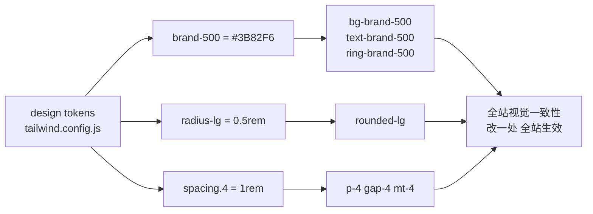
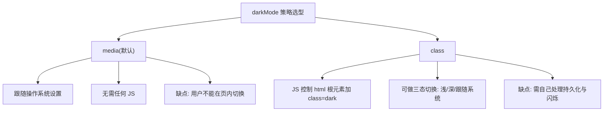
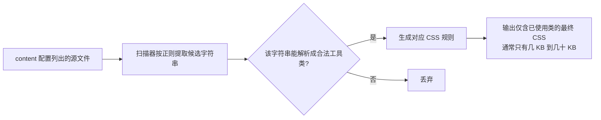

# 自定义主题

## 前言

前两章我们都在使用 Tailwind 的默认设计系统。真实项目总有品牌色、
专属字体和自己的间距规范，本章讲如何把它们注入 Tailwind：
从 `tailwind.config.js` 的 theme 配置，到暗黑模式策略、插件生态、
CSS 变量换肤，最后解释生产构建的 purge 原理——理解它，
你就明白为什么 CDN 版只能用来学习。

前置阅读：[[前端开发/02-CSS框架/Tailwind-CSS/01-Tailwind基础|Tailwind 基础]]、
[[前端开发/02-CSS框架/Tailwind-CSS/02-布局与组件|布局与组件]]。

---

## 一、tailwind.config.js 全解

### 1.1 配置文件的位置与结构

```js
/** @type {import('tailwindcss').Config} */
module.exports = {
  content: [
    './src/**/*.{html,js,jsx,ts,tsx,vue}',
    './public/index.html',
  ],
  darkMode: 'class',        // 暗黑模式策略, 见第三节
  theme: {
    extend: {               // 扩展默认主题(保留原有工具类)
      colors: { /* ... */ },
      fontFamily: { /* ... */ },
      spacing: { /* ... */ },
      screens: { /* ... */ },
    },
  },
  plugins: [],              // 官方/第三方插件挂载点
}
```

三个顶层字段各司其职：

- `content`：告诉 Tailwind 去哪些文件扫描类名，直接决定产物体积；
- `theme`：设计 token 的定义处，分 `extend`（追加）与直接覆盖两种写法；
- `plugins`：注册官方或社区插件。

### 1.2 extend 与覆盖的区别

写在 `theme.extend` 里是**追加**——默认色板照常可用；
直接写在 `theme.colors` 下则是**整体替换**——默认颜色全部消失。
绝大多数场景用 `extend`：

```js
// 覆盖式(危险): text-blue-500 将不存在
theme: {
  colors: { brand: '#2563eb' },
}

// 追加式(常用): 默认色板 + 新品牌色并存
theme: {
  extend: {
    colors: { brand: '#2563eb' },
  },
}
```

### 1.3 design token 思想

config 文件本质上是一份**设计变量集中管理表**（design tokens）。
颜色、字号、间距、圆角、阴影不再散落在各个 CSS 规则里，
而是先声明成命名 token，再由工具类引用：



这套思想与设计师交付的 Design Token 规范天然对齐：
Figma 里的色彩变量表几乎可以直接翻译成 config 里的 colors 对象。

### 1.4 常用配置维度速览

```js
theme: {
  extend: {
    // 字体族
    fontFamily: {
      sans: ['Inter', 'system-ui', 'sans-serif'],
      mono: ['JetBrains Mono', 'monospace'],
    },
    // 断点(会整体替换默认断点, 想加新档请连同旧的一起写)
    screens: {
      xs: '480px', sm: '640px', md: '768px',
      lg: '1024px', xl: '1280px',
    },
    // 阴影
    boxShadow: {
      card: '0 2px 12px rgba(15, 23, 42, 0.08)',
    },
    // 动画
    animation: {
      'fade-in': 'fadeIn .3s ease-out',
    },
    keyframes: {
      fadeIn: {
        '0%': { opacity: '0', transform: 'translateY(8px)' },
        '100%': { opacity: '1', transform: 'translateY(0)' },
      },
    },
  },
}
```

配置完成后，`font-mono`、`xs:`、`shadow-card`、`animate-fade-in`
这些类立即生效——这就是"token 进 config，类名到处用"的工作流。

---

## 二、自定义颜色：品牌色阶的 50-950 规则

### 2.1 为什么是十一档

Tailwind 每套颜色都有 50 到 950 共十一档，这不是随意设定，
而是对应一套明确的用途分工：

| 档位 | 明度 | 典型用途 |
| --- | --- | --- |
| 50-100 | 极浅 | 页面底色、选中行背景 |
| 200-300 | 浅 | 描边、hover 底色、禁用态 |
| 400 | 中浅 | 深底上的强调、图标 |
| **500** | 标准 | 主按钮、链接、品牌主色 |
| 600-700 | 中深 | hover 态、正文重点 |
| 800-950 | 深 | 标题文字、深色主题背景 |

### 2.2 手工生成品牌色阶

拿到一个品牌主色（比如 `#4F46E5`）后，围绕它向两端扩展明度：

```js
colors: {
  brand: {
    50:  '#eef2ff',
    100: '#e0e7ff',
    200: '#c7d2fe',
    300: '#a5b4fc',
    400: '#818cf8',
    500: '#6366f1',   // 与品牌主色最接近的标准档
    600: '#4f46e5',   // 常作为按钮实际底色(hover 用 700)
    700: '#4338ca',
    800: '#3730a3',
    900: '#312e81',
    950: '#1e1b4b',
  },
}
```

手工调阶的原则：

1. 相邻档位明度差均匀，肉眼过渡不跳跃；
2. 500/600 档对白色文字对比度至少 4.5:1（无障碍要求）；
3. 深色主题下常用 300-400 当文字色、900+ 当背景色。

### 2.3 工具化生成

手调十一个色值很费眼，实践中通常借助在线工具（如 uicolors.app）
从单一主色自动生成整套 Tailwind 格式色阶，再粘贴进 config。
原理都是基于 OKLCH/HSL 色彩空间做等感知明度插值。

---

## 三、暗黑模式的两种策略

### 3.1 media 策略：跟随系统（默认）

```html
<p class="text-gray-900 dark:text-gray-100">自动适配系统主题</p>
```

浏览器检测系统 `prefers-color-scheme`，用户无法在站点内手动切换。
适合内容型网站，零成本获得暗黑支持。

### 3.2 class 策略：手动切换

```js
module.exports = { darkMode: 'class' }
```

此时 `dark:` 变体只在祖先元素带有 `class="dark"` 时生效，
切换权完全交给你的代码。

### 3.3 两种策略对比



### 3.4 完整实战：给项目注入品牌主题色 + 暗黑切换

单文件演示版（CDN 通过内联 config 对象实现同样效果）：

```html
<!DOCTYPE html>
<html lang="zh-CN">
<head>
<meta charset="UTF-8" />
<script src="https://cdn.tailwindcss.com"></script>
<script>
  tailwind.config = {
    darkMode: 'class',
    theme: {
      extend: {
        colors: {
          brand: {
            50: '#eef2ff', 500: '#6366f1', 600: '#4f46e5', 700: '#4338ca',
          },
        },
      },
    },
  }
</script>
</head>
<body class="bg-gray-50 text-gray-900 dark:bg-gray-950
             dark:text-gray-100 min-h-screen transition-colors">
  <header class="max-w-4xl mx-auto px-4 py-6 flex items-center justify-between">
    <span class="text-xl font-bold text-brand-600 dark:text-brand-500">Brand</span>
    <button id="theme-toggle"
            class="px-3 py-1.5 rounded-lg border border-gray-300
                   dark:border-gray-700 text-sm hover:bg-gray-100
                   dark:hover:bg-gray-800 transition-colors">
      切换主题
    </button>
  </header>
  <main class="max-w-4xl mx-auto px-4">
    <h1 class="text-3xl font-bold">品牌主题色演示</h1>
    <p class="mt-3 text-gray-600 dark:text-gray-400">
      切换右上角按钮观察整页配色变化；所有 brand-* 类来自自定义色阶。
    </p>
    <button class="mt-6 px-5 py-2 rounded-lg bg-brand-600 text-white
                   hover:bg-brand-700 transition-colors">品牌色按钮</button>
  </main>

  <script>
    var root = document.documentElement;
    var btn = document.getElementById('theme-toggle');
    // 初始化: 读取上次的选择(localStorage), 否则跟随系统
    var saved = localStorage.getItem('theme');
    if (saved === 'dark' || (!saved && matchMedia('(prefers-color-scheme: dark)').matches)) {
      root.classList.add('dark');
    }
    btn.addEventListener('click', function () {
      root.classList.toggle('dark');
      localStorage.setItem('theme', root.classList.contains('dark') ? 'dark' : 'light');
    });
  </script>
</body>
</html>
```

工程化项目里还有一个必须处理的细节——**暗黑闪烁（FOUC）**：
页面加载到 JS 执行之间有一段空窗，若用户偏好深色但 HTML 先以浅色渲染，
会出现一次刺眼的白闪。解法是把初始化脚本以内联同步 `<script>` 放进
`<head>`，在首帧渲染前就给根元素加上 `dark` 类。

---

## 四、插件生态

### 4.1 typography：prose 排版类

长文章排版（标题层级、段落间距、引用块、代码块）如果逐元素手写类
会非常冗长。官方 typography 插件提供一个 `prose` 类一次搞定：

```bash
npm install -D @tailwindcss/typography
```

```js
plugins: [require('@tailwindcss/typography')]
```

```html
<article class="prose prose-slate lg:prose-lg max-w-none dark:prose-invert">
  <h1>渲染 Markdown 后的文章容器</h1>
  <p>内部所有 h2/h3/p/ul/blockquote/pre 自动获得合理排版。</p>
  <blockquote>这就是被美化过的引用样式。</blockquote>
</article>
```

要点：`prose` 只作用于容器内的子元素；`prose-invert` 一键反转成暗黑配色；
`lg:prose-lg` 可用响应式前缀调整整体缩放级别。

### 4.2 forms：表单重置

原生控件在不同浏览器的默认外观差异很大（checkbox、radio、select 尤甚）。
官方 forms 插件统一重置并给出合理的 focus 态：

```bash
npm install -D @tailwindcss/forms
```

```html
<!-- 引入后 checkbox/select/input 自动获得一致的现代化外观 -->
<input type="checkbox" class="rounded text-brand-600" />
<select class="rounded-md border-gray-300"></select>
```

### 4.3 line-clamp：多行截断

```html
<p class="line-clamp-3">超过三行的文本会被截断并以省略号结尾……</p>
```

较新版本 Tailwind 已将其内置为核心功能，旧版本需安装
`@tailwindcss/line-clamp` 插件。比手写 `-webkit-line-clamp` 三件套
语义清晰得多。

### 4.4 插件的通用接入方式

所有官方/第三方插件走同一套路：安装、在 `plugins` 数组里 require、
（部分插件支持传参定制）。选插件时优先看是否仍在维护、
以及它新增的工具类是否与你现有类名冲突。

---

## 五、与 CSS 变量混用：运行时换肤

config 是构建期静态的，改品牌色需要重新构建。若需求是**运行时换肤**
（用户自选主题色），把 token 定义为 CSS 变量，让 Tailwind 引用变量而非字面量：

```css
/* :root 定义变量 */
:root { --color-primary: #4f46e5; }
[data-theme='ocean'] { --color-primary: #0284c7; }
[data-theme='forest'] { --color-primary: #16a34a; }
```

```js
// config 里用 <alpha-value> 占位符声明透明度兼容
theme: {
  extend: {
    colors: {
      primary: 'rgb(var(--color-primary) / <alpha-value>)',
    },
  },
}
```

```js
// JS 切换主题: 改一个 data 属性即可
document.body.dataset.theme = 'ocean';
```

注意上面例子中变量需存成 RGB 三元组（如 `79 70 229`）才能配合
`<alpha-value>` 支持 `bg-primary/50` 这类透明度修饰符。
这是"构建期 token + 运行期变量"的双层架构，企业级多主题产品的标准做法。

---

## 六、生产构建与 purge 原理

### 6.1 为什么 CDN 版只用于开发

CDN 版把整个编译器（扫描器 + 解释器）发到浏览器：

1. 首屏要多下载数百 KB 的 JS；
2. 每次类名变化都要在运行时重新扫描 DOM 生成 CSS；
3. 无法享受压缩、缓存、按需拆分等构建优化。

所以它的定位就是"学习与原型"，上线前必须切到构建流程。

### 6.2 purge / 内容扫描的工作机制

构建版之所以体积小，靠的是**只生成你在源码里实际写过的类**：



由此推出两条纪律：

- 类名必须**完整出现**在源码里，不能运行时拼接。
  `class="text-${color}-500"` 这种模板字符串 Tailwind 扫描不到，
  正确做法是写出完整的候选类（见第二章按钮组件的对象映射写法）；
- `content` 路径要覆盖所有可能出现类名的文件（含 md、js 里的字符串），
  漏配路径的表现是"某些类的样式莫名其妙没生效"。

### 6.3 生产构建命令回顾

```bash
npx tailwindcss -i ./input.css -o ./dist/style.css --minify
# Vite 项目则直接 npm run build, 插件自动完成同样的事
```

---

## 本章小结

- config 三大字段：content 决定扫描范围，theme.extend 追加 token，plugins 挂插件；
- design token 思想把颜色/字体/间距收敛为命名变量，改动一处全站生效；
- 品牌色按 50-950 十一档组织，500/600 为标准档，可用工具从主色自动生成；
- 暗黑模式 media 策略免 JS 但不可切换，class 策略配合 localStorage 实现三态；
- typography/forms/line-clamp 三个官方插件解决长文排版、表单一致性与截断；
- 运行时换肤用 CSS 变量 + `<alpha-value>` 双层架构；
- purge 只输出源码中出现过的完整类名，这是 CDN 版不能上生产的根本原因。

下一章把全部知识投入一场综合实战：
[[前端开发/02-CSS框架/Tailwind-CSS/04-Tailwind实战：后台页面|Tailwind 实战：后台页面]]。
