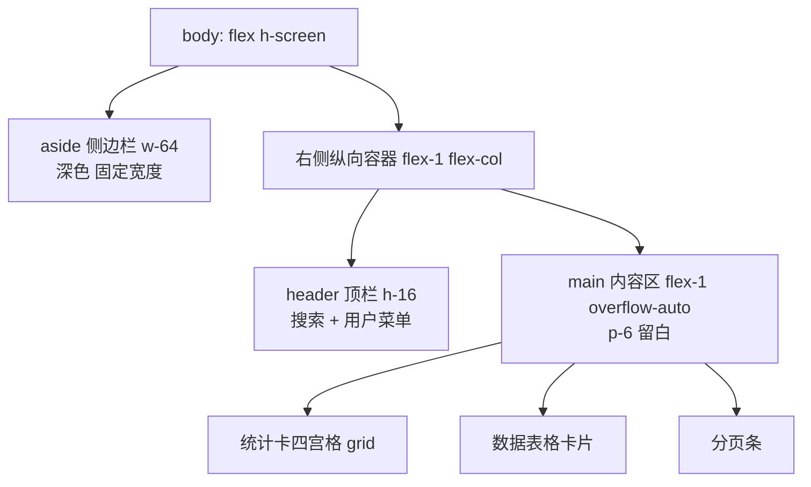

# Tailwind 实战：后台页面

## 前言

前三章分别讲了理念、布局组件与主题定制，本章进行一场综合实战：
用**纯 HTML + CDN 版 Tailwind** 写出一个结构完整的后台管理页，
单文件保存即可在浏览器运行。

页面包含后台的六个标准区块：

1. 左侧侧边栏（可折叠分组、激活态）；
2. 顶部栏（搜索框、group-hover 实现的用户菜单 dropdown）；
3. 数据统计卡四宫格；
4. 响应式数据表格（行 hover、md 以下横向滚动）;
5. 分页条;
6. 空状态占位（用于"暂无数据"场景）。

每个区块都会逐块讲解类名背后的设计决策。文末给出把这套页面
搬进 Vue/React 组件的迁移思路。

---

## 一、整体骨架与设计基调

先定全局规则：深色侧边栏 + 浅色内容区，这是中后台最经典的配色方案。
内容区最大宽度不限制（后台通常铺满），但内部卡片区域用统一留白节奏。



---

## 二、完整源码

```html
<!DOCTYPE html>
<html lang="zh-CN">
<head>
<meta charset="UTF-8" />
<meta name="viewport" content="width=device-width, initial-scale=1.0" />
<title>RootStack 后台</title>
<script src="https://cdn.tailwindcss.com"></script>
</head>
<body class="bg-gray-100 font-sans text-gray-800">

<div class="flex min-h-screen">

  <!-- ======================= 侧边栏 ======================= -->
  <aside class="w-64 shrink-0 bg-slate-900 text-slate-300 hidden md:flex
                flex-col sticky top-0 h-screen">
    <div class="h-16 flex items-center px-6 border-b border-slate-800">
      <span class="text-lg font-bold text-white">RootStack 后台</span>
    </div>

    <nav class="flex-1 py-4 space-y-1 px-3 overflow-y-auto">
      <a href="#" class="flex items-center gap-3 px-3 py-2 rounded-lg
                         bg-slate-700 text-white text-sm font-medium">
        <span class="w-2 h-2 rounded-full bg-blue-400"></span>仪表盘
      </a>
      <a href="#" class="flex items-center gap-3 px-3 py-2 rounded-lg
                         text-sm hover:bg-slate-800 hover:text-white transition-colors">
        <span class="w-2 h-2 rounded-full bg-slate-600"></span>订单管理
      </a>
      <a href="#" class="flex items-center gap-3 px-3 py-2 rounded-lg
                         text-sm hover:bg-slate-800 hover:text-white transition-colors">
        <span class="w-2 h-2 rounded-full bg-slate-600"></span>商品管理
      </a>

      <!-- 可折叠分组: 用 details/summary 实现 -->
      <details class="group">
        <summary class="flex items-center justify-between cursor-pointer
                        list-none px-3 py-2 rounded-lg text-sm select-none
                        hover:bg-slate-800 hover:text-white">
          内容管理
          <svg class="w-4 h-4 transition-transform group-open:rotate-90"
               fill="none" stroke="currentColor" stroke-width="2"
               viewBox="0 0 24 24"><path d="M9 5l7 7-7 7"/></svg>
        </summary>
        <div class="pl-8 pt-1 space-y-1">
          <a href="#" class="block px-3 py-1.5 rounded-lg text-sm
                             hover:bg-slate-800 hover:text-white">文章列表</a>
          <a href="#" class="block px-3 py-1.5 rounded-lg text-sm
                             hover:bg-slate-800 hover:text-white">分类标签</a>
        </div>
      </details>

      <a href="#" class="flex items-center gap-3 px-3 py-2 rounded-lg
                         text-sm hover:bg-slate-800 hover:text-white transition-colors">
        <span class="w-2 h-2 rounded-full bg-slate-600"></span>系统设置
      </a>
    </nav>

    <div class="border-t border-slate-800 p-4 text-xs text-slate-500">
      v1.0.0 - RootStack
    </div>
  </aside>

  <!-- ======================= 右侧主区 ======================= -->
  <div class="flex-1 flex flex-col min-w-0">

    <!-- 顶栏 -->
    <header class="h-16 bg-white border-b border-gray-200 flex items-center
                   gap-4 px-4 md:px-6 sticky top-0 z-40">
      <!-- 移动端汉堡(仅展示) -->
      <button class="md:hidden p-2 -ml-2 text-gray-500" aria-label="菜单">
        <svg class="w-5 h-5" fill="none" stroke="currentColor" stroke-width="2"
             viewBox="0 0 24 24"><path d="M4 6h16M4 12h16M4 18h16"/></svg>
      </button>

      <input type="search" placeholder="搜索订单、商品…"
             class="flex-1 max-w-md px-3 py-2 text-sm rounded-lg bg-gray-100
                    border-transparent focus:bg-white focus:border-blue-500
                    focus:ring-2 focus:ring-blue-200 outline-none transition" />

      <div class="ml-auto flex items-center gap-4">
        <button class="relative p-2 text-gray-500 hover:text-gray-800" aria-label="通知">
          <svg class="w-5 h-5" fill="none" stroke="currentColor" stroke-width="2"
               viewBox="0 0 24 24">
            <path d="M15 17h5l-1.4-1.4A2 2 0 0118 14.2V11a6 6 0 10-12 0v3.2
                     a2 2 0 01-.6 1.4L4 17h5m6 0v1a3 3 0 11-6 0v-1m6 0H9"/>
          </svg>
          <span class="absolute top-1 right-1 w-2 h-2 rounded-full bg-red-500"></span>
        </button>

        <!-- 用户菜单: group-hover 下拉 -->
        <div class="relative group">
          <button class="flex items-center gap-2 p-1.5 rounded-full
                         hover:bg-gray-100 transition-colors">
            
            <span class="hidden sm:block text-sm font-medium">管理员</span>
            <svg class="w-4 h-4 text-gray-400" fill="none"
                 stroke="currentColor" stroke-width="2" viewBox="0 0 24 24">
              <path d="M19 9l-7 7-7-7"/></svg>
          </button>
          <div class="absolute right-0 top-full mt-1 w-44 bg-white rounded-xl
                      shadow-lg border border-gray-100 py-1.5 opacity-0
                      invisible group-hover:opacity-100 group-hover:visible
                      transition-all duration-150 z-50">
            <a href="#" class="block px-4 py-2 text-sm hover:bg-gray-50">个人资料</a>
            <a href="#" class="block px-4 py-2 text-sm hover:bg-gray-50">账号设置</a>
            <hr class="my-1.5 border-gray-100" />
            <a href="#" class="block px-4 py-2 text-sm text-red-600 hover:bg-red-50">退出登录</a>
          </div>
        </div>
      </div>
    </header>

    <!-- 内容区 -->
    <main class="flex-1 p-4 md:p-6 space-y-6">

      <!-- 统计卡四宫格 -->
      <section class="grid grid-cols-1 sm:grid-cols-2 xl:grid-cols-4 gap-4">
        <div class="bg-white rounded-xl p-5 shadow-sm">
          <p class="text-sm text-gray-500">今日订单</p>
          <p class="mt-2 text-2xl font-bold">1,286</p>
          <p class="mt-1 text-xs text-green-600 font-medium">+12.4% 较昨日</p>
        </div>
        <div class="bg-white rounded-xl p-5 shadow-sm">
          <p class="text-sm text-gray-500">销售额</p>
          <p class="mt-2 text-2xl font-bold">¥86,420</p>
          <p class="mt-1 text-xs text-green-600 font-medium">+8.1% 较昨日</p>
        </div>
        <div class="bg-white rounded-xl p-5 shadow-sm">
          <p class="text-sm text-gray-500">新注册用户</p>
          <p class="mt-2 text-2xl font-bold">342</p>
          <p class="mt-1 text-xs text-red-500 font-medium">-3.2% 较昨日</p>
        </div>
        <div class="bg-white rounded-xl p-5 shadow-sm">
          <p class="text-sm text-gray-500">待处理工单</p>
          <p class="mt-2 text-2xl font-bold">17</p>
          <p class="mt-1 text-xs text-gray-400">较昨日持平</p>
        </div>
      </section>

      <!-- 数据表格 -->
      <section class="bg-white rounded-xl shadow-sm overflow-hidden">
        <div class="px-5 py-4 border-b border-gray-100 flex items-center justify-between">
          <h2 class="font-semibold">最近订单</h2>
          <button class="text-sm text-blue-600 hover:text-blue-700">查看全部</button>
        </div>

        <!-- md 以下横向滚动 -->
        <div class="overflow-x-auto">
          <table class="w-full text-sm min-w-[640px]">
            <thead>
              <tr class="text-left text-xs text-gray-500 uppercase bg-gray-50">
                <th class="px-5 py-3 font-medium">订单号</th>
                <th class="px-5 py-3 font-medium">客户</th>
                <th class="px-5 py-3 font-medium">金额</th>
                <th class="px-5 py-3 font-medium">状态</th>
                <th class="px-5 py-3 font-medium">时间</th>
              </tr>
            </thead>
            <tbody class="divide-y divide-gray-100">
              <tr class="hover:bg-gray-50 transition-colors">
                <td class="px-5 py-3 font-mono text-xs">#20260824-001</td>
                <td class="px-5 py-3">张三</td>
                <td class="px-5 py-3 font-medium">¥299.00</td>
                <td class="px-5 py-3">
                  <span class="inline-flex px-2 py-0.5 rounded-full text-xs
                               bg-green-100 text-green-700">已支付</span>
                </td>
                <td class="px-5 py-3 text-gray-500">2026-08-24 09:12</td>
              </tr>
              <tr class="hover:bg-gray-50 transition-colors">
                <td class="px-5 py-3 font-mono text-xs">#20260824-002</td>
                <td class="px-5 py-3">李四</td>
                <td class="px-5 py-3 font-medium">¥1,299.00</td>
                <td class="px-5 py-3">
                  <span class="inline-flex px-2 py-0.5 rounded-full text-xs
                               bg-amber-100 text-amber-700">待发货</span>
                </td>
                <td class="px-5 py-3 text-gray-500">2026-08-24 08:47</td>
              </tr>
              <tr class="hover:bg-gray-50 transition-colors">
                <td class="px-5 py-3 font-mono text-xs">#20260823-118</td>
                <td class="px-5 py-3">王五</td>
                <td class="px-5 py-3 font-medium">¥59.00</td>
                <td class="px-5 py-3">
                  <span class="inline-flex px-2 py-0.5 rounded-full text-xs
                               bg-red-100 text-red-700">已退款</span>
                </td>
                <td class="px-5 py-3 text-gray-500">2026-08-23 21:03</td>
              </tr>
            </tbody>
          </table>
        </div>

        <!-- 分页条 -->
        <div class="px-5 py-3 border-t border-gray-100 flex items-center
                    justify-between text-sm">
          <span class="text-gray-500">共 128 条 / 第 1 页</span>
          <nav class="flex items-center gap-1">
            <button disabled
                    class="px-3 py-1.5 rounded-lg border border-gray-200
                           text-gray-300 cursor-not-allowed">上一页</button>
            <button class="px-3 py-1.5 rounded-lg bg-blue-500 text-white">1</button>
            <button class="px-3 py-1.5 rounded-lg border border-gray-200
                           hover:bg-gray-50">2</button>
            <button class="px-3 py-1.5 rounded-lg border border-gray-200
                           hover:bg-gray-50">3</button>
            <button class="px-3 py-1.5 rounded-lg border border-gray-200
                           hover:bg-gray-50">下一页</button>
          </nav>
        </div>
      </section>

      <!-- 空状态示例 -->
      <section class="bg-white rounded-xl shadow-sm p-12 text-center">
        <div class="mx-auto w-24 h-24 rounded-full bg-gray-100 flex
                    items-center justify-center mb-4">
          <svg class="w-10 h-10 text-gray-300" fill="none" stroke="currentColor"
               stroke-width="1.5" viewBox="0 0 24 24">
            <path d="M20 13V6a2 2 0 00-2-2H6a2 2 0 00-2 2v7m16 0v5a2 2 0 01-2 2H6
                     a2 2 0 01-2-2v-5m16 0H4"/></svg>
        </div>
        <h3 class="font-semibold text-gray-700">还没有数据</h3>
        <p class="mt-1 text-sm text-gray-400">创建第一个商品后，这里会展示统计数据。</p>
        <button class="mt-4 px-4 py-2 rounded-lg bg-blue-500 text-white text-sm
                       hover:bg-blue-600 transition-colors">新建商品</button>
      </section>

    </main>
  </div>
</div>

</body>
</html>
```

---

## 三、逐块设计决策讲解

### 3.1 页面骨架

- `body > div.flex.min-h-screen`：左右两栏的水平 flex 布局；
- 侧边栏 `sticky top-0 h-screen`：滚动内容时导航始终可见，
  `hidden md:flex` 让移动端直接隐藏（真实项目换成抽屉）；
- `shrink-0` 防止侧边栏被压缩；右区 `min-w-0` 是关键细节——
  flex 子元素默认不能收缩到内容宽度以下，不加它宽表格会把布局撑破。

### 3.2 侧边栏

- 激活态：`bg-slate-700 text-white font-medium` 与普通项形成强对比，
  再加左侧圆点颜色区分（激活蓝点、普通灰点）；
- 折叠分组用 `<details>` + `<summary>` 实现，零 JS；
  箭头旋转靠 `group-open:rotate-90`——details 打开时自动获得 open 类,
  这是 Tailwind 的 open 变体与 group 变体的组合技；
- 所有链接项共用 `hover:bg-slate-800 hover:text-white` 反馈。

### 3.3 顶栏与下拉菜单

- 搜索框用灰底无边框样式（`bg-gray-100 border-transparent`），
  聚焦后变白底加 ring——"安静时低调，聚焦时醒目"是搜索框的经典交互；
- 用户菜单的核心是 `group` + 三件套：
  `opacity-0 invisible`（默认隐藏）、
  `group-hover:opacity-100 group-hover:visible`（悬停显现）、
  `transition-all duration-150`（淡入）。用 invisible 而非 hidden
  是为了保留过渡动画的空间属性；
- 通知红点用绝对定位小圆点挂在铃铛右上角。

### 3.4 统计卡四宫格

- 断点策略 `sm:grid-cols-2 xl:grid-cols-4`：手机单列、平板双列、大屏四列；
- 卡内三层信息层级：灰色小标题 → 大号数字 → 彩色涨跌标注，
  涨绿跌红符合财务直觉，持平用中性灰。

### 3.5 表格与横向滚动

响应式表格的标准解法是**外层容器滚动**而非表格本身变形：

```html
<div class="overflow-x-auto">
  <table class="w-full min-w-[640px]">...</table>
</div>
```

- `min-w-[640px]`：给表格设最小宽度，窄屏下触发容器横向滚动，
  列不再被挤变形；这里用了任意值语法，也可以进 config 定义成 token；
- `divide-y divide-gray-100`：一行代码给 tbody 行间加分隔线；
- `hover:bg-gray-50`：行级悬停高亮，配合 `text-left` 表头对齐；
- 状态徽章三色系（green/amber/red）对应三种订单状态，
  `rounded-full text-xs` 保持胶囊小巧。

### 3.6 分页条与空状态

- 当前页实心蓝底、其余页白底描边、禁用态 `disabled` 属性 +
  `text-gray-300 cursor-not-allowed` 双重弱化；
- 空状态四要素：图形位（圆形底 + 图标）、标题、说明文字、行动按钮。
  图标区刻意用极浅灰，视觉重量低于正文，避免喧宾夺主。

---

## 四、迁移到 Vue / React 的思路

这套静态页搬进框架时遵循三条原则：

1. **一个区块一个组件**：Sidebar、Header、StatCard、OrderTable、Pagination、
   EmptyState 各自成文件，页面只是它们的编排层；
2. **数据驱动重复结构**：统计卡数组 `map/v-for` 渲染，表格行由接口数据
   渲染，状态徽章的颜色映射写成对象字典：

```jsx
const STATUS = {
  paid:    { label: '已支付', cls: 'bg-green-100 text-green-700' },
  pending: { label: '待发货', cls: 'bg-amber-100 text-amber-700' },
  refund:  { label: '已退款', cls: 'bg-red-100 text-red-700' },
};

function StatusBadge({ status }) {
  const s = STATUS[status];
  return (
    <span className={`inline-flex px-2 py-0.5 rounded-full text-xs ${s.cls}`}>
      {s.label}
    </span>
  );
}
```

3. **交互态换框架机制**：dropdown 的 group-hover 可保留纯 CSS；
   但移动端抽屉、模态确认等需要状态的交互改用 useState/ref 管理，
   `<details>` 折叠分组在 React 里也可换成受控组件以支持"同时只开一组"。

完成迁移后，这个后台可以继续接入路由与真实接口，
走向 [[前端开发/08-项目实战/04-电商首页|电商首页实战]] 同栈的综合项目练习。

---

## 本章小结

- 中后台经典骨架：深色侧边栏 + 吸顶浅色顶栏 + 滚动内容区；
- flex 子元素的 `min-w-0` 与表格容器的 `overflow-x-auto` 联手解决宽表溢出；
- group-hover 三件套（opacity/invisible/transition）实现零 JS 下拉菜单；
- details 的 open 态配 `group-open:` 变体实现折叠分组箭头联动；
- 空状态 = 图形位 + 标题 + 说明 + 行动按钮四要素。

至此 Tailwind 四章完结。接下来进入另一个流派：
[[前端开发/02-CSS框架/Bootstrap5/01-Bootstrap5基础|Bootstrap5 基础]]。
