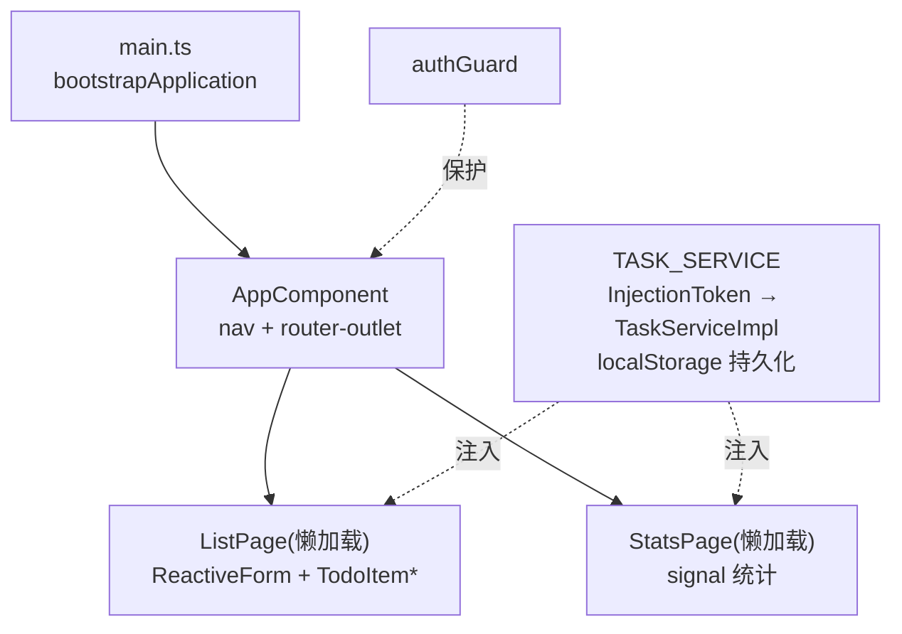

# Angular 实战：Standalone 待办应用

> 前置：[[前端开发/03-JS框架/Angular/03-路由与HTTP|路由与 HTTP]]
> 目标：用 Angular 17+ standalone 模式完成完整待办应用——组件树设计、InjectionToken 服务、双页路由、响应式表单与 signals 初探，最后总结 Angular 的适用性。

---

## 1. 项目总览

### 1.1 初始化

```bash
ng new todo-angular --standalone --style=css --skip-git
cd todo-angular
ng serve
```

`--standalone` 生成的项目没有 app.module.ts，一切从 standalone 组件出发。

### 1.2 技术要点

| 层 | 方案 | 出处 |
|----|------|------|
| 状态服务 | TaskService + InjectionToken + localStorage | 本章 |
| 路由 | 两页（列表/统计）懒加载守卫齐备 | [[前端开发/03-JS框架/Angular/03-路由与HTTP\|路由与 HTTP]] |
| 表单 | ReactiveForms 新增待办 | 同上 |
| 响应式 | signals 读态 + RxJS 补充 | 本章 |

### 1.3 组件树与服务分层



分层原则与前两章一脉相承：组件管视图，服务管数据，DI 缝合两者。

## 2. TaskService：InjectionToken 面向接口编程

### 2.1 接口 + 实现 + Token 三件

Java 同学的舒适区来了：定义接口、写实现类、注册实现——Angular 版的"面向接口 + 容器装配"：

```ts
// src/app/task.model.ts
export interface Task {
  id: number;
  text: string;
  done: boolean;
  createdAt: number;
}

export interface TaskRepository {
  getAll(): Task[];
  add(text: string): Task;
  toggle(id: number): void;
  remove(id: number): void;
}
```

```ts
// src/app/task.service.ts
import { Injectable, signal, computed } from '@angular/core';
import { Task, TaskRepository } from './task.model';

const STORAGE_KEY = 'angular-tasks';

@Injectable({ providedIn: 'root' })
export class TaskService implements TaskRepository {
  // signals 承载状态: 任务列表
  private readonly _tasks = signal<Task[]>(this.load());

  // 对外只读信号 + 派生统计(computed 自动缓存)
  readonly tasks = this._tasks.asReadonly();
  readonly doneCount = computed(() => this._tasks().filter(t => t.done).length);
  readonly totalCount = computed(() => this._tasks().length);

  private load(): Task[] {
    try {
      const raw = localStorage.getItem(STORAGE_KEY);
      return raw ? (JSON.parse(raw) as Task[]) : [];
    } catch {
      return [];
    }
  }

  private persist() {
    localStorage.setItem(STORAGE_KEY, JSON.stringify(this._tasks()));
  }

  getAll(): Task[] {
    return this._tasks();
  }

  add(text: string): Task {
    const task: Task = { id: Date.now(), text, done: false, createdAt: Date.now() };
    this._tasks.update(list => [task, ...list]);
    this.persist();
    return task;
  }

  toggle(id: number): void {
    this._tasks.update(list =>
      list.map(t => (t.id === id ? { ...t, done: !t.done } : t)),
    );
    this.persist();
  }

  remove(id: number): void {
    this._tasks.update(list => list.filter(t => t.id !== id));
    this.persist();
  }
}
```

### 2.2 InjectionToken 注册

为什么要 token 而不直接注入具体类？**解耦消费方与实现**——测试时换 InMemory 假实现，未来换 HTTP 后端实现，消费方一行不改。这正是 Spring 里 `@Autowired 接口类型` 的意义：

```ts
// src/app/task.token.ts
import { InjectionToken } from '@angular/core';
import { TaskRepository } from './task.model';

export const TASK_SERVICE = new InjectionToken<TaskRepository>('TaskRepository');
```

```ts
// main.ts —— 装配点(相当于 Spring 配置类)
bootstrapApplication(AppComponent, {
  providers: [
    provideRouter(routes, withComponentInputBinding()),
    provideHttpClient(),
    { provide: TASK_SERVICE, useClass: TaskService },   // 接口 → 实现 绑定
    provideAnimationsAsync?.(),                          // 可选动画模块
  ],
}).catch(err => console.error(err));
```

对照表：

| Spring | Angular 本例 |
|--------|--------------|
| `interface TaskRepository` | 同名 interface |
| `@Service class TaskService implements ...` | @Injectable 实现类 |
| `@Bean` / `@ConditionalOnMissingBean` | `{ provide: TOKEN, useClass: Impl }` |
| 测试时 `@MockBean` | providers 里换成 fake 对象 |

## 3. 路由装配

```ts
// src/app/app.routes.ts
import { Routes } from '@angular/router';
import { authGuard } from './auth.guard';

export const routes: Routes = [
  {
    path: '',
    canActivate: [authGuard],
    children: [
      {
        path: '',
        title: '任务列表',
        loadComponent: () =>
          import('./pages/list/list.page').then(m => m.ListPage),
      },
      {
        path: 'stats',
        title: '统计',
        loadComponent: () =>
          import('./pages/stats/stats.page').then(m => m.StatsPage),
      },
    ],
  },
  { path: 'login', loadComponent: () => import('./pages/login/login.page').then(m => m.LoginPage) },
  { path: '**', redirectTo: '' },
];
```

根组件壳：

```ts
// src/app/app.component.ts
import { Component, inject } from '@angular/core';
import { RouterOutlet, RouterLink, RouterLinkActive } from '@angular/router';

@Component({
  selector: 'app-root',
  standalone: true,
  imports: [RouterOutlet, RouterLink, RouterLinkActive],
  template: `
    <nav>
      <a routerLink="/" routerLinkActive="active">任务</a>
      <a routerLink="/stats" routerLinkActive="active">统计</a>
      <button (click)="logout()">登出</button>
    </nav>
    <router-outlet />
  `,
  styles: [`
    nav { display: flex; gap: 16px; padding: 12px 24px; border-bottom: 1px solid #eee; align-items: center; }
    .active { font-weight: bold; color: #2563eb; }
    nav button { margin-left: auto; }
  `],
})
export class AppComponent {
  logout() {
    inject; // 见下: 直接使用 AuthService
  }
}
```

修正为正式版本（inject 不该在事件处理器里调用）：

```ts
export class AppComponent {
  private auth = inject(AuthService);
  private router = inject(Router);

  logout() {
    this.auth.logout('已退出登录');
    void this.router.navigateByUrl('/login');
  }
}
```

authGuard 与 AuthService 复用 [[前端开发/03-JS框架/Angular/03-路由与HTTP|上一章]] 实现，此处不再重复。

## 4. 列表页：ReactiveForm + 子组件通信

### 4.1 列表页容器

```ts
// src/app/pages/list/list.page.ts
import { Component, inject } from '@angular/core';
import { CommonModule } from '@angular/common';
import { FormBuilder, Validators, ReactiveFormsModule } from '@angular/forms';
import { TASK_SERVICE } from '../../task.token';
import { TodoItemComponent } from './todo-item.component';

@Component({
  selector: 'app-list-page',
  standalone: true,
  imports: [CommonModule, ReactiveFormsModule, TodoItemComponent],
  template: `
    <main style="max-width:480px;margin:30px auto">
      <form [formGroup]="form" (ngSubmit)="submit()">
        <input formControlName="text" placeholder="新任务..." />
        <button [disabled]="form.invalid">添加</button>
        <span style="margin-left:12px;color:#888">
          {{ svc.doneCount() }}/{{ svc.totalCount() }} 已完成
        </span>
      </form>

      <ul style="list-style:none;padding:0">
        @for (task of svc.tasks(); track task.id) {
          <app-todo-item [task]="task"
                         (toggled)="svc.toggle(task.id)"
                         (removed)="svc.remove(task.id)" />
        } @empty {
          <p>还没有任务，添加一条吧。</p>
        }
      </ul>
    </main>
  `,
})
export class ListPage {
  svc = inject(TASK_SERVICE);            // 按 token 注入接口
  private fb = inject(FormBuilder);

  form = this.fb.nonNullable.group({
    text: ['', [Validators.required, Validators.minLength(2)]],
  });

  submit() {
    this.svc.add(this.form.getRawValue().text.trim());
    this.form.reset({ text: '' });
  }
}
```

注意模板里的 `svc.tasks()` / `doneCount()`——signal 在模板中以函数调用读取，值变即视图自动更新，无需 async 管道或手动订阅。

### 4.2 行子组件（Input/Output 实战）

```ts
// src/app/pages/list/todo-item.component.ts
import { Component, input, output } from '@angular/core';
import { Task } from '../../task.model';

@Component({
  selector: 'app-todo-item',
  standalone: true,
  template: `
    <li style="display:flex;align-items:center;gap:8px;padding:6px 0">
      <input type="checkbox" [checked]="task().done" (change)="toggled.emit()" />
      <span [style.textDecoration]="task().done ? 'line-through' : ''"
            [style.opacity]="task().done ? 0.5 : 1">{{ task().text }}</span>
      <button (click)="removed.emit()">删</button>
    </li>
  `,
})
export class TodoItemComponent {
  task = input.required<Task>();
  toggled = output<void>();
  removed = output<void>();
}
```

纯展示组件：props 进、events 出，不含任何业务逻辑——可独立替换/测试。

## 5. 统计页与 RxJS/signals 关系

```ts
// src/app/pages/stats/stats.page.ts
import { Component, inject } from '@angular/core';
import { CommonModule } from '@angular/common';
import { TASK_SERVICE } from '../../task.token';

@Component({
  selector: 'app-stats-page',
  standalone: true,
  imports: [CommonModule],
  template: `
    <main style="max-width:480px;margin:30px auto">
      <h2>完成度 {{ pct() }}%</h2>
      <div style="background:#eee;height:12px;border-radius:6px">
        <div [style.width.%]="pct()"
             style="background:#2563eb;height:100%;border-radius:6px"></div>
      </div>
      <p>共 {{ svc.totalCount() }} 条，已完成 {{ svc.doneCount() }} 条</p>
    </main>
  `,
})
export class StatsPage {
  svc = inject(TASK_SERVICE);

  pct(): number {
    const total = this.svc.totalCount();
    return total === 0 ? 0 : Math.round((this.svc.doneCount() / total) * 100);
  }
}
```

### signals 与 RxJS 的关系一句话

Angular 16 引入 **signals** 作为细粒度响应式原语：值变了只重渲依赖它的那一小片 DOM。两者分工正在演进为官方共识——

| 维度 | signals | RxJS Observable |
|------|---------|-----------------|
| 定位 | 同步状态容器 | 异步事件流水线 |
| 取值 | 随时同步取 `count()` | 订阅后回调拿值 |
| 典型场景 | 组件状态、派生计算 | HTTP 流、防抖、事件组合 |

口诀：**状态用 signal，事件流用 RxJS**。HttpClient 返回的 Observable 到手后可用 `toSignal()` 落地成 signal 参与模板渲染；本应用是本地数据所以全程 signal。React 用户对照：signal ≈ useState 但按依赖精确更新而非整组件重渲。

## 6. 构建部署

```bash
ng build --configuration production   # 产物: dist/todo-angular/browser/
```

Nginx 部署（SPA fallback 与 React/Vue 完全一致）：

```nginx
server {
  listen 80;
  root /usr/share/nginx/html;

  location / {
    try_files $uri $uri/ /index.html;   # Angular 路由刷新兜底
  }
}
```

验收清单：

- [ ] 未登录被守卫拦到登录页，登录后可进出两个页面；
- [ ] 新增/勾选/删除即时生效且刷新页面数据还在（localStorage）；
- [ ] 列表页与统计页数字实时一致（同一 service 单例）；
- [ ] Network 面板确认 stats 页是独立 chunk（懒加载生效）；
- [ ] 表单空提交被 Validators 拦截。

## 7. Angular 适用性总结

四条主线走完，给 Angular 一个公允的天平：

| 维度 | 评分倾向 | 说明 |
|------|----------|------|
| 团队规模大/流动高 | 强项 | CLI 生成器统一结构，规范自带 |
| 项目周期长(年计) | 强项 | 升级路线明确、LTS 支持 |
| 规范严格的企业系统 | 强项 | 全家桶无选型分歧，TS 强制兜底 |
| 小工具/快速原型 | 弱项 | 样板多、概念门槛高，Vue/React 更快 |
| 生态体量 | 中等 | 组件库丰富但社区创新少于 React |
| Java 团队转型前端 | 强项 | DI/装饰器/分层几乎无缝映射 |

### 与 Java 企业栈的文化契合点

回顾全篇的 [[java/java目录|Java 企业栈]] 对照：Angular 的 DI ≈ Spring IoC、装饰器元数据 ≈ 注解驱动、HttpClient 拦截器 ≈ 过滤器链、ReactiveForms 校验 ≈ Bean Validation、CLI ≈ Maven。**Spring 式全家桶 + DI + 强类型**三件文化基因让 Java 工程师在 Angular 中宾至如归——如果团队后端是 Spring，前端选 Angular 往往是最平滑的组合。

自检清单：

- [ ] 能画出本项目组件树并说出各层职责
- [ ] InjectionToken 面向接口的意义与测试换 fake 的方法
- [ ] signal/computed 的读写与自动追踪机制
- [ ] "状态用 signal，事件流用 RxJS" 分工口诀
- [ ] ng build 产物 + Nginx try_files 部署闭环

---

## 小结

| 知识点 | 一句话 |
|--------|--------|
| standalone 工程 | 无 NgModule，bootstrapApplication 直启 |
| InjectionToken | 面向接口注入，实现可整体替换 |
| signals | 细粒度响应式状态，computed 派生缓存 |
| 双页路由 | loadChildren 懒加载 + canActivate 保护 |
| 部署 | ng build 静态产物 + Nginx SPA 兜底 |
| 选型结论 | 大团队长周期严规范选 Angular，小快灵选 Vue/React |

JS 框架三部曲完结。历史遗留系统的世界见 [[前端开发/03-JS框架/AngularJS/01-AngularJS快速参考|AngularJS 快速参考]]。
