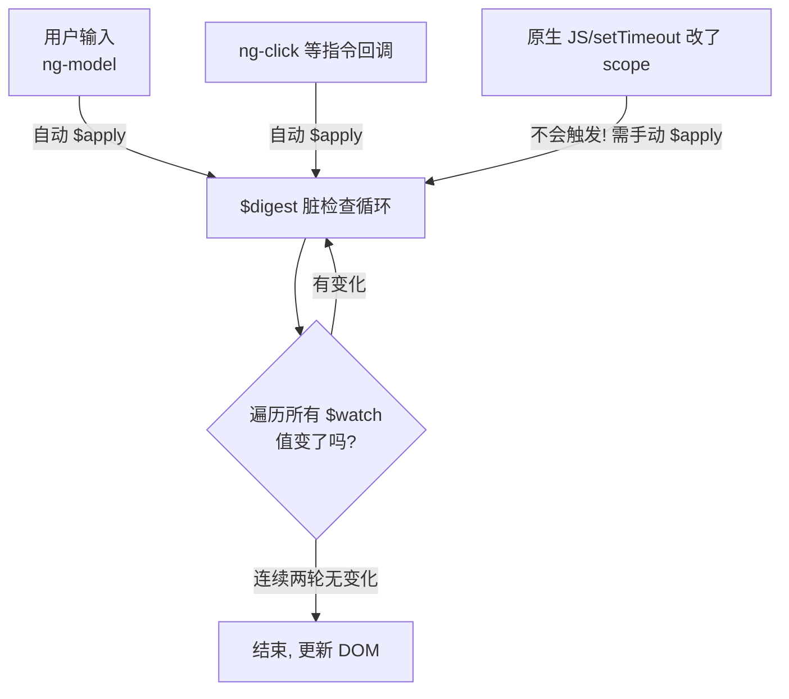
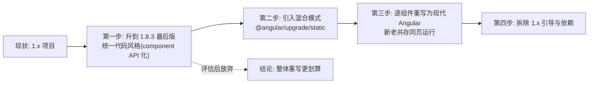

# AngularJS 快速参考：老项目生存指南

> 性质声明：AngularJS（1.x）已于 **2022 年正式 EOL**（长期支持终止，不再有任何安全补丁）。本章**仅用于阅读与维护存量老项目，严禁用于任何新项目**。新项目请直接学习 [[前端开发/03-JS框架/Angular/01-Angular基础|现代 Angular]] 或其他现代框架。

---

## 1. 定位与历史坐标

| 时间线 | 事件 |
|--------|------|
| 2010 | AngularJS 1.0 发布，开创"双向绑定"时代 |
| 2014-2016 | React/Vue 崛起，单向数据流成为主流心智 |
| 2016 | Angular 2 发布——与 1.x 完全不兼容的全新框架 |
| 2018-2021 | AngularJS 进入 LTS（仅修安全与重大缺陷）|
| 2022-01 | **LTS 结束，正式 EOL** |

为什么还要学它：国内大量企业内部系统（OA、CRM、管理后台）仍运行在 AngularJS 上，接手维护是真实的工作场景。目标不是精通，而是**能读懂、敢修改、知道雷区在哪**。

## 2. 快速上手：一个文件看懂核心概念

### 2.1 最小可运行示例

```html
<!DOCTYPE html>
<html>
<head>
  <!-- CDN 引入(1.8.x 是最后的版本线) -->
  <script src="https://cdn.jsdelivr.net/npm/angular@1.8.3/angular.min.js"></script>
</head>
<!-- ng-app: 声明应用根作用域 -->
<body ng-app="myApp">

<div ng-controller="MainCtrl">
  <h2>{{ title }}</h2>

  <!-- ng-model 双向绑定: 输入即改 scope.name -->
  <input type="text" ng-model="yourName" placeholder="输入名字">
  <p>你好，{{ yourName }}！</p>

  <!-- ng-repeat 列表 + 过滤排序管道 -->
  <ul>
    <li ng-repeat="u in users | filter:searchText | orderBy:'age'">
      {{ u.name }} - {{ u.age }} 岁
      <button ng-click="remove(u)">删</button>
    </li>
  </ul>
  <input type="text" ng-model="searchText" placeholder="过滤...">

  <p>共 {{ users.length }} 人</p>
</div>

<script>
// 模块 = 应用的命名空间
var app = angular.module('myApp', []);

// 控制器: scope 是视图与逻辑的桥梁
app.controller('MainCtrl', ['$scope', function ($scope) {
  $scope.title = 'AngularJS 快速体验';
  $scope.yourName = '';
  $scope.searchText = '';

  $scope.users = [
    { name: '张三', age: 28 },
    { name: '李四', age: 35 },
    { name: '王五', age: 22 },
  ];

  $scope.remove = function (u) {
    var i = $scope.users.indexOf(u);
    if (i > -1) $scope.users.splice(i, 1);
  };
}]);
</script>
</body>
</html>
```

保存为 index.html 双击打开即可运行（无需构建工具——这是它当年的杀手锏，也是今天仍被老系统依赖的原因）。

### 2.2 核心机制：$scope 与脏检查

理解 AngularJS 只需抓住一句话：**$scope 是控制器与模板之间的共享对象，双向绑定靠"脏检查"轮询实现**。



脏检查的后果：

- 每次 digest 遍历全部 watcher，绑定过多时性能雪崩（官方建议单页 watcher 不超 2000）；
- 数据可以随便改，框架帮你找差异——爽，但大项目不可控；
- 在 AngularJS 世界之外（setTimeout、第三方回调）改 scope 必须手动 `$scope.$apply()`，否则界面不更新——头号经典坑，第 5 节展开。

## 3. 高频特性速查

### 3.1 常用指令对照表

| AngularJS | 现代 Angular 对应 | 说明 |
|-----------|-------------------|------|
| ng-app | bootstrapApplication | 应用入口声明 |
| ng-controller | @Component 类 | 控制器已被组件取代 |
| ng-model | [(ngModel)] | 双向绑定语法进化 |
| ng-repeat | *ngFor / @for | 加 trackBy 防 DOM 重建 |
| ng-if / ng-show | @if / [hidden] | if 销毁 DOM, show 只藏 CSS |
| ng-class | [ngClass] | 基本同名 |
| ng-click | (click) | 事件从指令变括号绑定 |
| {{ }} 插值 | {{ }} 插值 | 少数原样保留的语法 |

### 3.2 自定义 directive 一例

directive 是 AngularJS 的组件前身，也是最难读的部分：

```js
// 定义一个用户卡片指令
app.directive('userCard', function () {
  return {
    restrict: 'E',                 // 用作元素 <user-card>
    scope: {                       // 隔离作用域(接口声明)
      user: '=',                   // 双向绑定传对象
      onDelete: '&'                // 传表达式(回调)
    },
    template:
      '<div class="card">' +
      '  <b>{{user.name}}</b>' +
      '  <button ng-click="onDelete({u: user})">删</button>' +
      '</div>'
  };
});
```

```html
<user-card user="u" on-delete="removeUser(u)"></user-card>
```

三种作用域符号必须认识（读老代码全靠它）：`=` 对象双向、`@` 字符串单向、`&` 表达式回调。restrict 还有 `A`（属性）/`C`（类名）等用法。

### 3.3 service 与 factory 区别

一句话：**本质都是单例服务，factory 返回任意对象，service 用构造函数 this 组装，provider 能进配置阶段**。日常写 factory 就够了：

```js
app.factory('UserService', ['$http', function ($http) {
  return {
    list: function () { return $http.get('/api/users'); },
  };
}]);
```

### 3.4 $http 已过时

$http 是当年内置的请求库，如今**已停止演进且无拦截器生态优势**，老代码里见到要心里有数：

```js
$http.get('/api/users').then(
  function (resp) { $scope.users = resp.data; },
  function (err)  { console.error(err); }
);
```

维护建议：不必迁移到 axios（引入新依赖对 EOL 项目是风险），但新写的模块如果团队已有 Promise/fetch 约定，局部使用也无妨。

### 3.5 表单与校验一瞥

老项目里表单校验靠 ng-model 的 $dirty/$invalid 状态体系（现代 ReactiveForms 的祖先）：

```html
<form name="signupForm" novalidate>
  <input type="text" name="username" ng-model="user.name"
         required ng-minlength="3">
  <!-- 状态四件套: $invalid/$touched/$dirty/$error 与现代版一脉相承 -->
  <p ng-if="signupForm.username.$touched && signupForm.username.$error.required">
    用户名必填
  </p>
  <button ng-disabled="signupForm.$invalid">提交</button>
</form>
```

### 3.6 其他必认词汇表

| 词汇 | 含义 |
|------|------|
| module | 应用/功能包的组织单位 |
| $rootScope | 全局作用域，滥用是灾难之源 |
| $timeout/$interval | 包装版定时器，改动 scope 后自动触发 digest（务必用它替代原生 setTimeout） |
| $q | Promise 实现（then/catch 风格） |
| filter | 管道，如 currency/date/filter/orderBy |
| ui-router / ngRoute | 第三方/官方路由（ui-router 更常见于老项目） |
| bower/gulp/grunt | 上古包管理与构建工具，见到别慌 |

## 4. 与现代 Angular 核心差异对照

| 维度 | AngularJS 1.x | 现代 Angular 17+ |
|------|---------------|-------------------|
| 组织单元 | controller + $scope | 组件类（standalone） |
| 视图逻辑载体 | $scope 对象 | 类成员 + signals |
| 变更检测 | 手写脏检查 digest 轮询 | Zone.js / signals 精确更新 |
| 语言 | ES5 为主，可选 TS | TypeScript 强制 |
| 异步底座 | $q/Promise | RxJS Observable |
| 组件复用 | directive（复杂三符号） | @Component 声明式 |
| 服务注册 | module.service/factory | @Injectable + DI 注入器层级 |
| 路由 | ngRoute/ui-router | @angular/router 守卫懒加载 |
| 构建 | 无构建或 gulp/grunt | CLI/AOT 编译打包 |
| 维护状态 | EOL 无补丁 | 半年一版持续演进 |

最大的两个心智翻转：

1. **$scope 消失**：模板不再通过中间人对象取值，组件类的属性就是视图的数据源；
2. **双向绑定的退位**：单向数据流 + 显式事件上报成为主流，`=` 双向隔离作用域这类"魔法"被刻意移除。

## 5. 老项目升级路径建议

### 5.1 决策先行

先回答一个问题再谈技术：**这个系统的剩余寿命还有几年？**

- 寿命 < 1 年且需求冻结 → 不动，只做安全兜底（见 5.3）；
- 还会持续迭代 → 制定渐进迁移计划；
- 战略级产品 → 直接评估重写成本，往往比迁移更划算（业务逻辑梳理清楚后用现代栈重做）。

### 5.2 渐进迁移路线



要点解读：

- **升到 1.8.3**：最后的版本线，修复了大量已知问题，且其 component API 写法与现代 Angular 组件结构相似，为重写铺路；
- **混合模式**：官方 `@angular/upgrade` 让两代框架同时引导、共享服务，按路由/按组件逐个替换，业务不停机；
- **重写优先原则**：迁移中不要"翻译"旧代码，而是借机重新设计——把 controller 里堆积的逻辑拆成服务与纯组件。

### 5.3 无法迁移时的最低限度安全动作

- 锁定 angular@1.8.3 并审计 CDN 引入改为自托管（防供应链投毒）；
- 全面 CSP 头收紧 + XSS 扫描（EOL 框架的安全债只能靠外围防御补偿）；
- 补齐冒烟测试，保证任何小改动可回归验证。

## 6. 维护老项目生存清单

这一节是本章的核心产出：改老代码前先背下来。

### 6.1 jQuery 共存问题

大量 AngularJS 项目同时引着 jQuery（历史上 jqLite 会自动升级为完整 jQuery）。雷区：

- jQuery 直接改 DOM 的部分**绕过了绑定体系**，Angular 不知道 DOM 变了，下次 digest 可能把你的改动覆盖回去——"改了又弹回"的经典现象；
- 反向同理：在 jQuery 回调里改 $scope 不触发更新；
- 共存守则：**同一块 DOM 不要两边同时管**。jQuery 插件（日期选择器等）初始化放在指令的 link/postLink 里，销毁清理放在 $destroy 监听里：

```js
app.directive('datePicker', function () {
  return {
    restrict: 'A',
    link: function (scope, element) {
      element.datepicker();                       // 初始化插件
      scope.$on('$destroy', function () {         // 作用域销毁时同步拆除
        element.datepicker('destroy');
      });
    }
  };
});
```

### 6.2 $scope.$apply 时机

规则一句话：**凡是在 AngularJS 体系之外修改了 scope，就要手动 $apply**。

典型场景清单：

| 场景 | 是否需要手动 $apply |
|------|---------------------|
| ng-click/ng-change 等指令回调 | 否（框架已包好） |
| $http/$timeout/$interval 回调 | 否（包装版自带） |
| 原生 setTimeout/setInterval 回调 | **要** |
| WebSocket/EventSource 回调 | **要** |
| jQuery 事件监听回调 | **要** |
| 第三方库异步回调（地图等） | **要** |

正确姿势（防重复 apply 报错）：

```js
setTimeout(function () {
  $scope.$apply(function () {     // 把修改包进 apply, 它自带异常保护
    $scope.message = '来自原生定时器';
  });
}, 1000);

// 或者只通知不包裹(已在 Angular 上下文边缘时)
if (!$scope.$$phase) $scope.$digest();
```

顺带记住：`$$phase` 是私有 API，只在判断边界场景使用；日常一律用 `$apply(fn)` 形式。

### 6.3 内存泄漏：$destroy 解绑

AngularJS 的三大泄漏源头与对策：

1. **$on/$watch 未注销**——controller 里 `$scope.$on('event', handler)` 返回注销函数，作用域销毁时自动解绑**顶层监听**，但挂在 $rootScope 上的监听永不自动销毁：

```js
var off = $rootScope.$on('cart:changed', refresh);   // 危险: root 级
$scope.$on('$destroy', off);                          // 必须手动配对注销
```

2. **定时器未清理**——$interval/$timeout 要在 $destroy 时 cancel，否则控制器销毁后回调还在跑并持有闭包引用；

```js
var timer = $interval(refreshStatus, 5000);
$scope.$on('$destroy', function () { $interval.cancel(timer); });
```

3. **DOM 事件/插件未拆除**——如 6.1 所示在 $destroy 中 destroy 插件、off 事件。

排查手段：Chrome DevTools Memory 面板拍堆快照对比，反复进出页面后 detached DOM tree 与 controller 实例数量只增不减即为泄漏。

### 6.4 其他高频坑速记

| 坑 | 一句话解法 |
|----|------------|
| ng-repeat 数组含重复项报错 | `track by $index` 或保证唯一 id |
| 深层对象绑定不更新 | 保持引用替换（整体赋值），或 $scope.$apply |
| ng-if 与 ng-show 选错 | 频繁切换显隐用 show，条件性存在用 if |
| 表达式里写赋值/函数定义 | 模板只放表达式，逻辑进 controller |
| $rootScope 满天飞通信 | 收敛到 service 单例做状态中心 |
| orderBy/filter 在视图里做重计算 | 数据量大改到 controller 预算，减轻 digest 负担 |
| 升级第三方插件后绑定失效 | 插件渲染的 DOM 越过了 scope，需手动 $apply 或包成 directive |

---

## 小结

| 知识点 | 一句话 |
|--------|--------|
| 定位 | 2022 年已 EOL，仅供维护老项目 |
| 核心机制 | $scope + 脏检查轮询，digest 循环驱动更新 |
| 快速上手 | ng-app/module/controller/ng-model/ng-repeat 五件套 |
| directive | scope 三符号 =/@/& 是读懂老代码的钥匙 |
| 差异总纲 | scope 消失、双向让位单向、TS+RxJS 全面换代 |
| 升级路径 | 先升 1.8 → 混合共存 → 逐个重写，或评估整体重写 |
| 生存三律 | jQuery 分而治之、域外改动手动 $apply、$destroy 配对解绑 |

读完这份参考，你已具备接手存量 AngularJS 项目的最低生存能力。新世界的入口在 [[前端开发/03-JS框架/Angular/01-Angular基础|Angular 基础]]。
