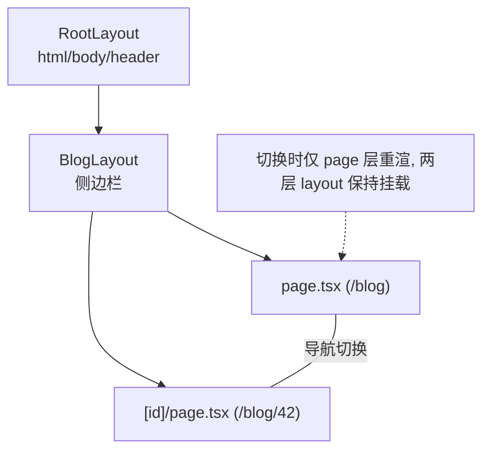

# Next.js 基础：React 全栈框架

> 前置：[[前端开发/03-JS框架/React/04-ReactRouter|React Router]]
> 目标：理解 CSR/SSR/SSG 三种渲染模式的取舍，掌握 Next.js 定位与 App Router 文件约定，搭出三页站点骨架。

---

## 1. 三种渲染模式

### 1.1 CSR：纯 React SPA 的模式

前面六章写的都是 **CSR（Client-Side Rendering）**：服务器只发一个空壳 HTML + JS bundle，页面完全由浏览器执行 JS 渲染。

代价一目了然：

- **首屏慢**：HTML → JS 下载 → 执行 → 才有内容；
- **SEO 弱**：爬虫拿到的是空 div（现代爬虫虽能执行 JS，但权重与稳定性都不如直出 HTML）；
- 内容型网站（博客/电商/官网）在这两条上不可接受。

### 1.2 SSR / SSG / ISR 概念表

| 模式 | 全称 | HTML 何时生成 | 首屏 | SEO | 服务器成本 |
|------|------|---------------|------|-----|------------|
| CSR | Client-Side Rendering | 浏览器运行时生成 | 慢 | 差 | 极低（静态托管） |
| SSG | Static Site Generation | **构建时**一次性生成 | 最快（CDN 直出） | 好 | 零（静态文件） |
| SSR | Server-Side Rendering | **每次请求**时生成 | 快 | 好 | 高（每请求都要算） |
| ISR | Incremental Static Regeneration | 构建时生成 + 后台按周期再生 | 接近 SSG | 好 | 低 |

选型直觉：

- 内容基本不变（文档、营销页）→ SSG；
- 数据频繁变化且个性化（仪表盘）→ CSR 或 SSR；
- 介于两者（博客新文章几分钟出现即可）→ ISR。

### 1.3 时序差异图

```mermaid
sequenceDiagram
    subgraph CSR
        B->>S: 请求页面
        S-->>B: 空 HTML + JS
        B->>S: 下载 JS
        B->>S: fetch 数据
        B->>B: 执行渲染, 用户才见内容
    end
    subgraph SSR
        B2->>S2: 请求页面
        S2->>D: 服务端取数据
        D-->>S2: 数据
        S2->>S2: 渲染成完整 HTML
        S2-->>B2: 可见可爬的 HTML
    end
    subgraph SSG
        Note over S3: build 阶段已生成全部 HTML
        B3->>S3: 请求页面
        S3-->>B3: CDN 直接返回现成 HTML
    end
```

SSG 本质是把 SSR 的"每次请求都算"摊销到"构建时算一次"，用新鲜度换成本——与后端缓存的思路同源。

## 2. Next.js 是什么

一句话定位：**React 全栈框架——把路由、渲染策略、API 层一体化打包**。React 官方文档也推荐新项目用 Next.js 这类框架起步。

它解决纯 Vite+React 方案的四块空白：

| 能力 | 纯 Vite+React | Next.js |
|------|---------------|---------|
| 路由 | 手动配 react-router | 文件系统即路由 |
| 渲染策略 | 只有 CSR | 每个页面可选 SSG/ISR/SSR/CSR |
| 后端接口 | 另起一个服务 | Route Handlers 内置 |
| 性能优化 | 自己攒（代码分割/图片/字体） | 内置自动优化 |

类比 Spring Boot 之于 Spring Framework：前者是"约定大于配置"的全家桶封装。Next.js 之于 React，正是这层关系。

## 3. 创建项目

```bash
npx create-next-app@latest my-site --typescript --tailwind --eslint --app
cd my-site
npm run dev      # http://localhost:3000
```

交互式选项建议：TypeScript 要、Tailwind 要、App Router 必须要（本章及后续全部基于 App Router）、src 目录随意、import alias 默认 `@/`。

生成的核心结构：

```text
my-site/
├── app/
│   ├── layout.tsx          # 根布局（必须）
│   ├── page.tsx            # "/" 首页
│   └── globals.css
├── next.config.js
└── package.json            # scripts: dev/build/start
```

三条命令对应三种环境：`dev` 开发热更、`build` 生产构建（此时执行所有 SSG 预渲染）、`start` 跑生产服务器。

## 4. App Router：文件约定即路由

### 4.1 哲学差异

react-router 是**显式配置**：一张路由表写清楚 URL→组件映射；App Router 是**文件约定**：文件夹名就是路径段，特殊文件名承担固定职责。

```text
app/
├── page.tsx        → 渲染该段 URL 的页面 UI（公开路由）
├── layout.tsx      → 包裹子树的持久化布局
├── loading.tsx     → 该段加载时的 Suspense 兜底
├── error.tsx       → 该段渲染错误的错误边界（客户端组件）
├── not-found.tsx   → 404 兜底
├── route.ts        → API 端点（下一章）
└── [id]/
    └── page.tsx    → 动态段 /xxx/:id
```

| 特殊文件 | 职责 | react-router 对应物 |
|----------|------|---------------------|
| page.tsx | 页面内容 | element |
| layout.tsx | 共享外壳 | 布局组件 + Outlet |
| loading.tsx | 加载态 | Suspense fallback 手动包 |
| error.tsx | 错误边界 | react-error-boundary 手动包 |

约定式的收益：loading/error 这些"每个页面都需要但总被忘记"的状态变成一行文件的默认行为——正如 [[前端开发/03-JS框架/React/02-组件与JSX|组件与 JSX]] 里手动包 ErrorBoundary 的活，Next 替你干了。

### 4.2 layout 与嵌套原理

layout.tsx 必须 render children，嵌套文件夹的 layout 会层层包裹：

```tsx
// app/layout.tsx —— 根布局，全站唯一入口（html/body 只能在这里写）
export default function RootLayout({ children }: { children: React.ReactNode }) {
  return (
    <html lang="zh-CN">
      <body>
        <header>全站顶栏</header>
        {children}          {/* 子路由从这里长出来 */}
        <footer>全站底栏</footer>
      </body>
    </html>
  );
}
```

```text
app/blog/layout.tsx 存在时，/blog 下所有页面渲染为：
RootLayout > BlogLayout > BlogPage

关键性质：导航在 blog 内部跳转时，RootLayout 和 BlogLayout
不重新渲染、不丢状态——只有 page 层换血。
```



这与 [[前端开发/03-JS框架/React/04-ReactRouter|Outlet]] 的心智完全一致，只是出口由文件层级隐式声明了。

### 4.3 loading 与 error 示例

```tsx
// app/blog/loading.tsx —— 进入 /blog 任意页面时自动显示
export default function Loading() {
  return <p>文章加载中...</p>;
}
```

```tsx
'use client';   // error.tsx 必须是客户端组件（原因见下一章）

// app/blog/error.tsx
export default function ErrorPage({
  error,
  reset,
}: {
  error: Error;
  reset: () => void;
}) {
  return (
    <div>
      <p>出错了：{error.message}</p>
      <button onClick={reset}>重试</button>   {/* reset 重渲当前段落 */}
    </div>
  );
}
```

## 5. Link 组件与预取

站内导航一律用 `<Link>`（等价 react-router 的 Link/NavLink）：

```tsx
import Link from 'next/link';
import { usePathname } from 'next/navigation';

function Nav() {
  const pathname = usePathname();              // 当前路径（客户端 Hook）
  return (
    <nav>
      {/* className 函数式用法实现高亮 */}
      <Link className={pathname === '/' ? 'active' : ''} href="/">首页</Link>
      <Link className={pathname.startsWith('/blog') ? 'active' : ''} href="/blog">博客</Link>
      <Link href="/about">关于</Link>
    </nav>
  );
}
```

预取机制是 Link 的隐藏王牌：

- 视口内出现的 `<Link>`，其目标路由的 payload 会被**后台静默预取**；
- 点击瞬间几乎零延迟完成切换；
- 动态路由默认只预取 loading 层，避免预取风暴（细节下章展开）。

编程式跳转则用 useRouter（注意从 `next/navigation` 导入，不是老的 next/router）：

```tsx
'use client';
import { useRouter } from 'next/navigation';

const router = useRouter();
router.push('/dashboard');
router.replace('/login');
router.back();
```

## 6. 实战：三页站点骨架

目标：首页（静态）+ 博客列表（占位数据）+ 关于页，体验文件路由、嵌套 layout、loading/error 全套约定。

### 6.1 目录

```text
app/
├── layout.tsx
├── page.tsx                 # 首页
├── about/
│   └── page.tsx             # /about
└── blog/
    ├── layout.tsx           # 博客区共享侧栏
    ├── loading.tsx
    ├── page.tsx             # /blog 列表
    └── [slug]/
        └── page.tsx         # /blog/:slug 详情（下章填肉）
```

### 6.2 根布局与首页

```tsx
// app/layout.tsx
import Link from 'next/link';
import './globals.css';

export const metadata = {
  title: '我的站点',
  description: 'Next.js 学习中',
};

export default function RootLayout({ children }: { children: React.ReactNode }) {
  return (
    <html lang="zh-CN">
      <body style={{ fontFamily: 'system-ui' }}>
        <nav style={{ display: 'flex', gap: 16, padding: 16 }}>
          <Link href="/">首页</Link>
          <Link href="/blog">博客</Link>
          <Link href="/about">关于</Link>
        </nav>
        <main style={{ maxWidth: 720, margin: '0 auto' }}>{children}</main>
      </body>
    </html>
  );
}
```

`export const metadata` 是 Next 的 SEO 元数据约定——对比 CSR 时代手改 document.title 的土法，这是框架级支持。

```tsx
// app/page.tsx
import Link from 'next/link';

export default function HomePage() {
  return (
    <>
      <h1>欢迎</h1>
      <p>这是一个 App Router 骨架站。</p>
      <Link href="/blog">去看看博客 →</Link>
    </>
  );
}
```

### 6.3 关于页与博客区

```tsx
// app/about/page.tsx
export const metadata = { title: '关于我们' };

export default function AboutPage() {
  return (
    <>
      <h1>关于</h1>
      <p>本站用于练习 Next.js App Router。</p>
    </>
  );
}
```

```tsx
// app/blog/layout.tsx
export default function BlogLayout({ children }: { children: React.ReactNode }) {
  return (
    <div style={{ display: 'flex', gap: 24 }}>
      <aside style={{ width: 140 }}>
        <p><Link href="/blog">全部文章</Link></p>
        <p><Link href="/blog?tag=next">Next 系列</Link></p>
      </aside>
      <section style={{ flex: 1 }}>{children}</section>
    </div>
  );
}
```

```tsx
// app/blog/page.tsx
const POSTS = [
  { slug: 'hello-next', title: '你好 Next' },
  { slug: 'app-router', title: 'App Router 入门' },
];

export default function BlogList() {
  return (
    <ul>
      {POSTS.map(p => (
        <li key={p.slug}><Link href={`/blog/${p.slug}`}>{p.title}</Link></li>
      ))}
    </ul>
  );
}
```

```tsx
// app/blog/loading.tsx
export default function Loading() {
  return <p>文章区加载中...</p>;
}
```

验证清单（`npm run dev` 后）：

- [ ] 三个导航互跳正常，博客区内切换时左侧栏不闪（layout 持久）；
- [ ] view-source 查看 `/` 能看到完整内容（服务端直出，非空壳 div）；
- [ ] 点击链接前悬停，Network 面板可见预取请求；
- [ ] 访问不存在的 `/blog/xyz` 暂时显示默认 404（下章补详情页）；
- [ ] `npm run build && npm start` 生产模式下首页为 SSG 静态输出（构建日志可见 ○ 标记）。

自检清单：

- [ ] 三种渲染模式的成本/SEO/首屏取舍说得出
- [ ] App Router 文件约定四件套职责分清
- [ ] layout 嵌套且跨导航持久，page 层才换血
- [ ] Link 自带视口预取，usePathname 做高亮
- [ ] metadata 导出替代手改 title

---

## 小结

| 知识点 | 一句话 |
|--------|--------|
| 渲染三模式 | SSG 构建时直出、SSR 每请求直出、CSR 浏览器渲染 |
| Next 定位 | React 的全栈框架：路由+渲染+API 一体化 |
| 文件约定 | page/layout/loading/error 各司其职 |
| Layout | 嵌套包裹、导航间持久不重渲 |
| Link | 视口预取让站内导航近零延迟 |
| metadata | 导出常量即 SEO 元数据 |

渲染策略如何按页精细控制？深入服务端组件：[[前端开发/03-JS框架/Next.js/02-SSR与SSG|SSR 与 SSG]]。
