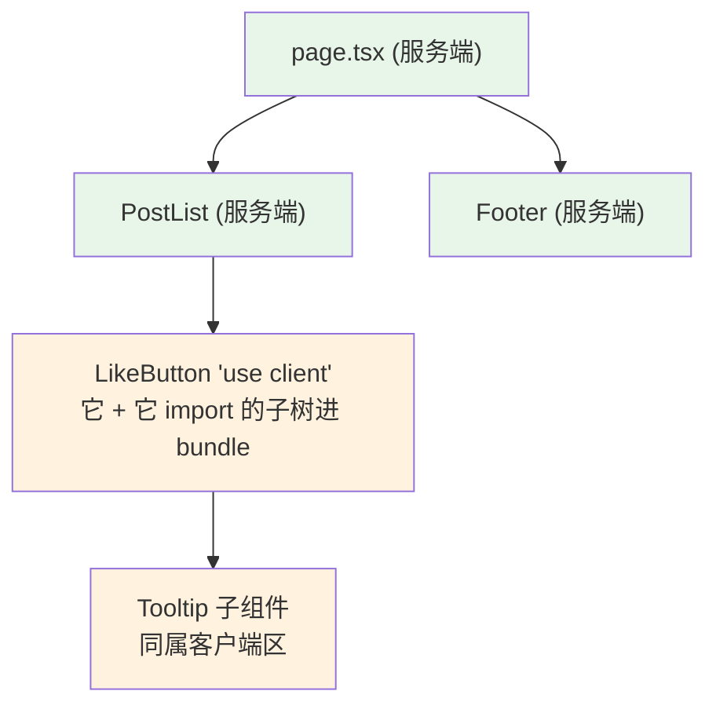
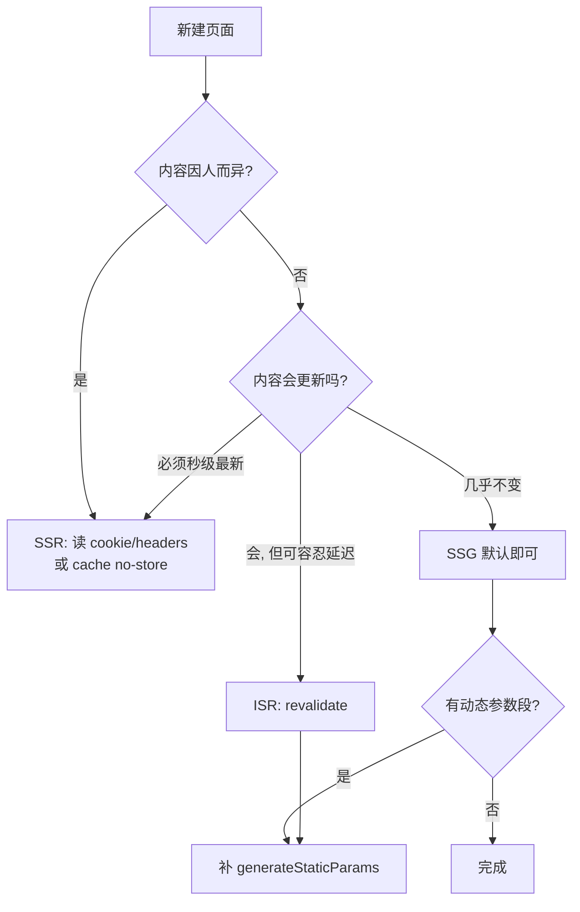

# SSR 与 SSG：服务端组件与渲染策略

> 前置：[[前端开发/03-JS框架/Next.js/01-Next.js基础|Next.js 基础]]
> 目标：理解 RSC 服务端组件模型与 'use client' 边界，掌握服务端数据获取新范式与四种渲染策略的按页选择，完成博客列表 SSG + 详情 ISR 实战。

---

## 1. React Server Components（RSC）

### 1.1 核心思想

App Router 下**所有组件默认是服务端组件（RSC）**：它们只在服务器上执行一次，输出序列化的 UI 描述发给客户端，**组件代码本身不进 JS bundle**。

这带来一个颠覆性收益：零客户端成本地使用"重依赖"。数据库驱动包、markdown 解析器、语法高亮库——随便 import，用户浏览器一行都不用下载。

```tsx
// 这个组件跑在服务器上, highlight.js 的几百 KB 永远不进 bundle
import hljs from 'highlight.js';       // 仅服务器执行
import { readFile } from 'fs/promises';

export default async function Post({ file }: { file: string }) {
  const raw = await readFile(`./posts/${file}`, 'utf-8');
  return <article dangerouslySetInnerHTML={{ __html: hljs.highlight(raw, { language: 'ts' }).value }} />;
}
```

对照 CSR：以前想在页面里用 fs/highlight.js 是天方夜谭，现在只是普通 import。RSC 把"前端组件"重新变回了"可以在任何地方运行的 UI 函数"。

### 1.2 'use client' 边界

一旦组件需要交互能力，在文件顶部声明 `'use client'`：

```tsx
'use client';

import { useState } from 'react';

export default function LikeButton() {
  const [count, setCount] = useState(0);
  return <button onClick={() => setCount(c => c + 1)}>赞 {count}</button>;
}
```

关键认知：`'use client'` 不是"这个文件在客户端运行"，而是**边界声明——从这个文件开始向 import 方向的所有模块都打包进客户端 bundle**。它是入口标记，不是作用域开关。



### 1.3 什么组件必须客户端

判断清单——命中任一条就加 `'use client'`：

1. 用了 `useState/useEffect/useReducer` 等 Hook；
2. 绑定了事件处理器 `onClick/onChange...`；
3. 使用仅浏览器 API：localStorage、window、IntersectionObserver；
4. 用了 class 组件或依赖 render props 的第三方库。

反过来说，纯展示、取数、排版组件一律保持服务端身份，能不写就不写 `'use client'`。经验比例：真实项目里客户端组件往往只占两三成。

服务端/客户端组件能力对照表：

| 能力 | 服务端组件 | 客户端组件 |
|------|-----------|-----------|
| useState/useEffect | 不可用 | 可用 |
| 访问 DB/fs/密钥 | 可以 | 不可以 |
| 打进 bundle | 否 | 是 |
| 作为 children 传给对方 | 可以 | 只能以 props 传入 |

最后一行的实践含义：**把交互做薄、把内容做厚**——客户端组件只包按钮和表单，重内容作为 children 从服务端传进去，bundle 保持苗条。

## 2. 数据获取：范式转变

### 2.1 从 useEffect 轮回到直接 await

CSR 时代的数据获取三件套（useState + useEffect + loading 态）在服务端组件里被压缩成一个 await：

```tsx
// app/users/page.tsx —— 服务端组件直接异步
type User = { id: number; name: string };

export default async function UsersPage() {
  const res = await fetch('https://api.example.com/users');
  const users: User[] = await res.json();     // 就这么直白

  if (!users.length) return <p>暂无用户</p>;

  return (
    <ul>
      {users.map(u => <li key={u.id}>{u.name}</li>)}
    </ul>
  );
}
```

对比 [[前端开发/03-JS框架/React/03-Hooks深入|Hooks 深入]] 里的版本：没有 useEffect、没有依赖数组、没有竞态 ignore flag、没有 loading state——因为组件本身就是异步的，HTML 直出到用户眼前时数据已经在里面了。

Spring 类比：从"前端自己调接口再拼页面"变成 Controller 里先查 Service 再返回 Model——渲染前完成取数，正是传统 MVC 的顺序。

### 2.2 fetch 自动去重与缓存

同一渲染过程中多处调用相同 URL 的 fetch，Next 自动去重只发一次；默认结果会被缓存（GET 请求）。需要绕开缓存时显式声明：

```tsx
// 强制每次请求实时拉取
await fetch(url, { cache: 'no-store' });

// 定向再验证: 至多 60 秒新鲜, 期间复用缓存
await fetch(url, { next: { revalidate: 60 } });
```

三个档位对应三种心智：静态缓存（默认）、ISR 周期刷新（revalidate）、动态直连（no-store）。这与后端的缓存策略设计完全同构。

### 2.3 数据获取位置的选择

| 数据特征 | 推荐做法 |
|----------|----------|
| 页面主体内容 | 服务端组件直接 await |
| 用户专属（需 cookie 鉴权头） | 服务端读 cookies() 后转发请求 |
| 高频交互局部数据（搜索联想） | 客户端组件内 fetch/SWR |

原则：**能用服务端取就别搬去客户端**——少一次浏览器往返、少一套 loading 状态机。

## 3. 四种渲染策略按页选择

App Router 的粒度是**每个路由段独立选择策略**，由代码形态自动推导：

### 3.1 静态 SSG：generateStaticParams

动态路由想构建期生成所有实例，导出 generateStaticParams 列出参数全集：

```tsx
// app/blog/[slug]/page.tsx
export async function generateStaticParams() {
  const slugs = ['hello-next', 'app-router', 'rsc-deep'];
  return slugs.map(slug => ({ slug }));   // 构建时预渲染这三页
}

export default async function PostPage({ params }: { params: Promise<{ slug: string }> }) {
  const { slug } = await params;
  return <article>文章：{slug}</article>;
}
```

### 3.2 ISR：revalidate 秒级再生

在页面或布局中导出 revalidate 常量：

```tsx
// 该页每 300 秒允许后台再生一次: 平衡新鲜度与成本
export const revalidate = 300;

export default async function NewsPage() {
  const news = await fetch('https://api.example.com/news', {
    next: { revalidate: 300 },
  }).then(r => r.json());
  return <List items={news} />;
}
```

首个访客拿到旧 HTML 的同时后台再生，之后的新访客拿新的——陈旧窗口极短且用户永远不用等生成。

### 3.3 动态 SSR：cookies/headers/no-store

只要读取了请求级信息（cookie、searchParams），路由自动变为动态渲染：

```tsx
import { cookies } from 'next/headers';

export default async function Dashboard() {
  const token = (await cookies()).get('token')?.value;
  const data = await fetch(`${process.env.API_URL}/me`, {
    headers: { Authorization: `Bearer ${token}` },
    cache: 'no-store',           // 个性化数据必须实时
  }).then(r => r.json());
  return <h1>你好，{data.name}</h1>;
}
```

### 3.4 纯 CSR

整页客户端渲染的场景（强交互编辑器等）：page 里放一个 `'use client'` 组件壳，其余照旧。四种策略一张决策表：

| 页面特征 | 策略 | 关键代码 |
|----------|------|----------|
| 内容固定（文档/营销页） | SSG | 无需代码，默认即静态 |
| 参数有限的内容页 | SSG+参数化 | generateStaticParams |
| 更新频繁但容忍分钟延迟 | ISR | export const revalidate = N |
| 每请求个性化 | SSR | cookies()/cache:'no-store' |
| 重交互工具型页面 | CSR | 'use client' 壳 |

### 3.5 策略判定流程



## 4. 缓存失效：revalidatePath

ISR 按"时间到"再生有时不够——发布新文章后不想等 5 分钟。按需失效用 revalidatePath/revalidateTag 在 **Server Action 或 Route Handler** 中触发：

```tsx
'use server';

import { revalidatePath } from 'next/cache';

export async function createPost(formData: FormData) {
  const title = String(formData.get('title'));
  await saveToDb({ title });

  // 让 /blog 立刻再生, 而不是等 revalidate 周期
  revalidatePath('/blog');
}
```

带标签的精细化控制：

```tsx
// 取数时打标
fetch(url, { next: { tags: ['posts'] } });

// 任意时刻精准失效该标签下全部缓存
revalidateTag('posts');
```

类比 Spring 的 `@CacheEvict`：写操作完成后主动踢掉相关缓存键，读路径继续享受缓存加速。缓存一致性的功课前后端是同一门。

## 5. 实战：博客列表 SSG + 文章详情 ISR

### 5.1 数据层：本地 markdown 模拟 CMS

用 gray-matter 解析 frontmatter，fs 读文件（注意：这些 Node API 正因为 RSC 才可用）：

```bash
npm i gray-matter
mkdir posts
```

两个示例文件 posts/hello-next.md：

```text
---
title: 你好 Next
date: 2026-08-01
---
这是第一篇文章的正文。
```

lib/posts.ts：

```ts
import fs from 'fs/promises';
import path from 'path';
import matter from 'gray-matter';

export type PostMeta = { slug: string; title: string; date: string };
export type Post = PostMeta & { content: string };

const DIR = path.join(process.cwd(), 'posts');

export async function getAllPosts(): Promise<PostMeta[]> {
  const files = await fs.readdir(DIR);
  const posts = await Promise.all(
    files.map(async f => {
      const raw = await fs.readFile(path.join(DIR, f), 'utf-8');
      const { data } = matter(raw);
      return {
        slug: f.replace(/\.md$/, ''),
        title: String(data.title ?? '无标题'),
        date: String(data.date ?? ''),
      };
    }),
  );
  return posts.sort((a, b) => b.date.localeCompare(a.date));
}

export async function getPost(slug: string): Promise<Post | null> {
  try {
    const raw = await fs.readFile(path.join(DIR, `${slug}.md`), 'utf-8');
    const { data, content } = matter(raw);
    return { slug, title: data.title ?? '无标题', date: data.date ?? '', content };
  } catch {
    return null;   // slug 不存在 → 交给 notFound()
  }
}
```

### 5.2 列表页 SSG

```tsx
// app/blog/page.tsx
import Link from 'next/link';
import { getAllPosts } from '@/lib/posts';

export default async function BlogPage() {
  const posts = await getAllPosts();
  return (
    <ul>
      {posts.map(p => (
        <li key={p.slug}>
          <Link href={`/blog/${p.slug}`}>{p.title}</Link>
          <time>{p.date}</time>
        </li>
      ))}
    </ul>
  );
}
```

无需任何配置——无动态信息参与，build 时即为静态。

### 5.3 详情页 ISR + 404 处理

```tsx
// app/blog/[slug]/page.tsx
import { notFound } from 'next/navigation';
import { getAllPosts, getPost } from '@/lib/posts';
import LikeButton from './like-button';   // 客户端孤岛

// ISR: 每 60 秒后台再生
export const revalidate = 60;

export async function generateStaticParams() {
  const posts = await getAllPosts();
  return posts.map(p => ({ slug: p.slug }));   // 已知文章预渲染, 新文章走按需 ISR
}

export async function generateMetadata({ params }: { params: Promise<{ slug: string }> }) {
  const { slug } = await params;
  const post = await getPost(slug);
  return { title: post?.title ?? '文章不存在' };   // SEO 标题随内容变化
}

export default async function PostPage({ params }: { params: Promise<{ slug: string }> }) {
  const { slug } = await params;
  const post = await getPost(slug);
  if (!post) notFound();                       // 触发 not-found.tsx

  return (
    <article>
      <h1>{post.title}</h1>
      <time>{post.date}</time>
      <div style={{ whiteSpace: 'pre-wrap' }}>{post.content}</div>
      {/* 交互孤岛: 只有这个小按钮进客户端 bundle */}
      <LikeButton />
    </article>
  );
}
```

```tsx
'use client';

// app/blog/[slug]/like-button.tsx
import { useState } from 'react';

export default function LikeButton() {
  const [count, setCount] = useState(0);
  return <button onClick={() => setCount(c => c + 1)}>点赞 {count}</button>;
}
```

验证清单（`npm run build && npm start`）：

- [ ] 构建日志中 `/blog` 与三篇详情显示 ●/○ 静态标记而非 λ（λ=每请求动态）；
- [ ] 详情页 view-source 可见正文全文（SEO 友好）；
- [ ] 点赞按钮正常交互——服务端直出的页面照样有客户端孤岛；
- [ ] 访问 `/blog/not-exist` 落到 not-found 页面；
- [ ] 往 posts/ 加一篇新 md 后不重启，60 秒内访问其 URL 会按需 ISR 出页（生产模式体验）。

自检清单：

- [ ] RSC 默认服务端执行、代码不进 bundle 的收益说得清
- [ ] 'use client' 是边界入口不是运行域开关
- [ ] 四条"必须客户端"判断标准背得出来
- [ ] 服务端 await fetch 替代 useEffect 三件套，缓存三档位分清
- [ ] 四种策略的判定问题链：因人而异？→ 会更新？→ 容忍多久？
- [ ] revalidatePath/revalidateTag ≈ @CacheEvict

---

## 小结

| 知识点 | 一句话 |
|--------|--------|
| RSC | 默认服务端执行，重依赖零 bundle 成本 |
| use client | 客户区入口标记，能不写就不写 |
| 数据获取 | 服务端组件直接 await，自动去重缓存 |
| 渲染策略 | 静态默认 / revalidate 做 ISR / 请求数据转动态 |
| 按需失效 | revalidatePath/tag ≈ CacheEvict |
| 架构手法 | 内容服务端渲染，交互做成薄客户端孤岛 |

页面有了，接口怎么写？见 [[前端开发/03-JS框架/Next.js/03-路由与API|路由与 API]]。
