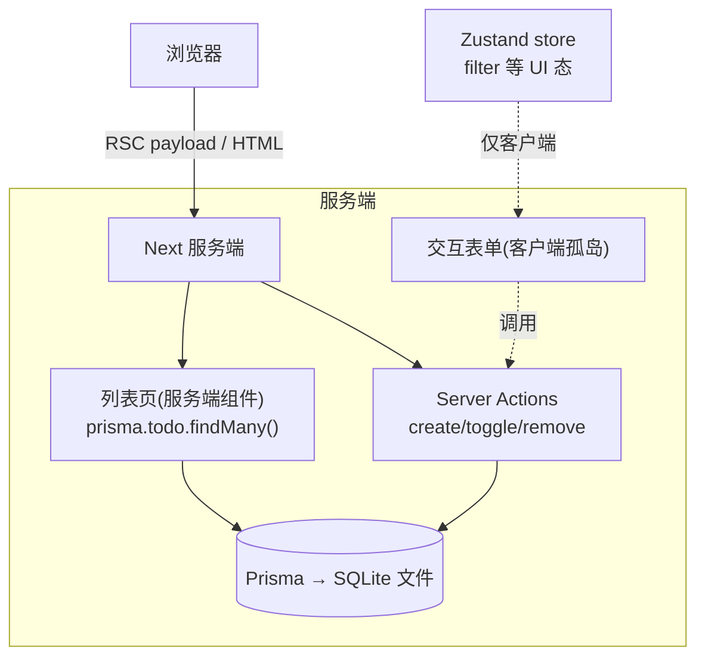
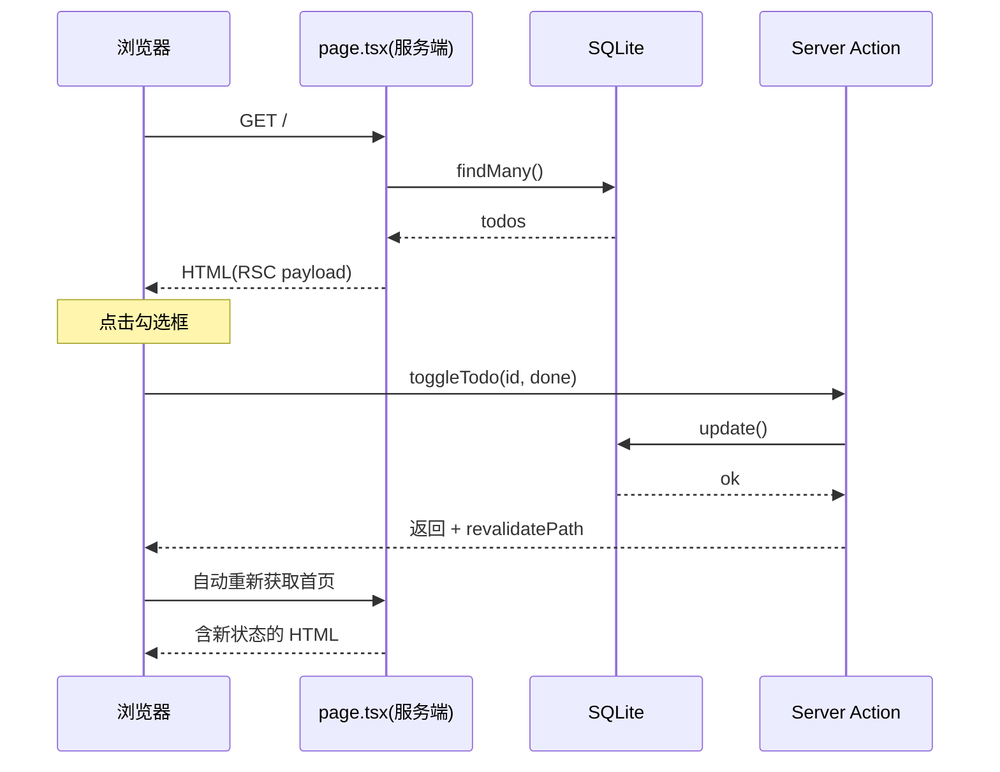

# Next.js 实战：全栈待办应用

> 前置：[[前端开发/03-JS框架/Next.js/03-路由与API|路由与 API]]
> 目标：用 Next.js App Router + TypeScript + Tailwind + Prisma + SQLite 完成单机零外部依赖的全栈待办应用，理解服务端/客户端混合架构与两种部署路径。

---

## 1. 项目总览

### 1.1 技术栈与选型理由

| 层 | 选择 | 理由 |
|----|------|------|
| 框架 | Next 14+ App Router | 文件路由 + RSC + Server Actions 一体 |
| 语言 | TypeScript | 全栈同一语言同一类型 |
| 样式 | Tailwind | 快速出活，无命名心智 |
| ORM | Prisma | schema 即文档，SQLite 零安装 |
| 数据库 | SQLite 单文件 | 单机零依赖，`npm run dev` 即全跑通 |
| UI 状态 | Zustand | 过滤器等客户端状态（对照 [[前端开发/03-JS框架/React/05-状态管理|状态管理]]） |

对比 [[前端开发/03-JS框架/React/06-React实战|React 版 TodoList Pro]]：那一版需要另起 Spring Boot 当后端；本版**前后端同仓同进程**，Server Actions 直连数据库。

### 1.2 架构图



关键设计：**读走服务端组件直查数据库，写走 Server Actions，只有交互壳是客户端组件**。UI 状态（当前过滤器）留在 Zustand——数据在服务端、视图态在客户端，各归其位。

## 2. 初始化与 Prisma 建模

```bash
npx create-next-app@latest todo-fullstack --typescript --tailwind --eslint --app
cd todo-fullstack
npm i prisma @prisma/client zustand
npx prisma init --datasource-provider sqlite
```

schema.prisma：

```prisma
// prisma/schema.prisma
generator client {
  provider = "prisma-client-js"
}

datasource db {
  provider = "sqlite"
  url      = env("DATABASE_URL")     // .env 里: file:./dev.db
}

model Todo {
  id        Int      @id @default(autoincrement())
  text      String
  done      Boolean  @default(false)
  createdAt DateTime @default(now())
}
```

生成客户端并建表：

```bash
npx prisma db push        # 同步 schema 到 SQLite 并生成 Client
```

单例连接（开发热重载下防连接泄漏的标准写法）：

```ts
// lib/prisma.ts
import { PrismaClient } from '@prisma/client';

const globalForPrisma = globalThis as unknown as { prisma?: PrismaClient };

export const prisma = globalForPrisma.prisma ?? new PrismaClient();
if (process.env.NODE_ENV !== 'production') globalForPrisma.prisma = prisma;
```

## 3. Server Actions 层

```ts
// app/actions.ts
'use server';

import { revalidatePath } from 'next/cache';
import { prisma } from '@/lib/prisma';

export async function createTodo(formData: FormData) {
  const text = String(formData.get('text') ?? '').trim();
  if (!text) return;
  await prisma.todo.create({ data: { text } });
  revalidatePath('/');
}

export async function toggleTodo(id: number, done: boolean) {
  await prisma.todo.update({ where: { id }, data: { done } });
  revalidatePath('/');
}

export async function removeTodo(id: number) {
  await prisma.todo.delete({ where: { id } });
  revalidatePath('/');
}

export async function clearDone() {
  await prisma.todo.deleteMany({ where: { done: true } });
  revalidatePath('/');
}
```

四个 action 共约 30 行完成传统意义上的 Controller+Service+DAO 三层——不是层次消失了，而是被 Server Action + Prisma 的抽象吸收了。每个写操作后 `revalidatePath('/')` 让首页缓存失效，下次访问自动带出新数据（[[前端开发/03-JS框架/Next.js/02-SSR与SSG|缓存失效]] 的实战运用）。

## 4. 组件层：混合架构

### 4.1 列表页（服务端组件）

```tsx
// app/page.tsx
import { prisma } from '@/lib/prisma';
import TodoForm from './todo-form';
import TodoRow from './todo-row';
import ClearDoneButton from './clear-button';
import FilterBar from './filter-bar';

export const dynamic = 'force-dynamic';   // 待办要求实时, 强制每请求渲染

export default async function HomePage() {
  const todos = await prisma.todo.findMany({
    orderBy: { createdAt: 'desc' },
  });

  return (
    <main className="mx-auto max-w-md p-6">
      <h1 className="mb-4 text-2xl font-bold">待办</h1>
      <TodoForm />
      <FilterBar total={todos.length} />
      <ul className="mt-4 space-y-2">
        {todos.map(t => (
          <TodoRow key={t.id} id={t.id} text={t.text} done={t.done} />
        ))}
      </ul>
      <ClearDoneButton />
    </main>
  );
}
```

注意：页面本身零 'use client'——数据获取、SQL 查询全部发生在服务器；它渲染出的 HTML 里只嵌着几个小客户端孤岛。

### 4.2 新增表单（客户端孤岛）

```tsx
'use client';

// app/todo-form.tsx
import { useRef } from 'react';
import { useFormStatus } from 'react-dom';
import { createTodo } from './actions';

function SubmitButton() {
  const { pending } = useFormStatus();   // 表单提交 pending 态
  return (
    <button
      disabled={pending}
      className="rounded bg-blue-600 px-3 py-1 text-white disabled:opacity-50"
    >
      {pending ? '添加中...' : '添加'}
    </button>
  );
}

export default function TodoForm() {
  const ref = useRef<HTMLFormElement>(null);
  return (
    <form
      ref={ref}
      action={async fd => {
        await createTodo(fd);
        ref.current?.reset();            // 提交后清空输入框
      }}
      className="flex gap-2"
    >
      <input name="text" required className="flex-1 rounded border px-2 py-1" />
      <SubmitButton />
    </form>
  );
}
```

useFormStatus 是 pending 态的官方解法——子按钮感知父表单提交状态，无需自己管 useState。

### 4.3 行组件与清除按钮（薄客户端）

```tsx
'use client';

// app/todo-row.tsx
import { useTransition } from 'react';
import { removeTodo, toggleTodo } from './actions';

type Props = { id: number; text: string; done: boolean };

export default function TodoRow({ id, text, done }: Props) {
  const [pending, start] = useTransition();

  return (
    <li className={`flex items-center gap-2 rounded border p-2 ${pending ? 'opacity-50' : ''}`}>
      <input
        type="checkbox"
        checked={done}
        onChange={() => start(() => void toggleTodo(id, !done))}
      />
      <span className={`flex-1 ${done ? 'line-through opacity-50' : ''}`}>{text}</span>
      <button onClick={() => start(() => void removeTodo(id))} className="text-red-500">
        删除
      </button>
    </li>
  );
}
```

```tsx
'use client';

// app/clear-button.tsx
import { useTransition } from 'react';
import { clearDone } from './actions';

export default function ClearDoneButton() {
  const [pending, start] = useTransition();
  return (
    <button
      disabled={pending}
      onClick={() => start(() => void clearDone())}
      className="mt-4 text-sm text-gray-500 underline"
    >
      清除已完成
    </button>
  );
}
```

useTransition 包裹 action 调用获得"操作进行中"的 UI 反馈且不阻塞输入——Server Actions 与并发特性的标配组合。

### 4.4 Zustand 管 UI 状态：过滤栏

过滤是纯视图行为（不查库也能算），按 [[前端开发/03-JS框架/React/05-状态管理|"客户端状态归 store"]] 原则放 Zustand：

```tsx
'use client';

// app/filter-bar.tsx
import { create } from 'zustand';

type FilterStore = {
  filter: 'all' | 'active' | 'done';
  setFilter: (f: 'all' | 'active' | 'done') => void;
};

export const useFilter = create<FilterStore>(set => ({
  filter: 'all',
  setFilter: filter => set({ filter }),
}));

export default function FilterBar({ total }: { total: number }) {
  const { filter, setFilter } = useFilter();
  return (
    <div className="mt-2 flex gap-2 text-sm">
      {(['all', 'active', 'done'] as const).map(f => (
        <button
          key={f}
          onClick={() => setFilter(f)}
          className={`rounded px-2 py-0.5 ${filter === f ? 'bg-blue-100 text-blue-700' : 'bg-gray-100'}`}
        >
          {f === 'all' ? `全部(${total})` : f === 'active' ? '未完成' : '已完成'}
        </button>
      ))}
    </div>
  );
}
```

（演示从简：filter 当前仅切换高亮，真正过滤可在客户端对传入列表做 useMemo，或升级为 searchParams 驱动服务端查询。）

## 5. 数据流时序



用户视角：点击后界面自动更新，全程没有手写的 fetch/refetch 代码。

## 6. 开发运行与验证

```bash
npm run dev       # http://localhost:3000
npx prisma studio # 可视化查看数据库内容
```

验证清单：

- [ ] 添加/勾选/删除即时生效，刷新后数据仍在（落了库而非内存）；
- [ ] Network 面板看不到任何自写的 fetch/XHR JSON 接口——action 走的是框架内部协议；
- [ ] dev.db 文件出现在 prisma/ 目录；
- [ ] 断网状态下页面仍能首屏打开（SSR 直出），只是 action 失败。

## 7. 部署

### 7.1 路径一：Vercel 一键

```bash
npm i -g vercel
vercel           # 首次引导登录并关联项目, 之后 push 即自动部署
```

注意点：

- SQLite 文件在 Vercel 无持久磁盘（serverless 文件系统只读/临时），**生产建议把 datasource 换成 Turso/Postgres**；
- DATABASE_URL 在 Vercel 项目 Settings→Environment Variables 配置，切勿提交 .env。

### 7.2 路径二：自托管 node server + Docker

自托管保留 Node 进程能力（SQLite 完美可用）。Dockerfile：

```dockerfile
FROM node:20-alpine AS build
WORKDIR /app
COPY package*.json ./
RUN npm ci
COPY . .
RUN npx prisma generate && npm run build

FROM node:20-alpine
WORKDIR /app
COPY --from=build /app ./
ENV NODE_ENV=production
EXPOSE 3000
CMD ["npx", "next", "start", "-p", "3000"]
```

与 [[java/3工程化/12_Docker容器化|Docker 容器化]] 的 Spring Boot 应用编排进同一个 compose（前后端同容器组、Nginx 统一入口）：

```yaml
# docker-compose.yml 节选
services:
  web:
    build: ./todo-fullstack      # 本 Next 应用
    ports:
      - "3000:3000"
    volumes:
      - todo-data:/app/prisma/db # 持久化 SQLite 文件
  api:
    build: ./java-api            # 将来的 Spring Boot 微服务
    ports:
      - "8080:8080"
volumes:
  todo-data:
```

## 8. 与 Spring Boot 分工模式总结

Next.js 进入团队后的两种主流协作形态：

| 模式 | 结构 | 适用场景 |
|------|------|----------|
| Next BFF + Java 微服务 | 浏览器 → Next(BFF: 聚合/鉴权/SSR) → Java 各微服务 | 已有 Java 后台资产，前端要 SSR/BFF 能力 |
| Next 纯前端 + Java API | Next 仅做 CSR 静态托管，接口全走 Spring | 团队 Java 主导，Next 只当"更好的 React 脚手架" |

判断口诀：**需要 SEO/首屏/BFF 选前者；只要工程化脚手架选后者**。无论哪种，[[java/3工程化/15_全栈开发技巧|Spring 接口]] 的 REST 契约都是两端的通用语言。

自检清单：

- [ ] 读路径（RSC 直查库）与写路径（Server Action）分工说得清
- [ ] revalidatePath 在每个写 action 后的必要性
- [ ] useFormStatus/useTransition 提供 pending 反馈
- [ ] Vercel 上 SQLite 不持久的坑知道绕法
- [ ] 两种部署路径各自的前置条件

---

## 小结

| 知识点 | 一句话 |
|--------|--------|
| 技术组合 | Next+Prisma+SQLite 单机全栈零外部依赖 |
| 混合架构 | 服务端读、Action 写、客户端只留交互孤岛 |
| Server Actions | 三层架构被框架抽象吸收为 30 行 |
| 部署双径 | Vercel serverless 或 Docker 自托管 node |
| 分工模式 | BFF 聚合 or 纯前端，按 SEO 需求裁决 |

JS 框架三大主线还剩 Angular，请移步 [[前端开发/03-JS框架/Angular/01-Angular基础|Angular 基础]]。
