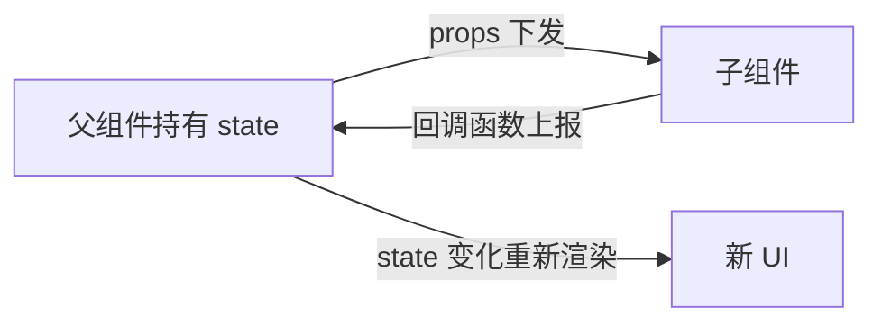

# React 基础：声明式 UI 的心智转变

> 前置：[[前端开发/01-基础/JavaScript/06-ES6+特性|ES6+ 特性]]、[[前端开发/04-DOM与交互/HTML-DOM/01-DOM基础与选择器|DOM 操作]]
> 目标：理解 React 的核心哲学 UI=f(state)，掌握 JSX、函数组件、props、useState 与受控表单，跑通第一个 Vite 项目。

---

## 1. React 理念：从"手动改 DOM"到"描述结果"

### 1.1 jQuery 范式 vs React 范式

在 [[前端开发/04-DOM与交互|DOM 与交互]] 里我们写过这样的代码：

```js
// 命令式：一步一步告诉浏览器"怎么做"
let count = 0;
$('#btn').on('click', () => {
  count++;
  $('#num').text(count);            // 手动找节点、手动更新
  if (count >= 10) $('#btn').hide(); // 手动维护每条副作用
});
```

逻辑分散在每个事件回调里：状态存在 JS 变量中，界面靠手工同步。页面一复杂，"数据到底长什么样"要从十几个回调里反推——这是 jQuery 时代项目腐化的根源。

React 的思路完全不同：

```jsx
// 声明式：只描述"长什么样"，更新交给框架
function Counter() {
  const [count, setCount] = useState(0);
  return (
    <div>
      <span>{count}</span>
      {count < 10 && (
        <button onClick={() => setCount(count + 1)}>+1</button>
      )}
    </div>
  );
}
```

核心公式一句话：**UI = f(state)**。界面永远是状态的纯函数投影——你只管修改 state，React 负责重新执行 f 并把差异应用到真实 DOM 上。

| 对比项 | jQuery（命令式） | React（声明式） |
|--------|------------------|-----------------|
| 关注点 | 怎么改 DOM | 状态是什么样 |
| 状态与视图 | 两套东西手工同步 | 单一数据源自动同步 |
| 更新方式 | 逐个节点操作 | setState 后整树重算、按需 diff |
| 心智负担 | 随复杂度线性爆炸 | 复杂度收敛到 state 设计 |

给 Java 同学的类比：jQuery 像 JDBC 手写每一行 SQL 拼接；React 像 MyBatis/JPA——你描述"要什么"，框架生成"怎么做"。声明式对命令式的胜利在前端和后端上演过同一场。

### 1.2 Virtual DOM 一句话

React 在内存里维护一棵 JS 对象树（Virtual DOM），state 变化时先重算新树，与旧树 diff 出最小改动集，再批量更新真实 DOM。**diff 细节本章不展开**，只需记住结论：diff 很快，但重渲整个组件树是默认行为——所以后面章节才需要 memo/useMemo 这些优化手段。

## 2. JSX 本质：不是模板语言

### 2.1 它是语法糖

JSX 看起来像 HTML，实际是 `React.createElement` 的语法糖，由 Babel/SWC 在构建期编译成普通 JS：

```jsx
const el = <h1 className="title">Hello</h1>;
```

编译后等价于：

```js
const el = React.createElement('h1', { className: 'title' }, 'Hello');
```

而 createElement 返回的只是一个普通 JS 对象：

```js
{
  type: 'h1',
  props: { className: 'title', children: 'Hello' }
}
```

想验证？直接打印它：

```tsx
console.log(<h1>Hi</h1>); // 输出对象，不是 DOM 节点
```

### 2.2 由"对象"推出的三条规则

既然 JSX 是 JS 表达式，一切 JS 规则都适用：

1. **class 要写成 className**——因为要挂到 props 对象上，且 class 是 JS 保留字；
2. **花括号 `{}` 内可以放任何表达式**（三元、map、函数调用），但不能放语句（if/for）；
3. **可以赋值给变量、作为参数传递、放进数组**——组件系统正是建立在这条之上。

```jsx
const user = { name: 'Alice', vip: true };

const badge = (
  <span className={user.vip ? 'badge vip' : 'badge'}>
    {user.vip ? 'VIP' : '普通用户'}
  </span>
);

const page = <div>欢迎，{user.name} {badge}</div>;
```

对比 Vue：Vue 的模板是真正的模板语言（有 v-if/v-for 等专属指令），JSX 则完全没有新增语法——会 JS 就会 JSX。代价是模板的静态分析优化（Vue3 编译期提速）React 做不了那么激进。

### 2.3 JSX 中的小坑速查

| HTML 习惯 | JSX 写法 | 原因 |
|-----------|----------|------|
| `class` | `className` | class 是保留字 |
| `for` | `htmlFor` | 同上 |
| `<br>` | `<br />` | 必须自闭合 |
| `style="color:red"` | `style={{ color: 'red' }}` | 接收对象，非字符串 |
| `onclick` | `onClick` | 合成事件驼峰命名 |
| 注释 `<!-- -->` | `{/* 注释 */}` | 注释也是 JS |

## 3. 函数组件与 props

### 3.1 组件就是返回 JSX 的函数

React 18 时代，**函数组件是绝对主流**，class 组件仅存在于老代码维护中。一个组件就是一个接收 props、返回 JSX 的普通函数：

```tsx
type Props = {
  name: string;
  age?: number;
};

function UserCard({ name, age = 18 }: Props) {
  return (
    <div className="user-card">
      <h2>{name}</h2>
      <p>年龄：{age}</p>
    </div>
  );
}

// 使用：大写开头才是组件！
<UserCard name="Alice" age={20} />
```

三条铁律：

1. **组件名必须大写开头**——小写会被当成原生 HTML 标签；
2. **props 只读**——组件不能修改自己的 props（相当于函数参数不可 reassign）；
3. **参数解构是惯用写法**——`{ name, age }` 直接从 props 对象解构，配合 TS 默认值。

Spring 类比：组件像一个无状态的 Service 方法——输入（props）确定则输出（UI）确定。可变状态另有去处（state），正如数据库状态不该藏在方法局部变量里。

### 3.2 props 可以传什么

任何合法 JS 值都可以通过 props 传递，包括组件本身：

```tsx
<Avatar src="/a.png" size={48} />
<UserCard name="Alice" tags={['admin', 'dev']} />
<Card footer={<Button text="提交" />}>   {/* 传组件——组合模式的基础 */}
  正文内容
</Card>
{children}                               {/* 标签包裹的内容就是 children prop */}
```

children 与组合模式是下一章的主题，这里先埋个种子。

### 3.3 单向数据流

数据只能从父组件经 props 流向子组件，反向只能通过回调函数"通知"父组件改数据：



这与 Vue 的 `props down / events up` 完全同构，Spring 类比则是"依赖注入的单向性"——上层组装下层，下层不应反过来拉取上层上下文。

## 4. 渲染列表与 key

数组可以直接渲染进 JSX（还记得吗？JSX 是 JS）：

```tsx
const todos = [
  { id: 1, text: '学 React' },
  { id: 2, text: '写 Todo' },
];

function TodoList() {
  return (
    <ul>
      {todos.map(t => (
        <li key={t.id}>{t.text}</li>
      ))}
    </ul>
  );
}
```

key 是每个列表项的身份标识，作用是让 diff 时能"认出"哪个元素是哪个：

- **必须稳定唯一**：优先用业务 id，而不是数组下标；
- **用下标的后果**：插入/删除时后面的元素 key 全变，React 会错位复用，轻则性能差，重则输入框内容串位（经典 bug）；
- key 不需要全局唯一，兄弟之间唯一即可；key 不会作为 prop 传给你的组件。

一句话记住：**key 是身份证，不是序号**。

## 5. 条件渲染三法

因为 JSX 里不能写 if 语句，条件渲染靠表达式完成，共三种惯用法：

### 5.1 三元表达式：二选一

```tsx
<div>{isLogin ? <Profile /> : <LoginButton />}</div>
```

### 5.2 逻辑与 &&：要么渲染要么不渲染

```tsx
{unreadCount > 0 && <Badge count={unreadCount} />}
```

注意陷阱：`count && <Badge/>` 当 count 为 0 时会渲染出字面量 "0"！因为 0 是假值但会被 JSX 打印。保险写法：

```tsx
{unreadCount > 0 && <Badge count={unreadCount} />}   // 先转布尔
```

### 5.3 提前 return：整个组件级别的分支

```tsx
function Page({ loading, data }: { loading: boolean; data?: Item[] }) {
  if (loading) return <Spinner />;
  if (!data) return <Empty />;
  return <List items={data} />;
}
```

三种方法的适用边界：小片段用 `&&`，二选一用三元，大分支提前 return 最清爽。Vue 用户对照：`&&` 即 v-if，三元即 v-if/v-else，没有 v-show 的对应物（显示隐藏请用 CSS 控制）。

## 6. 事件处理

### 6.1 合成事件

React 的事件不是原生事件，而是**合成事件（SyntheticEvent）**：React 在根节点统一委托监听，再分发给各组件，抹平了浏览器兼容差异，并提供 `e.stopPropagation()`、`e.preventDefault()` 等与原生一致的 API。

```tsx
function Form() {
  const handleSubmit = (e: React.FormEvent) => {
    e.preventDefault();          // 阻止默认行为（表单刷新页面）
    console.log('submitted');
  };
  return <form onSubmit={handleSubmit}>...</form>;
}
```

### 6.2 函数组件里没有 this 问题

老教程里大篇幅讲 class 组件的 `this.handleClick = this.handleClick.bind(this)`——**在函数组件里这个问题根本不存在**。事件处理器就是普通闭包函数，直接写箭头函数即可：

```tsx
<button onClick={() => setCount(count + 1)}>+1</button>

// 直接传函数引用也可以，但别写成调用：
<button onClick={handleClick}>OK</button>     {/* 正确 */}
<button onClick={handleClick()}>OK</button>   {/* 错误：渲染时就立即执行了 */}
<button onClick={() => handleClick(id)}>OK</button>  {/* 带参：包一层箭头 */}
```

记忆口诀：onClick 后面跟的是**函数本身**，不是函数的返回值。

## 7. useState 初识与不可变原则

### 7.1 第一个 Hook

```tsx
import { useState } from 'react';

function Counter() {
  const [count, setCount] = useState(0);   // [当前值, 设置函数]，初始值 0
  return <button onClick={() => setCount(count + 1)}>{count}</button>;
}
```

- `useState(初始值)` 返回长度为 2 的数组：当前状态值 + 更新函数；
- 解构命名惯例 `[xxx, setXxx]`；
- 调用 setXxx 会**触发组件重新渲染**，拿到新的 count；
- 每次渲染都是一次全新的函数执行，count 是那次执行的快照。

为什么用数组返回？因为调用方可以自由解构命名，同一组件里可以有任意多个 useState（Hook 就是这么"多实例化"的，详见 [[前端开发/03-JS框架/React/03-Hooks深入|Hooks 深入]]）。

### 7.2 为什么不能直接改：不可变原则

新手最常犯的错误：

```tsx
// 错误示范三连
const [list, setList] = useState<Item[]>([]);

list.push(newItem);          // 1. 直接 push：引用没变，React 不知道你改了
setList(list);               // 2. set 同一个引用：被 bail out（跳过渲染）
list[0].done = true;
setList([...list]);          // 3. 外层拷贝了，但内层对象还是原引用，子组件 memo 全失效
```

根因在于 React 判断"要不要重新渲染"的方式是**浅比较引用**：`Object.is(oldState, newState)` 相同就认为没变化。所以更新状态的正确姿势永远是**创建新对象/新数组**：

```tsx
setList([...list, newItem]);                 // 追加：展开旧数组
setList(list.filter(i => i.id !== id));      // 删除：filter 天然返回新数组
setList(list.map(i => i.id === id ? { ...i, done: !i.done } : i)); // 改一项：map + 展开替换
setUser({ ...user, name: 'Bob' });           // 改对象字段：展开覆盖
```

Java 类比：这就是 `String` 的不可变设计——要"改"就产生新实例。也类似把 record 当值对象用：不要 mutate，要 copy-on-write。习惯这个思维后你会发现不可变让"状态何时变了"变得一目了然，调试难度骤降。

### 7.3 基于上一态更新

当新值依赖旧值时，推荐传函数形式，避免闭包拿到陈旧值：

```tsx
setCount(count + 1);              // 一般够用
setCount(c => c + 1);             // 更新函数：连续调用/异步场景下的安全写法
setCount(c => c + 1);
// 上面两次函数式更新都会生效；若换成两次 setCount(count+1) 只会 +1
```

## 8. 受控组件表单

React 中表单的推荐姿势是**受控组件**：表单元素的值绑定到 state，onChange 时回写 state——值的双向流动全部显式可见：

```tsx
import { useState } from 'react';

function SignupForm() {
  const [form, setForm] = useState({ username: '', password: '' });

  const update = (field: keyof typeof form) =>
    (e: React.ChangeEvent<HTMLInputElement>) =>
      setForm(f => ({ ...f, [field]: e.target.value }));

  const canSubmit = form.username.length >= 3 && form.password.length >= 6;

  return (
    <form onSubmit={e => { e.preventDefault(); console.log(form); }}>
      <input value={form.username} onChange={update('username')} placeholder="用户名" />
      <input type="password" value={form.password} onChange={update('password')} placeholder="密码" />
      <button disabled={!canSubmit}>注册</button>
      <p>用户名实时预览：{form.username}</p>
    </form>
  );
}
```

要点拆解：

- `value` + `onChange` 缺一不可，只有 value 会变成只读输入框；
- 数据源唯一：input 显示什么完全由 state 决定，因此校验按钮禁用、实时预览都是免费的；
- 多字段表单用一个 state 对象 + 动态字段名的 updater 收敛代码量；
- 非受控方案（ref 读 DOM 值）见 [[前端开发/03-JS框架/React/02-组件与JSX|组件与 JSX]]。

Vue 用户对照：受控组件就是手写的 v-model——`:value` + `@input` 两行合一。React 故意不做双向绑定语法糖，为的是数据流永远可追踪。

## 9. 实战：第一个 Vite react-ts 项目计数器

### 9.1 创建项目

```bash
npm create vite@latest my-first-react -- --template react-ts
cd my-first-react
npm install
npm run dev
```

目录结构关注这几个文件：

```text
my-first-react/
├── index.html            # SPA 唯一的 html
├── src/
│   ├── main.tsx          # 入口：createRoot 挂载 App
│   ├── App.tsx           # 根组件
│   ├── Counter.tsx       # 我们要写的组件
│   └── index.css
├── tsconfig.json
└── vite.config.ts
```

main.tsx 的启动代码值得读懂（React 18 新 API）：

```tsx
import React from 'react';
import ReactDOM from 'react-dom/client';
import App from './App';

ReactDOM.createRoot(document.getElementById('root')!).render(
  <React.StrictMode>
    <App />
  </React.StrictMode>,
);
```

`createRoot` 是 React 18 并发特性的入口；StrictMode 开发期会把组件故意渲染两遍以暴露副作用问题，属正常现象。

### 9.2 计数器组件

src/Counter.tsx：

```tsx
import { useState } from 'react';

export default function Counter() {
  const [count, setCount] = useState(0);
  const [step, setStep] = useState(1);

  return (
    <div style={{ padding: 24 }}>
      <h1>计数器：{count}</h1>
      <div>
        步长：
        <input
          type="number"
          value={step}
          onChange={e => setStep(Number(e.target.value) || 1)}
          style={{ width: 60 }}
        />
      </div>
      <button onClick={() => setCount(c => c - step)}>-步长</button>
      <button onClick={() => setCount(0)}>归零</button>
      <button onClick={() => setCount(c => c + step)}>+步长</button>
      {count > 100 && <p style={{ color: 'red' }}>已经超过 100 啦！</p>}
    </div>
  );
}
```

App.tsx 引用它：

```tsx
import Counter from './Counter';

export default function App() {
  return (
    <>
      <Counter />
      <hr />
      <Counter />
    </>
  );
}
```

注意最后放了两个 `<Counter />`——各自拥有独立的 state，互不干扰。这就是"组件是状态隔离的函数实例"的直观感受，也是 Hook 能多份共存的原因。

### 9.3 本章知识点自检清单

- [ ] 能说出 UI=f(state) 与命令式操作 DOM 的区别
- [ ] 知道 JSX 编译后是对象、className/style 对象写法
- [ ] 列表 key 用稳定 id 而非下标
- [ ] 条件渲染三法各自适用场景，警惕 `0 &&` 陷阱
- [ ] setXxx 必须传新引用，嵌套对象逐层展开
- [ ] 受控组件 = value + onChange 成对出现

---

## 小结

| 知识点 | 一句话 |
|--------|--------|
| 核心公式 | UI = f(state)，改 state 不改 DOM |
| JSX | createElement 语法糖，编译后是 JS 对象 |
| 函数组件 | 大写开头的函数，props 只读 |
| key | 列表项身份标识，拒绝下标 |
| useState | 数组解构取 [值， setter]，setter 触发重渲 |
| 不可变原则 | 浅比较引用，更新必造新对象 |
| 受控表单 | value + onChange，数据源唯一 |

下一步：学会把 UI 拆成可复用的组件积木，见 [[前端开发/03-JS框架/React/02-组件与JSX|组件与 JSX]]。
