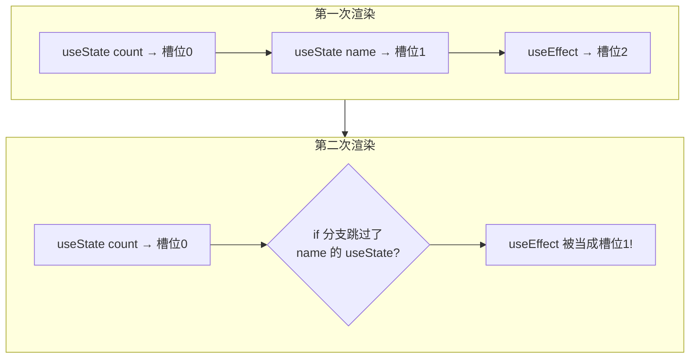
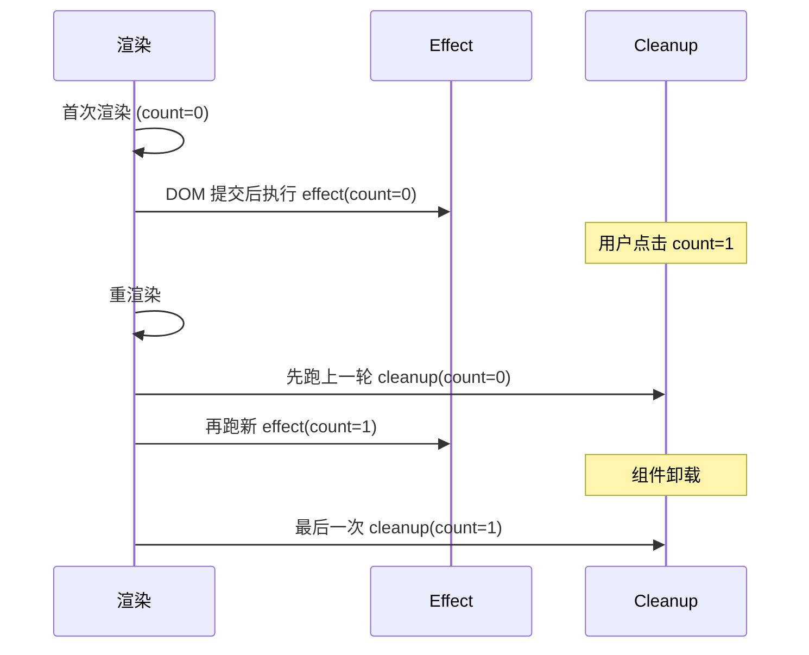
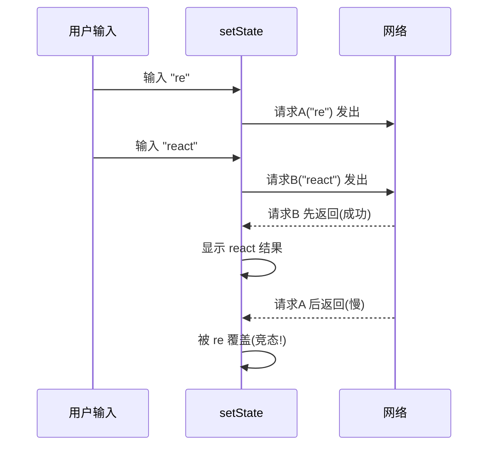

# Hooks 深入：规则、时序与自定义逻辑复用

> 前置：[[前端开发/03-JS框架/React/01-React基础|React 基础]]、[[前端开发/03-JS框架/React/02-组件与JSX|组件与 JSX]]
> 目标：吃透 Hooks 两条规则与 useEffect 时序，避开闭包陈旧值、无限循环、竞态三大坑，会写生产级自定义 Hook。

---

## 1. Hooks 规则：只有两条

### 1.1 规则原文

1. **只在最顶层调用 Hook**——不能放在 if/for/嵌套函数里；
2. **只在 React 函数组件或自定义 Hook 中调用**——普通 JS 函数里不行。

### 1.2 为什么：Hook 靠调用顺序定位

每个组件维护一张 Hook 状态表，React 按**调用顺序**对号入座：



一旦某次渲染少调了一个 Hook，后面的 Hook 全部错位取到别人的状态——这就是"不能放条件里"的全部原因。不是玄学，是链表式槽位分配的实现约束。

### 1.3 工程保障：eslint 插件

Vite react-ts 模板已内置 `eslint-plugin-react-hooks`，把 Hook 写进条件语句、依赖数组漏写都会直接标红。**永远不要加 eslint-disable 绕过它**——它在替你挡上面那种事故。

## 2. useEffect 完全指南

### 2.1 它是什么

useEffect 让函数组件能执行"副作用"（side effect）：请求数据、订阅事件、操作定时器、改标题……凡是渲染之外与世界交互的代码都住这里。

```tsx
useEffect(() => {
  // 副作用主体，每次"触发条件"满足后执行
  return () => {
    // 清理函数：下一次副作用执行前 & 组件卸载前执行
  };
}, [deps]);
```

### 2.2 依赖数组三种写法的语义

| 写法 | 执行时机 | 语义 |
|------|----------|------|
| 不传第二参 | 每次渲染后都执行 | 几乎总是 bug，慎用 |
| `[]` | 仅首次渲染后执行一次 | "挂载后做一件事" |
| `[a, b]` | 首次 + 任一依赖变化后的渲染 | 响应特定数据变化 |

判断口诀：effect 内读到的**每一个响应式值**（state/props/由它们派生的变量），要么写进依赖数组，要么确认它真的不需要响应。eslint 的 exhaustive-deps 规则会帮你数。

### 2.3 与 class 生命周期映射表

老教程按生命周期讲 effect，对照理解一次即可，之后请用"同步"视角思考：

| class 生命周期 | useEffect 写法 |
|----------------|----------------|
| componentDidMount | `useEffect(fn, [])` |
| componentDidUpdate | `useEffect(fn, [deps])` |
| componentWillUnmount | `useEffect(() => () => {...}, [])` 返回的清理函数 |

注意映射并不精确：`[]` 版的清理在卸载时执行，但 `[deps]` 版的清理在**每次 deps 变化重跑之前**也会执行。更准确的模型是：**每次 effect 都是独立的"创建-清理"配对**。



记住顺序铁律：**cleanup 先于下一个 effect，且都在浏览器绘制之后异步调度**。

### 2.4 典型场景示例

```tsx
// 订阅窗口尺寸 —— 挂载订阅 / 卸载解绑成对出现
function useWindowWidth() {
  const [width, setWidth] = useState(window.innerWidth);

  useEffect(() => {
    const onResize = () => setWidth(window.innerWidth);
    window.addEventListener('resize', onResize);
    return () => window.removeEventListener('resize', onResize); // 忘了这行=内存泄漏
  }, []);

  return width;
}
```

## 3. 三大经典坑与标准解法

### 3.1 坑一：闭包陈旧值

```tsx
function Timer() {
  const [count, setCount] = useState(0);

  useEffect(() => {
    const id = setInterval(() => {
      setCount(count + 1);      // BUG：这个 count 永远是首次渲染的 0！
    }, 1000);
    return () => clearInterval(id);
  }, []);                       // 依赖为空 → 回调闭包冻结了初始 count

  return <p>{count}</p>;        // 界面永远停在 1
}
```

原因：effect 在首次渲染时创建闭包，捕获的是那一次的 count。setInterval 里的 `count + 1` 永远算 0+1。

标准解法二选一：

```tsx
// 解法 A：函数式更新，不依赖闭包变量
setCount(c => c + 1);

// 解法 B：把依赖如实声明，让 effect 随值重建
useEffect(() => {
  const id = setInterval(() => setCount(count + 1), 1000);
  return () => clearInterval(id);
}, [count]);
```

优先解法 A；B 会让定时器每秒拆建一次，能用但浪费。

### 3.2 坑二：无限循环

两种触发方式：

```tsx
// 触发方式 1：update 里引用自身造成 setState 循环
const [list, setList] = useState([]);
useEffect(() => {
  fetch('/api/list')
    .then(r => r.json())
    .then(setList);
});                    // 忘写依赖数组 → 每次渲染后都请求 → setState 又触发渲染 → 死循环

// 触发方式 2：对象字面量依赖，地址每轮都是新的
const opts = { page: 1, size: 10 };          // 每次渲染新对象！
useEffect(() => { load(opts); }, [opts]);    // 引用永不相等 → 永远在重跑
```

对象字面量依赖的三种修法：

```tsx
// 修法 A：依赖展开成原始值（推荐）
useEffect(() => { load({ page, size }); }, [page, size]);

// 修法 B：稳定不变的对象移出组件或用 useMemo 锁引用
const opts = useMemo(() => ({ page, size }), [page, size]);

// 修法 C：常量提到组件外，根本不进依赖
const DEFAULT_OPTS = { page: 1, size: 10 };
```

### 3.3 坑三：竞态请求

搜索框连续输入两次请求，先发的后到就会覆盖正确结果：



标准解法：cleanup 里 ignore 标志位：

```tsx
useEffect(() => {
  let ignore = false;                      // 本轮 effect 的私有标志

  fetch(`/api/search?kw=${keyword}`)
    .then(r => r.json())
    .then(data => { if (!ignore) setResult(data); });

  return () => { ignore = true; };         // keyword 变化时旧轮被标记废弃
}, [keyword]);
```

原理：keyword 一变，上一轮 cleanup 先执行置 ignore=true，慢返回的旧请求结果被静默丢弃。这是 React 官方文档钦定的竞态处理范式，配合 AbortController 还能真正取消网络请求。

## 4. useRef 双用途

### 4.1 用途一：DOM 引用

见 [[前端开发/03-JS框架/React/02-组件与JSX|组件与 JSX]] 第 5 节，聚焦/滚动/测量三件事。

### 4.2 用途二：跨渲染的可变盒子

`useRef` 的本质是一个 `{ current }` 可变容器：**改 current 不触发重渲**，且重渲之间保持同一实例。于是它可以存"不想引起界面变化、但各次渲染要共享"的值：

```tsx
function Stopwatch() {
  const [elapsed, setElapsed] = useState(0);       // 会变 → state
  const timerIdRef = useRef<number | null>(null);  // 不参与渲染 → ref

  const start = () => {
    if (timerIdRef.current !== null) return;
    timerIdRef.current = window.setInterval(
      () => setElapsed(e => e + 100), 100,
    );
  };
  const stop = () => {
    if (timerIdRef.current === null) return;
    clearInterval(timerIdRef.current);
    timerIdRef.current = null;
  };

  return (
    <div>
      <p>{(elapsed / 1000).toFixed(1)} s</p>
      <button onClick={start}>开始</button>
      <button onClick={stop}>停止</button>
    </div>
  );
}
```

决策一句话：**值变了需要界面跟着变 → useState；只是记一笔（定时器 id、上次的值、是否已挂载）→ useRef**。Vue 类比：ref 用途二相当于一个不具响应性的普通模块变量，但随组件实例隔离。

## 5. useMemo 与 useCallback：性能优化双刃剑

### 5.1 解决什么问题

两个问题，分别对应两个 API：

1. **昂贵计算不想重复算** → `useMemo(() => compute(a), [a])` 缓存计算结果；
2. **传给子组件的函数/对象引用要稳定**（子组件被 memo 包裹时不白白重渲）→ `useCallback` 缓存函数引用。

```tsx
import { useMemo, useCallback } from 'react';

const FilteredList = React.memo(({ items, onSelect }: {
  items: Item[];
  onSelect: (id: number) => void;
}) => {
  /* ... */
});

function Parent({ raw, keyword }: Props) {
  // 1) 昂贵过滤：仅 raw/keyword 变化才重算
  const filtered = useMemo(
    () => raw.filter(i => i.name.includes(keyword)).sort(byScore),
    [raw, keyword],
  );

  // 2) 引用稳定：否则 Parent 每次渲染，memo 化的子组件照样全量重渲
  const handleSelect = useCallback((id: number) => {
    console.log('select', id);
  }, []);

  return <FilteredList items={filtered} onSelect={handleSelect} />;
}
```

### 5.2 什么时候真的需要

useMemo/useCallback 自身有比较与缓存成本，**默认不写，命中以下条件才写**：

| 条件 | 用哪个 |
|------|--------|
| 计算 5000+ 条数据的 filter/sort/大矩阵运算 | useMemo |
| 结果作为 props 传给 `React.memo` 子组件 | useMemo + useCallback 成套 |
| 返回对象/数组作为其他 Hook 的依赖（防无限循环，第 3.2 节修法 B） | useMemo |
| 只是拼个字符串、算个长度 | 不要包，纯开销 |

经验法则来自官方文档精神："让代码先正确，再让 profiler 告诉你哪里慢"。上来就全量 memo 是新手常见的伪优化。

## 6. 自定义 Hook：逻辑复用的第一公民

### 6.1 概念

以 `use` 开头、内部调用其他 Hook 的普通函数，就是自定义 Hook。它是 React 中**状态逻辑复用的标准单元**（替代 class 时代的 HOC/render props），每次调用拥有独立的状态副本——像模板函数而非单例。

Spring 类比：自定义 Hook ≈ `@Configuration` 产出的 prototype 作用域 Bean 组合体——每个组件注入一套全新实例。

### 6.2 useLocalStorage：完整示例

```tsx
import { useState, useEffect } from 'react';

export function useLocalStorage<T>(key: string, initial: T) {
  const [value, setValue] = useState<T>(() => {
    try {
      const saved = localStorage.getItem(key);
      return saved ? (JSON.parse(saved) as T) : initial;
    } catch {
      return initial;
    }
  });

  useEffect(() => {
    try {
      localStorage.setItem(key, JSON.stringify(value));
    } catch { /* 存储满等异常静默 */ }
  }, [key, value]);

  return [value, setValue] as const;
}

// 使用：一行获得"持久化的 state"
const [theme, setTheme] = useLocalStorage('theme', 'light');
```

亮点：惰性初始化 `useState(() => ...)` 把读取 localStorage 的开销推迟到首次渲染只执行一次；泛型 `<T>` 保证类型全程不丢。

### 6.3 useDebounce：防抖值

```tsx
import { useEffect, useState } from 'react';

export function useDebounce<T>(value: T, delay = 300): T {
  const [debounced, setDebounced] = useState(value);

  useEffect(() => {
    const id = setTimeout(() => setDebounced(value), delay);
    return () => clearTimeout(id);   // value 再变就取消上一个定时器
  }, [value, delay]);

  return debounced;
}

// 使用
const kw = useDebounce(input, 400);
// 后续只在 kw 上做请求，输入停顿 400ms 才触发
```

## 7. 实战：带防抖搜索的自定义 useSearch

综合运用本章所有知识点：防抖 + 请求 + 竞态处理 + 加载状态，封装成一个可复用 Hook。

```tsx
import { useEffect, useState } from 'react';

type SearchResult = { id: number; title: string };

export function useSearch(keywordRaw: string) {
  const [data, setData] = useState<SearchResult[]>([]);
  const [loading, setLoading] = useState(false);
  const [error, setError] = useState<string | null>(null);

  useEffect(() => {
    const keyword = keywordRaw.trim();

    // 空关键词：清空结果，不发请求
    if (!keyword) {
      setData([]);
      setLoading(false);
      setError(null);
      return;
    }

    setLoading(true);
    setError(null);

    const controller = new AbortController();
    let ignore = false;                        // 双保险：abort + ignore

    const timer = setTimeout(async () => {     // 手动实现防抖
      try {
        const res = await fetch(`/api/search?kw=${encodeURIComponent(keyword)}`, {
          signal: controller.signal,
        });
        if (!res.ok) throw new Error(`HTTP ${res.status}`);
        const json = (await res.json()) as SearchResult[];
        if (!ignore) setData(json);
      } catch (e) {
        if (!ignore && !(e instanceof DOMException && e.name === 'AbortError')) {
          setError(e instanceof Error ? e.message : '请求失败');
        }
      } finally {
        if (!ignore) setLoading(false);
      }
    }, 300);

    return () => {
      clearTimeout(timer);
      controller.abort();
      ignore = true;
    };
  }, [keywordRaw]);

  return { data, loading, error };
}
```

消费组件薄如蝉翼：

```tsx
function SearchPage() {
  const [input, setInput] = useState('');
  const { data, loading, error } = useSearch(input);

  return (
    <div>
      <input value={input} onChange={e => setInput(e.target.value)} placeholder="搜索文章..." />
      {loading && <p>加载中...</p>}
      {error && <p style={{ color: 'red' }}>{error}</p>}
      <ul>
        {data.map(item => <li key={item.id}>{item.title}</li>)}
      </ul>
      {!loading && !error && input && data.length === 0 && <p>无匹配结果</p>}
    </div>
  );
}
```

逐条对照检查它做对了什么：

1. **防抖**：setTimeout + cleanup 取消，停顿 300ms 才发；
2. **竞态**：AbortController 真取消 + ignore 标志丢弃迟到响应；
3. **边界完备**：空关键词短路、HTTP 非 200 报错、AbortError 静默；
4. **状态收敛**：loading/error/data 三态全部内聚在 Hook 里，组件零副作用。

自检清单：

- [ ] 能向别人解释为什么 Hook 不能放进 if
- [ ] 三种依赖写法语义脱口而出，cleanup 与下一轮 effect 的先后顺序清楚
- [ ] 陈旧闭包用函数式更新解决；对象依赖展开成原始值
- [ ] 竞态 = cleanup ignore flag (+AbortController)
- [ ] ref 双用途分得清；useMemo 只在昂贵计算和引用传递时使用
- [ ] 能独立写出带类型、带清理的自定义 Hook

---

## 小结

| 知识点 | 一句话 |
|--------|--------|
| 两条规则 | 只在顶层调用、只在组件/自定义 Hook 里调用，靠顺序对号入座 |
| useEffect | 渲染后执行的副作用单元，cleanup 成对出现 |
| 依赖数组 | 不传=每次、[]=一次、[deps]=响应变化 |
| 陈旧闭包 | 函数式更新 setXxx(c => ...) |
| 无限循环 | 漏依赖数组 / 对象字面量依赖 |
| 竞态 | cleanup 里 ignore flag，进阶加 AbortController |
| useRef | DOM 引用 + 跨渲染可变值（不触发重渲） |
| useMemo/useCallback | 昂贵计算与引用稳定才用，别无脑包 |
| 自定义 Hook | 逻辑复用标准单元，每调用一份独立状态 |

学完 Hooks 该让页面"动起来多页"了：[[前端开发/03-JS框架/React/04-ReactRouter|React Router]]。
