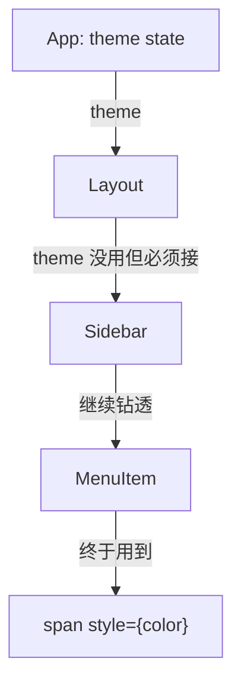
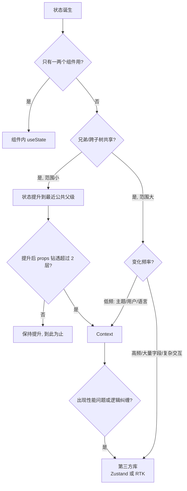

# 状态管理：Context、Redux Toolkit 与 Zustand

> 前置：[[前端开发/03-JS框架/React/04-ReactRouter|React Router]]
> 目标：会用 Context 解决跨层传递并理解其性能陷阱，掌握 Redux Toolkit 现代写法，认识 Zustand 轻量方案，建立选型决策框架。

---

## 1. 问题从哪来：props 钻透

组件树深了以后，顶层状态传给底层组件要途经每一层：



中间层明明不用 theme 却被迫接收转发——这叫 **props drilling（属性钻透）**。Spring 类比：像是为了让最深层 Bean 拿到配置，让每个中间 Service 都加一个透传参数。正解和 Spring 一样：**放进容器（Context），谁需要谁注入**。

## 2. Context：内置的依赖注入

### 2.1 三步使用

```tsx
import { createContext, useContext, useState } from 'react';

// 1) 创建 Context：给个默认值兜底
type Theme = 'light' | 'dark';
const ThemeContext = createContext<Theme>('light');

// 2) Provider 在上层提供值
function App() {
  const [theme, setTheme] = useState<Theme>('light');
  return (
    <ThemeContext.Provider value={{ /* 注意这里 */ } as never}>
      <Page />
    </ThemeContext.Provider>
  );
}

// 3) 任意深度消费：不经过中间层
function ThemedButton() {
  const theme = useContext(ThemeContext);
  return <button style={{ background: theme === 'dark' ? '#333' : '#fff' }}>按钮</button>;
}
```

上面第 2 步故意留了个坑：value 直接放对象字面量会导致每次渲染都是新引用。规范做法是自定义 Provider 组件把 value 用 useMemo/useState 锁住。

### 2.2 登录上下文完整示例

生产级写法三件套：context 文件、Provider 组件、useAuth Hook：

```tsx
// auth-context.tsx
import { createContext, useContext, useMemo, useState } from 'react';

type User = { name: string };
type AuthState = {
  user: User | null;
  login: (name: string, pwd: string) => Promise<void>;
  logout: () => void;
};

const AuthContext = createContext<AuthState | null>(null);

export function AuthProvider({ children }: { children: React.ReactNode }) {
  const [user, setUser] = useState<User | null>(null);

  const value = useMemo<AuthState>(() => ({
    user,
    login: async (name, pwd) => {
      // 实际项目换成 fetch('/api/login', ...)
      await new Promise(r => setTimeout(r, 500));
      setUser({ name });
    },
    logout: () => setUser(null),
  }), [user]);

  return <AuthContext.Provider value={value}>{children}</AuthContext.Provider>;
}

export function useAuth() {
  const ctx = useContext(AuthContext);
  if (!ctx) throw new Error('useAuth 必须在 AuthProvider 内使用');
  return ctx;
}
```

要点解读：

- context 默认值设为 null + Hook 里抛错——强制"没包 Provider 就报错"，比静默拿到默认值安全得多；
- `useMemo` 包住 value 对象：否则 Provider 每次渲染都生成新引用，全部消费者跟着重渲；
- 自定义 `useAuth` 收敛消费入口，后续换实现（如换 Zustand）只改这一个文件；
- main.tsx 里 `<AuthProvider><RouterProvider/></AuthProvider>` 包一层即全局生效，配合 [[前端开发/03-JS框架/React/04-ReactRouter|路由守卫]] 的 useAuth 使用。

### 2.3 性能陷阱与拆分缓解

Context 的机制是：**Provider 的 value 一变，所有消费该 context 的组件全部重渲**——不管它们用到的是哪个字段。

```tsx
// 反面教材：user 和 updater 混在一个 context
// user 变化时，只调用 logout 的组件也全体重渲

// 缓解手段 1：读写分离成两个 context
const UserContext = createContext<User | null>(null);          // 只读数据
const UserActionContext = createContext<{ logout: () => void }>(); // 只操作
// 操作函数永远稳定 → 消费 action 的组件几乎不重渲

// 缓解手段 2：按业务域拆分
// ThemeContext / AuthContext / LocaleContext 各自独立，
// 主题切换不再牵连登录态消费者
```

结论：Context 适合**低频变化的"环境数据"**（主题、语言、当前用户）。高频变化的数据（输入框、列表滚动）进 Context 会引发雪崩式重渲，那是第三方 store 的主场。

## 3. 什么时候需要第三方库：决策流程



记忆主线：**局部 → 提升 → Context → 库**，逐级升级，不要跳级。多数中小应用到 Context 就够；一旦出现以下信号再上库：

- 多个页面共享同一份会频繁变化的数据（购物车、协作编辑）；
- 更新逻辑散落各处、需要集中收敛（类似后端把业务收进 Service 层）;
- 需要 devtools 时间旅行调试、持久化中间件。

## 4. Redux Toolkit：现代 Redux

### 4.1 先破除旧印象

老 Redux 的劝退三件套——手写 action type 常量、action creator、switch reducer——在官方推荐的 **Redux Toolkit（RTK）**里已全部消失。现代 Redux 只需要 createSlice + configureStore。

### 4.2 counter slice 全量代码

```ts
// features/counter/counterSlice.ts
import { createSlice, configureStore, type PayloadAction } from '@reduxjs/toolkit';
import { useSelector, useDispatch } from 'react-redux';

type CounterState = { value: number; history: number[] };

const counterSlice = createSlice({
  name: 'counter',
  initialState: { value: 0, history: [] } satisfies CounterState,
  reducers: {
    incremented(state, action: PayloadAction<number>) {
      // 看似直接 mutate，实际由内置 immer 代理，产出不可变更新！
      state.value += action.payload;
      if (state.history.length > 9) state.history.shift();
      state.history.push(state.value);
    },
    reset(state) {
      state.value = 0;
      state.history = [];
    },
  },
});

export const { incremented, reset } = counterSlice.actions;

export const store = configureStore({
  reducer: { counter: counterSlice.reducer },
});

// 类型助手（TS 项目标配）
export type RootState = ReturnType<typeof store.getState>;
export type AppDispatch = typeof store.dispatch;
```

```tsx
// 组件消费
function Counter() {
  const value = useSelector((s: RootState) => s.counter.value);
  const dispatch = useDispatch<AppDispatch>();

  return (
    <>
      <p>{value}</p>
      <button onClick={() => dispatch(incremented(1))}>+1</button>
      <button onClick={() => dispatch(reset())}>清零</button>
    </>
  );
}
```

RTK 的三大解脱：

1. **createSlice 按 name 自动生成 action type 与 creator**——没有常量文件、没有 switch/case；
2. **immer 内置**——reducer 里直接"改"state（`state.value += 1`），库负责转成正确的不可变更新，从此告别第七章的层层展开；
3. **configureStore 默认集成 redux-thunk 与 devtools**——异步直接写 thunk 函数，零额外配置。

服务端数据的部分（请求缓存/去重/loading），RTK 给出的是 **RTK Query**——声明式定义 API 端点自动生成 hooks，一句话定位："React 版的接口缓存层"。细节本教程从略，需要时查官方文档即可。

### 4.3 目录惯例

中大型项目的经典结构（feature-first）：

```text
src/
├── app/store.ts           # configureStore + 类型导出
├── features/
│   ├── todos/todosSlice.ts
│   ├── auth/authSlice.ts
│   └── ...
└── main.tsx               # <Provider store={store}>
```

## 5. Zustand：轻量方案对照

Zustand 把"全局 store"压缩到一个 create 调用，没有 Provider、没有 dispatch、没有样板：

```ts
// stores/counter.ts
import { create } from 'zustand';

type CounterStore = {
  count: number;
  inc: () => void;
  reset: () => void;
};

export const useCounterStore = create<CounterStore>(set => ({
  count: 0,
  inc: () => set(s => ({ count: s.count + 1 })),
  reset: () => set({ count: 0 }),
}));
```

```tsx
import { useCounterStore } from './stores/counter';

function Counter() {
  // 选择器订阅：只订阅 count 字段，其他字段变化与我无关
  const count = useCounterStore(s => s.count);
  const inc = useCounterStore(s => s.inc);
  return (
    <>
      <p>{count}</p>
      <button onClick={inc}>+1</button>
    </>
  );
}
```

同一 counter 两方案代码量对比：

| 维度 | Redux Toolkit | Zustand |
|------|---------------|---------|
| 定义代码 | slice + configureStore ≈ 30 行 | create ≈ 10 行 |
| 接入组件 | Provider 包根 + useDispatch/useSelector | 直接调 Hook |
| 异步 | thunk 函数（或 RTK Query） | action 里直接 async/await |
| 中间件生态 | 最全（devtools/持久化/Saga…） | 够用（persist/devtools 有官方插件） |
| 心智模型 | Flux：action→reducer 单向流 | 就是"带 setter 的全局 Hook" |

Zustand 的选择器订阅天然规避了 Context 的全树重渲问题，且更新逻辑可以脱离组件测试——很像把状态做成一个无框架依赖的小型领域模型。

## 6. 选型建议

| 项目规模 | 推荐 | 理由 |
|----------|------|------|
| 小型（<10 页面） | useState+Context，或 Zustand | 引库成本可能高于收益 |
| 中型 | Zustand | 学习成本低，覆盖 90% 场景 |
| 大型/多人协作/严格规范 | Redux Toolkit (+RTK Query) | 强约定、devtools、生态与招聘匹配 |
| 服务端数据为主 | TanStack Query / RTK Query | 缓存、重试、失效交给专用库，store 只管客户端状态 |

最后一条展开说：现代 React 开发把状态分成两类——**客户端状态**（UI 开关、表单草稿）与**服务端状态**（本质是缓存的远端数据）。前者归 Zustand/RTK，后者归 Query 类库。混着管是最常见的架构债。

## 7. 实战：登录态管理（存 token/自动登出）

目标：token 持久化到 localStorage，401 时自动登出，任意组件可读当前用户。采用 Zustand 实现（更短），思路对 RTK 同样适用。

```ts
// stores/auth.ts
import { create } from 'zustand';
import { persist } from 'zustand/middleware';

type User = { id: number; name: string };

type AuthStore = {
  token: string | null;
  user: User | null;
  login: (name: string, password: string) => Promise<void>;
  logout: (reason?: string) => void;
};

export const useAuthStore = create<AuthStore>()(
  persist(
    (set) => ({
      token: null,
      user: null,

      login: async (name, password) => {
        const res = await fetch('/api/login', {
          method: 'POST',
          headers: { 'Content-Type': 'application/json' },
          body: JSON.stringify({ username: name, password }),
        });
        if (!res.ok) throw new Error('用户名或密码错误');
        const data = await res.json() as { token: string; user: User };
        set({ token: data.token, user: data.user });   // persist 中间件自动同步 localStorage
      },

      logout: (reason) => {
        set({ token: null, user: null });
        if (reason) console.warn(`已登出：${reason}`);
      },
    }),
    {
      name: 'auth-storage',                 // localStorage key
      partialize: s => ({ token: s.token, user: s.user }),  // 只持久化数据，不存函数
    },
  ),
);
```

axios 层挂自动登出（拦截器思想，下一章 api.ts 会完整化）：

```ts
// http.ts
import axios from 'axios';
import { useAuthStore } from './stores/auth';

export const http = axios.create({ baseURL: '/api' });

http.interceptors.request.use(config => {
  const token = useAuthStore.getState().token;   // 非 Hook 环境也能读 store！
  if (token) config.headers.Authorization = `Bearer ${token}`;
  return config;
});

http.interceptors.response.use(
  res => res,
  err => {
    if (err.response?.status === 401) {
      useAuthStore.getState().logout('登录已过期');   // token 失效自动登出
    }
    return Promise.reject(err);
  },
);
```

配合 [[前端开发/03-JS框架/React/04-ReactRouter|ProtectedRoute]] 的守卫只需一行改造：

```tsx
function AuthLayout() {
  const token = useAuthStore(s => s.token);
  return token ? <Outlet /> : <Navigate to="/login" replace />;
}
```

链路检查清单：

1. **登录**：表单调 login → set 写入 token/user → persist 同步 localStorage；
2. **刷新恢复**：persist 中间件在 store 创建时自动回灌，无需手写初始化；
3. **携带凭证**：拦截器每次请求从 `getState()` 读最新 token；
4. **自动登出**：任何接口 401 → logout 清空 → 守卫下一次渲染自动踢回登录页；
5. **非 Hook 可访问**：`getState()/setState()` 让 axios 这类普通模块与 store 解耦，这是 Zustand 相比 Context 的独特优势。

自检清单：

- [ ] 能指出 props drilling 问题并给出三级递进解法
- [ ] Context value 不锁引用 = 全树重渲，读写分离可缓解
- [ ] RTK 的 immer 让你写"可变"代码得到不可变结果
- [ ] Zustand 选择器订阅避免无关重渲
- [ ] 分得清客户端状态与服务端状态

---

## 小结

| 知识点 | 一句话 |
|--------|--------|
| Context | 内置 DI，适合低频环境数据，value 必须锁引用 |
| 性能陷阱 | value 变化全量消费者重渲，拆分 context 缓解 |
| 决策链 | 局部 → 提升 → Context → 库，逐级升级 |
| RTK | createSlice 自动生成 action，immer 免手写不可变 |
| Zustand | 无 Provider 的全局 Hook store，选择器精准订阅 |
| 选型 | 小 Zustand / 大 RTK；服务端数据交给 Query 库 |

状态就位，来一场综合实战：[[前端开发/03-JS框架/React/06-React实战|React 实战]]。
