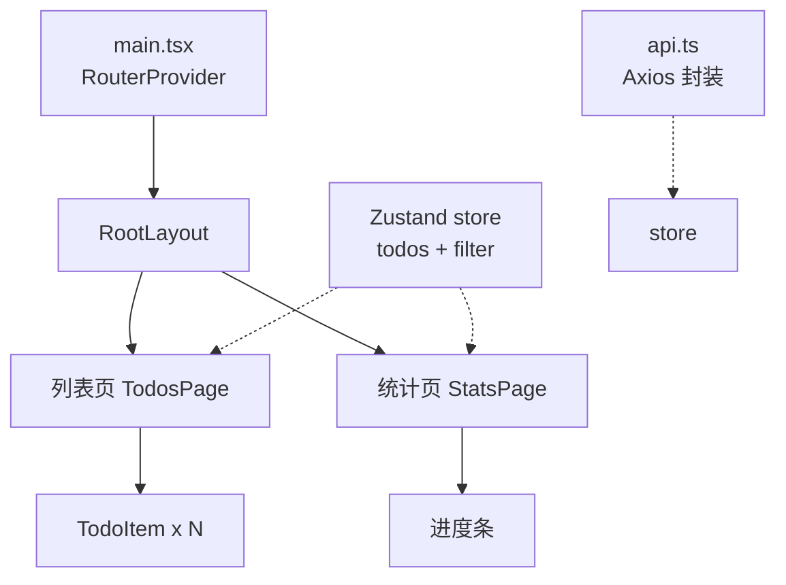

# React 实战：TodoList Pro

> 前置：[[前端开发/03-JS框架/React/05-状态管理|状态管理]]
> 目标：综合运用前五章技术栈（Vite + react-ts + Zustand + Router + Axios），完成一个工程化的待办应用，并与 [[前端开发/01-基础/JavaScript/07-JS实战：交互式页面|JS 版交互式页面]] 的同需求实现对照，体会框架化带来的结构差异。

---

## 1. 需求与架构总览

### 1.1 功能需求（与 JS 版对齐并增强）

- 增删改查待办、切换完成状态；
- 过滤视图：全部 / 未完成 / 已完成；
- 数据持久化 + 预留后端 API 对接；
- 两个页面：列表页、统计页（演示路由）。

### 1.2 技术选型

| 层 | 选择 | 出处 |
|----|------|------|
| 构建 | Vite react-ts 模板 | [[前端开发/03-JS框架/React/01-React基础|React 基础]] |
| 全局状态 | Zustand | [[前端开发/03-JS框架/React/05-状态管理|状态管理]] |
| 路由 | createBrowserRouter 两页 | [[前端开发/03-JS框架/React/04-ReactRouter|React Router]] |
| 请求层 | Axios 封装 api.ts | 本章新增 |
| 自定义逻辑 | useTodos/useFilters Hooks | [[前端开发/03-JS框架/React/03-Hooks深入|Hooks 深入]] |

### 1.3 组件树设计

动手写代码前先画树——组件设计即数据流设计：



分层原则：

- **页面组件**只做组装与路由衔接；
- **展示组件**（TodoItem 等）纯 props 进出，可独立测试；
- **状态**集中在 Zustand store，页面间天然共享；
- **副作用**（请求）收在 api.ts 与 store action 里，组件零直接 fetch。

### 1.4 与 JS 版的结构对比

| 维度 | [[前端开发/01-基础/JavaScript/07-JS实战：交互式页面\|JS 版]] | 本版 React |
|------|------------------|------------|
| 状态存放 | 散落的 DOM data-* 与模块变量 | 单一 store |
| 视图更新 | 手动 createElement/innerHTML | setState 自动同步 |
| 逻辑组织 | 函数按事件罗列 | hooks 按领域切分 |

## 2. 项目初始化

```bash
npm create vite@latest todo-pro -- --template react-ts
cd todo-pro && npm install zustand axios react-router-dom && npm run dev
```

目录规划：

```text
src/
├── main.tsx
├── App.tsx                 # 路由表
├── api/todos.ts            # Axios 封装 + 待办接口
├── stores/todoStore.ts     # Zustand
├── hooks/
│   ├── useTodos.ts         # 业务动作封装
│   └── useFilters.ts       # 过滤派生逻辑
├── components/TodoItem.tsx # 纯展示组件
└── pages/
    ├── TodosPage.tsx
    └── StatsPage.tsx
```

## 3. Axios 封装 api.ts

统一 baseURL、token 注入、错误归一化三件事，为对接 [[java/3工程化/06_Spring Boot快速开发|Spring Boot 快速开发]] 后端做好准备：

```ts
// src/api/todos.ts
import axios from 'axios';

// 统一错误形状：调用方只需 catch 一种格式
export class ApiError extends Error {
  constructor(public status: number, message: string) {
    super(message);
  }
}

export const http = axios.create({
  baseURL: import.meta.env.VITE_API_BASE ?? '/api',   // 见第 8 节 CORS 注记
  timeout: 10_000,
});

// 请求拦截器：自动带 token（登录体系见状态管理章）
http.interceptors.request.use(config => {
  const token = localStorage.getItem('token');
  if (token) config.headers.Authorization = `Bearer ${token}`;
  return config;
});

// 响应拦截器：401 自动登出 + 错误归一化
http.interceptors.response.use(
  res => res,
  err => {
    const status = err.response?.status ?? 0;
    if (status === 401) localStorage.removeItem('token');
    return Promise.reject(new ApiError(status, err.response?.data?.message ?? '网络异常'));
  },
);

export type Todo = { id: number; text: string; done: boolean; createdAt: number };
```

拦截器要点回顾：

- token 注入收敛一处，业务代码永远不手拼 Authorization 头；
- 401 统一处理登出，配合路由守卫完成"踢回登录页"闭环；
- ApiError 归一化后，UI 层 catch 到的永远是 `{status, message}`。

## 4. Zustand store

```ts
// src/stores/todoStore.ts
import { create } from 'zustand';
import { todoApi, type Todo } from '../api/todos';

export type FilterKey = 'all' | 'active' | 'done';

type TodoState = {
  todos: Todo[];
  filter: FilterKey;
  loading: boolean;
  error: string | null;

  load: () => Promise<void>;
  add: (text: string) => Promise<void>;
  toggle: (id: number) => Promise<void>;
  remove: (id: number) => Promise<void>;
  setFilter: (f: FilterKey) => void;
};

export const useTodoStore = create<TodoState>((set, get) => ({
  todos: [],
  filter: 'all',
  loading: false,
  error: null,

  load: async () => {
    set({ loading: true, error: null });
    try {
      set({ todos: await todoApi.list(), loading: false });
    } catch (e) {
      set({ error: e instanceof Error ? e.message : '加载失败', loading: false });
    }
  },

  add: async text => {
    const optimistic: Todo = {
      id: Date.now(),            // 临时 id，乐观更新用
      text,
      done: false,
      createdAt: Date.now(),
    };
    set(s => ({ todos: [optimistic, ...s.todos] }));     // 先上屏
    try {
      const saved = await todoApi.create(text);          // 再落库
      set(s => ({ todos: s.todos.map(t => (t.id === optimistic.id ? saved : t)) }));
    } catch {
      set(s => ({ todos: s.todos.filter(t => t.id !== optimistic.id) })); // 失败回滚
    }
  },

  toggle: async id => {
    const target = get().todos.find(t => t.id === id);
    if (!target) return;
    set(s => ({ todos: s.todos.map(t => (t.id === id ? { ...t, done: !t.done } : t)) }));
    try {
      await todoApi.toggle(id, !target.done);
    } catch {
      get().toggle(id);          // 失败回滚（再翻一次）
    }
  },
  remove: async id => {
    const backup = get().todos;
    set(s => ({ todos: s.todos.filter(t => t.id !== id) }));
    try {
      await todoApi.remove(id);
    } catch {
      set({ todos: backup });
    }
  },

  setFilter: f => set({ filter: f }),
}));
```

注意两个模式：

- **乐观更新**：先改本地再发请求，失败回滚。界面零等待，是待办这类高频小操作的最佳体验；
- **loading/error 内聚**：异步三态收进 store，组件只读不操心。

## 5. Hooks 拆分：useTodos / useFilters

store 已有全部能力，Hook 层做的是**面向组件的语义包装**与**派生计算**：

```ts
// src/hooks/useTodos.ts
import { useEffect } from 'react';
import { useTodoStore } from '../stores/todoStore';

export function useTodos() {
  const load = useTodoStore(s => s.load);
  const add = useTodoStore(s => s.add);
  const toggle = useTodoStore(s => s.toggle);
  const remove = useTodoStore(s => s.remove);

  useEffect(() => { void load(); }, [load]);   // 挂载时拉一次

  return { add, toggle, remove };
}
```

```ts
// src/hooks/useFilters.ts
import { useMemo } from 'react';
import { useTodoStore, type FilterKey } from '../stores/todoStore';

const FILTERS: { key: FilterKey; label: string }[] = [
  { key: 'all', label: '全部' },
  { key: 'active', label: '未完成' },
  { key: 'done', label: '已完成' },
];

export function useFilteredTodos() {
  const todos = useTodoStore(s => s.todos);
  const filter = useTodoStore(s => s.filter);
  const setFilter = useTodoStore(s => s.setFilter);

  const visible = useMemo(() => {
    switch (filter) {
      case 'active': return todos.filter(t => !t.done);
      case 'done':   return todos.filter(t => t.done);
      default:       return todos;
    }
  }, [todos, filter]);

  const counts = useMemo(() => ({
    all: todos.length,
    active: todos.filter(t => !t.done).length,
    done: todos.filter(t => t.done).length,
  }), [todos]);

  return { FILTERS, filter, setFilter, visible, counts };
}
```

派生数据用 `useMemo` 缓存且不进 store——能算出来的就不存，避免状态冗余导致的不一致 bug。

## 6. 组件层

### 6.1 TodoItem（纯展示组件）

```tsx
import type { Todo } from '../api/todos';

type Props = {
  todo: Todo;
  onToggle: (id: number) => void;
  onRemove: (id: number) => void;
};

export default function TodoItem({ todo, onToggle, onRemove }: Props) {
  return (
    <li style={{ opacity: todo.done ? 0.5 : 1 }}>
      <label>
        <input type="checkbox" checked={todo.done} onChange={() => onToggle(todo.id)} />
        <span style={{ textDecoration: todo.done ? 'line-through' : 'none' }}>{todo.text}</span>
      </label>
      <button onClick={() => onRemove(todo.id)}>删除</button>
    </li>  );
}
```

### 6.2 列表页组装

```tsx
// src/pages/TodosPage.tsx
import TodoItem from '../components/TodoItem';
import { useTodos } from '../hooks/useTodos';
import { useFilteredTodos } from '../hooks/useFilters';
import { useTodoStore, type FilterKey } from '../stores/todoStore';

export default function TodosPage() {
  const { add, toggle, remove } = useTodos();
  const { FILTERS, filter, setFilter, visible, counts } = useFilteredTodos();
  const loading = useTodoStore(s => s.loading);
  const error = useTodoStore(s => s.error);
  const [draft, setDraft] = useState('');

  const submit = () => {
    const text = draft.trim();
    if (!text) return;
    void add(text);
    setDraft('');
  };

  return (
    <div>
      <input
        value={draft}
        onChange={e => setDraft(e.target.value)}
        onKeyDown={e => e.key === 'Enter' && submit()}
        placeholder="新待办，回车添加"
      />
      <div>
        {FILTERS.map(f => (
          <button key={f.key} onClick={() => setFilter(f.key as FilterKey)}
                  disabled={filter === f.key}>
            {f.label} ({counts[f.key]})
          </button>
        ))}
      </div>

      {loading && <p>加载中...</p>}
      {error && <p style={{ color: 'red' }}>{error}</p>}
      {!loading && !error && visible.length === 0 && <p>空空如也，添加一条吧。</p>}

      <ul>
        {visible.map(t => (
          <TodoItem key={t.id} todo={t} onToggle={toggle} onRemove={remove} />
        ))}
      </ul>
    </div>
  );
}
```

### 6.3 统计页与路由装配

```tsx
// src/pages/StatsPage.tsx
import { useTodoStore } from '../stores/todoStore';

export default function StatsPage() {
  const todos = useTodoStore(s => s.todos);
  const done = todos.filter(t => t.done).length;
  const pct = todos.length === 0 ? 0 : Math.round((done / todos.length) * 100);

  return (
    <div>
      <h2>完成度 {pct}%</h2>
      <div style={{ background: '#eee', height: 12, borderRadius: 6 }}>
        <div style={{ width: `${pct}%`, background: '#2563eb', height: '100%', borderRadius: 6 }} />
      </div>
      <p>共 {todos.length} 条，已完成 {done} 条</p>
    </div>
  );
}
```

```tsx
// src/App.tsx
import { lazy, Suspense } from 'react';
import { createBrowserRouter, RouterProvider, Outlet, NavLink } from 'react-router-dom';

const TodosPage = lazy(() => import('./pages/TodosPage'));
const StatsPage = lazy(() => import('./pages/StatsPage'));

function RootLayout() {
  return (
    <>
      <nav>
        <NavLink to="/" end>列表</NavLink>
        <NavLink to="/stats">统计</NavLink>
      </nav>
      <Suspense fallback={<p>...</p>}>
        <Outlet />
      </Suspense>
    </>
  );
}

const router = createBrowserRouter([
  {
    path: '/',
    element: <RootLayout />,
    children: [
      { index: true, element: <TodosPage /> },
      { path: 'stats', element: <StatsPage /> },
    ],
  },
]);

export default function App() {
  return <RouterProvider router={router} />;
}
```

两页共享同一 store：在列表页勾选一条待办，切到统计页数字即时正确——这就是全局状态相对 URL 传参的降维优势。

## 7. 测试一句

单测选 Vitest（Vite 原生集成，`npm i -D vitest @testing-library/react`），思路三句话：纯函数（useFilters 的过滤逻辑抽出的函数）直接断言；组件用 Testing Library 渲染后按角色查询交互；含请求的逻辑 mock 掉 api 层即可。细节留待 [[前端开发/08-项目实战|项目实战]] 篇展开。

## 8. 预留后端对接：CORS 注记

当前 `baseURL: '/api'` 走 Vite dev server 代理，vite.config.ts 加一段即可转发到未来真后端：

```ts
// vite.config.ts
import { defineConfig } from 'vite';
import react from '@vitejs/plugin-react';

export default defineConfig({
  plugins: [react()],
  server: {
    proxy: {
      '/api': {
        target: 'http://localhost:8080',   // 将来的 Spring Boot
        changeOrigin: true,
      },
    },
  },
});
```

对接 [[java/3工程化/06_Spring Boot快速开发|Spring Boot]] 时两端各需一步：

- Spring 端加 CORS 配置或依赖 dev 代理（生产环境由 Nginx 同源转发，天然无跨域）；
- 接口契约对齐本文件 todoApi 的 REST 形状：`GET /api/todos`、`POST /api/todos`、`PATCH /api/todos/:id`、`DELETE /api/todos/:id`。

## 9. 部署

```bash
npm run build     # 产出 dist/ 纯静态资源
```

Nginx 最小配置（SPA history 路由必须配 fallback，否则刷新子路径 404）：

```nginx
server {
  listen 80;
  root /usr/share/nginx/html;

  location /api/ {
    proxy_pass http://localhost:8080;   # 反向代理后端，顺带解决跨域
  }

  location / {
    try_files $uri $uri/ /index.html;   # SPA 兜底：找不到文件一律回首页交给路由
  }
}
```

## 10. Vue3 vs React 开发体验小结

写完这一轮，把两大生态放上天平：

| 维度 | Vue3 | React |
|------|------|-------|
| 模板语法 | 模板指令 v-if/v-for 上手快 | JSX 全 JS 表达，灵活但更啰嗦 |
| 响应式 | Proxy 自动追踪，改值即更新 | 手动 setState+不可变纪律 |
| 逻辑复用 | composables | 自定义 Hook（几乎一一对应） |
| 官方全家桶 | Router/Pinia 官方出品开箱即配 | 社区拼装（Router/Zustand 或 RTK） |
| TS 支持 | 好 | 极好（语言原生亲和） |
| 生态体量 | 中文友好、渐进 | 最大、招聘面广 |

结论先行：两者心智差距远小于 jQuery→框架的跨越，团队熟悉哪个用哪个。多框架横向对比的决策框架，见 [[前端开发/09-融会贯通/03-根据需求选择技术栈|根据需求选择技术栈]]。

自检清单：

- [ ] 能画出本项目组件树并说出每层职责
- [ ] 乐观更新的写入-校对-回滚三步完整说出
- [ ] 派生数据用 useMemo 计算而非存 store
- [ ] Axios 拦截器完成 token 注入与错误归一化
- [ ] SPA 的 Nginx 配置必须带 try_files 兜底

---

## 小结

| 知识点 | 一句话 |
|--------|--------|
| 架构分层 | 页面组装 / 展示组件纯净 / store 集中 / 副作用收口 api 层 |
| 乐观更新 | 先上屏后确认，失败回滚 |
| Hooks 拆分 | store 提供能力，hook 提供语义 |
| api.ts | 拦截器三件套：token/401 登出/错误归一 |
| 部署 | build 出静态产物 + Nginx try_files 兜底 |
| 选型 | Vue/React 差异在心智不在能力 |

React 线到此毕业。服务端渲染的世界请移步 [[前端开发/03-JS框架/Next.js/01-Next.js基础|Next.js 基础]]。
