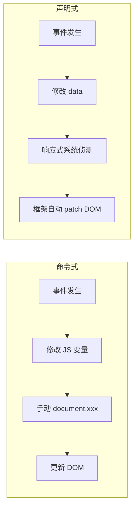
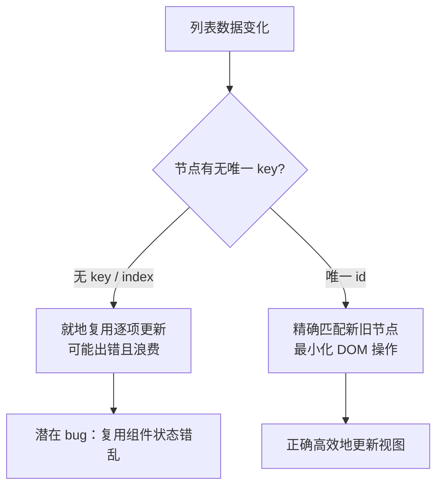
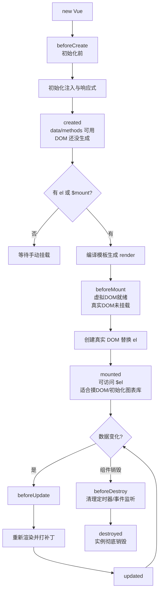

# Vue2 基础：从命令式到声明式

> 前置：[[前端开发/01-基础/JavaScript/04-DOM操作|DOM 操作]]、[[前端开发/01-基础/JavaScript/06-ES6+特性|ES6+ 特性]]
> 目标：理解"数据驱动视图"，掌握模板语法、计算属性、侦听器与生命周期。

---

## 1. 为什么需要 Vue：命令式的痛苦

### 1.1 回顾原生 DOM 操作

在 [[前端开发/01-基础/JavaScript/04-DOM操作|DOM 操作]] 一章中，典型代码长这样：

```js
// 命令式：每一步都要亲自动手
let count = 0;
document.getElementById('btn').addEventListener('click', function () {
  count++;
  document.getElementById('count').textContent = count; // 状态变了，手动同步 DOM
});
```

问题：**状态与视图分离**（JS 变量和页面数字靠手动代码同步）、**同步逻辑散落各处**（任何修改 `count` 的地方都要记得更新 DOM，漏一处就是 bug）、**无法复用**。

用 Java 类比：这就像不用 Spring 管理 Bean，自己在每个方法里 `new` 对象并手动维护引用——逻辑一多必然失控。

### 1.2 声明式：数据驱动视图

Vue 的答案是**声明式渲染**：你只声明"视图取决于什么数据"，数据变化时框架自动更新 DOM。

```js
// 声明式：只管改数据
new Vue({
  data: { count: 0 },
  template: '<button @click="count++">{{ count }}</button>'
}).$mount('#app');
```

| 维度 | 命令式（原生 JS） | 声明式（Vue） |
|------|------------------|--------------|
| 关注点 | 怎么做（How） | 结果是什么（What） |
| 状态同步 | 手动操作 DOM | 框架自动响应 |
| 出错点 | 忘记同步 DOM | 较少 |



一句话：**命令式是你亲自指挥每一个 DOM，声明式是你告诉 Vue 规则，Vue 替你干活。**

---

## 2. 引入 Vue2 与第一个实例

### 2.1 CDN 快速上手

```html
<body>
  <div id="app">
    <h1>{{ message }}</h1>
    <p>{{ message.split('').reverse().join('') }}</p>  <!-- 插值可写表达式 -->
  </div>
  <script src="https://cdn.jsdelivr.net/npm/vue@2.7.16/dist/vue.js"></script>
  <script>
    new Vue({
      el: '#app',           // 挂载点：接管该元素内部所有内容
      data: { message: 'Hello Vue2!' }
    });
  </script>
</body>
```

细节：插值 `{{ }}` 中可写**单个表达式**，不能写语句（如 `if`）；生产环境换 `vue.min.js`；工程化项目用 CLI 创建（`vue create my-project`），入口 `main.js` 用 `render: h => h(App)` 渲染根组件。

### 2.2 组件中的 data 为什么是函数

根实例中 `data` 可以是对象；但**组件中必须是函数返回新对象**：

```js
export default {
  data() {
    return { count: 0 }
  }
}
```

原因：组件会被复用多次，共享对象会让多个实例互相污染；函数每次调用返回全新对象。类比 Java 中不能让所有请求共享同一个有状态的成员变量。

---

## 3. 模板语法

### 3.1 插值与表达式

```html
<p>{{ msg }}</p>                          <!-- 文本插值 -->
<p>{{ num + 100 }}</p>                    <!-- 表达式 -->
<p>{{ ok ? 'YES' : 'NO' }}</p>
<p v-once>{{ msg }}</p>                   <!-- 只渲染一次 -->
<div v-html="rawHtml"></div>              <!-- 注入 HTML，慎防 XSS！ -->
```

`v-html` 直接注入 HTML 片段，来源若是用户输入会造成 XSS 漏洞。普通文本一律用 `{{ }}`。

### 3.2 v-bind 与缩写 `:`

```html
<a v-bind:href="url">完整语法</a>
<a :href="url">缩写形式（推荐）</a>
<div :class="{ active: isActive, disabled: !enabled }">动态 class 对象语法</div>
<div :style="{ color: textColor, fontSize: size + 'px' }">动态 style</div>
```

`:class` 的对象语法（isActive 为 true 时加 active 类）是控制样式的最常用手段。

### 3.3 v-on 与缩写 `@`

```html
<button v-on:click="sayHi">完整语法</button>
<button @click="sayHi">缩写形式（推荐）</button>
<button @click="add(5)">内联传参</button>
<form @submit.prevent="onSubmit">阻止默认提交</form>
<input @keyup.enter="search">回车触发</input>
```
常用修饰符：`.prevent` 阻止默认行为、`.stop` 阻止冒泡、`.once` 只触发一次、`.self` 仅自身触发、`.enter/.esc` 按键修饰。

### 3.4 条件渲染：v-if vs v-show

```html
<p v-if="score >= 90">优秀</p>
<p v-else-if="score >= 60">及格</p>
<p v-else>不及格</p>

<p v-show="visible">通过 CSS 控制显隐</p>
```

| 对比项 | v-if | v-show |
|--------|------|--------|
| 原理 | 真实地创建/销毁 DOM | 始终渲染，切换 `display: none` |
| 初始开销 | 条件为假时不渲染 | 无论真假都渲染 |
| 切换开销 | 高（每次重建） | 低（只改样式） |
| 支持 | v-else-if / template 包裹 | 不支持 else |
| 场景 | 条件很少变化 | 频繁切换显隐 |

经验法则：**低频切换用 v-if，高频切换用 v-show**。权限控制的整块模块用 `v-if`，Tab 页签切换用 `v-show`。

### 3.5 列表渲染：v-for 与 key

```html
<ul>
  <!-- 遍历数组：(item, index)；遍历对象则是 (value, key) -->
  <li v-for="(item, index) in todos" :key="item.id">
    {{ index + 1 }}. {{ item.text }}
  </li>
</ul>
<span v-for="n in 10" :key="n">{{ n }} </span>
```

**:key 有什么用？** 它是节点的唯一标识，帮助 diff 算法识别新旧节点：



不加 key 时 Vue 默认"就地复用"，列表中间插入一项会导致后面所有项被就地更新，带内部状态的元素（如输入框）会错乱。**不要用 index 作 key**——删除中间项后后续 index 全部前移，Vue 会错误复用。

### 3.6 双向绑定 v-model：本质是语法糖

`v-model` 不是魔法，本质是 `value` 属性绑定 + `input` 事件的语法糖：

```html
<!-- 这两行完全等价 -->
<input v-model="msg">
<input :value="msg" @input="msg = $event.target.value">
```

不同表单控件的对应关系：

| 控件 | 绑定属性 | 监听事件 |
|------|----------|----------|
| text / textarea | value | input |
| checkbox / radio | checked | change |
| select | value | change |

```html
<div id="app">
  <input v-model.trim="username" placeholder="用户名">
  <label><input type="checkbox" v-model="agreed"> 同意协议</label>
  <label><input type="checkbox" value="Java" v-model="skills"> Java</label> <!-- 绑定数组 -->
  <input v-model.number="age">   <!-- .number 自动转数字 -->
  <input v-model.lazy="draft">   <!-- .lazy 失焦才同步 -->
</div>

<script>
new Vue({
  el: '#app',
  data: { username: '', agreed: false, skills: [], age: 0, draft: '' }
});
</script>
```

三个修饰符非常实用：`.trim` 去首尾空格，`.number` 自动转数字，`.lazy` 失焦或回车才同步（适合搜索框减少请求）。

---

## 4. 计算属性 computed vs methods

### 4.1 基本用法与缓存意义

```js
new Vue({
  el: '#app',
  data: { firstName: 'San', lastName: 'Zhang' },
  methods: {
    getFullName() {
      console.log('methods 执行了');      // 每次渲染都重新执行
      return this.firstName + ' ' + this.lastName;
    }
  },
  computed: {
    fullName() {
      console.log('computed 执行了');     // 仅依赖变化才重新执行
      return this.firstName + ' ' + this.lastName;
    }
  }
});
```

```html
<p>方法结果：{{ getFullName() }}</p>
<p>计算属性：{{ fullName }}</p>   <!-- 注意：computed 不加括号 -->
```

关键差异：**computed 基于依赖缓存，只有依赖变化才重新计算；methods 每次渲染都执行。** 页面上 10 处用到 `fullName`：methods 执行 10 次，computed 只算 1 次、其余读缓存。当计算昂贵（如过滤上千条数据）时差异巨大。类比 Spring 的 `@Cacheable`——入参不变直接返回缓存值。

### 4.2 计算属性的 setter

computed 默认只有 getter，也可提供 setter 实现"反向写入"：

```js
computed: {
  fullName: {
    get() { return this.firstName + ' ' + this.lastName; },
    set(newVal) {
      const names = newVal.split(' ');
      this.firstName = names[0];
      this.lastName = names[1] || '';
    }
  }
}
```

这样 `this.fullName = 'Li Si'` 会自动拆解写入两个原始字段。典型场景：v-model 绑定一个 computed，内部读写多个 data 字段。

### 4.3 使用原则

展示逻辑能用 computed 就不用 methods（省性能、语义清晰）；computed 必须有返回值，应是纯函数；不要在 computed 里发异步请求——它是同步求值的，异步场景用 watch。

---

## 5. 侦听器 watch

### 5.1 基本用法

watch 用于观察数据变化并执行回调，适合**异步或开销大的操作**：

```js
new Vue({
  el: '#app',
  data: { keyword: '', result: '', timer: null },
  watch: {
    keyword(newVal) {
      // 关键字变化后异步搜索（防抖）
      clearTimeout(this.timer);
      this.timer = setTimeout(() => { this.result = '搜索：' + newVal; }, 300);
    }
  }
});
```

### 5.2 深度监听与立即执行

```js
watch: {
  user: {
    handler(newVal) {
      console.log('user 变了', newVal.name);
      this.saveToLocal(newVal);
    },
    deep: true,      // 深度监听对象内部属性
    immediate: true  // 创建时立即执行一次
  },
  // 监听具体属性，避免 deep 的性能开销
  'user.name'(newVal) {
    console.log('名字变了：' + newVal);
  }
}
```

### 5.3 computed vs watch 选型

| 维度 | computed | watch |
|------|----------|-------|
| 目的 | 由已有数据派生出新值 | 数据变化时执行一段逻辑 |
| 返回值 | 必须有 | 无所谓 |
| 缓存 | 有 | 无 |
| 异步支持 | 不支持 | 支持 |
| 典型场景 | 拼接全名、过滤列表、算总价 | 防抖搜索、持久化、路由参数监听 |

一句话：**要"一个新值"用 computed；要"做一件事"用 watch。**

---

## 6. 实例生命周期

### 6.1 八大钩子总览



| 钩子 | 时机 | 能拿到什么 |
|------|------|-----------|
| beforeCreate | 实例刚初始化 | 什么都拿不到 |
| created | data/methods 就绪 | 数据可用，DOM 不可用 |
| beforeMount | 模板编译完成 | DOM 未挂载 |
| mounted | 真实 DOM 已挂载 | 数据 + DOM 都可用 |
| beforeUpdate / updated | DOM 更新前 / 后 | 旧 DOM / 新 DOM |
| beforeDestroy | 销毁前 | 一切可用，做清理 |
| destroyed | 销毁完成 | — |

### 6.2 created 还是 mounted 发请求？

经典面试题，结论是都可以：`created` 最早能拿到数据、请求发出更早但不能操作 DOM；`mounted` DOM 就绪，若请求结果要配合 DOM 操作（如图表库初始化后填充数据）必须在这里。实践建议：纯数据请求放 `created`；涉及第三方 DOM 库（ECharts 等）的初始化放 `mounted`。

### 6.3 清理副作用

```js
export default {
  data: () => ({ timer: null }),
  mounted() {
    this.timer = setInterval(() => console.log('tick'), 1000);
    window.addEventListener('resize', this.onResize);
  },
  beforeDestroy() {   // 忘记清理是 Vue 老项目内存泄漏的头号来源
    clearInterval(this.timer);
    window.removeEventListener('resize', this.onResize);
  },
  methods: { onResize() {} }
};
```

---

## 7. 实战：计数器 + 表单联动

综合运用本章知识，纯 CDN 可运行：

```html
<!DOCTYPE html>
<html lang="zh-CN">
<head>
  <meta charset="UTF-8">
  <title>计数器与表单联动</title>
  <script src="https://cdn.jsdelivr.net/npm/vue@2.7.16/dist/vue.js"></script>
  <style>
    .error { color: #e74c3c; }
    .ok { color: #27ae60; }
    .box { border: 1px solid #ddd; padding: 16px; margin: 12px 0; border-radius: 6px; }
  </style>
</head>
<body>
  <div id="app">
    <!-- 计数器 -->
    <div class="box">
      <h2>计数器：{{ count }}（{{ parity }}）</h2>
      <p v-if="count >= 10" class="error">已达上限！（低频提示用 v-if）</p>
      <button @click="increment">+1</button> <button @click="count--">-1</button>
      <button @click="reset">重置</button>
    </div>

    <!-- 注册表单 -->
    <div class="box">
      <h2>注册表单</h2>
      <p>用户名：<input v-model.trim="form.username" placeholder="3-10个字符">
        <span :class="usernameValid ? 'ok' : 'error'">{{ usernameMsg }}</span></p>
      <p>年龄：<input v-model.number="form.age" type="number">
        <span v-if="form.age && form.age < 18" class="error">未成年禁止注册</span></p>
      <p><label><input type="checkbox" v-model="form.agreed"> 同意条款</label>
        城市：<select v-model="form.city">
          <option value="">请选择</option><option value="beijing">北京</option>
          <option value="shanghai">上海</option></select></p>
      <button :disabled="!canSubmit" @click="submit">提交</button>
    </div>

    <!-- 日志：撤销按钮频繁显隐，用 v-show -->
    <div class="box">
      <h2>日志</h2>
      <p v-if="logs.length === 0">暂无日志</p>
      <ul v-else>
        <li v-for="(log, i) in logs" :key="log.id">{{ i + 1 }}. {{ log.text }}</li>
      </ul>
      <button v-show="logs.length" @click="logs.pop()">撤销最后一条</button>
    </div>
  </div>

  <script>
    new Vue({
      el: '#app',
      data: {
        count: 0,
        form: { username: '', age: null, agreed: false, city: '' },
        logs: []
      },
      computed: {
        parity() { return this.count % 2 === 0 ? '偶数' : '奇数'; },
        usernameValid() {
          var len = (this.form.username || '').length;
          return len >= 3 && len <= 10;
        },
        usernameMsg() {
          if (!this.form.username) return '';
          return this.usernameValid ? '用户名可用' : '长度须为3-10个字符';
        },
        canSubmit() {   // 多字段联合派生，computed 的典型用法
          return this.usernameValid && this.form.age >= 18 &&
                 this.form.agreed && this.form.city !== '';
        }
      },
      watch: {
        // watch 做"事"：记录日志属于副作用，不放 computed
        count(newVal, oldVal) {
          var text = '计数从 ' + oldVal + ' 变为 ' + newVal;
          this.logs.push({ id: Date.now(), text: text });
        }
      },
      methods: {
        increment() { if (this.count < 10) this.count++; },
        reset() { this.count = 0; },
        submit() {
          alert('提交：' + JSON.stringify(this.form));
          this.logs.push({ id: Date.now(), text: '已提交：' + this.form.username });
        }
      },
      created() {
        this.logs.push({ id: Date.now(), text: '应用已创建（created）' });
      },
      mounted() {
        this.logs.push({ id: Date.now(), text: 'DOM 已挂载（mounted）' });
      }
    });
  </script>
</body>
</html>
```

覆盖要点：插值表达式、v-if 与 v-show 的选型、v-model 修饰符 `.trim`/`.number`、computed 缓存派生值、watch 记录副作用日志、`:key` 唯一标识、created/mounted 执行顺序（控制台可见先后）。

---

## 小结

| 知识点 | 一句话 |
|--------|--------|
| 声明式渲染 | 改数据即改视图，告别手动 DOM 同步 |
| 模板语法 | {{}} 插值、: 属性绑定、@ 事件绑定、v-model 双向绑定 |
| v-if vs v-show | 低频销毁重建 vs 高频切 display |
| v-for 的 :key | 唯一标识帮 diff 精确复用，别用 index |
| computed vs methods | 缓存派生值 vs 每次重算 |
| watch | 数据变化时执行异步/副作用任务 |
| 生命周期 | created 发请求，mounted 摸 DOM，beforeDestroy 清理 |

下一章进入组件化世界：[[前端开发/03-JS框架/Vue/02-组件与生命周期|组件与生命周期]]。
