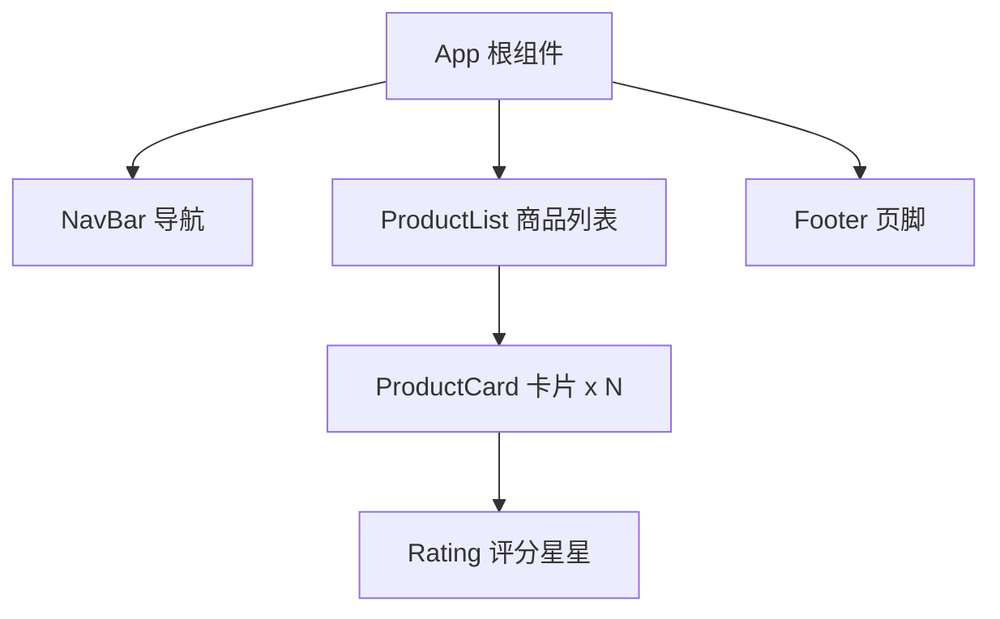
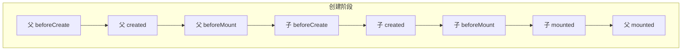
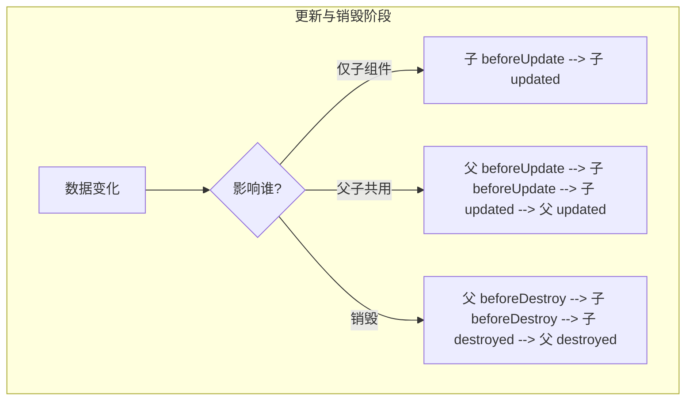

# Vue2 组件与生命周期

> 前置：[[前端开发/03-JS框架/Vue/01-Vue2基础|Vue2 基础]]
> 目标：掌握组件定义注册、props 单向数据流、自定义事件、插槽，理解父子生命周期顺序与 mixin 的局限。

---

## 1. 组件化思想

组件是可复用的 Vue 实例，拥有自己的模板、数据与逻辑。页面不再是一整坨 HTML，而是像搭积木一样由组件组合而成——这与 Java 中"类封装行为、对象组合成系统"的思想一脉相承。



拆得好的组件系统：每个组件职责单一、可独立测试、可复用，就像 Java 里一个类只做一件事。

## 2. 组件定义与注册

### 2.1 全局注册

```js
// 全局组件：注册后任何实例/组件都能用
Vue.component('my-button', {
  template: '<button @click="count++">点了 {{ count }} 次</button>',
  data() { return { count: 0 } }   // 组件的 data 必须是函数！
});
new Vue({ el: '#app' });
```

```html
<div id="app">
  <my-button></my-button>
  <my-button></my-button>   <!-- 每个实例的 count 互不影响 -->
</div>
```

注意：组件名推荐**短横线命名**（`my-button`），避免与原生 HTML 元素冲突；`data` 必须是函数（原因见上一章，防止多实例共享数据）。

### 2.2 局部注册（工程化主流）

单文件组件（`.vue` 文件）+ 局部注册：

```html
<!-- MyButton.vue -->
<template>
  <button class="btn" @click="$emit('click')">点我</button>
</template>

<script>
export default { name: 'MyButton' };
</script>

<style scoped>
.btn { padding: 6px 16px; }
/* scoped：样式只作用于当前组件，原理是给元素加 data-v-xxx 属性选择器 */
</style>
```

```html
<!-- App.vue 中局部注册 -->
<template>
  <MyButton @click="onClick"></MyButton>
</template>

<script>
import MyButton from './MyButton.vue';

export default {
  components: {
    MyButton        // 只在当前组件可用；ES6 简写等价于 MyButton: MyButton
  },
  methods: {
    onClick() { console.log('按钮被点击'); }
  }
};
</script>
```

全局注册会让所有组件始终加载、依赖关系不明确；工程化项目一律用局部注册。

## 3. props：父传子

### 3.1 基本用法与类型校验

```html
<!-- ProductCard.vue -->
<template>
  <div class="card">
    <h3>{{ title }}</h3>
    <p>价格：{{ price }} 元</p>
    <p v-if="tags.length">标签：{{ tags.join(' / ') }}</p>
  </div>
</template>

<script>
export default {
  name: 'ProductCard',
  props: {
    title: { type: String, required: true },          // 必填校验
    price: {
      type: Number,
      default: 0,
      validator(value) { return value >= 0; }         // 自定义校验，失败时控制台警告
    },
    tags: {
      type: Array,
      default() { return []; }   // 数组/对象的默认值必须用工厂函数返回！
    }
  }
};
</script>
```

```html
<ProductCard :title="item.name" :price="item.price" :tags="item.tags"></ProductCard>
```

类型校验在开发阶段非常有用：传错类型控制台直接警告，类似 TypeScript 的编译期检查但发生在运行时。### 3.2 单向数据流原则

**props 是单向向下的：父组件的数据变化会流向子组件，但子组件绝不能反向修改 props。**

```js
export default {
  props: ['initialCount'],
  data() {
    return { count: this.initialCount };   // 正确做法：拷贝为本地初值
  },
  created() {
    // 错误示范：直接改 props，控制台警告且破坏数据流向
    // this.initialCount = 100;
  }
};
```

为什么禁止改 props？类比 Spring 的构造器注入——依赖被注入后就不该被 Bean 自己篡改，否则父组件的状态与子组件显示不一致，数据流无法追踪。子组件想改变状态，应该**通知父组件去改**，这就是自定义事件。

## 4. 自定义事件 $emit：子传父

```html
<!-- SearchBar.vue 子组件 -->
<template>
  <div>
    <input v-model="keyword" @keyup.enter="doSearch">
    <button @click="doSearch">搜索</button>
  </div>
</template>

<script>
export default {
  data: () => ({ keyword: '' }),
  methods: {
    doSearch() {
      // 第一个参数是事件名，后续参数传给监听回调
      this.$emit('search', this.keyword);
    }
  }
};
</script>
```

```html
<!-- 父组件监听 -->
<SearchBar @search="onSearch"></SearchBar>

<script>
export default {
  methods: {
    onSearch(keyword) {
      console.log('收到子组件的搜索词：' + keyword);
      // 由父组件发起请求、更新父组件的状态
    }
  }
};
</script>
```
这样数据流闭环了：props 向下传递数据，事件向上传递意图，所有状态的真正修改都发生在父组件（或更上层的 store）——这就是 Vue 的单向数据流架构，与 Flux/Redux 思想同源。

## 5. 插槽 slot

插槽让子组件预留"占位"，由父组件决定填充什么内容——相当于组件版的方法参数。

### 5.1 默认插槽与后备内容

```html
<!-- MyCard.vue：父组件没传内容时，显示后备内容 -->
<template>
  <div class="card">
    <div class="card-body"><slot>默认内容</slot></div>
  </div>
</template>
```

```html
<MyCard><p>我是父组件塞进来的内容</p></MyCard>
<MyCard></MyCard>  <!-- 显示"默认内容" -->
```

### 5.2 具名插槽

一个组件需要多个占位时，用 `name` 区分（没有名字的就是 default）：

```html
<!-- Layout.vue -->
<template>
  <div class="layout">
    <header><slot name="header"></slot></header>
    <main><slot></slot></main>
    <footer><slot name="footer"></slot></footer>
  </div>
</template>
```

```html
<Layout>
  <template v-slot:header>          <!-- 缩写 #header -->
    <h1>页头标题</h1>
  </template>
  <p>主体内容</p>                    <!-- 落到默认插槽 -->
  <template #footer><p>版权信息</p></template>
</Layout>
```

### 5.3 作用域插槽

有时填充内容需要用到**子组件内部的数据**。作用域插槽把子组件数据"反向暴露"给父组件的插槽内容：

```html
<!-- TodoList.vue 子组件持有列表数据 -->
<template>
  <ul>
    <li v-for="(todo, index) in filteredTodos" :key="todo.id">
      <!-- 把 todo 作为插槽 props 暴露出去 -->
      <slot :todo="todo" :index="index">{{ todo.text }}</slot>
    </li>
  </ul>
</template>

<script>
export default {
  props: ['todos'],
  computed: {
    filteredTodos() { return this.todos.filter(t => !t.done); }
  }
};
</script>
```

```html
<!-- 父组件决定每一项怎么渲染，但数据来自子组件 -->
<TodoList :todos="todos">
  <template v-slot:default="{ todo, index }">
    <span v-if="index % 2 === 0">{{ index }}. {{ todo.text }}</span>
    <strong v-else>{{ todo.text }}</strong>
  </template>
</TodoList>
```

记忆方式：普通插槽是"父传模板给子"，作用域插槽是"子把数据借给父的模板用"。Element UI 的表格列自定义渲染就是典型应用。

## 6. 父子生命周期执行顺序

组件嵌套时的钩子顺序是高频面试题，规则一句话：**父先创建，子先挂载；销毁时子先销毁。**





实践推论：父的 mounted 里能安全访问子组件（`this.$refs.child`），因为子的 mounted 已先完成；销毁清理逻辑写在子组件自己的 `beforeDestroy` 中即可，父销毁会级联触发。

## 7. 混入 mixin 及其问题

### 7.1 基本用法

mixin 把多个组件的公共选项抽出来混入复用：

```js
// resizeMixin.js
export const resizeMixin = {
  data() {
    return { windowWidth: window.innerWidth };
  },
  mounted() {
    this._onResize = () => { this.windowWidth = window.innerWidth; };
    window.addEventListener('resize', this._onResize);
  },
  beforeDestroy() {
    window.removeEventListener('resize', this._onResize);
  },
  methods: {
    isMobile() { return this.windowWidth < 768; }
  }
};
```

使用方只需一行 `mixins: [resizeMixin]`，`this.windowWidth`、`this.isMobile()` 即直接可用。

合并规则：data 与 methods 同名时**组件自身的覆盖 mixin 的**；生命周期钩子则都会执行，mixin 的先执行。

### 7.2 mixin 的三大问题

1. **来源不明**：组件里出现 `this.windowWidth`，翻遍组件代码也找不到定义，要去追查每个 mixin——大项目里 mixin 叠 mixin 就是灾难。
2. **命名冲突**：两个 mixin 都定义了 `init()` 方法，合并规则隐蔽，覆盖关系难以推理。
3. **隐式耦合**：mixin 可能依赖组件的某个属性，这种契约没有任何显式声明，重构极易踩雷。

对 Java 开发者来说，mixin 相当于"多重继承"+"隐式注解"的混合体：继承关系不可见，方法注入无契约。这正是 Vue3 推出 Composition API（[[前端开发/03-JS框架/Vue3/02-组合式API|组合式 API]]）的核心动机——用显式导入的函数替代隐式混入。

## 8. 实战：可复用卡片列表 + 分页组件

CLI 项目中新建 `src/components/CardItem.vue`、`CardList.vue`、`Pagination.vue` 三个文件：

```html
<!-- components/CardItem.vue -->
<template>
  <div class="card-item">
    <h3>{{ item.title }}</h3>
    <p>{{ item.desc }}</p>
    <!-- 具名插槽：允许父组件定制操作区 -->
    <div class="actions">
      <slot name="actions">
        <button @click="$emit('view', item)">查看详情</button>
      </slot>
    </div>
  </div>
</template>

<script>
export default {
  name: 'CardItem',
  props: { item: { type: Object, required: true } }
};
</script>

<style scoped>
.card-item { border: 1px solid #e0e0e0; border-radius: 8px; padding: 14px; }
.actions { margin-top: 10px; display: flex; gap: 8px; }
</style>
```

```html
<!-- components/CardList.vue -->
<template>
  <div>
    <p v-if="!items.length">暂无数据</p>
    <div class="grid">
      <!-- 作用域插槽：把每一项数据暴露给使用者 -->
      <CardItem v-for="(item, i) in pagedItems" :key="item.id"
                :item="item" @view="$emit('view', $event)">
        <template v-slot:actions>
          <slot name="item-actions" :item="item"></slot>
        </template>
      </CardItem>
    </div>
    <Pagination :total="items.length" :page-size="pageSize"
                v-model="currentPage"></Pagination>
  </div>
</template>

<script>
import CardItem from './CardItem.vue';
import Pagination from './Pagination.vue';

export default {
  name: 'CardList',
  components: { CardItem, Pagination },
  props: {
    items: { type: Array, required: true },     // 全量数据
    pageSize: { type: Number, default: 6 }
  },
  data: () => ({ currentPage: 1 }),             // 内部维护当前页
  computed: {
    pagedItems() {                              // computed 派生当前页切片
      const start = (this.currentPage - 1) * this.pageSize;
      return this.items.slice(start, start + this.pageSize);
    }
  },
  watch: {
    items() { this.currentPage = 1; }           // 数据源变了回到第一页
  }
};
</script>

<style scoped>
.grid { display: grid; grid-template-columns: repeat(3, 1fr); gap: 12px; }
</style>
```

```html
<!-- components/Pagination.vue -->
<template>
  <div class="pagination">
    <button :disabled="page <= 1" @click="go(page - 1)">上一页</button>
    <button v-for="p in totalPages" :key="p"
            :class="{ active: p === page }" @click="go(p)">{{ p }}</button>
    <button :disabled="page >= totalPages" @click="go(page + 1)">下一页</button>
    <span>共 {{ total }} 条</span>
  </div>
</template>

<script>
export default {
  name: 'Pagination',
  props: {
    total: { type: Number, required: true },    // 总条数
    pageSize: { type: Number, default: 10 },
    value: { type: Number, default: 1 }         // 配合 v-model 的约定属性名
  },
  computed: {
    totalPages() { return Math.max(1, Math.ceil(this.total / this.pageSize)); },
    page() { return this.value; }
  },
  methods: {
    go(p) {
      if (p < 1 || p > this.totalPages || p === this.page) return;
      // v-model 本质：接收 value 并触发 input 事件（见第一章语法糖）
      this.$emit('input', p);
    }
  }
};
</script>

<style scoped>
.pagination button { margin-right: 4px; cursor: pointer; }
.pagination .active { background: #42b983; color: #fff; }
</style>
```

```html
<!-- App.vue 使用方 -->
<template>
  <div id="app">
    <h2>商品列表</h2>
    <CardList :items="products" @view="showDetail">
      <!-- 定制每个卡片的操作按钮 -->
      <template v-slot:item-actions="{ item }">
        <button @click="buy(item)">购买</button>
        <button @click="fav(item)">收藏</button>
      </template>
    </CardList>
  </div>
</template>

<script>
import CardList from './components/CardList.vue';

export default {
  name: 'App',
  components: { CardList },
  data: () => ({ products: [] }),
  created() {
    // 模拟接口数据：23 条商品（实际项目由 axios 请求填充）
    this.products = Array.from({ length: 23 }, (_, i) => ({
      id: i + 1,
      title: '商品 ' + (i + 1),
      desc: '这是商品 ' + (i + 1) + ' 的描述'
    }));
  },
  methods: {
    showDetail(item) { alert('查看：' + item.title); },
    buy(item) { alert('购买：' + item.title); },
    fav(item) { alert('收藏：' + item.title); }
  }
};
</script>
```

本实战覆盖了本章全部要点：**局部注册**（App 引入 CardList，CardList 引入子组件）、**props 类型校验**、**$emit 子传父**（分页 change、卡片 view 逐层上报）、**具名 + 作用域插槽**（操作区完全由使用方定制）、**v-model 复用**（Pagination 实现 `value` + `input` 协议）、**computed 分页切片**、**watch 重置状态**。

---

## 小结

| 知识点 | 一句话 |
|--------|--------|
| 组件注册 | 工程化用局部注册，全局注册慎用 |
| props | 类型校验 + 单向数据流，子组件不许改 |
| $emit | 子传父的唯一正道，配合 v-model 语法糖 |
| 插槽 | 默认/具名定结构，作用域插槽传数据 |
| 生命周期顺序 | 父先创建、子先挂载、子先销毁 |
| mixin | 能复用但来源不明、易冲突，Vue3 用组合式函数取代 |

下一步给应用装上"导航系统"：[[前端开发/03-JS框架/Vue/03-VueRouter|VueRouter]]。
