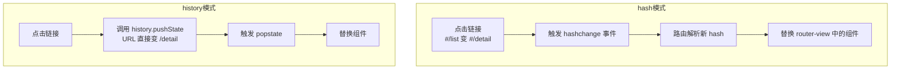
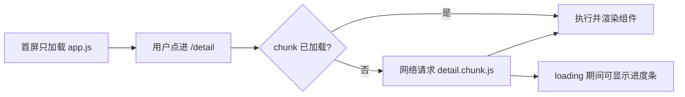

# Vue Router：单页应用的路由系统

> 前置：[[前端开发/03-JS框架/Vue/02-组件与生命周期|组件与生命周期]]
> 版本：本章基于 Vue Router 3（配套 Vue2）。Vue Router 4 的变化见 [[前端开发/03-JS框架/Vue3/04-Pinia与VueRouter4|Pinia 与 Vue Router 4]]。

---

## 1. SPA 与前端路由原理

### 1.1 从多页应用到单页应用

传统多页应用（MPA）每次跳转都向服务器请求全新 HTML，浏览器整页刷新——对 Java 开发者就是最早的 JSP/Thymeleaf 模式。单页应用（SPA）则只从服务器取**一个** HTML 骨架 + JS 包，之后所有"页面切换"都由前端 JS 完成：销毁旧组件、挂载新组件，不重新请求页面。前端路由就是维护"URL 与组件"映射关系的模块。

### 1.2 hash 模式 vs history 模式

浏览器改变 URL 但不刷新页面的手段只有两种，正好对应两种路由模式：



| 对比项 | hash 模式 | history 模式 |
|--------|-----------|--------------|
| URL 形态 | `/#/user/1`（带 #） | `/user/1`（干净美观） |
| 实现原理 | `hashchange` 事件 | `pushState` / `popstate` API |
| 服务器配置 | 不需要（# 后内容不发给服务器） | **需要**：任意路径都回退到 index.html |
| SEO | 较差 | 相对好 |
| 兼容性 | 全兼容 | IE10+ |

history 模式的关键坑：用户直接访问 `/user/1` 或刷新时，请求会真的发到服务器，而服务器上并没有这个路径的文件，会 404。解决方法是 nginx 配置 `try_files` 把所有路径回退到 index.html（部署细节见 [[前端开发/03-JS框架/Vue/05-Vue2实战|Vue2 实战]]）。

## 2. 安装与基本配置

### 2.1 四步接入

```bash
npm install vue-router@3   # Vue2 配套 Vue Router 3
```

```js
// src/router/index.js
import Vue from 'vue';
import VueRouter from 'vue-router';
import Home from '../views/Home.vue';
import List from '../views/List.vue';
import Detail from '../views/Detail.vue';

Vue.use(VueRouter);   // 必须先注册插件

const routes = [
  { path: '/', name: 'home', component: Home },
  { path: '/list', name: 'list', component: List },
  { path: '/detail/:id', name: 'detail', component: Detail },
  { path: '*', redirect: '/' }        // 兜底：未匹配路径重定向首页
];

export default new VueRouter({
  mode: 'hash',       // 或 'history'
  routes              // routes 不是 routers！常见手误
});
```

```js
// src/main.js
import Vue from 'vue';
import App from './App.vue';
import router from './router';

new Vue({
  router,             // 注入根实例后，所有组件可通过 this.$router/$route 访问
  render: h => h(App)
}).$mount('#app');
```

用 Java 类比：routes 数组就像 Spring MVC 的 `@RequestMapping` 注册表——URL 到处理器（这里是组件）的映射集中管理；`router` 注入根实例则像把 DispatcherServlet 装配进容器。

### 2.2 路由出口与导航标签

```html
<!-- App.vue -->
<template>
  <div id="app">
    <nav>
      <!-- router-link 渲染成 <a>，但拦截了默认跳转，走路由切换 -->
      <router-link to="/">首页</router-link>
      <router-link to="/list">列表</router-link>
      <!-- 当前路由对应的链接会自动加 router-link-active 类 -->
    </nav>

    <!-- 匹配到的组件渲染在这里 -->
    <router-view></router-view>
  </div>
</template>
```

- `<router-link>`：声明式导航，最终渲染为 `<a href="#/xxx">`，同时阻止浏览器默认行为。
- `<router-view>`：占位出口，当前匹配的组件显示于此。
- 激活样式类：`router-link-active`、`router-link-exact-active`。

## 3. 动态路由：路径参数

详情页需要根据 id 加载数据，用 `:参数名` 定义动态段：

```js
const routes = [
  // 一个规则匹配所有 /detail/1、/detail/abc……
  { path: '/detail/:id', component: Detail },
  // 可选多个参数：/docs/vue/router
  { path: '/docs/:category/:slug?', component: Docs }
];
```

```html
<!-- Detail.vue 中获取参数 -->
<template>
  <div>正在查看 id 为 {{ $route.params.id }} 的详情</div>
</template>

<script>
export default {
  computed: {
    detailId() { return this.$route.params.id; }   // 字符串类型，注意转数字
  },
  watch: {
    // 关键细节：从 /detail/1 切到 /detail/2 时组件被复用，
    // 生命周期钩子不会重新执行，必须 watch 参数变化重新加载数据！
    '$route.params.id'(newId) { this.loadDetail(newId); }
  },
  created() { this.loadDetail(this.$route.params.id); },
  methods: {
    loadDetail(id) { /* axios.get('/api/detail/' + id) */ }
  }
};
</script>
```

**$route 与 $router 的区别**（高频面试题）：`this.$route` 是当前路由信息对象（params、query、path、matched）；`this.$router` 是全局路由器实例（push、replace、go 等方法）。前者像"当前请求的 HttpServletRequest"，后者像"整个 DispatcherServlet"。查询参数则通过 `$route.query` 获取：`/search?keyword=vue` 对应 `this.$route.query.keyword`，无需在 path 中声明。

## 4. 嵌套路由 children

页面内部还有自己的"子页面"（如后台布局中的侧栏 + 内容区），用 children 实现：

```js
const routes = [
  {
    path: '/admin',
    component: AdminLayout,          // 外层布局组件
    children: [
      // 子路由 path 不带 / 开头，会拼接父路径
      { path: 'dashboard', component: Dashboard },   // /admin/dashboard
      { path: 'users', component: UserManage },      // /admin/users
      { path: '', redirect: 'dashboard' }            // 默认子路由
    ]
  }
];
```

```html
<!-- AdminLayout.vue -->
<template>
  <div class="admin">
    <aside class="sidebar">
      <router-link to="/admin/dashboard">仪表盘</router-link>
      <router-link to="/admin/users">用户管理</router-link>
    </aside>
    <!-- 二级出口：子路由组件渲染在这里 -->
    <main class="content">
      <router-view></router-view>
    </main>
  </div>
</template>
```

嵌套层级可以任意深，每层都有自己的 `<router-view>`，形成组件树与路由树的对应关系。

## 5. 编程式导航

除了 `<router-link>`，还可以在 JS 里控制跳转：

```js
export default {
  methods: {
    goDetail(id) {
      // 等价于 location.href = '#/detail/' + id，但不刷新页面
      this.$router.push('/detail/' + id);
      // 命名路由 + params 写法
      this.$router.push({ name: 'detail', params: { id } });
      // query 写法：URL 形如 /search?keyword=vue&page=2
      this.$router.push({ path: '/search', query: { keyword: 'vue', page: 2 } });
    },
    goBack() {
      this.$router.go(-1);        // 等价于 history.go(-1)
      // this.$router.replace('/login')  // replace 不留历史记录
    }
  }
};
```

三种方法速记：`push` 跳转并入栈、`replace` 替换当前记录不入栈、`go(n)` 移动栈指针。典型场景：登录成功后 `replace('/home')`（防止后退回登录页）；表单提交后 push 到结果页。

## 6. 导航守卫：beforeEach 登录鉴权

导航守卫是路由跳转过程中的拦截器——Java 开发者可以把它理解为 Spring MVC 的拦截器（HandlerInterceptor）：preHandle 放行返回 true，Vue 里调用 next() 放行。守卫按执行顺序分三层：全局前置 `router.beforeEach`、路由独享 `beforeEnter`、组件内 `beforeRouteEnter / beforeRouteUpdate / beforeRouteLeave`。

最经典的全局登录鉴权：

```js
// src/router/index.js
const routes = [
  { path: '/login', component: Login, meta: { public: true } },
  { path: '/', component: Home, meta: { requiresAuth: true } },
  {
    path: '/admin',
    component: Admin,
    meta: { requiresAuth: true, roles: ['admin'] },   // 元信息随路由携带
    children: [/* ... */]
  }
];

const router = new VueRouter({ mode: 'history', routes });

router.beforeEach((to, from, next) => {
  // to：即将进入的目标路由对象；from：当前正要离开的路由；next：放行函数
  const token = localStorage.getItem('token');

  if (to.meta.requiresAuth && !token) {
    // 需要登录但没登录：重定向到登录页，并记录来源以便登录后跳回
    next({
      path: '/login',
      query: { redirect: to.fullPath }
    });
  } else if (to.meta.roles && !to.meta.roles.includes(getUserRole())) {
    // 角色不符：无权限
    next('/403');
  } else {
    next();   // 一切正常，放行。忘记调用 next() 页面会卡死！
  }
});

function getUserRole() {
  return JSON.parse(localStorage.getItem('user') || '{}').role;
}

export default router;
```

```js
// Login.vue 登录成功后跳回来源页
methods: {
  async handleLogin() {
    await api.login(this.form.username, this.form.password);
    const redirect = this.$route.query.redirect || '/';
    this.$router.replace(redirect);
  }
}
```

要点：`meta` 是给路由附加自定义数据的字段，守卫里通过 `to.meta` 读取；`next()` 必须且只能调用一次（`next(false)` 中止导航、`next(路径)` 重定向），忘记调用页面会卡死。

组件内守卫常用于表单未保存时拦截离开：

```js
export default {
  beforeRouteLeave(to, from, next) {
    if (this.dirty) {
      next(window.confirm('有未保存的修改，确定离开？'));
    } else {
      next();
    }
  }
};
```

## 7. 路由懒加载

前面的配置把所有页面组件静态 import，打包后全部塞进一个大 JS 文件——首屏加载慢。懒加载让每个页面单独成块，访问到才下载：

```js
const routes = [
  // 写法一：箭头函数返回动态 import（官方推荐）
  {
    path: '/detail/:id',
    component: () => import(/* webpackChunkName: "detail" */ '../views/Detail.vue')
  },
  // 写法二：Webpack 魔法注释分组——小页面合并成一个 chunk
  {
    path: '/about',
    component: () => import(/* webpackChunkName: "misc" */ '../views/About.vue')
  },
  {
    path: '/help',
    component: () => import(/* webpackChunkName: "misc" */ '../views/Help.vue')
  }
];
```

原理一句话：`import()` 是 Webpack 认识的代码分割点，构建时每个动态 import 生成独立 chunk 文件，运行时首次匹配到该路由才通过 JSONP/script 标签拉取并执行对应 chunk，再渲染组件。



实践建议：首页直接静态引入保证首屏速度；其余页面全部懒加载。这是 Vue 项目性能优化的第一步。

## 8. 实战：三页面前台（首页 / 列表 / 详情）

完整目录结构：

```
src/
├── main.js
├── App.vue
├── router/index.js
└── views/
    ├── Home.vue
    ├── NewsList.vue
    └── NewsDetail.vue
```

```js
// src/router/index.js —— 本实战的完整配置
import Vue from 'vue';
import VueRouter from 'vue-router';

Vue.use(VueRouter);

const routes = [
  {
    path: '/',
    name: 'home',
    component: () => import('../views/Home.vue')
  },
  {
    path: '/news',
    name: 'news',
    component: () => import('../views/NewsList.vue')
  },
  {
    // 动态路由 + props 解耦：params.id 直接作为组件的 prop
    path: '/news/:id',
    name: 'newsDetail',
    component: () => import('../views/NewsDetail.vue'),
    props: true
  },
  { path: '*', redirect: '/' }
];

export default new VueRouter({ mode: 'hash', routes });
```

```html
<!-- src/App.vue -->
<template>
  <div id="app">
    <header class="nav">
      <h1 @click="$router.push('/')">Demo 前台</h1>
      <nav>
        <router-link to="/">首页</router-link>
        <router-link to="/news">新闻列表</router-link>
      </nav>
    </header>
    <router-view></router-view>
  </div>
</template>

<style scoped>
.nav { display: flex; justify-content: space-between; padding: 12px 24px; }
.nav a.router-link-active { color: #42b983; font-weight: bold; text-decoration: none; }
</style>
```

```html
<!-- src/views/Home.vue -->
<template>
  <div class="home">
    <h2>欢迎</h2>
    <p>今日头条：<router-link :to="{ name: 'newsDetail', params: { id: 1 } }">
      {{ topNews.title }}
    </router-link></p>
  </div>
</template>

<script>
export default {
  data() {
    return { topNews: { id: 1, title: 'Vue2 依然在生产环境服役' } };
  }
};
</script>
```

```html
<!-- src/views/NewsList.vue -->
<template>
  <div class="list">
    <p v-if="loading">加载中...</p>
    <ul v-else>
      <li v-for="item in news" :key="item.id">
        <router-link :to="'/news/' + item.id">{{ item.title }}</router-link>
        <span>{{ item.date }}</span>
      </li>
    </ul>
  </div>
</template>

<script>
export default {
  data: () => ({ news: [], loading: false }),
  created() { this.fetchList(); },
  methods: {
    fetchList() {
      this.loading = true;
      // mock 数据，后续章节换成 axios 真实请求
      setTimeout(() => {
        this.news = Array.from({ length: 8 }, (_, i) => ({
          id: i + 1,
          title: '新闻标题 ' + (i + 1),
          date: '2026-08-' + (10 + i)
        }));
        this.loading = false;
      }, 300);
    }
  }
};
</script>
```

```html
<!-- src/views/NewsDetail.vue：props: true 时直接用 props 接收 id -->
<template>
  <div class="detail">
    <button @click="$router.back()">返回</button>
    <h2>{{ detail.title }}</h2>
    <p>{{ detail.content }}</p>
  </div>
</template>

<script>
export default {
  props: ['id'],                    // 来自路由 params（props: true）
  data: () => ({ detail: {} }),
  created() { this.fetchDetail(); },
  watch: {
    id(newId) { this.fetchDetail(newId); }   // 同组件参数变化时刷新
  },
  methods: {
    fetchDetail(newsId = this.id) {
      this.detail = {
        title: '新闻 ' + newsId + ' 的标题',
        content: '新闻 ' + newsId + ' 的正文内容……'
      };
    }
  }
};
</script>
```

覆盖要点回顾：

1. **懒加载**：三个页面全部 `() => import()` 按需加载。
2. **动态路由**：`/news/:id` + `props: true` 让组件摆脱 `$route` 依赖（更易测试）。
3. **watch 参数复用**：详情组件在参数变化时重新拉数据，而不是重建实例。
4. **命名路由**：Home 里用 `{ name, params }` 对象写法跳转。
5. **激活态样式**：`.router-link-active` 高亮当前导航。
6. **编程式导航**：`$router.push` 与 `$router.back` 混合使用。

---

## 小结

| 知识点 | 一句话 |
|--------|--------|
| hash vs history | hash 不需要服务器配合；history 要 try_files 回退 |
| routes + router-view | URL 到组件的注册表 + 渲染出口 |
| 动态路由 | `:id` 取 `$route.params`，组件复用要 watch |
| 嵌套路由 | children + 内层 router-view |
| 编程式导航 | push 入栈、replace 替换、go 移动 |
| 导航守卫 | beforeEach 就是前端版 HandlerInterceptor |
| 懒加载 | `() => import()` 按 chunk 分包，首屏提速 |

状态多到 props 传不动了怎么办？下一章引入 Vuex：[[前端开发/03-JS框架/Vue/04-Vuex状态管理|Vuex 状态管理]]。
