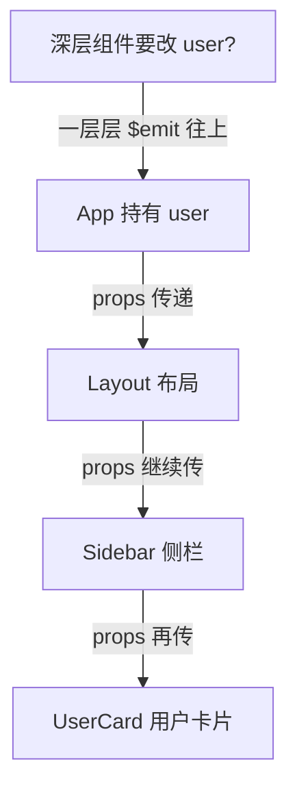
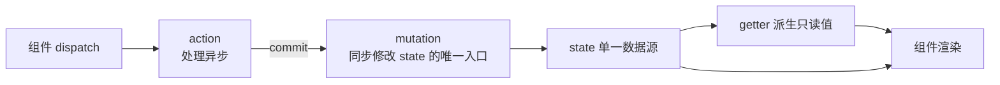
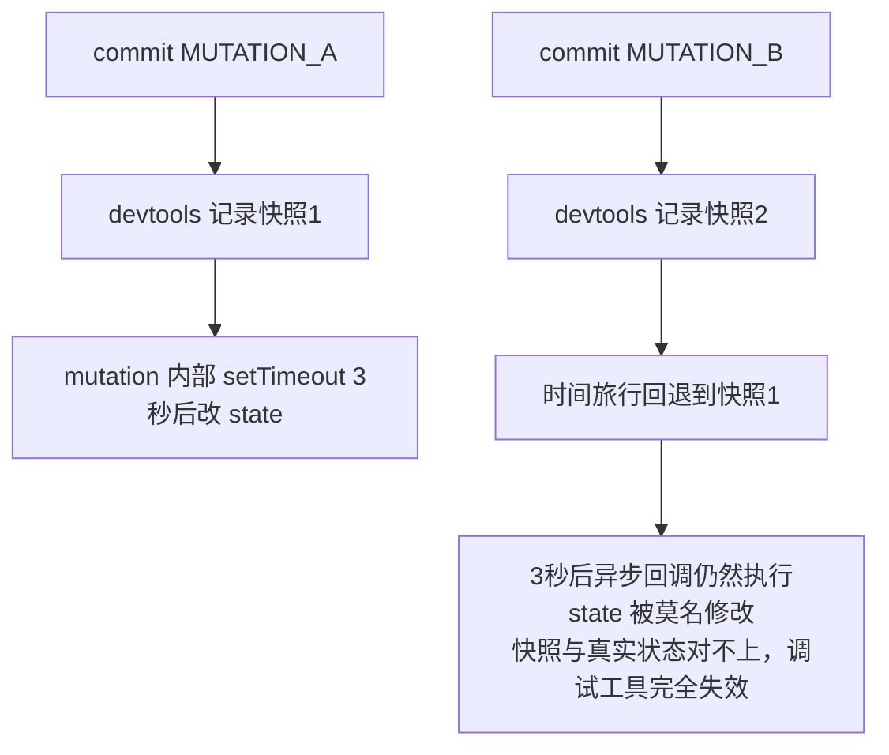
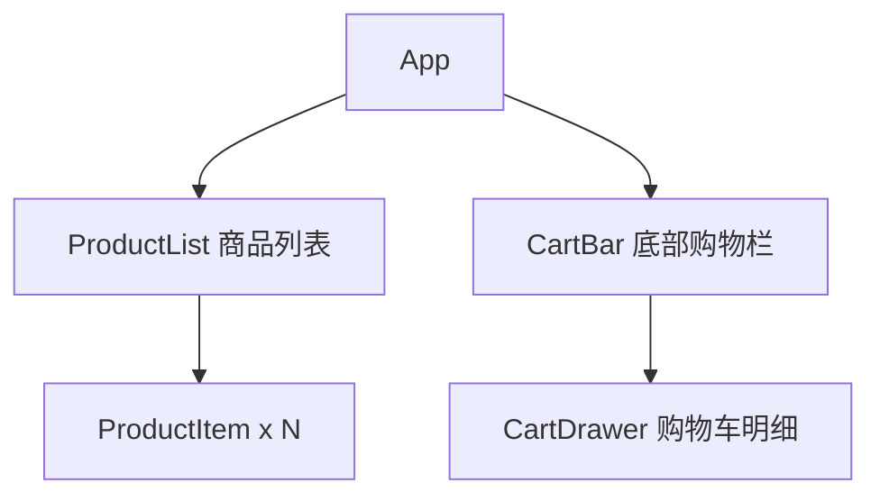

# Vuex 状态管理

> 前置：[[前端开发/03-JS框架/Vue/02-组件与生命周期|组件与生命周期]]
> 目标：理解为什么需要集中式状态管理，掌握 Vuex 五个核心概念与购物车实战。

---

## 1. 为什么需要全局状态

### 1.1 props 层层传递的痛苦

上一章的单向数据流在小组件树里很好用，但组件层级一深就出问题：



问题清单：

- **传递链冗长**：中间三层根本不用 `user`，却被迫声明 props 转发（prop drilling）。
- **事件回传繁琐**：深层组件修改数据，要 `$emit` 一路冒泡到真正持有数据的祖先。
- **兄弟组件难通信**：两个平级组件共享数据，只能借助共同父组件中转。

用 Java 类比：这就像所有 Bean 之间都靠构造器参数一层层传递同一个上下文对象——没人这么干，大家把共享状态放进 Spring 容器统一管理。Vuex 就是前端的"容器"：**单一数据源、集中管控**。

### 1.2 什么状态该放 Vuex

不是所有数据都要进 store。经验判断：

| 放入 Vuex | 留在组件内部 |
|-----------|--------------|
| 登录用户信息、token | 输入框草稿、开关 |
| 购物车内容 | 列表局部选中态 |
| 全局主题、权限菜单 | 只属于本组件的 UI 状态 |

一句话：**被多个不相关组件共享的状态才进 Vuex**，否则徒增样板代码。

## 2. Vuex 核心概念

### 2.1 安装与最简示例

```bash
npm install vuex@3   # Vue2 配套 Vuex 3
```

```js
// src/store/index.js
import Vue from 'vue';
import Vuex from 'vuex';

Vue.use(Vuex);

export default new Vuex.Store({
  state: {
    count: 0                    // 单一数据源：整个应用只有这一棵状态树
  },
  mutations: {
    INCREMENT(state) {          // 约定大写命名，像数据库迁移脚本的风格
      state.count++;
    }
  },
  actions: {
    asyncIncrement({ commit }) {
      setTimeout(() => commit('INCREMENT'), 1000);   // 异步逻辑在这里
    }
  },
  getters: {
    doubleCount(state) {
      return state.count * 2;   // 像 computed：基于 state 的派生值且带缓存
    }
  }
});
```

```js
// main.js 注入根实例
new Vue({
  store,
  render: h => h(App)
}).$mount('#app');
```

五个核心概念的关系图：



记忆口诀：**组件 dispatch action，action commit mutation，mutation 改 state，state 经 getter 渲染回组件**。单向闭环，和 Flux 架构同源。

### 2.2 state 与 getter

```html
<template>
  <div>
    <!-- 直接使用 -->
    <p>{{ $store.state.count }}</p>
    <p>{{ $store.getters.doubleCount }}</p>

    <!-- 在计算属性中使用更常见 -->
    <p>{{ count }} / {{ doubleCount }}</p>
  </div>
</template>

<script>
export default {
  computed: {
    count() { return this.$store.state.count; },
    doubleCount() { return this.$store.getters.doubleCount; }
  }
};
</script>
```

getter 可以接收其他 getter，也能返回函数供组件传参调用：

```js
getters: {
  // getter 引用 getter
  tripleCount(state) { return this.doubleCount * 1.5; },
  // 返回函数：像方法一样调用 getTodoById(3)
  getTodoById: (state) => (id) => state.todos.find(t => t.id === id)
}
```

### 2.3 mutation：同步的唯一修改入口

```js
mutations: {
  // 载荷 payload：单个参数直接传，多个参数习惯用对象
  INCREMENT(state) {
    state.count++;
  },
  ADD_TODO(state, todo) {
    state.todos.push(todo);
  },
  SET_TODOS(state, todos) {
    state.todos = todos;        // 整体替换也是合法的修改方式
  }
}
// 组件中提交
this.$store.commit('ADD_TODO', { id: 1, text: '学 Vuex' });
this.$store.commit('SET_TODOS', serverTodos);
```

**为什么 mutation 必须是同步函数？**

Vuex 的 devtools 会记录每一次 mutation 及其前后的状态快照，从而实现"时间旅行调试"——你可以回退到任意一次 mutation 之前的状态。如果 mutation 里写异步代码：



同步约束保证：**任何时刻的状态变化都能与 devtools 里的一条记录精确对应**，可追溯、可回放。这是工程纪律而非技术限制——类比 Java 团队规定"所有状态变更必须走 Service 层并打审计日志"，为的是可追溯性。

### 2.4 action：异步的调度员

```js
actions: {
  // context 是与 store 同结构上下文，常用解构 { commit, dispatch, state }
  async fetchTodos({ commit }) {
    const res = await axios.get('/api/todos');
    commit('SET_TODOS', res.data.data);     // 异步结果最终仍由 mutation 落库
  },
  // action 可以互相 dispatch，实现流程编排
  async initApp({ dispatch }) {
    await dispatch('fetchUser');
    await dispatch('fetchTodos');
  }
}
// 组件中触发
created() { this.$store.dispatch('fetchTodos'); }
```

action 与 mutation 的分工表：

| 维度 | mutation | action |
|------|----------|--------|
| 职责 | 修改 state | 封装异步/业务流程 |
| 触发方式 | `commit('XXX')` | `dispatch('xxx')` |
| 同步要求 | 必须同步 | 可以异步 |
| devtools 记录 | 记录每一条 | 不直接记录 |

### 2.5 module 拆分

应用变大后单一 store 会臃肿，按业务域拆模块：

```js
const userModule = {
  namespaced: true,           // 开启命名空间，避免 action/mutation 重名冲突
  state: () => ({ token: '' }),
  mutations: { SET_TOKEN(state, t) { state.token = t; } },
  actions: { async login({ commit }, form) { /* ... */ } }
};

const cartModule = {
  namespaced: true,
  state: () => ({ items: [] }),
  getters: { total: state => state.items.reduce((s, i) => s + i.price * i.qty, 0) }
};

export default new Vuex.Store({
  modules: { user: userModule, cart: cartModule }
});
```

```js
// 使用时带上模块名
this.$store.commit('user/SET_TOKEN', 'abc');       // 注意斜杠
this.$store.dispatch('cart/addItem', product);
this.$store.state.cart.items;                      // state 有模块路径
this.$store.getters['cart/total'];                 // getter 用方括号语法
```

## 3. mapXxx 辅助函数

手写 `this.$store.xxx` 太啰嗦，Vuex 提供映射函数批量生成计算属性和方法：

```html
<template>
  <div>
    <p>{{ count }} {{ doubleCount }}</p>
    <button @click="increment">+</button>
    <button @click="asyncIncrement">异步+</button>
  </div>
</template>

<script>
import { mapState, mapGetters, mapMutations, mapActions } from 'vuex';

export default {
  computed: {
    ...mapState(['count']),                  // 相当于 count() {...}
    ...mapGetters(['doubleCount'])
  },
  methods: {
    ...mapMutations(['increment']),          // 映射成 this.increment()
    ...mapActions(['asyncIncrement'])
  }
};
</script>
```

四个辅助函数对应四个概念：mapState/mapGetters 放进 computed，mapMutations/mapActions 放进 methods。展开运算符 `...` 把生成的对象混入当前配置——注意这与 mixin 不同：来源明确写在 import 里，没有隐式耦合。

## 4. 实战：购物车

需求：商品列表加购、购物车增减数量、实时总价、结算清空。组件结构：



商品数据在 ProductList 展示，购物车状态却要被 CartBar 和 CartDrawer 共享——典型的跨组件状态，全部放 Vuex：

```js
// src/store/index.js —— 完整代码
import Vue from 'vue';
import Vuex from 'vuex';

Vue.use(Vuex);

let nextId = 100;

export default new Vuex.Store({
  state: {
    products: [
      { id: 1, name: '机械键盘', price: 299 },
      { id: 2, name: '显示器', price: 1299 },
      { id: 3, name: '鼠标', price: 99 }
    ],
    items: []            // 购物车：{ id, name, price, qty }
  },

  getters: {
    cartCount: state => state.items.reduce((s, i) => s + i.qty, 0),
    totalPrice: state =>
      state.items.reduce((s, i) => s + i.price * i.qty, 0)
  },

  mutations: {
    ADD_ITEM(state, product) {
      const exist = state.items.find(i => i.id === product.id);
      if (exist) {
        exist.qty++;                       // 已有则数量+1
      } else {
        state.items.push({ ...product, qty: 1 });
      }
    },
    CHANGE_QTY(state, { id, delta }) {
      const item = state.items.find(i => i.id === id);
      if (!item) return;
      item.qty += delta;
      if (item.qty <= 0) {                 // 减到 0 移除
        state.items = state.items.filter(i => i.id !== id);
      }
    },
    CLEAR_CART(state) {
      state.items = [];
    }
  },

  actions: {
    addItem({ commit }, product) {
      commit('ADD_ITEM', product);
    },
    changeQty({ commit }, payload) {
      commit('CHANGE_QTY', payload);
    },
    // 结算：模拟异步请求后端接口，成功后清空购物车
    async checkout({ commit, state }) {
      if (!state.items.length) return;
      // await axios.post('/api/orders', { items: state.items });
      await new Promise(r => setTimeout(r, 500));
      commit('CLEAR_CART');
    }
  }
});
```

```html
<!-- src/views/Shop.vue —— 页面容器 -->
<template>
  <div class="shop">
    <h2>商品列表</h2>
    <ul>
      <li v-for="p in products" :key="p.id">
        {{ p.name }} - {{ p.price }} 元
        <button @click="addItem(p)">加入购物车</button>
      </li>
    </ul>

    <div class="cart-bar">
      购物车（{{ cartCount }} 件）合计：{{ totalPrice }} 元
      <button @click="checkout">结算</button>
    </div>

    <h3>购物车明细</h3>
    <p v-if="!items.length">空空如也</p>
    <ul v-else>
      <li v-for="i in items" :key="i.id">
        {{ i.name }} x {{ i.qty }}
        <button @click="changeQty({ id: i.id, delta: -1 })">-</button>
        <button @click="changeQty({ id: i.id, delta: 1 })">+</button>
      </li>
    </ul>
  </div>
</template>

<script>
import { mapState, mapGetters, mapActions } from 'vuex';

export default {
  computed: {
    ...mapState(['products', 'items']),
    ...mapGetters(['cartCount', 'totalPrice'])
  },
  methods: {
    ...mapActions(['addItem', 'changeQty', 'checkout'])
  }
};
</script>

<style scoped>
.cart-bar { margin-top: 16px; padding: 10px; background: #f5f5f5; border-radius: 6px; }
</style>
```

覆盖要点：

1. **getter 派生统计值**：cartCount/totalPrice 由 items 自动推导，数量变化视图即时更新。
2. **mutation 保持纯粹同步**：加购、改数量都是纯状态操作。
3. **action 包裹异步**：checkout 先模拟请求后端再清空购物车。
4. **mapXxx 批量映射**：组件内一行都不用手写 `$store`。
5. **不可变更新细节**：CHANGE_QTY 中移除商品用 filter 返回新数组；push/exist.qty++ 属于 Vue2 响应式允许的就地变更（对象已有属性），但新增属性必须用 `Vue.set`——这个坑在 [[前端开发/03-JS框架/Vue3/03-响应式原理|响应式原理]] 中彻底解决。

---

## 小结

| 知识点 | 一句话 |
|--------|--------|
| 全局状态的动机 | 跨组件共享，终结 props 层层透传 |
| state/getter | 数据源与缓存派生值，类似 data/computed |
| mutation | 同步修改的唯一入口，保证时间旅行可调试 |
| action | 异步调度员，commit mutation 落库 |
| module | 业务域拆分 + namespaced 防冲突 |
| mapXxx | 四个辅助函数消灭样板代码 |

Vue3 时代 Vuex 已被更简洁的 Pinia 取代：[[前端开发/03-JS框架/Vue3/04-Pinia与VueRouter4|Pinia 与 Vue Router 4]]。
