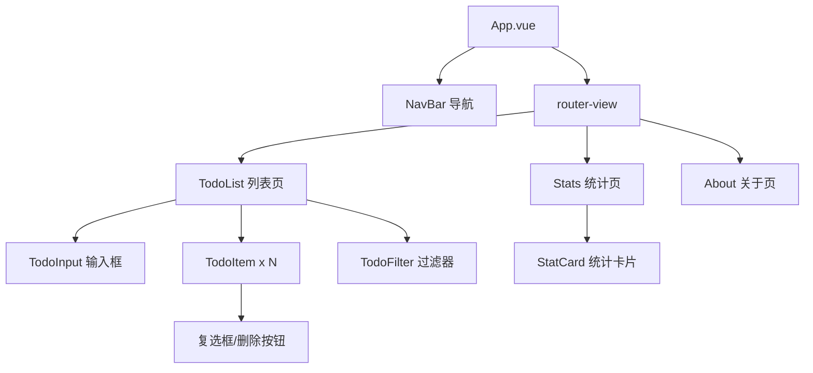
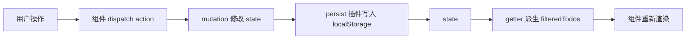

# Vue2 实战：全家桶待办应用

> 前置：[[前端开发/03-JS框架/Vue/01-Vue2基础|Vue2 基础]]、[[前端开发/03-JS框架/Vue/02-组件与生命周期|组件与生命周期]]、[[前端开发/03-JS框架/Vue/03-VueRouter|VueRouter]]、[[前端开发/03-JS框架/Vue/04-Vuex状态管理|Vuex]]
> 目标：把前四章的知识组装成一个可部署的完整项目，并掌握 Vue2 工程化要点。

---

## 1. 项目初始化

```bash
npm install -g @vue/cli
vue create vue2-todo        # 预设选 Vue 2 + Router + Vuex + ESLint + Babel
cd vue2-todo && npm run serve
```

额外安装依赖：

```bash
npm install axios           # HTTP 客户端（本章先 mock，为对接后端预留）
```

## 2. 架构设计

### 2.1 页面与组件树



职责划分：

| 层 | 文件 | 职责 |
|----|------|------|
| 路由 | router/index.js | 三页面映射 |
| 状态 | store/index.js | 任务增删改查、过滤条件 |
| 持久化 | store/plugins/persist.js | localStorage 同步 |
| API 层 | api/todo.js | mock 数据，未来换真实接口 |
| 展示 | views/* components/* | 纯渲染 + dispatch |

### 2.2 数据流约定



所有修改走 action → mutation 单向闭环；刷新页面时从 localStorage 恢复。

## 3. 核心代码实现

### 3.1 路由

```js
// src/router/index.js
import Vue from 'vue';
import VueRouter from 'vue-router';

Vue.use(VueRouter);

const routes = [
  { path: '/', name: 'todo', component: () => import('../views/TodoList.vue') },
  { path: '/stats', name: 'stats', component: () => import('../views/Stats.vue') },
  { path: '/about', name: 'about', component: () => import('../views/About.vue') },
  { path: '*', redirect: '/' }
];

export default new VueRouter({ mode: 'hash', routes });
```

### 3.2 Vuex Store

```js
// src/store/index.js
import Vue from 'vue';
import Vuex from 'vuex';
import persist from './plugins/persist';
import { fetchTodos, saveTodo, deleteTodo } from '../api/todo';

Vue.use(Vuex);

export default new Vuex.Store({
  plugins: [persist],                 // 自定义插件挂载点

  state: {
    todos: [],                        // { id, text, done, createdAt }
    filter: 'all',                    // all / active / done
    loading: false
  },

  getters: {
    filteredTodos(state) {
      if (state.filter === 'active') return state.todos.filter(t => !t.done);
      if (state.filter === 'done') return state.todos.filter(t => t.done);
      return state.todos;
    },
    total: state => state.todos.length,
    doneCount: state => state.todos.filter(t => t.done).length,
    doneRate(state) {
      return state.total === 0 ? 0 : Math.round(state.doneCount / state.total * 100);
    }
  },

  mutations: {
    SET_TODOS(state, todos) { state.todos = todos; },
    SET_LOADING(state, flag) { state.loading = flag; },
    ADD_TODO(state, todo) { state.todos.unshift(todo); },
    REMOVE_TODO(state, id) {
      state.todos = state.todos.filter(t => t.id !== id);
    },
    TOGGLE_TODO(state, id) {
      const todo = state.todos.find(t => t.id === id);
      if (todo) todo.done = !todo.done;
    },
    SET_FILTER(state, f) { state.filter = f; }
  },

  actions: {
    // 启动时加载：先尝试远端接口，失败则读本地缓存
    async init({ commit }) {
      commit('SET_LOADING', true);
      try {
        const todos = await fetchTodos();
        commit('SET_TODOS', todos);
      } finally {
        commit('SET_LOADING', false);
      }
    },
    async addTodo({ commit }, text) {
      const trimmed = text.trim();
      if (!trimmed) return;
      const todo = {
        id: Date.now(),
        text: trimmed,
        done: false,
        createdAt: new Date().toISOString()
      };
      await saveTodo(todo);           // mock 接口预留
      commit('ADD_TODO', todo);
    },
    async removeTodo({ commit }, id) {
      await deleteTodo(id);
      commit('REMOVE_TODO', id);
    },
    toggleTodo({ commit }, id) {
      commit('TOGGLE_TODO', id);
    },
    setFilter({ commit }, filter) {
      commit('SET_FILTER', filter);
    }
  }
});
```

### 3.3 localStorage 持久化插件

Vuex 插件就是一个接收 store 的函数，订阅每次 mutation：

```js
// src/store/plugins/persist.js
const KEY = 'vue2-todo-todos';

export default function persist(store) {
  // 启动时从本地恢复（仅当远端无数据）
  const cached = localStorage.getItem(KEY);
  if (cached) {
    try {
      const local = JSON.parse(cached);
      if (local.length && !store.state.todos.length) {
        store.commit('SET_TODOS', local);
      }
    } catch (e) {
      localStorage.removeItem(KEY);     // 数据损坏则清掉
    }
  }

  // 订阅后续每一次 mutation，同步到 localStorage
  store.subscribe((mutation, state) => {
    if (mutation.type === 'ADD_TODO' ||
        mutation.type === 'REMOVE_TODO' ||
        mutation.type === 'TOGGLE_TODO' ||
        mutation.type === 'SET_TODOS') {
      localStorage.setItem(KEY, JSON.stringify(state.todos));
    }
  });
}
```

要点：`store.subscribe` 能拿到每条 mutation，按类型白名单选择性持久化——这正是 mutation 必须同步带来的好处：**状态变更流是确定且可拦截的**。

### 3.4 API 层：mock 预留

```js
// src/api/todo.js —— 当前返回 mock，未来替换为 axios 真实请求
const USE_MOCK = true;

export async function fetchTodos() {
  if (USE_MOCK) {
    return [
      { id: 1, text: '复习 Vue2 生命周期', done: true, createdAt: '2026-08-20T09:00:00Z' },
      { id: 2, text: '学习 Vuex 插件机制', done: false, createdAt: '2026-08-21T10:00:00Z' }
    ];
  }
  // const res = await axios.get('/api/todos');
  // return res.data.data;
}

export async function saveTodo(todo) {
  if (USE_MOCK) return;
  // await axios.post('/api/todos', todo);
}

export async function deleteTodo(id) {
  if (USE_MOCK) return;
  // await axios.delete(`/api/todos/${id}`);
}
```

接口函数签名保持稳定，切换真实后端时只改这一个文件——这就是分层的好处，类比 Java 中 Service 接口与 Mock 实现分离。

### 3.5 视图组件

```html
<!-- src/views/TodoList.vue -->
<template>
  <div class="todo-page">
    <TodoInput @add="addTodo"></TodoInput>
    <TodoFilter :value="filter" @change="setFilter"></TodoFilter>
    <p v-if="loading">加载中...</p>
    <transition-group v-else name="list" tag="ul">
      <TodoItem v-for="t in filteredTodos" :key="t.id"
                :todo="t"
                @toggle="toggleTodo(t.id)"
                @remove="removeTodo(t.id)"></TodoItem>
    </transition-group>
    <p v-if="!loading && !filteredTodos.length">没有符合条件的任务</p>
  </div>
</template>

<script>
import { mapState, mapGetters, mapActions } from 'vuex';
import TodoInput from '@/components/TodoInput.vue';
import TodoItem from '@/components/TodoItem.vue';
import TodoFilter from '@/components/TodoFilter.vue';

export default {
  name: 'TodoList',
  components: { TodoInput, TodoItem, TodoFilter },
  computed: {
    ...mapState(['filter', 'loading']),
    ...mapGetters(['filteredTodos'])
  },
  created() {
    this.$store.dispatch('init');
  },
  methods: {
    ...mapActions(['addTodo', 'removeTodo', 'toggleTodo', 'setFilter'])
  }
};
</script>

<style scoped>
.list-enter-active, .list-leave-active { transition: all 0.3s; }
.list-enter, .list-leave-to { opacity: 0; transform: translateX(-16px); }
</style>
```

```html
<!-- src/components/TodoInput.vue -->
<template>
  <div class="input-row">
    <input v-model.trim="text" placeholder="新增任务，回车提交"
           @keyup.enter="submit">
    <button :disabled="!text" @click="submit">添加</button>
  </div>
</template>

<script>
export default {
  data: () => ({ text: '' }),
  methods: {
    submit() {
      if (!this.text) return;
      this.$emit('add', this.text);   // 交给父级 dispatch action
      this.text = '';
    }
  }
};
</script>
```

```html
<!-- src/components/TodoItem.vue -->
<template>
  <li class="todo-item" :class="{ done: todo.done }">
    <label>
      <input type="checkbox" :checked="todo.done" @change="$emit('toggle')">
      <span>{{ todo.text }}</span>
    </label>
    <button class="del" @click="$emit('remove')">删除</button>
  </li>
</template>

<script>
export default {
  name: 'TodoItem',
  props: { todo: { type: Object, required: true } }   // 只读展示，不改 props
};
</script>

<style scoped>
.todo-item.done span { color: #999; text-decoration: line-through; }
.del { float: right; }
</style>
```

```html
<!-- src/components/TodoFilter.vue -->
<template>
  <div class="filters">
    <button v-for="f in options" :key="f.value"
            :class="{ active: value === f.value }"
            @click="$emit('change', f.value)">
      {{ f.label }}
    </button>
  </div>
</template>

<script>
export default {
  props: { value: { type: String, default: 'all' } },
  data: () => ({
    options: [
      { value: 'all', label: '全部' },
      { value: 'active', label: '未完成' },
      { value: 'done', label: '已完成' }
    ]
  })
};
</script>
```

```html
<!-- src/views/Stats.vue 统计页 -->
<template>
  <div class="stats">
    <div class="cards">
      <StatCard label="总任务数" :num="total"></StatCard>
      <StatCard label="已完成" :num="doneCount"></StatCard>
      <StatCard label="完成率" :num="doneRate + '%'"></StatCard>
    </div>
    <p v-if="!total">还没有数据，先去添加任务吧</p>
    <!-- 图表占位：ECharts 集成预告 -->
  </div>
</template>

<script>
import { mapGetters } from 'vuex';

export default {
  computed: { ...mapGetters(['total', 'doneCount', 'doneRate']) }
};
</script>
```

`About.vue` 为静态介绍页，此处从略。

## 4. 工程化要点

### 4.1 ESLint 与代码规范

CLI 创建时勾选 ESLint + Prettier。核心规则建议：

```js
// .eslintrc.js 片段
module.exports = {
  rules: {
    eqeqeq: ['error', 'always'],          // 强制 ===
    'no-unused-vars': 'warn',
    'vue/no-unused-components': 'warn'
  }
};
```

配合 git hooks 在提交前自动检查（lint-staged + husky），问题代码进不了仓库——等价于 Java 项目里 SonarQube + CI 流水线的门禁角色。

### 4.2 .env 环境变量

```bash
# .env.development
VUE_APP_API_BASE=http://localhost:8080/api
VUE_APP_USE_MOCK=true

# .env.production
VUE_APP_API_BASE=https://api.example.com
VUE_APP_USE_MOCK=false
```

```js
// 使用：以 VUE_APP_ 为前缀的变量才会被注入客户端
axios.defaults.baseURL = process.env.VUE_APP_API_BASE;
```

注意这些变量会被打进构建产物，绝不能放密钥。

### 4.3 build 与 nginx 部署

```bash
npm run build       # 产出 dist/ 目录：index.html + js/css 带 hash 的静态资源
```

```nginx
server {
    listen 80;
    server_name example.com;

    root /var/www/vue2-todo/dist;
    index index.html;

    location / {
        # history 模式的关键：路径不存在时回退到 index.html
        # hash 模式可以省略这一行
        try_files $uri $uri/ /index.html;
    }

    # 静态资源带 hash 文件名，可长缓存
    location ~* \.(js|css|png|svg)$ {
        expires 30d;
        add_header Cache-Control "public, immutable";
    }

    # 后端接口反向代理，顺便解决开发期跨域
    location /api/ {
        proxy_pass http://127.0.0.1:8080/;
    }
}
```

hash 文件名 + 长 Cache-Control 是黄金组合：内容变了文件名就变，天然缓存失效策略。

## 5. 维护 Vue2 老项目的注意事项

存量 Vue2 项目数量巨大（2023 年底官方 EOL 后仍大量在生产运行），接手维护时注意：

1. **安全补丁停止供应**：EOL 后发现的漏洞不再有官方修复。关注依赖链上的高危公告，必要时自行 patch 或锁定已知安全版本（Vue 2.7.x 是最终系列）。
2. **不要升级大版本依赖**：老项目里 webpack 4、node-sass 等“祖传依赖”牵一发动全身，能不动就不动。
3. **新功能尽量用兼容写法**：避免再引入只有 Vue3 支持的生态库。
4. **渐进迁移路径**：官方提供 `@vue/compat` 兼容构建，让 Vue2 项目在大部分代码不动的情况下跑在 Vue3 运行时上，按组件逐步消除不兼容警告，最终切到纯 Vue3。适合长期演进的项目；短期维保项目不必折腾。
5. **Vuex → Pinia 可独立进行**：Pinia 同时支持 Vue2/Vue3，可以先换状态管理层积累迁移经验。

---

## 小结

| 要点 | 一句话 |
|------|--------|
| 全家桶组合 | CLI + Router(懒加载) + Vuex(action/mutation 分层) |
| 持久化插件 | `store.subscribe` 拦截 mutation 白名单写 localStorage |
| API 层隔离 | mock 与真实请求只差一个文件 |
| 工程配套 | ESLint 门禁、.env 区分环境、nginx try_files |
| Vue2 现状 | EOL 但存量巨大，长期项目考虑 @vue/compat 渐进迁移 |

进入 Vue3 新世界：[[前端开发/03-JS框架/Vue3/01-Vue3基础|Vue3 基础]]。
