# Vue3 基础：新纪元与 Composition API 入门

> 前置：[[前端开发/03-JS框架/Vue/01-Vue2基础|Vue2 基础]]
> 目标：理解 Vue3 的核心变化，掌握 `script setup`、ref/reactive、computed/watch 与生命周期映射。

---

## 1. Vue3 新在哪儿

### 1.1 三大底层变化

| 变化 | 内容 | 影响 |
|------|------|------|
| 响应式重写 | `Object.defineProperty` 换成 ES6 `Proxy` | 彻底解决新增属性/数组下标监听缺陷（原理见 [[前端开发/03-JS框架/Vue3/03-响应式原理|响应式原理]]） |
| 源码用 TypeScript 重写 | 全量类型声明 | TS 项目类型提示开箱即用 |
| 编译期优化 | 静态提升、patch flag、block tree | diff 只比对动态节点，渲染性能大幅提升 |

其他重要更新：Fragment（组件可多根节点）、Teleport（传送门，弹窗挂 body）、Suspense（异步组件加载态）。生态同步换代：Vuex 被 **Pinia** 取代、Vue Router 升到 4。

### 1.2 createApp：新的应用入口

```js
// Vue2
import Vue from 'vue';
new Vue({ render: h => h(App) }).$mount('#app');

// Vue3
import { createApp } from 'vue';
createApp(App).use(router).use(pinia).mount('#app');
```

为什么改？Vue2 的 `new Vue()` 把"应用构造器"和"根实例"混为一体，全局配置污染所有实例。Vue3 中 `createApp` 返回独立的**应用实例**，多个应用互不干扰（微前端场景友好），`Vue.use/Vue.component` 等全局 API 也全部改为应用实例方法。心智上更像 Spring：先配置一个独立容器上下文，再从中取根 Bean 启动。

## 2. 两种风格并存

Vue3 同时支持两种写法：

```js
// Options API：与 Vue2 完全兼容，老项目可无缝升级
export default {
  data: () => ({ count: 0 }),
  methods: { inc() { this.count++; } }
};
```

```html
<!-- Composition API + script setup：官方推荐的新范式 -->
<script setup>
import { ref } from 'vue';
const count = ref(0);
const inc = () => count.value++;
</script>
```

选型建议：维护老项目用 Options；一切新代码用 Composition。本章起统一使用 `script setup`。

## 3. setup 与 script setup

### 3.1 setup 函数

Composition API 都写在 `setup` 里，它是组合式逻辑的入口，在组件创建之初执行（早于 beforeCreate）：

```js
import { ref } from 'vue';

export default {
  props: ['title'],
  emits: ['change'],
  setup(props, { emit, attrs }) {
    // props 是响应式的，不要解构！
    const count = ref(0);
    const inc = () => {
      count.value++;
      emit('change', count.value);   // 用 context.emit 而非 this.$emit
    };
    return { count, inc };           // 模板要用什么就返回什么
  }
};
```

痛点很明显：每个变量都要在 return 里抄一遍，样板代码多。

### 3.2 script setup：编译器语法糖

```html
<template>
  <button @click="inc">count: {{ count }}</button>
</template>

<script setup>
// 顶层声明的变量/函数/import 的组件，模板直接可用——不需要 return
import { ref } from 'vue';
import MyCard from './MyCard.vue';   // import 即注册，无需 components 选项

const count = ref(0);
const inc = () => count.value++;

// props/emits 通过编译宏声明，也是顶层语句
defineProps({ title: String });
const emit = defineEmits(['change']);
emit('change', 1);
</script>
```

`script setup` 让编译器代劳 return 与组件注册，是 Vue3 项目的默认选择。注意：`script setup` 组件默认没有 `this`——组合式 API 本来也不依赖 this。

## 4. ref 与 reactive

### 4.1 为什么需要 .value

```js
import { ref } from 'vue';

const count = ref(0);

console.log(count);        // RefImpl 对象，不是 0
console.log(count.value);  // 0 —— JS 里必须通过 .value 读写

// 模板中自动解包：<div>{{ count }}</div> 不用写 .value
```

原因：JS 的基本类型（number/string/boolean）是按值传递的，变量一旦赋值出去就和源值断开了关联，框架无法侦测后续变化。ref 的做法是**把值包装成对象** `{ value: 0 }`——对象可以定义 getter/setter 拦截读写，从而实现响应式追踪。

```mermaid
flowchart LR
    A[let n = 0<br/>基本类型] -->|赋值后失去联系<br/>无法追踪| X[做不到响应式]
    B[ref&#40;0&#41;<br/>包装为 RefImpl 对象] --> C[.value 的 getter/setter<br/>读时收集依赖 写时触发更新]
    C --> Y[完整响应式]
```



这类似 Java 中基本类型与包装类的关系：`int` 无法被代理，`Integer` 装箱成对象后才能塞进需要引用语义的容器。ref 就是给原始值的"装箱"。

### 4.2 ref 用于一切 / reactive 用于对象

```js
import { ref, reactive } from 'vue';

// ref：任意类型都适用
const title = ref('hello');                 // 字符串
const user = ref({ name: 'Tom' });          // 对象也行（访问要 user.value.name）
const list = ref([1, 2, 3]);                // 数组也行

// reactive：只接受对象/数组，访问属性不用 .value
const form = reactive({ name: '', age: 0 });
form.name = 'Jerry';                        // 直接赋值，无 .value
```

reactive 基于 Proxy 代理整个对象，看似比 ref 更顺手，但有硬伤：

1. 不能整体替换：`form = {...}` 会丢失响应性（Proxy 代理的是原引用）。
2. 解构即失联：`const { name } = form` 后 name 变成普通字符串。
3. 只能用于对象/数组，无法包装基本类型。

**实践策略（官方推荐）**：一律用 ref；reactive 仅在明确不会整体替换、不会解构的场景（如表单聚合对象）使用。团队内统一约定能避免大量诡异 bug。

### 4.3 模板语法对比 Vue2

模板层几乎零成本迁移，插值、指令、缩写完全一致：

| 能力 | Vue2 | Vue3 | 说明 |
|------|------|------|------|
| 插值 `{{ }}`、`:`、`@`、v-model | 有 | 有 | 不变 |
| v-if/v-for/:key | 有 | 有 | 不变 |
| v-model 参数化 | 无 | `v-model:title="x"` | 一个组件可双向绑定多个 prop |
| 多根节点 | 不支持 | Fragment 支持 `<template>` 下多元素 | |
| v-for 与 v-if 同级 | v-for 优先 | v-if 优先 | 同标签同时用属反模式，避免 |
| 移除的过滤器 filter | 有 | 无 | 用计算属性或方法替代 |

## 5. computed 与 watch 组合式写法

### 5.1 computed

```html
<script setup>
import { ref, computed } from 'vue';

const firstName = ref('San');
const lastName = ref('Zhang');

// 传入 getter 函数，返回一个只读 ref
const fullName = computed(() => `${firstName.value} ${lastName.value}`);
console.log(fullName.value);   // 在 JS 中使用同样要 .value

// 可写 computed：传对象形式，等价于 Vue2 的 get/set
const fullNameW = computed({
  get: () => `${firstName.value} ${lastName.value}`,
  set: (val) => {
    [firstName.value, lastName.value] = val.split(' ');
  }
});
</script>

<template>
  <p>{{ fullName }}</p>   <!-- 模板自动解包 -->
</template>
```

缓存机制与 Vue2 相同：依赖不变不重算。

### 5.2 watch

```js
import { ref, watch, watchEffect } from 'vue';

const keyword = ref('');
const user = ref({ name: 'Tom', age: 18 });

// 监听单个 ref
watch(keyword, async (newVal, oldVal) => {
  await search(newVal);        // 异步逻辑放这里
});

// 监听 reactive 对象的属性：用 getter 函数形式
watch(() => user.value.name, (name) => console.log(name));

// deep + immediate
watch(user, (u) => save(u), { deep: true, immediate: true });

// 批量监听多个源
watch([keyword, () => user.value.age], ([kw, age]) => {
  console.log(kw, age);
});
```

### 5.3 watchEffect：自动追踪

不想手写监听源？watchEffect 立即执行一次回调，回调里**用到哪个响应式数据就自动追踪哪个**：

```js
const keyword = ref('');
const page = ref(1);

watchEffect(() => {
  // 自动收集 keyword 和 page 为依赖，任一变化重新执行
  fetchList(keyword.value, page.value);
});

// 停止监听（通常组件卸载时自动停止）
const stop = watchEffect(onCleanup => {
  const controller = new AbortController();
  doFetch(keyword.value, controller.signal);
  onCleanup(() => controller.abort());   // 下次执行前清理上次的副作用
});
stop();
```

watch vs watchEffect 选型：**需要拿到旧值、或有明确的监听目标 → watch；依赖关系复杂、只要副作用跟着最新状态跑 → watchEffect**。类比 Java：watch 像"显式订阅某个 Kafka topic"，watchEffect 像"方法里读了哪些配置就自动监听哪些"。

## 6. 生命周期对应表

组合式 API 的钩子就是在 Vue2 钩子名前加 `on`，通过 import 使用：

| Vue2 Options | Vue3 Composition | 说明 |
|--------------|------------------|------|
| beforeCreate | 不需要（setup 本身） | setup 执行时机即此处 |
| created | 不需要（setup 本身） | 初始化逻辑直接写在 setup 顶层 |
| beforeMount | onBeforeMount | |
| mounted | onMounted | DOM 操作、图表初始化 |
| beforeUpdate | onBeforeUpdate | |
| updated | onUpdated | |
| beforeUnmount | onBeforeUnmount | 原 beforeDestroy 改名 |
| unmounted | onUnmounted | 清理定时器/监听 |

```html
<script setup>
import { onMounted, onUnmounted } from 'vue';

let timer;
onMounted(() => {
  timer = setInterval(() => console.log('tick'), 1000);
});
onUnmounted(() => clearInterval(timer));   // 清理逻辑就近书写
</script>
```

组合式的一大优势在此显现：相关逻辑（开启定时器 + 清理定时器）可以写在同一个作用域里，而不是分散在 mounted 和 destroyed 两处。

## 7. 实战：第一个 script setup 计数器

单文件即可运行（Vite 创建：`npm create vite@latest my-app -- --template vue`）：

```html
<script setup>
import { ref, computed, watch, onMounted, onUnmounted } from 'vue';

// ---------- 状态 ----------
const count = ref(0);
const step = ref(1);
const history = ref([]);

// ---------- 派生 ----------
const parity = computed(() => (count.value % 2 === 0 ? '偶数' : '奇数'));
const isMax = computed(() => count.value >= 10);

// ---------- 副作用 ----------
// 计数变化时记录历史（watch 做"事"）
watch(count, (newVal, oldVal) => {
  history.value.unshift(`${oldVal} -> ${newVal}`);
  if (history.value.length > 5) history.value.pop();
});

// 步长变化自动追踪（watchEffect 自动收集 step 依赖）
watchEffect(() => {
  if (step.value < 1) step.value = 1;   // 校正副作用
});

// ---------- 生命周期 ----------
let timer;
onMounted(() => {
  timer = setInterval(() => {
    if (!isMax.value) count.value += step.value;
  }, 3000);
});
onUnmounted(() => clearInterval(timer));

// ---------- 方法 ----------
function increment() {
  if (!isMax.value) count.value += step.value;
}
function reset() {
  count.value = 0;
  history.value = [];
}
</script>

<template>
  <div class="counter">
    <h2>计数器：{{ count }}（{{ parity }}）</h2>

    <label>
      步长：<input type="number" v-model.number="step">
    </label>

    <p v-if="isMax" class="warn">已达上限</p>

    <div class="btns">
      <button :disabled="isMax" @click="increment">+{{ step }}</button>
      <button @click="reset">重置</button>
    </div>

    <h3>最近变化</h3>
    <ul>
      <li v-for="(item, i) in history" :key="i">{{ item }}</li>
    </ul>
  </div>
</template>

<style scoped>
.counter { max-width: 320px; margin: 24px auto; font-family: sans-serif; }
.warn { color: #e74c3c; }
.btns button { margin-right: 8px; padding: 4px 14px; }
input[type='number'] { width: 64px; }
</style>
```

对照检查本章知识点：

1. `script setup` 顶层声明，模板直接可用，无需 return。
2. `ref` 包装基本类型，JS 中 `.value`、模板自动解包。
3. `computed` 缓存派生值（parity/isMax）。
4. `watch` 显式监听拿新旧值记历史；`watchEffect` 自动追踪 step 并执行校正副作用。
5. `onMounted` 开定时器、`onUnmounted` 清理，同一作用域就近书写。
6. 模板语法与 Vue2 一致：`{{}}`、`v-model.number`、`v-for :key`、`:disabled`。

---

## 小结

| 知识点 | 一句话 |
|--------|--------|
| Proxy 响应式 | 全面对象代理，告别 $set/数组坑 |
| script setup | 顶层声明即模板可用，消灭样板代码 |
| ref 的 .value | 包装基本类型以拦截读写，模板自动解包 |
| ref/reactive 策略 | 默认全用 ref，reactive 少数场景 |
| computed/watch/watchEffect | 派生缓存 / 显式监听 / 自动追踪 |
| 生命周期 | onXxx 就近书写，beforeCreate/created 由 setup 取代 |

下一章深挖组合式 API 的复用威力：[[前端开发/03-JS框架/Vue3/02-组合式API|组合式 API]]。
