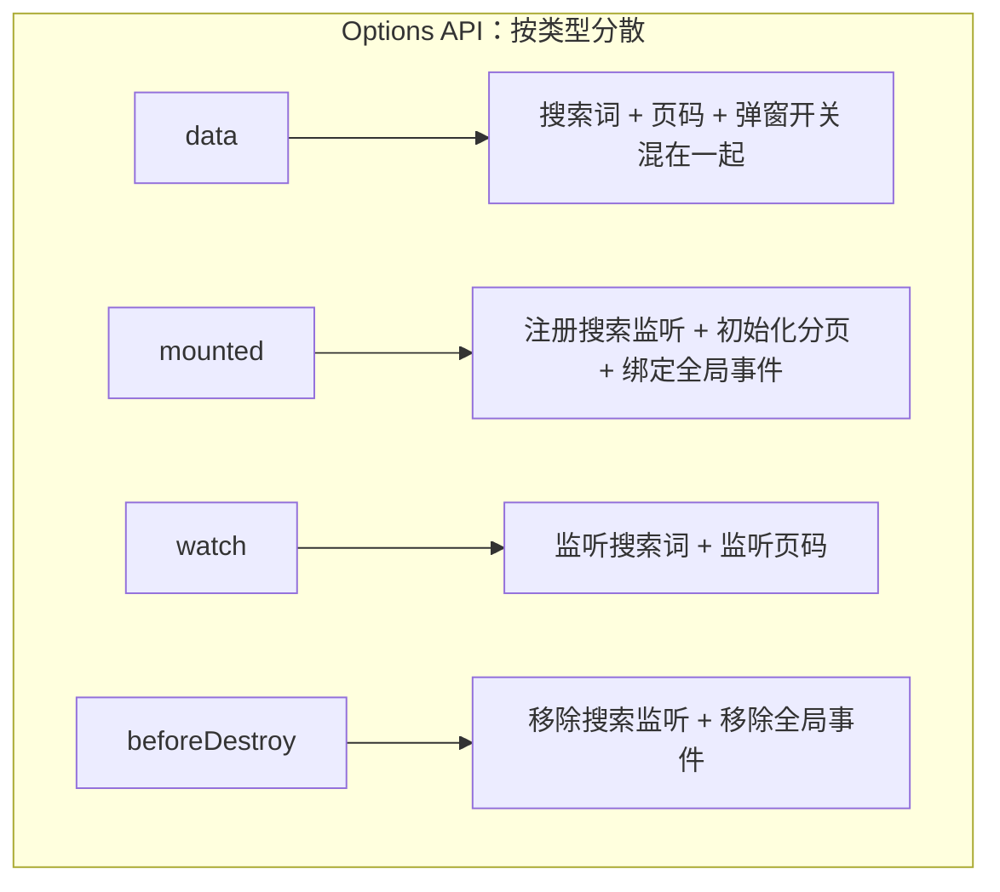
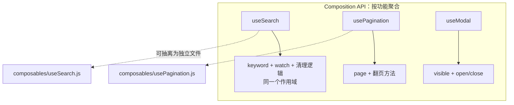
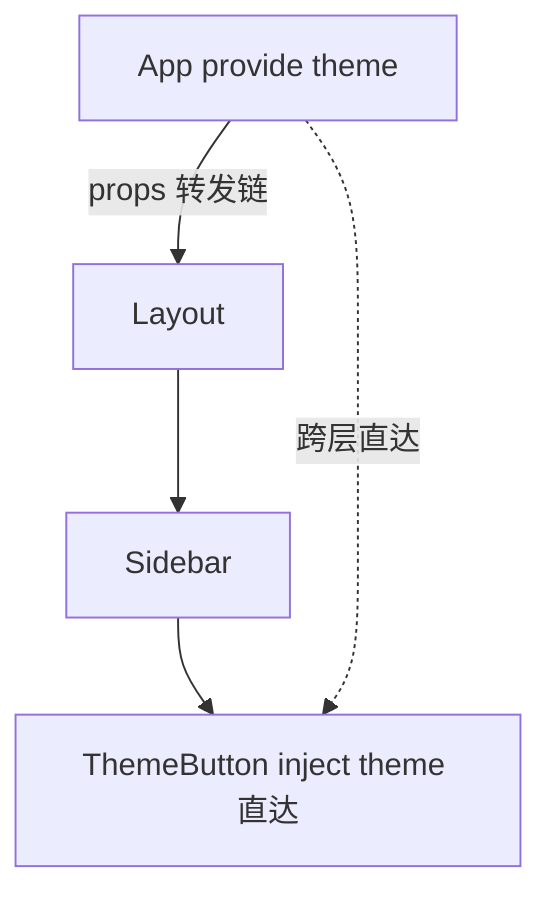

# 组合式 API：逻辑复用与组织

> 前置：[[前端开发/03-JS框架/Vue3/01-Vue3基础|Vue3 基础]]
> 目标：理解组合式的动机，掌握自定义 composable、provide/inject 与 ref 工具函数家族。

---

## 1. 组合式 API 的动机

### 1.1 Options API 的分散问题

一个复杂组件往往同时处理"搜索"、"分页"、"弹窗"等多个功能。Options API 按**选项类型**组织代码，同一功能的逻辑被撕成碎片：



维护时的真实痛点：想改"搜索"功能，要在 data/methods/watch/mounted 四个区域之间来回跳转；两个功能还可能共用 methods 命名空间，牵一发动全身。

Composition API 按**功能**组织：



每个功能内聚成块，还能直接抽成独立文件复用——这就是下一节的 composable。

### 1.2 与 mixin 的对比

| 维度 | mixin（Vue2） | composable（Vue3） |
|------|--------------|-------------------|
| 数据来源 | 隐式混入，来源不明 | 显式 import，一目了然 |
| 命名冲突 | 合并规则隐蔽 | 解构重命名即可解决 |
| 类型推导 | 差 | 天然友好（就是普通函数） |

## 2. 自定义组合式函数 useXxx

约定：以 `use` 开头的普通函数，内部使用响应式 API，返回 ref/方法集合。它不是什么新机制——**就是 JavaScript 函数**，只是遵守了响应式的封装惯例。

### 2.1 useLocalStorage

```js
// src/composables/useLocalStorage.js
import { ref, watch } from 'vue';

export function useLocalStorage(key, defaultValue) {
  // 初始化：优先读本地缓存
  const read = () => {
    try {
      const raw = localStorage.getItem(key);
      return raw !== null ? JSON.parse(raw) : defaultValue;
    } catch {
      return defaultValue;
    }
  };

  const value = ref(read());

  // 任何变化自动写回 localStorage
  watch(
    value,
    (val) => localStorage.setItem(key, JSON.stringify(val)),
    { deep: true }        // 支持对象/数组内部变化
  );

  return { value };
}
```

```html
<!-- 使用 -->
<script setup>
import { useLocalStorage } from '@/composables/useLocalStorage';

const { value: theme } = useLocalStorage('app-theme', 'light');
theme.value = 'dark';     // 自动持久化，刷新后恢复
</script>
```

对比 [[前端开发/03-JS框架/Vue/02-组件与生命周期|第二章]] 的 mixin 版本：没有隐式合并，key 冲突时解构改名 `value: theme` 即可。

### 2.2 useMouse

```js
// src/composables/useMouse.js
import { ref, onMounted, onUnmounted } from 'vue';

export function useMouse() {
  const x = ref(0);
  const y = ref(0);

  function update(e) {
    x.value = e.pageX;
    y.value = e.pageY;
  }

  onMounted(() => window.addEventListener('mousemove', update));
  onUnmounted(() => window.removeEventListener('mousemove', update));

  return { x, y };
}
```

注意亮点：生命周期钩子可以在组合式函数里调用——只要该函数在 setup 期间被同步执行，onMounted/onUnmounted 会自动挂到当前组件实例上。开启与清理就近书写，绝不泄漏。

```html
<script setup>
import { useMouse } from '@/composables/useMouse';
const { x, y } = useMouse();
</script>

<template><p>鼠标位置：{{ x }}, {{ y }}</p></template>
```

### 2.3 useFetch

```js
// src/composables/useFetch.js
import { ref } from 'vue';

export function useFetch(urlFn, options = {}) {
  const data = ref(null);
  const error = ref(null);
  const loading = ref(false);

  async function doFetch() {
    loading.value = true;
    error.value = null;
    try {
      const res = await fetch(urlFn(), options);   // urlFn 可返回依赖响应式数据的 URL
      if (!res.ok) throw new Error('HTTP ' + res.status);
      data.value = await res.json();
    } catch (e) {
      error.value = e.message;
    } finally {
      loading.value = false;
    }
  }

  return { data, error, loading, reload: doFetch };
}
```

```html
<!-- 使用：三态齐全的请求状态 -->
<script setup>
import { watchEffect } from 'vue';
import { useFetch } from '@/composables/useFetch';

const userId = ref(1);
const { data, error, loading, reload } =
  useFetch(() => `/api/users/${userId.value}`);
</script>

<template>
  <p v-if="loading">加载中...</p>
  <p v-else-if="error">出错了：{{ error }} <button @click="reload">重试</button></p>
  <pre v-else-if="data">{{ data }}</pre>
</template>
```

三个 composable 的共同模式：**输入参数 → 内部响应式状态 → 返回 refs 与操作方法**。这就是"逻辑即函数"，Java 开发者可以理解为把一段带状态的横切能力封装成可注入的工具 Bean。

## 3. provide / inject 跨层传递

props 要逐层转发，provide/inject 让祖先直接向任意深度后代"广播"数据：



### 3.1 Vue3 写法（推荐写在 setup 里）

```html
<!-- 祖先组件 App.vue -->
<script setup>
import { ref, provide, readonly } from 'vue';

const theme = ref('light');
function setTheme(t) { theme.value = t; }

// key 用 Symbol 或字符串；第二个参数是值
provide('theme', readonly(theme));   // 只读化，防止子代随意改源
provide('setTheme', setTheme);       // 修改入口也一并提供
</script>
```

```html
<!-- 任意深度的后代 ThemeButton.vue -->
<script setup>
import { inject } from 'vue';

const theme = inject('theme', 'light');   // 第二个参数是默认值
const setTheme = inject('setTheme');
</script>

<template>
  <button @click="setTheme(theme === 'light' ? 'dark' : 'light')">
    当前主题：{{ theme }}
  </button>
</template>
```

与 Vue2 的差别：Vue2 在选项里声明 `provide() { return {...} }`，且提供的值默认不是响应式的；Vue3 中 provide 一个 ref 即天然响应式。最佳实践：**provide 数据 + 修改方法成对提供，数据用 readonly 包裹**——后代不能绕过方法乱改，所有变更可控可追溯。

### 3.2 Spring @Autowired 心智对照

| Vue3 | Spring |
|------|--------|
| 祖先 `provide('userService', service)` | 容器中注册 Bean |
| 后代 `inject('userService')` | `@Autowired UserService` |
| inject 的默认值参数 | `@Autowired(required=false)` + 默认实现 |
| provide 成对的修改方法 | 通过接口暴露的方法，而非直接改字段 |

区别在于 Spring 按类型装配、容器是全局的；inject 是显式按 key 查找、依赖祖先链的存在。因此 provide/inject 适合**组件库、主题、国际化**这类"上下文"数据，业务全局状态仍应交给 Pinia。

## 4. ref 家族工具函数

| API | 作用 | 典型场景 |
|-----|------|----------|
| `ref(v)` | 包装任意值为响应式 ref | 一切基础场景 |
| `unref(v)` | `isRef ? v.value : v` 取原始值 | 工具函数兼容传 ref 或原值 |
| `toRef(obj, k)` | 把对象某属性转为 ref，保持与源联动 | props 解构仍保持响应性 |
| `toRefs(obj)` | 全部属性批量转 ref | 解构 reactive 对象不丢响应 |
| `isRef(v)` | 是否为 ref | 类型守卫 |
| `shallowRef(v)` | 只有 .value 替换才触发更新，深层不追踪 | 大对象性能优化、图表实例 |
| `triggerRef(v)` | 手动强制触发 shallowRef 更新 | 配合 shallowRef 局部刷新 |
| `toRaw(v)` | 取 Proxy 背后的原始对象 | 临时读取，避免意外追踪 |
| `readonly(v)` | 只读代理 | provide 保护共享状态 |

几个易混点展开：

```js
import { reactive, toRefs, toRef, toRaw, shallowRef } from 'vue';

const state = reactive({ count: 0, name: 'a' });

// 错误：解构丢失响应性
let { count } = state;          // 之后改 state.count，count 不再变

// 正确：toRefs 批量转出，仍然与源对象联动
const { count: cnt, name } = toRefs(state);
cnt.value++;                    // state.count 同步变为 1

// toRef 单属性版本
const nameRef = toRef(state, 'name');

// toRaw：拿到非代理的原对象（只读用途，改它不会触发更新）
const raw = toRaw(state);

// shallowRef：大对象整体替换的场景
const chart = shallowRef(null);
function initChart(instance) {
  chart.value = instance;       // 整体替换会触发更新
}
// chart.value.setData(...)     // 深层改动不触发更新，正好避免图表库被代理拖慢
```

记忆锚点：`unref` 是"拆箱"、`toRef/toRefs` 是"装箱并保留引用关系"、`toRaw` 是"取原件"、`shallowRef` 是"浅装箱省性能"。

## 5. 实战：抽取可复用的表单验证 composable

目标：任何表单只需声明验证规则，即可获得 values/errors/touched 三态与 validate/handleBlur 方法。

```js
// src/composables/useFormValidation.js
import { reactive, computed } from 'vue';

/**
 * @param {Object} initialValues 初始值，如 { username: '', age: null }
 * @param {Object} rules         规则映射，如 { username: [required(), minLen(3)] }
 */
export function useFormValidation(initialValues, rules) {
  const values = reactive({ ...initialValues });
  const errors = reactive({});
  const touched = reactive({});

  // ---- 内置校验器工厂（返回 校验函数）----
  function required(label = '该项') {
    return (v) => (v === '' || v === null || v === undefined
      ? `${label}不能为空` : '');
  }
  function minLen(n, label = '该项') {
    return (v) => String(v ?? '').length < n ? `${label}至少 ${n} 个字符` : '';
  }
  function minNum(n) {
    return (v) => Number(v) < n ? `不能小于 ${n}` : '';
  }

  // ---- 校验单个字段 ----
  function validateField(field) {
    const fieldRules = rules[field] || [];
    for (const rule of fieldRules) {
      const msg = rule(values[field]);
      if (msg) {
        errors[field] = msg;
        return false;
      }
    }
    errors[field] = '';       // 通过则清空错误
    return true;
  }

  // ---- 校验全部 ----
  function validate() {
    let ok = true;
    Object.keys(rules).forEach((f) => {
      if (!validateField(f)) ok = false;
    });
    return ok;
  }

  function handleBlur(field) {
    touched[field] = true;
    validateField(field);
  }

  // 派生：是否整体有效（computed 缓存，随 values 变化自动更新）
  const isValid = computed(() =>
    Object.keys(rules).every((f) => {
      const fieldRules = rules[f] || [];
      return fieldRules.every((rule) => !rule(values[f]));
    })
  );

  function reset() {
    Object.assign(values, initialValues);
    Object.keys(errors).forEach((k) => delete errors[k]);
    Object.keys(touched).forEach((k) => delete touched[k]);
  }

  return {
    values, errors, touched, isValid,
    validate, validateField, handleBlur, reset,
    validators: { required, minLen, minNum }   // 顺手导出校验器工厂
  };
}
```

```html
<!-- src/components/RegisterForm.vue -->
<template>
  <form @submit.prevent="submit">
    <p>
      用户名：<input v-model.trim="values.username" @blur="handleBlur('username')">
      <span v-if="touched.username && errors.username" class="err">
        {{ errors.username }}
      </span>
    </p>

    <p>
      年龄：<input type="number" v-model.number="values.age"
                   @blur="handleBlur('age')">
      <span v-if="touched.age && errors.age" class="err">{{ errors.age }}</span>
    </p>

    <button type="submit" :disabled="!isValid">提交</button>
    <button type="button" @click="reset">重置</button>
  </form>
</template>

<script setup>
import { useFormValidation } from '@/composables/useFormValidation';

const {
  values, errors, touched, isValid,
  validate, handleBlur, reset, validators
} = useFormValidation(
  { username: '', age: null },                       // 初始值
  {                                                  // 规则声明
    username: [validators.required('用户名'), validators.minLen(3, '用户名')],
    age: [validators.required('年龄'), validators.minNum(18)]
  }
);

function submit() {
  if (!validate()) return;
  console.log('提交：', { ...values });
  reset();
}
</script>

<style scoped>
.err { color: #e74c3c; margin-left: 8px; font-size: 12px; }
</style>
```

设计要点复盘：

1. **规则即数据**：校验规则用数组声明，新增规则只是加一个工厂函数，不改核心流程。
2. **三态分离**：values/errors/touched 各司其职，错误提示只在 touched 后显示（用户输到一半不被打扰）。
3. **computed 聚合有效性**：isValid 驱动提交按钮禁用态，缓存自动更新。
4. **零组件耦合**：这个 composable 不 import 任何组件，可在登录、注册、设置等所有表单复用——这正是"逻辑复用"区别于"模板复用"的价值。

---

## 小结

| 知识点 | 一句话 |
|--------|--------|
| 组合式动机 | 按功能聚合替代按选项分散 |
| composable 惯例 | use 开头函数，返回 refs + 方法，生命周期钩子可内置 |
| provide/inject | 跨层上下文传递，数据 readonly + 方法成对提供 |
| ref 家族 | unref 拆箱、toRefs 安全解构、shallowRef 大对象优化 |
| 表单 composable | 规则声明式、三态管理、isValid 联动按钮 |

想知道这一切背后的魔法？下一章手写迷你响应式系统：[[前端开发/03-JS框架/Vue3/03-响应式原理|响应式原理]]。
