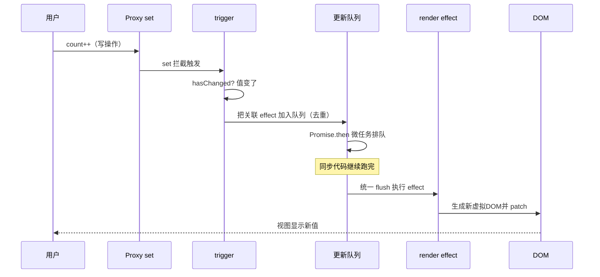
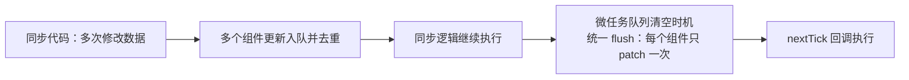

# 响应式原理：从 defineProperty 到 Proxy

> 面试高频章节。前置：[[前端开发/03-JS框架/Vue3/01-Vue3基础|Vue3 基础]]
> 目标：讲清 Vue2 缺陷、Vue3 Proxy 方案、依赖收集全流程，并手写迷你 reactive。

---

## 1. Vue2 的响应式与缺陷

### 1.1 defineProperty 的做法

Vue2 用 `Object.defineProperty` 把 data 中**每一个属性**改写为 getter/setter：

```js
Object.defineProperty(obj, 'count', {
  get() {
    // 读属性时：收集"谁在用我"
    return val;
  },
  set(newVal) {
    val = newVal;
    // 写属性时：通知依赖我的视图更新
  }
});
```

问题出在这个 API 本身的限制——它只能劫持**已存在的具体属性**。

### 1.2 三大经典缺陷

```js
// 缺陷一：新增属性检测不到
const user = reactive({ name: 'Tom' });
user.age = 18;              // 视图不更新！age 不在初始定义里

// 缺陷二：删除属性检测不到
delete user.name;           // 视图不更新！defineProperty 没有 delete 拦截

// 缺陷三：数组下标和 length 无法监听
const list = reactive([1, 2, 3]);
list[0] = 99;               // 视图不更新！
list.length = 0;            // 视图不更新！

// 数组的 push/pop/splice 等七种方法能工作，
// 是因为 Vue2 重写了这些方法的原型（变异方法补丁），但下标赋值没法重写
```

Vue2 的补救措施是 `Vue.set` / `Vue.delete` 与"重写数组原型方法"，用起来心智负担重且总有遗漏。类比 Java：`defineProperty` 像只能在类加载时织入的字节码增强，字段一旦是运行时动态加的就没辙了；而 Proxy 相当于给整个对象套了一层动态代理（JDK 动态代理），所有访问都过代理层。

### 1.3 Vue3 Proxy 全面解决

ES6 `Proxy` 代理的是**整个对象**，任何操作都会进入拦截器：

```js
const user = new Proxy({ name: 'Tom' }, {
  get(target, key, receiver) { /* 收集依赖 */ return Reflect.get(target, key, receiver); },
  set(target, key, val, receiver) { /* 触发更新 */ return Reflect.set(target, key, val, receiver); },
  deleteProperty(target, key) { /* 删除拦截 */ return Reflect.deleteProperty(target, key); }
});

user.age = 18;        // set 拦截到 -> 视图更新
delete user.name;     // deleteProperty 拦截到
list[0] = 99;         // 数组下标本质也是 set -> 更新
```

Proxy 支持 13 种拦截行为（trap），Vue3 主要用到其中几种：

| trap | 拦截的操作 | Vue3 用途 |
|------|-----------|----------|
| get | 属性读取 | 依赖收集 track |
| set | 属性写入 | 触发更新 trigger |
| has | `in` 操作符 | `key in obj` 的响应式 |
| deleteProperty | delete | 删除属性响应式 |
| ownKeys | Object.keys 等 | 遍历类操作的依赖收集 |
| getOwnPropertyDescriptor | 描述符查询 | 配合 get/set |

注意边界：Proxy 也非全能——Map/Set 需要单独处理（Vue3 有专门实现）、嵌套对象是惰性代理（读到的属性值再被访问时才递归代理）。

### 1.4 Vue2 补丁的完整面貌

理解缺陷的同时也要知道 Vue2 是如何绕的，老项目里会经常遇到：

```js
// 对象新增属性：必须用 Vue.set
import Vue from 'vue';
Vue.set(this.user, 'age', 18);          // 或 this.$set(this.user, 'age', 18)
this.$delete(this.user, 'name');        // 删除同理

// 数组：七个变异方法已被重写，可以直接用
this.list.push(4);                      // 能触发更新（内部改写了 Array.prototype）
this.list.splice(0, 1);                 // 同上：pop/shift/unshift/splice/sort/reverse

// 但下标赋值和 length 修改只能换成 splice 写法
this.list[0] = 99;                      // 无效！
this.list.splice(0, 1, 99);             // 有效但反直觉
```

这套补丁在代码评审时是高频 bug 来源——新人几乎必然踩一次"为什么视图没更新"。Vue3 从语言层面消灭了这一整类问题。

## 2. 为什么 Proxy 要整个对象代理

这是理解两代方案差异的核心：

- `defineProperty` 是**逐属性**劫持：初始化时必须遍历所有 key 逐一改写，所以后来新增的 key 天生漏网；数组下标同理（无法枚举劫持所有可能下标）。
- `Proxy` 是**整对象**级代理：`new Proxy(obj, handler)` 之后对 obj 的一切访问（包括未来新增的 key）都会经过 handler，天然覆盖增删改遍历。

代价与收益对比：

| 维度 | defineProperty (Vue2) | Proxy (Vue3) |
|------|----------------------|--------------|
| 新增/删除属性 | 需要 $set/$delete | 自动支持 |
| 数组下标/length | 不支持（方法补丁绕过） | 直接支持 |
| 初始化开销 | 递归遍历全部属性 | 惰性，访问时才递归代理 |
| 兼容性 | IE9+ | 不支持 IE |
| Map/Set | 不支持 | 特殊实现支持 |

## 3. 依赖收集与派发更新全流程

### 3.1 核心三要素

- **effect**：会读取响应式数据的函数（渲染函数就是最典型的 effect）。执行前把自己设为 `activeEffect`。
- **targetMap**：全局的依赖仓库，结构是 `WeakMap<target, Map<key, Set<effect>>>`——哪个对象的哪个属性，被哪些 effect 使用。
- **track / trigger**：get 时把 activeEffect 存进 targetMap（收集）；set 时从 targetMap 找出相关 effect 全部重新执行（派发）。

```mermaid
flowchart TD
    A[组件渲染 = 执行 render effect] --> B[activeEffect = 该 effect]
    B --> C[render 中读取 state.count]
    C --> D[触发 Proxy get 拦截]
    D --> E[track&#40;target, key&#41;<br/>把 activeEffect 存入 targetMap]
    E --> F[渲染完成]

    G[用户点击 count++] --> H[Proxy set 拦截]
    H --> I[trigger&#40;target, key&#41;<br/>从 targetMap 取出该 key 的所有 effect]
    I --> J[加入微任务队列批量执行]
    J --> K[effect 重新运行<br/>DOM 更新]
```



一句话总结：**读的时候记下"谁在读"，写的时候喊醒"读过的人"。**

### 3.2 双向联动细节

1. 每个 effect 内部维护自己的 deps 集合，便于清理：条件分支切换后，上次分支的依赖不再追踪，避免无效更新。
2. trigger 时有去重机制（Set + 队列），同一轮内多次修改只触发一次重渲染——这就是批处理的来源。
3. computed 本质是带脏标记的 lazy effect：不读它就不计算，依赖变了先标脏，再次读取才真正重算。

### 3.3 targetMap 为什么用 WeakMap

```js
const targetMap = new WeakMap();   // WeakMap<target, Map<key, Set<effect>>>
```

WeakMap 的 key 是**弱引用**：当某个组件销毁、其 data 对象不再被引用时，GC 可以自动回收该对象及其整棵依赖表，不需要手动清理。如果用普通 Map，对象会被 Map 引用而无法释放，长期运行的应用会内存泄漏。这是响应式系统里非常经典的内存管理设计——类比 Java 中 `WeakHashMap` 的语义。

### 3.4 一次完整交互的时序

以"点击按钮让 count 加一"为例，把全流程串一遍：



## 4. ref 的实现剖析

为什么 `.value` 能自动追踪？因为 RefImpl 类在 getter/setter 里手动调用了 track/trigger：

```js
class RefImpl {
  constructor(value) {
    this._rawValue = value;                 // 原始值
    this._value = toReactive(value);        // 对象类型则转 reactive
    this.dep = new Set();                   // 自己的依赖集合
  }

  get value() {
    trackRefValue(this);                    // 读：收集当前 activeEffect
    return this._value;
  }

  set value(newVal) {
    if (hasChanged(newVal, this._rawValue)) {   // 值没变不触发
      this._rawValue = newVal;
      this._value = toReactive(newVal);
      triggerRefValue(this);                  // 写：唤醒依赖
    }
  }
}
```

三个关键点：

1. **基本类型的响应式只能靠包装**——getter/setter 定义在 `value` 属性上，这正是第一章 `.value` 设计的原因。
2. **ref 包对象时内部转成 reactive**，所以 `user.value.name = 'x'` 也是响应式的。
3. **hasChanged 短路优化**：赋相同值不触发更新。

ref 家族中两个"反响应式"成员的原理也顺带说清：

```js
import { shallowRef, markRaw } from 'vue';

// shallowRef：只有 .value 整体替换才 trigger，深层变化不追踪
const bigData = shallowRef({ rows: [] });
bigData.value.rows.push(1);        // 不会触发更新！
bigData.value = { rows: [1] };     // 整体替换才触发

// markRaw：永久标记某对象永不代理（图表实例、第三方类实例）
const chart = markRaw(new Chart());
const state = reactive({ chart }); // chart 不会被 Proxy 包装，避免拖慢渲染
```

适用场景：ECharts 实例、大型表格数据、WebSocket 连接这类"框架没必要追踪"的对象，用 shallowRef/markRaw 能省下大量代理开销。

## 5. nextTick：微任务批处理 DOM 更新

修改数据后立刻读 DOM，拿到的是旧值——因为 DOM 更新是异步批量的：

```js
import { ref, nextTick } from 'vue';

const msg = ref('');
async function addItem() {
  msg.value = '新内容';
  console.log(document.querySelector('#box').textContent);   // 旧内容！
  await nextTick();
  console.log(document.querySelector('#box').textContent);   // 新内容
}
```

原理：每次 trigger 并不会立即更新 DOM，而是把更新任务放进一个队列并去重，然后通过 `Promise.then`（微任务）在**本轮同步代码执行完毕后**统一 flush：



好处：一轮交互中修改十次数据，DOM 只重排一次。nextTick 的回调排在 flush 之后，所以能拿到最新 DOM。这与 Java 里"攒一批请求合并处理"的批量写思想一致——减少昂贵的 I/O（这里是 DOM 操作）次数。

## 6. 手写迷你 reactive（约 30 行）

把本章知识串起来，完整可运行的迷你版：

```js
// mini-reactive.js —— 完整实现
let activeEffect = null;
const targetMap = new WeakMap();          // target -> Map<key, Set<effect>>

function track(target, key) {
  if (!activeEffect) return;              // 没有 effect 在跑就无需收集
  let depsMap = targetMap.get(target);
  if (!depsMap) targetMap.set(target, (depsMap = new Map()));
  let deps = depsMap.get(key);
  if (!deps) depsMap.set(key, (deps = new Set()));
  deps.add(activeEffect);                 // 记录：这个属性被我用了
}

function trigger(target, key) {
  const deps = targetMap.get(target)?.get(key);
  if (!deps) return;
  [...deps].forEach((fn) => fn());        // 唤醒所有依赖此属性的 effect
}

function reactive(obj) {
  return new Proxy(obj, {
    get(target, key) {
      track(target, key);                 // 读：收集依赖
      const val = Reflect.get(target, key);
      return typeof val === 'object' && val !== null ? reactive(val) : val;
    },
    set(target, key, value) {
      const old = target[key];
      const result = Reflect.set(target, key, value);
      if (old !== value) trigger(target, key);   // 写：值变了才派发
      return result;
    },
    deleteProperty(target, key) {
      const hadKey = key in target;
      const result = Reflect.deleteProperty(target, key);
      if (hadKey) trigger(target, key);   // 删除也触发
      return result;
    }
  });
}

function effect(fn) {
  activeEffect = fn;                      // 标记当前正在执行的 effect
  fn();                                   // 首次执行触发 get 完成收集
  activeEffect = null;
}
```

验证效果：

```js
const state = reactive({ count: 0, user: { name: 'Tom' } });

effect(() => {
  console.log('视图渲染，count =', state.count);
});
// 输出：视图渲染，count = 0

state.count++;            // 输出：视图渲染，count = 1
state.count++;            // 输出：视图渲染，count = 2
state.user.name = 'Jerry'; // 输出：视图渲染（嵌套对象也响应式）

// 新增属性也能监听（Proxy 天然支持）
effect(() => { console.log('extra =', state.extra); });
state.extra = 'new';      // 输出：extra = new
```

与真实 Vue3 的差距（也是进阶方向）：effect 的嵌套栈管理、依赖清理与调度器（queueJob 批处理）、computed/watch 的 lazy 实现、shallowRef/markRaw 等标记优化、数组与 Map/Set 的特殊拦截。

## 7. 进阶：computed 与 watch 的实现思路

有了 effect 基建，computed 和 watch 都只是不同策略的封装：

```js
// computed：lazy + 脏检查的 effect
function computed(getter) {
  let value;
  let dirty = true;                 // 脏标记：依赖变了但还没重算

  const runner = effect(() => (value = getter()), {
    lazy: true,                     // 创建时不立即执行
    scheduler() {                   // 依赖变化时不重算，只标脏
      if (!dirty) {
        dirty = true;
        triggerRefValue(computedRef);   // 通知"读了这个 computed"的下游 effect
      }
    }
  });

  const computedRef = {
    get value() {
      if (dirty) {                  // 只有被读取且已脏才真正计算
        value = runner();
        dirty = false;
      }
      trackRefValue(computedRef);   // 自己也要被 track，支持链式依赖
      return value;
    }
  };
  return computedRef;
}

// watch：手动指定源的 effect + 回调
function watch(source, cb) {
  let oldValue;
  const getter = typeof source === 'function' ? source : () => source.value;

  effect(() => getter(), {
    lazy: true,
    scheduler(newVal) {             // 依赖变化时走调度器而不是直接重跑
      cb(newVal, oldValue);         // 执行用户回调
      oldValue = newVal;
    }
  });
  oldValue = getter();              // 记录初始值
}
```

三个概念的定位差异：

| 实现 | 是否立即执行 | 依赖变化时的行为 |
|------|-------------|-----------------|
| effect | 立即 | 直接重新执行 |
| computed | 惰性 | 标脏，读取时才重算 |
| watch | 手动触发首跑可选 | 走 scheduler 执行回调 |

理解了这张表，就理解了为什么"watch 要拿旧值、computed 要缓存、effect 要副作用"——它们的 API 形态完全由实现策略决定。

真实 Vue3 源码在此基础上还包含：effect 的嵌套栈管理、依赖清理与调度器（queueJob 批处理）、shallowRef/markRaw 等标记优化、数组与 Map/Set 的特殊拦截。读懂本章的迷你实现后，再读源码的 reactivity 包会有清晰的地图。

---

## 小结

| 知识点 | 一句话 |
|--------|--------|
| Vue2 缺陷 | defineProperty 只能劫持已有属性，新增/删除/下标全翻车 |
| Proxy 方案 | 整对象代理，13 种 trap 覆盖增删改查遍历 |
| 依赖收集 | 读时 track 进 targetMap，写时 trigger 唤醒 effect |
| ref 实现 | RefImpl 在 value 的 get/set 里手动 track/trigger |
| nextTick | 微任务队列批量 flush，同步代码后统一更新 DOM |
| 迷你实现 | track + trigger + Proxy 三件套约 30 行 |

原理落地到生态：[[前端开发/03-JS框架/Vue3/04-Pinia与VueRouter4|Pinia 与 Vue Router 4]]。
