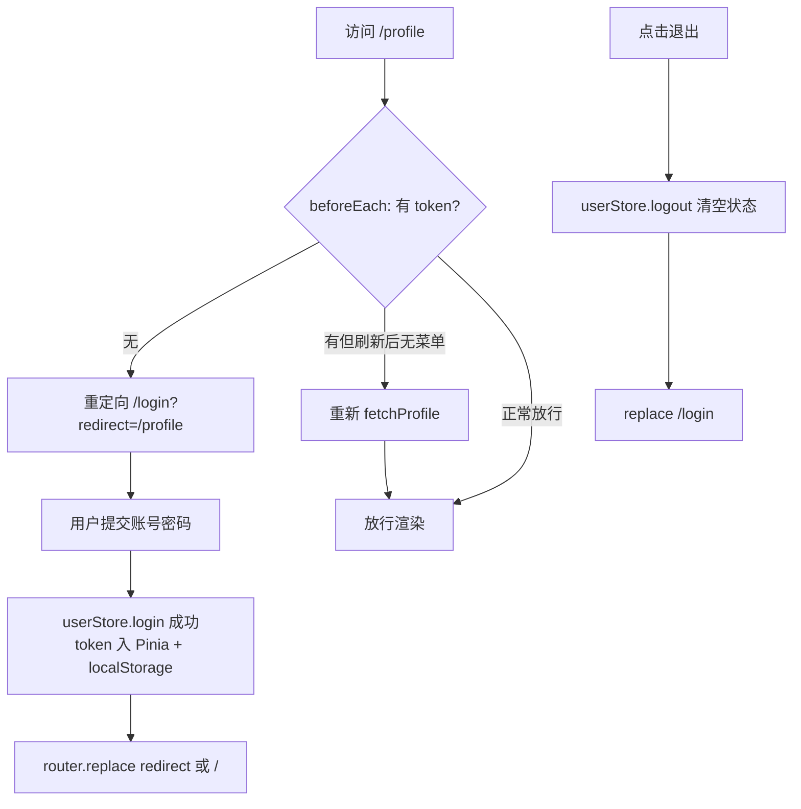

# Pinia 与 Vue Router 4

> 前置：[[前端开发/03-JS框架/Vue/04-Vuex状态管理|Vuex]]、[[前端开发/03-JS框架/Vue/03-VueRouter|Vue Router 3]]
> 目标：掌握 Vue3 官方推荐的 Pinia 状态管理与 Vue Router 4 的组合式用法，打通登录鉴权全链路。

---

## 1. Pinia：新一代状态管理

### 1.1 为什么 Vuex 被"退休"

Vuex 为解决 Vue2 响应式限制与调试需求，设计了 mutation 同步约束、module 命名空间等机制。Vue3 时代这些前提变了：

1. **Proxy 让响应式不再脆弱**，直接修改 state 也安全可追踪。
2. **devtools 能记录 action**，mutation 作为"唯一可追溯入口"的存在意义消失。
3. module 嵌套 + 命名空间的样板代码太多，TS 类型推导困难。

Pinia 的答案：**state + getter + action 三合一，没有 mutation**——action 里直接改 state。

### 1.2 defineStore：Options 风格

```bash
npm install pinia
```

```js
// main.js 安装插件
import { createApp } from 'vue';
import { createPinia } from 'pinia';
import App from './App.vue';

createApp(App).use(createPinia()).mount('#app');
```

```js
// src/stores/counter.js
import { defineStore } from 'pinia';

// 参数一：store 的唯一 id；参数二：配置对象
export const useCounterStore = defineStore('counter', {
  // state 必须是箭头函数（和组件 data 一样防共享）
  state: () => ({
    count: 0,
    list: []
  }),

  // getter：接收 state，本质是 computed
  getters: {
    double(state) {
      return state.count * 2;
    },
    // 引用其他 getter 用 this，注意要标注返回类型（JS 项目可省略）
    quadruple() {
      return this.double * 2;
    }
  },

  // action：同步异步都在这里，直接改 state！
  actions: {
    increment() {
      this.count++;                    // 没有 mutation，直接改
    },
    async fetchList() {
      const res = await fetch('/api/list');
      this.list = await res.json();    // 异步结果直接赋值
    }
  }
});
```

对比 [[前端开发/03-JS框架/Vue/04-Vuex状态管理|Vuex 版本]]：少了 mutation 层、少了 commit 样板代码、action 里 `this` 直接指向 store 实例。

### 1.3 setup 风格定义（推荐）

```js
// src/stores/user.js —— 组合式语法的 store
import { defineStore } from 'pinia';
import { ref, computed } from 'vue';
import { loginApi, getUserInfoApi, logoutApi } from '@/api/auth';

export const useUserStore = defineStore('user', () => {
  // ref 相当于 state
  const token = ref('');
  const profile = ref(null);

  // computed 相当于 getter
  const isLogin = computed(() => !!token.value);
  const displayName = computed(() => profile.value?.nickname || '游客');

  // 函数相当于 action
  async function login(form) {
    const res = await loginApi(form);
    token.value = res.data.token;
    localStorage.setItem('token', token.value);   // 持久化就近处理
  }

  async function fetchProfile() {
    const res = await getUserInfoApi();
    profile.value = res.data;
  }

  function logout() {
    token.value = '';
    profile.value = null;
    localStorage.removeItem('token');
    return logoutApi().catch(() => {});           // 后端登出失败也不阻塞前端
  }

  // 返回什么，组件就能用什么
  return { token, profile, isLogin, displayName, login, fetchProfile, logout };
});
```

两种风格对照表：

| Options 风格 | setup 风格 | 对应概念 |
|--------------|-----------|----------|
| state | ref / reactive | 状态 |
| getters | computed | 派生值 |
| actions | function | 业务逻辑 |

setup 风格的优势：可以自由使用组合式函数（useLocalStorage 等）、写法与组件完全一致、TS 推理最自然。团队统一选一种即可。

### 1.4 组件中使用与 storeToRefs

```html
<script setup>
import { storeToRefs } from 'pinia';
import { useCounterStore } from '@/stores/counter';

const counter = useCounterStore();

// 错误示范：直接解构会丢失响应性（和 reactive 解构同理）
// const { count, double } = counter;

// 正确：storeToRefs 只把 state/getter 转为 ref（不包含 action）
const { count, double } = storeToRefs(counter);
</script>

<template>
  <p>{{ count }} {{ double }}</p>
  <!-- action 直接从 store 实例上取，不需要 storeToRefs -->
  <button @click="counter.increment()">+1</button>
  <!-- 直接改 state 也是合法的（开发便利），但复杂逻辑仍应收敛到 action -->
  <button @click="count++">模板里直接改</button>
  <!-- $patch 批量修改：一次触发一次更新 -->
  <button @click="counter.$patch({ count: 100 })">置为100</button>
  <button @click="counter.$reset()">重置</button>   <!-- Options 风格才有默认实现 -->
</template>
```

记忆点：**数据用 storeToRefs，方法直接点出来**。

### 1.5 Pinia vs Vuex 4 差异总览

| 维度 | Vuex 4 | Pinia |
|------|--------|-------|
| mutation | 必须经过 | 取消，action 直接改 |
| 模块化 | module + namespaced | 多个 store 平铺天然隔离 |
| TS 支持 | 泛型穿透困难 | 完整推导 |
| 体积 | 较大 | 约 1KB |
| devtools | 支持 | 支持（含 action 时间旅行） |
| 组合式函数复用 | 不方便 | store 内可直接 use 其他 composable |
| Vue2 支持 | 是 | 是（2.7+ 也有适配版） |

多个平铺 store 之间互相引用也简单：在 action 里直接调用另一个 `useXxxStore()` 即可（Pinia 保证此时已初始化）。

## 2. Vue Router 4

### 2.1 创建方式的变化

```js
// src/router/index.js
import { createRouter, createWebHistory, createWebHashHistory } from 'vue-router';

const routes = [
  { path: '/', name: 'home', component: () => import('@/views/Home.vue') },
  { path: '/login', name: 'login', component: () => import('@/views/Login.vue') },
  {
    path: '/profile',
    name: 'profile',
    component: () => import('@/views/Profile.vue'),
    meta: { requiresAuth: true }
  }
];

const router = createRouter({
  history: createWebHistory(),      // history 模式成为显式选择；hash 用 createWebHashHistory
  routes
});

export default router;
```

变化点速记：`new VueRouter` 变成 `createRouter` 工厂函数；`mode: 'history'` 字符串变成传入 history 实现；`*` 通配符路由改为 `{ path: '/:pathMatch(.*)*', ... }`。

### 2.2 组合式 API 获取路由对象

```html
<script setup>
import { useRoute, useRouter, onBeforeRouteLeave, onBeforeRouteUpdate } from 'vue-router';

// 对应 Options API 的 this.$route / this.$router
const route = useRoute();     // 当前路由信息：params/query/path
const router = useRouter();   // 编程式导航：push/replace/go

console.log(route.params.id);

function goDetail(id) {
  router.push({ name: 'detail', params: { id } });
}

// 组件内守卫也有了组合式版本
onBeforeRouteLeave((to, from) => {
  if (hasUnsavedChanges()) {
    return window.confirm('有未保存的修改，确定离开？');   // 返回 false 中止
  }
});

onBeforeRouteUpdate((to, from) => {
  // 同组件路由参数变化时触发，如 /detail/1 -> /detail/2
  loadDetail(to.params.id);
});
</script>
```

守卫签名简化：不再需要 `next()` 三态调用，**return false 中止、return 路径重定向、什么都不返回即放行**。忘记调 next 导致页面卡死的经典事故从此绝迹。

### 2.3 全局守卫的迁移

```js
// Vue Router 3
router.beforeEach((to, from, next) => { /* ... */ next(); });

// Vue Router 4：next 可选，推荐返回值风格
router.beforeEach(async (to) => {
  if (to.meta.requiresAuth && !isAuthenticated()) {
    return { name: 'login', query: { redirect: to.fullPath } };   // 返回目标即重定向
  }
});
```

### 2.4 动态路由：权限菜单的实现思路

后台管理系统按角色动态生成菜单，用 `router.addRoute()` 在运行时挂载路由：

```js
// 服务端返回当前用户可见的菜单，形如：
// [{ path: '/admin/users', name: 'users', component: 'UserManage' }, ...]
const viewModules = import.meta.glob('@/views/**/*.vue');   // Vite 批量懒加载映射

export function registerDynamicRoutes(menus) {
  menus.forEach((menu) => {
    router.addRoute('layout', {                     // 挂到指定父路由下
      path: menu.path,
      name: menu.name,
      component: viewModules[`/src/views/${menu.component}.vue`]
    });
  });
}
```

流程要点：

1. 登录成功后拉取菜单 → `addRoute` 动态注册 → 存入 Pinia 供侧栏渲染。
2. 刷新页面时 Pinia 状态丢失，需在全局守卫里判断"有 token 但无菜单"，重新走一遍注册流程再放行。
3. 未匹配路径的兜底路由必须**最后注册**，否则会抢先匹配。

## 3. 实战：登录态管理 + 路由守卫完整链路

需求闭环：未登录访问受保护页面 → 重定向登录页 → 登录成功 → 跳回来源页 → 刷新保持登录 → 退出回到首页。



```js
// src/api/auth.js —— 接口层预留
import axios from 'axios';

export async function loginApi(form) {
  // 实际对接 Java 后端时注意 CORS 配置（见下一章）
  return axios.post('/api/auth/login', form);
}
export async function getUserInfoApi() {
  return axios.get('/api/auth/me');
}
export function logoutApi() {
  return axios.post('/api/auth/logout');
}
```

```js
// src/router/index.js —— 含全局守卫的完整配置
import { createRouter, createWebHistory } from 'vue-router';
import { useUserStore } from '@/stores/user';

const routes = [
  { path: '/', name: 'home', component: () => import('@/views/Home.vue') },
  { path: '/login', name: 'login', component: () => import('@/views/Login.vue') },
  {
    path: '/profile',
    name: 'profile',
    component: () => import('@/views/Profile.vue'),
    meta: { requiresAuth: true }
  },
  { path: '/:pathMatch(.*)*', redirect: '/' }
];

const router = createRouter({ history: createWebHistory(), routes });

router.beforeEach(async (to) => {
  const userStore = useUserStore();          // 注意：必须在函数内取 store！

  if (!to.meta.requiresAuth) return true;    // 公开页面直接放行

  if (!userStore.token) {
    return { name: 'login', query: { redirect: to.fullPath } };
  }

  // 刷新场景：token 在 localStorage 但内存态 profile 为空，补拉用户信息
  if (!userStore.profile) {
    try {
      await userStore.fetchProfile();
    } catch {
      userStore.logout();                    // token 过期则清态回登录页
      return { name: 'login' };
    }
  }
  return true;
});

export default router;
```

```html
<!-- src/views/Login.vue -->
<template>
  <form @submit.prevent="handleLogin">
    <input v-model.trim="form.username" placeholder="用户名">
    <input v-model="form.password" type="password" placeholder="密码">
    <p v-if="errorMsg" class="err">{{ errorMsg }}</p>
    <button :disabled="loading || !form.username || !form.password">
      {{ loading ? '登录中...' : '登录' }}
    </button>
  </form>
</template>

<script setup>
import { reactive, ref } from 'vue';
import { useRoute, useRouter } from 'vue-router';
import { useUserStore } from '@/stores/user';

const route = useRoute();
const router = useRouter();
const userStore = useUserStore();

const form = reactive({ username: '', password: '' });
const loading = ref(false);
const errorMsg = ref('');

async function handleLogin() {
  loading.value = true;
  errorMsg.value = '';
  try {
    await userStore.login({ ...form });                       // 状态进 Pinia
    router.replace(route.query.redirect || '/');              // 回来源页
  } catch (e) {
    errorMsg.value = '用户名或密码错误';                        // 不提示"用户不存在"，防枚举
  } finally {
    loading.value = false;
  }
}
</script>

<style scoped>
.err { color: #e74c3c; font-size: 13px; }
</style>
```

```html
<!-- src/views/Profile.vue 受保护页面 -->
<template>
  <div>
    <h2>个人中心</h2>
    <p v-if="profile">欢迎，{{ displayName }}</p>
    <button @click="handleLogout">退出登录</button>
  </div>
</template>

<script setup>
import { storeToRefs } from 'pinia';
import { useRouter } from 'vue-router';
import { useUserStore } from '@/stores/user';

const router = useRouter();
const userStore = useUserStore();
const { profile, displayName } = storeToRefs(userStore);   // 数据解构用 storeToRefs

async function handleLogout() {
  await userStore.logout();
  router.replace('/login');
}
</script>
```

链路检查清单：

1. **Pinia setup 风格**：token/profile 是 state，isLogin/displayName 是 getter，login/logout 是 action。
2. **守卫内取 store**：`useUserStore()` 写在 beforeEach 回调内部而非模块顶层——因为模块加载时 Pinia 还没安装。
3. **刷新恢复**：localStorage 恢复 token + 守卫内补拉 profile。
4. **redirect 闭环**：拦截时记录 fullPath，登录后 replace 回去。
5. **错误处理**：token 失效自动清态回登录页；登录失败不暴露"用户是否存在"（防枚举攻击）。

---

## 小结

| 知识点 | 一句话 |
|--------|--------|
| Pinia 核心 | state/getter/action 三合一，没有 mutation |
| 定义方式 | Options 与 setup 两种风格，setup 最灵活 |
| storeToRefs | 解构数据不丢响应性，方法直接取 |
| Router 4 | createRouter + createWebHistory，组合式 useRoute/useRouter |
| 守卫新写法 | 返回 false/路径即可，告别 next 三态 |
| 权限菜单 | addRoute 动态注册 + 刷新时守卫内重建 |

最后来一场综合实战：[[前端开发/03-JS框架/Vue3/05-Vue3实战|Vue3 实战]]。
