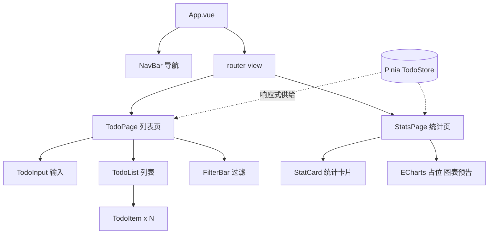

# Vue3 实战：Vite + TS 的 TodoList Plus

> 前置：[[前端开发/03-JS框架/Vue3/01-Vue3基础|Vue3 基础]]、[[前端开发/03-JS框架/Vue3/02-组合式API|组合式API]]、[[前端开发/03-JS框架/Vue3/04-Pinia与VueRouter4|Pinia 与 Vue Router 4]]
> 目标：用现代工程链（Vite + TypeScript + Pinia）重写经典待办应用，打通从编码到部署的完整流程。

---

## 1. 项目初始化

```bash
npm create vite@latest todo-plus -- --template vue-ts
cd todo-plus && npm install
npm install pinia vue-router axios
npm run dev        # Vite 秒级冷启动，按需编译 ESM
```

对照 [[前端开发/01-基础/JavaScript/07-JS实战：交互式页面|JS 版 Todo]]：当时用原生 JS 手动操作 DOM 完成同样的增删改查与持久化，代码里全是 `document.createElement` 与手动同步。本章用同一份需求展示框架的价值——**业务逻辑（状态变化）与视图更新彻底解耦**。

## 2. 类型与组件设计

### 2.1 领域模型类型

```ts
// src/types/todo.ts
export interface Todo {
  id: number;
  text: string;
  done: boolean;
  createdAt: number;
}

export type FilterType = 'all' | 'active' | 'done';
```

TS 在这里的收益立竿见影：`todo.titel` 这类拼写错误编译期就报错；`FilterType` 联合类型让 switch 分支漏写时编译器提示。

### 2.2 组件树与数据流



职责划分：

| 模块 | 文件 | 职责 |
|------|------|------|
| 状态 | stores/todo.ts | 任务状态与全部业务动作 |
| 持久化 | composables/useTodoStorage.ts | localStorage 双向同步 |
| 网络 | utils/request.ts | axios 封装，预留后端对接 |
| 页面 | views/* | 编排 store 与子组件 |
| 展示 | components/* | 纯 props 进、事件出 |

## 3. 核心实现

### 3.1 useTodoStorage composable

```ts
// src/composables/useTodoStorage.ts
import { ref, watch } from 'vue';

const STORAGE_KEY = 'vue3-todo-list';

function load(): Todo[] {
  try {
    const raw = localStorage.getItem(STORAGE_KEY);
    return raw ? JSON.parse(raw) : [];
  } catch {
    localStorage.removeItem(STORAGE_KEY);
    return [];
  }
}

export function useTodoStorage() {
  const todos = ref<Todo[]>(load());

  // 任何深层变化防抖后写回本地
  let timer: number | undefined;
  watch(
    todos,
    (val) => {
      window.clearTimeout(timer);
      timer = window.setTimeout(() => {
        localStorage.setItem(STORAGE_KEY, JSON.stringify(val));
      }, 200);
    },
    { deep: true }
  );

  function replaceAll(next: Todo[]) {
    todos.value = next;
  }

  return { todos, replaceAll };
}
```

### 3.2 Pinia TodoStore

```ts
// src/stores/todo.ts
import { defineStore } from 'pinia';
import { computed } from 'vue';
import { useTodoStorage } from '@/composables/useTodoStorage';

let seed = Date.now();

export const useTodoStore = defineStore('todo', () => {
  // state：来自持久化 composable
  const { todos, replaceAll } = useTodoStorage();
  const filter = ref<FilterType>('all');

  // getter：computed 派生统计值
  const filteredTodos = computed(() => {
    if (filter.value === 'active') return todos.value.filter((t) => !t.done);
    if (filter.value === 'done') return todos.value.filter((t) => t.done);
    return todos.value;
  });
  const total = computed(() => todos.value.length);
  const doneCount = computed(() => todos.value.filter((t) => t.done).length);
  const doneRate = computed(() =>
    total.value === 0 ? 0 : Math.round((doneCount.value / total.value) * 100)
  );

  // action：直接修改 state，无 mutation
  function add(text: string) {
    const trimmed = text.trim();
    if (!trimmed) return;
    const todo: Todo = {
      id: seed++,
      text: trimmed,
      done: false,
      createdAt: Date.now()
    };
    todos.value.unshift(todo);          // 新任务置顶
    syncRemote(todo);
  }

  function remove(id: number) {
    todos.value = todos.value.filter((t) => t.id !== id);
  }

  function toggle(id: number) {
    const target = todos.value.find((t) => t.id === id);
    if (target) target.done = !target.done;
  }

  function clearDone() {
    todos.value = todos.value.filter((t) => !t.done);
  }

  function setFilter(f: FilterType) {
    filter.value = f;
  }

  // 预留：未来把变更同步到 Java 后端
  function syncRemote(todo: Todo) {
    // request.post('/todos', todo).catch(console.warn);
  }

  return {
    todos, filter, filteredTodos,
    total, doneCount, doneRate,
    add, remove, toggle, clearDone, setFilter, replaceAll
  };
});
```

注意组合式的复利：store 直接"吃进"了 useTodoStorage composable——状态管理与持久化两个关注点各自独立又无缝拼装。

### 3.3 axios 封装 request.ts

```ts
// src/utils/request.ts —— 统一出口：拦截器加 token / 统一错误处理
import axios from 'axios';
import type { AxiosError, AxiosInstance, InternalAxiosRequestConfig } from 'axios';

// 环境变量：.env.development 里配置 VITE_API_BASE=http://localhost:8080/api
const request: AxiosInstance = axios.create({
  baseURL: import.meta.env.VITE_API_BASE as string,
  timeout: 10000
});

// 请求拦截器：自动携带 token
request.interceptors.request.use(
  (config: InternalAxiosRequestConfig) => {
    const token = localStorage.getItem('token');
    if (token) config.headers.Authorization = `Bearer ${token}`;
    return config;
  },
  (error) => Promise.reject(error)
);

// 响应拦截器：剥壳 + 统一错误
request.interceptors.response.use(
  (response) => {
    const res = response.data;
    // 约定后端返回 { code, message, data } 结构
    if (res.code !== 0) {
      return Promise.reject(new Error(res.message || '请求失败'));
    }
    return res.data;                    // 调用方直接拿到 data
  },
  (error: AxiosError<{ message?: string }>) => {
    if (error.response?.status === 401) {
      localStorage.removeItem('token');
      window.location.href = '/login';  // 登录态过期跳转
    }
    const msg =
      error.response?.data?.message ||
      error.message ||
      '网络异常，请稍后重试';
    return Promise.reject(new Error(msg));
  }
);

export default request;
```

对接 Java 后端提示：Spring Boot 服务默认不允许跨域，需要在后端加 CORS 配置或走 nginx 反向代理：

```java
// Spring Boot 全局 CORS 配置示例（详见 [[java/3工程化/06_Spring Boot快速开发|Spring Boot 快速开发]]）
@Configuration
public class WebConfig implements WebMvcConfigurer {
    @Override
    public void addCorsMappings(CorsRegistry registry) {
        registry.addMapping("/api/**")
                .allowedOrigins("http://localhost:5173")   // Vite 开发服务器
                .allowedMethods("GET", "POST", "PUT", "DELETE")
                .allowCredentials(true);
    }
}
```

### 3.4 视图组件（script setup + TS）

```html
<!-- src/components/TodoItem.vue -->
<script setup lang="ts">
import type { Todo } from '@/types/todo';

defineProps<{ todo: Todo }>();                      // 泛型 props 声明

defineEmits<{ toggle: [id: number]; remove: [id: number] }>();
</script>

<template>
  <li class="item" :class="{ done: todo.done }">
    <input
      type="checkbox"
      :checked="todo.done"
      @change="$emit('toggle', todo.id)"
    >
    <span>{{ todo.text }}</span>
    <button @click="$emit('remove', todo.id)">删除</button>
  </li>
</template>

<style scoped>
.item.done span { color: #999; text-decoration: line-through; }
.item button { float: right; }
</style>
```

```html
<!-- src/views/TodoPage.vue 列表页 -->
<script setup lang="ts">
import { ref, watch } from 'vue';
import { storeToRefs } from 'pinia';
import { useTodoStore } from '@/stores/todo';
import TodoItem from '@/components/TodoItem.vue';

const store = useTodoStore();
const { filteredTodos, filter } = storeToRefs(store);

const draft = ref('');
function onAdd() {
  store.add(draft.value);
  draft.value = '';
}

watch(filter, (f) => console.log('过滤条件切换为', f));
</script>

<template>
  <div class="page">
    <form class="row" @submit.prevent="onAdd">
      <input v-model.trim="draft" placeholder="新任务，回车提交">
      <button :disabled="!draft">添加</button>
    </form>

    <div class="filters">
      <button
        v-for="f in (['all', 'active', 'done'] as const)"
        :key="f"
        :class="{ active: filter === f }"
        @click="store.setFilter(f)"
      >
        {{ f }}
      </button>
    </div>

    <p v-if="!filteredTodos.length">没有符合条件的任务</p>
    <ul v-else>
      <TodoItem
        v-for="t in filteredTodos"
        :key="t.id"
        :todo="t"
        @toggle="store.toggle"
        @remove="store.remove"
      />
    </ul>

    <footer v-if="store.doneCount > 0">
      已完成 {{ store.doneCount }} / {{ store.total }}
      <button @click="store.clearDone">清除已完成</button>
    </footer>
  </div>
</template>
```

```html
<!-- src/views/StatsPage.vue 统计页 -->
<script setup lang="ts">
import { useTodoStore } from '@/stores/todo';
import { storeToRefs } from 'pinia';

const store = useTodoStore();
const { total, doneCount, doneRate } = storeToRefs(store);
</script>

<template>
  <div class="stats">
    <div class="card"><strong>{{ total }}</strong><span>总任务</span></div>
    <div class="card"><strong>{{ doneCount }}</strong><span>已完成</span></div>
    <div class="card"><strong>{{ doneRate }}%</strong><span>完成率</span></div>

    <!-- ECharts 占位：集成方法见 [[前端开发/06-数据可视化/ECharts/01-ECharts基础|ECharts 入门]] -->
    <div id="chart-placeholder" class="chart">
      图表区域占位（完成趋势折线图）
    </div>
  </div>
</template>

<style scoped>
.stats { display: flex; flex-wrap: wrap; gap: 12px; padding: 16px; }
.card { border: 1px solid #ddd; border-radius: 8px; padding: 16px; min-width: 120px; }
.card strong { display: block; font-size: 28px; }
.chart { width: 100%; height: 240px; border: 1px dashed #bbb;
         display: grid; place-items: center; color: #888; margin-top: 12px; }
</style>
```

路由与入口（两页 + 守卫复用上一章模式）：

```ts
// src/main.ts
import { createApp } from 'vue';
import { createPinia } from 'pinia';
import App from './App.vue';
import router from './router';

createApp(App).use(createPinia()).use(router).mount('#app');
```

```ts
// src/router/index.ts
import { createRouter, createWebHistory } from 'vue-router';

const router = createRouter({
  history: createWebHistory(),
  routes: [
    { path: '/', name: 'todo', component: () => import('@/views/TodoPage.vue') },
    { path: '/stats', name: 'stats', component: () => import('@/views/StatsPage.vue') },
    { path: '/:pathMatch(.*)*', redirect: '/' }
  ]
});

export default router;
```

## 4. 构建与部署

### 4.1 Vite 构建

```bash
npm run build       # 产出 dist/：原生 ESM 产物 + hash 文件名
npm run preview     # 本地预览构建产物
```

Vite 关键产物特性：按路由代码分割（动态 import 自动分包）、CSS 抽取压缩、tree-shaking 掉未使用的导出。

### 4.2 nginx 配置（history 模式）

```nginx
server {
    listen 80;
    server_name todo.example.com;

    root /var/www/todo-plus/dist;
    index index.html;

    location / {
        try_files $uri $uri/ /index.html;   # history 模式必须回退到 index.html
    }

    location ~* \.(js|css|woff2)$ {
        expires 30d;
        add_header Cache-Control "public, immutable";
    }

    location /api/ {
        proxy_pass http://127.0.0.1:8080/api/;
        proxy_set_header Host $host;
    }
}
```

部署检查清单：`try_files` 回退解决刷新 404；hash 文件名配长缓存；`/api/` 反代同时规避浏览器 CORS（生产环境推荐方案，比后端开 CORS 更干净）。

## 5. 与 React 方案对比预告

Vue3 这套组合（script setup + Pinia + Vue Router）在 React 世界有几乎一一对应的镜像：

| 关注点 | Vue3 方案 | React 对应物 |
|--------|----------|--------------|
| 组件逻辑复用 | composable（useXxx） | 自定义 Hook |
| 全局状态 | Pinia | Zustand / Redux Toolkit |
| 路由 | Vue Router | React Router / TanStack Router |
| 响应式心智 | 数据可变，依赖自动追踪 | setState 不可变更新 |
| 构建/元框架 | Vite / Nuxt | Vite / Next.js |

选型不是非此即彼，而是看团队、生态与场景。系统对比见 [[前端开发/09-融会贯通/03-根据需求选择技术栈|根据需求选择技术栈]]。

---

## 小结

| 要点 | 一句话 |
|------|--------|
| 工程链 | Vite + vue-ts 模板秒建项目，类型安全贯穿始终 |
| 状态分层 | Pinia store 组合 useTodoStorage，关注点分离 |
| 网络层 | axios 拦截器统一 token 与错误，预留 Spring Boot 对接 |
| 部署 | dist + nginx try_files + hash 缓存策略 |
| 框架价值 | 对照原生 JS 版：逻辑聚焦状态，DOM 更新全自动 |

至此 Vue 全系列完结，下一步横向对比各技术栈：[[前端开发/09-融会贯通/03-根据需求选择技术栈|根据需求选择技术栈]]。
