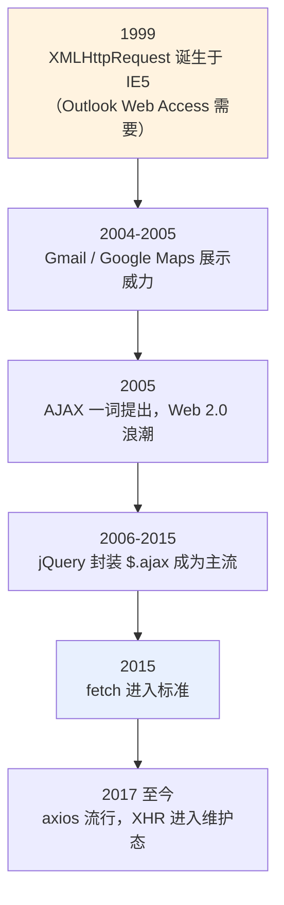
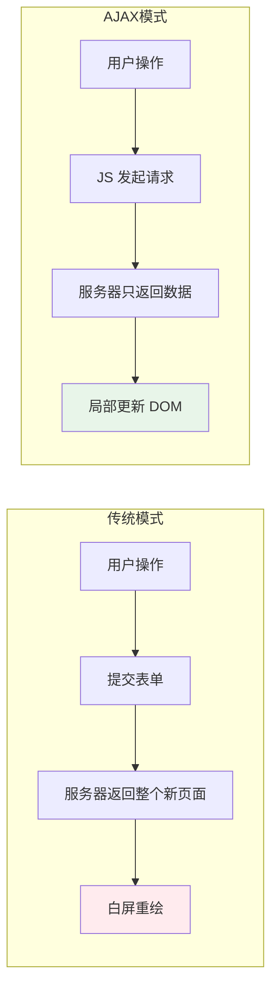
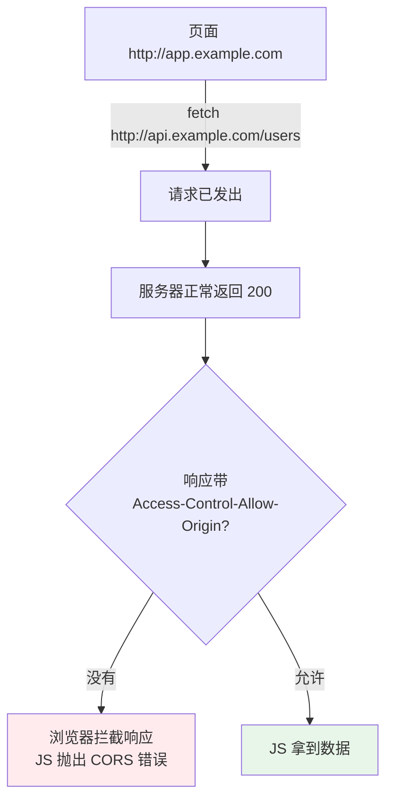
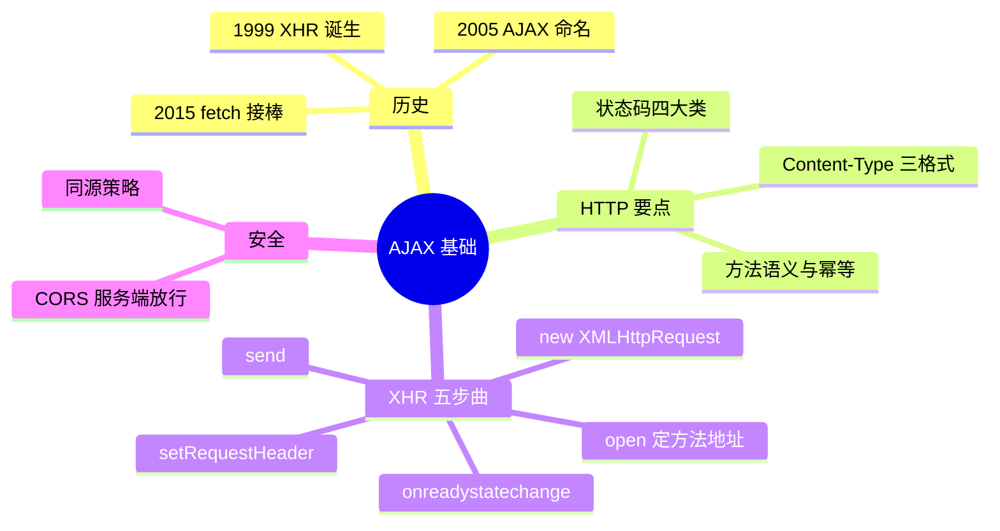

# 01 - AJAX 基础

> 前置：[[前端开发/01-基础/JavaScript/05-异步编程|异步编程]]。AJAX 是浏览器在不刷新页面的前提下与服务器交换数据的技术，是所有现代 Web 应用的地基。本章从历史与 HTTP 讲到 XMLHttpRequest 完整用法。

---

## 1. AJAX 概念史：一次页面范式的革命

2005 年 Google Maps 上线，地图可以无限拖动而不整页刷新——用户第一次意识到"网页也可以像桌面软件"。支撑这一体验的技术组合被 Jesse James Garrett 命名为 **AJAX**（Asynchronous JavaScript And XML）：



革命的本质对比：



虽然名字里带 XML，如今传输格式早已是 JSON（见 [[前端开发/04-DOM与交互/JSON/01-JSON基础|JSON 基础]]），但 AJAX 作为术语保留了下来。

## 2. HTTP 快速回顾

发请求前必须懂协议语义，系统学习见计算机网络章节，这里只列前端高频考点。

### 2.1 方法语义

| 方法 | 语义 | 幂等 | 典型用途 |
|------|------|------|----------|
| GET | 读取资源 | 是 | 查列表、查详情 |
| POST | 创建资源/提交处理 | 否 | 注册、下单 |
| PUT | 全量替换 | 是 | 整体更新配置 |
| PATCH | 部分更新 | 否 | 改昵称这类小改动 |
| DELETE | 删除资源 | 是 | 删除记录 |

幂等指同一请求执行多次与一次效果相同——决定了失败后能否安全重试。

### 2.2 状态码分类

| 类别 | 含义 | 前端常见值 |
|------|------|------------|
| 1xx | 信息 | 101 WebSocket 升级 |
| 2xx | 成功 | 200 OK / 201 Created / 204 No Content |
| 3xx | 重定向 | 301 永久 / 302 临时 / 304 缓存有效 |
| 4xx | 客户端错误 | 400 参数错 / 401 未认证 / 403 禁止 / 404 不存在 |
| 5xx | 服务端错误 | 500 内部错误 / 502 网关错 / 504 超时 |

### 2.3 关键头部

```javascript
// 请求头（JS 能控制的）
"Content-Type: application/json"      // 告诉服务器 body 的格式
"Authorization: Bearer <token>"       // 认证凭证
"Accept: application/json"            // 我能接受的响应格式
"If-None-Match: \"abc123\""           // 缓存协商（配合 304）

// 响应头（JS 大多只读）
"Content-Type: application/json; charset=utf-8"
"CORS 相关头见本章第 6 节"
"Cache-Control: max-age=3600"
```

注意：`Content-Type` 等"危险"请求头在跨域时会触发预检请求，这是第 6 节伏笔。

## 3. XMLHttpRequest 完整用法

XHR 虽老，但面试必考、老项目遍地，且理解它才能真正懂 fetch 解决了什么。

### 3.1 readyState 生命周期

| 值 | 常量 | 含义 |
|----|------|------|
| 0 | UNSENT | 已创建未调用 open |
| 1 | OPENED | open 已调用 |
| 2 | HEADERS_RECEIVED | send 后收到响应头 |
| 3 | LOADING | 正在接收响应体 |
| 4 | DONE | 全部完成 |

日常只需要关心 state === 4。

### 3.2 GET 完整模板

```javascript
const xhr = new XMLHttpRequest();

xhr.onreadystatechange = function () {
  if (xhr.readyState !== 4) return;          // 只处理完成态
  if (xhr.status >= 200 && xhr.status < 300) {
    const data = JSON.parse(xhr.responseText);
    console.log("数据:", data);
  } else if (xhr.status === 404) {
    console.error("资源不存在");
  } else {
    console.error(`请求失败: ${xhr.status}`);
  }
};

xhr.open("GET", "/api/users?page=1&size=10", true); // true = 异步
xhr.setRequestHeader("Accept", "application/json");
xhr.send(null); // GET 的 body 为 null
```

查询参数拼接要编码，中文和特殊字符必须转义：

```javascript
const params = new URLSearchParams({ page: 1, keyword: "手机 壳" });
const url = `/api/products?${params.toString()}`;
// => /api/products?page=1&keyword=%E6%89%8B%E6%9C%BA+%E5%A3%B3
```

### 3.3 POST 完整模板

```javascript
const xhr = new XMLHttpRequest();
xhr.open("POST", "/api/users", true);
xhr.setRequestHeader("Content-Type", "application/json");

xhr.onreadystatechange = function () {
  if (xhr.readyState === 4 && xhr.status === 201) {
    const created = JSON.parse(xhr.responseText);
    console.log("新用户 id:", created.id);
  }
};

const user = { name: "张三", email: "zhang@example.com" };
xhr.send(JSON.stringify(user)); // 对象必须先序列化成字符串
```

### 3.4 其他常用能力

```javascript
xhr.timeout = 5000;
xhr.ontimeout = () => console.error("超时");
xhr.onerror = () => console.error("网络层错误"); // 断网、DNS 失败

xhr.abort(); // 主动取消，触发 onabort

xhr.upload.onprogress = (e) => {          // 上传进度
  if (e.lengthComputable) {
    console.log((e.loaded / e.total) * 100 + "%");
  }
};

xhr.responseType = "json"; // 设置后直接读 xhr.response 得到对象，省去 parse
```

## 4. GET vs POST：数据放在哪

这是参数传递方式的根本差异，不只是"一个明文一个加密"的讹传（两者都不加密，加密靠 HTTPS）：

| 维度 | GET | POST |
|------|-----|------|
| 数据位置 | URL 查询字符串 | 请求体 body |
| 长度限制 | URL 约 2KB~8KB（浏览器实现差异） | 无硬限制 |
| 缓存 | 可被缓存、进历史记录 | 默认不缓存 |
| 语义 | 读数据，安全幂等 | 写数据，可能产生副作用 |
| 编码类型 | 仅 form-urlencoded 形式拼在 URL | 三种 Content-Type 任选 |

### 4.1 Content-Type 三种主流格式

```javascript
// 一、application/x-www-form-urlencoded —— 表单默认格式
// body: name=张三&age=20 （键值对用 & 连接 = 赋值）
const xhr1 = new XMLHttpRequest();
xhr1.open("POST", "/api/login");
xhr1.setRequestHeader("Content-Type", "application/x-www-form-urlencoded");
xhr1.send(new URLSearchParams({ user: "admin", pwd: "123456" }).toString());

// 二、application/json —— 现代 API 主流
const xhr2 = new XMLHttpRequest();
xhr2.open("POST", "/api/users");
xhr2.setRequestHeader("Content-Type", "application/json");
xhr2.send(JSON.stringify({ user: "admin", roles: ["admin", "editor"] }));

// 三、multipart/form-data —— 文件上传专用，浏览器自动设 boundary
const fd = new FormData();
fd.append("avatar", fileInput.files[0]);   // File 对象
fd.append("nickname", "张三");
const xhr3 = new XMLHttpRequest();
xhr3.open("POST", "/api/upload");
xhr3.upload.onprogress = (e) => console.log(`${(e.loaded/e.total*100)|0}%`);
xhr3.send(fd);
// 注意：使用 FormData 时绝不能手动设置 Content-Type，
// boundary 由浏览器生成并自动写入请求头
```

选择口诀：键值对简单提交用 urlencoded；结构化嵌套数据用 json；含文件用 multipart。

## 5. 同步请求为什么被移除

XHR 第三个参数传 false 即同步请求，会**冻结整个主线程**直到响应回来——期间页面无法滚动、无法点击。标准已在部分上下文（如页面卸载前）禁止同步 XHR。永远写 `open(method, url, true)`，异步思维见 [[前端开发/01-基础/JavaScript/05-异步编程|异步编程]]。

## 6. 同源策略与跨域问题引出

浏览器最核心的安全机制之一：**协议 + 域名 + 端口**三者完全相同才算同源，不同源的脚本默认不能读取彼此的响应。



三个必须纠正的认知：

1. **请求其实发出去了，服务器也响应了**，是浏览器把响应扣下了。抓包工具能看到完整往返。
2. 报错文案写着 "has been blocked by CORS policy"，根因是**服务端没声明允许**。
3. 解决方案是 **CORS**（跨域资源共享）：服务器通过 `Access-Control-Allow-Origin` 等响应头放行；复杂请求还会先发 OPTIONS 预检。Spring 后端的完整配置见 [[java/3工程化/07_Spring MVC|Spring MVC]]，开发期也可用 devServer proxy 在前端侧绕开。

## 7. 调试请求的三个基本功

写 AJAX 必须会用浏览器 DevTools 的 Network 面板，三个高频操作：

1. **过滤与重放**：Fetch/XHR 过滤器只看接口；右键某条请求选 Replay 可以不刷新页面重发。
2. **Copy as fetch**：右键请求复制为 fetch 代码，调试后直接粘回项目改造。
3. **模拟弱网**：Network throttling 切 Slow 4G，验证 loading 态是否友好。

```javascript
// 代码侧配合：给每个请求打唯一标记，方便日志对账
const traceId = crypto.randomUUID();
xhr.setRequestHeader("X-Trace-Id", traceId);
console.log(`[${traceId}] GET /api/users 发起`);
```

后端联调时"我发了但你没收到"的争论，靠 Network 面板的请求详情（Headers/Preview/Response 三个 tab）一秒定责。

## 8. 实战：把 XHR 封装成 Promise 风格

回调地狱是 XHR 的原罪，封装成 Promise 既练习异步又得到可复用工具：

```javascript
/**
 * Promise 化的 XHR 封装
 * @param {string} method - HTTP 方法
 * @param {string} url - 请求地址（相对路径基于当前源）
 * @param {object} [options]
 * @param {object} [options.data] - 请求数据：GET 自动转查询串，其余转 JSON
 * @param {number} [options.timeout=10000] - 超时毫秒数
 * @returns {Promise<any>} 解析为服务器返回的 JSON
 */
function request(method, url, options = {}) {
  const { data = null, timeout = 10000 } = options;

  return new Promise((resolve, reject) => {
    const xhr = new XMLHttpRequest();

    // GET 且携带数据：拼接到 URL
    let fullUrl = url;
    if (data && method.toUpperCase() === "GET") {
      fullUrl += (url.includes("?") ? "&" : "?") + new URLSearchParams(data);
    }

    xhr.open(method, fullUrl, true);
    xhr.timeout = timeout;

    // 非 GET 统一按 JSON 提交
    if (data && method.toUpperCase() !== "GET") {
      xhr.setRequestHeader("Content-Type", "application/json");
    }

    xhr.onload = () => {
      // 2xx 视为成功
      if (xhr.status >= 200 && xhr.status < 300) {
        try {
          resolve(xhr.responseText ? JSON.parse(xhr.responseText) : null);
        } catch {
          reject(new Error(`响应不是合法 JSON: ${url}`));
        }
      } else {
        const err = new Error(`HTTP ${xhr.status}: ${xhr.statusText}`);
        err.status = xhr.status;
        err.response = safeParse(xhr.responseText);
        reject(err);
      }
    };

    xhr.onerror = () => reject(new Error(`网络错误: ${url}`));
    xhr.ontimeout = () => reject(new Error(`请求超时(${timeout}ms): ${url}`));
    xhr.onabort = () => reject(new Error(`请求被取消: ${url}`));

    xhr.send(data && method.toUpperCase() !== "GET" ? JSON.stringify(data) : null);
  });
}

function safeParse(text) {
  try { return JSON.parse(text); } catch { return text; }
}

/* ---------- 使用示例 ---------- */

request("GET", "/api/users", { data: { page: 1 } })
  .then((list) => console.log(list))
  .catch((err) => console.error(err.message));

async function loadDashboard() {
  try {
    const [user, orders] = await Promise.all([
      request("GET", "/api/me"),
      request("GET", "/api/orders", { data: { status: "pending" } }),
    ]);
    render(user, orders);
  } catch (err) {
    showErrorToast(err.message);
  }
}
```

这个封装已经具备：统一错误通道、超时控制、GET/POST 自动区分数据载体。它就是下一章 [[前端开发/04-DOM与交互/AJAX/02-Fetch-API|Fetch API]] 中官方方案的思路预告——fetch 把这套 Promise 化做成了语言级标准。

---

## 9. 小结



记住三句话：状态码 4 才处理结果；GET 数据上 URL、POST 数据进 body；跨域报错的锅在后端配置。下一章进入现代标准 fetch。
