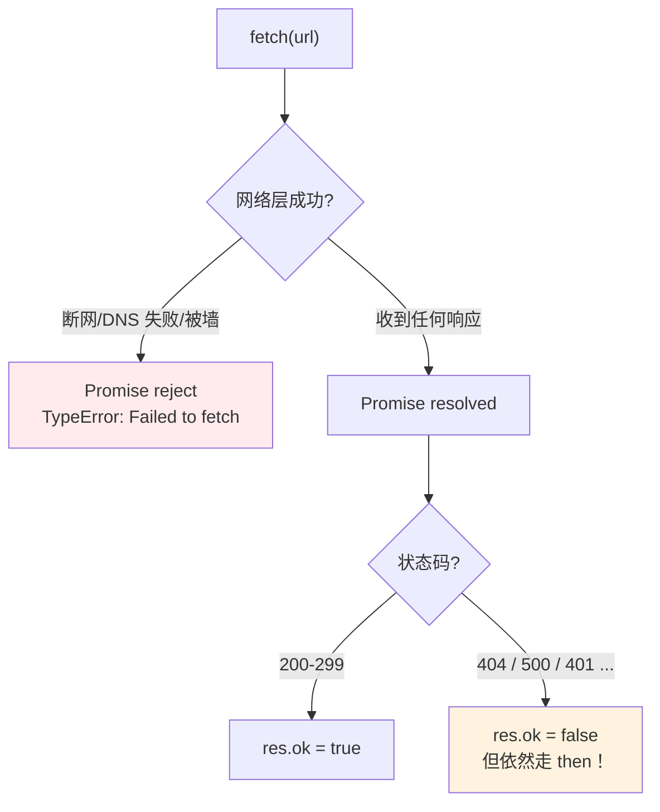
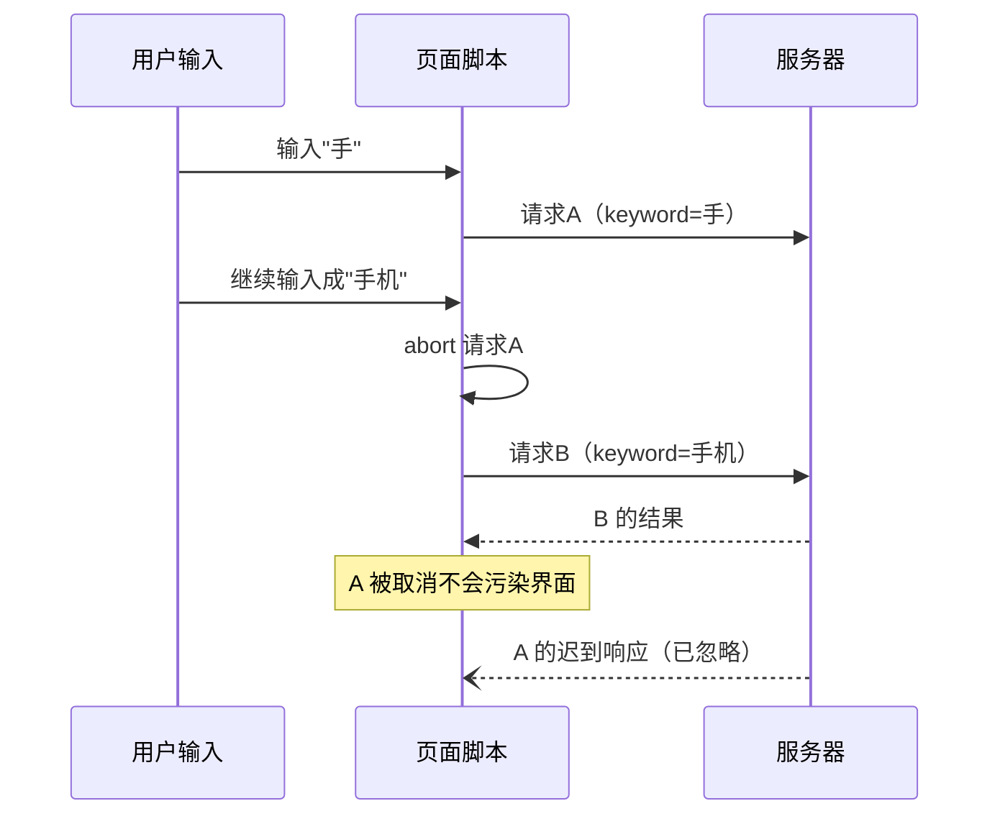
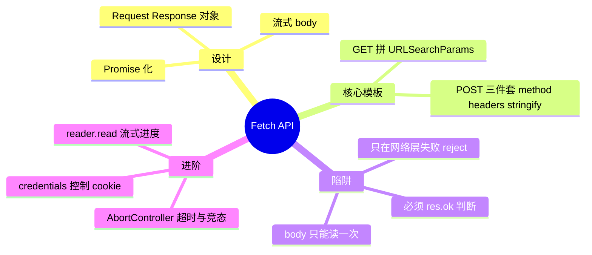

# 02 - Fetch API

> 前置：[[前端开发/04-DOM与交互/AJAX/01-AJAX基础|AJAX 基础]]。fetch 是 2015 年进入标准的现代请求方案，原生返回 Promise，语法基于 Request/Response 对象。本章重点是它的设计哲学与那些坑。

---

## 1. fetch 的定位

fetch 是 XMLHttpRequest 的官方替代品：

| 维度 | XMLHttpRequest | fetch |
|------|----------------|-------|
| 异步模型 | 回调（onreadystatechange） | 原生 Promise |
| 数据读取 | responseText 手动解析 | Response 对象方法链 |
| 请求取消 | abort() | AbortController（标准化） |
| 流式读取 | 不支持 | response.body 可读流 |
| Service Worker 拦截 | 不支持 | 完整支持 |
| 错误语义 | HTTP 错误也进 onerror 分支逻辑混乱 | **只有网络层失败才 reject** |

```javascript
// 最小示例：一行发起请求
fetch("/api/users")
  .then((res) => res.json())
  .then((data) => console.log(data));
```

## 2. 基本 GET：完整模板

```javascript
async function getUser(id) {
  const res = await fetch(`/api/users/${id}`);

  // 第一步永远是检查 HTTP 层是否成功
  if (!res.ok) {
    throw new Error(`请求失败: ${res.status} ${res.statusText}`);
  }

  const user = await res.json(); // 第二步才解析数据
  console.log(user);
}
```

带查询参数的标准写法：

```javascript
const params = new URLSearchParams({
  page: "1",
  size: "20",
  keyword: "无线鼠标",
});

const res = await fetch(`/api/products?${params}`);
```

## 3. POST JSON：完整模板

三个要素缺一不可：method、Content-Type 头、body 序列化：

```javascript
async function createUser(user) {
  const res = await fetch("/api/users", {
    method: "POST",
    headers: {
      "Content-Type": "application/json",
    },
    body: JSON.stringify(user), // 必须手动序列化！
  });

  if (!res.ok) throw new Error(`创建失败: ${res.status}`);
  return res.json();
}

createUser({ name: "张三", email: "zhang@example.com" });
```

新手三大遗忘点自查清单：忘了 `JSON.stringify`（对象被隐式 toString 成 `[object Object]`）、忘了设 Content-Type（后端解析失败）、GET 误传 body（fetch 会直接抛错）。

## 4. Response 对象

fetch resolve 出来的是一个 Response 实例：

| 成员 | 类型 | 说明 |
|------|------|------|
| ok | boolean | status 在 200-299 之间 |
| status / statusText | number / string | HTTP 状态码与文案 |
| headers | Headers | 响应头，get() 取值 |
| url | string | 最终 URL（重定向后） |
| redirected | boolean | 是否发生过重定向 |

### 4.1 四种 body 读取方法

Response 的 body 只能读一次（流的物理限制），选对方法很重要：

```javascript
const res = await fetch("/api/data");

await res.json();   // 解析为 JSON —— 接口默认选择
await res.text();   // 纯文本 —— HTML 片段、CSV
await res.blob();   // 二进制大对象 —— 图片、文件下载
await res.formData();// multipart 表单

// 读过一次后再读会报 TypeError: body stream already read
// 需要复用时先克隆：
const res2 = await fetch("/api/data");
const copy1 = res2.clone();
console.log(await res2.json());
console.log(await copy1.text());
```

### 4.2 读取响应头

```javascript
const res = await fetch("/api/report");
console.log(res.headers.get("content-type"));
console.log(res.headers.get("x-request-id"));

// 注意：跨域时浏览器只暴露 CORS-Safelisted 响应头，
// 自定义头需服务器配置 Access-Control-Expose-Headers
```

## 5. 最大陷阱：404 和 500 不是错误

这是 fetch 与 XHR 语义差异最大、坑人最多的一点：



反面教材（真实项目高频 bug）：

```javascript
// 错误认知：以为 catch 能接住 500
fetch("/api/users")
  .then((res) => res.json())     // 500 时 body 往往不是 JSON，
  .then(renderList)              // 这里会抛 SyntaxError，
  .catch((e) => {                // 报错信息误导你去查解析问题
    console.log("请求出错", e);  // 真正的 500 信息丢失了
  });
```

正确姿势——封装一个断言函数统一处理：

```javascript
async function fetchJson(url, options) {
  const res = await fetch(url, options);
  if (!res.ok) {
    // 尽力把服务器的错误消息带上
    let detail = "";
    try { detail = (await res.json()).message ?? ""; } catch {}
    const err = new Error(`HTTP ${res.status}: ${detail || res.statusText}`);
    err.status = res.status;
    throw err;
  }
  return res.json();
}
```

记住口诀：**fetch 只为网络层失败 reject，HTTP 错误要靠 res.ok 自己判**。

## 6. 请求配置全览

```javascript
fetch(url, {
  method: "POST",
  headers: {
    "Content-Type": "application/json",
    "Authorization": `Bearer ${token}`,
    "X-Custom-Id": "abc123",
  },
  body: JSON.stringify(payload),
  credentials: "same-origin", // cookie 策略，见下表
  signal: controller.signal,  // 取消信号
  cache: "default",           // no-cache / no-store / force-cache ...
  redirect: "follow",         // error / manual
});
```

credentials 决定跨域请求是否携带 cookie：

| 值 | 行为 |
|----|------|
| "omit" | 从不发送 cookie |
| "same-origin" | 同源发送，跨域不发送（**默认**） |
| "include" | 跨域也发送，要求服务端 Allow-Origin 不能是 \* 且必须配 Allow-Credentials |

老项目迁移注意：2017 年前的代码常见 `credentials: "include"` 全局开启；现在默认值已改为 same-origin，跨域会话突然失效多半是这里。

## 7. AbortController：超时与取消

### 7.1 超时的标准实现

```javascript
async function fetchWithTimeout(url, ms = 8000, options = {}) {
  const controller = new AbortController();
  const timer = setTimeout(() => controller.abort(), ms);

  try {
    const res = await fetch(url, { ...options, signal: controller.signal });
    return res;
  } finally {
    clearTimeout(timer); // 无论成败都清理定时器
  }
}

try {
  const res = await fetchWithTimeout("/api/slow-report", 3000);
} catch (e) {
  if (e.name === "AbortError") console.error("超时取消");
  else console.error(e);
}
```

### 7.2 竞态场景：搜索框取消过期请求

用户连续输入时，先发出的请求可能后返回，旧结果覆盖新结果。AbortController 让过期请求直接作废：



```javascript
let currentController = null;

searchInput.addEventListener("input", async (e) => {
  const keyword = e.target.value.trim();

  currentController?.abort();                 // 作废上一次
  const controller = new AbortController();
  currentController = controller;

  try {
    const res = await fetch(`/api/search?q=${encodeURIComponent(keyword)}`, {
      signal: controller.signal,
    });
    if (!res.ok) throw new Error(res.status);
    renderResults(await res.json());
  } catch (err) {
    if (err.name !== "AbortError") showError(err); // 取消不算错误，静默即可
  }
});
```

## 8. 流式读取：大文件进度

response.body 是 ReadableStream，可以边下载边处理，实现 XHR 时代很难做的下载进度：

```javascript
async function downloadWithProgress(url, onProgress) {
  const res = await fetch(url);
  if (!res.ok) throw new Error(`HTTP ${res.status}`);

  // Content-Length 可能缺失（chunked 传输），要做防御
  const total = Number(res.headers.get("content-length")) || 0;
  const reader = res.body.getReader();

  const chunks = [];
  let received = 0;

  while (true) {
    const { done, value } = await reader.read(); // value 是 Uint8Array
    if (done) break;
    chunks.push(value);
    received += value.length;
    onProgress(received, total); // 每收到一块就汇报
  }

  return new Blob(chunks); // 拼成完整 Blob
}

downloadWithProgress("/files/big-video.mp4", (loaded, total) => {
  const pct = total ? ((loaded / total) * 100).toFixed(1) : "?";
  bar.textContent = `${pct}%`;
}).then((blob) => {
  // 触发保存
  const a = document.createElement("a");
  a.href = URL.createObjectURL(blob);
  a.download = "video.mp4";
  a.click();
  URL.revokeObjectURL(a.href);
});
```

## 9. 实战：封装通用 request 函数

把前面所有知识点收拢成一个生产可用的工具层：统一 baseURL、自动 JSON、超时、错误归一化：

```javascript
/**
 * 轻量 request 封装（零依赖）
 */
function createRequest({ baseURL = "", timeout = 10000, getHeaders } = {}) {
  async function request(method, path, data, extra = {}) {
    const url = baseURL + path;
    const controller = new AbortController();
    const timer = setTimeout(() => controller.abort(), timeout);

    const isGet = method === "GET";
    const fullUrl = isGet && data
      ? `${url}${url.includes("?") ? "&" : "?"}${new URLSearchParams(data)}`
      : url;

    try {
      const res = await fetch(fullUrl, {
        method,
        headers: {
          ...(isGet || data instanceof FormData
            ? {} : { "Content-Type": "application/json" }),
          ...getHeaders(),          // 每次 动态取 token，避免缓存旧凭证
        },
        body: isGet ? undefined
             : data instanceof FormData ? data
             : JSON.stringify(data),
        signal: controller.signal,
        ...extra,
      });

      if (!res.ok) {
        let body = null;
        try { body = await res.json(); } catch {}
        const err = new Error(body?.message ?? `HTTP ${res.status}`);
        err.status = res.status;
        err.body = body;
        throw err;
      }
      if (res.status === 204) return null;

      const type = res.headers.get("content-type") ?? "";
      return type.includes("json") ? res.json() : res.blob();
    } finally {
      clearTimeout(timer);
    }
  }

  return {
    get: (path, params, extra) => request("GET", path, params, extra),
    post: (path, data, extra) => request("POST", path, data, extra),
    put: (path, data, extra) => request("PUT", path, data, extra),
    delete: (path, extra) => request("DELETE", path, null, extra),
  };
}

/* ---------- 使用 ---------- */
const api = createRequest({
  baseURL: "/api",
  getHeaders: () => {
    const token = localStorage.getItem("token");
    return token ? { Authorization: `Bearer ${token}` } : {};
  },
});

const users = await api.get("/users", { page: 1 });       // GET + 参数
const created = await api.post("/users", { name: "李四" }); // POST JSON
const avatar = await api.post("/upload", formDataObj);     // FormData 自动识别
await api.delete("/users/42");
```

这个封装覆盖了日常九成场景。当需求长出拦截器、refresh token、并发助手这些能力时，就该换 axios 了——见下一章 [[前端开发/04-DOM与交互/AJAX/03-axios与拦截器|axios 与拦截器]]。

---

## 10. 小结



一句话总结本章：fetch 把简单的事情变优雅了，但把"判断成功"的责任交还给了你——永远不要裸用 fetch。
