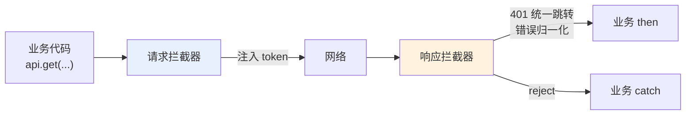
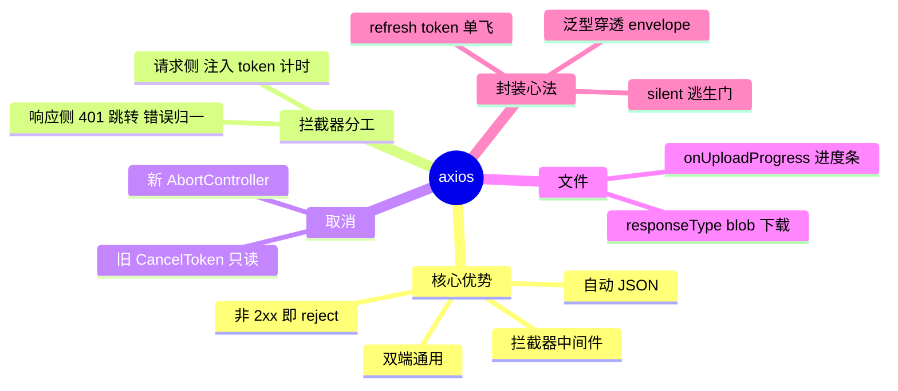

# 03 - axios 与拦截器

> 前置：[[前端开发/04-DOM与交互/AJAX/02-Fetch-API|Fetch API]]。fetch 解决"能不能"，axios 解决"好不好用"。本章讲清 axios 的价值边界、拦截器架构与企业级封装。

---

## 1. 为什么用 axios

axios 是基于 Promise 的 HTTP 客户端，底层在浏览器用 XHR、在 Node 用 http 模块。它对 fetch 的增强：

| 能力 | fetch | axios |
|------|-------|-------|
| 运行环境 | 仅浏览器/支持 Web API 的运行时 | 浏览器 + Node.js 同一套代码 |
| 自动 JSON 序列化/解析 | 手动 stringify / 手动 res.json() | 自动 |
| HTTP 错误处理 | 404/500 也 resolve，需手动判 ok | 非 2xx 直接 reject 进 catch |
| 拦截器 | 无 | 请求/响应两级拦截器 |
| XSRF 防护 | 手动 | 内建 xsrfCookieName 配置 |
| 并发助手 | Promise.all 凑合 | axios.all / allSettled |
| 上传进度 onUploadProgress | 要手写流读取 | 一行配置 |
| 超时 | AbortController 手动拼 | timeout 一个数字 |
| 包体积 | 0（原生） | 约 13KB gzip |

选型结论：纯前端轻项目、SSR 边缘函数用 fetch + 自封装足够；中后台系统、需要统一鉴权与错误处理的团队项目，axios 的拦截器生态省下大量胶水代码。

## 2. 安装与引入

```bash
npm install axios
```

```javascript
// ESM（Vite/webpack 项目）
import axios from "axios";

// CommonJS（Node 脚本）
const axios = require("axios");

// CDN 快速体验
// <script src="https://cdn.jsdelivr.net/npm/axios/dist/axios.min.js"></script>
```

## 3. 基础 CRUD 全示例

```javascript
/* ---------- 创建实例 ---------- */
const api = axios.create({
  baseURL: "/api",          // 所有请求自动加前缀
  timeout: 10000,
  headers: { "Content-Type": "application/json" },
});

/* ---------- C: Create ---------- */
async function createUser(user) {
  const { data } = await api.post("/users", user); // data 就是解析好的响应体
  return data;
}

/* ---------- R: Read ---------- */
async function listUsers({ page = 1, size = 10 } = {}) {
  const { data } = await api.get("/users", {
    params: page ? { page, size } : undefined, // params 对象自动转查询串并编码
  });
  return data;
}

async function getUser(id) {
  const { data } = await api.get(`/users/${id}`);
  return data;
}

/* ---------- U: Update ---------- */
async function updateUser(id, patch) {
  const { data } = await api.put(`/users/${id}`, patch);   // 全量
  // 或 await api.patch(`/users/${id}`, patch);             // 局部
  return data;
}

/* ---------- D: Delete ---------- */
async function deleteUser(id) {
  await api.delete(`/users/${id}`); // 204 时 data 为空串
}

/* ---------- 使用 ---------- */
const newUser = await createUser({ name: "张三", roles: ["editor"] });
const list = await listUsers({ page: 2 });
await updateUser(newUser.id, { name: "张三丰" });
```

响应结构速记：axios 把服务器返回包了一层——`res.data` 是业务数据，`res.status` 是状态码，`res.headers` 是响应头。**catch 到的 error 里对应的是 `error.response.data`**。

## 4. 拦截器：axios 的灵魂

拦截器是挂在请求管道上的中间件，所有请求/响应都要经过：



### 4.1 请求拦截器：注入 token

```javascript
api.interceptors.request.use(
  (config) => {
    // 每次实时读取，登录后新 token 立即生效
    const token = localStorage.getItem("token");
    if (token) {
      config.headers.Authorization = `Bearer ${token}`;
    }
    // 埋点：记录发起时间供响应拦截器算耗时
    config.metadata = { start: Date.now() };
    return config; // 必须返回 config！
  },
  (error) => Promise.reject(error)
);
```

### 4.2 响应拦截器：401 处理与错误归一化

```javascript
api.interceptors.response.use(
  (response) => {
    const cost = Date.now() - response.config.metadata.start;
    if (cost > 3000) console.warn(`慢接口 ${response.config.url}: ${cost}ms`);

    // 有些后端约定 HTTP 200 但 body 里 code != 0 表示业务错误，
    // 在这里剥壳，让业务层只拿纯数据
    if (response.data && typeof response.data === "object"
        && "code" in response.data) {
      if (response.data.code !== 0) {
        return Promise.reject(normalizeBizError(response.data));
      }
      response.data = response.data.data;
    }
    return response;
  },
  (error) => {
    if (!error.response) {
      toast.error("网络异常，请检查连接");
      return Promise.reject(error);
    }

    switch (error.response.status) {
      case 401:
        localStorage.removeItem("token");
        // 避免重定向风暴：当前已在登录页就不再跳
        if (!location.pathname.startsWith("/login")) {
          toast.error("登录已过期");
          location.href = `/login?redirect=${encodeURIComponent(location.pathname)}`;
        }
        break;
      case 403:
        toast.error("没有操作权限");
        break;
      case 404:
        toast.error("资源不存在");
        break;
      default:
        toast.error(error.response.data?.message ?? "服务器开小差了");
    }
    return Promise.reject(error);
  }
);

function normalizeBizError(body) {
  const err = new Error(body.message ?? "业务处理失败");
  err.bizCode = body.code;
  return err;
}
```

拦截器的双刃性：好处是鉴权、埋点、错误提示写一次全局生效；坏处是"魔法太多"——新人调试时数据凭空变了。团队规范建议：拦截器只做横切关注点（认证/日志/错误码），任何与具体业务相关的转换留在 service 层。

### 4.3 移除拦截器

```javascript
const myInterceptor = api.interceptors.request.use((cfg) => cfg);
api.interceptors.request.eject(myInterceptor);
```

## 5. 并发请求

```javascript
function getProfile() { return api.get("/me"); }
function getNotices() { return api.get("/notices?unread=1"); }

// 全部成功才进入 then；任一失败进 catch（快速失败）
const [{ data: me }, { data: notices }] = await axios.all([
  getProfile(),
  getNotices(),
]);

// 需要全部结果（含失败的）时用 allSettled
const results = await axios.allSettled([getProfile(), getNotices()]);
for (const r of results) {
  r.status === "fulfilled" ? use(r.value) : log(r.reason);
}
```

注意：并发请求各自独立走拦截器，401 会触发多次跳转逻辑——所以 4.2 中加了防重入判断。

## 6. 取消请求：新旧两代方案

### 6.1 CancelToken（已废弃，老代码要会读）

```javascript
const CancelToken = axios.CancelToken;
const source = CancelToken.source();

api.get("/search", { params: { q: keyword }, cancelToken: source.token })
  .catch((err) => {
    if (axios.isCancel(err)) console.log("请求被取消");
  });

source.cancel("用户继续输入了"); // 触发取消
```

### 6.2 AbortController（现行标准）

v0.22 起 axios 原生支持 Web 标准，与 fetch 用法完全一致：

```javascript
let controller = null;

input.addEventListener("input", async () => {
  controller?.abort();
  controller = new AbortController();

  try {
    const { data } = await api.get("/search", {
      params: { q: input.value },
      signal: controller.signal,
    });
    render(data);
  } catch (err) {
    if (!axios.isCancel(err)) showError(err);
  }
});
```

新代码一律 AbortController；看到 cancelToken 只需知道它在读旧代码时如何工作。

## 7. 文件上传与下载

### 7.1 上传 + 进度条

```html
<input type="file" id="picker">
<progress id="bar" value="0" max="100"></progress>
<span id="pct">0%</span>
```

```javascript
const picker = document.querySelector("#picker");
const bar = document.querySelector("#bar");

picker.addEventListener("change", async () => {
  const file = picker.files[0];
  if (!file) return;

  const fd = new FormData();
  fd.append("file", file);
  fd.append("scene", "avatar"); // 附加字段随表单一起提交

  try {
    const { data } = await api.post("/upload", fd, {
      headers: { "Content-Type": "multipart/form-data" }, // 新版可省略，自动识别
      onUploadProgress: (e) => {
        if (!e.lengthComputable) return;
        const pct = Math.round((e.loaded / e.total) * 100);
        bar.value = pct;
        document.querySelector("#pct").textContent = `${pct}%`;
      },
    });
    console.log("上传完成:", data.url);
  } catch (err) {
    toast.error("上传失败");
  }
});
```

### 7.2 下载 blob

```javascript
async function downloadReport(filename) {
  const res = await api.get("/reports/export", {
    responseType: "blob",           // 关键：让 axios 返回 Blob 而非尝试 JSON 解析
  });

  const url = URL.createObjectURL(res.data);
  const a = document.createElement("a");
  a.href = url;
  a.download = filename;
  a.click();
  URL.revokeObjectURL(url);         // 及时释放内存
}

downloadReport(`报表-${new Date().toISOString().slice(0, 10)}.xlsx`);
```

注意：responseType 设为 blob 后，出错时 error.response.data 也是 Blob，需要 `await blob.text()` 再 parse 才能读到错误信息。

## 8. 实战：request.ts 企业级封装

对接 Java 后端的统一返回结构 `{ code, message, data }`，完整 TypeScript 实现，接口约定细节见 [[java/3工程化/15_全栈开发技巧|全栈开发技巧]]：

```typescript
import axios, {
  type AxiosInstance,
  type AxiosRequestConfig,
  type InternalAxiosRequestConfig,
  type AxiosResponse,
} from "axios";

/** 后端统一响应外壳 */
interface ApiEnvelope<T = unknown> {
  code: number;
  message: string;
  data: T;
}

/** 业务层拿到的就是裸的 T —— 泛型穿透外壳 */
type ApiFn = <T = unknown>(config: AxiosRequestConfig) => Promise<T>;

export interface RequestConfig extends AxiosRequestConfig {
  /** 该请求失败时不弹全局 toast（页面自己兜底） */
  silent?: boolean;
  /** 登录过期时是否允许 refresh 重试（默认 true） */
  allowRefresh?: boolean;
}

let refreshing: Promise<string | null> | null = null;

export function createApiClient(baseURL: string): { request: ApiFn; instance: AxiosInstance } {
  const instance = axios.create({
    baseURL,
    timeout: 15000,
  });

  /* ---------- 请求拦截 ---------- */
  instance.interceptors.request.use((config: InternalAxiosRequestConfig) => {
    const token = localStorage.getItem("access_token");
    if (token) config.headers.Authorization = `Bearer ${token}`;
    return config;
  });

  /* ---------- 响应拦截 ---------- */
  instance.interceptors.response.use(
    async (response: AxiosResponse<ApiEnvelope>) => {
      const body = response.data;
      // 兼容无外壳的裸接口（如文件流）
      if (!(body && typeof body === "object" && "code" in body)) return body as never;
      if (body.code === 0) return body.data as never;

      const err = new Error(body.message || "业务错误") as Error & { bizCode: number };
      err.bizCode = body.code;
      return Promise.reject(err);
    },
    async (error) => {
      const original = error.config as RequestConfig & { _retried?: boolean };

      if (!error.response) {
        if (!original?.silent) toast("网络异常，请稍后重试");
        return Promise.reject(new Error("NETWORK_ERROR"));
      }

      const { status } = error.response;

      /* --- 401：尝试静默续期一次再重放原请求 --- */
      if (status === 401 && original.allowRefresh !== false && !original._retried) {
        original._retried = true;
        const newToken = await ensureFreshToken();
        if (newToken) {
          original.headers!.Authorization = `Bearer ${newToken}`;
          return instance(original); // 重放
        }
        redirectToLogin();
        return Promise.reject(error);
      }

      if (!original?.silent) {
        const msgMap: Record<number, string> = {
          403: "没有权限执行此操作",
          404: "请求的资源不存在",
          500: "服务器内部错误",
          504: "服务器响应超时",
        };
        toast(msgMap[status] ?? extractMessage(error) ?? `请求失败(${status})`);
      }
      return Promise.reject(extractMessage(error) ? error : new Error(`HTTP_${status}`));
    }
  );

  async function ensureFreshToken(): Promise<string | null> {
    refreshing ??= (async () => {
      try {
        const rt = localStorage.getItem("refresh_token");
        if (!rt) return null;
        const { data } = await axios.post<ApiEnvelope<{ access_token: string }>>(
          `${baseURL}/auth/refresh`,
          { refresh_token: rt }
        );
        if (data.code !== 0) return null;
        localStorage.setItem("access_token", data.data.access_token);
        return data.data.access_token;
      } finally {
        refreshing = null; // 无论成败都解锁，下一个 401 重新排队
      }
    })();
    return refreshing;
  }

  function redirectToLogin() {
    localStorage.removeItem("access_token");
    location.href = `/login?redirect=${encodeURIComponent(location.pathname)}`;
  }

  /** 泛型入口：调用方声明期望类型，编译期即可约束 */
  const request: ApiFn = (config) => instance.request(config).then((r) => r.data);

  return { request, instance };
}

function toast(msg: string) { console.warn("[toast]", msg); }
function extractMessage(error: { response?: { data?: { message?: string } } }) {
  return error.response?.data?.message;
}

/* ================= 业务侧使用 ================= */
const { request } = createApiClient("/api");

interface UserVO { id: number; name: string; email: string }

// 类型安全：data 已是 UserVO[]，不是 envelope
export const userService = {
  list: (page: number) =>
    request<UserVO[]>({ url: "/users", method: "get", params: { page } }),
  create: (user: Omit<UserVO, "id">) =>
    request<UserVO>({ url: "/users", method: "post", data: user }),
};

const users = await userService.list(1); // users: UserVO[]
console.log(users[0].name);
```

设计要点复盘：

1. **泛型穿透**：request<T> 让调用方直接拿到业务类型，envelope 剥壳藏在拦截器里。
2. **refresh 单飞**：refreshing 共享同一个 Promise，并发 401 只发一次续期请求。
3. **silent 逃生门**：特殊页面的请求可以关掉全局 toast 自己处理。
4. **_retried 防循环**：续期后的重试不再二次刷新，避免死循环。

---

## 9. 小结



至此请求层三部曲完结：XHR 懂原理、fetch 会标准、axios 能工程化。数据格式的主角 [[前端开发/04-DOM与交互/JSON/01-JSON基础|JSON]] 在下一章登场。
