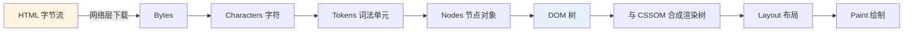
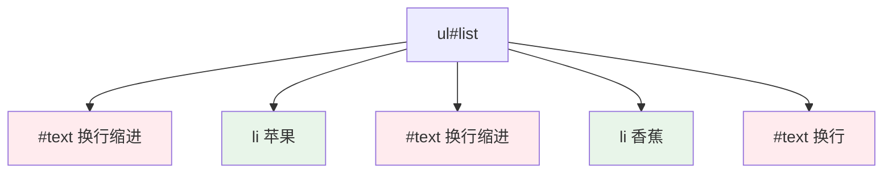
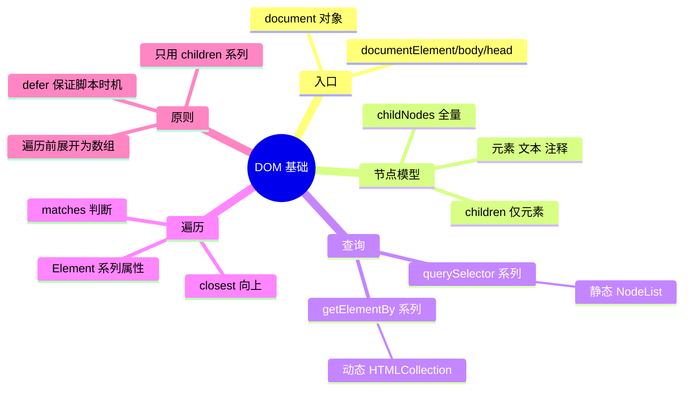

# 01 - DOM 基础与选择器

> 前置：[[前端开发/01-基础/JavaScript/04-DOM操作|JS DOM 操作]]。那一章讲"怎么改页面"，本章讲"DOM 到底是什么、怎么精确地找到节点"。语法是同一套，视角从"够用"升级到"系统"。

---

## 1. 浏览器如何把 HTML 变成 DOM

浏览器加载一个页面的核心流程：网络拿到字节流后，解析器逐字节读入 HTML，构建出 DOM 树；与此同时 CSS 解析为 CSSOM，二者结合生成渲染树，最后布局绘制。我们操作的 DOM 树就是这条流水线的中间产物：



几个对开发有实际影响的推论：

1. **HTML 结构错误不会让解析崩溃**。浏览器容错性极强，忘了闭合标签也会尽量构建出一棵树——但这棵树可能和你想象的不同，`document.body.children.length` 和源码里的标签数经常对不上。
2. **JS 执行会阻塞解析**（默认情况下）。所以脚本要么放 body 底部，要么加 `defer`。
3. **空白符也是文本节点**。HTML 里换行和缩进会成为 `#text` 节点，这直接导致后面要讲的 `childNodes` 与 `children` 的差异。

## 2. document 对象：一切操作的总入口

浏览器把 DOM 挂在全局的 `window.document` 上（可省略写成 `document`）。它是 Document 类型的实例，既是树的根引用，也承载了大量工厂方法与全局查询能力：

```javascript
console.log(document);                 // 整个文档
console.log(document.documentElement); // <html> 元素
console.log(document.body);            // <body> 元素
console.log(document.head);            // <head> 元素
console.log(document.title);           // 页面标题，可直接赋值修改
console.log(document.URL);             // 当前页面地址（只读）
console.log(document.readyState);      // loading / interactive / complete
```

用 Java 的思维类比：`Document` 是一个对象图（Object Graph）的聚合根入口，所有节点都是它的可达对象。你不需要 new 任何东西，浏览器已经帮你构建好整棵树。

```javascript
// document 上还有一批便捷集合（历史遗留但仍在广泛使用）
document.images;   // 所有 ，HTMLCollection
document.forms;    // 所有 <form>
document.links;    // 所有带 href 的 <a>
document.scripts;  // 所有 <script>
```

## 3. 节点类型：一棵树不止有元素

DOM 标准定义了 12 种节点类型，日常打交道的主要是三种：

| nodeType | 常量名 | 对应内容 | nodeName |
|----------|--------|----------|----------|
| 1 | ELEMENT_NODE | `<div>` `<p>` 等标签 | 大写标签名 `"DIV"` |
| 3 | TEXT_NODE | 标签内的文字（含空白换行） | `"#text"` |
| 8 | COMMENT_NODE | `<!-- 注释 -->` | `"#comment"` |
| 9 | DOCUMENT_NODE | document 自身 | `"#document"` |
| 11 | DOCUMENT_FRAGMENT_NODE | 文档片段（后面性能章用） | `"#document-fragment"` |

注意：**属性不是子节点**。旧版 DOM 有 Attr 节点挂在树上，现代标准中属性通过 `attributes` / `getAttribute` 访问，不出现在 childNodes 里。

看一段 HTML 验证文本节点的存在：

```html
<ul id="list">
  <li>苹果</li>
  <li>香蕉</li>
</ul>
```

```javascript
const list = document.getElementById("list");
console.log(list.childNodes.length);
// 5！["\n  ", li, "\n  ", li, "\n"] —— 换行缩进全是 #text 节点
console.log(list.children.length);
// 2 —— 只有元素节点
```

## 4. childNodes 与 children：最容易混淆的一对

这是初学者第一大坑，必须彻底分清：

| 属性 | 包含内容 | 返回类型 |
|------|----------|----------|
| `childNodes` | 元素 + 文本 + 注释等**全部**子节点 | NodeList |
| `children` | **仅元素**节点 | HTMLCollection |



红色的是 `childNodes` 才能看到、`children` 会过滤掉的文本节点。

```javascript
const list = document.querySelector("#list");

// 用 childNodes 时第一个“孩子”很可能是换行文本
console.log(list.firstChild.nodeName);        // "#text"
console.log(list.firstElementChild.tagName);  // "LI"

// 同理 lastChild / previousSibling / nextSibling 都包含文本节点
// 实际开发一律使用 Element 版本：
console.log(list.lastElementChild.textContent);        // "香蕉"
console.log(list.children[0].textContent);              // "苹果"
console.log(list.firstElementChild.nextElementSibling); // li 香蕉
```

经验法则：**业务代码里只用 `children` 系列属性**。只有当你确实需要读取元素之间的原始文本时才碰 `childNodes`。

## 5. 查询 API 全表

### 5.1 五个主要方法对比

| 方法 | 参数形式 | 返回值 | 集合特性 | 性能 |
|------|----------|--------|----------|------|
| getElementById | 纯 id 字符串 | Element 或 null | - | 最快 |
| getElementsByTagName | 标签名 | HTMLCollection | **动态** | 快 |
| getElementsByClassName | class 名 | HTMLCollection | **动态** | 快 |
| querySelector | CSS 选择器 | 首个匹配或 null | - | 中 |
| querySelectorAll | CSS 选择器 | NodeList | **静态快照** | 中 |

### 5.2 动态 vs 静态：必须理解的差异

"动态"意味着返回的集合**不是拷贝**，而是 DOM 的实时视图——页面变化会立刻反映在集合里：

```javascript
const items = document.getElementsByClassName("item");   // 动态
const snapshot = document.querySelectorAll(".item");     // 静态

console.log(items.length);    // 3
console.log(snapshot.length); // 3

// 新增一个匹配元素
const fresh = document.createElement("div");
fresh.className = "item";
document.body.appendChild(fresh);

console.log(items.length);    // 4 ！动态集合自动更新了
console.log(snapshot.length); // 3 静态快照保持原样
```

这个差异的经典事故场景：遍历动态集合并同时删除元素，集合边遍历边缩短，导致漏删或死循环：

```javascript
// 错误示范：动态集合 + 边遍历边删除
const live = document.getElementsByClassName("bad");
for (let i = 0; i < live.length; i++) {
  live[i].remove(); // 删除后 length 缩小，i++ 导致隔一个删一个
}

// 正确做法一：先取静态快照再遍历
for (const el of [...live]) el.remove();

// 正确做法二：只要还有就删第一个
while (live.length > 0) live[0].remove();
```

### 5.3 NodeList 与 HTMLCollection 接口差异

| 能力 | NodeList | HTMLCollection |
|------|----------|----------------|
| forEach | 支持 | 不支持 |
| for...of | 支持（NodeList 是可迭代对象） | 支持 |
| 下标访问 [i] | 支持 | 支持 |
| item(i) 方法 | 支持 | 支持 |
| namedItem() | 无 | 支持（按 name/id 取） |

```javascript
const nodes = document.querySelectorAll("p");   // NodeList
const coll = document.getElementsByTagName("p"); // HTMLCollection

nodes.forEach(p => console.log(p.textContent)); // OK
// coll.forEach(...) 报错！需要先转换：
Array.from(coll).forEach(p => console.log(p.textContent));
[...coll].forEach(p => console.log(p.textContent)); // 展开同样有效
```

统一建议：新代码只用 `querySelector` / `querySelectorAll`，遇到拿不准的返回值先 `[...]` 展开成数组再操作，一劳永逸。

### 5.4 选择器可以任意复杂

querySelector 系列接受完整 CSS 选择器语法，包括组合器、伪类（结构伪类可用，动态状态伪类如 :hover 在查询中无意义）：

```javascript
document.querySelector("#app nav a.active");
document.querySelectorAll("table tr:nth-child(odd)");
document.querySelectorAll("input[type='checkbox']:checked");
document.querySelector("ul.menu > li:not(.disabled)");
document.querySelectorAll("h2, h3"); // 逗号表示“或”，按文档顺序混合返回
```

## 6. 遍历：在树上游走

### 6.1 方向族谱

| 方向 | 含空白版（少用） | 仅元素版（推荐） |
|------|------------------|------------------|
| 向上 | parentNode | parentElement |
| 第一个孩子 | firstChild | firstElementChild |
| 最后一个孩子 | lastChild | lastElementChild |
| 前一个兄弟 | previousSibling | previousElementSibling |
| 后一个兄弟 | nextSibling | nextElementSibling |

```javascript
const item = document.querySelector(".menu li.active");

item.parentElement;                    // ul.menu
item.closest("nav");                   // 向上最近的 nav（见第 7 节）
item.previousElementSibling;           // 上一个 li
item.nextElementSibling?.dataset.id;   // 下一个 li 的自定义数据（可能为 null）

// children 配合下标做位置计算
const idx = [...item.parentElement.children].indexOf(item);
```

### 6.2 深度优先遍历整棵子树

```javascript
function walk(node, callback) {
  callback(node);
  for (const child of node.children) {
    walk(child, callback);
  }
}

walk(document.body, (el) => {
  if (el.matches("[data-track]")) console.log("埋点元素:", el.dataset.track);
});
```

生产环境更常用 TreeWalker，它内置了迭代协议且支持过滤：

```javascript
const walker = document.createTreeWalker(
  document.body,
  NodeFilter.SHOW_ELEMENT,
  { acceptNode: (n) => n.tagName === "A" ? NodeFilter.FILTER_ACCEPT : NodeFilter.FILTER_SKIP }
);

let current;
while ((current = walker.nextNode())) {
  console.log(current.href);
}
```

## 7. closest：向上查找最近祖先

`closest(selector)` 从当前元素开始向上（包括自身）查找第一个匹配选择器的祖先，找不到返回 null。它是事件委托的前置知识，也是"点击了列表里某个按钮，我要找它所在的行"这类问题的标准答案：

```javascript
// HTML: <tr><td><button class="del">删除</button></td></tr>
document.querySelector("tbody").addEventListener("click", (e) => {
  const btn = e.target.closest("button.del");
  if (!btn) return;

  const row = btn.closest("tr");          // 按钮所在的行
  const rowId = row.dataset.id;           // 行上挂的数据
  console.log("删除行", rowId);
  row.remove();
});
```

与 `querySelector` 的区别一句话说清：querySelector **向下**找后代，closest **向上**找祖先，方向相反。

## 8. matches：判断元素是否匹配

`matches(selector)` 返回布尔值，不查找，只判断当前元素自己是否命中选择器：

```javascript
const el = document.querySelector("li");

if (el.matches(".active")) { /* ... */ }
if (el.matches("li[data-special]")) { /* ... */ }

// 典型用途一：事件委托里分流不同目标
list.addEventListener("click", (e) => {
  const target = e.target;
  if (target.matches("button.edit")) editRow(target);
  else if (target.matches("button.del")) deleteRow(target);
});

// 典型用途二：批量过滤
const editable = [...document.querySelectorAll("input")]
  .filter((inp) => inp.matches(":not([readonly]):not([disabled])"));
```

closest + matches 组合起来，几乎能覆盖所有"根据点击位置决定行为"的场景。

## 9. 与 JS DOM 操作章的分工说明

[[前端开发/01-基础/JavaScript/04-DOM操作|04-DOM操作]] 与本章的关系是"入门速成"与"系统认知"：

| 关注点 | 01-JS DOM 操作章 | 本章 |
|--------|------------------|------|
| 目标读者 | 第一次接触页面交互 | 要写复杂组件逻辑 |
| 内容侧重 | 改内容/改样式/绑事件的直接套路 | 渲染原理、节点模型、API 全貌与陷阱 |
| 选择器 | querySelector 够用即可 | 全表对比、动态静态差异 |
| 后续衔接 | 直接进入实战章节 | 衔接 [[前端开发/04-DOM与交互/HTML-DOM/02-DOM操作与事件|DOM 操作与事件]] 的完整 API 与事件模型 |

学习路径建议：如果只是快速完成作业级页面，读基础章即可；要做组件库、富文本、拖拽这类深度 DOM 工作，本章及后续两章是必修。

---

## 10. 小结



三条铁律收尾：

1. 业务代码统一 `querySelector` / `querySelectorAll`，返回集合一律当只读数组用。
2. 遍历关系永远走 `children` / `firstElementChild` 等 Element 系列属性。
3. 脚本执行时机用 `defer` 保证，别赌 body 底部的书写习惯。

下一章 [[前端开发/04-DOM与交互/HTML-DOM/02-DOM操作与事件|DOM 操作与事件]] 把节点的增删改 API 和事件模型一次性讲透。
