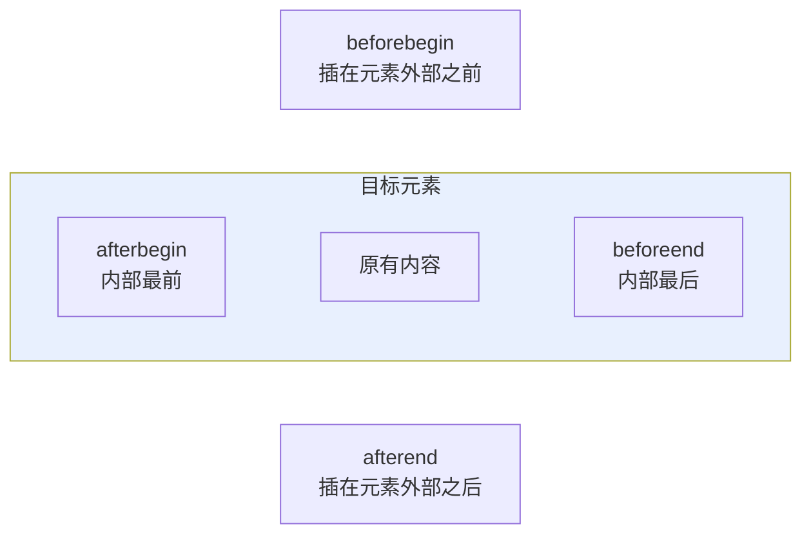
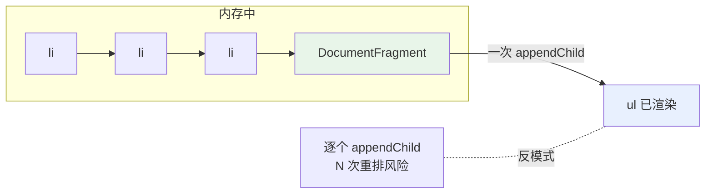
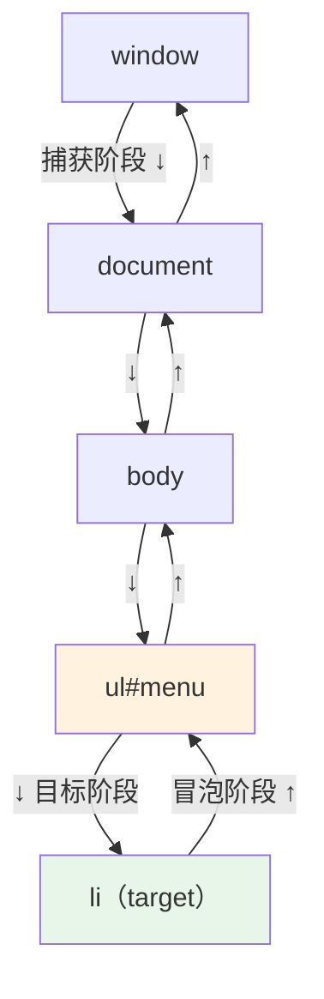
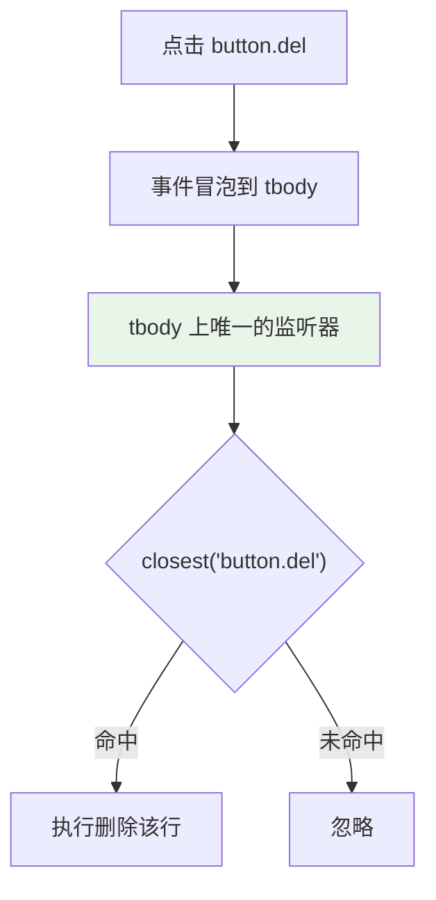

# 02 - DOM 操作与事件

> 前置：[[前端开发/04-DOM与交互/HTML-DOM/01-DOM基础与选择器|DOM 基础与选择器]]。本章补全节点增删改的完整 API，并把事件模型从"会绑定"推进到"理解捕获、冒泡与委托"。

---

## 1. 创建节点

```javascript
// 创建元素节点
const div = document.createElement("div");
div.className = "card";
div.dataset.id = "42";

// 创建文本节点（textContent 更常用）
const text = document.createTextNode("你好");
div.appendChild(text);
// 等价于 div.textContent = "你好";

// 其他工厂方法
document.createDocumentFragment(); // 文档片段，见性能一节
document.createComment("注释内容");
```

创建后元素只存在于内存中，**必须插入 DOM 才会显示**。插入前对它做任何配置都是零开销的——这是"先拼好再上树"原则的基础。

## 2. 插入节点的完整 API

| 方法 | 调用者 | 行为 |
|------|--------|------|
| appendChild(node) | 父节点 | 追加到子节点末尾；若节点已在树中则**移动**而非复制 |
| insertBefore(new, ref) | 父节点 | 插到 ref 之前；ref 为 null 时等同 appendChild |
| append(...nodes/strings) | 父节点 | 追加多个，可接字符串（自动转文本） |
| prepend(...nodes/strings) | 父节点 | 插到最前，同样支持多参 |
| before(...nodes) | 目标元素 | 插到自己前面 |
| after(...nodes) | 目标元素 | 插到自己后面 |
| insertAdjacentHTML(pos, str) | 目标元素 | 按位置解析 HTML 字符串并插入 |

```javascript
const parent = document.querySelector("#list");

const a = document.createElement("li"); a.textContent = "A";
const b = document.createElement("li"); b.textContent = "B";
const c = document.createElement("li"); c.textContent = "C";

parent.appendChild(a);        // [A]
parent.insertBefore(b, a);    // [B, A]
parent.prepend(c);            // [C, B, A]

const d = document.createElement("li"); d.textContent = "D";
a.before(d);                  // [C, D, B, A]
const e = document.createElement("li"); e.textContent = "E";
b.after(e);                   // [C, D, E, B, A]
```

`insertAdjacentHTML` 的四个位置参数用一张图记：



```javascript
el.insertAdjacentHTML("beforebegin", "<p>外面-前</p>");
el.insertAdjacentHTML("afterbegin", "<p>里面-前</p>");
el.insertAdjacentHTML("beforeend", "<p>里面-后</p>");   // 最常用
el.insertAdjacentHTML("afterend", "<p>外面-后</p>");
```

注意 `insertAdjacentHTML` 与 `innerHTML` 一样有 XSS 风险，规则同前章：用户可控数据不进 HTML 解析通道。

## 3. 替换、克隆与删除

```javascript
// 替换：新节点换掉旧节点
const fresh = document.createElement("section");
fresh.textContent = "新版块";
parent.replaceChild(fresh, oldNode);           // 传统写法
oldNode.replaceWith(fresh);                    // 现代写法，语义更直白

// 克隆：参数 deep 决定是否连子孙一起复制
const card = document.querySelector(".card");
const shellOnly = card.cloneNode(false); // 只克隆外壳，无子节点
const fullCopy = card.cloneNode(true);   // 深克隆，整棵子树

// 删除
child.remove();                    // 自杀式删除，现代标准
parent.removeChild(child);         // 传统写法，返回被删节点
```

cloneNode 三个必须知道的细节：

1. **不复制事件监听器**。克隆体是"干净"的，需要重新绑定或改用事件委托。
2. **不复制通过 JS 直接设置的 property**（如 `input.value = "x"`），但 HTML attribute 会保留。
3. 表单场景克隆 input 后记得处理 name 重复问题。

```javascript
// 实用模式：模板克隆生成列表项
function createRow(name, score) {
  const tpl = document.querySelector("#row-tpl");
  const row = tpl.content.firstElementChild.cloneNode(true);
  row.querySelector(".name").textContent = name;
  row.querySelector(".score").textContent = score;
  return row;
}
```

对应 HTML：

```html
<template id="row-tpl">
  <tr>
    <td class="name"></td>
    <td class="score"></td>
  </tr>
</template>
```

`<template>` 标签的内容不会渲染，是官方推荐的"HTML 模板"方案。

## 4. DocumentFragment：批量操作的正确姿势

每次把节点插入已渲染的 DOM，都可能触发重排（reflow）。连续插入 1000 个节点就是上千次潜在布局计算。DocumentFragment 是内存中的轻量容器，先把所有节点装进片段，最后一次性挂载：



```javascript
const ul = document.querySelector("#data-list");
const frag = document.createDocumentFragment();

for (let i = 0; i < 1000; i++) {
  const li = document.createElement("li");
  li.textContent = `条目 ${i}`;
  frag.appendChild(li);       // 在内存里拼装，不碰真实 DOM
}
ul.appendChild(frag);          // 一次上树
```

一个冷知识：appendChild(fragment) 之后 fragment 变为空（子节点全部移交给目标），所以片段不能复用，需要循环重建。

现代替代方案：innerHTML 拼大字符串或 `insertAdjacentHTML` 也常用于批量渲染，只要数据可信即可。框架时代这些手动优化大多被虚拟 DOM 接管，但在无依赖脚本、油猴脚本、Web Components 中仍是必备技能。

## 5. 事件模型深入

### 5.1 addEventListener 第三参数的完整形态

第三个参数除了布尔值 capture，还可以传配置对象：

```javascript
btn.addEventListener("click", handler, {
  capture: false,  // 是否在捕获阶段触发（默认 false）
  once: true,      // 触发一次后自动移除
  passive: true,   // 声明回调绝不调用 preventDefault
  signal: controller.signal, // AbortSignal，用于批量移除
});

// 移除时函数引用必须一致
btn.removeEventListener("click", handler);
```

`passive: true` 对滚动类事件的性能意义重大：浏览器预先知道你不会阻止默认行为，就能立即滚动而不用等回调执行完。触摸滚动卡顿的第一优化项就是给 touchstart/touchmove/wheel 加 passive：

```javascript
// 反面教材：scroll 回调里 preventDefault，浏览器被迫等待
window.addEventListener("wheel", (e) => { /* ... */ });          // 默认非 passive（部分浏览器）

// 正确姿势
window.addEventListener("wheel", onWheel, { passive: true });
```

### 5.2 事件流三阶段

一次点击从窗口出发向下传播到目标，再原路返回：



三个事实决定了日常写法：

- 默认监听在**冒泡阶段**触发（capture 为 false）。
- `e.target` 是真正被点的最深元素；`e.currentTarget` 是当前正在执行监听器的元素（通常等于你绑定的那个）。
- 大多数事件会冒泡，例外要记住：`focus`/`blur` 不冒泡（用 focusin/focusout 替代）、`load`、`mouseenter/mouseleave`。

```javascript
ul.addEventListener("click", (e) => {
  console.log(e.target.tagName);       // 可能是 BUTTON 或 LI 内的 span
  console.log(e.currentTarget.tagName);// UL，委托宿主
  console.log(e.eventPhase);           // 3 = 冒泡阶段
}, false);
```

### 5.3 stopPropagation vs preventDefault

两者职责完全不同，经常被混为一谈：

| 方法 | 作用 | 影响默认行为 | 影响其他监听器 |
|------|------|--------------|----------------|
| event.preventDefault() | 取消浏览器默认动作 | 是 | 否 |
| event.stopPropagation() | 阻止事件继续传播 | 否 | 是 |

```javascript
// 场景一：拦截 <a href> 跳转，但要让事件继续冒泡给统计代码
link.addEventListener("click", (e) => {
  e.preventDefault();        // 不跳转
  openInModal(link.href);    // 自己接管
});

// 场景二：弹窗内部点击不要关闭弹窗，但不影响链接本身功能
modal.addEventListener("click", (e) => e.stopPropagation());

// 场景三：表单提交校验失败
form.addEventListener("submit", (e) => {
  if (!form.reportValidity()) e.preventDefault(); // 阻止提交刷新页面
});
```

还有个少用的 `stopImmediatePropagation()`：不仅阻止传播，连同一元素上排在后面的监听器也不执行。

## 6. 事件委托：动态列表的标准架构

需求：列表项由接口动态渲染，随时增删，每项都有编辑/删除按钮。如果每渲染一项就绑一次事件，增删时要同步解绑，极易内存泄漏。委托把监听器固定在稳定父级上：



完整可运行示例：

```html
<table id="users">
  <thead><tr><th>姓名</th><th>操作</th></tr></thead>
  <tbody></tbody>
</table>

<script>
  const tbody = document.querySelector("#users tbody");

  function render(users) {
    tbody.innerHTML = users.map((u) => `
      <tr data-id="${u.id}">
        <td>${u.name}</td>
        <td>
          <button class="edit">编辑</button>
          <button class="del">删除</button>
        </td>
      </tr>`).join("");
  }

  // 只绑定一次，行怎么增删都无需重新绑定
  tbody.addEventListener("click", (e) => {
    const delBtn = e.target.closest("button.del");
    if (delBtn) {
      delBtn.closest("tr").remove();
      return;
    }
    const editBtn = e.target.closest("button.edit");
    if (editBtn) {
      console.log("编辑行 id =", editBtn.closest("tr").dataset.id);
    }
  });

  render([{ id: 1, name: "张三" }, { id: 2, name: "李四" }]);
</script>
```

委托三要素：稳定父级 + closest 定位 + dataset 携带数据。

## 7. 自定义事件 CustomEvent

组件之间解耦通信的零依赖方案：

```javascript
// 发布方：购物车模块
function addToCart(product) {
  cart.push(product);
  window.dispatchEvent(new CustomEvent("cart:changed", {
    detail: { count: cart.length, lastAdded: product },
  }));
}

// 订阅方：角标组件
window.addEventListener("cart:changed", (e) => {
  badge.textContent = e.detail.count;
});

// 订阅方：埋点模块
window.addEventListener("cart:changed", (e) => {
  track("add_to_cart", e.detail.lastAdded.id);
});
```

要点：detail 携带任意数据；自定义事件同样参与冒泡（可在构造时传 `{ bubbles: true }`）；事件名建议加命名空间前缀避免冲突。

## 8. 表单事件与焦点管理

| 事件 | 触发时机 | 典型用途 |
|------|----------|----------|
| input | 值每次变化（含粘贴、输入法） | 实时搜索、字数统计 |
| change | 值变化且失焦（select 则立即） | 下拉联动 |
| submit | 表单提交（回车或按钮） | 统一校验入口 |
| blur / focus | 失去/获得焦点（不冒泡） | 单字段校验提示 |
| focusin / focusout | 同上但会冒泡 | 委托场景必用 |
| reset | 点击重置按钮 | 清理自定义状态 |

```javascript
const form = document.querySelector("#signup");
const pwd = form.querySelector("#pwd");

// submit 是表单校验的唯一正确入口
form.addEventListener("submit", (e) => {
  e.preventDefault();
  const data = Object.fromEntries(new FormData(form));
  console.log(data); // { user: "...", pwd: "...", agree: "on" }
});

// blur 校验单个字段，错误信息就地显示
pwd.addEventListener("blur", () => {
  const err = pwd.closest(".field").querySelector(".error");
  err.textContent = pwd.value.length >= 6 ? "" : "密码至少 6 位";
});

// 自动聚焦第一个空字段
form.addEventListener("invalid", (e) => {
  e.target.focus();
}, true); // 注意 invalid 不冒泡，要用捕获监听
```

## 9. 实战：表格行内编辑

综合运用本章 API：委托、closest、替换节点、focus 管理。双击单元格进入编辑态，回车确认，Esc 取消：

```html
<!DOCTYPE html>
<html lang="zh">
<head>
<meta charset="UTF-8">
<style>
  td[contenteditable="true"] { outline: 2px solid #4a90d9; background: #f0f7ff; }
  td { min-width: 80px; cursor: cell; }
</style>
</head>
<body>
<table id="stock">
  <thead><tr><th>商品</th><th>库存</th><th>单价</th></tr></thead>
  <tbody>
    <tr data-id="101"><td>键盘</td><td>23</td><td>199.00</td></tr>
    <tr data-id="102"><td>鼠标</td><td>57</td><td>89.50</td></tr>
  </tbody>
</table>

<script>
  const table = document.querySelector("#stock");
  let editingCell = null;
  let originalText = "";

  // 双击进入编辑：直接用 contenteditable，省去 input 替换
  table.addEventListener("dblclick", (e) => {
    const cell = e.target.closest("td");
    if (!cell || editingCell === cell) return;

    cancelEdit(); // 同时只允许编辑一格
    editingCell = cell;
    originalText = cell.textContent;
    cell.contentEditable = "true";
    cell.focus();
    // 全选方便直接覆盖输入
    const range = document.createRange();
    range.selectNodeContents(cell);
    const sel = getSelection();
    sel.removeAllRanges();
    sel.addRange(range);
  });

  // 键盘交互也走委托
  table.addEventListener("keydown", (e) => {
    if (!editingCell || e.target !== editingCell) return;
    if (e.key === "Enter") {
      e.preventDefault();
      commitEdit();
    } else if (e.key === "Escape") {
      e.preventDefault();
      cancelEdit();
    }
  });

  // 失焦视为确认，保持行为一致
  table.addEventListener("focusout", (e) => {
    if (editingCell && e.target === editingCell) commitEdit();
  });

  function commitEdit() {
    if (!editingCell) return;
    finishEditing(editingCell.textContent.trim());
  }

  function cancelEdit() {
    if (!editingCell) return;
    finishEditing(originalText);
  }

  function finishEditing(value) {
    editingCell.contentEditable = "false";
    const cell = editingCell;
    const field = cell.cellIndex;               // 第几列
    const rowId = cell.parentElement.dataset.id; // 哪一行
    console.log(`保存: 商品 ${rowId} 第 ${field} 列 -> "${value}"`);
    editingCell = null;
    originalText = "";
    // 此处可调用 fetch 把变更提交后端，
    // 接口写法见 [[前端开发/04-DOM与交互/AJAX/02-Fetch-API|Fetch API]]
  }
</script>
</body>
</html>
```

实现要点复盘：

1. 所有交互都挂在 table 一个监听器上，行可以随意增删。
2. contenteditable 方案比"td 里塞 input"少了节点替换和宽度抖动问题。
3. Enter/Esc/blur 三种退出路径都收敛到两个 finish 函数，状态机简单清晰。
4. focusout 会冒泡所以能委托，这正是选它而不是 blur 的原因。

---

## 10. 小结

| 能力 | 关键 API |
|------|----------|
| 插入 | appendChild / prepend / before / after / insertAdjacentHTML |
| 替换 | replaceWith |
| 克隆 | cloneNode(deep) |
| 删除 | remove |
| 批量优化 | DocumentFragment 一次上树 |
| 监听 | addEventListener + capture/once/passive/signal |
| 流程控制 | preventDefault（默认行为）/ stopPropagation（传播） |
| 动态元素 | 事件委托 = 稳定父级 + closest + dataset |
| 组件通信 | CustomEvent + dispatchEvent |

下一章 [[前端开发/04-DOM与交互/HTML-DOM/03-DOM高级：MutationObserver|DOM 高级：MutationObserver]] 进入观察者模式的现代 DOM 监听方案。
