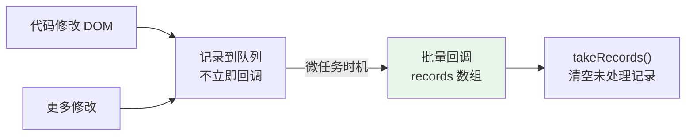
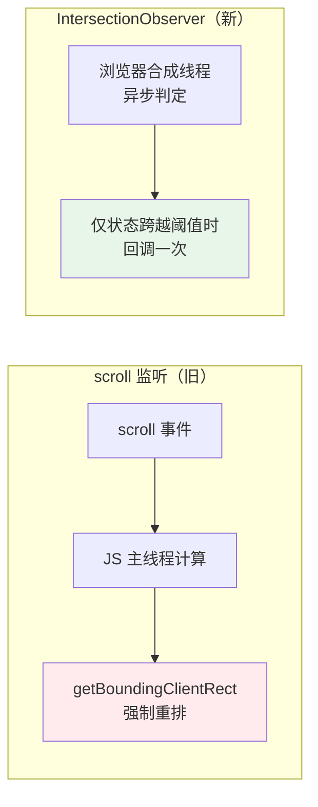
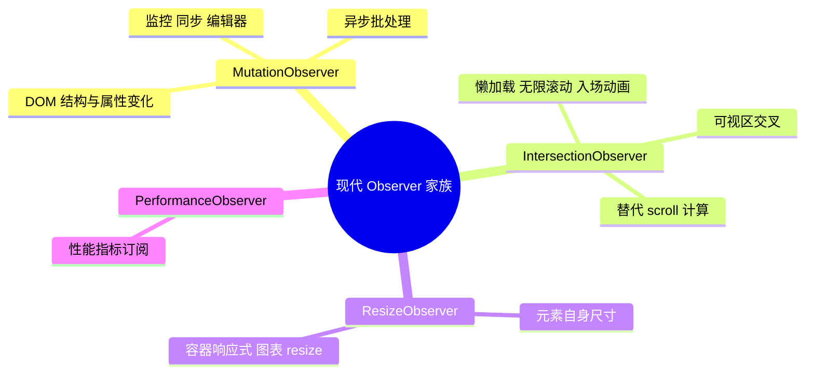

# 03 - DOM 高级：MutationObserver

> 前置：[[前端开发/04-DOM与交互/HTML-DOM/02-DOM操作与事件|DOM 操作与事件]]。前两章是"主动操作 DOM"，本章换成"被动监听 DOM 变化"的观察者视角——四个 Observer 是现代浏览器替代各类 hack 的官方方案。

---

## 1. 为什么需要 MutationObserver

在它出现之前，想感知 DOM 被改动只有两条烂路：轮询（setInterval 反复查 DOM）或监听已废弃的 Mutation Events（性能极差，每次变更同步触发）。MutationObserver 于 2012 年进入标准，核心优势：

1. **异步批处理**：DOM 变更后不立刻回调，而是等微任务时机把一批变更打包送达，避免"改一次触发一次"的性能雪崩。
2. **精细订阅**：只关心子节点变化就只订 childList，无关变动不打扰你。



## 2. MutationObserver 基本用法

```javascript
const target = document.querySelector("#watch-zone");

const observer = new MutationObserver((mutations, obs) => {
  for (const m of mutations) {
    if (m.type === "childList") {
      console.log("新增节点:", m.addedNodes);
      console.log("移除节点:", m.removedNodes);
    }
    if (m.type === "attributes") {
      console.log(`属性 ${m.attributeName} 变了`, m.oldValue);
    }
  }
});

observer.observe(target, {
  childList: true,      // 监听子节点增删
  attributes: true,     // 监听属性变化
  subtree: true,        // 连子孙一起看（默认只看直接子级）
  attributeOldValue: true,   // 回调里可拿到旧值
  characterData: true,  // 监听文本内容变化
  characterDataOldValue: true,
});

// observer.disconnect();       // 停止观察
// observer.takeRecords();      // 手动取走积压的记录并清空队列
```

配置项组合表：

| 配置 | 含义 | 必须搭配 |
|------|------|----------|
| childList | 子节点增删移位 | - |
| attributes | 属性增删改 | - |
| characterData | 文本节点内容变化 | 目标须为文本节点或配合 subtree |
| subtree | 扩大到整个子树 | - |
| attributeOldValue / characterDataOldValue | 回调携带旧值 | 对应开关需开启 |
| attributeFilter: ["class","style"] | 只盯指定属性 | attributes 开启时生效 |

两个易错点：characterData 只覆盖**已有文本节点的值变化**，用 innerHTML 替换整段 HTML 属于 childList 事件；回调拿到的 mutations 里，同一元素连续改三次 class 会产生三条记录，需要自己去重。

### 2.1 一个完整的调试工具：谁在动我的 DOM

排查第三方脚本乱改页面时的利器：

```javascript
function auditMutations(root = document.body) {
  const log = [];
  new MutationObserver((muts) => {
    for (const m of muts) {
      log.push({
        type: m.type,
        target: m.target.nodeName + (m.target.className ? `.${m.target.className}` : ""),
        added: m.addedNodes.length,
        removed: m.removedNodes.length,
        attr: m.attributeName ?? "",
        time: performance.now().toFixed(1),
      });
    }
  }).observe(root, {
    childList: true, attributes: true, subtree: true,
    attributeOldValue: true, characterData: true,
  });
  return log;
}
const mutationLog = auditMutations();
// 之后任何脚本对页面的改动都会进日志，控制台随时查看
```

## 3. 应用场景一：第三方脚本监控

广告脚本、客服组件、埋点 SDK 经常偷偷往 body 里塞 iframe 或改你的样式。监控 + 自动清理：

```javascript
const guard = new MutationObserver((muts) => {
  for (const m of muts) {
    for (const node of m.addedNodes) {
      if (!(node instanceof HTMLElement)) continue;
      // 拦截可疑注入：非自家域名的全屏容器
      if (node.tagName === "DIV" && node.id.startsWith("third-party-ad")) {
        node.remove();
        console.warn("[guard] 已拦截第三方注入", node.id);
      }
    }
    // 拦截对关键元素的属性篡改
    if (m.type === "attributes"
        && m.target.matches("#app-header")
        && m.attributeName === "style") {
      m.target.removeAttribute("style");
    }
  }
});
guard.observe(document.body, { childList: true, subtree: true, attributes: true });
```

注意防误伤：先确认注入来源再删，否则可能误杀自己的框架渲染。Vue/React 开发中**不要**对自己管理的容器做 childList 清理，会和虚拟 DOM 打架。

## 4. 应用场景二：无障碍自动播报

屏幕阅读器依赖 aria-live 区域的内容更新播报消息。用 MutationObserver 可以把任何区域的变化自动转发到播报区：

```javascript
const announcer = document.querySelector("#sr-live"); // aria-live="polite"

function autoAnnounce(sourceSelector) {
  const source = document.querySelector(sourceSelector);
  new MutationObserver(() => {
    // 把任务列表的最新状态读给视障用户
    const done = source.querySelectorAll("li.done").length;
    const total = source.querySelectorAll("li").length;
    announcer.textContent = `已完成 ${done} 项，共 ${total} 项`;
  }).observe(source, { subtree: true, childList: true, attributes: true, attributeFilter: ["class"] });
}

autoAnnounce("#todo-list");
```

这比在每个业务函数里手写播报调用干净得多——数据变了 UI 自然变，播报跟着 DOM 走，单一事实来源。

## 5. 应用场景三：富文本编辑器同步

contenteditable 区域被用户和浏览器同时修改，无法用普通事件可靠追踪。MutationObserver 把变更流转成结构化数据，供协同、撤销栈或保存逻辑消费：

```javascript
class EditorSync {
  constructor(el, onChange) {
    this.el = el;
    this.onChange = onChange;
    this.observer = new MutationObserver((muts) => this.collect(muts));
    this.pending = false;
  }

  start() {
    this.observer.observe(this.el, {
      childList: true, characterData: true, subtree: true,
    });
  }

  collect(muts) {
    // 批处理：把同一帧内的多次变更合并成一次 onChange，
    // 避免每敲一个字就触发一次保存
    if (this.pending) return;
    this.pending = true;
    queueMicrotask(() => {
      this.pending = false;
      this.onChange(this.el.innerHTML);
    });
  }
}

new EditorSync(document.querySelector("#editor"), (html) => {
  console.log("草稿自动保存:", html.slice(0, 30));
}).start();
```

## 6. IntersectionObserver：可视区交叉检测

回答一个高频问题："目标元素和视口相交了吗？比例多少？"传统做法要监听 scroll 并手动 getBoundingClientRect 计算，主线程压力大且容易抖动。IntersectionObserver 把计算下沉到浏览器合成阶段：



```javascript
const io = new IntersectionObserver((entries) => {
  for (const entry of entries) {
    entry.isIntersecting;          // 是否可见
    entry.intersectionRatio;       // 可见比例 0~1
    entry.intersectionRect;        // 相交区域矩形
    entry.target;                  // 是哪个元素
  }
}, {
  root: null,        // null = 视口；也可指定滚动容器
  rootMargin: "0px", // 类似 CSS margin 扩大/缩小判定区
  threshold: [0, 0.5, 1], // 在这些比例点各触发一次
});

io.observe(document.querySelector(".ad-box"));
```

## 7. 三大经典应用

### 7.1 图片懒加载标准实现

```html


```

```javascript
const lazyIo = new IntersectionObserver((entries, obs) => {
  for (const entry of entries) {
    if (!entry.isIntersecting) continue;
    const img = entry.target;
    img.src = img.dataset.src;   // 进入视口才真正发起请求
    img.removeAttribute("data-src");
    img.addEventListener("load", () => img.classList.add("loaded"));
    obs.unobserve(img);          // 加载完不再观察
  }
}, { rootMargin: "200px 0px" }); // 提前 200px 预加载，体验更顺滑

document.querySelectorAll("img.lazy").forEach((img) => lazyIo.observe(img));
```

rootMargin 提前量是体验关键：等完全进入视口才开始下载，用户会看到白块。

### 7.2 无限滚动

```javascript
const sentinel = document.querySelector("#load-more-sentinel");

const moreIo = new IntersectionObserver(async ([entry]) => {
  if (!entry.isIntersecting || loading) return;
  loading = true;
  const items = await fetchNextPage(); // 接口请求见 Fetch API 章
  renderItems(items);
  loading = false;
  if (items.length === 0) {
    moreIo.disconnect();               // 没有下一页就停
    sentinel.textContent = "没有更多了";
  }
}, { rootMargin: "400px" });

moreIo.observe(sentinel); // 哨兵元素放在列表末尾
```

### 7.3 inview 入场动画

```css
.reveal { opacity: 0; transform: translateY(24px); transition: all .6s ease; }
.reveal.visible { opacity: 1; transform: none; }
```

```javascript
const animIo = new IntersectionObserver((entries) => {
  for (const e of entries) {
    e.target.classList.toggle("visible", e.isIntersecting);
    if (e.isIntersecting && e.intersectionRatio > 0.3) {
      animIo.unobserve(e.target); // 动画只播一次
    }
  }
}, { threshold: [0, 0.3] });

document.querySelectorAll(".reveal").forEach((el) => animIo.observe(el));
```

## 8. ResizeObserver：元素尺寸响应式

window.resize 只能感知窗口大小；ResizeObserver 感知**任意元素自身**的尺寸变化，包括布局调整、侧栏折叠导致的间接变化：

```javascript
const ro = new ResizeObserver((entries) => {
  for (const entry of entries) {
    const { inlineSize, blockSize } = entry.contentBoxSize[0];
    console.log(`宽度 ${inlineSize}px`);
  }
});
ro.observe(document.querySelector(".dashboard-card"));
```

典型场景：卡片内图表随容器伸缩。ECharts 实例必须手动调用 resize() 重绘，以前靠 window resize 猜测，现在精确监听容器即可，具体整合见 [[前端开发/06-数据可视化/ECharts/03-交互与响应式|交互与响应式]]：

```javascript
const chartDom = document.querySelector("#chart");
const roChart = new ResizeObserver(() => echarts.getInstanceByDom(chartDom)?.resize());
roChart.observe(chartDom);
```

顺带一句 PerformanceObserver：同样的观察者 API 形态，用于订阅性能条目（LCP、长任务等），属于性能优化专题的工具，此处知道存在即可。

## 9. 实战：零依赖图片懒加载组件

把第 7 节的片段升级成完整组件：支持占位背景、加载失败降级、原生 loading 属性探测回退：

```html
<!DOCTYPE html>
<html lang="zh">
<head>
<meta charset="UTF-8">
<style>
  .lazy-img {
    display: block; width: 100%; height: 240px;
    background: linear-gradient(110deg, #eceff1 8%, #f5f7f8 18%, #eceff1 33%);
    background-size: 200% 100%;
    animation: shimmer 1.4s infinite linear;
    object-fit: cover; opacity: 0; transition: opacity .4s;
  }
  .lazy-img.loaded { opacity: 1; animation: none; background: none; }
  .lazy-img.failed::after {
    content: "加载失败"; display: grid; place-items: center;
    height: 100%; color: #90a4ae; font-size: 14px;
  }
  @keyframes shimmer { to { background-position-x: -200%; } }
</style>
</head>
<body>
<div id="gallery"></div>

<script>
  class LazyGallery {
    constructor(selector, urls, options = {}) {
      this.root = document.querySelector(selector);
      this.urls = urls;
      this.preloadMargin = options.preloadMargin ?? "300px";
      this.io = new IntersectionObserver(
        (entries) => this.onIntersect(entries),
        { rootMargin: this.preloadMargin }
      );
      this.render();
    }

    render() {
      const frag = document.createDocumentFragment();
      for (const url of this.urls) {
        const img = document.createElement("img");
        img.className = "lazy-img";
        img.dataset.src = url;
        img.alt = "画廊图片";
        frag.appendChild(img);
        this.io.observe(img);
      }
      this.root.appendChild(frag);
    }

    onIntersect(entries) {
      for (const entry of entries) {
        if (!entry.isIntersecting) continue;
        this.load(entry.target);
      }
    }

    load(img) {
      this.io.unobserve(img);
      const loader = new Image();
      loader.onload = () => {
        img.src = img.dataset.src;
        img.classList.add("loaded");
      };
      loader.onerror = () => img.classList.add("failed");
      loader.src = img.dataset.src;
    }

    destroy() { this.io.disconnect(); }
  }

  const gallery = new LazyGallery("#gallery", [
    "https://picsum.photos/id/10/600/360",
    "https://picsum.photos/id/20/600/360",
    "https://picsum.photos/id/30/600/360",
    "https://picsum.photos/id/40/600/360",
  ]);
</script>
</body>
</html>
```

设计说明：先用隐藏 Image 预解码，成功后才赋给真实 src，避免半张图渐显；失败态用伪元素展示文案；destroy 方法保证 SPA 卸载时不泄漏 observer。

---

## 10. 小结



选型口诀：**变没变找 Mutation，看得见找 Intersection，宽高变找 Resize**。三者都返回观察器实例，记得在组件销毁时 disconnect。
