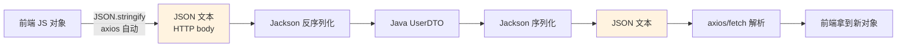
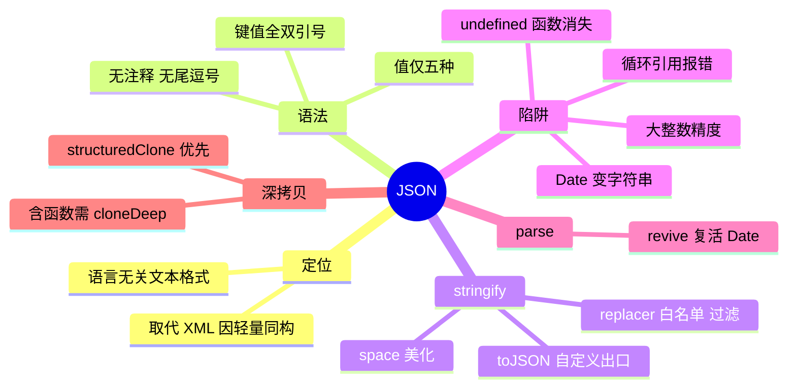

# 01 - JSON 基础

> 前置：[[前端开发/03-JS框架|无]]（可独立阅读）。JSON 是前后端对话的通用语言。本章讲清它的语法边界、序列化/反序列化的全部参数与陷阱，以及它在前后端契约中的位置。

---

## 1. JSON 定位：语言无关的数据交换格式

JSON（JavaScript Object Notation）2001 年由 Douglas Crockford 提出，名字来自 JS 对象字面量，但**它是独立于任何语言的文本格式**——Java、Python、Go、Rust 都有成熟的解析器。

### 1.1 为什么取代了 XML

2005 年前 Web API 的主流是 XML，对比一段等价数据：

```xml
<!-- XML：标签开销大、解析需要 DOM/SAX、JS 处理繁琐 -->
<user>
  <name>张三</name>
  <roles>
    <role>admin</role>
    <role>editor</role>
  </roles>
</user>
```

```json
{
  "name": "张三",
  "roles": ["admin", "editor"]
}
```

| 维度 | XML | JSON |
|------|-----|------|
| 冗余度 | 每个值两套标签 | 键只写一次 |
| 浏览器解析 | DOMParser 得到文档树 | JSON.parse 一行 |
| 与 JS 对象互转 | 手写映射 | 天然同构 |
| 表达数组/嵌套 | 约定俗成不统一 | 原生支持 |

JS 拿到 JSON 字符串一次 parse 就得到可用对象——这个"零阻抗"体验是它获胜的根本原因。

## 2. 语法六规则

JSON 比 JS 对象字面量**严格得多**，六条规则全部违反即非法：

1. **键必须双引号**：`{name: 1}` 非法，`{"name": 1}` 合法。
2. **字符串必须双引号**：单引号 `{'a': 1}` 非法。
3. **无注释**：`//` 和 `/* */` 都不允许（配置文件场景催生了 JSON5/JSONC 变体）。
4. **顶层只能是五种值**：对象 `{}`、数组 `[]`、字符串、数字、布尔、null（严格说是六种值类型，容器两种）。
5. **值类型仅五种**：string、number（十进制，禁十六进制/NaN/Infinity）、boolean、null、以及由它们构成的 object/array。**没有 undefined、没有函数、没有 Date、没有 Symbol**。
6. **尾逗号禁止**：`[1, 2, ]` 非法。

```javascript
// 这些都是合法 JS 但非法 JSON：
const bad = {
  name: '张三',        // 单引号
  age: 0x18,          // 十六进制
  greet() {},         // 函数
  extra: undefined,   // undefined
};
// JSON.parse 会直接抛 SyntaxError
```

## 3. JSON.stringify：三参数全解

```javascript
JSON.stringify(value, replacer, space)
// 返回 JSON 字符串；值为 undefined/function/symbol 时返回 undefined
```

### 3.1 第三参 space：美化输出

```javascript
const user = { id: 1, name: "张三", roles: ["admin"] };

JSON.stringify(user);
// '{"id":1,"name":"张三","roles":["admin"]}'

JSON.stringify(user, null, 2);   // 缩进 2 空格，日志调试必备
JSON.stringify(user, null, "\t");// 用 Tab
JSON.stringify(user, null, 4);   // 最大到 10，超出按 10
```

### 3.2 第二参 replacer：过滤与变换

数组形式——白名单键：

```javascript
const u = { id: 1, name: "张三", password: "secret", email: "z@ex.com" };

// 只序列化白名单字段，密码不会泄露给前端日志
JSON.stringify(u, ["id", "name", "email"]);
// '{"id":1,"name":"张三","email":"z@ex.com"}'
```

函数形式——每个键值经过你处理：

```javascript
const record = { name: "库存表", count: 1234567, price: 19.98765 };

const json = JSON.stringify(record, (key, value) => {
  if (typeof value === "number") {
    if (key === "price") return value.toFixed(2); // 金额固定两位
    if (String(value).length > 8) return String(value); // 大数防精度丢失
  }
  return value;
});
console.log(json);
// '{"name":"库存表","count":1234567,"price":"19.99"}'
```

注意 replacer 的第一个调用 key 是空串（代表根对象），且 toFixed 返回的是字符串——序列化结果里 price 变成了带引号的字符串，跨语言消费时要注意类型约定。

### 3.3 toJSON 方法：对象自定义出口

被序列化对象若定义了 toJSON，stringify 会优先用它：

```javascript
class Money {
  constructor(cents) { this.cents = cents; }
  toJSON() { return (this.cents / 100).toFixed(2); } // 序列化为 "12.50"
}
console.log(JSON.stringify({ price: new Money(1250) }));
// '{"price":"12.50"}'
```

## 4. 序列化五大陷阱

### 4.1 undefined 与函数静默消失

```javascript
const obj = { a: undefined, b: () => {}, c: null, d: NaN, e: Infinity };

JSON.stringify(obj);
// '{"c":null,"d":null,"e":Infinity 转为 null}'
// 实际输出：'{"c":null,"d":null,"e":null}'
// a、b 直接消失，不报错！
```

对象属性里的 undefined 是**静默丢弃**；数组里的 undefined 却变成 null：

```javascript
JSON.stringify([undefined, 1]); // '[null,1]' —— 数组保位
```

### 4.2 Date 转 ISO 字符串

```javascript
const log = { time: new Date("2026-08-24T10:00:00+08:00") };
JSON.stringify(log);
// '{"time":"2026-08-24T02:00:00.000Z"}' —— UTC 的 ISO 格式

// parse 回来得到的是字符串还是 Date？
const back = JSON.parse(JSON.stringify(log));
back.time instanceof Date; // false！只是普通字符串
new Date(back.time);       // 需要手动还原
```

### 4.3 循环引用直接报错

```javascript
const a = {};
a.self = a;
JSON.stringify(a);
// TypeError: Converting circular structure to JSON —— 无 try/catch 就是崩溃
```

### 4.4 大整数精度丢失

```javascript
// JS Number 安全整数上限 2^53 - 1
const order = { id: 9007199254740993 };
JSON.stringify(order); // '{"id":9007199254740992}' —— 已经悄悄变了！

// 后端发来的雪花 ID 若超范围必须在字符串层面处理，
// Java 侧常见做法是 Long 转 String 再下发（见 Spring MVC 章）
```

### 4.5 Symbol 键完全忽略

```javascript
const k = Symbol("id");
JSON.stringify({ [k]: 42 }); // '{}' —— 一个字符都不剩
```

## 5. JSON.parse 与 revive 第二参

```javascript
JSON.parse(text, reviver)
// reviver(key, value) 对每个键值做最后加工，返回什么就是什么
```

经典应用：把 ISO 时间字符串复活为 Date：

```javascript
function dateReviver(key, value) {
  if (typeof value === "string"
      && /^\d{4}-\d{2}-\d{2}T\d{2}:\d{2}:\d{2}/.test(value)) {
    const d = new Date(value);
    return isNaN(d.getTime()) ? value : d;
  }
  return value;
}

const data = JSON.parse('{"created":"2026-08-24T02:00:00.000Z"}', dateReviver);
data.created instanceof Date; // true
data.created.getFullYear();   // 直接用 Date 方法
```

reviver 从最深层向外执行（与 stringify 的 replacer 方向相反），最后以空串 key 调用一次处理根对象。

## 6. structuredClone vs JSON 深拷贝

`JSON.parse(JSON.stringify(obj))` 曾是深拷贝的标准 hack，ES2022 的 `structuredClone` 提供了正确答案：

```javascript
const source = {
  date: new Date(),
  map: new Map([["k", "v"]]),
  set: new Set([1, 2]),
  nested: { deep: [1, { x: 1 }] },
  fn: () => {},
  missing: undefined,
};

/* ---------- JSON 法 ---------- */
const viaJson = JSON.parse(JSON.stringify(source));
viaJson.date instanceof Date;      // false，变字符串
viaJson.map instanceof Map;        // false，变 {} （Map 无法表示）
viaJson.set;                       // {}
viaJson.fn;                        // undefined，函数丢了
viaJson.missing;                   // undefined 属性整个消失
viaJson.nested !== source.nested;  // true，这点是对的

/* ---------- structuredClone 法 ---------- */
const viaClone = structuredClone(source);
viaClone.date instanceof Date;     // true
viaClone.map instanceof Map;       // true
viaClone.set instanceof Set;       // true
viaClone.fn;                       // 报错？不——函数不能克隆，直接 TypeError！
```

对比总结表：

| 能力/限制 | JSON 法 | structuredClone |
|-----------|---------|-----------------|
| Date / Map / Set / RegExp / ArrayBuffer | 全部损坏或丢失 | 正确保留 |
| 循环引用 | 直接报错 | 支持 |
| 函数 | 静默丢弃 | 抛 DataCloneError |
| undefined 属性 | 丢失 | 保留 |
| 性能 | 双重转换较慢 | 原生实现更快 |

结论：纯数据（接口返回的对象树）两者皆可；含特殊类型一律 structuredClone；含函数则谁也不行，需要 lodash.cloneDeep 或手写递归。

## 7. JSON 在前后端契约中的位置



两侧各有一套序列化引擎：前端 stringify/parse，Java 侧 Jackson（Spring MVC 默认集成，注解如 @JsonIgnore/@JsonFormat 控制行为，见 [[java/3工程化/07_Spring MVC|Spring MVC]]）。契约设计的共识规则：

1. **时间戳/日期统一 ISO 8601 字符串**，避免毫秒数与时区歧义。
2. **ID 用字符串传输**，规避 JS 大整数精度问题（第 4.4 节）。
3. **枚举传语义明确的字符串**而非魔法数字。
4. 字段命名统一驼峰或统一下划线，一侧做好映射。

---

## 8. 实用场景：localStorage 与安全解析

### 8.1 localStorage 天然只存字符串

存对象必须过一道 stringify，读回来必须 parse，两步都可能有异常：

```javascript
// 直接存对象会得到 "[object Object]"——经典事故
localStorage.setItem("cart", { count: 1 });        // 错误用法
localStorage.setItem("cart", JSON.stringify({ count: 1 })); // 正确

// 读取侧：值可能不存在、可能被用户篡改成非法 JSON
function readStorage(key, fallback = null) {
  try {
    const raw = localStorage.getItem(key);
    return raw === null ? fallback : JSON.parse(raw);
  } catch {
    console.warn(`存储数据损坏: ${key}，已重置`);
    localStorage.removeItem(key);
    return fallback;
  }
}

const cart = readStorage("cart", { count: 0 });
```

try/catch 不是多余——localStorage 是用户可以随意编辑的明文文件，线上"SyntaxError: Unexpected token"的崩溃大多来自这里。

### 8.2 调试输出美化

```javascript
console.log(JSON.stringify(complexObj, null, 2)); // 展开嵌套结构
// 或直接 console.table(list) 看数组
```

注意 stringify 会丢 undefined 和函数（第 4 节），调试日志里字段"凭空消失"时先想到这一点。

## 9. 实战：通用 safeClone 函数

综合本章知识，写一个带降级策略的深拷贝工具：

```javascript
/**
 * 安全深拷贝：
 * 1. 无特殊类型走 structuredClone（快且正确）
 * 2. 探测到函数等不可克隆成员时降级为 JSON 法并警告
 * 3. 循环引用由 structuredClone 原生处理
 */
function safeClone(value) {
  if (value === null || typeof value !== "object") return value; // 原值直返

  const hasSpecial =
    containsType(value, "function") ||
    Object.values(flatOwn(value)).some((v) => v === undefined);

  if (!hasSpecial) {
    try {
      return structuredClone(value); // Date Map Set 循环引用全支持
    } catch {
      /* 某些宿主环境不支持时落到 JSON 分支 */
    }
  }

  console.warn("[safeClone] 含函数/undefined，已退化为 JSON 拷贝");
  return JSON.parse(JSON.stringify(value));
}

function flatOwn(obj, acc = {}, prefix = "") {
  for (const [k, v] of Object.entries(obj)) {
    const path = prefix ? `${prefix}.${k}` : k;
    if (v !== null && typeof v === "object") flatOwn(v, acc, path);
    else acc[path] = v;
  }
  return acc;
}

function containsType(obj, type) {
  let found = false;
  (function walk(o) {
    for (const v of Object.values(o ?? {})) {
      if (typeof v === type) { found = true; return; }
      if (v && typeof v === "object") walk(v);
    }
  })(obj);
  return found;
}

/* ---------- 行为验证 ---------- */
const plain = { at: new Date(), tags: new Set(["a"]) };
safeClone(plain).at instanceof Date; // true，走了 structuredClone

const legacy = { cb: () => {}, name: "old" };
safeClone(legacy); // 警告后返回 { name: "old" }，cb 被丢弃但流程不崩
```

生产建议：能控制数据形状的项目直接统一 structuredClone；只有维护遗留系统、无法保证入参纯净时才需要这类防御层。

---

## 10. 小结



一句话收束：JSON 很简单，但 stringify 的静默丢弃和精度陷阱让它成为线上事故常客——凡是"存下来再读回来"的数据，先想一遍序列化会丢什么。
